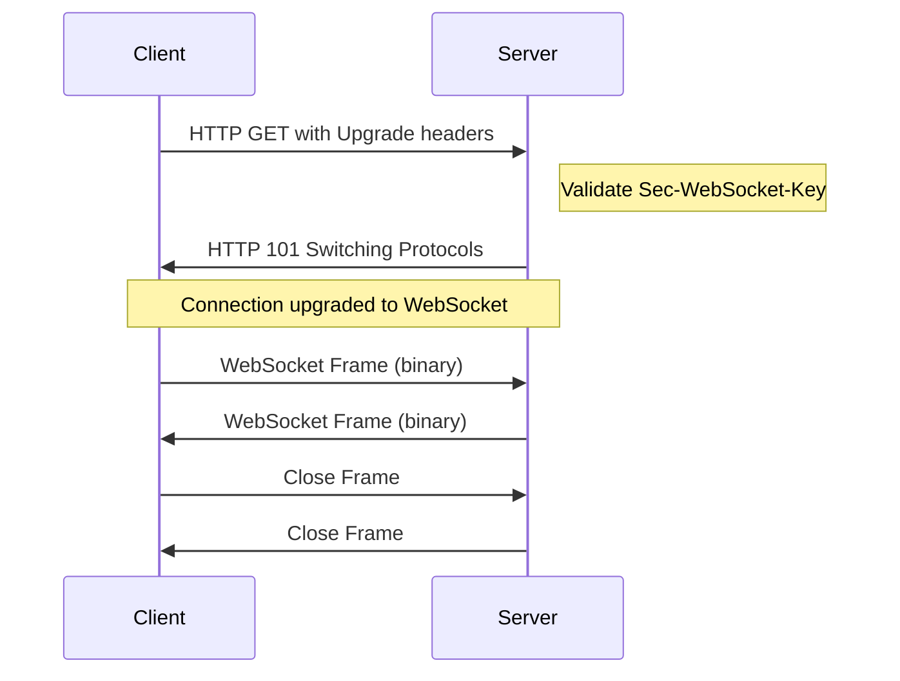

# How to Create WebSocket Servers from Scratch

Author: [nawazdhandala](https://www.github.com/nawazdhandala)

Tags: WebSocket, Node.js, Real-time, Server, Networking

Description: Learn how to build WebSocket servers from the ground up using raw Node.js, understanding the protocol, handshake process, and frame parsing without external libraries.

---

WebSockets provide full-duplex communication over a single TCP connection. While libraries like `ws` and `socket.io` make this easy, building a WebSocket server from scratch teaches you exactly how the protocol works. This guide walks through implementing a WebSocket server using only Node.js built-in modules.

## How WebSocket Protocol Works

The WebSocket protocol starts with an HTTP upgrade request. The client sends a standard HTTP request with specific headers asking to switch to WebSocket protocol. If the server agrees, it responds with a 101 status code, and both sides switch to binary WebSocket frames.



## The WebSocket Handshake

The handshake is the first step. The client sends an HTTP request with these required headers:

- `Upgrade: websocket` - Requests protocol upgrade
- `Connection: Upgrade` - Indicates connection header fields
- `Sec-WebSocket-Key` - Base64-encoded random value for validation
- `Sec-WebSocket-Version: 13` - Protocol version (always 13)

The server creates a response by concatenating the client's key with a magic GUID, hashing it with SHA-1, and encoding in base64. This proves the server understands WebSocket protocol.

```javascript
const http = require('http');
const crypto = require('crypto');

// Magic GUID defined in RFC 6455 - used for handshake validation
const WEBSOCKET_MAGIC_GUID = '258EAFA5-E914-47DA-95CA-C5AB0DC85B11';

// Create a basic HTTP server that will handle the upgrade
const server = http.createServer((req, res) => {
  // Regular HTTP requests get a simple response
  res.writeHead(200, { 'Content-Type': 'text/plain' });
  res.end('WebSocket server running. Connect via ws://');
});

// Handle the WebSocket upgrade request
server.on('upgrade', (req, socket, head) => {
  // Verify this is actually a WebSocket upgrade request
  if (req.headers['upgrade'] !== 'websocket') {
    socket.end('HTTP/1.1 400 Bad Request\r\n\r\n');
    return;
  }

  // Extract the client's key from headers
  const clientKey = req.headers['sec-websocket-key'];
  if (!clientKey) {
    socket.end('HTTP/1.1 400 Bad Request\r\n\r\n');
    return;
  }

  // Generate the accept key by combining client key with magic GUID
  // Then hash with SHA-1 and encode as base64
  const acceptKey = crypto
    .createHash('sha1')
    .update(clientKey + WEBSOCKET_MAGIC_GUID)
    .digest('base64');

  // Send the handshake response
  // 101 means "Switching Protocols"
  const responseHeaders = [
    'HTTP/1.1 101 Switching Protocols',
    'Upgrade: websocket',
    'Connection: Upgrade',
    `Sec-WebSocket-Accept: ${acceptKey}`,
    '', // Empty line marks end of headers
    ''
  ].join('\r\n');

  socket.write(responseHeaders);

  console.log('WebSocket connection established');

  // Now the connection is upgraded - handle WebSocket frames
  handleWebSocketConnection(socket);
});

server.listen(8080, () => {
  console.log('WebSocket server listening on port 8080');
});
```

## Understanding WebSocket Frames

After the handshake, all communication happens through WebSocket frames. Each frame has a specific binary structure:

| Byte | Bits | Field | Description |
|------|------|-------|-------------|
| 0 | 0 | FIN | 1 if this is the final fragment |
| 0 | 1-3 | RSV1-3 | Reserved for extensions (usually 0) |
| 0 | 4-7 | Opcode | Type of frame |
| 1 | 0 | MASK | 1 if payload is masked (client to server) |
| 1 | 1-7 | Payload Length | Length of payload data |
| 2-3 or 2-9 | - | Extended Length | If length > 125 |
| Next 4 bytes | - | Masking Key | Only if MASK bit is 1 |
| Remaining | - | Payload Data | The actual message |

The opcodes define what type of frame this is:

| Opcode | Frame Type |
|--------|------------|
| 0x0 | Continuation |
| 0x1 | Text |
| 0x2 | Binary |
| 0x8 | Close |
| 0x9 | Ping |
| 0xA | Pong |

## Parsing WebSocket Frames

Parsing frames requires reading the binary data byte by byte. Client messages are always masked (XOR'd with a 4-byte key), so we need to unmask them.

```javascript
// Frame parsing constants
const OPCODES = {
  CONTINUATION: 0x0,
  TEXT: 0x1,
  BINARY: 0x2,
  CLOSE: 0x8,
  PING: 0x9,
  PONG: 0xA
};

function parseWebSocketFrame(buffer) {
  // Need at least 2 bytes for the header
  if (buffer.length < 2) {
    return null;
  }

  // First byte contains FIN flag and opcode
  const firstByte = buffer[0];
  const fin = (firstByte & 0x80) !== 0;  // Check if FIN bit is set
  const opcode = firstByte & 0x0F;        // Last 4 bits are opcode

  // Second byte contains MASK flag and payload length
  const secondByte = buffer[1];
  const isMasked = (secondByte & 0x80) !== 0;  // Check if MASK bit is set
  let payloadLength = secondByte & 0x7F;       // Last 7 bits are length

  let offset = 2;  // Current position in buffer

  // Handle extended payload length
  if (payloadLength === 126) {
    // Next 2 bytes are the actual length (16-bit unsigned)
    if (buffer.length < 4) return null;
    payloadLength = buffer.readUInt16BE(2);
    offset = 4;
  } else if (payloadLength === 127) {
    // Next 8 bytes are the actual length (64-bit unsigned)
    // JavaScript can't handle 64-bit ints well, so we use BigInt
    if (buffer.length < 10) return null;
    const bigLength = buffer.readBigUInt64BE(2);
    // Convert to number (safe for reasonable message sizes)
    payloadLength = Number(bigLength);
    offset = 10;
  }

  // Extract masking key if present (always present for client messages)
  let maskingKey = null;
  if (isMasked) {
    if (buffer.length < offset + 4) return null;
    maskingKey = buffer.slice(offset, offset + 4);
    offset += 4;
  }

  // Check if we have the complete payload
  if (buffer.length < offset + payloadLength) {
    return null;  // Incomplete frame, need more data
  }

  // Extract payload data
  let payload = buffer.slice(offset, offset + payloadLength);

  // Unmask the payload if it was masked
  if (isMasked && maskingKey) {
    payload = unmaskPayload(payload, maskingKey);
  }

  return {
    fin,
    opcode,
    payload,
    totalLength: offset + payloadLength  // How many bytes this frame consumed
  };
}

// XOR each byte with the corresponding masking key byte
function unmaskPayload(payload, maskingKey) {
  const unmasked = Buffer.alloc(payload.length);
  for (let i = 0; i < payload.length; i++) {
    // Masking key repeats every 4 bytes (i % 4)
    unmasked[i] = payload[i] ^ maskingKey[i % 4];
  }
  return unmasked;
}
```

## Creating WebSocket Frames

When sending data to the client, we need to create properly formatted frames. Server-to-client messages are not masked.

```javascript
function createWebSocketFrame(data, opcode = OPCODES.TEXT) {
  // Convert string to buffer if needed
  const payload = Buffer.isBuffer(data) ? data : Buffer.from(data);
  const payloadLength = payload.length;

  // Calculate how many bytes we need for the length field
  let lengthBytes;
  let extendedPayloadLength;

  if (payloadLength <= 125) {
    // Length fits in 7 bits
    lengthBytes = 0;
    extendedPayloadLength = null;
  } else if (payloadLength <= 65535) {
    // Need 2 extra bytes for 16-bit length
    lengthBytes = 2;
    extendedPayloadLength = payloadLength;
  } else {
    // Need 8 extra bytes for 64-bit length
    lengthBytes = 8;
    extendedPayloadLength = payloadLength;
  }

  // Allocate buffer: 2 header bytes + length bytes + payload
  const frameLength = 2 + lengthBytes + payloadLength;
  const frame = Buffer.alloc(frameLength);

  // First byte: FIN flag (1) and opcode
  frame[0] = 0x80 | opcode;  // 0x80 sets FIN bit

  // Second byte: MASK flag (0 for server) and payload length
  if (payloadLength <= 125) {
    frame[1] = payloadLength;
  } else if (payloadLength <= 65535) {
    frame[1] = 126;  // Indicates 16-bit length follows
    frame.writeUInt16BE(payloadLength, 2);
  } else {
    frame[1] = 127;  // Indicates 64-bit length follows
    frame.writeBigUInt64BE(BigInt(payloadLength), 2);
  }

  // Copy payload after header
  payload.copy(frame, 2 + lengthBytes);

  return frame;
}

// Helper to create a close frame with optional status code and reason
function createCloseFrame(code = 1000, reason = '') {
  const reasonBuffer = Buffer.from(reason);
  const payload = Buffer.alloc(2 + reasonBuffer.length);
  payload.writeUInt16BE(code, 0);  // Status code
  reasonBuffer.copy(payload, 2);    // Reason text
  return createWebSocketFrame(payload, OPCODES.CLOSE);
}

// Helper to create a pong frame (response to ping)
function createPongFrame(payload) {
  return createWebSocketFrame(payload, OPCODES.PONG);
}
```

## Handling Connections

Now let's put it all together with a proper connection handler that processes incoming frames and manages the connection lifecycle.

```javascript
function handleWebSocketConnection(socket) {
  let buffer = Buffer.alloc(0);  // Accumulate incoming data

  // Handle incoming data
  socket.on('data', (data) => {
    // Append new data to buffer
    buffer = Buffer.concat([buffer, data]);

    // Process all complete frames in the buffer
    while (buffer.length > 0) {
      const frame = parseWebSocketFrame(buffer);

      if (!frame) {
        // Incomplete frame - wait for more data
        break;
      }

      // Remove processed frame from buffer
      buffer = buffer.slice(frame.totalLength);

      // Handle the frame based on its opcode
      handleFrame(socket, frame);
    }
  });

  // Handle connection close
  socket.on('close', () => {
    console.log('Connection closed');
  });

  // Handle errors
  socket.on('error', (err) => {
    console.error('Socket error:', err.message);
  });
}

function handleFrame(socket, frame) {
  switch (frame.opcode) {
    case OPCODES.TEXT:
      // Text message received
      const message = frame.payload.toString('utf8');
      console.log('Received text:', message);

      // Echo the message back
      const response = createWebSocketFrame(`Echo: ${message}`);
      socket.write(response);
      break;

    case OPCODES.BINARY:
      // Binary message received
      console.log('Received binary:', frame.payload.length, 'bytes');
      break;

    case OPCODES.PING:
      // Respond to ping with pong
      console.log('Received ping');
      const pong = createPongFrame(frame.payload);
      socket.write(pong);
      break;

    case OPCODES.PONG:
      // Pong received (response to our ping)
      console.log('Received pong');
      break;

    case OPCODES.CLOSE:
      // Client wants to close the connection
      console.log('Received close frame');
      // Send close frame back and close the socket
      const closeFrame = createCloseFrame(1000, 'Goodbye');
      socket.write(closeFrame);
      socket.end();
      break;

    default:
      console.log('Unknown opcode:', frame.opcode);
  }
}
```

## Complete WebSocket Server

Here's a complete implementation that you can run directly.

```javascript
const http = require('http');
const crypto = require('crypto');

const WEBSOCKET_MAGIC_GUID = '258EAFA5-E914-47DA-95CA-C5AB0DC85B11';

const OPCODES = {
  CONTINUATION: 0x0,
  TEXT: 0x1,
  BINARY: 0x2,
  CLOSE: 0x8,
  PING: 0x9,
  PONG: 0xA
};

// Store all connected clients for broadcasting
const clients = new Set();

// Parse an incoming WebSocket frame from binary data
function parseWebSocketFrame(buffer) {
  if (buffer.length < 2) return null;

  const firstByte = buffer[0];
  const fin = (firstByte & 0x80) !== 0;
  const opcode = firstByte & 0x0F;

  const secondByte = buffer[1];
  const isMasked = (secondByte & 0x80) !== 0;
  let payloadLength = secondByte & 0x7F;

  let offset = 2;

  if (payloadLength === 126) {
    if (buffer.length < 4) return null;
    payloadLength = buffer.readUInt16BE(2);
    offset = 4;
  } else if (payloadLength === 127) {
    if (buffer.length < 10) return null;
    payloadLength = Number(buffer.readBigUInt64BE(2));
    offset = 10;
  }

  let maskingKey = null;
  if (isMasked) {
    if (buffer.length < offset + 4) return null;
    maskingKey = buffer.slice(offset, offset + 4);
    offset += 4;
  }

  if (buffer.length < offset + payloadLength) return null;

  let payload = buffer.slice(offset, offset + payloadLength);

  if (isMasked && maskingKey) {
    const unmasked = Buffer.alloc(payload.length);
    for (let i = 0; i < payload.length; i++) {
      unmasked[i] = payload[i] ^ maskingKey[i % 4];
    }
    payload = unmasked;
  }

  return { fin, opcode, payload, totalLength: offset + payloadLength };
}

// Create an outgoing WebSocket frame
function createWebSocketFrame(data, opcode = OPCODES.TEXT) {
  const payload = Buffer.isBuffer(data) ? data : Buffer.from(data);
  const payloadLength = payload.length;

  let frame;
  if (payloadLength <= 125) {
    frame = Buffer.alloc(2 + payloadLength);
    frame[0] = 0x80 | opcode;
    frame[1] = payloadLength;
    payload.copy(frame, 2);
  } else if (payloadLength <= 65535) {
    frame = Buffer.alloc(4 + payloadLength);
    frame[0] = 0x80 | opcode;
    frame[1] = 126;
    frame.writeUInt16BE(payloadLength, 2);
    payload.copy(frame, 4);
  } else {
    frame = Buffer.alloc(10 + payloadLength);
    frame[0] = 0x80 | opcode;
    frame[1] = 127;
    frame.writeBigUInt64BE(BigInt(payloadLength), 2);
    payload.copy(frame, 10);
  }

  return frame;
}

// Broadcast message to all connected clients
function broadcast(message, excludeSocket = null) {
  const frame = createWebSocketFrame(message);
  for (const client of clients) {
    if (client !== excludeSocket && !client.destroyed) {
      client.write(frame);
    }
  }
}

// Handle WebSocket connection after upgrade
function handleWebSocketConnection(socket) {
  clients.add(socket);
  console.log(`Client connected. Total clients: ${clients.size}`);

  let buffer = Buffer.alloc(0);

  socket.on('data', (data) => {
    buffer = Buffer.concat([buffer, data]);

    while (buffer.length > 0) {
      const frame = parseWebSocketFrame(buffer);
      if (!frame) break;

      buffer = buffer.slice(frame.totalLength);

      switch (frame.opcode) {
        case OPCODES.TEXT:
          const message = frame.payload.toString('utf8');
          console.log('Message:', message);
          // Broadcast to all other clients
          broadcast(`User says: ${message}`, socket);
          break;

        case OPCODES.PING:
          socket.write(createWebSocketFrame(frame.payload, OPCODES.PONG));
          break;

        case OPCODES.CLOSE:
          socket.write(createWebSocketFrame(Buffer.from([0x03, 0xE8]), OPCODES.CLOSE));
          socket.end();
          break;
      }
    }
  });

  socket.on('close', () => {
    clients.delete(socket);
    console.log(`Client disconnected. Total clients: ${clients.size}`);
  });

  socket.on('error', (err) => {
    console.error('Socket error:', err.message);
    clients.delete(socket);
  });

  // Send welcome message
  socket.write(createWebSocketFrame('Welcome to the WebSocket server!'));
}

// Create HTTP server with WebSocket upgrade support
const server = http.createServer((req, res) => {
  res.writeHead(200, { 'Content-Type': 'text/html' });
  res.end(`
    <!DOCTYPE html>
    <html>
    <head><title>WebSocket Test</title></head>
    <body>
      <h1>WebSocket Test Client</h1>
      <input type="text" id="msg" placeholder="Type a message">
      <button onclick="send()">Send</button>
      <div id="log"></div>
      <script>
        const ws = new WebSocket('ws://localhost:8080');
        ws.onmessage = (e) => {
          document.getElementById('log').innerHTML += '<p>' + e.data + '</p>';
        };
        ws.onopen = () => console.log('Connected');
        ws.onclose = () => console.log('Disconnected');
        function send() {
          ws.send(document.getElementById('msg').value);
          document.getElementById('msg').value = '';
        }
      </script>
    </body>
    </html>
  `);
});

server.on('upgrade', (req, socket, head) => {
  if (req.headers['upgrade'] !== 'websocket') {
    socket.end('HTTP/1.1 400 Bad Request\r\n\r\n');
    return;
  }

  const clientKey = req.headers['sec-websocket-key'];
  if (!clientKey) {
    socket.end('HTTP/1.1 400 Bad Request\r\n\r\n');
    return;
  }

  const acceptKey = crypto
    .createHash('sha1')
    .update(clientKey + WEBSOCKET_MAGIC_GUID)
    .digest('base64');

  const headers = [
    'HTTP/1.1 101 Switching Protocols',
    'Upgrade: websocket',
    'Connection: Upgrade',
    `Sec-WebSocket-Accept: ${acceptKey}`,
    '',
    ''
  ].join('\r\n');

  socket.write(headers);
  handleWebSocketConnection(socket);
});

server.listen(8080, () => {
  console.log('Server running at http://localhost:8080');
  console.log('Open the URL in a browser to test WebSocket');
});
```

## Adding Heartbeat and Keep-Alive

Long-lived connections can silently fail. Implement ping/pong heartbeats to detect dead connections.

```javascript
const HEARTBEAT_INTERVAL = 30000;  // 30 seconds
const HEARTBEAT_TIMEOUT = 10000;   // 10 seconds to respond

function handleWebSocketConnection(socket) {
  clients.add(socket);

  // Track heartbeat state
  let isAlive = true;
  let heartbeatTimer;

  // Send ping periodically
  const pingInterval = setInterval(() => {
    if (!isAlive) {
      // Client didn't respond to last ping
      console.log('Client heartbeat timeout, closing connection');
      clearInterval(pingInterval);
      socket.destroy();
      return;
    }

    isAlive = false;  // Reset - will be set true by pong
    const pingFrame = createWebSocketFrame('', OPCODES.PING);
    socket.write(pingFrame);
  }, HEARTBEAT_INTERVAL);

  let buffer = Buffer.alloc(0);

  socket.on('data', (data) => {
    buffer = Buffer.concat([buffer, data]);

    while (buffer.length > 0) {
      const frame = parseWebSocketFrame(buffer);
      if (!frame) break;

      buffer = buffer.slice(frame.totalLength);

      switch (frame.opcode) {
        case OPCODES.PONG:
          // Client responded to our ping
          isAlive = true;
          break;

        case OPCODES.PING:
          // Client sent us a ping, respond with pong
          socket.write(createWebSocketFrame(frame.payload, OPCODES.PONG));
          break;

        // ... handle other opcodes
      }
    }
  });

  socket.on('close', () => {
    clearInterval(pingInterval);
    clients.delete(socket);
  });
}
```

## Handling Fragmented Messages

Large messages can be split across multiple frames. The first frame has the opcode, continuation frames have opcode 0, and the final frame has FIN set.

```javascript
function handleWebSocketConnection(socket) {
  let buffer = Buffer.alloc(0);
  let fragmentBuffer = [];  // Store fragments
  let fragmentOpcode = null; // Remember original opcode

  socket.on('data', (data) => {
    buffer = Buffer.concat([buffer, data]);

    while (buffer.length > 0) {
      const frame = parseWebSocketFrame(buffer);
      if (!frame) break;

      buffer = buffer.slice(frame.totalLength);

      // Handle fragmented messages
      if (frame.opcode !== OPCODES.CONTINUATION && frame.opcode < 0x8) {
        // Start of new message
        fragmentOpcode = frame.opcode;
        fragmentBuffer = [frame.payload];
      } else if (frame.opcode === OPCODES.CONTINUATION) {
        // Continuation of previous message
        fragmentBuffer.push(frame.payload);
      }

      if (frame.fin && fragmentBuffer.length > 0) {
        // Message complete - combine all fragments
        const completePayload = Buffer.concat(fragmentBuffer);

        if (fragmentOpcode === OPCODES.TEXT) {
          const message = completePayload.toString('utf8');
          console.log('Complete message:', message);
        } else if (fragmentOpcode === OPCODES.BINARY) {
          console.log('Binary message:', completePayload.length, 'bytes');
        }

        // Reset for next message
        fragmentBuffer = [];
        fragmentOpcode = null;
      }

      // Handle control frames (these are never fragmented)
      if (frame.opcode >= 0x8) {
        handleControlFrame(socket, frame);
      }
    }
  });
}

function handleControlFrame(socket, frame) {
  switch (frame.opcode) {
    case OPCODES.PING:
      socket.write(createWebSocketFrame(frame.payload, OPCODES.PONG));
      break;
    case OPCODES.PONG:
      // Handle pong
      break;
    case OPCODES.CLOSE:
      socket.write(createWebSocketFrame(Buffer.from([0x03, 0xE8]), OPCODES.CLOSE));
      socket.end();
      break;
  }
}
```

## Close Status Codes

When closing a connection, a status code indicates why.

| Code | Meaning |
|------|---------|
| 1000 | Normal closure |
| 1001 | Going away (page closing, server shutdown) |
| 1002 | Protocol error |
| 1003 | Unsupported data type |
| 1007 | Invalid payload data |
| 1008 | Policy violation |
| 1009 | Message too big |
| 1011 | Unexpected server error |

```javascript
function closeConnection(socket, code, reason) {
  // Create close frame with status code and reason
  const reasonBytes = Buffer.from(reason);
  const payload = Buffer.alloc(2 + reasonBytes.length);
  payload.writeUInt16BE(code, 0);
  reasonBytes.copy(payload, 2);

  const closeFrame = createWebSocketFrame(payload, OPCODES.CLOSE);
  socket.write(closeFrame);

  // Give client time to receive close frame before destroying
  setTimeout(() => {
    socket.destroy();
  }, 1000);
}

// Usage
closeConnection(socket, 1008, 'Message too large');
```

## Testing Your Server

Create a simple test client in Node.js.

```javascript
const crypto = require('crypto');
const net = require('net');

// Generate random key for handshake
const key = crypto.randomBytes(16).toString('base64');

// Connect to server
const socket = net.createConnection({ port: 8080 }, () => {
  // Send upgrade request
  socket.write([
    'GET / HTTP/1.1',
    'Host: localhost:8080',
    'Upgrade: websocket',
    'Connection: Upgrade',
    `Sec-WebSocket-Key: ${key}`,
    'Sec-WebSocket-Version: 13',
    '',
    ''
  ].join('\r\n'));
});

let upgraded = false;
let buffer = Buffer.alloc(0);

socket.on('data', (data) => {
  if (!upgraded) {
    // Look for end of HTTP headers
    const str = data.toString();
    if (str.includes('\r\n\r\n')) {
      console.log('Upgrade response:', str.split('\r\n\r\n')[0]);
      upgraded = true;

      // Send a test message
      sendMessage(socket, 'Hello from client!');
    }
    return;
  }

  // Parse WebSocket frames
  buffer = Buffer.concat([buffer, data]);
  // ... parse frames same as server
});

function sendMessage(socket, message) {
  const payload = Buffer.from(message);
  const maskingKey = crypto.randomBytes(4);

  // Mask the payload (required for client to server)
  const masked = Buffer.alloc(payload.length);
  for (let i = 0; i < payload.length; i++) {
    masked[i] = payload[i] ^ maskingKey[i % 4];
  }

  // Create frame with masking
  const frame = Buffer.alloc(2 + 4 + payload.length);
  frame[0] = 0x81;  // FIN + TEXT opcode
  frame[1] = 0x80 | payload.length;  // MASK bit + length
  maskingKey.copy(frame, 2);
  masked.copy(frame, 6);

  socket.write(frame);
}
```

## Summary

| Component | Purpose |
|-----------|---------|
| Handshake | HTTP upgrade with SHA-1 key validation |
| Frame Parsing | Extract opcode, length, mask, and payload |
| Frame Creation | Build properly formatted binary frames |
| Masking | XOR operation for client-to-server messages |
| Heartbeat | Ping/pong for connection health |
| Fragmentation | Handle messages split across frames |

Building a WebSocket server from scratch gives you deep understanding of the protocol. For production use, consider established libraries like `ws` that handle edge cases and performance optimizations. However, knowing how the protocol works makes debugging and optimization much easier.

---

*Building real-time features? OneUptime provides comprehensive monitoring for WebSocket servers, tracking connection counts, message rates, and latency. Set up alerts for connection drops or slow response times. Try [OneUptime](https://oneuptime.com) for complete observability of your WebSocket infrastructure.*
