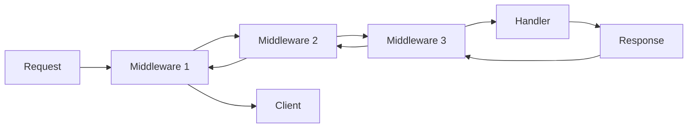
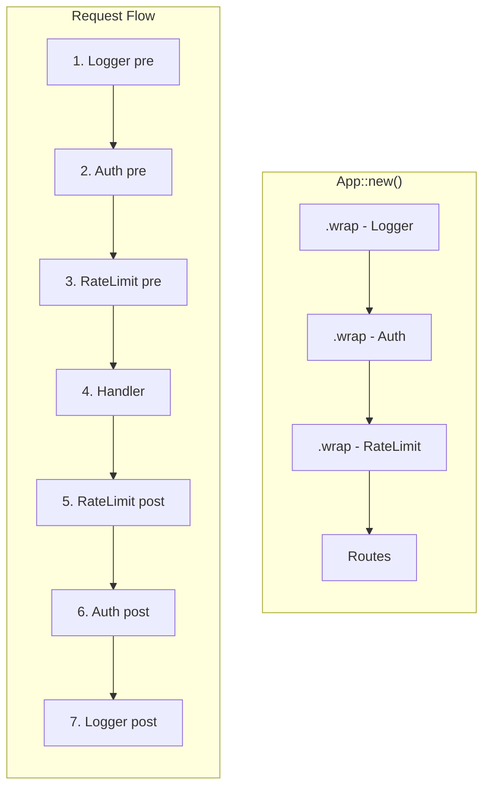

# How to Implement Middleware in Actix

Author: [nawazdhandala](https://www.github.com/nawazdhandala)

Tags: Rust, Actix, Middleware, Web Development, API Security, Backend

Description: Learn how to implement custom middleware in Actix-web using the Transform and Service traits, with practical examples for logging, authentication, and request modification.

---

Middleware sits between incoming requests and your route handlers, giving you a chance to inspect, modify, or reject requests before they reach your application logic. In Actix-web, middleware is built on two core traits: `Transform` and `Service`. Once you understand these, you can build anything from simple loggers to complex authentication systems.

## How Middleware Works in Actix

Actix-web uses a middleware factory pattern. When a request comes in, it flows through a chain of middleware layers, each wrapping the next service. This creates an onion-like structure where each middleware can process the request on the way in and the response on the way out.



The key insight is that middleware wraps services. Each middleware receives a reference to the "inner" service (which could be another middleware or the final handler) and produces a new service that includes its own logic.

---

## The Transform and Service Traits

The `Transform` trait acts as a factory - it creates the actual middleware service. The `Service` trait defines how requests are processed. Here is how they work together.

```rust
// Cargo.toml dependencies
// [dependencies]
// actix-web = "4"
// actix-service = "2"
// futures-util = "0.3"

use actix_web::{dev::ServiceRequest, dev::ServiceResponse, Error};
use actix_service::{Service, Transform};
use futures_util::future::{ok, Ready, LocalBoxFuture};
use std::rc::Rc;

// The Transform trait creates middleware instances
// S is the wrapped service type, B is the response body type
pub struct MyMiddleware;

impl<S, B> Transform<S, ServiceRequest> for MyMiddleware
where
    S: Service<ServiceRequest, Response = ServiceResponse<B>, Error = Error> + 'static,
    B: 'static,
{
    type Response = ServiceResponse<B>;
    type Error = Error;
    type Transform = MyMiddlewareService<S>;
    type InitError = ();
    type Future = Ready<Result<Self::Transform, Self::InitError>>;

    // This creates the middleware service, wrapping the inner service
    fn new_transform(&self, service: S) -> Self::Future {
        ok(MyMiddlewareService {
            service: Rc::new(service),
        })
    }
}

// The Service trait handles actual request processing
pub struct MyMiddlewareService<S> {
    // Rc allows cloning the service for async operations
    service: Rc<S>,
}

impl<S, B> Service<ServiceRequest> for MyMiddlewareService<S>
where
    S: Service<ServiceRequest, Response = ServiceResponse<B>, Error = Error> + 'static,
    B: 'static,
{
    type Response = ServiceResponse<B>;
    type Error = Error;
    type Future = LocalBoxFuture<'static, Result<Self::Response, Self::Error>>;

    // Check if the service is ready to handle requests
    fn poll_ready(
        &self,
        ctx: &mut core::task::Context<'_>,
    ) -> std::task::Poll<Result<(), Self::Error>> {
        self.service.poll_ready(ctx)
    }

    // Process the request
    fn call(&self, req: ServiceRequest) -> Self::Future {
        let service = Rc::clone(&self.service);

        Box::pin(async move {
            // Pre-processing: runs before the handler
            println!("Request: {} {}", req.method(), req.path());

            // Call the next service in the chain
            let response = service.call(req).await?;

            // Post-processing: runs after the handler
            println!("Response status: {}", response.status());

            Ok(response)
        })
    }
}
```

---

## A Simple Logging Middleware

Let's build a practical logging middleware that tracks request timing and logs useful information. This pattern is common for debugging and monitoring.

```rust
use actix_web::{dev::ServiceRequest, dev::ServiceResponse, Error, HttpServer, App, web, HttpResponse};
use actix_service::{Service, Transform};
use futures_util::future::{ok, Ready, LocalBoxFuture};
use std::rc::Rc;
use std::time::Instant;

pub struct RequestLogger;

impl<S, B> Transform<S, ServiceRequest> for RequestLogger
where
    S: Service<ServiceRequest, Response = ServiceResponse<B>, Error = Error> + 'static,
    B: 'static,
{
    type Response = ServiceResponse<B>;
    type Error = Error;
    type Transform = RequestLoggerMiddleware<S>;
    type InitError = ();
    type Future = Ready<Result<Self::Transform, Self::InitError>>;

    fn new_transform(&self, service: S) -> Self::Future {
        ok(RequestLoggerMiddleware {
            service: Rc::new(service),
        })
    }
}

pub struct RequestLoggerMiddleware<S> {
    service: Rc<S>,
}

impl<S, B> Service<ServiceRequest> for RequestLoggerMiddleware<S>
where
    S: Service<ServiceRequest, Response = ServiceResponse<B>, Error = Error> + 'static,
    B: 'static,
{
    type Response = ServiceResponse<B>;
    type Error = Error;
    type Future = LocalBoxFuture<'static, Result<Self::Response, Self::Error>>;

    fn poll_ready(
        &self,
        ctx: &mut core::task::Context<'_>,
    ) -> std::task::Poll<Result<(), Self::Error>> {
        self.service.poll_ready(ctx)
    }

    fn call(&self, req: ServiceRequest) -> Self::Future {
        let service = Rc::clone(&self.service);

        // Capture request info before moving into async block
        let method = req.method().to_string();
        let path = req.path().to_string();
        let query = req.query_string().to_string();

        Box::pin(async move {
            let start = Instant::now();

            // Process the request
            let response = service.call(req).await?;

            let duration = start.elapsed();
            let status = response.status();

            // Log the completed request
            println!(
                "{} {} {} - {} - {:?}",
                method,
                path,
                if query.is_empty() { "".to_string() } else { format!("?{}", query) },
                status.as_u16(),
                duration
            );

            Ok(response)
        })
    }
}

// Register the middleware with your app
#[actix_web::main]
async fn main() -> std::io::Result<()> {
    HttpServer::new(|| {
        App::new()
            .wrap(RequestLogger)
            .route("/", web::get().to(|| async { HttpResponse::Ok().body("Hello") }))
    })
    .bind("127.0.0.1:8080")?
    .run()
    .await
}
```

---

## Authentication Middleware

Authentication middleware needs to inspect headers, validate tokens, and either allow the request to proceed or return an error. Here is a JWT-based example.

```rust
use actix_web::{
    dev::ServiceRequest, dev::ServiceResponse, Error, HttpResponse,
    http::header::AUTHORIZATION,
};
use actix_service::{Service, Transform};
use futures_util::future::{ok, Ready, LocalBoxFuture};
use std::rc::Rc;

// Configuration for the auth middleware
#[derive(Clone)]
pub struct AuthConfig {
    pub secret: String,
    pub skip_paths: Vec<String>,
}

pub struct JwtAuth {
    config: AuthConfig,
}

impl JwtAuth {
    pub fn new(secret: String) -> Self {
        JwtAuth {
            config: AuthConfig {
                secret,
                skip_paths: vec!["/health".to_string(), "/public".to_string()],
            },
        }
    }

    pub fn skip_path(mut self, path: &str) -> Self {
        self.config.skip_paths.push(path.to_string());
        self
    }
}

impl<S, B> Transform<S, ServiceRequest> for JwtAuth
where
    S: Service<ServiceRequest, Response = ServiceResponse<B>, Error = Error> + 'static,
    B: 'static,
{
    type Response = ServiceResponse<B>;
    type Error = Error;
    type Transform = JwtAuthMiddleware<S>;
    type InitError = ();
    type Future = Ready<Result<Self::Transform, Self::InitError>>;

    fn new_transform(&self, service: S) -> Self::Future {
        ok(JwtAuthMiddleware {
            service: Rc::new(service),
            config: self.config.clone(),
        })
    }
}

pub struct JwtAuthMiddleware<S> {
    service: Rc<S>,
    config: AuthConfig,
}

// Simple token validation - replace with real JWT library in production
fn validate_token(token: &str, _secret: &str) -> Option<String> {
    // In production, use jsonwebtoken crate to decode and verify
    if token.starts_with("valid_") {
        Some(token.replace("valid_", "user_"))
    } else {
        None
    }
}

impl<S, B> Service<ServiceRequest> for JwtAuthMiddleware<S>
where
    S: Service<ServiceRequest, Response = ServiceResponse<B>, Error = Error> + 'static,
    B: 'static,
{
    type Response = ServiceResponse<B>;
    type Error = Error;
    type Future = LocalBoxFuture<'static, Result<Self::Response, Self::Error>>;

    fn poll_ready(
        &self,
        ctx: &mut core::task::Context<'_>,
    ) -> std::task::Poll<Result<(), Self::Error>> {
        self.service.poll_ready(ctx)
    }

    fn call(&self, req: ServiceRequest) -> Self::Future {
        let service = Rc::clone(&self.service);
        let config = self.config.clone();

        // Check if this path should skip authentication
        let path = req.path().to_string();
        let should_skip = config.skip_paths.iter().any(|p| path.starts_with(p));

        if should_skip {
            return Box::pin(async move {
                service.call(req).await
            });
        }

        // Extract the Authorization header
        let auth_header = req
            .headers()
            .get(AUTHORIZATION)
            .and_then(|h| h.to_str().ok())
            .map(|s| s.to_string());

        Box::pin(async move {
            // Check for Bearer token
            let token = match auth_header {
                Some(header) if header.starts_with("Bearer ") => {
                    header.strip_prefix("Bearer ").unwrap().to_string()
                }
                _ => {
                    let response = HttpResponse::Unauthorized()
                        .json(serde_json::json!({
                            "error": "Missing or invalid Authorization header"
                        }));
                    return Ok(req.into_response(response).map_into_right_body());
                }
            };

            // Validate the token
            match validate_token(&token, &config.secret) {
                Some(user_id) => {
                    // Store user_id in request extensions for handlers to access
                    req.extensions_mut().insert(user_id);
                    service.call(req).await.map(|res| res.map_into_left_body())
                }
                None => {
                    let response = HttpResponse::Unauthorized()
                        .json(serde_json::json!({
                            "error": "Invalid token"
                        }));
                    Ok(req.into_response(response).map_into_right_body())
                }
            }
        })
    }
}
```

---

## Request and Response Modification

Sometimes you need to add headers, transform request bodies, or modify responses. Here is how to add security headers to every response.

```rust
use actix_web::{
    dev::ServiceRequest, dev::ServiceResponse, Error,
    http::header::{HeaderName, HeaderValue},
};
use actix_service::{Service, Transform};
use futures_util::future::{ok, Ready, LocalBoxFuture};
use std::rc::Rc;

pub struct SecurityHeaders;

impl<S, B> Transform<S, ServiceRequest> for SecurityHeaders
where
    S: Service<ServiceRequest, Response = ServiceResponse<B>, Error = Error> + 'static,
    B: 'static,
{
    type Response = ServiceResponse<B>;
    type Error = Error;
    type Transform = SecurityHeadersMiddleware<S>;
    type InitError = ();
    type Future = Ready<Result<Self::Transform, Self::InitError>>;

    fn new_transform(&self, service: S) -> Self::Future {
        ok(SecurityHeadersMiddleware {
            service: Rc::new(service),
        })
    }
}

pub struct SecurityHeadersMiddleware<S> {
    service: Rc<S>,
}

impl<S, B> Service<ServiceRequest> for SecurityHeadersMiddleware<S>
where
    S: Service<ServiceRequest, Response = ServiceResponse<B>, Error = Error> + 'static,
    B: 'static,
{
    type Response = ServiceResponse<B>;
    type Error = Error;
    type Future = LocalBoxFuture<'static, Result<Self::Response, Self::Error>>;

    fn poll_ready(
        &self,
        ctx: &mut core::task::Context<'_>,
    ) -> std::task::Poll<Result<(), Self::Error>> {
        self.service.poll_ready(ctx)
    }

    fn call(&self, req: ServiceRequest) -> Self::Future {
        let service = Rc::clone(&self.service);

        Box::pin(async move {
            let mut response = service.call(req).await?;

            // Add security headers to every response
            let headers = response.headers_mut();

            headers.insert(
                HeaderName::from_static("x-content-type-options"),
                HeaderValue::from_static("nosniff"),
            );
            headers.insert(
                HeaderName::from_static("x-frame-options"),
                HeaderValue::from_static("DENY"),
            );
            headers.insert(
                HeaderName::from_static("x-xss-protection"),
                HeaderValue::from_static("1; mode=block"),
            );
            headers.insert(
                HeaderName::from_static("referrer-policy"),
                HeaderValue::from_static("strict-origin-when-cross-origin"),
            );

            Ok(response)
        })
    }
}
```

---

## Middleware Ordering

The order you wrap middleware matters. Middleware wraps from the outside in, so the first middleware you add is the outermost layer - it sees the request first and the response last.



The request flows through Logger first, then Auth, then RateLimit, then hits the handler. The response flows back through RateLimit, Auth, and Logger. This means Logger captures the total time including auth and rate limiting.

```rust
use actix_web::{App, HttpServer, web, HttpResponse};

#[actix_web::main]
async fn main() -> std::io::Result<()> {
    HttpServer::new(|| {
        App::new()
            // Logger wraps everything - sees all requests
            .wrap(RequestLogger)
            // Auth runs after logger - can reject unauthenticated requests
            .wrap(JwtAuth::new("secret".to_string()))
            // Security headers added to all responses
            .wrap(SecurityHeaders)
            .route("/api/data", web::get().to(get_data))
            .route("/health", web::get().to(health_check))
    })
    .bind("127.0.0.1:8080")?
    .run()
    .await
}

async fn get_data() -> HttpResponse {
    HttpResponse::Ok().json(serde_json::json!({"data": "value"}))
}

async fn health_check() -> HttpResponse {
    HttpResponse::Ok().body("OK")
}
```

---

## Using the from_fn Helper

For simple middleware that does not need configuration, Actix provides `from_fn` which reduces boilerplate significantly.

```rust
use actix_web::{
    dev::{ServiceRequest, ServiceResponse},
    middleware::from_fn,
    App, Error, HttpServer, web, HttpResponse,
};
use actix_web::body::EitherBody;

// Simple middleware function - much less boilerplate
async fn timing_middleware(
    req: ServiceRequest,
    next: actix_web::middleware::Next<impl actix_web::body::MessageBody>,
) -> Result<ServiceResponse<EitherBody<impl actix_web::body::MessageBody>>, Error> {
    let start = std::time::Instant::now();
    let path = req.path().to_string();

    let response = next.call(req).await?;

    let duration = start.elapsed();
    println!("{} completed in {:?}", path, duration);

    Ok(response.map_into_left_body())
}

// Request ID middleware
async fn request_id_middleware(
    req: ServiceRequest,
    next: actix_web::middleware::Next<impl actix_web::body::MessageBody>,
) -> Result<ServiceResponse<EitherBody<impl actix_web::body::MessageBody>>, Error> {
    let request_id = uuid::Uuid::new_v4().to_string();

    // Store in extensions for handlers to access
    req.extensions_mut().insert(request_id.clone());

    let mut response = next.call(req).await?;

    // Add request ID to response headers
    response.headers_mut().insert(
        actix_web::http::header::HeaderName::from_static("x-request-id"),
        actix_web::http::header::HeaderValue::from_str(&request_id).unwrap(),
    );

    Ok(response.map_into_left_body())
}

#[actix_web::main]
async fn main() -> std::io::Result<()> {
    HttpServer::new(|| {
        App::new()
            .wrap(from_fn(timing_middleware))
            .wrap(from_fn(request_id_middleware))
            .route("/", web::get().to(|| async { HttpResponse::Ok().body("Hello") }))
    })
    .bind("127.0.0.1:8080")?
    .run()
    .await
}
```

---

## Passing Data Between Middleware and Handlers

Use request extensions to share data. The auth middleware above stores the user ID, and handlers can retrieve it.

```rust
use actix_web::{web, HttpRequest, HttpResponse};

// Handler that accesses the user ID set by auth middleware
async fn protected_handler(req: HttpRequest) -> HttpResponse {
    // Get the user_id from extensions (set by auth middleware)
    let user_id = req
        .extensions()
        .get::<String>()
        .cloned()
        .unwrap_or_else(|| "unknown".to_string());

    HttpResponse::Ok().json(serde_json::json!({
        "message": "Protected resource",
        "user_id": user_id
    }))
}

// Or use a custom extractor for type safety
pub struct AuthenticatedUser(pub String);

impl actix_web::FromRequest for AuthenticatedUser {
    type Error = actix_web::Error;
    type Future = std::future::Ready<Result<Self, Self::Error>>;

    fn from_request(req: &HttpRequest, _payload: &mut actix_web::dev::Payload) -> Self::Future {
        let user_id = req
            .extensions()
            .get::<String>()
            .cloned();

        match user_id {
            Some(id) => std::future::ready(Ok(AuthenticatedUser(id))),
            None => std::future::ready(Err(actix_web::error::ErrorUnauthorized("Not authenticated"))),
        }
    }
}

// Now handlers can use the extractor directly
async fn cleaner_handler(user: AuthenticatedUser) -> HttpResponse {
    HttpResponse::Ok().json(serde_json::json!({
        "message": "Hello",
        "user_id": user.0
    }))
}
```

---

## Error Handling in Middleware

When middleware needs to short-circuit the request and return an error, you need to handle the response body type properly. This is one of the trickier parts of Actix middleware.

```rust
use actix_web::{
    dev::ServiceRequest, dev::ServiceResponse, Error, HttpResponse,
    body::EitherBody,
};
use actix_service::{Service, Transform};
use futures_util::future::{ok, Ready, LocalBoxFuture};
use std::rc::Rc;

pub struct RateLimiter {
    max_requests: u32,
}

impl RateLimiter {
    pub fn new(max_requests: u32) -> Self {
        RateLimiter { max_requests }
    }
}

impl<S, B> Transform<S, ServiceRequest> for RateLimiter
where
    S: Service<ServiceRequest, Response = ServiceResponse<B>, Error = Error> + 'static,
    B: 'static,
{
    type Response = ServiceResponse<EitherBody<B>>;
    type Error = Error;
    type Transform = RateLimiterMiddleware<S>;
    type InitError = ();
    type Future = Ready<Result<Self::Transform, Self::InitError>>;

    fn new_transform(&self, service: S) -> Self::Future {
        ok(RateLimiterMiddleware {
            service: Rc::new(service),
            max_requests: self.max_requests,
        })
    }
}

pub struct RateLimiterMiddleware<S> {
    service: Rc<S>,
    max_requests: u32,
}

// Simple in-memory counter - use Redis in production
use std::sync::atomic::{AtomicU32, Ordering};
static REQUEST_COUNT: AtomicU32 = AtomicU32::new(0);

impl<S, B> Service<ServiceRequest> for RateLimiterMiddleware<S>
where
    S: Service<ServiceRequest, Response = ServiceResponse<B>, Error = Error> + 'static,
    B: 'static,
{
    type Response = ServiceResponse<EitherBody<B>>;
    type Error = Error;
    type Future = LocalBoxFuture<'static, Result<Self::Response, Self::Error>>;

    fn poll_ready(
        &self,
        ctx: &mut core::task::Context<'_>,
    ) -> std::task::Poll<Result<(), Self::Error>> {
        self.service.poll_ready(ctx)
    }

    fn call(&self, req: ServiceRequest) -> Self::Future {
        let service = Rc::clone(&self.service);
        let max = self.max_requests;

        Box::pin(async move {
            let count = REQUEST_COUNT.fetch_add(1, Ordering::SeqCst);

            if count >= max {
                // Return 429 Too Many Requests
                let response = HttpResponse::TooManyRequests()
                    .insert_header(("Retry-After", "60"))
                    .json(serde_json::json!({
                        "error": "Rate limit exceeded",
                        "retry_after": 60
                    }));

                // Use EitherBody::Right for the error response
                return Ok(req.into_response(response).map_into_right_body());
            }

            // Continue to the next service
            // Use EitherBody::Left for the normal response
            service.call(req).await.map(|res| res.map_into_left_body())
        })
    }
}
```

---

## Wrapping Services with State

Sometimes your middleware needs to maintain state across requests. Here is how to implement a middleware that tracks request counts per endpoint.

```rust
use actix_web::{dev::ServiceRequest, dev::ServiceResponse, Error};
use actix_service::{Service, Transform};
use futures_util::future::{ok, Ready, LocalBoxFuture};
use std::collections::HashMap;
use std::rc::Rc;
use std::sync::Mutex;

// Shared state across all middleware instances
pub struct MetricsCollector {
    counts: Rc<Mutex<HashMap<String, u64>>>,
}

impl MetricsCollector {
    pub fn new() -> Self {
        MetricsCollector {
            counts: Rc::new(Mutex::new(HashMap::new())),
        }
    }

    pub fn get_counts(&self) -> HashMap<String, u64> {
        self.counts.lock().unwrap().clone()
    }
}

impl Clone for MetricsCollector {
    fn clone(&self) -> Self {
        MetricsCollector {
            counts: Rc::clone(&self.counts),
        }
    }
}

impl<S, B> Transform<S, ServiceRequest> for MetricsCollector
where
    S: Service<ServiceRequest, Response = ServiceResponse<B>, Error = Error> + 'static,
    B: 'static,
{
    type Response = ServiceResponse<B>;
    type Error = Error;
    type Transform = MetricsMiddleware<S>;
    type InitError = ();
    type Future = Ready<Result<Self::Transform, Self::InitError>>;

    fn new_transform(&self, service: S) -> Self::Future {
        ok(MetricsMiddleware {
            service: Rc::new(service),
            counts: Rc::clone(&self.counts),
        })
    }
}

pub struct MetricsMiddleware<S> {
    service: Rc<S>,
    counts: Rc<Mutex<HashMap<String, u64>>>,
}

impl<S, B> Service<ServiceRequest> for MetricsMiddleware<S>
where
    S: Service<ServiceRequest, Response = ServiceResponse<B>, Error = Error> + 'static,
    B: 'static,
{
    type Response = ServiceResponse<B>;
    type Error = Error;
    type Future = LocalBoxFuture<'static, Result<Self::Response, Self::Error>>;

    fn poll_ready(
        &self,
        ctx: &mut core::task::Context<'_>,
    ) -> std::task::Poll<Result<(), Self::Error>> {
        self.service.poll_ready(ctx)
    }

    fn call(&self, req: ServiceRequest) -> Self::Future {
        let service = Rc::clone(&self.service);
        let counts = Rc::clone(&self.counts);
        let path = req.path().to_string();

        Box::pin(async move {
            // Increment the counter for this path
            {
                let mut map = counts.lock().unwrap();
                *map.entry(path).or_insert(0) += 1;
            }

            // Process the request
            service.call(req).await
        })
    }
}
```

---

## Summary

| Concept | Purpose |
|---------|---------|
| **Transform trait** | Factory that creates middleware service instances |
| **Service trait** | Processes requests and produces responses |
| **Rc wrapping** | Allows service to be cloned for async operations |
| **LocalBoxFuture** | Return type for async middleware operations |
| **from_fn** | Reduces boilerplate for simple middleware |
| **Extensions** | Pass data from middleware to handlers |
| **EitherBody** | Handle different response body types when short-circuiting |

Actix middleware is powerful but has a learning curve. Start with `from_fn` for simple cases, then move to the full `Transform`/`Service` pattern when you need configuration or complex state management. The key is understanding that middleware wraps services in layers, and the order you add them determines how requests flow through your application.

---

*Need to monitor your Actix services? [OneUptime](https://oneuptime.com) provides comprehensive API monitoring with latency tracking and alerting for Rust applications.*
