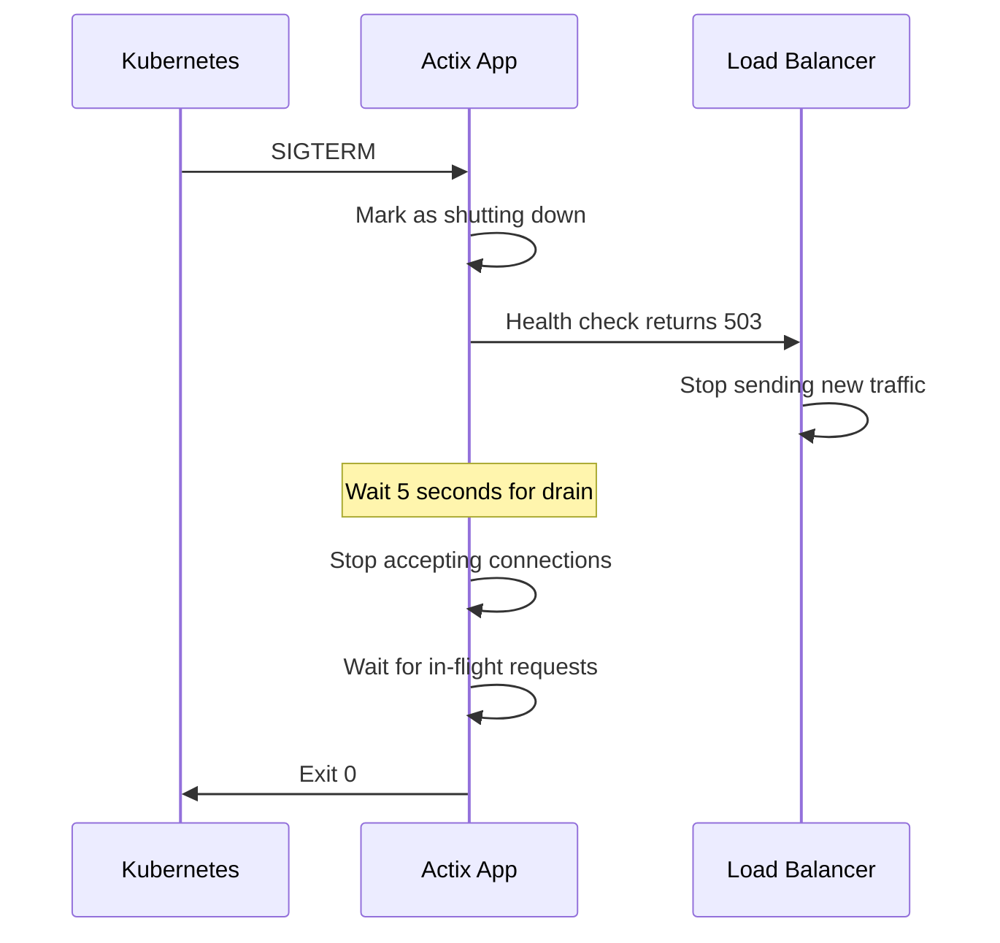
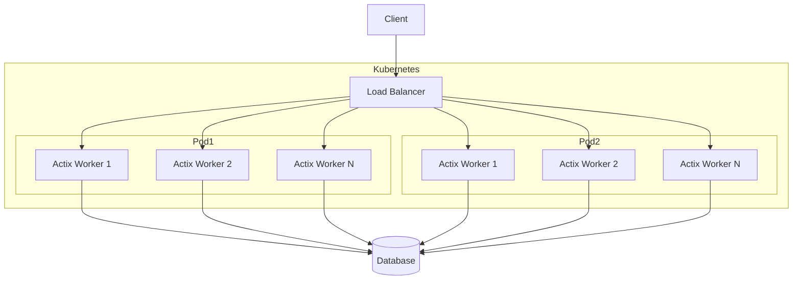

# How to Configure Actix for Production

Author: [nawazdhandala](https://www.github.com/nawazdhandala)

Tags: Rust, Actix, Web Development, DevOps, Performance, Docker

Description: A practical guide to configuring Actix Web for production deployments with worker tuning, TLS, graceful shutdown, health checks, logging, and Docker best practices.

---

Actix Web is one of the fastest web frameworks available, but getting it production-ready requires more than just writing handlers. You need to configure worker threads, set up TLS, implement graceful shutdown, add health checks, configure proper logging, handle errors gracefully, and package it all in a container. This guide walks through each piece.

## Project Setup

Start with a solid foundation. Here is a typical Cargo.toml for a production Actix application.

```toml
[package]
name = "my-api"
version = "1.0.0"
edition = "2021"

[dependencies]
actix-web = "4"
actix-rt = "2"
actix-tls = { version = "3", features = ["rustls-0_23"] }
rustls = "0.23"
rustls-pemfile = "2"
tokio = { version = "1", features = ["full", "signal"] }
tracing = "0.1"
tracing-subscriber = { version = "0.3", features = ["json", "env-filter"] }
tracing-actix-web = "0.7"
serde = { version = "1", features = ["derive"] }
serde_json = "1"
config = "0.14"
thiserror = "1"
anyhow = "1"

[profile.release]
opt-level = 3
lto = true
codegen-units = 1
panic = "abort"
strip = true
```

## Worker Configuration

Actix uses a multi-threaded runtime. By default, it spawns one worker per CPU core. In production, you want control over this.

```rust
use actix_web::{web, App, HttpServer};
use std::env;

#[actix_web::main]
async fn main() -> std::io::Result<()> {
    // Read worker count from environment, default to CPU count
    let workers: usize = env::var("WORKERS")
        .ok()
        .and_then(|v| v.parse().ok())
        .unwrap_or_else(num_cpus::get);

    // Read backlog size - pending connections queue
    let backlog: u32 = env::var("BACKLOG")
        .ok()
        .and_then(|v| v.parse().ok())
        .unwrap_or(2048);

    // Max connections per worker
    let max_connections: usize = env::var("MAX_CONNECTIONS")
        .ok()
        .and_then(|v| v.parse().ok())
        .unwrap_or(25000);

    HttpServer::new(|| {
        App::new()
            .route("/", web::get().to(|| async { "OK" }))
    })
    .workers(workers)
    .backlog(backlog)
    .max_connections(max_connections)
    .max_connection_rate(256)  // New connections per second per worker
    .keep_alive(std::time::Duration::from_secs(75))
    .client_request_timeout(std::time::Duration::from_secs(60))
    .client_disconnect_timeout(std::time::Duration::from_secs(5))
    .bind("0.0.0.0:8080")?
    .run()
    .await
}
```

The key settings to tune are:

| Setting | Default | Production Recommendation |
|---------|---------|---------------------------|
| workers | CPU cores | Start with CPU count, adjust based on load |
| backlog | 2048 | Increase for high connection bursts |
| max_connections | 25000 | Limit based on available memory |
| keep_alive | 5s | 60-75s for HTTP/1.1, match your LB |
| client_request_timeout | 60s | Depends on your slowest endpoint |

## TLS Setup with Rustls

Never terminate TLS at your application in production unless you have a good reason. But if you need it, here is how to configure Rustls.

```rust
use actix_web::{web, App, HttpServer};
use rustls::ServerConfig;
use rustls_pemfile::{certs, private_key};
use std::fs::File;
use std::io::BufReader;

fn load_rustls_config() -> ServerConfig {
    // Load certificate chain
    let cert_file = File::open("/etc/certs/tls.crt")
        .expect("Cannot open certificate file");
    let mut cert_reader = BufReader::new(cert_file);
    let cert_chain: Vec<_> = certs(&mut cert_reader)
        .filter_map(|cert| cert.ok())
        .collect();

    // Load private key
    let key_file = File::open("/etc/certs/tls.key")
        .expect("Cannot open private key file");
    let mut key_reader = BufReader::new(key_file);
    let private_key = private_key(&mut key_reader)
        .expect("Cannot read private key")
        .expect("No private key found");

    // Build TLS config with secure defaults
    ServerConfig::builder()
        .with_no_client_auth()
        .with_single_cert(cert_chain, private_key)
        .expect("Invalid TLS configuration")
}

#[actix_web::main]
async fn main() -> std::io::Result<()> {
    let tls_config = load_rustls_config();

    HttpServer::new(|| {
        App::new()
            .route("/", web::get().to(|| async { "OK" }))
    })
    .bind_rustls_0_23("0.0.0.0:8443", tls_config)?
    .run()
    .await
}
```

For most deployments, terminate TLS at your load balancer or ingress controller and let Actix handle plain HTTP.

## Graceful Shutdown

Kubernetes sends SIGTERM when it wants to stop your pod. You need to handle this signal, stop accepting new connections, and finish processing in-flight requests.

```rust
use actix_web::{web, App, HttpServer, HttpResponse};
use std::sync::atomic::{AtomicBool, Ordering};
use std::sync::Arc;
use tokio::signal;

// Shared state to track shutdown status
struct AppState {
    is_shutting_down: AtomicBool,
}

async fn health_check(state: web::Data<Arc<AppState>>) -> HttpResponse {
    if state.is_shutting_down.load(Ordering::SeqCst) {
        HttpResponse::ServiceUnavailable().json(serde_json::json!({
            "status": "shutting_down"
        }))
    } else {
        HttpResponse::Ok().json(serde_json::json!({
            "status": "healthy"
        }))
    }
}

#[actix_web::main]
async fn main() -> std::io::Result<()> {
    let state = Arc::new(AppState {
        is_shutting_down: AtomicBool::new(false),
    });

    let state_clone = state.clone();

    let server = HttpServer::new(move || {
        App::new()
            .app_data(web::Data::new(state_clone.clone()))
            .route("/health", web::get().to(health_check))
    })
    .shutdown_timeout(30)  // Wait up to 30 seconds for in-flight requests
    .bind("0.0.0.0:8080")?
    .run();

    let server_handle = server.handle();

    // Spawn shutdown signal handler
    let shutdown_state = state.clone();
    tokio::spawn(async move {
        // Wait for SIGTERM or SIGINT
        let sigterm = async {
            signal::unix::signal(signal::unix::SignalKind::terminate())
                .expect("Failed to install SIGTERM handler")
                .recv()
                .await;
        };

        let sigint = async {
            signal::ctrl_c().await.expect("Failed to install SIGINT handler");
        };

        tokio::select! {
            _ = sigterm => tracing::info!("Received SIGTERM"),
            _ = sigint => tracing::info!("Received SIGINT"),
        }

        // Mark as shutting down - health checks will start failing
        shutdown_state.is_shutting_down.store(true, Ordering::SeqCst);
        tracing::info!("Marked as shutting down, waiting for load balancer drain");

        // Give load balancer time to stop sending traffic
        tokio::time::sleep(std::time::Duration::from_secs(5)).await;

        // Trigger graceful shutdown
        tracing::info!("Initiating graceful shutdown");
        server_handle.stop(true).await;
    });

    server.await
}
```

The shutdown sequence looks like this:



## Health Checks

Production applications need both liveness and readiness probes. Liveness tells Kubernetes the process is alive. Readiness tells it the application can handle traffic.

```rust
use actix_web::{web, App, HttpServer, HttpResponse};
use std::sync::atomic::{AtomicBool, Ordering};
use std::sync::Arc;
use std::time::Instant;

struct AppState {
    start_time: Instant,
    is_ready: AtomicBool,
    is_shutting_down: AtomicBool,
}

// Liveness - is the process running?
async fn liveness(state: web::Data<Arc<AppState>>) -> HttpResponse {
    let uptime = state.start_time.elapsed().as_secs();

    HttpResponse::Ok().json(serde_json::json!({
        "status": "alive",
        "uptime_seconds": uptime
    }))
}

// Readiness - can we handle traffic?
async fn readiness(state: web::Data<Arc<AppState>>) -> HttpResponse {
    if state.is_shutting_down.load(Ordering::SeqCst) {
        return HttpResponse::ServiceUnavailable().json(serde_json::json!({
            "status": "shutting_down",
            "ready": false
        }));
    }

    if !state.is_ready.load(Ordering::SeqCst) {
        return HttpResponse::ServiceUnavailable().json(serde_json::json!({
            "status": "not_ready",
            "ready": false
        }));
    }

    HttpResponse::Ok().json(serde_json::json!({
        "status": "ready",
        "ready": true
    }))
}

// Detailed health for debugging - not for probes
async fn health_detail(state: web::Data<Arc<AppState>>) -> HttpResponse {
    let uptime = state.start_time.elapsed().as_secs();

    HttpResponse::Ok().json(serde_json::json!({
        "status": "healthy",
        "uptime_seconds": uptime,
        "ready": state.is_ready.load(Ordering::SeqCst),
        "shutting_down": state.is_shutting_down.load(Ordering::SeqCst),
        "version": env!("CARGO_PKG_VERSION")
    }))
}

fn configure_health_routes(cfg: &mut web::ServiceConfig) {
    cfg.service(
        web::scope("/health")
            .route("/live", web::get().to(liveness))
            .route("/ready", web::get().to(readiness))
            .route("", web::get().to(health_detail))
    );
}
```

The corresponding Kubernetes configuration:

```yaml
apiVersion: apps/v1
kind: Deployment
metadata:
  name: my-api
spec:
  template:
    spec:
      terminationGracePeriodSeconds: 45
      containers:
        - name: api
          image: my-api:latest
          ports:
            - containerPort: 8080
          livenessProbe:
            httpGet:
              path: /health/live
              port: 8080
            initialDelaySeconds: 5
            periodSeconds: 10
            timeoutSeconds: 5
            failureThreshold: 3
          readinessProbe:
            httpGet:
              path: /health/ready
              port: 8080
            initialDelaySeconds: 5
            periodSeconds: 5
            timeoutSeconds: 3
            failureThreshold: 2
```

## Logging with Tracing

Structured logging is essential for production observability. The tracing ecosystem is the standard choice for Rust.

```rust
use actix_web::{web, App, HttpServer, HttpResponse};
use tracing::{info, warn, error, instrument, Level};
use tracing_subscriber::{layer::SubscriberExt, util::SubscriberInitExt, EnvFilter};
use tracing_actix_web::TracingLogger;

fn init_tracing() {
    // Configure based on environment
    let env_filter = EnvFilter::try_from_default_env()
        .unwrap_or_else(|_| EnvFilter::new("info,actix_web=info"));

    let json_logs = std::env::var("JSON_LOGS")
        .map(|v| v == "true" || v == "1")
        .unwrap_or(true);

    if json_logs {
        // JSON format for production
        tracing_subscriber::registry()
            .with(env_filter)
            .with(tracing_subscriber::fmt::layer().json())
            .init();
    } else {
        // Pretty format for development
        tracing_subscriber::registry()
            .with(env_filter)
            .with(tracing_subscriber::fmt::layer().pretty())
            .init();
    }
}

// Instrument handlers to add tracing context
#[instrument(skip(state), fields(user_id))]
async fn get_user(
    state: web::Data<AppState>,
    path: web::Path<String>,
) -> HttpResponse {
    let user_id = path.into_inner();

    // Record the user_id in the current span
    tracing::Span::current().record("user_id", &user_id);

    info!("Fetching user");

    match state.find_user(&user_id).await {
        Ok(user) => {
            info!("User found");
            HttpResponse::Ok().json(user)
        }
        Err(e) => {
            warn!(error = %e, "User not found");
            HttpResponse::NotFound().finish()
        }
    }
}

#[actix_web::main]
async fn main() -> std::io::Result<()> {
    init_tracing();

    info!("Starting server");

    HttpServer::new(|| {
        App::new()
            // Add request tracing middleware
            .wrap(TracingLogger::default())
            .route("/users/{id}", web::get().to(get_user))
    })
    .bind("0.0.0.0:8080")?
    .run()
    .await
}
```

This gives you structured JSON logs that look like:

```json
{
  "timestamp": "2026-02-03T10:15:30.123Z",
  "level": "INFO",
  "target": "my_api::handlers",
  "message": "Fetching user",
  "user_id": "12345",
  "span": {
    "name": "get_user"
  },
  "http.method": "GET",
  "http.route": "/users/{id}",
  "trace_id": "abc123"
}
```

## Error Handling

Define application errors and convert them to appropriate HTTP responses. This keeps your handlers clean and your error responses consistent.

```rust
use actix_web::{HttpResponse, ResponseError, http::StatusCode};
use std::fmt;

// Define application errors
#[derive(Debug)]
pub enum AppError {
    NotFound(String),
    BadRequest(String),
    Unauthorized,
    Forbidden,
    Conflict(String),
    Internal(String),
    Database(String),
    Timeout,
}

impl fmt::Display for AppError {
    fn fmt(&self, f: &mut fmt::Formatter<'_>) -> fmt::Result {
        match self {
            AppError::NotFound(msg) => write!(f, "Not found: {}", msg),
            AppError::BadRequest(msg) => write!(f, "Bad request: {}", msg),
            AppError::Unauthorized => write!(f, "Unauthorized"),
            AppError::Forbidden => write!(f, "Forbidden"),
            AppError::Conflict(msg) => write!(f, "Conflict: {}", msg),
            AppError::Internal(msg) => write!(f, "Internal error: {}", msg),
            AppError::Database(msg) => write!(f, "Database error: {}", msg),
            AppError::Timeout => write!(f, "Request timeout"),
        }
    }
}

impl ResponseError for AppError {
    fn error_response(&self) -> HttpResponse {
        let (status, error_type, message) = match self {
            AppError::NotFound(msg) => (StatusCode::NOT_FOUND, "not_found", msg.clone()),
            AppError::BadRequest(msg) => (StatusCode::BAD_REQUEST, "bad_request", msg.clone()),
            AppError::Unauthorized => (StatusCode::UNAUTHORIZED, "unauthorized", "Authentication required".to_string()),
            AppError::Forbidden => (StatusCode::FORBIDDEN, "forbidden", "Access denied".to_string()),
            AppError::Conflict(msg) => (StatusCode::CONFLICT, "conflict", msg.clone()),
            AppError::Internal(msg) => {
                // Log internal errors but do not expose details to clients
                tracing::error!(error = %msg, "Internal server error");
                (StatusCode::INTERNAL_SERVER_ERROR, "internal_error", "An internal error occurred".to_string())
            }
            AppError::Database(msg) => {
                tracing::error!(error = %msg, "Database error");
                (StatusCode::SERVICE_UNAVAILABLE, "service_unavailable", "Service temporarily unavailable".to_string())
            }
            AppError::Timeout => (StatusCode::GATEWAY_TIMEOUT, "timeout", "Request timed out".to_string()),
        };

        HttpResponse::build(status).json(serde_json::json!({
            "error": {
                "type": error_type,
                "message": message
            }
        }))
    }

    fn status_code(&self) -> StatusCode {
        match self {
            AppError::NotFound(_) => StatusCode::NOT_FOUND,
            AppError::BadRequest(_) => StatusCode::BAD_REQUEST,
            AppError::Unauthorized => StatusCode::UNAUTHORIZED,
            AppError::Forbidden => StatusCode::FORBIDDEN,
            AppError::Conflict(_) => StatusCode::CONFLICT,
            AppError::Internal(_) => StatusCode::INTERNAL_SERVER_ERROR,
            AppError::Database(_) => StatusCode::SERVICE_UNAVAILABLE,
            AppError::Timeout => StatusCode::GATEWAY_TIMEOUT,
        }
    }
}

// Handler using the error type
async fn get_user(path: web::Path<String>) -> Result<HttpResponse, AppError> {
    let user_id = path.into_inner();

    let user = find_user(&user_id)
        .await
        .map_err(|e| AppError::Database(e.to_string()))?
        .ok_or_else(|| AppError::NotFound(format!("User {} not found", user_id)))?;

    Ok(HttpResponse::Ok().json(user))
}
```

## Docker Deployment

Here is a multi-stage Dockerfile that produces a minimal production image.

```dockerfile
# Build stage
FROM rust:1.75-bookworm AS builder

WORKDIR /app

# Install build dependencies
RUN apt-get update && apt-get install -y \
    pkg-config \
    libssl-dev \
    && rm -rf /var/lib/apt/lists/*

# Copy manifests first for layer caching
COPY Cargo.toml Cargo.lock ./

# Create dummy main.rs to build dependencies
RUN mkdir src && echo "fn main() {}" > src/main.rs
RUN cargo build --release
RUN rm -rf src

# Copy actual source
COPY src ./src

# Build the real application
RUN touch src/main.rs && cargo build --release

# Runtime stage
FROM debian:bookworm-slim

RUN apt-get update && apt-get install -y \
    ca-certificates \
    && rm -rf /var/lib/apt/lists/*

# Create non-root user
RUN useradd -r -u 1000 -s /bin/false appuser

WORKDIR /app

# Copy binary from builder
COPY --from=builder /app/target/release/my-api /app/my-api

# Set ownership
RUN chown -R appuser:appuser /app

USER appuser

# Default environment variables
ENV RUST_LOG=info
ENV WORKERS=0
ENV JSON_LOGS=true

EXPOSE 8080

HEALTHCHECK --interval=30s --timeout=5s --start-period=10s --retries=3 \
    CMD curl -f http://localhost:8080/health/live || exit 1

ENTRYPOINT ["/app/my-api"]
```

Build and run it:

```bash
# Build the image
docker build -t my-api:latest .

# Run with custom configuration
docker run -d \
  --name my-api \
  -p 8080:8080 \
  -e WORKERS=4 \
  -e RUST_LOG=info,actix_web=debug \
  -e JSON_LOGS=true \
  my-api:latest
```

## Performance Tuning

Beyond worker configuration, there are several knobs to turn for better performance.

```rust
use actix_web::{web, App, HttpServer, middleware};

#[actix_web::main]
async fn main() -> std::io::Result<()> {
    HttpServer::new(|| {
        // Configure payload limits
        let json_config = web::JsonConfig::default()
            .limit(4 * 1024 * 1024)  // 4MB max JSON payload
            .error_handler(|err, _req| {
                actix_web::error::InternalError::from_response(
                    err,
                    HttpResponse::BadRequest().json(serde_json::json!({
                        "error": "Invalid JSON payload"
                    })),
                )
                .into()
            });

        let query_config = web::QueryConfig::default()
            .error_handler(|err, _req| {
                actix_web::error::InternalError::from_response(
                    err,
                    HttpResponse::BadRequest().json(serde_json::json!({
                        "error": "Invalid query parameters"
                    })),
                )
                .into()
            });

        App::new()
            .app_data(json_config)
            .app_data(query_config)
            // Compress responses
            .wrap(middleware::Compress::default())
            // Normalize paths
            .wrap(middleware::NormalizePath::trim())
            .route("/", web::get().to(|| async { "OK" }))
    })
    // Connection settings for high throughput
    .workers(num_cpus::get())
    .backlog(8192)
    .max_connections(100000)
    .max_connection_rate(512)
    // Keep-alive for connection reuse
    .keep_alive(std::time::Duration::from_secs(75))
    .bind("0.0.0.0:8080")?
    .run()
    .await
}
```

For high-performance scenarios, also consider these system-level tunings:

```bash
# Increase file descriptor limits
ulimit -n 65535

# Tune kernel parameters (add to /etc/sysctl.conf)
net.core.somaxconn = 65535
net.ipv4.tcp_max_syn_backlog = 65535
net.core.netdev_max_backlog = 65535
net.ipv4.tcp_fin_timeout = 10
net.ipv4.tcp_tw_reuse = 1
```

## Putting It All Together

Here is the complete main.rs that brings all these pieces together.

```rust
use actix_web::{web, App, HttpServer, HttpResponse, middleware};
use std::sync::atomic::{AtomicBool, Ordering};
use std::sync::Arc;
use std::time::Instant;
use tokio::signal;
use tracing::{info, Level};
use tracing_subscriber::{layer::SubscriberExt, util::SubscriberInitExt, EnvFilter};
use tracing_actix_web::TracingLogger;

mod error;
mod handlers;
mod health;

use error::AppError;

struct AppState {
    start_time: Instant,
    is_ready: AtomicBool,
    is_shutting_down: AtomicBool,
}

fn init_tracing() {
    let env_filter = EnvFilter::try_from_default_env()
        .unwrap_or_else(|_| EnvFilter::new("info"));

    let json_logs = std::env::var("JSON_LOGS")
        .map(|v| v == "true" || v == "1")
        .unwrap_or(true);

    if json_logs {
        tracing_subscriber::registry()
            .with(env_filter)
            .with(tracing_subscriber::fmt::layer().json())
            .init();
    } else {
        tracing_subscriber::registry()
            .with(env_filter)
            .with(tracing_subscriber::fmt::layer().pretty())
            .init();
    }
}

#[actix_web::main]
async fn main() -> std::io::Result<()> {
    init_tracing();

    let workers: usize = std::env::var("WORKERS")
        .ok()
        .and_then(|v| v.parse().ok())
        .filter(|&n| n > 0)
        .unwrap_or_else(num_cpus::get);

    info!(workers = workers, "Starting server");

    let state = Arc::new(AppState {
        start_time: Instant::now(),
        is_ready: AtomicBool::new(true),
        is_shutting_down: AtomicBool::new(false),
    });

    let server = HttpServer::new({
        let state = state.clone();
        move || {
            App::new()
                .app_data(web::Data::new(state.clone()))
                .app_data(web::JsonConfig::default().limit(4 * 1024 * 1024))
                .wrap(TracingLogger::default())
                .wrap(middleware::Compress::default())
                .wrap(middleware::NormalizePath::trim())
                .configure(health::configure_routes)
                .configure(handlers::configure_routes)
        }
    })
    .workers(workers)
    .backlog(2048)
    .shutdown_timeout(30)
    .keep_alive(std::time::Duration::from_secs(75))
    .client_request_timeout(std::time::Duration::from_secs(60))
    .bind("0.0.0.0:8080")?
    .run();

    let server_handle = server.handle();

    // Shutdown handler
    let shutdown_state = state.clone();
    tokio::spawn(async move {
        let sigterm = async {
            signal::unix::signal(signal::unix::SignalKind::terminate())
                .expect("Failed to install SIGTERM handler")
                .recv()
                .await;
        };

        let sigint = async {
            signal::ctrl_c().await.expect("Failed to install SIGINT handler");
        };

        tokio::select! {
            _ = sigterm => info!("Received SIGTERM"),
            _ = sigint => info!("Received SIGINT"),
        }

        shutdown_state.is_shutting_down.store(true, Ordering::SeqCst);
        info!("Marked as shutting down");

        tokio::time::sleep(std::time::Duration::from_secs(5)).await;

        info!("Initiating graceful shutdown");
        server_handle.stop(true).await;
    });

    server.await
}
```

## Architecture Overview

The production setup follows this architecture:



## Summary

| Component | Recommendation |
|-----------|----------------|
| Workers | Start with CPU count, tune based on load |
| TLS | Terminate at load balancer when possible |
| Shutdown | Handle SIGTERM, drain connections, 30s timeout |
| Health checks | Separate liveness and readiness endpoints |
| Logging | Use tracing with JSON output |
| Errors | Define AppError type, implement ResponseError |
| Docker | Multi-stage build, non-root user, minimal base |
| Performance | Tune backlog, keep-alive, and system limits |

Actix gives you the building blocks for a high-performance production service. The key is configuring each piece thoughtfully and testing under realistic load before going live.
