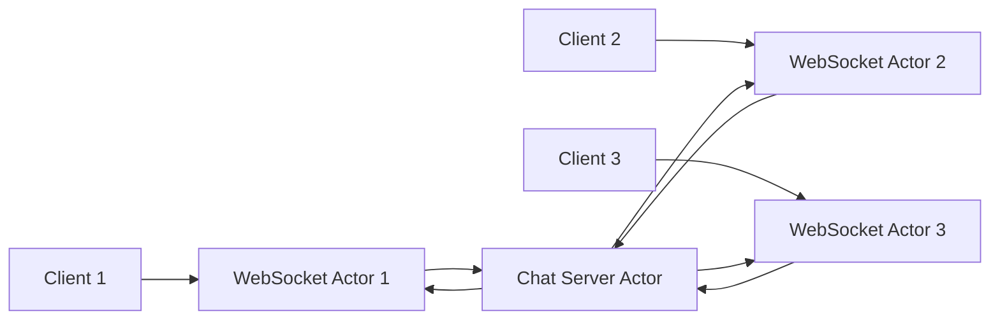
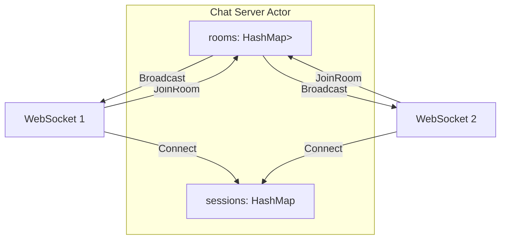
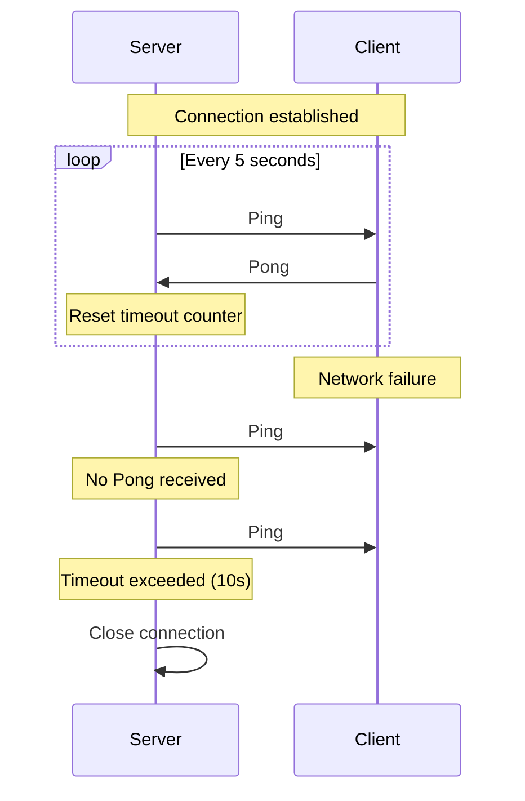

# How to Build WebSocket Servers with Actix

Author: [nawazdhandala](https://www.github.com/nawazdhandala)

Tags: Rust, Actix, WebSocket, Real-time, Actors, Performance

Description: Learn how to build high-performance WebSocket servers in Rust using Actix-web and the actor model for real-time applications like chat, notifications, and live updates.

---

WebSockets bring real-time, bidirectional communication to your applications. Actix-web, built on the actor model, provides a natural fit for WebSocket servers - each connection becomes an actor that can handle messages independently and communicate with other actors. This guide walks you through building production-ready WebSocket servers with Actix.

## Why Actix for WebSockets?

Actix uses the actor model where each WebSocket connection is an independent actor. Actors process messages sequentially, avoiding shared state issues. Combined with Rust's performance and safety guarantees, you get a WebSocket server that handles thousands of concurrent connections efficiently.



---

## Project Setup

Add the required dependencies to your `Cargo.toml`. We need actix-web for HTTP, actix-web-actors for WebSocket support, and actix for the actor system.

```toml
[package]
name = "actix-websocket-server"
version = "0.1.0"
edition = "2021"

[dependencies]
actix = "0.13"           # Actor framework
actix-web = "4"          # Web framework
actix-web-actors = "4"   # WebSocket support
actix-rt = "2"           # Actix runtime
serde = { version = "1", features = ["derive"] }
serde_json = "1"
uuid = { version = "1", features = ["v4"] }
log = "0.4"
env_logger = "0.10"
```

---

## Basic WebSocket Actor

Every WebSocket connection in Actix is represented by an actor. The actor implements `StreamHandler` to receive messages and `Actor` to define its lifecycle. This example shows a simple echo server.

```rust
// src/websocket.rs
// Basic WebSocket actor that echoes messages back to the client

use actix::{Actor, ActorContext, AsyncContext, StreamHandler};
use actix_web_actors::ws;
use std::time::{Duration, Instant};

// How often heartbeat pings are sent to clients
const HEARTBEAT_INTERVAL: Duration = Duration::from_secs(5);
// How long before lack of client response causes a timeout
const CLIENT_TIMEOUT: Duration = Duration::from_secs(10);

/// WebSocket actor - one instance per connected client
pub struct WebSocketSession {
    // Unique identifier for this connection
    pub id: String,
    // Track when we last received a message (for timeout detection)
    pub last_heartbeat: Instant,
}

impl WebSocketSession {
    pub fn new(id: String) -> Self {
        Self {
            id,
            last_heartbeat: Instant::now(),
        }
    }

    /// Start the heartbeat process for this connection
    fn start_heartbeat(&self, ctx: &mut ws::WebsocketContext<Self>) {
        // Schedule a recurring task that runs every HEARTBEAT_INTERVAL
        ctx.run_interval(HEARTBEAT_INTERVAL, |actor, ctx| {
            // Check if client has responded recently
            if Instant::now().duration_since(actor.last_heartbeat) > CLIENT_TIMEOUT {
                log::warn!("Client {} heartbeat timeout, disconnecting", actor.id);
                ctx.stop();  // Stop the actor, closing the connection
                return;
            }
            // Send a ping frame to the client
            ctx.ping(b"");
        });
    }
}

/// Actor trait implementation - defines lifecycle hooks
impl Actor for WebSocketSession {
    type Context = ws::WebsocketContext<Self>;

    /// Called when the actor starts (connection established)
    fn started(&mut self, ctx: &mut Self::Context) {
        log::info!("WebSocket session started: {}", self.id);
        self.start_heartbeat(ctx);  // Begin heartbeat checks
    }

    /// Called when the actor stops (connection closed)
    fn stopped(&mut self, _ctx: &mut Self::Context) {
        log::info!("WebSocket session stopped: {}", self.id);
    }
}

/// StreamHandler processes incoming WebSocket messages
impl StreamHandler<Result<ws::Message, ws::ProtocolError>> for WebSocketSession {
    fn handle(&mut self, msg: Result<ws::Message, ws::ProtocolError>, ctx: &mut Self::Context) {
        match msg {
            Ok(ws::Message::Ping(msg)) => {
                // Respond to ping with pong (standard WebSocket keep-alive)
                self.last_heartbeat = Instant::now();
                ctx.pong(&msg);
            }
            Ok(ws::Message::Pong(_)) => {
                // Client responded to our ping - update heartbeat timestamp
                self.last_heartbeat = Instant::now();
            }
            Ok(ws::Message::Text(text)) => {
                // Handle text message - echo it back
                log::debug!("Received text from {}: {}", self.id, text);
                ctx.text(format!("Echo: {}", text));
            }
            Ok(ws::Message::Binary(bin)) => {
                // Handle binary message - echo it back
                ctx.binary(bin);
            }
            Ok(ws::Message::Close(reason)) => {
                // Client initiated close - respond and stop actor
                ctx.close(reason);
                ctx.stop();
            }
            Err(e) => {
                log::error!("WebSocket error for {}: {:?}", self.id, e);
                ctx.stop();
            }
            _ => {}
        }
    }
}
```

### HTTP Handler for WebSocket Upgrade

The HTTP endpoint handles the WebSocket upgrade handshake and creates a new actor for each connection.

```rust
// src/main.rs
// HTTP handler that upgrades connections to WebSocket

use actix_web::{web, App, HttpRequest, HttpResponse, HttpServer};
use actix_web_actors::ws;
use uuid::Uuid;

mod websocket;
use websocket::WebSocketSession;

/// Upgrade HTTP connection to WebSocket
async fn ws_handler(req: HttpRequest, stream: web::Payload) -> Result<HttpResponse, actix_web::Error> {
    // Generate unique ID for this connection
    let session_id = Uuid::new_v4().to_string();
    log::info!("New WebSocket connection: {}", session_id);

    // Create the WebSocket actor and start the connection
    let session = WebSocketSession::new(session_id);
    ws::start(session, &req, stream)
}

#[actix_web::main]
async fn main() -> std::io::Result<()> {
    env_logger::init();
    log::info!("Starting WebSocket server on 127.0.0.1:8080");

    HttpServer::new(|| {
        App::new()
            .route("/ws", web::get().to(ws_handler))  // WebSocket endpoint
    })
    .bind("127.0.0.1:8080")?
    .run()
    .await
}
```

---

## Handling Custom Messages

Real applications need structured messages. Define message types and process them in the stream handler. This example handles JSON messages with different action types.

```rust
// src/messages.rs
// Custom message types for the WebSocket protocol

use serde::{Deserialize, Serialize};

/// Incoming messages from clients
#[derive(Debug, Deserialize)]
#[serde(tag = "type", rename_all = "snake_case")]
pub enum ClientMessage {
    // Join a chat room
    JoinRoom { room: String },
    // Leave a chat room
    LeaveRoom { room: String },
    // Send a message to a room
    RoomMessage { room: String, content: String },
    // Send a direct message to a user
    DirectMessage { to: String, content: String },
}

/// Outgoing messages to clients
#[derive(Debug, Serialize, Clone)]
#[serde(tag = "type", rename_all = "snake_case")]
pub enum ServerMessage {
    // Confirmation of successful action
    Joined { room: String },
    // Another user joined the room
    UserJoined { room: String, user: String },
    // Another user left the room
    UserLeft { room: String, user: String },
    // Chat message in a room
    RoomMessage { room: String, from: String, content: String },
    // Direct message from another user
    DirectMessage { from: String, content: String },
    // Error response
    Error { message: String },
}
```

Update the stream handler to parse and process these message types.

```rust
// In websocket.rs - updated handle method
impl StreamHandler<Result<ws::Message, ws::ProtocolError>> for WebSocketSession {
    fn handle(&mut self, msg: Result<ws::Message, ws::ProtocolError>, ctx: &mut Self::Context) {
        match msg {
            Ok(ws::Message::Text(text)) => {
                // Parse the incoming JSON message
                match serde_json::from_str::<ClientMessage>(&text) {
                    Ok(client_msg) => {
                        self.handle_client_message(client_msg, ctx);
                    }
                    Err(e) => {
                        // Send error response for invalid JSON
                        let error = ServerMessage::Error {
                            message: format!("Invalid message format: {}", e),
                        };
                        if let Ok(json) = serde_json::to_string(&error) {
                            ctx.text(json);
                        }
                    }
                }
            }
            // ... handle other message types (Ping, Pong, Close, etc.)
            _ => {}
        }
    }
}

impl WebSocketSession {
    fn handle_client_message(&mut self, msg: ClientMessage, ctx: &mut ws::WebsocketContext<Self>) {
        match msg {
            ClientMessage::JoinRoom { room } => {
                log::info!("User {} joining room {}", self.id, room);
                // Room join logic will be implemented with the chat server
            }
            ClientMessage::RoomMessage { room, content } => {
                log::info!("User {} sending to room {}: {}", self.id, room, content);
                // Message routing will be handled by the chat server
            }
            _ => {}
        }
    }
}
```

---

## Broadcasting with a Chat Server Actor

For multi-user features like chat rooms, you need a central actor that tracks all connections and routes messages between them. This chat server actor maintains room memberships and handles broadcasting.



```rust
// src/server.rs
// Central chat server actor that manages all connections and rooms

use actix::prelude::*;
use std::collections::{HashMap, HashSet};

use crate::messages::ServerMessage;

/// Message sent when a new client connects
#[derive(Message)]
#[rtype(result = "()")]
pub struct Connect {
    pub id: String,
    pub addr: Recipient<ServerMessage>,  // Address to send messages to this client
}

/// Message sent when a client disconnects
#[derive(Message)]
#[rtype(result = "()")]
pub struct Disconnect {
    pub id: String,
}

/// Message sent when a client joins a room
#[derive(Message)]
#[rtype(result = "()")]
pub struct JoinRoom {
    pub id: String,
    pub room: String,
}

/// Message sent when a client leaves a room
#[derive(Message)]
#[rtype(result = "()")]
pub struct LeaveRoom {
    pub id: String,
    pub room: String,
}

/// Message to broadcast to a room
#[derive(Message)]
#[rtype(result = "()")]
pub struct RoomMessage {
    pub id: String,      // Sender's ID
    pub room: String,    // Target room
    pub content: String, // Message content
}

/// The central chat server actor
pub struct ChatServer {
    // All connected sessions: session_id -> recipient address
    sessions: HashMap<String, Recipient<ServerMessage>>,
    // Room memberships: room_name -> set of session_ids
    rooms: HashMap<String, HashSet<String>>,
}

impl ChatServer {
    pub fn new() -> Self {
        ChatServer {
            sessions: HashMap::new(),
            rooms: HashMap::new(),
        }
    }

    /// Send a message to all members of a room
    fn broadcast_to_room(&self, room: &str, message: ServerMessage, skip_id: Option<&str>) {
        if let Some(members) = self.rooms.get(room) {
            for member_id in members {
                // Optionally skip the sender
                if skip_id.map_or(true, |skip| skip != member_id) {
                    if let Some(addr) = self.sessions.get(member_id) {
                        // Send message - ignore errors (client may have disconnected)
                        let _ = addr.do_send(message.clone());
                    }
                }
            }
        }
    }
}

impl Actor for ChatServer {
    type Context = Context<Self>;
}

/// Handle new connections
impl Handler<Connect> for ChatServer {
    type Result = ();

    fn handle(&mut self, msg: Connect, _ctx: &mut Context<Self>) {
        log::info!("Client connected: {}", msg.id);
        self.sessions.insert(msg.id, msg.addr);
    }
}

/// Handle disconnections
impl Handler<Disconnect> for ChatServer {
    type Result = ();

    fn handle(&mut self, msg: Disconnect, _ctx: &mut Context<Self>) {
        log::info!("Client disconnected: {}", msg.id);

        // Remove from all rooms and notify other members
        for (room_name, members) in &mut self.rooms {
            if members.remove(&msg.id) {
                // Notify remaining room members
                let notification = ServerMessage::UserLeft {
                    room: room_name.clone(),
                    user: msg.id.clone(),
                };
                for member_id in members.iter() {
                    if let Some(addr) = self.sessions.get(member_id) {
                        let _ = addr.do_send(notification.clone());
                    }
                }
            }
        }

        // Remove empty rooms
        self.rooms.retain(|_, members| !members.is_empty());

        // Remove session
        self.sessions.remove(&msg.id);
    }
}

/// Handle room join requests
impl Handler<JoinRoom> for ChatServer {
    type Result = ();

    fn handle(&mut self, msg: JoinRoom, _ctx: &mut Context<Self>) {
        log::info!("Client {} joining room {}", msg.id, msg.room);

        // Add to room (create room if it does not exist)
        let members = self.rooms.entry(msg.room.clone()).or_insert_with(HashSet::new);
        members.insert(msg.id.clone());

        // Notify the joining user
        if let Some(addr) = self.sessions.get(&msg.id) {
            let _ = addr.do_send(ServerMessage::Joined { room: msg.room.clone() });
        }

        // Notify other room members
        self.broadcast_to_room(
            &msg.room,
            ServerMessage::UserJoined {
                room: msg.room,
                user: msg.id.clone(),
            },
            Some(&msg.id),  // Skip the user who just joined
        );
    }
}

/// Handle room leave requests
impl Handler<LeaveRoom> for ChatServer {
    type Result = ();

    fn handle(&mut self, msg: LeaveRoom, _ctx: &mut Context<Self>) {
        log::info!("Client {} leaving room {}", msg.id, msg.room);

        if let Some(members) = self.rooms.get_mut(&msg.room) {
            members.remove(&msg.id);

            // Notify remaining members
            self.broadcast_to_room(
                &msg.room,
                ServerMessage::UserLeft {
                    room: msg.room.clone(),
                    user: msg.id,
                },
                None,
            );

            // Remove empty room
            if members.is_empty() {
                self.rooms.remove(&msg.room);
            }
        }
    }
}

/// Handle room messages
impl Handler<RoomMessage> for ChatServer {
    type Result = ();

    fn handle(&mut self, msg: RoomMessage, _ctx: &mut Context<Self>) {
        // Broadcast message to all room members including sender
        self.broadcast_to_room(
            &msg.room,
            ServerMessage::RoomMessage {
                room: msg.room,
                from: msg.id,
                content: msg.content,
            },
            None,  // Include sender in broadcast
        );
    }
}
```

---

## Connecting WebSocket Actors to the Chat Server

Update the WebSocket session to communicate with the chat server. The session registers itself on start and sends messages through the server actor.

```rust
// src/websocket.rs - updated to use ChatServer
// WebSocket actor that communicates with the central chat server

use actix::prelude::*;
use actix_web_actors::ws;
use std::time::{Duration, Instant};

use crate::messages::{ClientMessage, ServerMessage};
use crate::server::{ChatServer, Connect, Disconnect, JoinRoom, LeaveRoom, RoomMessage};

const HEARTBEAT_INTERVAL: Duration = Duration::from_secs(5);
const CLIENT_TIMEOUT: Duration = Duration::from_secs(10);

pub struct WebSocketSession {
    pub id: String,
    pub last_heartbeat: Instant,
    // Address of the chat server actor
    pub server_addr: Addr<ChatServer>,
}

impl WebSocketSession {
    pub fn new(id: String, server_addr: Addr<ChatServer>) -> Self {
        Self {
            id,
            last_heartbeat: Instant::now(),
            server_addr,
        }
    }

    fn start_heartbeat(&self, ctx: &mut ws::WebsocketContext<Self>) {
        ctx.run_interval(HEARTBEAT_INTERVAL, |actor, ctx| {
            if Instant::now().duration_since(actor.last_heartbeat) > CLIENT_TIMEOUT {
                log::warn!("Client {} heartbeat timeout", actor.id);
                ctx.stop();
                return;
            }
            ctx.ping(b"");
        });
    }

    /// Send a JSON message to the connected client
    fn send_message(&self, msg: &ServerMessage, ctx: &mut ws::WebsocketContext<Self>) {
        if let Ok(json) = serde_json::to_string(msg) {
            ctx.text(json);
        }
    }
}

impl Actor for WebSocketSession {
    type Context = ws::WebsocketContext<Self>;

    fn started(&mut self, ctx: &mut Self::Context) {
        log::info!("WebSocket session started: {}", self.id);
        self.start_heartbeat(ctx);

        // Get this actor's address to receive messages from the server
        let addr = ctx.address();

        // Register with the chat server
        self.server_addr.do_send(Connect {
            id: self.id.clone(),
            addr: addr.recipient(),  // Convert to Recipient<ServerMessage>
        });
    }

    fn stopped(&mut self, _ctx: &mut Self::Context) {
        log::info!("WebSocket session stopped: {}", self.id);
        // Notify chat server of disconnect
        self.server_addr.do_send(Disconnect {
            id: self.id.clone(),
        });
    }
}

/// Handle incoming WebSocket frames
impl StreamHandler<Result<ws::Message, ws::ProtocolError>> for WebSocketSession {
    fn handle(&mut self, msg: Result<ws::Message, ws::ProtocolError>, ctx: &mut Self::Context) {
        match msg {
            Ok(ws::Message::Ping(msg)) => {
                self.last_heartbeat = Instant::now();
                ctx.pong(&msg);
            }
            Ok(ws::Message::Pong(_)) => {
                self.last_heartbeat = Instant::now();
            }
            Ok(ws::Message::Text(text)) => {
                match serde_json::from_str::<ClientMessage>(&text) {
                    Ok(client_msg) => {
                        self.handle_client_message(client_msg, ctx);
                    }
                    Err(e) => {
                        self.send_message(
                            &ServerMessage::Error {
                                message: format!("Invalid message: {}", e),
                            },
                            ctx,
                        );
                    }
                }
            }
            Ok(ws::Message::Close(reason)) => {
                ctx.close(reason);
                ctx.stop();
            }
            Err(e) => {
                log::error!("WebSocket error: {:?}", e);
                ctx.stop();
            }
            _ => {}
        }
    }
}

impl WebSocketSession {
    fn handle_client_message(&mut self, msg: ClientMessage, _ctx: &mut ws::WebsocketContext<Self>) {
        match msg {
            ClientMessage::JoinRoom { room } => {
                // Send join request to chat server
                self.server_addr.do_send(JoinRoom {
                    id: self.id.clone(),
                    room,
                });
            }
            ClientMessage::LeaveRoom { room } => {
                // Send leave request to chat server
                self.server_addr.do_send(LeaveRoom {
                    id: self.id.clone(),
                    room,
                });
            }
            ClientMessage::RoomMessage { room, content } => {
                // Send message through chat server for broadcasting
                self.server_addr.do_send(RoomMessage {
                    id: self.id.clone(),
                    room,
                    content,
                });
            }
            ClientMessage::DirectMessage { to, content } => {
                // Direct messages would need a separate handler
                log::info!("Direct message from {} to {}: {}", self.id, to, content);
            }
        }
    }
}

/// Allow the WebSocket actor to receive ServerMessage from the chat server
impl Handler<ServerMessage> for WebSocketSession {
    type Result = ();

    fn handle(&mut self, msg: ServerMessage, ctx: &mut Self::Context) {
        // Forward server messages to the WebSocket client
        self.send_message(&msg, ctx);
    }
}
```

---

## Heartbeat and Timeout Handling

The heartbeat system detects stale connections that did not disconnect cleanly. This is critical for production systems where network issues can leave connections in limbo.



The heartbeat configuration can be tuned for your use case.

```rust
// Heartbeat configuration constants
// Shorter intervals = faster detection but more overhead
const HEARTBEAT_INTERVAL: Duration = Duration::from_secs(5);
// Timeout should be > 2x heartbeat interval to allow for one missed ping
const CLIENT_TIMEOUT: Duration = Duration::from_secs(10);

impl WebSocketSession {
    fn start_heartbeat(&self, ctx: &mut ws::WebsocketContext<Self>) {
        ctx.run_interval(HEARTBEAT_INTERVAL, |actor, ctx| {
            // Calculate time since last client response
            let elapsed = Instant::now().duration_since(actor.last_heartbeat);

            if elapsed > CLIENT_TIMEOUT {
                // Client has not responded - connection is likely dead
                log::warn!(
                    "Client {} timed out ({}ms since last heartbeat)",
                    actor.id,
                    elapsed.as_millis()
                );

                // Notify chat server and close connection
                actor.server_addr.do_send(Disconnect {
                    id: actor.id.clone(),
                });
                ctx.stop();
                return;
            }

            // Send ping to client
            ctx.ping(b"");
        });
    }
}
```

---

## Complete Chat Server Example

Here is the complete main.rs that ties everything together into a working chat server.

```rust
// src/main.rs
// Complete Actix WebSocket chat server

use actix::Actor;
use actix_web::{web, App, HttpRequest, HttpResponse, HttpServer};
use actix_web_actors::ws;
use uuid::Uuid;

mod messages;
mod server;
mod websocket;

use server::ChatServer;
use websocket::WebSocketSession;

/// WebSocket upgrade handler
async fn ws_handler(
    req: HttpRequest,
    stream: web::Payload,
    server: web::Data<actix::Addr<ChatServer>>,
) -> Result<HttpResponse, actix_web::Error> {
    // Generate unique session ID
    let session_id = Uuid::new_v4().to_string();
    log::info!("New WebSocket connection request: {}", session_id);

    // Create session actor with reference to the chat server
    let session = WebSocketSession::new(session_id, server.get_ref().clone());

    // Perform WebSocket handshake and start the actor
    ws::start(session, &req, stream)
}

/// Health check endpoint for load balancers
async fn health() -> HttpResponse {
    HttpResponse::Ok().body("OK")
}

#[actix_web::main]
async fn main() -> std::io::Result<()> {
    // Initialize logging
    env_logger::Builder::from_env(env_logger::Env::default().default_filter_or("info")).init();

    log::info!("Starting Actix WebSocket server");

    // Start the chat server actor
    let chat_server = ChatServer::new().start();

    // Start the HTTP server
    HttpServer::new(move || {
        App::new()
            // Share the chat server address with all handlers
            .app_data(web::Data::new(chat_server.clone()))
            .route("/ws", web::get().to(ws_handler))
            .route("/health", web::get().to(health))
    })
    .bind("0.0.0.0:8080")?
    .run()
    .await
}
```

---

## Testing the Chat Server

Use a WebSocket client like websocat to test your server.

```bash
# Install websocat
cargo install websocat

# Connect to the server
websocat ws://127.0.0.1:8080/ws

# Send messages (as JSON)
{"type": "join_room", "room": "general"}
{"type": "room_message", "room": "general", "content": "Hello everyone!"}
{"type": "leave_room", "room": "general"}
```

You can also test with a simple HTML client.

```html
<!DOCTYPE html>
<html>
<head>
    <title>Actix WebSocket Chat</title>
</head>
<body>
    <div id="messages"></div>
    <input type="text" id="input" placeholder="Type a message...">
    <button onclick="send()">Send</button>

    <script>
        // Connect to the WebSocket server
        const ws = new WebSocket('ws://127.0.0.1:8080/ws');

        ws.onopen = () => {
            console.log('Connected');
            // Join a room when connected
            ws.send(JSON.stringify({ type: 'join_room', room: 'general' }));
        };

        ws.onmessage = (event) => {
            const msg = JSON.parse(event.data);
            const div = document.getElementById('messages');
            div.innerHTML += `<p>${JSON.stringify(msg)}</p>`;
        };

        ws.onclose = () => console.log('Disconnected');

        function send() {
            const input = document.getElementById('input');
            ws.send(JSON.stringify({
                type: 'room_message',
                room: 'general',
                content: input.value
            }));
            input.value = '';
        }
    </script>
</body>
</html>
```

---

## Production Considerations

### Graceful Shutdown

Handle shutdown signals to close connections cleanly and notify clients.

```rust
use actix::prelude::*;
use tokio::signal;

#[derive(Message)]
#[rtype(result = "()")]
pub struct Shutdown;

impl Handler<Shutdown> for ChatServer {
    type Result = ();

    fn handle(&mut self, _msg: Shutdown, ctx: &mut Context<Self>) {
        log::info!("Shutting down chat server");
        // Notify all connected clients
        for (id, addr) in &self.sessions {
            let _ = addr.do_send(ServerMessage::Error {
                message: "Server shutting down".to_string(),
            });
        }
        ctx.stop();
    }
}

#[actix_web::main]
async fn main() -> std::io::Result<()> {
    let chat_server = ChatServer::new().start();
    let server_addr = chat_server.clone();

    // Spawn shutdown handler
    actix_rt::spawn(async move {
        signal::ctrl_c().await.expect("Failed to listen for ctrl+c");
        log::info!("Received shutdown signal");
        server_addr.do_send(Shutdown);
    });

    // ... rest of server setup
}
```

### Connection Limits

Limit concurrent connections to prevent resource exhaustion.

```rust
use std::sync::atomic::{AtomicUsize, Ordering};

static CONNECTION_COUNT: AtomicUsize = AtomicUsize::new(0);
const MAX_CONNECTIONS: usize = 10000;

async fn ws_handler(
    req: HttpRequest,
    stream: web::Payload,
    server: web::Data<Addr<ChatServer>>,
) -> Result<HttpResponse, actix_web::Error> {
    // Check connection limit
    let current = CONNECTION_COUNT.load(Ordering::SeqCst);
    if current >= MAX_CONNECTIONS {
        return Ok(HttpResponse::ServiceUnavailable().body("Too many connections"));
    }

    // Increment counter
    CONNECTION_COUNT.fetch_add(1, Ordering::SeqCst);

    // ... create session and start WebSocket
}

// In WebSocketSession::stopped, decrement the counter
fn stopped(&mut self, _ctx: &mut Self::Context) {
    CONNECTION_COUNT.fetch_sub(1, Ordering::SeqCst);
    // ... rest of cleanup
}
```

---

## Summary

| Component | Purpose |
|-----------|---------|
| WebSocketSession | Per-connection actor handling messages |
| ChatServer | Central actor managing rooms and routing |
| Heartbeat | Detect and clean up stale connections |
| Messages | Typed protocol for client-server communication |
| Rooms | Group connections for targeted broadcasting |

Actix provides a powerful foundation for WebSocket servers in Rust. The actor model naturally maps to the per-connection nature of WebSockets, and Rust's performance means you can handle many concurrent connections efficiently. Start with the basics, add rooms for multi-user features, and implement heartbeats for production reliability.

---

*Building real-time applications? [OneUptime](https://oneuptime.com) helps you monitor WebSocket servers and track connection metrics in production.*
