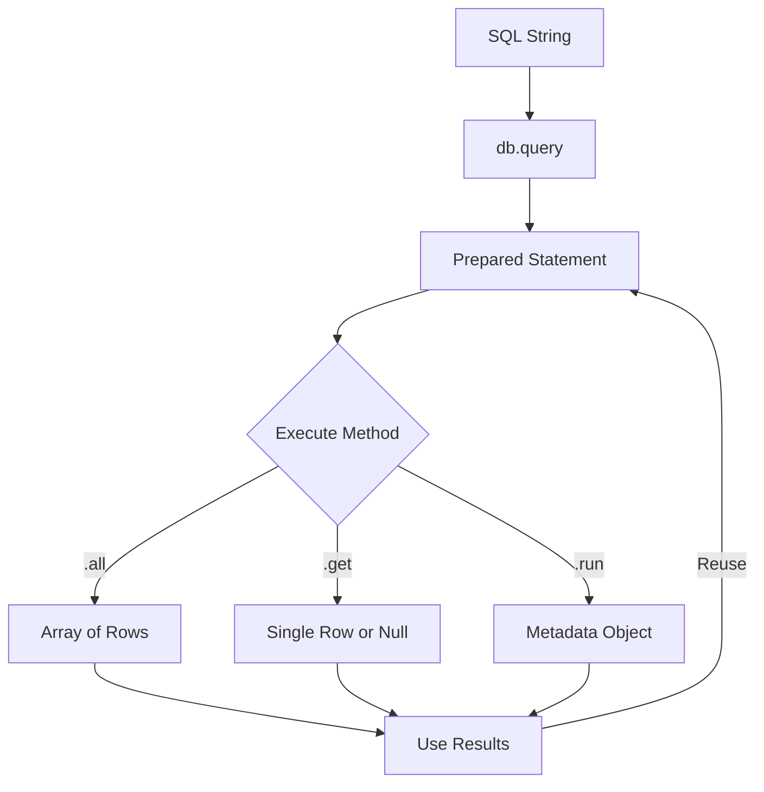
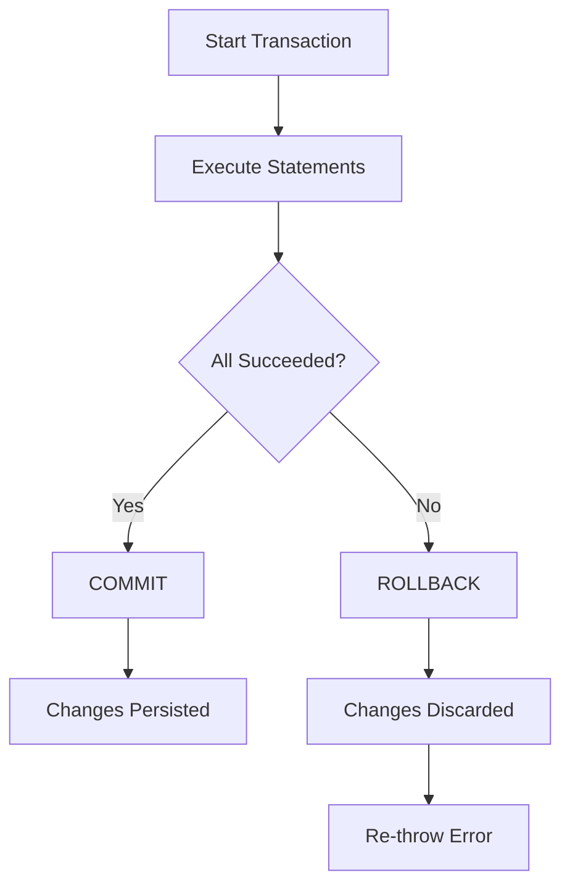

# How to Use Bun's SQLite Driver

Author: [nawazdhandala](https://www.github.com/nawazdhandala)

Tags: Bun, SQLite, Database, JavaScript, TypeScript, Performance

Description: A practical guide to using Bun's built-in SQLite driver for fast, synchronous database operations in your JavaScript and TypeScript applications.

---

Bun ships with a native SQLite driver that is surprisingly fast. Unlike Node.js where you need external packages like `better-sqlite3` or `sql.js`, Bun includes SQLite support out of the box through the `bun:sqlite` module. This guide covers everything you need to know to use it effectively - from opening databases to running migrations and optimizing performance.

## Why Bun's SQLite Driver?

SQLite is the most deployed database in the world. It runs everywhere - your phone, your browser, your IoT devices. Bun's implementation wraps SQLite directly in native code, giving you:

- **Synchronous API**: No async/await overhead for simple queries
- **Zero dependencies**: Built into the Bun runtime
- **Prepared statements**: Compile once, run many times
- **Type safety**: Works seamlessly with TypeScript

The synchronous nature might seem odd if you come from Node.js, but SQLite is an embedded database - there is no network round trip. Synchronous calls are actually the right choice here.

## Opening a Database

Getting started is straightforward. Import the `Database` class and create an instance.

```typescript
// Import the Database class from Bun's built-in SQLite module
import { Database } from "bun:sqlite";

// Open a database file - creates it if it does not exist
const db = new Database("myapp.db");

// For in-memory databases, pass ":memory:" - useful for testing
const memoryDb = new Database(":memory:");

// Open in read-only mode to prevent accidental writes
const readOnlyDb = new Database("myapp.db", { readonly: true });

// Create a database with strict mode enabled - recommended for new projects
const strictDb = new Database("myapp.db", { strict: true });
```

The `strict` option enables stricter type checking and disallows some SQLite quirks. I recommend enabling it for new projects.

## Running Basic Queries

Bun provides two main methods for running queries: `run()` for statements that do not return data, and `query()` for statements that do.

```typescript
import { Database } from "bun:sqlite";

const db = new Database("users.db");

// Use run() for CREATE, INSERT, UPDATE, DELETE - statements without results
db.run(`
  CREATE TABLE IF NOT EXISTS users (
    id INTEGER PRIMARY KEY AUTOINCREMENT,
    name TEXT NOT NULL,
    email TEXT UNIQUE NOT NULL,
    created_at TEXT DEFAULT CURRENT_TIMESTAMP
  )
`);

// Insert a row - run() returns metadata about the operation
const result = db.run(
  "INSERT INTO users (name, email) VALUES ('Alice', 'alice@example.com')"
);
console.log(result.lastInsertRowid); // 1
console.log(result.changes);         // 1

// Use query() to create a prepared statement for SELECT queries
const getAllUsers = db.query("SELECT * FROM users");

// Execute the prepared statement and get all results as an array
const users = getAllUsers.all();
console.log(users);
// [{ id: 1, name: 'Alice', email: 'alice@example.com', created_at: '2026-02-03 ...' }]
```

## Prepared Statements

Prepared statements are where Bun's SQLite driver really shines. Create them once, execute them many times with different parameters.

```typescript
import { Database } from "bun:sqlite";

const db = new Database("app.db");

// Create a prepared statement with named parameters using $prefix
const insertUser = db.query(
  "INSERT INTO users (name, email) VALUES ($name, $email)"
);

// Execute with an object - keys match parameter names without the $ prefix
insertUser.run({ name: "Bob", email: "bob@example.com" });
insertUser.run({ name: "Carol", email: "carol@example.com" });

// Positional parameters use ? placeholders
const findByEmail = db.query("SELECT * FROM users WHERE email = ?");

// Execute with positional arguments
const user = findByEmail.get("bob@example.com");
console.log(user); // { id: 2, name: 'Bob', email: 'bob@example.com', ... }

// all() returns an array, get() returns a single row or null
const findByName = db.query("SELECT * FROM users WHERE name LIKE ?");
const matches = findByName.all("%o%"); // Bob and Carol
```

Prepared statements have three main execution methods:

| Method | Returns | Use Case |
|--------|---------|----------|
| `all()` | Array of rows | Multiple results |
| `get()` | Single row or null | One result expected |
| `run()` | Metadata object | INSERT, UPDATE, DELETE |

## Parameterized Queries

Never concatenate user input into SQL strings. Always use parameters.

```typescript
import { Database } from "bun:sqlite";

const db = new Database("products.db");

// BAD - vulnerable to SQL injection
const userInput = "'; DROP TABLE products; --";
// db.run(`DELETE FROM products WHERE id = '${userInput}'`); // DO NOT DO THIS

// GOOD - parameters are escaped automatically
const deleteProduct = db.query("DELETE FROM products WHERE id = ?");
deleteProduct.run(userInput); // Safe - treats input as literal value

// Named parameters make complex queries more readable
const searchProducts = db.query(`
  SELECT * FROM products
  WHERE category = $category
    AND price BETWEEN $minPrice AND $maxPrice
    AND name LIKE $searchTerm
  ORDER BY price ASC
  LIMIT $limit
`);

const results = searchProducts.all({
  category: "electronics",
  minPrice: 100,
  maxPrice: 500,
  searchTerm: "%phone%",
  limit: 10,
});
```

## Transactions

Transactions ensure that a group of operations either all succeed or all fail. They also dramatically improve performance for bulk inserts.

```typescript
import { Database } from "bun:sqlite";

const db = new Database("orders.db");

// Manual transaction control
db.run("BEGIN TRANSACTION");
try {
  db.run("INSERT INTO orders (customer_id, total) VALUES (1, 99.99)");
  db.run("UPDATE inventory SET quantity = quantity - 1 WHERE product_id = 42");
  db.run("INSERT INTO order_items (order_id, product_id) VALUES (1, 42)");
  db.run("COMMIT");
} catch (error) {
  db.run("ROLLBACK");
  throw error;
}

// Better approach - use Bun's transaction helper
const transfer = db.transaction((from: number, to: number, amount: number) => {
  db.run("UPDATE accounts SET balance = balance - ? WHERE id = ?", [amount, from]);
  db.run("UPDATE accounts SET balance = balance + ? WHERE id = ?", [amount, to]);
});

// The transaction helper automatically commits on success, rolls back on error
transfer(1, 2, 100);
```

Transactions also provide huge performance gains for bulk operations. Without a transaction, each INSERT is a separate disk write. With a transaction, writes are batched.

```typescript
import { Database } from "bun:sqlite";

const db = new Database("benchmark.db");
db.run("CREATE TABLE numbers (value INTEGER)");

const insert = db.query("INSERT INTO numbers (value) VALUES (?)");

// Wrap bulk inserts in a transaction for 10-100x speedup
const bulkInsert = db.transaction((values: number[]) => {
  for (const value of values) {
    insert.run(value);
  }
});

// Insert 10,000 rows - fast because it is one transaction
const numbers = Array.from({ length: 10000 }, (_, i) => i);
bulkInsert(numbers);
```

## Type-Safe Queries with TypeScript

Bun's SQLite driver works naturally with TypeScript. Define interfaces for your data and cast query results.

```typescript
import { Database } from "bun:sqlite";

// Define your row types
interface User {
  id: number;
  name: string;
  email: string;
  created_at: string;
}

interface InsertResult {
  lastInsertRowid: number;
  changes: number;
}

const db = new Database("typed.db");

// Type the query result using generics
const findUser = db.query<User, [string]>("SELECT * FROM users WHERE email = ?");
const user = findUser.get("alice@example.com");
// TypeScript knows: user is User | null

// Type named parameters with an interface
interface UserParams {
  name: string;
  email: string;
}

const insertUser = db.query<InsertResult, UserParams>(
  "INSERT INTO users (name, email) VALUES ($name, $email) RETURNING *"
);

// TypeScript enforces the parameter shape
insertUser.run({ name: "Dave", email: "dave@example.com" });
```

## Running Migrations

Migrations let you evolve your database schema over time. Here is a simple migration system that tracks which migrations have been applied.

```typescript
import { Database } from "bun:sqlite";
import { readdirSync, readFileSync } from "fs";
import { join } from "path";

interface Migration {
  id: number;
  name: string;
  applied_at: string;
}

function runMigrations(db: Database, migrationsDir: string) {
  // Create migrations tracking table if it does not exist
  db.run(`
    CREATE TABLE IF NOT EXISTS migrations (
      id INTEGER PRIMARY KEY,
      name TEXT NOT NULL UNIQUE,
      applied_at TEXT DEFAULT CURRENT_TIMESTAMP
    )
  `);

  // Get list of already applied migrations
  const applied = db
    .query<Migration, []>("SELECT name FROM migrations")
    .all()
    .map((m) => m.name);

  // Read migration files from directory
  const files = readdirSync(migrationsDir)
    .filter((f) => f.endsWith(".sql"))
    .sort(); // Sort ensures order: 001_create_users.sql, 002_add_email.sql

  // Apply each pending migration in a transaction
  const applyMigration = db.transaction((name: string, sql: string) => {
    db.run(sql);
    db.run("INSERT INTO migrations (name) VALUES (?)", [name]);
    console.log(`Applied migration: ${name}`);
  });

  for (const file of files) {
    if (!applied.includes(file)) {
      const sql = readFileSync(join(migrationsDir, file), "utf-8");
      applyMigration(file, sql);
    }
  }
}

// Usage
const db = new Database("app.db");
runMigrations(db, "./migrations");
```

Create migration files with numbered prefixes to control execution order.

```sql
-- migrations/001_create_users.sql
CREATE TABLE users (
  id INTEGER PRIMARY KEY AUTOINCREMENT,
  name TEXT NOT NULL,
  email TEXT UNIQUE NOT NULL,
  created_at TEXT DEFAULT CURRENT_TIMESTAMP
);

CREATE INDEX idx_users_email ON users(email);
```

```sql
-- migrations/002_add_user_roles.sql
ALTER TABLE users ADD COLUMN role TEXT DEFAULT 'user';

CREATE TABLE roles (
  id INTEGER PRIMARY KEY AUTOINCREMENT,
  name TEXT UNIQUE NOT NULL,
  permissions TEXT
);
```

## Query Lifecycle

Understanding how queries flow through Bun's SQLite driver helps you write better code.



The prepared statement is compiled once and can be executed many times. This is much faster than parsing the SQL on every call.

## Transaction Flow

Here is how transactions work with error handling.



## Performance Tips

### 1. Use WAL Mode

Write-Ahead Logging improves concurrent read/write performance dramatically.

```typescript
import { Database } from "bun:sqlite";

const db = new Database("app.db");

// Enable WAL mode - do this once when creating the database
db.run("PRAGMA journal_mode = WAL");

// Verify it is enabled
const mode = db.query("PRAGMA journal_mode").get();
console.log(mode); // { journal_mode: 'wal' }
```

### 2. Tune SQLite Settings

These pragmas can significantly improve performance depending on your use case.

```typescript
import { Database } from "bun:sqlite";

const db = new Database("app.db");

// WAL mode for better concurrency
db.run("PRAGMA journal_mode = WAL");

// Store temp tables in memory instead of disk
db.run("PRAGMA temp_store = MEMORY");

// Increase cache size - default is 2MB, this sets 64MB
// Negative number means KB, positive means pages
db.run("PRAGMA cache_size = -64000");

// Reduce durability for speed - only use if you can tolerate data loss on crash
// db.run("PRAGMA synchronous = NORMAL");

// Enable memory-mapped I/O for large databases
// This maps 256MB of the database file into memory
db.run("PRAGMA mmap_size = 268435456");
```

### 3. Batch Inserts in Transactions

Individual inserts are slow because each one is a separate disk sync.

```typescript
import { Database } from "bun:sqlite";

const db = new Database("benchmark.db");

// Prepare the statement once
const insert = db.query("INSERT INTO events (type, data) VALUES (?, ?)");

// Without transaction - each insert syncs to disk
// 1000 inserts might take 30+ seconds

// With transaction - one sync at the end
// 1000 inserts take milliseconds
const bulkInsert = db.transaction((events: Array<{ type: string; data: string }>) => {
  for (const event of events) {
    insert.run(event.type, event.data);
  }
});

// Insert batch
bulkInsert([
  { type: "click", data: '{"x": 100, "y": 200}' },
  { type: "scroll", data: '{"direction": "down"}' },
  // ... thousands more
]);
```

### 4. Use Indexes Wisely

Indexes speed up reads but slow down writes. Add them for columns you query frequently.

```typescript
import { Database } from "bun:sqlite";

const db = new Database("app.db");

// Create indexes for commonly queried columns
db.run("CREATE INDEX IF NOT EXISTS idx_users_email ON users(email)");
db.run("CREATE INDEX IF NOT EXISTS idx_orders_user_id ON orders(user_id)");
db.run("CREATE INDEX IF NOT EXISTS idx_orders_created ON orders(created_at)");

// Composite index for queries that filter on multiple columns
db.run("CREATE INDEX IF NOT EXISTS idx_orders_user_status ON orders(user_id, status)");

// Check what indexes exist
const indexes = db.query(`
  SELECT name, sql FROM sqlite_master
  WHERE type = 'index' AND sql IS NOT NULL
`).all();
console.log(indexes);
```

### 5. Analyze Query Plans

Use EXPLAIN QUERY PLAN to understand how SQLite executes your queries.

```typescript
import { Database } from "bun:sqlite";

const db = new Database("app.db");

// See how SQLite will execute a query
const plan = db.query(`
  EXPLAIN QUERY PLAN
  SELECT * FROM orders
  WHERE user_id = 123
  ORDER BY created_at DESC
  LIMIT 10
`).all();

console.log(plan);
// Look for SCAN vs SEARCH - SEARCH means an index is being used
// SCAN means full table scan - usually bad for large tables
```

## Common Patterns

### Repository Pattern

Encapsulate database operations in a class for cleaner code.

```typescript
import { Database } from "bun:sqlite";

interface User {
  id: number;
  name: string;
  email: string;
}

class UserRepository {
  private db: Database;
  private findByIdStmt;
  private findByEmailStmt;
  private insertStmt;
  private updateStmt;
  private deleteStmt;

  constructor(db: Database) {
    this.db = db;

    // Prepare all statements upfront
    this.findByIdStmt = db.query<User, [number]>(
      "SELECT * FROM users WHERE id = ?"
    );
    this.findByEmailStmt = db.query<User, [string]>(
      "SELECT * FROM users WHERE email = ?"
    );
    this.insertStmt = db.query(
      "INSERT INTO users (name, email) VALUES ($name, $email)"
    );
    this.updateStmt = db.query(
      "UPDATE users SET name = $name, email = $email WHERE id = $id"
    );
    this.deleteStmt = db.query("DELETE FROM users WHERE id = ?");
  }

  findById(id: number): User | null {
    return this.findByIdStmt.get(id);
  }

  findByEmail(email: string): User | null {
    return this.findByEmailStmt.get(email);
  }

  create(name: string, email: string): number {
    const result = this.insertStmt.run({ name, email });
    return Number(result.lastInsertRowid);
  }

  update(id: number, name: string, email: string): boolean {
    const result = this.updateStmt.run({ id, name, email });
    return result.changes > 0;
  }

  delete(id: number): boolean {
    const result = this.deleteStmt.run(id);
    return result.changes > 0;
  }
}

// Usage
const db = new Database("app.db");
const users = new UserRepository(db);

const userId = users.create("Eve", "eve@example.com");
const user = users.findById(userId);
```

### Connection Pool Alternative

SQLite does not need connection pools like PostgreSQL or MySQL because it is an embedded database. However, you might want multiple database instances for different purposes.

```typescript
import { Database } from "bun:sqlite";

// One writer, multiple readers - works well with WAL mode
const writer = new Database("app.db");
writer.run("PRAGMA journal_mode = WAL");

// Readers can operate concurrently with the writer in WAL mode
const reader1 = new Database("app.db", { readonly: true });
const reader2 = new Database("app.db", { readonly: true });

// Use the writer for mutations
writer.run("INSERT INTO events (type) VALUES ('click')");

// Use readers for queries - they see a consistent snapshot
const events1 = reader1.query("SELECT * FROM events").all();
const events2 = reader2.query("SELECT COUNT(*) as count FROM events").get();
```

## Cleanup

Always close the database when you are done to release file locks and flush pending writes.

```typescript
import { Database } from "bun:sqlite";

const db = new Database("app.db");

// Do your work
db.run("INSERT INTO logs (message) VALUES ('Application started')");

// Close when done - this is important!
db.close();

// For long-running applications, close on shutdown
process.on("SIGINT", () => {
  console.log("Shutting down...");
  db.close();
  process.exit(0);
});

process.on("SIGTERM", () => {
  db.close();
  process.exit(0);
});
```

## Summary

Bun's SQLite driver gives you a fast, simple way to work with SQLite databases. The synchronous API makes sense for an embedded database, and prepared statements keep your queries both safe and fast.

| Feature | How to Use |
|---------|------------|
| Open database | `new Database("file.db")` |
| Run statement | `db.run(sql)` |
| Query single row | `db.query(sql).get(params)` |
| Query all rows | `db.query(sql).all(params)` |
| Parameterized queries | Use `?` or `$name` placeholders |
| Transactions | `db.transaction(fn)` |
| Performance | Enable WAL mode, use indexes |

Start with the basics, measure your performance, and add optimizations as needed. SQLite handles more than most people expect - it can easily manage millions of rows and thousands of queries per second on modern hardware.
