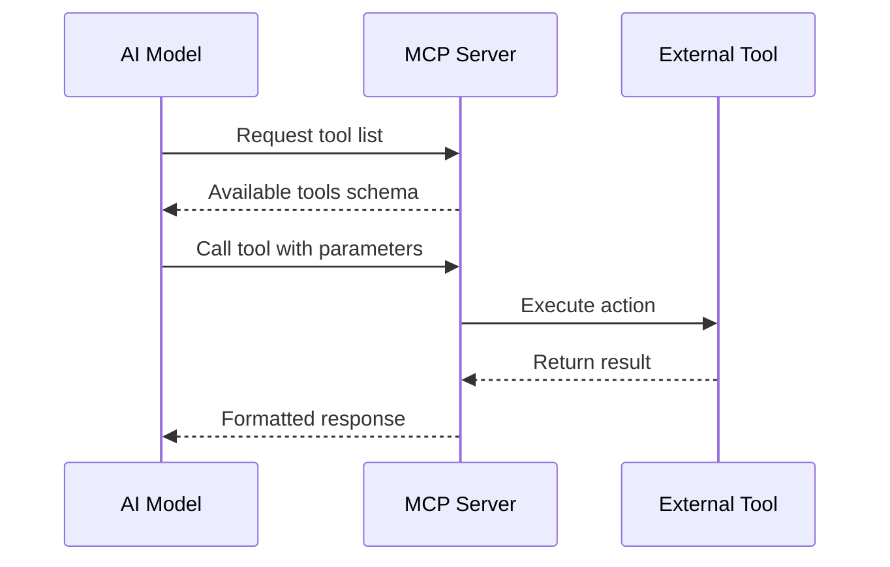
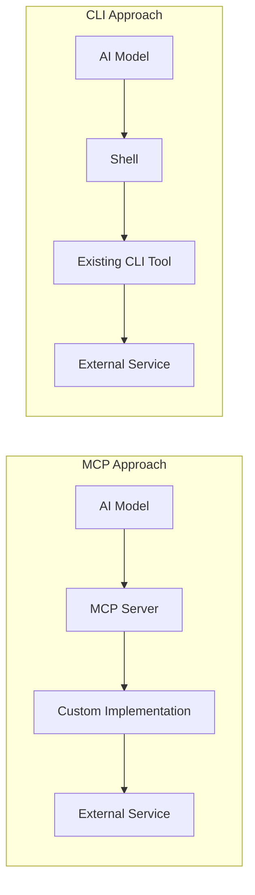
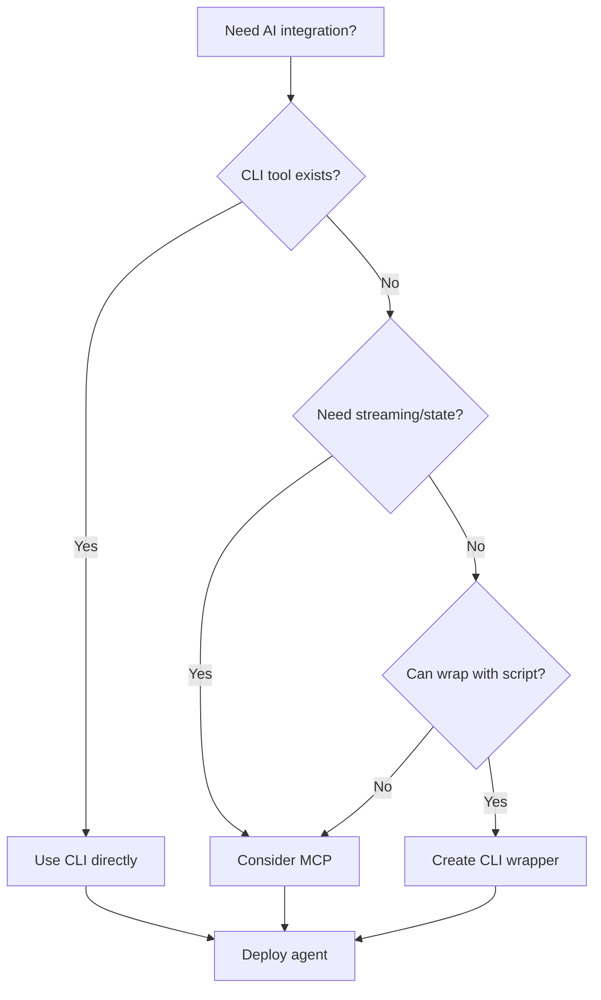

# Why CLI is the New MCP for AI Agents

Author: [nawazdhandala](https://www.github.com/nawazdhandala)

Tags: AI Agents, CLI, MCP, Model Context Protocol, Automation, Developer Tools, LLM, DevOps, Software Architecture

Description: A deep dive into why Command Line Interfaces are emerging as the superior integration pattern for AI agents compared to the Model Context Protocol, with practical examples and architectural insights.

---

> The best interface for AI agents isn't a new protocol-it's the one that's been on every Unix system since 1971. As we build increasingly capable AI systems, the humble command line is proving to be the most robust, universal, and battle-tested way for agents to interact with the world.

The Model Context Protocol (MCP) promised to standardize how AI models interact with external tools and data sources. While MCP represents an important step forward, a simpler pattern is emerging as the de facto standard for AI agent integrations: the Command Line Interface. Here's why CLI is becoming the preferred interface for AI agents and what this means for developers building AI-powered tools.

---

## Understanding MCP

The Model Context Protocol is a specification that defines how AI models can interact with external services. It provides a structured way for AI assistants to call tools, retrieve context, and maintain state across interactions.

A typical MCP integration looks like this:



MCP servers must be implemented, deployed, and maintained for each integration. They require specific SDKs, handle authentication, manage state, and translate between the protocol and the underlying service.

---

## The Hidden Complexity of MCP

While MCP provides structure, it also introduces significant overhead:

### 1. Implementation Burden

Every new integration requires building and maintaining an MCP server. This means:
- Learning the MCP SDK
- Implementing tool schemas
- Handling edge cases and errors
- Keeping up with protocol changes
- Managing deployment and hosting

### 2. Limited Ecosystem

MCP servers must be purpose-built for each tool. If a service doesn't have an MCP server, you need to create one. This creates a bootstrap problem: the protocol's value depends on available integrations, but integrations require significant investment.

### 3. Version and Compatibility Issues

As MCP evolves, servers must be updated. Different AI systems may support different MCP versions, leading to fragmentation.

### 4. State Management Complexity

MCP servers often need to maintain state between calls, handle authentication tokens, and manage sessions. This adds operational complexity.

---

## Why CLI Works Better

Command Line Interfaces offer a fundamentally different approach that addresses many of MCP's limitations.



### 1. Universal Availability

CLIs already exist for virtually every service developers use:
- `git` for version control
- `kubectl` for Kubernetes
- `aws`, `gcloud`, `az` for cloud providers
- `docker` for containers
- `npm`, `pip`, `cargo` for package managers
- `curl`, `wget` for HTTP requests
- `jq` for JSON processing

These tools are maintained by the service providers themselves, ensuring they stay current with API changes.

### 2. Zero Implementation Required

When an AI agent needs to interact with GitHub, it doesn't need a custom MCP server-it uses `gh`:

```bash
# List open pull requests
gh pr list --state open

# Create a new issue
gh issue create --title "Bug report" --body "Description here"

# View CI status
gh run list --limit 5
```

The AI model simply generates and executes shell commands. The existing CLI handles authentication, API calls, pagination, and error handling.

### 3. Composability

Unix philosophy shines here. CLIs can be piped, combined, and composed in ways that structured protocols struggle to match:

```bash
# Find large files in git history
git rev-list --objects --all | \
  git cat-file --batch-check='%(objecttype) %(objectname) %(objectsize) %(rest)' | \
  awk '/^blob/ {print $3, $4}' | \
  sort -rn | head -20

# Get Kubernetes pods using more than 1GB memory
kubectl top pods --all-namespaces | \
  awk 'NR>1 && $4 ~ /Gi/ && $4+0 > 1 {print $1, $2, $4}'

# Find and fix formatting in all Python files
find . -name "*.py" -exec black {} \;
```

This composability allows AI agents to solve complex problems by chaining simple commands.

### 4. Documentation as Interface

CLI tools come with built-in documentation through `--help` and man pages. AI agents can query this documentation to understand available options:

```bash
# AI can explore what a command does
terraform --help

# And drill into specific subcommands
terraform plan --help
```

This self-documenting nature means AI agents can discover capabilities without external schema definitions.

---

## Real-World Comparison

Let's compare implementing the same functionality through MCP versus CLI.

### Task: Deploy a Kubernetes Application

**MCP Approach:**

First, you need an MCP server that wraps kubectl:

```python
# kubernetes_mcp_server.py
# Requires implementing a full MCP server from scratch
from mcp import Server, Tool

class KubernetesMCPServer(Server):
    def __init__(self):
        super().__init__()
        self.register_tool(
            Tool(
                name="apply_manifest",
                description="Apply a Kubernetes manifest",
                parameters={
                    "type": "object",
                    "properties": {
                        "manifest_path": {"type": "string"},
                        "namespace": {"type": "string"}
                    }
                }
            )
        )

    async def apply_manifest(self, manifest_path: str, namespace: str = "default"):
        # Implementation here
        pass

# Plus authentication handling, error mapping, etc.
```

**CLI Approach:**

The AI agent simply generates the kubectl command:

```bash
# Apply a manifest
kubectl apply -f deployment.yaml -n production

# Check rollout status
kubectl rollout status deployment/myapp -n production

# View logs if something goes wrong
kubectl logs -l app=myapp -n production --tail=100
```

No custom server needed. The AI uses the same commands a human developer would use.

---

## The AI Agent Perspective

From an AI agent's perspective, CLI tools provide several advantages:

### 1. Familiar Patterns

AI models are trained on vast amounts of shell scripts, documentation, and command examples. They have deep knowledge of CLI syntax and conventions:

```bash
# AI models understand common patterns intuitively
grep -r "TODO" --include="*.py" .
find . -type f -mtime +30 -delete
tar -czvf backup.tar.gz /data
```

### 2. Predictable Output

CLI tools generally produce consistent, parseable output. Many support structured formats:

```bash
# JSON output for programmatic parsing
aws ec2 describe-instances --output json
kubectl get pods -o json
docker inspect container_id

# Table format for human readability
kubectl get pods -o wide
```

### 3. Error Handling Built-In

CLIs have established patterns for error reporting through exit codes and stderr:

```bash
# Check if a command succeeded
if kubectl apply -f manifest.yaml; then
    echo "Applied successfully"
else
    echo "Failed to apply manifest"
fi

# Capture stderr for error analysis
output=$(terraform plan 2>&1)
```

AI agents can use these patterns to detect and recover from failures.

---

## Security Considerations

Both approaches have security implications, but CLI offers some advantages:

### 1. Explicit Permissions

CLI tools use the system's existing permission model. The AI agent operates with the same permissions as the user running it:

```bash
# User's existing credentials
aws s3 ls s3://my-bucket  # Uses ~/.aws/credentials

# Can be restricted with profiles
aws s3 ls --profile readonly
```

### 2. Audit Trail

Shell history and command logs provide a clear audit trail:

```bash
# All commands are logged
history | tail -50

# Or use explicit logging
script -q /dev/null -c "kubectl delete pod mypod"
```

### 3. Sandboxing Options

CLI commands can be sandboxed using containers or restricted shells:

```bash
# Run in isolated environment
docker run --rm -v $(pwd):/work alpine sh -c "ls /work"

# Use restricted shell
rbash -c "echo 'limited commands'"
```

---

## Building AI Agents with CLI

Here's how to build an AI agent that effectively uses CLI tools.

The following example shows a basic AI agent that executes shell commands to accomplish tasks.

```python
# cli_agent.py
# A simple AI agent that uses CLI tools
import subprocess
import json
from typing import Optional

class CLIAgent:
    """
    An AI agent that interacts with systems through CLI commands.

    This approach leverages existing CLI tools rather than
    requiring custom integrations for each service.
    """

    def __init__(self, allowed_commands: Optional[list] = None):
        # Optional: restrict which commands can be executed
        # for security in production environments
        self.allowed_commands = allowed_commands
        self.history = []

    def execute(self, command: str, timeout: int = 30) -> dict:
        """
        Execute a shell command and return structured results.

        Args:
            command: The shell command to execute
            timeout: Maximum execution time in seconds

        Returns:
            Dictionary with stdout, stderr, and exit code
        """
        # Security check: verify command is allowed
        if self.allowed_commands:
            cmd_base = command.split()[0]
            if cmd_base not in self.allowed_commands:
                return {
                    "stdout": "",
                    "stderr": f"Command '{cmd_base}' not allowed",
                    "exit_code": 1,
                    "success": False
                }

        try:
            # Execute the command with timeout
            result = subprocess.run(
                command,
                shell=True,
                capture_output=True,
                text=True,
                timeout=timeout
            )

            # Record in history for debugging
            self.history.append({
                "command": command,
                "exit_code": result.returncode,
                "success": result.returncode == 0
            })

            return {
                "stdout": result.stdout,
                "stderr": result.stderr,
                "exit_code": result.returncode,
                "success": result.returncode == 0
            }

        except subprocess.TimeoutExpired:
            return {
                "stdout": "",
                "stderr": f"Command timed out after {timeout} seconds",
                "exit_code": -1,
                "success": False
            }
        except Exception as e:
            return {
                "stdout": "",
                "stderr": str(e),
                "exit_code": -1,
                "success": False
            }

    def execute_with_retry(
        self,
        command: str,
        max_retries: int = 3,
        retry_delay: int = 2
    ) -> dict:
        """
        Execute a command with automatic retry on failure.

        Useful for network operations that may have
        transient failures.
        """
        import time

        for attempt in range(max_retries):
            result = self.execute(command)

            if result["success"]:
                return result

            if attempt < max_retries - 1:
                time.sleep(retry_delay)

        return result

# Example usage demonstrating common AI agent tasks
def demo_agent():
    # Create agent with restricted command set for safety
    agent = CLIAgent(allowed_commands=[
        "git", "kubectl", "docker", "curl", "jq", "ls", "cat"
    ])

    # Check git status
    result = agent.execute("git status --porcelain")
    if result["success"]:
        print("Modified files:", result["stdout"])

    # Query Kubernetes cluster
    result = agent.execute(
        "kubectl get pods -o json | jq '.items[].metadata.name'"
    )
    if result["success"]:
        print("Pods:", result["stdout"])

    # Make an API call and process the response
    result = agent.execute(
        "curl -s https://api.github.com/repos/oneuptime/oneuptime | jq '.stargazers_count'"
    )
    if result["success"]:
        print("Stars:", result["stdout"])

if __name__ == "__main__":
    demo_agent()
```

### Integrating with LLM

The following code shows how to combine an LLM with CLI execution for autonomous task completion.

```python
# llm_cli_agent.py
# Combining LLM reasoning with CLI execution
from openai import OpenAI
import json

class LLMCLIAgent:
    """
    An AI agent that uses an LLM to reason about tasks
    and execute them through CLI commands.
    """

    def __init__(self, cli_agent, openai_client):
        self.cli = cli_agent
        self.llm = openai_client

    def solve_task(self, task: str, max_iterations: int = 10) -> str:
        """
        Use the LLM to plan and execute CLI commands
        to accomplish a task.

        Args:
            task: Natural language description of the task
            max_iterations: Maximum number of command executions

        Returns:
            Final result or summary of actions taken
        """
        messages = [
            {
                "role": "system",
                "content": """You are a CLI expert assistant.
                When given a task, respond with shell commands to accomplish it.
                Format commands in ```bash code blocks.
                After seeing command output, analyze results and continue or conclude."""
            },
            {"role": "user", "content": task}
        ]

        for _ in range(max_iterations):
            # Get LLM response
            response = self.llm.chat.completions.create(
                model="gpt-4",
                messages=messages
            )

            assistant_message = response.choices[0].message.content
            messages.append({"role": "assistant", "content": assistant_message})

            # Extract and execute any commands
            commands = self._extract_commands(assistant_message)

            if not commands:
                # No more commands - task is complete
                return assistant_message

            # Execute each command and collect results
            results = []
            for cmd in commands:
                result = self.cli.execute(cmd)
                results.append(f"$ {cmd}\n{result['stdout']}{result['stderr']}")

            # Add results to conversation
            messages.append({
                "role": "user",
                "content": "Command output:\n" + "\n".join(results)
            })

        return "Max iterations reached"

    def _extract_commands(self, text: str) -> list:
        """Extract bash commands from markdown code blocks."""
        import re
        # Match ```bash ... ``` blocks
        pattern = r'```bash\n(.*?)\n```'
        matches = re.findall(pattern, text, re.DOTALL)

        commands = []
        for match in matches:
            # Split multi-line commands
            for line in match.strip().split('\n'):
                line = line.strip()
                # Skip comments and empty lines
                if line and not line.startswith('#'):
                    commands.append(line)

        return commands
```

---

## The Ecosystem Effect

One of CLI's greatest strengths is its ecosystem. Every major service invests in high-quality CLI tools:

| Service | CLI Tool | Features |
|---------|----------|----------|
| GitHub | `gh` | PRs, issues, actions, releases |
| AWS | `aws` | All AWS services |
| Google Cloud | `gcloud` | All GCP services |
| Azure | `az` | All Azure services |
| Kubernetes | `kubectl` | Full cluster management |
| Docker | `docker` | Container lifecycle |
| Terraform | `terraform` | Infrastructure as code |
| Vercel | `vercel` | Deployment and config |
| Netlify | `netlify` | Deployment and functions |

These tools are:
- **Maintained by experts** who understand the underlying service
- **Updated quickly** when APIs change
- **Well-documented** with extensive examples
- **Battle-tested** by millions of users

Building MCP servers for each of these would require duplicating enormous amounts of work that's already been done well.

---

## When MCP Still Makes Sense

MCP isn't obsolete-it serves different use cases:

### 1. Non-CLI Services

Some services don't have CLI tools. For these, MCP provides a structured integration path.

### 2. Stateful Interactions

When you need complex state management between calls, MCP's server model can be helpful.

### 3. Real-Time Streaming

MCP supports streaming responses better than typical CLI patterns.

### 4. Custom Business Logic

When you need to wrap business rules around tool access, MCP servers provide that abstraction layer.

---

## Practical Guidelines

If you're building AI agents, consider this decision framework:



### Recommended Approach

1. **Default to CLI**: If a CLI tool exists, use it
2. **Wrap when needed**: Create simple CLI wrappers for APIs without CLIs
3. **Use MCP selectively**: Reserve MCP for complex stateful integrations
4. **Invest in tooling**: Build robust command execution infrastructure

---

## Conclusion

The shift toward CLI-based AI agent integrations represents a return to Unix philosophy: small, composable tools that do one thing well. Rather than building elaborate new protocols, we can leverage decades of investment in command-line tooling.

This approach offers:
- **Immediate access** to thousands of existing tools
- **Zero implementation overhead** for most integrations
- **Proven reliability** from battle-tested software
- **Natural composability** through pipes and scripts
- **Self-documenting interfaces** through help systems

As AI agents become more capable, the CLI emerges not as a limitation but as an enabler-a universal interface that connects AI to the vast ecosystem of developer tools.

The future of AI agent integrations isn't a new protocol. It's the one we've had all along.

---

*Building AI applications that interact with your infrastructure? [OneUptime](https://oneuptime.com) provides comprehensive observability for your AI systems, including command execution monitoring, latency tracking, and error alerting with native OpenTelemetry support.*

**Related Reading:**
- [How to Build Agents with LangChain](https://oneuptime.com/blog/post/2026-02-02-langchain-agents/view)
- [How to Build CLI Applications with Click and Typer](https://oneuptime.com/blog/post/2025-07-02-python-cli-click-typer/view)
