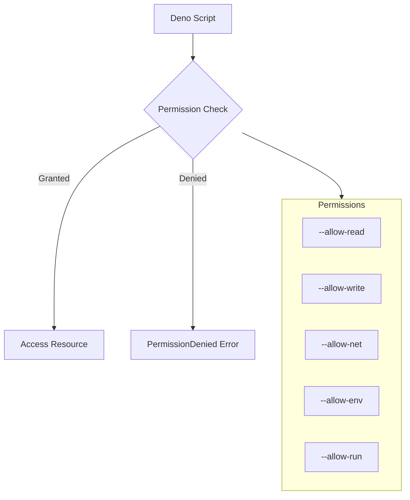
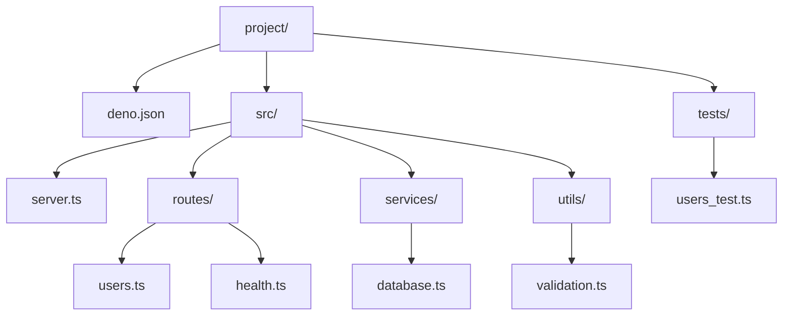

# How to Use Deno with TypeScript

Author: [nawazdhandala](https://www.github.com/nawazdhandala)

Tags: Deno, TypeScript, JavaScript, Backend, DevOps

Description: A practical guide to building TypeScript applications with Deno - covering setup, permissions, HTTP servers, file operations, testing, and configuration.

---

Deno is a modern JavaScript and TypeScript runtime built by Ryan Dahl, the original creator of Node.js. Unlike Node, Deno supports TypeScript out of the box - no build step, no transpilation config, no fuss. You write `.ts` files, run them directly, and Deno handles the rest.

This guide walks through the core concepts you need to build real applications with Deno.

## Why Deno?

Before diving in, here is why developers are picking Deno over traditional Node.js setups:

| Feature | Deno | Node.js |
|---------|------|---------|
| TypeScript | Built-in, zero config | Requires ts-node or build step |
| Permissions | Explicit, secure by default | Full system access |
| Package management | URL imports, no node_modules | npm, package.json required |
| Standard library | Audited, maintained by Deno team | Community packages (varying quality) |
| Single executable | Yes | Requires runtime installation |

## Installing Deno

Deno ships as a single executable. Pick your platform:

```bash
# macOS / Linux - using the official install script
curl -fsSL https://deno.land/install.sh | sh

# macOS - using Homebrew
brew install deno

# Windows - using PowerShell
irm https://deno.land/install.ps1 | iex

# Windows - using Chocolatey
choco install deno
```

Verify your installation:

```bash
# Should print the version number (e.g., deno 2.x.x)
deno --version
```

## TypeScript Without Configuration

Create a file called `hello.ts`:

```typescript
// Deno runs TypeScript directly - no tsconfig.json needed
// Type annotations work immediately

interface User {
  id: number;
  name: string;
  email: string;
}

function greetUser(user: User): string {
  return `Hello, ${user.name}!`;
}

const user: User = {
  id: 1,
  name: "Alice",
  email: "alice@example.com",
};

console.log(greetUser(user));
```

Run it directly:

```bash
# Deno compiles and runs TypeScript in one step
deno run hello.ts
```

No `tsc`, no `ts-node`, no `tsconfig.json`. Deno uses a sensible default TypeScript configuration, and you can override it later if needed.

## The Permissions Model

Deno is secure by default. Your code cannot access the filesystem, network, or environment variables unless you explicitly grant permission.



### Permission Flags

Here are the most common permission flags:

```bash
# Read files from specific directories only
deno run --allow-read=./data,./config app.ts

# Write to a specific directory
deno run --allow-write=./output app.ts

# Network access to specific hosts
deno run --allow-net=api.example.com,localhost:8000 app.ts

# Access environment variables
deno run --allow-env=DATABASE_URL,API_KEY app.ts

# Run subprocesses
deno run --allow-run=git,npm app.ts

# Grant all permissions (use sparingly, defeats the security model)
deno run --allow-all app.ts
```

### Requesting Permissions at Runtime

You can also request permissions programmatically:

```typescript
// Check if we have read permission before attempting file access
const readPermission = await Deno.permissions.query({
  name: "read",
  path: "./data",
});

if (readPermission.state === "granted") {
  const content = await Deno.readTextFile("./data/config.json");
  console.log(content);
} else {
  // Request permission interactively
  const requested = await Deno.permissions.request({
    name: "read",
    path: "./data",
  });

  if (requested.state === "granted") {
    const content = await Deno.readTextFile("./data/config.json");
    console.log(content);
  } else {
    console.error("Permission denied - cannot read config");
  }
}
```

## Import Maps

Instead of `node_modules`, Deno imports modules directly from URLs. Import maps let you create aliases for cleaner imports.

Create `deno.json` in your project root:

```json
{
  "imports": {
    "@std/": "jsr:@std/",
    "oak": "jsr:@oak/oak@^17.0.0",
    "zod": "npm:zod@^3.23.0",
    "@/": "./src/"
  }
}
```

Now your imports look clean:

```typescript
// Instead of long URLs, use your aliases
import { Application, Router } from "oak";
import { z } from "zod";
import { parseArgs } from "@std/cli";
import { Database } from "@/database.ts";

// The @std/ prefix maps to the Deno standard library on JSR
// The @/ prefix maps to your local src directory
```

Deno supports three module sources:

- **JSR** (`jsr:@scope/package`) - Deno's native registry, TypeScript-first
- **npm** (`npm:package`) - Full npm compatibility
- **URLs** (`https://deno.land/...`) - Direct URL imports

## Building an HTTP Server with Deno.serve

Deno has a built-in HTTP server that is fast and simple. No frameworks required for basic use cases.

```typescript
// server.ts - A minimal HTTP server using Deno.serve

// Deno.serve handles connection management, keep-alive, and graceful shutdown
Deno.serve({ port: 8000 }, async (request: Request): Promise<Response> => {
  const url = new URL(request.url);

  // Simple routing based on pathname
  if (url.pathname === "/" && request.method === "GET") {
    return new Response("Welcome to the API", {
      headers: { "content-type": "text/plain" },
    });
  }

  if (url.pathname === "/health" && request.method === "GET") {
    return Response.json({ status: "healthy", timestamp: Date.now() });
  }

  if (url.pathname === "/users" && request.method === "POST") {
    // Parse JSON body - Deno uses standard Web APIs
    const body = await request.json();
    console.log("Creating user:", body);

    return Response.json(
      { id: crypto.randomUUID(), ...body },
      { status: 201 }
    );
  }

  // 404 for unmatched routes
  return new Response("Not Found", { status: 404 });
});

console.log("Server running on http://localhost:8000");
```

Run the server:

```bash
# Grant network permission for the server to bind to a port
deno run --allow-net server.ts
```

### Using Oak for Larger Applications

For more complex routing and middleware, Oak is a popular choice:

```typescript
// app.ts - HTTP server using Oak framework

import { Application, Router } from "oak";

// Create a router for organizing endpoints
const router = new Router();

// In-memory storage for this example
const users: Map<string, { id: string; name: string; email: string }> = new Map();

// Define routes with proper HTTP methods
router
  .get("/", (ctx) => {
    ctx.response.body = { message: "API is running" };
  })
  .get("/users", (ctx) => {
    // Convert Map values to array for JSON response
    ctx.response.body = Array.from(users.values());
  })
  .get("/users/:id", (ctx) => {
    const user = users.get(ctx.params.id);
    if (user) {
      ctx.response.body = user;
    } else {
      ctx.response.status = 404;
      ctx.response.body = { error: "User not found" };
    }
  })
  .post("/users", async (ctx) => {
    const body = await ctx.request.body.json();
    const id = crypto.randomUUID();
    const user = { id, ...body };
    users.set(id, user);

    ctx.response.status = 201;
    ctx.response.body = user;
  })
  .delete("/users/:id", (ctx) => {
    const deleted = users.delete(ctx.params.id);
    ctx.response.status = deleted ? 204 : 404;
  });

// Create application and wire up middleware
const app = new Application();

// Logging middleware - runs for every request
app.use(async (ctx, next) => {
  const start = Date.now();
  await next();
  const ms = Date.now() - start;
  console.log(`${ctx.request.method} ${ctx.request.url} - ${ms}ms`);
});

// Error handling middleware
app.use(async (ctx, next) => {
  try {
    await next();
  } catch (err) {
    console.error("Unhandled error:", err);
    ctx.response.status = 500;
    ctx.response.body = { error: "Internal server error" };
  }
});

// Register routes
app.use(router.routes());
app.use(router.allowedMethods());

console.log("Server starting on http://localhost:8000");
await app.listen({ port: 8000 });
```

## File Operations

Deno provides both synchronous and asynchronous file APIs. Use async for better performance in servers.

### Reading Files

```typescript
// file-operations.ts - Common file operations in Deno

// Read entire file as text (async)
const configText = await Deno.readTextFile("./config.json");
const config = JSON.parse(configText);

// Read file as bytes for binary data
const imageBytes = await Deno.readFile("./image.png");
console.log(`Image size: ${imageBytes.length} bytes`);

// Read file line by line for large files
import { TextLineStream } from "@std/streams";

const file = await Deno.open("./large-log.txt", { read: true });

// Create a readable stream and pipe through line splitter
const lineStream = file.readable
  .pipeThrough(new TextDecoderStream())
  .pipeThrough(new TextLineStream());

// Process lines one at a time - memory efficient
for await (const line of lineStream) {
  if (line.includes("ERROR")) {
    console.log(line);
  }
}
```

### Writing Files

```typescript
// Write text to a file (creates or overwrites)
await Deno.writeTextFile("./output.txt", "Hello, Deno!");

// Write with options - append instead of overwrite
await Deno.writeTextFile("./log.txt", "New log entry\n", { append: true });

// Write binary data
const data = new Uint8Array([72, 101, 108, 108, 111]); // "Hello" in bytes
await Deno.writeFile("./binary.dat", data);

// Write JSON with pretty formatting
const userData = { name: "Alice", email: "alice@example.com" };
await Deno.writeTextFile(
  "./user.json",
  JSON.stringify(userData, null, 2)
);
```

### Directory Operations

```typescript
// Create directories (recursive creates parent dirs too)
await Deno.mkdir("./data/backups", { recursive: true });

// List directory contents
for await (const entry of Deno.readDir("./data")) {
  const type = entry.isFile ? "file" : entry.isDirectory ? "dir" : "other";
  console.log(`${type}: ${entry.name}`);
}

// Get file metadata
const stat = await Deno.stat("./config.json");
console.log(`Size: ${stat.size} bytes`);
console.log(`Modified: ${stat.mtime}`);
console.log(`Is file: ${stat.isFile}`);

// Check if file exists
async function fileExists(path: string): Promise<boolean> {
  try {
    await Deno.stat(path);
    return true;
  } catch (error) {
    if (error instanceof Deno.errors.NotFound) {
      return false;
    }
    throw error;
  }
}
```

## Testing with Deno

Deno has a built-in test runner. No need for Jest, Mocha, or other test frameworks.

```typescript
// math.ts - Module to test
export function add(a: number, b: number): number {
  return a + b;
}

export function divide(a: number, b: number): number {
  if (b === 0) {
    throw new Error("Cannot divide by zero");
  }
  return a / b;
}

export async function fetchUser(id: string): Promise<{ id: string; name: string }> {
  const response = await fetch(`https://api.example.com/users/${id}`);
  if (!response.ok) {
    throw new Error(`Failed to fetch user: ${response.status}`);
  }
  return response.json();
}
```

```typescript
// math_test.ts - Test file (must end in _test.ts or .test.ts)
import { assertEquals, assertThrows, assertRejects } from "@std/assert";
import { stub } from "@std/testing/mock";
import { add, divide, fetchUser } from "./math.ts";

// Basic test - Deno.test registers a test case
Deno.test("add function adds two numbers", () => {
  assertEquals(add(2, 3), 5);
  assertEquals(add(-1, 1), 0);
  assertEquals(add(0, 0), 0);
});

// Test for expected errors
Deno.test("divide throws on division by zero", () => {
  assertThrows(
    () => divide(10, 0),
    Error,
    "Cannot divide by zero"
  );
});

// Async test with mocked fetch
Deno.test("fetchUser returns user data", async () => {
  // Stub the global fetch function
  const fetchStub = stub(
    globalThis,
    "fetch",
    () =>
      Promise.resolve(
        new Response(JSON.stringify({ id: "123", name: "Alice" }), {
          status: 200,
          headers: { "content-type": "application/json" },
        })
      )
  );

  try {
    const user = await fetchUser("123");
    assertEquals(user.id, "123");
    assertEquals(user.name, "Alice");
  } finally {
    // Always restore stubs to avoid affecting other tests
    fetchStub.restore();
  }
});

// Test async errors
Deno.test("fetchUser throws on 404", async () => {
  const fetchStub = stub(
    globalThis,
    "fetch",
    () => Promise.resolve(new Response(null, { status: 404 }))
  );

  try {
    await assertRejects(
      () => fetchUser("unknown"),
      Error,
      "Failed to fetch user: 404"
    );
  } finally {
    fetchStub.restore();
  }
});

// Grouped tests using test steps
Deno.test("divide function", async (t) => {
  await t.step("divides positive numbers", () => {
    assertEquals(divide(10, 2), 5);
  });

  await t.step("divides negative numbers", () => {
    assertEquals(divide(-10, 2), -5);
  });

  await t.step("handles decimal results", () => {
    assertEquals(divide(7, 2), 3.5);
  });
});
```

Run your tests:

```bash
# Run all tests in the current directory and subdirectories
deno test

# Run with permissions (if tests need network/file access)
deno test --allow-net --allow-read

# Run specific test file
deno test math_test.ts

# Run tests matching a pattern
deno test --filter "divide"

# Show code coverage
deno test --coverage=coverage/
deno coverage coverage/
```

## The deno.json Configuration File

The `deno.json` file configures your project. Here is a complete example:

```json
{
  "name": "@myorg/my-project",
  "version": "1.0.0",
  "exports": "./mod.ts",

  "tasks": {
    "dev": "deno run --watch --allow-net --allow-read --allow-env src/server.ts",
    "start": "deno run --allow-net --allow-read --allow-env src/server.ts",
    "test": "deno test --allow-net --allow-read",
    "lint": "deno lint",
    "fmt": "deno fmt",
    "check": "deno check src/**/*.ts"
  },

  "imports": {
    "@std/": "jsr:@std/",
    "oak": "jsr:@oak/oak@^17.0.0",
    "zod": "npm:zod@^3.23.0",
    "@/": "./src/"
  },

  "compilerOptions": {
    "strict": true,
    "noImplicitAny": true,
    "noUnusedLocals": true,
    "noUnusedParameters": true
  },

  "lint": {
    "include": ["src/"],
    "exclude": ["src/generated/"],
    "rules": {
      "tags": ["recommended"],
      "include": ["ban-untagged-todo"],
      "exclude": ["no-unused-vars"]
    }
  },

  "fmt": {
    "useTabs": false,
    "lineWidth": 100,
    "indentWidth": 2,
    "singleQuote": true,
    "proseWrap": "preserve"
  },

  "test": {
    "include": ["src/**/*_test.ts", "tests/"]
  }
}
```

### Running Tasks

Use `deno task` to run predefined scripts:

```bash
# Start development server with file watching
deno task dev

# Run production server
deno task start

# Run tests
deno task test

# Format and lint code
deno task fmt
deno task lint
```

## Putting It Together

Here is a project structure for a typical Deno application:



Key takeaways:

1. **TypeScript works immediately** - no configuration required
2. **Permissions are explicit** - grant only what you need
3. **Import maps keep imports clean** - use JSR, npm, or URLs
4. **Deno.serve handles HTTP** - or use Oak for larger apps
5. **Testing is built-in** - use `deno test` with the standard assertion library
6. **deno.json centralizes config** - tasks, imports, compiler options, linting

Deno removes the tooling complexity that often frustrates TypeScript developers. Start with `deno run`, add permissions as needed, and focus on writing code instead of configuring build tools.
