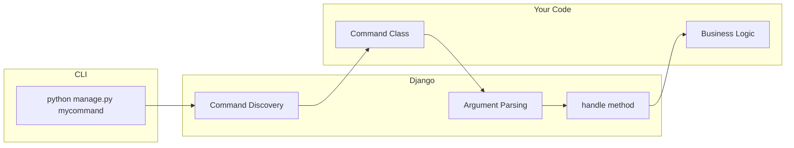
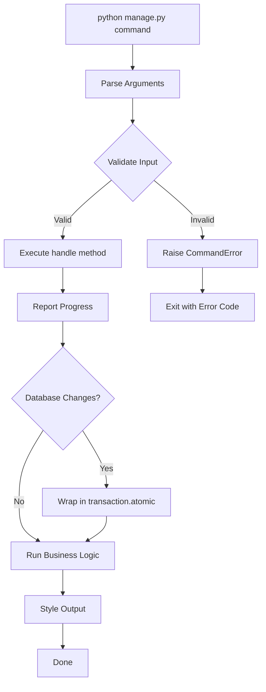

# How to Build Custom Django Management Commands

Author: [nawazdhandala](https://www.github.com/nawazdhandala)

Tags: Django, Python, Backend, DevOps, CLI, Automation

Description: Learn how to create custom Django management commands to automate tasks, handle arguments and options, style output, report progress, and write testable CLI tools for your projects.

---

Django's management commands are one of those features that you might overlook until you need to automate a task. Whether it's importing data, cleaning up old records, or running scheduled maintenance, custom commands let you hook into Django's ecosystem while keeping your scripts organized and testable.

## How Management Commands Work

Django discovers management commands by scanning the `management/commands` directory inside each installed app. When you run `python manage.py somecommand`, Django finds and executes the corresponding `Command` class.



## Project Structure

Before you write your first command, you need to set up the right directory structure. Django expects a specific layout to discover your commands.

```
myproject/
├── manage.py
└── myapp/
    ├── __init__.py
    ├── models.py
    ├── management/
    │   ├── __init__.py
    │   └── commands/
    │       ├── __init__.py
    │       └── mycommand.py
    └── ...
```

Both `management` and `commands` directories need `__init__.py` files. The command filename becomes the command name - so `mycommand.py` gives you `python manage.py mycommand`.

## The BaseCommand Class

Every management command inherits from `BaseCommand`. Here's the simplest possible command:

```python
# myapp/management/commands/hello.py
from django.core.management.base import BaseCommand


class Command(BaseCommand):
    """A simple command that prints a greeting."""

    help = "Prints a hello message"

    def handle(self, *args, **options):
        # The handle method contains your main logic
        self.stdout.write("Hello from Django!")
```

Run it with:

```bash
python manage.py hello
```

The `help` attribute shows up when users run `python manage.py help hello`. Always include it - future you will thank present you.

## Adding Arguments and Options

Real commands need input. Django uses `argparse` under the hood, so if you've used Python's argument parsing before, this will feel familiar.

### Positional Arguments

Positional arguments are required and must be provided in order.

```python
# myapp/management/commands/greet.py
from django.core.management.base import BaseCommand


class Command(BaseCommand):
    help = "Greets a user by name"

    def add_arguments(self, parser):
        # Positional argument - required
        parser.add_argument(
            "name",
            type=str,
            help="The name of the person to greet"
        )

        # You can add multiple positional arguments
        parser.add_argument(
            "times",
            type=int,
            help="Number of times to repeat the greeting"
        )

    def handle(self, *args, **options):
        name = options["name"]
        times = options["times"]

        for _ in range(times):
            self.stdout.write(f"Hello, {name}!")
```

Usage:

```bash
python manage.py greet Alice 3
```

### Optional Arguments

Optional arguments use flags and can have defaults.

```python
# myapp/management/commands/export_users.py
from django.core.management.base import BaseCommand
from django.contrib.auth import get_user_model


class Command(BaseCommand):
    help = "Export users to a file"

    def add_arguments(self, parser):
        # Optional argument with default
        parser.add_argument(
            "--format",
            type=str,
            default="csv",
            choices=["csv", "json", "xml"],
            help="Output format (default: csv)"
        )

        # Optional argument with short flag
        parser.add_argument(
            "-o", "--output",
            type=str,
            default="users.csv",
            help="Output filename"
        )

        # Boolean flag - store_true means default is False
        parser.add_argument(
            "--active-only",
            action="store_true",
            help="Export only active users"
        )

        # Optional argument that accepts multiple values
        parser.add_argument(
            "--fields",
            nargs="+",
            default=["username", "email"],
            help="Fields to export"
        )

    def handle(self, *args, **options):
        User = get_user_model()

        queryset = User.objects.all()
        if options["active_only"]:
            queryset = queryset.filter(is_active=True)

        format_type = options["format"]
        output_file = options["output"]
        fields = options["fields"]

        self.stdout.write(
            f"Exporting {queryset.count()} users to {output_file} "
            f"in {format_type} format"
        )
        self.stdout.write(f"Fields: {', '.join(fields)}")
```

Usage examples:

```bash
# Use all defaults
python manage.py export_users

# Specify format and output
python manage.py export_users --format json -o active_users.json --active-only

# Export specific fields
python manage.py export_users --fields username email date_joined
```

## Output Styling

Django provides styling methods that work with terminals. Use them to make your command output readable and informative.

```python
# myapp/management/commands/check_health.py
from django.core.management.base import BaseCommand
from django.db import connection


class Command(BaseCommand):
    help = "Check application health"

    def handle(self, *args, **options):
        # SUCCESS style - green text
        self.stdout.write(
            self.style.SUCCESS("Database connection: OK")
        )

        # WARNING style - yellow text
        self.stdout.write(
            self.style.WARNING("Cache hit rate below threshold")
        )

        # ERROR style - red text
        self.stdout.write(
            self.style.ERROR("Redis connection: FAILED")
        )

        # NOTICE style - cyan text
        self.stdout.write(
            self.style.NOTICE("Running in DEBUG mode")
        )

        # HTTP styles for status codes
        self.stdout.write(
            self.style.HTTP_SUCCESS("200 OK")
        )
        self.stdout.write(
            self.style.HTTP_REDIRECT("301 Moved")
        )
        self.stdout.write(
            self.style.HTTP_NOT_FOUND("404 Not Found")
        )
        self.stdout.write(
            self.style.HTTP_SERVER_ERROR("500 Internal Server Error")
        )

        # SQL style for queries
        self.stdout.write(
            self.style.SQL_KEYWORD("SELECT") + " * FROM users"
        )
```

### Verbosity Levels

Django commands support a built-in `--verbosity` flag. Use it to control how much output your command produces.

```python
# myapp/management/commands/sync_data.py
from django.core.management.base import BaseCommand


class Command(BaseCommand):
    help = "Sync data from external API"

    def handle(self, *args, **options):
        verbosity = options["verbosity"]

        # verbosity 0: silent except for errors
        # verbosity 1: normal output (default)
        # verbosity 2: verbose output
        # verbosity 3: very verbose / debug

        records = self.fetch_records()

        for record in records:
            self.process_record(record)

            # Only show in verbose mode
            if verbosity >= 2:
                self.stdout.write(f"Processed: {record['id']}")

        # Always show summary
        if verbosity >= 1:
            self.stdout.write(
                self.style.SUCCESS(f"Synced {len(records)} records")
            )

    def fetch_records(self):
        # Simulated data fetch
        return [{"id": i} for i in range(100)]

    def process_record(self, record):
        pass
```

Usage:

```bash
# Silent mode
python manage.py sync_data --verbosity 0

# Normal (default)
python manage.py sync_data

# Verbose
python manage.py sync_data -v 2
```

## Error Handling

Proper error handling makes your commands reliable and user-friendly.

```python
# myapp/management/commands/import_products.py
import json
from pathlib import Path

from django.core.management.base import BaseCommand, CommandError


class Command(BaseCommand):
    help = "Import products from a JSON file"

    def add_arguments(self, parser):
        parser.add_argument("file", type=str, help="Path to JSON file")
        parser.add_argument(
            "--dry-run",
            action="store_true",
            help="Validate without importing"
        )

    def handle(self, *args, **options):
        file_path = Path(options["file"])
        dry_run = options["dry_run"]

        # CommandError stops execution with a clean error message
        if not file_path.exists():
            raise CommandError(f"File not found: {file_path}")

        if not file_path.suffix == ".json":
            raise CommandError("Only JSON files are supported")

        try:
            with open(file_path) as f:
                data = json.load(f)
        except json.JSONDecodeError as e:
            raise CommandError(f"Invalid JSON: {e}")

        if not isinstance(data, list):
            raise CommandError("Expected a JSON array of products")

        # Validate each product
        errors = []
        for i, product in enumerate(data):
            if "name" not in product:
                errors.append(f"Product {i}: missing 'name' field")
            if "price" not in product:
                errors.append(f"Product {i}: missing 'price' field")

        if errors:
            # Write errors to stderr
            for error in errors:
                self.stderr.write(self.style.ERROR(error))
            raise CommandError(f"Validation failed with {len(errors)} errors")

        if dry_run:
            self.stdout.write(
                self.style.SUCCESS(
                    f"Validation passed: {len(data)} products ready to import"
                )
            )
            return

        # Actual import logic would go here
        self.stdout.write(
            self.style.SUCCESS(f"Imported {len(data)} products")
        )
```

## Progress Reporting

For long-running commands, progress feedback keeps users informed. Django doesn't have built-in progress bars, but you can easily add them.

### Simple Counter Progress

```python
# myapp/management/commands/process_orders.py
import time
from django.core.management.base import BaseCommand


class Command(BaseCommand):
    help = "Process pending orders"

    def handle(self, *args, **options):
        orders = list(range(50))  # Simulated orders
        total = len(orders)

        for i, order in enumerate(orders, 1):
            self.process_order(order)

            # Update progress on the same line
            self.stdout.write(
                f"\rProcessing: {i}/{total} ({100*i//total}%)",
                ending=""
            )
            self.stdout.flush()

        # New line after progress, then success message
        self.stdout.write("")
        self.stdout.write(
            self.style.SUCCESS(f"Processed {total} orders")
        )

    def process_order(self, order):
        time.sleep(0.05)  # Simulated work
```

### Using tqdm for Better Progress Bars

For more sophisticated progress reporting, use the `tqdm` library.

```python
# myapp/management/commands/migrate_data.py
from django.core.management.base import BaseCommand

try:
    from tqdm import tqdm
    HAS_TQDM = True
except ImportError:
    HAS_TQDM = False


class Command(BaseCommand):
    help = "Migrate data to new schema"

    def add_arguments(self, parser):
        parser.add_argument(
            "--batch-size",
            type=int,
            default=100,
            help="Records per batch"
        )

    def handle(self, *args, **options):
        records = self.get_records()
        batch_size = options["batch_size"]

        if HAS_TQDM:
            # Rich progress bar with tqdm
            iterator = tqdm(
                records,
                desc="Migrating",
                unit="record",
                ncols=80
            )
        else:
            # Fallback to simple iteration
            iterator = records
            self.stdout.write(f"Processing {len(records)} records...")

        migrated = 0
        failed = 0

        for record in iterator:
            try:
                self.migrate_record(record)
                migrated += 1
            except Exception as e:
                failed += 1
                if options["verbosity"] >= 2:
                    self.stderr.write(f"Failed: {record} - {e}")

        self.stdout.write(
            self.style.SUCCESS(f"Migrated: {migrated}, Failed: {failed}")
        )

    def get_records(self):
        return list(range(1000))

    def migrate_record(self, record):
        pass  # Migration logic here
```

## Database Transactions

Wrap database operations in transactions for data integrity.

```python
# myapp/management/commands/bulk_update.py
from django.core.management.base import BaseCommand, CommandError
from django.db import transaction
from myapp.models import Product


class Command(BaseCommand):
    help = "Bulk update product prices"

    def add_arguments(self, parser):
        parser.add_argument(
            "--percentage",
            type=float,
            required=True,
            help="Percentage to adjust prices (e.g., 10 for +10%)"
        )
        parser.add_argument(
            "--category",
            type=str,
            help="Only update products in this category"
        )

    def handle(self, *args, **options):
        percentage = options["percentage"]
        category = options["category"]

        queryset = Product.objects.all()
        if category:
            queryset = queryset.filter(category=category)

        count = queryset.count()
        if count == 0:
            raise CommandError("No products match the criteria")

        multiplier = 1 + (percentage / 100)

        self.stdout.write(
            f"Updating {count} products by {percentage:+.1f}%"
        )

        # Use atomic transaction - all or nothing
        try:
            with transaction.atomic():
                for product in queryset:
                    old_price = product.price
                    product.price = round(old_price * multiplier, 2)
                    product.save()

                    if options["verbosity"] >= 2:
                        self.stdout.write(
                            f"  {product.name}: {old_price} -> {product.price}"
                        )

                self.stdout.write(
                    self.style.SUCCESS(f"Updated {count} products")
                )
        except Exception as e:
            # Transaction is automatically rolled back
            raise CommandError(f"Update failed, rolled back: {e}")
```

## Calling Other Commands

Sometimes you need to chain commands or call built-in Django commands.

```python
# myapp/management/commands/full_reset.py
from django.core.management.base import BaseCommand
from django.core.management import call_command


class Command(BaseCommand):
    help = "Reset database and reload fixtures"

    def add_arguments(self, parser):
        parser.add_argument(
            "--no-input",
            action="store_true",
            help="Skip confirmation prompts"
        )

    def handle(self, *args, **options):
        if not options["no_input"]:
            confirm = input(
                "This will delete all data. Continue? [y/N] "
            )
            if confirm.lower() != "y":
                self.stdout.write("Aborted.")
                return

        self.stdout.write("Flushing database...")
        call_command("flush", "--no-input")

        self.stdout.write("Running migrations...")
        call_command("migrate", verbosity=options["verbosity"])

        self.stdout.write("Loading fixtures...")
        call_command("loaddata", "initial_data.json")

        self.stdout.write(
            self.style.SUCCESS("Reset complete")
        )
```

## Testing Management Commands

Management commands should be tested like any other code. Django provides utilities to make this straightforward.

```python
# myapp/tests/test_commands.py
from io import StringIO
from django.core.management import call_command
from django.core.management.base import CommandError
from django.test import TestCase
from myapp.models import Product


class ExportUsersCommandTest(TestCase):
    def test_default_format(self):
        """Test command with default options."""
        out = StringIO()
        call_command("export_users", stdout=out)

        output = out.getvalue()
        self.assertIn("csv", output)

    def test_json_format(self):
        """Test command with JSON format option."""
        out = StringIO()
        call_command("export_users", "--format", "json", stdout=out)

        output = out.getvalue()
        self.assertIn("json", output)

    def test_active_only_flag(self):
        """Test the active-only filter."""
        out = StringIO()
        call_command("export_users", "--active-only", stdout=out)

        output = out.getvalue()
        self.assertIn("Exporting", output)


class ImportProductsCommandTest(TestCase):
    def test_missing_file_raises_error(self):
        """Test that missing file raises CommandError."""
        with self.assertRaises(CommandError) as context:
            call_command("import_products", "/nonexistent/file.json")

        self.assertIn("not found", str(context.exception))

    def test_invalid_json_raises_error(self):
        """Test that invalid JSON raises CommandError."""
        # Create a temporary file with invalid JSON
        import tempfile
        with tempfile.NamedTemporaryFile(
            mode="w", suffix=".json", delete=False
        ) as f:
            f.write("not valid json")
            temp_path = f.name

        with self.assertRaises(CommandError) as context:
            call_command("import_products", temp_path)

        self.assertIn("Invalid JSON", str(context.exception))

    def test_dry_run_does_not_import(self):
        """Test that dry-run validates without importing."""
        import tempfile
        import json

        with tempfile.NamedTemporaryFile(
            mode="w", suffix=".json", delete=False
        ) as f:
            json.dump([{"name": "Test", "price": 9.99}], f)
            temp_path = f.name

        out = StringIO()
        call_command(
            "import_products", temp_path, "--dry-run", stdout=out
        )

        output = out.getvalue()
        self.assertIn("Validation passed", output)

        # Verify no products were created
        self.assertEqual(Product.objects.count(), 0)


class BulkUpdateCommandTest(TestCase):
    def setUp(self):
        Product.objects.create(name="Widget", price=10.00, category="tools")
        Product.objects.create(name="Gadget", price=20.00, category="tools")
        Product.objects.create(name="Gizmo", price=30.00, category="toys")

    def test_percentage_increase(self):
        """Test price increase by percentage."""
        call_command("bulk_update", "--percentage", "10")

        widget = Product.objects.get(name="Widget")
        self.assertEqual(widget.price, 11.00)

    def test_category_filter(self):
        """Test filtering by category."""
        call_command(
            "bulk_update", "--percentage", "50", "--category", "tools"
        )

        widget = Product.objects.get(name="Widget")
        gizmo = Product.objects.get(name="Gizmo")

        self.assertEqual(widget.price, 15.00)  # Updated
        self.assertEqual(gizmo.price, 30.00)   # Not updated
```

Run tests with:

```bash
python manage.py test myapp.tests.test_commands
```

## Practical Example: Data Cleanup Command

Here's a complete example that combines everything - arguments, options, progress, error handling, and transactions.

```python
# myapp/management/commands/cleanup_old_data.py
from datetime import timedelta
from django.core.management.base import BaseCommand, CommandError
from django.db import transaction
from django.utils import timezone
from myapp.models import AuditLog, Session, TempFile


class Command(BaseCommand):
    help = "Clean up old data from the database"

    def add_arguments(self, parser):
        parser.add_argument(
            "--days",
            type=int,
            default=90,
            help="Delete records older than this many days (default: 90)"
        )
        parser.add_argument(
            "--dry-run",
            action="store_true",
            help="Show what would be deleted without deleting"
        )
        parser.add_argument(
            "--model",
            type=str,
            choices=["audit_logs", "sessions", "temp_files", "all"],
            default="all",
            help="Which model to clean up"
        )
        parser.add_argument(
            "--batch-size",
            type=int,
            default=1000,
            help="Delete records in batches of this size"
        )

    def handle(self, *args, **options):
        days = options["days"]
        dry_run = options["dry_run"]
        model_choice = options["model"]
        batch_size = options["batch_size"]
        verbosity = options["verbosity"]

        cutoff_date = timezone.now() - timedelta(days=days)

        if dry_run:
            self.stdout.write(
                self.style.WARNING("DRY RUN - no data will be deleted")
            )

        self.stdout.write(
            f"Cleaning up records older than {cutoff_date.date()}"
        )

        # Map model names to cleanup functions
        cleanup_tasks = {
            "audit_logs": (AuditLog, "created_at"),
            "sessions": (Session, "last_activity"),
            "temp_files": (TempFile, "uploaded_at"),
        }

        if model_choice == "all":
            tasks = cleanup_tasks.items()
        else:
            tasks = [(model_choice, cleanup_tasks[model_choice])]

        total_deleted = 0

        for name, (model, date_field) in tasks:
            deleted = self.cleanup_model(
                model=model,
                date_field=date_field,
                cutoff_date=cutoff_date,
                batch_size=batch_size,
                dry_run=dry_run,
                verbosity=verbosity,
            )
            total_deleted += deleted

            status = "would delete" if dry_run else "deleted"
            self.stdout.write(f"  {name}: {status} {deleted} records")

        if dry_run:
            self.stdout.write(
                self.style.WARNING(
                    f"Would delete {total_deleted} total records"
                )
            )
        else:
            self.stdout.write(
                self.style.SUCCESS(
                    f"Deleted {total_deleted} total records"
                )
            )

    def cleanup_model(
        self, model, date_field, cutoff_date, batch_size, dry_run, verbosity
    ):
        """Delete old records from a model in batches."""
        filter_kwargs = {f"{date_field}__lt": cutoff_date}
        queryset = model.objects.filter(**filter_kwargs)

        total_count = queryset.count()

        if dry_run or total_count == 0:
            return total_count

        deleted_count = 0

        while True:
            # Get IDs of records to delete in this batch
            batch_ids = list(
                queryset.values_list("id", flat=True)[:batch_size]
            )

            if not batch_ids:
                break

            with transaction.atomic():
                count, _ = model.objects.filter(id__in=batch_ids).delete()
                deleted_count += count

            if verbosity >= 2:
                self.stdout.write(
                    f"    Deleted batch: {deleted_count}/{total_count}"
                )

        return deleted_count
```

Usage:

```bash
# See what would be deleted
python manage.py cleanup_old_data --dry-run

# Clean up all models older than 30 days
python manage.py cleanup_old_data --days 30

# Clean up only sessions with verbose output
python manage.py cleanup_old_data --model sessions -v 2

# Use smaller batches for large tables
python manage.py cleanup_old_data --batch-size 500
```

## Command Flow Summary



---

Custom management commands are a clean way to add CLI tools to your Django project. They integrate with Django's settings, have access to your models, and can be tested like any other code. Start simple - a command that does one thing well - then add arguments, progress reporting, and error handling as needed. Your future self (and your team) will appreciate having well-documented, tested commands instead of one-off scripts scattered across the codebase.
