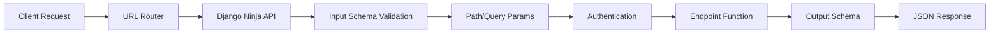
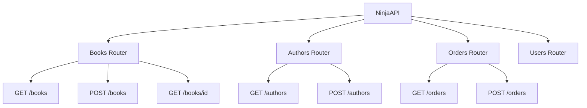

# How to Build REST APIs with Django Ninja

Author: [nawazdhandala](https://www.github.com/nawazdhandala)

Tags: Python, Django, Django Ninja, REST API, Pydantic, Web Development, Backend

Description: Learn how to build fast, type-safe REST APIs with Django Ninja using Pydantic schemas, automatic documentation, authentication, and modular routers.

---

Django Ninja brings the modern, fast API development experience to Django. If you have used FastAPI and appreciated its type hints, automatic validation, and generated docs, you will feel right at home with Django Ninja - except now you get all of Django's battle-tested ORM, admin, and ecosystem.

This guide walks through building a complete REST API from setup to production-ready patterns.

---

## Why Django Ninja?

Django REST Framework has served the community well, but it can feel verbose for simple APIs. Django Ninja offers:

- **Pydantic schemas** for request/response validation
- **Type hints** that double as documentation
- **Automatic OpenAPI docs** with Swagger and ReDoc
- **Async support** out of the box
- **Significantly less boilerplate** than DRF

Here is how a typical request flows through Django Ninja:



---

## Installation and Setup

Install Django Ninja in your Django project:

```bash
pip install django-ninja
```

Create your API instance in a new file. This becomes the central hub for all your endpoints.

```python
# api.py
from ninja import NinjaAPI

# Create the main API instance
api = NinjaAPI(
    title="My Project API",
    version="1.0.0",
    description="REST API built with Django Ninja"
)
```

Wire up the API to your Django URL configuration:

```python
# urls.py
from django.contrib import admin
from django.urls import path
from .api import api

urlpatterns = [
    path("admin/", admin.site.urls),
    path("api/", api.urls),  # All API routes live under /api/
]
```

Start your server and visit `/api/docs` - you will see interactive Swagger documentation automatically generated from your code.

---

## Pydantic Schemas

Schemas define the shape of your data. Django Ninja uses Pydantic under the hood, giving you runtime validation and automatic JSON serialization.

Define input and output schemas for clean separation of concerns:

```python
# schemas.py
from ninja import Schema
from datetime import datetime
from typing import Optional, List

class BookIn(Schema):
    """Schema for creating/updating a book - input from client"""
    title: str
    author: str
    isbn: str
    published_year: int
    price: float
    category: Optional[str] = None

class BookOut(Schema):
    """Schema for returning book data - output to client"""
    id: int
    title: str
    author: str
    isbn: str
    published_year: int
    price: float
    category: Optional[str]
    created_at: datetime

class BookListOut(Schema):
    """Schema for paginated book listings"""
    items: List[BookOut]
    total: int
    page: int
    per_page: int
```

Schemas automatically validate incoming data and serialize outgoing responses. If validation fails, Django Ninja returns a 422 error with details about what went wrong.

---

## CRUD Operations

Let us build a complete CRUD API for a Book model. First, the Django model:

```python
# models.py
from django.db import models

class Book(models.Model):
    title = models.CharField(max_length=200)
    author = models.CharField(max_length=100)
    isbn = models.CharField(max_length=13, unique=True)
    published_year = models.IntegerField()
    price = models.DecimalField(max_digits=10, decimal_places=2)
    category = models.CharField(max_length=50, null=True, blank=True)
    created_at = models.DateTimeField(auto_now_add=True)
    updated_at = models.DateTimeField(auto_now=True)

    def __str__(self):
        return self.title
```

Now the API endpoints. Each endpoint is a decorated function with type hints that define its contract.

```python
# api.py
from ninja import NinjaAPI
from django.shortcuts import get_object_or_404
from typing import List
from .models import Book
from .schemas import BookIn, BookOut, BookListOut

api = NinjaAPI()

# CREATE - Add a new book
@api.post("/books", response={201: BookOut})
def create_book(request, payload: BookIn):
    """Create a new book in the database"""
    book = Book.objects.create(**payload.dict())
    return 201, book

# READ - Get a single book by ID
@api.get("/books/{book_id}", response=BookOut)
def get_book(request, book_id: int):
    """Retrieve a book by its ID"""
    book = get_object_or_404(Book, id=book_id)
    return book

# READ - List all books with pagination
@api.get("/books", response=BookListOut)
def list_books(request, page: int = 1, per_page: int = 10):
    """List books with pagination support"""
    offset = (page - 1) * per_page
    books = Book.objects.all()[offset:offset + per_page]
    total = Book.objects.count()

    return {
        "items": list(books),
        "total": total,
        "page": page,
        "per_page": per_page
    }

# UPDATE - Modify an existing book
@api.put("/books/{book_id}", response=BookOut)
def update_book(request, book_id: int, payload: BookIn):
    """Update all fields of an existing book"""
    book = get_object_or_404(Book, id=book_id)

    for attr, value in payload.dict().items():
        setattr(book, attr, value)

    book.save()
    return book

# PARTIAL UPDATE - Modify specific fields
@api.patch("/books/{book_id}", response=BookOut)
def patch_book(request, book_id: int, payload: BookIn):
    """Update specific fields of an existing book"""
    book = get_object_or_404(Book, id=book_id)

    # Only update fields that were provided
    for attr, value in payload.dict(exclude_unset=True).items():
        setattr(book, attr, value)

    book.save()
    return book

# DELETE - Remove a book
@api.delete("/books/{book_id}", response={204: None})
def delete_book(request, book_id: int):
    """Delete a book from the database"""
    book = get_object_or_404(Book, id=book_id)
    book.delete()
    return 204, None
```

---

## Path and Query Parameters

Django Ninja extracts parameters from the URL path and query string using function arguments with type hints.

### Path Parameters

Path parameters are part of the URL itself. Define them in the route pattern and as function arguments:

```python
# Path parameters are extracted from the URL pattern
@api.get("/authors/{author_id}/books/{book_id}")
def get_author_book(request, author_id: int, book_id: int):
    """Get a specific book by a specific author"""
    book = get_object_or_404(
        Book,
        id=book_id,
        author_id=author_id
    )
    return book

# String path parameters work too
@api.get("/categories/{category_slug}/books")
def books_by_category(request, category_slug: str):
    """Get all books in a category by slug"""
    books = Book.objects.filter(category__slug=category_slug)
    return list(books)
```

### Query Parameters

Query parameters come after the `?` in URLs. Define them as function arguments with default values:

```python
from typing import Optional
from datetime import date

@api.get("/books/search", response=List[BookOut])
def search_books(
    request,
    q: Optional[str] = None,           # /books/search?q=python
    author: Optional[str] = None,       # /books/search?author=smith
    min_price: Optional[float] = None,  # /books/search?min_price=10.00
    max_price: Optional[float] = None,  # /books/search?max_price=50.00
    published_after: Optional[int] = None,
    sort_by: str = "title",             # Default sort field
    order: str = "asc"                  # Default sort order
):
    """Search books with multiple filter options"""
    queryset = Book.objects.all()

    # Apply filters only if provided
    if q:
        queryset = queryset.filter(title__icontains=q)
    if author:
        queryset = queryset.filter(author__icontains=author)
    if min_price is not None:
        queryset = queryset.filter(price__gte=min_price)
    if max_price is not None:
        queryset = queryset.filter(price__lte=max_price)
    if published_after:
        queryset = queryset.filter(published_year__gte=published_after)

    # Apply sorting
    order_prefix = "-" if order == "desc" else ""
    queryset = queryset.order_by(f"{order_prefix}{sort_by}")

    return list(queryset)
```

### Using Schema for Complex Query Parameters

For endpoints with many query parameters, use a Schema class to group them:

```python
from ninja import Schema, Query

class BookFilters(Schema):
    """Group related query parameters into a schema"""
    q: Optional[str] = None
    author: Optional[str] = None
    category: Optional[str] = None
    min_price: Optional[float] = None
    max_price: Optional[float] = None
    year_from: Optional[int] = None
    year_to: Optional[int] = None

@api.get("/books/filter", response=List[BookOut])
def filter_books(request, filters: BookFilters = Query(...)):
    """Filter books using grouped query parameters"""
    queryset = Book.objects.all()

    if filters.q:
        queryset = queryset.filter(title__icontains=filters.q)
    if filters.author:
        queryset = queryset.filter(author__icontains=filters.author)
    if filters.category:
        queryset = queryset.filter(category=filters.category)
    if filters.min_price:
        queryset = queryset.filter(price__gte=filters.min_price)
    if filters.max_price:
        queryset = queryset.filter(price__lte=filters.max_price)
    if filters.year_from:
        queryset = queryset.filter(published_year__gte=filters.year_from)
    if filters.year_to:
        queryset = queryset.filter(published_year__lte=filters.year_to)

    return list(queryset)
```

---

## Authentication

Django Ninja provides flexible authentication through the `auth` parameter. You can use built-in authenticators or create custom ones.

### API Key Authentication

Simple API key authentication using a header:

```python
from ninja.security import APIKeyHeader

class ApiKey(APIKeyHeader):
    """Authenticate requests using X-API-Key header"""
    param_name = "X-API-Key"

    def authenticate(self, request, key):
        # Check the key against your database or settings
        try:
            return ApiKeyModel.objects.get(key=key, is_active=True)
        except ApiKeyModel.DoesNotExist:
            return None

# Apply to specific endpoints
api_key_auth = ApiKey()

@api.get("/protected/data", auth=api_key_auth)
def protected_endpoint(request):
    """This endpoint requires a valid API key"""
    return {"message": "You have access!", "key_owner": request.auth.owner}
```

### JWT Token Authentication

For JWT-based authentication:

```python
from ninja.security import HttpBearer
import jwt
from django.conf import settings

class JWTAuth(HttpBearer):
    """Authenticate requests using JWT Bearer tokens"""

    def authenticate(self, request, token):
        try:
            # Decode and verify the JWT token
            payload = jwt.decode(
                token,
                settings.SECRET_KEY,
                algorithms=["HS256"]
            )
            # Return user data - this becomes request.auth
            return payload
        except jwt.ExpiredSignatureError:
            return None
        except jwt.InvalidTokenError:
            return None

jwt_auth = JWTAuth()

@api.get("/users/me", auth=jwt_auth, response=UserOut)
def get_current_user(request):
    """Get the authenticated user's profile"""
    user_id = request.auth["user_id"]
    return get_object_or_404(User, id=user_id)
```

### Django Session Authentication

Use Django's built-in session authentication:

```python
from ninja.security import django_auth

# Protect endpoints with Django session auth
@api.get("/dashboard", auth=django_auth)
def dashboard(request):
    """Requires user to be logged in via Django session"""
    return {"user": request.user.username}
```

### Global Authentication

Apply authentication to all endpoints by default:

```python
# All endpoints require JWT auth unless overridden
api = NinjaAPI(auth=jwt_auth)

# Override for specific endpoints that should be public
@api.get("/public/status", auth=None)
def health_check(request):
    """Public endpoint - no auth required"""
    return {"status": "healthy"}
```

---

## Error Handling

Django Ninja lets you define custom exception handlers for clean error responses.

### Custom Exception Classes

Define domain-specific exceptions:

```python
# exceptions.py
class ApiException(Exception):
    """Base exception for API errors"""
    def __init__(self, message: str, status_code: int = 400):
        self.message = message
        self.status_code = status_code

class NotFoundError(ApiException):
    def __init__(self, resource: str, identifier):
        super().__init__(
            message=f"{resource} with id {identifier} not found",
            status_code=404
        )

class ValidationError(ApiException):
    def __init__(self, field: str, message: str):
        super().__init__(
            message=f"Validation error on {field}: {message}",
            status_code=422
        )

class AuthenticationError(ApiException):
    def __init__(self, message: str = "Authentication required"):
        super().__init__(message=message, status_code=401)

class PermissionError(ApiException):
    def __init__(self, message: str = "Permission denied"):
        super().__init__(message=message, status_code=403)
```

### Registering Exception Handlers

Register handlers with the API to convert exceptions to JSON responses:

```python
from ninja import NinjaAPI
from .exceptions import ApiException, NotFoundError

api = NinjaAPI()

@api.exception_handler(ApiException)
def handle_api_exception(request, exc: ApiException):
    """Handle all custom API exceptions"""
    return api.create_response(
        request,
        {"error": exc.message, "status": exc.status_code},
        status=exc.status_code
    )

@api.exception_handler(ValueError)
def handle_value_error(request, exc: ValueError):
    """Handle Python ValueError as 400 Bad Request"""
    return api.create_response(
        request,
        {"error": str(exc), "status": 400},
        status=400
    )

# Usage in endpoints
@api.get("/books/{book_id}", response=BookOut)
def get_book(request, book_id: int):
    try:
        return Book.objects.get(id=book_id)
    except Book.DoesNotExist:
        raise NotFoundError("Book", book_id)
```

### Structured Error Responses

Create a consistent error response schema:

```python
from ninja import Schema
from typing import Optional, List

class ErrorDetail(Schema):
    field: Optional[str] = None
    message: str
    code: str

class ErrorResponse(Schema):
    error: str
    status: int
    details: Optional[List[ErrorDetail]] = None
    trace_id: Optional[str] = None

@api.exception_handler(ApiException)
def handle_api_exception(request, exc: ApiException):
    """Return structured error responses"""
    import uuid

    response_data = {
        "error": exc.message,
        "status": exc.status_code,
        "trace_id": str(uuid.uuid4())
    }

    # Add field-level details if available
    if hasattr(exc, "details"):
        response_data["details"] = exc.details

    return api.create_response(
        request,
        response_data,
        status=exc.status_code
    )
```

---

## Routers for Modular APIs

As your API grows, organize endpoints into separate routers. Each router handles a specific domain or resource.



### Creating Routers

Split your API into domain-specific files:

```python
# routers/books.py
from ninja import Router
from typing import List
from ..models import Book
from ..schemas import BookIn, BookOut

# Create a router for book endpoints
router = Router(tags=["Books"])

@router.get("/", response=List[BookOut])
def list_books(request):
    """List all books"""
    return Book.objects.all()

@router.post("/", response={201: BookOut})
def create_book(request, payload: BookIn):
    """Create a new book"""
    book = Book.objects.create(**payload.dict())
    return 201, book

@router.get("/{book_id}", response=BookOut)
def get_book(request, book_id: int):
    """Get a single book"""
    return get_object_or_404(Book, id=book_id)
```

```python
# routers/authors.py
from ninja import Router
from typing import List
from ..models import Author
from ..schemas import AuthorIn, AuthorOut

router = Router(tags=["Authors"])

@router.get("/", response=List[AuthorOut])
def list_authors(request):
    """List all authors"""
    return Author.objects.all()

@router.post("/", response={201: AuthorOut})
def create_author(request, payload: AuthorIn):
    """Create a new author"""
    author = Author.objects.create(**payload.dict())
    return 201, author
```

### Registering Routers

Combine all routers in your main API file:

```python
# api.py
from ninja import NinjaAPI
from .routers.books import router as books_router
from .routers.authors import router as authors_router
from .routers.orders import router as orders_router
from .routers.users import router as users_router

api = NinjaAPI(
    title="Bookstore API",
    version="2.0.0"
)

# Register routers with URL prefixes
api.add_router("/books", books_router)
api.add_router("/authors", authors_router)
api.add_router("/orders", orders_router)
api.add_router("/users", users_router)
```

This creates endpoints like:
- `GET /api/books/`
- `POST /api/books/`
- `GET /api/authors/`
- `POST /api/orders/`

### Router-Level Authentication

Apply authentication to entire routers:

```python
from ninja import Router
from ninja.security import HttpBearer

jwt_auth = JWTAuth()

# All endpoints in this router require authentication
router = Router(tags=["Orders"], auth=jwt_auth)

@router.get("/")
def list_orders(request):
    """List orders for the authenticated user"""
    return Order.objects.filter(user_id=request.auth["user_id"])
```

---

## Automatic API Documentation

Django Ninja generates OpenAPI documentation automatically. Access it at:

- **Swagger UI**: `/api/docs`
- **ReDoc**: `/api/redoc`
- **OpenAPI JSON**: `/api/openapi.json`

### Customizing Documentation

Add descriptions and examples to make your docs more useful:

```python
from ninja import Schema, Field

class BookIn(Schema):
    """Schema for creating a new book"""

    title: str = Field(
        ...,
        description="The book title",
        example="The Pragmatic Programmer"
    )
    author: str = Field(
        ...,
        description="Author's full name",
        example="David Thomas"
    )
    isbn: str = Field(
        ...,
        description="13-digit ISBN",
        example="9780135957059",
        min_length=13,
        max_length=13
    )
    price: float = Field(
        ...,
        description="Price in USD",
        example=49.99,
        gt=0
    )

@api.post(
    "/books",
    response={201: BookOut},
    summary="Create a new book",
    description="Add a new book to the catalog. Requires valid ISBN.",
    tags=["Books"]
)
def create_book(request, payload: BookIn):
    """
    Create a new book with the following information:

    - **title**: The book's title (required)
    - **author**: Author's full name (required)
    - **isbn**: Valid 13-digit ISBN (required)
    - **price**: Price in USD, must be positive (required)
    """
    book = Book.objects.create(**payload.dict())
    return 201, book
```

### API Versioning

Support multiple API versions with separate NinjaAPI instances:

```python
# api_v1.py
from ninja import NinjaAPI

api_v1 = NinjaAPI(version="1.0.0", urls_namespace="api_v1")

@api_v1.get("/books")
def list_books_v1(request):
    """V1: Returns basic book info"""
    return [{"id": b.id, "title": b.title} for b in Book.objects.all()]

# api_v2.py
from ninja import NinjaAPI

api_v2 = NinjaAPI(version="2.0.0", urls_namespace="api_v2")

@api_v2.get("/books")
def list_books_v2(request):
    """V2: Returns extended book info with author details"""
    return Book.objects.select_related("author").all()

# urls.py
urlpatterns = [
    path("api/v1/", api_v1.urls),
    path("api/v2/", api_v2.urls),
]
```

---

## Async Support

Django Ninja supports async views for better performance with I/O-bound operations:

```python
from ninja import NinjaAPI
import httpx

api = NinjaAPI()

@api.get("/external-data")
async def fetch_external_data(request, resource_id: int):
    """Fetch data from an external API asynchronously"""
    async with httpx.AsyncClient() as client:
        response = await client.get(
            f"https://api.example.com/resources/{resource_id}"
        )
        return response.json()

@api.get("/books/{book_id}")
async def get_book_async(request, book_id: int):
    """Async database query using Django 4.1+ async ORM"""
    book = await Book.objects.aget(id=book_id)
    return book
```

---

## Best Practices

### 1. Separate Schemas from Models

Keep your API contract independent from your database schema:

```python
# schemas.py - API contract
class UserOut(Schema):
    id: int
    username: str
    display_name: str
    # Note: password_hash is NOT exposed

# models.py - Database schema
class User(models.Model):
    username = models.CharField(max_length=50)
    display_name = models.CharField(max_length=100)
    password_hash = models.CharField(max_length=255)
    internal_notes = models.TextField()  # Also not exposed
```

### 2. Use Response Status Codes

Be explicit about response codes:

```python
@api.post("/books", response={201: BookOut, 400: ErrorResponse})
def create_book(request, payload: BookIn):
    if Book.objects.filter(isbn=payload.isbn).exists():
        return 400, {"error": "ISBN already exists", "status": 400}

    book = Book.objects.create(**payload.dict())
    return 201, book
```

### 3. Validate at the Schema Level

Use Pydantic validators for complex validation:

```python
from pydantic import validator

class BookIn(Schema):
    isbn: str
    price: float

    @validator("isbn")
    def validate_isbn(cls, v):
        # Remove hyphens and validate length
        clean_isbn = v.replace("-", "")
        if len(clean_isbn) != 13:
            raise ValueError("ISBN must be 13 digits")
        if not clean_isbn.isdigit():
            raise ValueError("ISBN must contain only digits")
        return clean_isbn

    @validator("price")
    def validate_price(cls, v):
        if v <= 0:
            raise ValueError("Price must be positive")
        if v > 10000:
            raise ValueError("Price seems unreasonably high")
        return round(v, 2)
```

### 4. Add Request Logging

Log requests for debugging and monitoring:

```python
@api.middleware
def log_requests(request, call_next):
    """Log all API requests"""
    import time
    import logging

    logger = logging.getLogger("api")
    start = time.time()

    response = call_next(request)

    duration = time.time() - start
    logger.info(
        f"{request.method} {request.path} - "
        f"{response.status_code} - {duration:.3f}s"
    )

    return response
```

---

## Conclusion

Django Ninja offers a refreshing approach to building REST APIs with Django. You get the simplicity and type safety of FastAPI while retaining Django's mature ORM, admin interface, and extensive ecosystem.

Key takeaways:

- **Schemas** handle validation and serialization automatically
- **Path and query parameters** are extracted from type hints
- **Authentication** is flexible and composable
- **Routers** keep large APIs organized
- **Documentation** is generated from your code

Start with the basics, add complexity as needed, and let the automatic documentation guide your API consumers.

---

*Building production APIs? [OneUptime](https://oneuptime.com) provides API monitoring, alerting, and status pages to keep your services reliable.*
