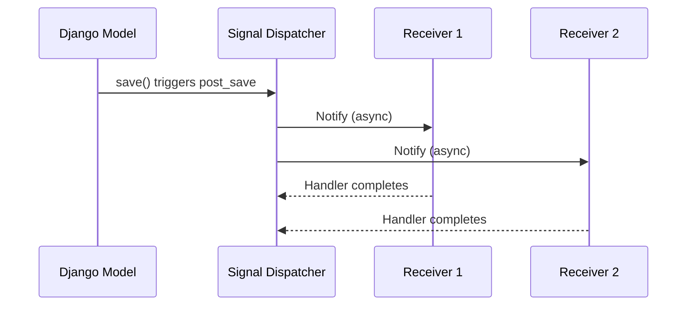
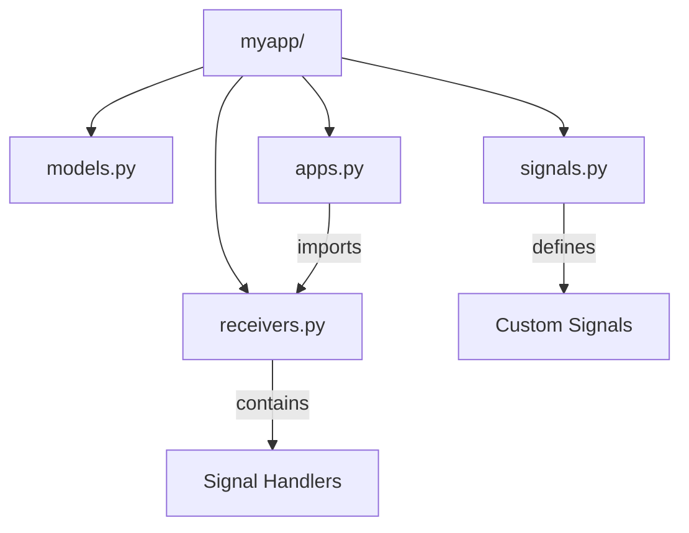

# How to Use Django Signals

Author: [nawazdhandala](https://www.github.com/nawazdhandala)

Tags: Django, Python, Backend, Web Development, Software Architecture

Description: A practical guide to Django signals for decoupling application components, with examples covering built-in signals, custom signals, and common patterns like audit logging.

---

Django signals let different parts of your application communicate without being tightly coupled. When something happens - a model gets saved, a user logs in, a request finishes - signals broadcast that event to any code listening for it. Receivers can then react without the sender knowing anything about them.

This decoupling is valuable when you need to trigger side effects across app boundaries. Think audit logging, cache invalidation, sending notifications, or syncing data to external systems. Instead of stuffing all that logic into your models or views, signals let you organize it cleanly.

## How Django Signals Work

The signal system follows a publisher-subscriber pattern. Senders broadcast signals when events occur, and receivers subscribe to handle those events.



Signals execute synchronously by default. All receivers run before control returns to the sender. Keep this in mind - slow receivers will slow down the original operation.

## Built-in Model Signals

Django provides signals for model lifecycle events. These fire automatically when you interact with models through the ORM.

### pre_save and post_save

The `pre_save` signal fires before a model instance is written to the database. Use it to modify data before persistence or validate state. The `post_save` signal fires after the save completes.

This receiver automatically generates a slug from the title before saving a blog post. The `pre_save` signal gives you a chance to modify the instance right before it hits the database.

```python
# signals.py
from django.db.models.signals import pre_save, post_save
from django.dispatch import receiver
from django.utils.text import slugify
from .models import BlogPost


@receiver(pre_save, sender=BlogPost)
def generate_slug(sender, instance, **kwargs):
    """
    Auto-generate slug from title before saving.
    Only runs if slug is empty to avoid overwriting manual slugs.
    """
    if not instance.slug:
        instance.slug = slugify(instance.title)
```

The `post_save` signal is ideal for triggering actions that should happen after the record exists. The `created` argument tells you whether this is a new record or an update.

```python
@receiver(post_save, sender=BlogPost)
def notify_subscribers(sender, instance, created, **kwargs):
    """
    Send email notifications when a new blog post is published.
    Only triggers for new posts, not updates.
    """
    if created and instance.status == 'published':
        # Queue notification task - don't block the save
        from .tasks import send_subscriber_notifications
        send_subscriber_notifications.delay(instance.id)
```

### pre_delete and post_delete

These signals fire around model deletion. Use `pre_delete` when you need to capture related data before cascade deletes destroy it. Use `post_delete` for cleanup after the record is gone.

This example archives related files before a project gets deleted. Once the project is gone, you would lose the foreign key relationship needed to find its files.

```python
from django.db.models.signals import pre_delete, post_delete
from django.dispatch import receiver
from .models import Project, FileUpload


@receiver(pre_delete, sender=Project)
def archive_project_files(sender, instance, **kwargs):
    """
    Archive all files before project deletion.
    Must run pre_delete because post_delete loses access to related files.
    """
    files = FileUpload.objects.filter(project=instance)
    for file in files:
        # Move to archive storage before deletion
        archive_file(file.path, project_id=instance.id)


@receiver(post_delete, sender=FileUpload)
def cleanup_storage(sender, instance, **kwargs):
    """
    Remove physical file from storage after database record is deleted.
    Safe to run post_delete since we only need the file path.
    """
    if instance.file:
        # Delete the actual file from disk/S3/etc
        instance.file.delete(save=False)
```

### m2m_changed

Many-to-many relationships have their own signal since they are stored in a separate table. The `action` parameter tells you what operation occurred.

```python
from django.db.models.signals import m2m_changed
from django.dispatch import receiver
from .models import Article, Tag


@receiver(m2m_changed, sender=Article.tags.through)
def handle_tag_changes(sender, instance, action, pk_set, **kwargs):
    """
    Track tag additions and removals for analytics.
    action values: pre_add, post_add, pre_remove, post_remove, pre_clear, post_clear
    """
    if action == 'post_add':
        # pk_set contains IDs of tags that were added
        tags = Tag.objects.filter(pk__in=pk_set)
        for tag in tags:
            tag.usage_count += 1
            tag.save(update_fields=['usage_count'])

    elif action == 'post_remove':
        tags = Tag.objects.filter(pk__in=pk_set)
        for tag in tags:
            tag.usage_count = max(0, tag.usage_count - 1)
            tag.save(update_fields=['usage_count'])
```

## Creating Custom Signals

Built-in signals cover common cases, but you will often need application-specific events. Custom signals work the same way but you define when they fire.

Define your signal as a module-level variable. The `providing_args` parameter is documentation only - Django does not enforce it.

```python
# signals.py
from django.dispatch import Signal

# Define custom signals for your domain events
order_completed = Signal()  # Fired when checkout succeeds
payment_failed = Signal()   # Fired when payment processing fails
user_upgraded = Signal()    # Fired when user changes subscription tier
```

Send the signal from your business logic. Pass any context receivers might need as keyword arguments.

```python
# services.py
from .signals import order_completed, payment_failed


class OrderService:
    def complete_order(self, order):
        """
        Process order completion and broadcast the event.
        """
        try:
            # Process payment
            charge = self.payment_gateway.charge(order.total, order.payment_method)

            # Update order status
            order.status = 'completed'
            order.charge_id = charge.id
            order.save()

            # Broadcast completion event
            # Receivers handle notifications, inventory, analytics, etc.
            order_completed.send(
                sender=self.__class__,
                order=order,
                charge=charge
            )

            return order

        except PaymentError as e:
            payment_failed.send(
                sender=self.__class__,
                order=order,
                error=str(e)
            )
            raise
```

Connect receivers to handle the custom signal. Each receiver handles one concern - this keeps the order service focused on its core responsibility.

```python
# receivers.py
from django.dispatch import receiver
from .signals import order_completed, payment_failed


@receiver(order_completed)
def send_order_confirmation(sender, order, **kwargs):
    """Send confirmation email to customer."""
    from .tasks import send_order_email
    send_order_email.delay(order.id, template='confirmation')


@receiver(order_completed)
def update_inventory(sender, order, **kwargs):
    """Decrease stock for ordered items."""
    for item in order.items.all():
        item.product.decrease_stock(item.quantity)


@receiver(order_completed)
def track_analytics(sender, order, charge, **kwargs):
    """Record purchase event for analytics."""
    analytics.track(
        user_id=order.user_id,
        event='purchase',
        properties={
            'order_id': order.id,
            'total': float(order.total),
            'item_count': order.items.count()
        }
    )


@receiver(payment_failed)
def alert_support(sender, order, error, **kwargs):
    """Notify support team of failed payment for follow-up."""
    support_notification.send(
        subject=f'Payment failed for order {order.id}',
        body=f'Error: {error}\nCustomer: {order.user.email}'
    )
```

## Connecting Receivers

You have seen the `@receiver` decorator, but there are other ways to connect signals. Each has trade-offs.

### The Decorator Approach

The decorator is the most common pattern. It is clean and keeps the signal connection next to the handler code.

```python
from django.dispatch import receiver
from django.db.models.signals import post_save
from .models import User


@receiver(post_save, sender=User)
def create_user_profile(sender, instance, created, **kwargs):
    if created:
        Profile.objects.create(user=instance)
```

### Manual Connection

Sometimes you need more control - connecting conditionally, or connecting the same handler to multiple signals.

```python
from django.db.models.signals import post_save, post_delete
from .models import Product


def invalidate_product_cache(sender, instance, **kwargs):
    """Clear cached product data on any change."""
    cache.delete(f'product:{instance.id}')
    cache.delete('product_list')


# Connect to multiple signals
post_save.connect(invalidate_product_cache, sender=Product)
post_delete.connect(invalidate_product_cache, sender=Product)
```

### Using dispatch_uid

If your signal connection code might run multiple times (during testing or with certain app configurations), use `dispatch_uid` to prevent duplicate handlers.

```python
from django.db.models.signals import post_save
from .models import Order


def log_order_save(sender, instance, **kwargs):
    logger.info(f'Order {instance.id} saved')


# dispatch_uid ensures this handler is only connected once
# even if this code runs multiple times
post_save.connect(
    log_order_save,
    sender=Order,
    dispatch_uid='order_save_logger'
)
```

## Organizing Signal Handlers

As your application grows, signal handlers can scatter across your codebase. Here is a clean way to organize them.



Keep signal definitions in `signals.py`:

```python
# myapp/signals.py
from django.dispatch import Signal

# Domain events for this app
item_added_to_cart = Signal()
item_removed_from_cart = Signal()
cart_cleared = Signal()
```

Put handlers in `receivers.py`:

```python
# myapp/receivers.py
from django.dispatch import receiver
from django.db.models.signals import post_save
from .signals import item_added_to_cart
from .models import CartItem


@receiver(post_save, sender=CartItem)
def update_cart_total(sender, instance, **kwargs):
    """Recalculate cart total when items change."""
    instance.cart.recalculate_total()


@receiver(item_added_to_cart)
def track_cart_addition(sender, cart, product, quantity, **kwargs):
    """Track product additions for recommendations."""
    analytics.track_cart_event('add', cart.user_id, product.id, quantity)
```

Import receivers in your app config to ensure they load:

```python
# myapp/apps.py
from django.apps import AppConfig


class MyAppConfig(AppConfig):
    name = 'myapp'

    def ready(self):
        # Import receivers to register signal handlers
        # This runs once when Django starts
        from . import receivers  # noqa: F401
```

Make sure your app config is used in settings or `__init__.py`:

```python
# myapp/__init__.py
default_app_config = 'myapp.apps.MyAppConfig'
```

## Audit Logging with Signals

A common use case for signals is audit logging - tracking who changed what and when. Here is a reusable pattern.

First, define an audit log model:

```python
# audit/models.py
from django.db import models
from django.contrib.contenttypes.fields import GenericForeignKey
from django.contrib.contenttypes.models import ContentType


class AuditLog(models.Model):
    ACTION_CHOICES = [
        ('create', 'Created'),
        ('update', 'Updated'),
        ('delete', 'Deleted'),
    ]

    # What changed
    content_type = models.ForeignKey(ContentType, on_delete=models.CASCADE)
    object_id = models.PositiveIntegerField()
    content_object = GenericForeignKey('content_type', 'object_id')

    # Change details
    action = models.CharField(max_length=10, choices=ACTION_CHOICES)
    changes = models.JSONField(default=dict)  # Field-level diff

    # Who and when
    user = models.ForeignKey('auth.User', null=True, on_delete=models.SET_NULL)
    timestamp = models.DateTimeField(auto_now_add=True)

    class Meta:
        ordering = ['-timestamp']
        indexes = [
            models.Index(fields=['content_type', 'object_id']),
            models.Index(fields=['timestamp']),
        ]
```

Create a mixin for models you want to audit:

```python
# audit/mixins.py
from django.db.models.signals import post_save, post_delete
from django.contrib.contenttypes.models import ContentType
from .models import AuditLog


class AuditableMixin:
    """
    Mixin that enables audit logging for a model.
    Tracks creates, updates, and deletes with field-level diffs.
    """

    # Override to exclude sensitive fields from audit logs
    audit_exclude_fields = ['password', 'last_login']

    @classmethod
    def _get_field_values(cls, instance):
        """Extract auditable field values from instance."""
        values = {}
        for field in instance._meta.fields:
            if field.name not in cls.audit_exclude_fields:
                values[field.name] = getattr(instance, field.name)
        return values


def audit_post_save(sender, instance, created, **kwargs):
    """Log creates and updates for auditable models."""
    if not hasattr(sender, 'audit_exclude_fields'):
        return

    action = 'create' if created else 'update'

    # Calculate changes for updates
    changes = {}
    if not created and hasattr(instance, '_original_values'):
        current = sender._get_field_values(instance)
        for field, value in current.items():
            original = instance._original_values.get(field)
            if original != value:
                changes[field] = {'old': original, 'new': value}

    AuditLog.objects.create(
        content_type=ContentType.objects.get_for_model(sender),
        object_id=instance.pk,
        action=action,
        changes=changes,
        user=getattr(instance, '_current_user', None)
    )


def audit_post_delete(sender, instance, **kwargs):
    """Log deletes for auditable models."""
    if not hasattr(sender, 'audit_exclude_fields'):
        return

    AuditLog.objects.create(
        content_type=ContentType.objects.get_for_model(sender),
        object_id=instance.pk,
        action='delete',
        changes=sender._get_field_values(instance),
        user=getattr(instance, '_current_user', None)
    )
```

Register signals for each auditable model in your app config:

```python
# myapp/apps.py
from django.apps import AppConfig
from django.db.models.signals import post_save, post_delete, post_init


class MyAppConfig(AppConfig):
    name = 'myapp'

    def ready(self):
        from .models import Order, Product  # Your models
        from audit.mixins import audit_post_save, audit_post_delete

        # Register audit signals for each model
        auditable_models = [Order, Product]

        for model in auditable_models:
            post_save.connect(
                audit_post_save,
                sender=model,
                dispatch_uid=f'audit_save_{model.__name__}'
            )
            post_delete.connect(
                audit_post_delete,
                sender=model,
                dispatch_uid=f'audit_delete_{model.__name__}'
            )
```

To capture the current user, use middleware:

```python
# audit/middleware.py
import threading

_thread_locals = threading.local()


def get_current_user():
    return getattr(_thread_locals, 'user', None)


class AuditMiddleware:
    """
    Middleware that makes the current user available to signal handlers.
    """
    def __init__(self, get_response):
        self.get_response = get_response

    def __call__(self, request):
        _thread_locals.user = getattr(request, 'user', None)
        response = self.get_response(request)
        return response
```

## Common Pitfalls and How to Avoid Them

### Circular Imports

Signal handlers often need to import models, which can cause circular imports. Import inside the handler function:

```python
@receiver(post_save, sender='myapp.Order')
def handle_order_save(sender, instance, **kwargs):
    # Import here to avoid circular import at module load
    from notifications.models import Notification
    Notification.objects.create(user=instance.user, message='Order received')
```

You can also use a string reference for the sender as shown above.

### Infinite Loops

Saving a model inside its own `post_save` handler creates an infinite loop. Use `update_fields` or a guard flag:

```python
@receiver(post_save, sender=Order)
def calculate_order_total(sender, instance, **kwargs):
    # BAD: This triggers another post_save, infinite loop
    # instance.total = sum(item.price for item in instance.items.all())
    # instance.save()

    # GOOD: Use update() to bypass signals
    total = sum(item.price for item in instance.items.all())
    Order.objects.filter(pk=instance.pk).update(total=total)

    # OR use save with update_fields (still fires signal but you can check)
    # instance.total = total
    # instance.save(update_fields=['total'])
```

### Signals in Bulk Operations

QuerySet methods like `update()`, `delete()`, and `bulk_create()` bypass signals by default. If you need signals, iterate:

```python
# This does NOT fire post_save signals
Order.objects.filter(status='pending').update(status='cancelled')

# This DOES fire signals (but is slower)
for order in Order.objects.filter(status='pending'):
    order.status = 'cancelled'
    order.save()
```

### Testing Signal Handlers

Signals can make tests unpredictable. Use `Signal.disconnect()` to isolate tests:

```python
from django.test import TestCase
from django.db.models.signals import post_save
from myapp.models import Order
from myapp.receivers import send_order_email


class OrderTestCase(TestCase):
    def setUp(self):
        # Disconnect email signal for this test
        post_save.disconnect(send_order_email, sender=Order)

    def tearDown(self):
        # Reconnect after test
        post_save.connect(send_order_email, sender=Order)

    def test_order_creation(self):
        # Test without email side effects
        order = Order.objects.create(total=100)
        self.assertEqual(order.status, 'pending')
```

Or use a context manager:

```python
from unittest.mock import patch

class OrderTestCase(TestCase):
    @patch('myapp.receivers.send_order_email')
    def test_order_triggers_email(self, mock_email):
        Order.objects.create(total=100)
        mock_email.assert_called_once()
```

## When Not to Use Signals

Signals are not always the right tool:

- **Direct dependencies**: If module A always needs to call module B, just import and call it. Signals add indirection that makes code harder to follow.

- **Performance-critical paths**: Signal dispatch has overhead. For hot paths, direct function calls are faster.

- **Complex transactions**: Signals make transaction boundaries unclear. If you need atomic operations across multiple models, use explicit transaction management.

- **Business logic**: Core business rules should be explicit in your code, not hidden in signal handlers that might or might not be connected.

Use signals for cross-cutting concerns that genuinely benefit from decoupling: logging, caching, notifications, analytics. For everything else, prefer explicit function calls.

## Summary

| Signal | When it Fires | Common Use Case |
|--------|---------------|-----------------|
| `pre_save` | Before model save | Data normalization, validation |
| `post_save` | After model save | Notifications, related object creation |
| `pre_delete` | Before model delete | Archive related data |
| `post_delete` | After model delete | Cleanup files, cache invalidation |
| `m2m_changed` | Many-to-many changes | Aggregate counters, sync related data |
| Custom signals | When you send them | Domain events, service communication |

Django signals are a useful tool for decoupling components, but use them thoughtfully. Keep handlers small, test them in isolation, and remember that explicit code is often clearer than implicit signal magic. When you do use signals, organize them well - your future self will thank you when debugging that mysterious side effect at 2 AM.
