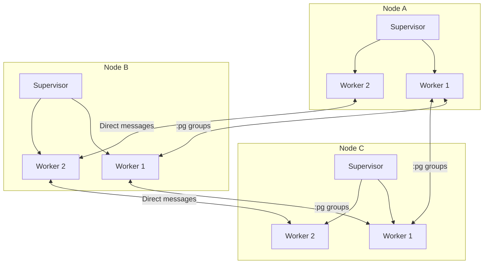
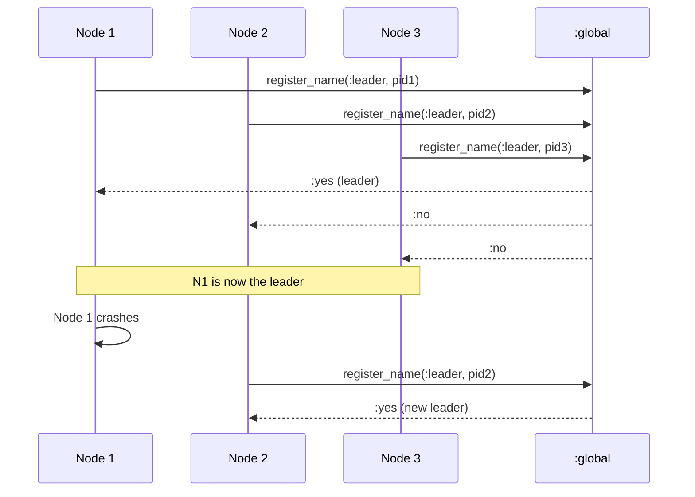
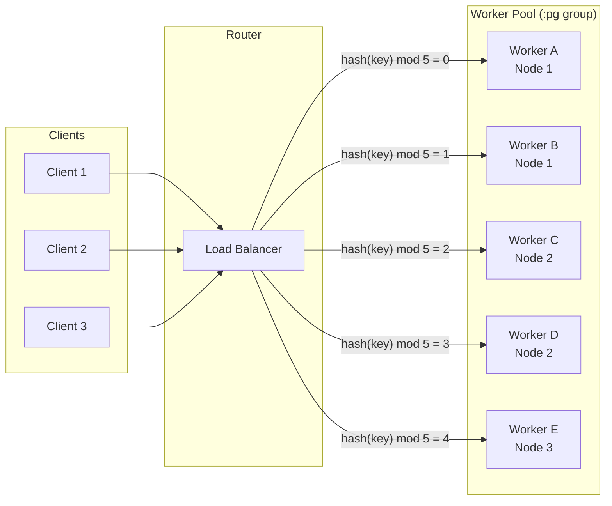

# How to Build Distributed Systems with Elixir

Author: [nawazdhandala](https://www.github.com/nawazdhandala)

Tags: Elixir, Erlang, Distributed Systems, OTP, Clustering, DevOps

Description: A practical guide to building fault-tolerant distributed systems in Elixir using Erlang distribution, process groups, libcluster, and strategies for handling network partitions.

---

Elixir runs on the BEAM virtual machine, the same battle-tested runtime that powers Erlang. The BEAM was designed from day one for distributed, fault-tolerant systems - telecom switches that could not afford downtime. That heritage gives Elixir developers something rare: distribution primitives baked into the language runtime rather than bolted on as an afterthought.

Building distributed systems is hard. Building them in most languages is harder. Elixir makes it approachable because the same abstractions you use locally - processes, message passing, supervision trees - extend naturally across node boundaries.

## Understanding Erlang Distribution

The Erlang distribution protocol handles node discovery, connection management, and transparent message passing between nodes. When two nodes connect, processes on one node can send messages to processes on another as if they were local.

### Starting Nodes

Every distributed Elixir node needs a name. You can use short names (within a local network) or long names (fully qualified domain names for production).

Start a node with a short name for local development. The cookie acts as a shared secret - nodes only connect if cookies match.

```elixir
# Start a node named "node1" with short naming
# The cookie is a shared secret for cluster authentication
iex --sname node1 --cookie secret_cookie

# Start another node to connect to it
iex --sname node2 --cookie secret_cookie
```

For production deployments across different machines, use long names with fully qualified hostnames.

```elixir
# Long names for production - requires DNS or /etc/hosts entries
iex --name node1@192.168.1.10 --cookie production_cookie
iex --name node2@192.168.1.11 --cookie production_cookie
```

### Connecting Nodes

Nodes do not automatically discover each other. You explicitly connect them, and once connected, the cluster forms a fully connected mesh - every node connects to every other node.

```elixir
# From node1, connect to node2
# Returns true on success, false if the node is unreachable
Node.connect(:"node2@hostname")

# List all connected nodes (excluding self)
Node.list()
# => [:"node2@hostname"]

# Check the current node's name
Node.self()
# => :"node1@hostname"

# Ping a node to check connectivity without fully connecting
Node.ping(:"node2@hostname")
# => :pong (or :pang if unreachable)
```

### Sending Messages Across Nodes

Once connected, you can send messages to processes on remote nodes using their PID or by registered name. The distribution layer handles serialization and network transport transparently.

```elixir
# Spawn a process on a remote node
# The code runs on node2, but you get the PID back locally
pid = Node.spawn(:"node2@hostname", fn ->
  receive do
    {:hello, from} ->
      send(from, {:world, Node.self()})
  end
end)

# Send a message to the remote process
send(pid, {:hello, self()})

# Receive the response
receive do
  {:world, node} ->
    IO.puts("Got response from #{node}")
end
```

## Process Registration with :global

Local process registration with `Process.register/2` only works within a single node. The `:global` module provides cluster-wide name registration - a name registered globally is visible and accessible from any connected node.

### Registering Processes Globally

Global registration is useful for singleton services - processes that should only run once in the entire cluster, like a job scheduler or rate limiter.

```elixir
defmodule ClusterSingleton do
  use GenServer

  # Start the GenServer and register it globally
  # Only one process with this name can exist across all nodes
  def start_link(opts) do
    name = Keyword.get(opts, :name, __MODULE__)
    GenServer.start_link(__MODULE__, opts, name: {:global, name})
  end

  # Client functions use the global name to find the process
  def get_state(name \\ __MODULE__) do
    GenServer.call({:global, name}, :get_state)
  end

  def update_state(name \\ __MODULE__, value) do
    GenServer.cast({:global, name}, {:update, value})
  end

  # Server callbacks
  @impl true
  def init(opts) do
    initial_state = Keyword.get(opts, :initial_state, %{})
    {:ok, initial_state}
  end

  @impl true
  def handle_call(:get_state, _from, state) do
    {:reply, state, state}
  end

  @impl true
  def handle_cast({:update, value}, state) do
    {:noreply, Map.merge(state, value)}
  end
end
```

### Global Registration Under the Hood

The `:global` module uses a leader election algorithm to handle concurrent registrations. If two nodes try to register the same name simultaneously, only one succeeds.

```elixir
# Register a process globally
:global.register_name(:my_service, self())

# Look up a globally registered process
case :global.whereis_name(:my_service) do
  :undefined ->
    IO.puts("Service not registered")
  pid ->
    IO.puts("Found service at #{inspect(pid)}")
end

# Unregister a global name
:global.unregister_name(:my_service)

# Re-register with a different process (useful for failover)
:global.re_register_name(:my_service, new_pid)
```

## Process Groups with :pg

While `:global` is for singletons, `:pg` (process groups) handles the opposite pattern - multiple processes that share a logical role. Think worker pools, pub/sub subscribers, or sharded caches where you want to broadcast to all instances or pick one at random.

### Setting Up Process Groups

Process groups let you organize processes by topic. A process can join multiple groups, and groups span all connected nodes automatically.

```elixir
defmodule EventBroadcaster do
  use GenServer

  def start_link(opts) do
    GenServer.start_link(__MODULE__, opts)
  end

  @impl true
  def init(opts) do
    # Join one or more process groups
    # :pg must be started in your application supervision tree
    groups = Keyword.get(opts, :groups, [:events])

    Enum.each(groups, fn group ->
      # Join the group - this process will receive broadcasts to this group
      :pg.join(group, self())
    end)

    {:ok, %{groups: groups}}
  end

  # Broadcast a message to all processes in a group across all nodes
  def broadcast(group, message) do
    # Get all PIDs in the group (from all nodes)
    pids = :pg.get_members(group)

    Enum.each(pids, fn pid ->
      send(pid, {:broadcast, message})
    end)

    {:ok, length(pids)}
  end

  # Send to one random member of the group (simple load balancing)
  def send_to_one(group, message) do
    case :pg.get_members(group) do
      [] ->
        {:error, :no_members}
      pids ->
        pid = Enum.random(pids)
        send(pid, {:direct, message})
        {:ok, pid}
    end
  end

  @impl true
  def handle_info({:broadcast, message}, state) do
    IO.puts("Received broadcast: #{inspect(message)}")
    {:noreply, state}
  end

  @impl true
  def handle_info({:direct, message}, state) do
    IO.puts("Received direct message: #{inspect(message)}")
    {:noreply, state}
  end

  @impl true
  def terminate(_reason, state) do
    # Clean up: leave all groups
    Enum.each(state.groups, fn group ->
      :pg.leave(group, self())
    end)
  end
end
```

### Local vs Global Members

The `:pg` module distinguishes between local members (on the current node) and all members (across the cluster). This is useful for optimizing local calls when possible.

```elixir
# Get all members across the cluster
all_workers = :pg.get_members(:workers)

# Get only members on the local node (faster, no network hop)
local_workers = :pg.get_local_members(:workers)

# Prefer local, fall back to remote
def get_worker do
  case :pg.get_local_members(:workers) do
    [_ | _] = local ->
      Enum.random(local)
    [] ->
      case :pg.get_members(:workers) do
        [_ | _] = all -> Enum.random(all)
        [] -> {:error, :no_workers}
      end
  end
end
```

## Building a Distributed GenServer

A distributed GenServer combines local state management with cluster-wide coordination. This example shows a distributed cache that shards data across nodes.

```elixir
defmodule DistributedCache do
  use GenServer

  @doc """
  A distributed cache that shards keys across cluster nodes.
  Each node owns a portion of the keyspace based on consistent hashing.
  """

  def start_link(opts) do
    GenServer.start_link(__MODULE__, opts, name: __MODULE__)
  end

  # Client API - these calls route to the correct node

  def get(key) do
    node = get_node_for_key(key)
    GenServer.call({__MODULE__, node}, {:get, key})
  end

  def put(key, value, ttl \\ :infinity) do
    node = get_node_for_key(key)
    GenServer.call({__MODULE__, node}, {:put, key, value, ttl})
  end

  def delete(key) do
    node = get_node_for_key(key)
    GenServer.call({__MODULE__, node}, {:delete, key})
  end

  # Determine which node owns a key using consistent hashing
  defp get_node_for_key(key) do
    nodes = [Node.self() | Node.list()] |> Enum.sort()
    node_count = length(nodes)

    # Simple hash-based sharding
    index = :erlang.phash2(key, node_count)
    Enum.at(nodes, index)
  end

  # Server implementation

  @impl true
  def init(_opts) do
    # ETS table for fast local lookups
    table = :ets.new(:cache, [:set, :protected])

    # Schedule TTL cleanup
    schedule_cleanup()

    {:ok, %{table: table}}
  end

  @impl true
  def handle_call({:get, key}, _from, %{table: table} = state) do
    result = case :ets.lookup(table, key) do
      [{^key, value, expires_at}] ->
        if expires_at == :infinity or expires_at > System.monotonic_time(:millisecond) do
          {:ok, value}
        else
          :ets.delete(table, key)
          {:error, :not_found}
        end
      [] ->
        {:error, :not_found}
    end

    {:reply, result, state}
  end

  @impl true
  def handle_call({:put, key, value, ttl}, _from, %{table: table} = state) do
    expires_at = case ttl do
      :infinity -> :infinity
      ms when is_integer(ms) -> System.monotonic_time(:millisecond) + ms
    end

    :ets.insert(table, {key, value, expires_at})
    {:reply, :ok, state}
  end

  @impl true
  def handle_call({:delete, key}, _from, %{table: table} = state) do
    :ets.delete(table, key)
    {:reply, :ok, state}
  end

  @impl true
  def handle_info(:cleanup, %{table: table} = state) do
    now = System.monotonic_time(:millisecond)

    # Delete expired entries
    :ets.select_delete(table, [
      {{:_, :_, :"$1"},
       [{:"/=", :"$1", :infinity}, {:<, :"$1", now}],
       [true]}
    ])

    schedule_cleanup()
    {:noreply, state}
  end

  defp schedule_cleanup do
    # Run cleanup every 60 seconds
    Process.send_after(self(), :cleanup, 60_000)
  end
end
```

## Automatic Clustering with libcluster

Manually connecting nodes works for development but not production. libcluster automates node discovery and connection using various strategies - DNS, Kubernetes, multicast, or cloud provider APIs.

### Adding libcluster to Your Project

Add the dependency and configure a clustering strategy in your supervision tree.

```elixir
# In mix.exs
defp deps do
  [
    {:libcluster, "~> 3.3"}
  ]
end
```

### Kubernetes DNS Strategy

This strategy queries Kubernetes headless services to discover pod IPs. It is the most reliable approach for Kubernetes deployments.

```elixir
# In your application.ex
defmodule MyApp.Application do
  use Application

  def start(_type, _args) do
    # Configure libcluster for Kubernetes
    topologies = [
      k8s: [
        strategy: Cluster.Strategy.Kubernetes.DNS,
        config: [
          # The headless service name in Kubernetes
          service: "myapp-headless",
          # The namespace - can be hardcoded or read from env
          namespace: System.get_env("POD_NAMESPACE", "default"),
          # Application name used for the long node name
          application_name: "myapp",
          # How often to poll for new nodes (milliseconds)
          polling_interval: 5_000
        ]
      ]
    ]

    children = [
      # Start the cluster supervisor first
      {Cluster.Supervisor, [topologies, [name: MyApp.ClusterSupervisor]]},
      # Then start your application's supervision tree
      MyApp.Supervisor
    ]

    Supervisor.start_link(children, strategy: :one_for_one)
  end
end
```

### Gossip Strategy for Local Development

For local development or LAN deployments, the gossip strategy uses multicast UDP to discover nodes automatically.

```elixir
topologies = [
  gossip: [
    strategy: Cluster.Strategy.Gossip,
    config: [
      # Multicast address for discovery
      multicast_addr: "230.1.1.1",
      # Port for gossip messages
      port: 45892,
      # Network interface to use
      if_addr: "0.0.0.0",
      # How often to broadcast presence
      broadcast_period: 1_000,
      # Secret for cluster membership
      secret: "my_cluster_secret"
    ]
  ]
]
```

### EPMD-less Clustering

Erlang traditionally uses EPMD (Erlang Port Mapper Daemon) for node discovery. For containerized deployments, you can skip EPMD and use direct TCP connections.

```elixir
# In your release configuration (rel/env.sh.eex)
export RELEASE_DISTRIBUTION=name
export RELEASE_NODE=myapp@${POD_IP}

# Use a fixed port instead of EPMD
export ERL_DIST_PORT=4369

# Configure the VM to not start EPMD
export ERL_FLAGS="-start_epmd false -erl_epmd_port 4369"
```

## Building a Distributed Registry

A distributed registry maps names to processes across the cluster. Unlike `:global` which uses leader election, this implementation uses `:pg` for a more partition-tolerant design.

```elixir
defmodule DistributedRegistry do
  @moduledoc """
  A distributed process registry using :pg for cluster-wide process lookup.
  Supports multiple processes per name (unlike :global which enforces uniqueness).
  """

  # Register the current process under a name
  def register(name) do
    :pg.join({:registry, name}, self())
  end

  # Unregister the current process from a name
  def unregister(name) do
    :pg.leave({:registry, name}, self())
  end

  # Look up all processes registered under a name
  def lookup(name) do
    :pg.get_members({:registry, name})
  end

  # Look up processes on the local node only
  def lookup_local(name) do
    :pg.get_local_members({:registry, name})
  end

  # Get one process for the name, preferring local
  def whereis(name) do
    case lookup_local(name) do
      [pid | _] -> {:ok, pid}
      [] ->
        case lookup(name) do
          [pid | _] -> {:ok, pid}
          [] -> {:error, :not_found}
        end
    end
  end

  # Call a registered process by name
  def call(name, request, timeout \\ 5_000) do
    case whereis(name) do
      {:ok, pid} -> GenServer.call(pid, request, timeout)
      {:error, :not_found} -> {:error, :process_not_found}
    end
  end

  # Broadcast to all processes registered under a name
  def broadcast(name, message) do
    pids = lookup(name)
    Enum.each(pids, &send(&1, message))
    {:ok, length(pids)}
  end
end

# Usage in a GenServer
defmodule MyWorker do
  use GenServer

  def start_link(opts) do
    name = Keyword.fetch!(opts, :name)
    GenServer.start_link(__MODULE__, %{name: name})
  end

  @impl true
  def init(%{name: name} = state) do
    # Register this process under the given name
    DistributedRegistry.register(name)
    {:ok, state}
  end

  @impl true
  def terminate(_reason, %{name: name}) do
    DistributedRegistry.unregister(name)
  end
end
```

## Handling Network Partitions

Network partitions are inevitable in distributed systems. When nodes cannot communicate, you have to choose between consistency and availability. Elixir gives you the tools to implement either strategy.

### Detecting Partitions

The BEAM automatically monitors node connections. You can subscribe to nodeup and nodedown events to detect when the cluster topology changes.

```elixir
defmodule PartitionDetector do
  use GenServer
  require Logger

  def start_link(opts) do
    GenServer.start_link(__MODULE__, opts, name: __MODULE__)
  end

  @impl true
  def init(_opts) do
    # Subscribe to node connection events
    :net_kernel.monitor_nodes(true, [node_type: :visible])

    {:ok, %{known_nodes: MapSet.new(Node.list())}}
  end

  @impl true
  def handle_info({:nodeup, node, _info}, state) do
    Logger.info("Node joined cluster: #{node}")

    # Node rejoined - might need to reconcile state
    handle_node_join(node)

    new_nodes = MapSet.put(state.known_nodes, node)
    {:noreply, %{state | known_nodes: new_nodes}}
  end

  @impl true
  def handle_info({:nodedown, node, _info}, state) do
    Logger.warning("Node left cluster: #{node}")

    # Node disconnected - might be a partition or crash
    handle_node_leave(node)

    new_nodes = MapSet.delete(state.known_nodes, node)
    {:noreply, %{state | known_nodes: new_nodes}}
  end

  defp handle_node_join(node) do
    # Implement your reconciliation logic
    # - Sync state with the rejoined node
    # - Resolve any conflicts from the partition period
    # - Rebalance workload if needed
    :ok
  end

  defp handle_node_leave(node) do
    # Implement your partition handling logic
    # - Fail over any work owned by that node
    # - Mark that node's data as potentially stale
    # - Adjust quorum calculations
    :ok
  end
end
```

### Partition-Tolerant Writes with CRDTs

Conflict-free Replicated Data Types (CRDTs) let you accept writes on both sides of a partition and merge them later without conflicts. This example implements a simple G-Counter (grow-only counter).

```elixir
defmodule GCounter do
  @moduledoc """
  A grow-only counter CRDT. Each node maintains its own count,
  and the total is the sum of all node counts. Merging always
  takes the maximum count seen for each node.
  """

  defstruct counts: %{}

  # Increment the counter for the current node
  def increment(%GCounter{counts: counts} = counter, amount \\ 1) do
    node = Node.self()
    current = Map.get(counts, node, 0)
    %GCounter{counter | counts: Map.put(counts, node, current + amount)}
  end

  # Get the total count across all nodes
  def value(%GCounter{counts: counts}) do
    counts |> Map.values() |> Enum.sum()
  end

  # Merge two counters - takes max count for each node
  # This merge function is commutative, associative, and idempotent
  def merge(%GCounter{counts: c1}, %GCounter{counts: c2}) do
    merged = Map.merge(c1, c2, fn _node, v1, v2 -> max(v1, v2) end)
    %GCounter{counts: merged}
  end
end

# Usage across nodes
defmodule DistributedCounter do
  use GenServer

  def start_link(opts) do
    GenServer.start_link(__MODULE__, opts, name: __MODULE__)
  end

  def increment(amount \\ 1) do
    GenServer.call(__MODULE__, {:increment, amount})
  end

  def value do
    GenServer.call(__MODULE__, :value)
  end

  # Sync with other nodes periodically
  def sync do
    GenServer.cast(__MODULE__, :sync)
  end

  @impl true
  def init(_opts) do
    # Periodically sync with other nodes
    schedule_sync()
    {:ok, %GCounter{}}
  end

  @impl true
  def handle_call({:increment, amount}, _from, counter) do
    new_counter = GCounter.increment(counter, amount)
    {:reply, :ok, new_counter}
  end

  @impl true
  def handle_call(:value, _from, counter) do
    {:reply, GCounter.value(counter), counter}
  end

  @impl true
  def handle_cast(:sync, counter) do
    # Get counters from all other nodes and merge
    merged = Node.list()
    |> Enum.reduce(counter, fn node, acc ->
      case :rpc.call(node, __MODULE__, :get_counter, [], 5_000) do
        {:badrpc, _} -> acc
        remote_counter -> GCounter.merge(acc, remote_counter)
      end
    end)

    {:noreply, merged}
  end

  @impl true
  def handle_info(:sync, counter) do
    send(self(), {:do_sync})
    schedule_sync()
    {:noreply, counter}
  end

  def get_counter do
    GenServer.call(__MODULE__, :get_raw_counter)
  end

  @impl true
  def handle_call(:get_raw_counter, _from, counter) do
    {:reply, counter, counter}
  end

  defp schedule_sync do
    Process.send_after(self(), :sync, 5_000)
  end
end
```

## Cluster Architecture Patterns

Understanding common patterns helps you design systems that leverage distribution effectively.



### Leader Election Pattern

Some operations require a single coordinator. Use `:global` registration for leader election - the first process to register wins.



### Work Distribution Pattern

Distribute work across the cluster using process groups and consistent hashing.



## Production Checklist

Before deploying a distributed Elixir application, verify these items:

| Area | Check | Why It Matters |
|------|-------|----------------|
| **Networking** | Nodes can reach each other on EPMD port (4369) and distribution ports | Cluster formation fails silently without connectivity |
| **Cookies** | Same cookie on all nodes, not committed to version control | Security and cluster membership |
| **DNS** | Hostnames resolve correctly between nodes | Long names require working DNS |
| **Timeouts** | Configured appropriate net_ticktime | Prevents false positives on busy nodes |
| **Monitoring** | Node up/down events logged and alerted | Catch partition issues early |
| **Graceful shutdown** | Nodes deregister and drain before stopping | Prevents in-flight request failures |
| **State sync** | Strategy for state reconciliation after partitions | Data consistency after healing |

### Network Configuration

Tune the distribution layer for your network characteristics.

```elixir
# In your vm.args or releases config
# How often nodes ping each other (default 60s)
-kernel net_ticktime 15

# Increase distribution buffer size for high-throughput clusters
+zdbbl 2097152

# Set distribution port range (useful for firewalls)
-kernel inet_dist_listen_min 9100
-kernel inet_dist_listen_max 9200
```

## Summary

Elixir's distribution capabilities come from decades of Erlang telecom engineering. The primitives - transparent message passing, global registration, process groups - handle the hard parts of distributed systems so you can focus on your application logic.

Key takeaways:

- **Start simple**: Connect nodes manually in development, add libcluster for production
- **Choose the right primitive**: `:global` for singletons, `:pg` for groups, direct PIDs for point-to-point
- **Plan for partitions**: They will happen. Decide on your consistency vs. availability tradeoff upfront
- **Monitor everything**: Node connections, message queue lengths, process counts per node

The BEAM was built for systems that could not afford to go down. That same reliability is available to every Elixir application willing to embrace distribution as a first-class concern rather than an afterthought.
