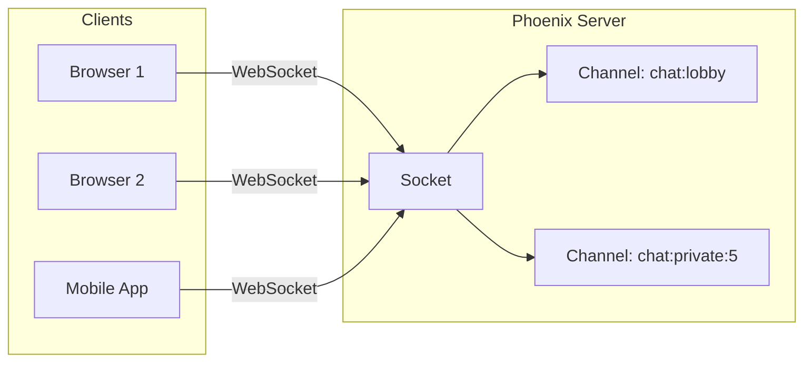
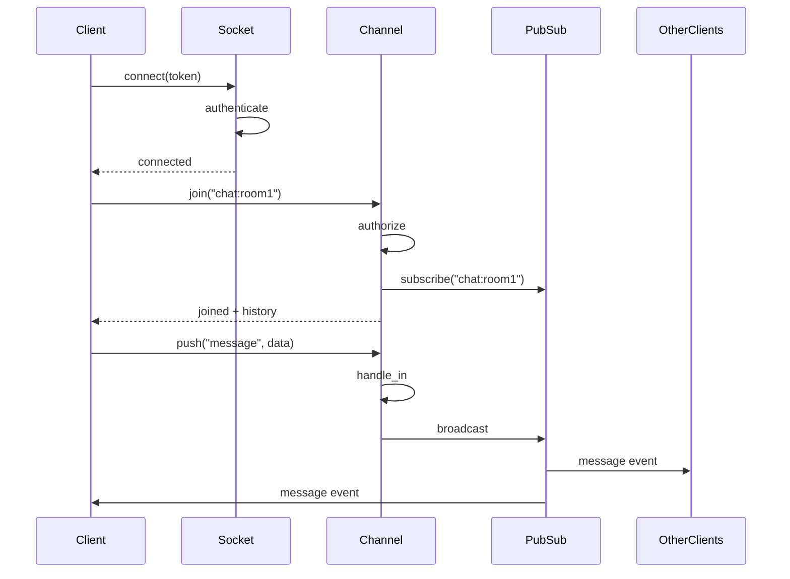

# How to Build Real-Time Features with Phoenix Channels

Author: [nawazdhandala](https://www.github.com/nawazdhandala)

Tags: Elixir, Phoenix, WebSockets, Real-Time, Backend, Distributed Systems

Description: A complete guide to building real-time features using Phoenix Channels - from basic setup to presence tracking and building a production-ready chat application.

---

Phoenix Channels bring real-time communication to Elixir applications without the complexity you might expect. Built on top of the BEAM virtual machine, Channels leverage Erlang's battle-tested concurrency model to handle millions of simultaneous connections. If you have ever struggled with WebSocket scaling in Node.js or Ruby, Phoenix will feel like a breath of fresh air.

## What Are Phoenix Channels?

Channels are a layer on top of Phoenix's transport layer that handles real-time communication. They use WebSockets by default but can fall back to long-polling when needed. The key abstractions are:

- **Socket**: The connection between client and server
- **Channel**: A conversation on a specific topic
- **Topic**: A string identifier like `"chat:lobby"` or `"game:42"`
- **Message**: Data sent between client and server



## Setting Up Your Phoenix Application

First, create a new Phoenix project. Phoenix 1.7+ includes LiveView by default, but Channels work independently.

```bash
mix phx.new realtime_chat --no-ecto
cd realtime_chat
mix deps.get
```

Phoenix generates a socket file at `lib/realtime_chat_web/channels/user_socket.ex`. This is where you define which channels your application supports.

## Creating Your First Channel

Generate a channel module for a chat room. Phoenix provides a generator that creates the boilerplate.

```bash
mix phx.gen.channel Room
```

This creates `lib/realtime_chat_web/channels/room_channel.ex`. Let's examine the generated code and expand it.

```elixir
defmodule RealtimeChatWeb.RoomChannel do
  use RealtimeChatWeb, :channel

  # Called when a client joins the channel
  # The first argument is the topic they're joining
  # The second is any params sent with the join request
  # The third is the socket struct containing connection state
  @impl true
  def join("room:lobby", _payload, socket) do
    # Allow anyone to join the lobby
    {:ok, socket}
  end

  def join("room:" <> room_id, payload, socket) do
    # For private rooms, verify the user has access
    if authorized?(socket.assigns.user_id, room_id) do
      {:ok, assign(socket, :room_id, room_id)}
    else
      {:error, %{reason: "unauthorized"}}
    end
  end

  # Handle incoming messages from clients
  # "new_msg" is the event name, payload is the data sent
  @impl true
  def handle_in("new_msg", %{"body" => body}, socket) do
    # Broadcast to all subscribers of this topic, including sender
    broadcast!(socket, "new_msg", %{
      body: body,
      user_id: socket.assigns.user_id,
      timestamp: DateTime.utc_now()
    })

    {:noreply, socket}
  end

  # Handle typing indicators - broadcast to others but not the sender
  def handle_in("typing", _payload, socket) do
    broadcast_from!(socket, "typing", %{
      user_id: socket.assigns.user_id
    })

    {:noreply, socket}
  end

  # Reply directly to the client with acknowledgment
  def handle_in("ping", payload, socket) do
    {:reply, {:ok, payload}, socket}
  end

  defp authorized?(user_id, room_id) do
    # Add your authorization logic here
    # Check database, cache, or external service
    true
  end
end
```

## Registering Channels in the Socket

Update the user socket to route topics to channels. The socket file defines which channels handle which topic patterns.

```elixir
defmodule RealtimeChatWeb.UserSocket do
  use Phoenix.Socket

  # Route "room:*" topics to the RoomChannel module
  # The "*" is a wildcard - room:lobby, room:123, room:anything all match
  channel "room:*", RealtimeChatWeb.RoomChannel
  channel "user:*", RealtimeChatWeb.UserChannel

  # Socket params come from the client connection
  # Use this to authenticate and identify the user
  @impl true
  def connect(%{"token" => token}, socket, _connect_info) do
    case verify_token(token) do
      {:ok, user_id} ->
        # Assign user_id to socket - available in all channels
        {:ok, assign(socket, :user_id, user_id)}

      {:error, _reason} ->
        :error
    end
  end

  def connect(_params, _socket, _connect_info) do
    :error
  end

  # Each socket connection needs a unique identifier
  # Used for targeting specific users with messages
  @impl true
  def id(socket), do: "user_socket:#{socket.assigns.user_id}"

  defp verify_token(token) do
    # Verify JWT or Phoenix.Token
    Phoenix.Token.verify(
      RealtimeChatWeb.Endpoint,
      "user auth",
      token,
      max_age: 86400
    )
  end
end
```

## JavaScript Client Setup

Phoenix ships with a JavaScript client that handles connection management, reconnection, and message serialization. Add it to your assets.

```bash
npm install phoenix --save
```

Create a socket connection and join channels. The client handles reconnection automatically with exponential backoff.

```javascript
import { Socket } from "phoenix";

// Connect to the Phoenix socket endpoint
// The params object is passed to UserSocket.connect/3
const socket = new Socket("/socket", {
  params: { token: window.userToken },
  // Reconnect settings
  reconnectAfterMs: (tries) => {
    // Exponential backoff: 1s, 2s, 5s, 10s, then stay at 10s
    return [1000, 2000, 5000, 10000][tries - 1] || 10000;
  },
});

// Handle socket-level errors
socket.onError(() => console.log("Socket connection error"));
socket.onClose(() => console.log("Socket closed"));

// Establish the connection
socket.connect();

// Join a channel with optional params
const channel = socket.channel("room:lobby", { last_message_id: 0 });

// Handle events from the server
channel.on("new_msg", (payload) => {
  console.log("New message:", payload.body);
  renderMessage(payload);
});

channel.on("typing", (payload) => {
  showTypingIndicator(payload.user_id);
});

// Join the channel
// The server's join/3 callback determines if the join is allowed
channel
  .join()
  .receive("ok", (response) => {
    console.log("Joined successfully", response);
  })
  .receive("error", (response) => {
    console.log("Unable to join", response.reason);
  })
  .receive("timeout", () => {
    console.log("Network issue. Retrying...");
  });

// Send messages to the server
function sendMessage(body) {
  channel
    .push("new_msg", { body: body })
    .receive("ok", () => console.log("Message sent"))
    .receive("error", (err) => console.log("Send failed", err))
    .receive("timeout", () => console.log("Timeout - server not responding"));
}

// Send typing indicator (fire and forget, no response needed)
function sendTyping() {
  channel.push("typing", {});
}

// Leave the channel when done
function leaveRoom() {
  channel.leave().receive("ok", () => console.log("Left channel"));
}
```

## Broadcasting Patterns

Phoenix offers several ways to send messages. Understanding when to use each is key to building efficient real-time features.

```elixir
defmodule RealtimeChatWeb.RoomChannel do
  use RealtimeChatWeb, :channel

  def handle_in("message", payload, socket) do
    # broadcast! - Send to ALL subscribers of this topic, including sender
    # Use when sender should see their own message (chat, collaborative editing)
    broadcast!(socket, "message", payload)

    # broadcast_from! - Send to all subscribers EXCEPT the sender
    # Use for typing indicators, cursor positions, presence updates
    broadcast_from!(socket, "user_action", payload)

    # push - Send only to the current socket (direct reply)
    # Use for acknowledgments, private responses, error messages
    push(socket, "ack", %{status: "received"})

    {:noreply, socket}
  end
end
```

You can also broadcast from outside a channel - useful for sending updates from background jobs or other processes.

```elixir
defmodule RealtimeChat.Notifications do
  # Broadcast from anywhere in your application
  def notify_room(room_id, event, payload) do
    RealtimeChatWeb.Endpoint.broadcast!("room:#{room_id}", event, payload)
  end

  # Target a specific user across all their connections
  def notify_user(user_id, event, payload) do
    RealtimeChatWeb.Endpoint.broadcast!("user:#{user_id}", event, payload)
  end
end
```

## Presence Tracking

Phoenix.Presence tracks which users are connected to a channel across all nodes in a cluster. It handles the complexity of distributed presence - no external dependencies like Redis required.

Create a presence module for your application.

```elixir
defmodule RealtimeChatWeb.Presence do
  use Phoenix.Presence,
    otp_app: :realtime_chat,
    pubsub_server: RealtimeChat.PubSub
end
```

Update your channel to track and list presence. The presence system automatically syncs across cluster nodes using CRDTs.

```elixir
defmodule RealtimeChatWeb.RoomChannel do
  use RealtimeChatWeb, :channel
  alias RealtimeChatWeb.Presence

  def join("room:" <> room_id, _params, socket) do
    # Send presence state after join completes
    # Using send_after ensures the join response goes first
    send(self(), :after_join)
    {:ok, assign(socket, :room_id, room_id)}
  end

  # Called after the join is complete
  def handle_info(:after_join, socket) do
    # Track this user's presence with metadata
    {:ok, _ref} = Presence.track(socket, socket.assigns.user_id, %{
      online_at: System.system_time(:second),
      username: socket.assigns.username,
      status: "online"
    })

    # Push current presence state to the joining user
    push(socket, "presence_state", Presence.list(socket))

    {:noreply, socket}
  end

  # Handle status updates (away, busy, etc.)
  def handle_in("update_status", %{"status" => status}, socket) do
    # Update presence metadata - triggers presence_diff on all clients
    Presence.update(socket, socket.assigns.user_id, fn meta ->
      Map.put(meta, :status, status)
    end)

    {:noreply, socket}
  end
end
```

The JavaScript client needs to sync presence state. Phoenix provides a Presence module that handles diffing automatically.

```javascript
import { Presence } from "phoenix";

const channel = socket.channel("room:lobby", {});
const presence = new Presence(channel);

// Called when presence state changes (join, leave, or update)
presence.onSync(() => {
  // Get all present users as a list
  const users = presence.list((id, { metas: [first, ...rest] }) => {
    return {
      id: id,
      username: first.username,
      status: first.status,
      // User might have multiple connections (tabs, devices)
      connectionCount: rest.length + 1,
    };
  });

  renderOnlineUsers(users);
});

// Called specifically when users join
presence.onJoin((id, current, newPres) => {
  if (!current) {
    // User just came online (had no previous connections)
    console.log(`${id} just joined`);
  } else {
    // User opened another tab/device
    console.log(`${id} opened another connection`);
  }
});

// Called specifically when users leave
presence.onLeave((id, current, leftPres) => {
  if (current.metas.length === 0) {
    // User went fully offline
    console.log(`${id} went offline`);
  } else {
    // User still has other connections
    console.log(`${id} closed a connection but is still online`);
  }
});

channel.join();
```

## Channel Authentication

Beyond the socket-level authentication, you often need per-channel authorization. Validate permissions in the join callback.

```elixir
defmodule RealtimeChatWeb.RoomChannel do
  use RealtimeChatWeb, :channel
  alias RealtimeChat.Rooms

  def join("room:" <> room_id, _params, socket) do
    user_id = socket.assigns.user_id

    # Check if user can access this room
    case Rooms.get_membership(user_id, room_id) do
      {:ok, membership} ->
        socket =
          socket
          |> assign(:room_id, room_id)
          |> assign(:role, membership.role)

        send(self(), :after_join)
        {:ok, %{room_id: room_id, role: membership.role}, socket}

      {:error, :not_found} ->
        {:error, %{reason: "not_a_member"}}

      {:error, :banned} ->
        {:error, %{reason: "banned"}}
    end
  end

  # Role-based message handling
  def handle_in("delete_msg", %{"message_id" => msg_id}, socket) do
    if socket.assigns.role in ["admin", "moderator"] do
      Rooms.delete_message(msg_id)
      broadcast!(socket, "msg_deleted", %{message_id: msg_id})
      {:noreply, socket}
    else
      {:reply, {:error, %{reason: "unauthorized"}}, socket}
    end
  end
end
```

## Building a Real-Time Chat Application

Let's put it all together into a complete chat application. First, the server-side channel with all features.

```elixir
defmodule RealtimeChatWeb.ChatChannel do
  use RealtimeChatWeb, :channel
  alias RealtimeChatWeb.Presence
  alias RealtimeChat.{Messages, Rooms}

  # Join with optional message history
  def join("chat:" <> room_id, %{"last_seen_id" => last_seen_id}, socket) do
    case authorize_join(socket.assigns.user_id, room_id) do
      {:ok, room} ->
        # Fetch messages the user missed
        messages = Messages.list_since(room_id, last_seen_id, limit: 50)

        socket =
          socket
          |> assign(:room_id, room_id)
          |> assign(:room, room)

        send(self(), :after_join)

        # Return recent messages with the join response
        {:ok, %{messages: messages}, socket}

      {:error, reason} ->
        {:error, %{reason: reason}}
    end
  end

  def join("chat:" <> room_id, _params, socket) do
    join("chat:" <> room_id, %{"last_seen_id" => 0}, socket)
  end

  def handle_info(:after_join, socket) do
    {:ok, _} = Presence.track(socket, socket.assigns.user_id, %{
      username: socket.assigns.username,
      avatar: socket.assigns.avatar,
      joined_at: DateTime.utc_now()
    })

    push(socket, "presence_state", Presence.list(socket))
    {:noreply, socket}
  end

  # Handle new messages
  def handle_in("message", %{"body" => body}, socket) when byte_size(body) > 0 do
    user_id = socket.assigns.user_id
    room_id = socket.assigns.room_id

    # Persist the message
    case Messages.create(%{
      body: body,
      user_id: user_id,
      room_id: room_id
    }) do
      {:ok, message} ->
        # Broadcast to all room members
        broadcast!(socket, "message", %{
          id: message.id,
          body: message.body,
          user_id: user_id,
          username: socket.assigns.username,
          inserted_at: message.inserted_at
        })

        {:reply, {:ok, %{id: message.id}}, socket}

      {:error, changeset} ->
        {:reply, {:error, %{errors: format_errors(changeset)}}, socket}
    end
  end

  def handle_in("message", _params, socket) do
    {:reply, {:error, %{reason: "empty_message"}}, socket}
  end

  # Typing indicators with debouncing on the client
  def handle_in("typing_start", _params, socket) do
    broadcast_from!(socket, "typing_start", %{
      user_id: socket.assigns.user_id,
      username: socket.assigns.username
    })

    {:noreply, socket}
  end

  def handle_in("typing_stop", _params, socket) do
    broadcast_from!(socket, "typing_stop", %{
      user_id: socket.assigns.user_id
    })

    {:noreply, socket}
  end

  # Message reactions
  def handle_in("react", %{"message_id" => msg_id, "emoji" => emoji}, socket) do
    case Messages.add_reaction(msg_id, socket.assigns.user_id, emoji) do
      {:ok, reaction} ->
        broadcast!(socket, "reaction_added", %{
          message_id: msg_id,
          user_id: socket.assigns.user_id,
          emoji: emoji
        })

        {:noreply, socket}

      {:error, reason} ->
        {:reply, {:error, %{reason: reason}}, socket}
    end
  end

  # Load older messages (pagination)
  def handle_in("load_more", %{"before_id" => before_id}, socket) do
    messages = Messages.list_before(socket.assigns.room_id, before_id, limit: 50)
    {:reply, {:ok, %{messages: messages}}, socket}
  end

  defp authorize_join(user_id, room_id) do
    Rooms.get_with_membership(room_id, user_id)
  end

  defp format_errors(changeset) do
    Ecto.Changeset.traverse_errors(changeset, fn {msg, _opts} -> msg end)
  end
end
```

Now the complete JavaScript client with all features.

```javascript
import { Socket, Presence } from "phoenix";

class ChatClient {
  constructor(userToken, options = {}) {
    this.userToken = userToken;
    this.socket = null;
    this.channel = null;
    this.presence = null;
    this.callbacks = {};
    this.typingTimeout = null;
    this.isTyping = false;

    // Merge default options
    this.options = {
      onMessage: () => {},
      onPresenceChange: () => {},
      onTyping: () => {},
      onError: () => {},
      ...options,
    };
  }

  connect() {
    this.socket = new Socket("/socket", {
      params: { token: this.userToken },
    });

    this.socket.onError(() => {
      this.options.onError("Connection error");
    });

    this.socket.connect();
    return this;
  }

  joinRoom(roomId, lastSeenId = 0) {
    return new Promise((resolve, reject) => {
      // Leave current channel if any
      if (this.channel) {
        this.channel.leave();
      }

      this.channel = this.socket.channel(`chat:${roomId}`, {
        last_seen_id: lastSeenId,
      });

      // Set up presence tracking
      this.presence = new Presence(this.channel);
      this.presence.onSync(() => {
        const users = this.presence.list((id, { metas: [first] }) => ({
          id,
          ...first,
        }));
        this.options.onPresenceChange(users);
      });

      // Handle incoming messages
      this.channel.on("message", (msg) => {
        this.options.onMessage(msg);
      });

      // Handle typing indicators
      this.channel.on("typing_start", ({ user_id, username }) => {
        this.options.onTyping({ userId: user_id, username, isTyping: true });
      });

      this.channel.on("typing_stop", ({ user_id }) => {
        this.options.onTyping({ userId: user_id, isTyping: false });
      });

      // Handle reactions
      this.channel.on("reaction_added", (data) => {
        if (this.options.onReaction) {
          this.options.onReaction(data);
        }
      });

      // Join the channel
      this.channel
        .join()
        .receive("ok", (response) => {
          resolve(response);
        })
        .receive("error", (response) => {
          reject(new Error(response.reason));
        })
        .receive("timeout", () => {
          reject(new Error("Connection timeout"));
        });
    });
  }

  sendMessage(body) {
    return new Promise((resolve, reject) => {
      this.channel
        .push("message", { body })
        .receive("ok", resolve)
        .receive("error", reject)
        .receive("timeout", () => reject(new Error("Timeout")));
    });
  }

  // Debounced typing indicator
  sendTyping() {
    if (!this.isTyping) {
      this.isTyping = true;
      this.channel.push("typing_start", {});
    }

    // Clear existing timeout
    if (this.typingTimeout) {
      clearTimeout(this.typingTimeout);
    }

    // Stop typing after 2 seconds of no input
    this.typingTimeout = setTimeout(() => {
      this.isTyping = false;
      this.channel.push("typing_stop", {});
    }, 2000);
  }

  addReaction(messageId, emoji) {
    this.channel.push("react", { message_id: messageId, emoji });
  }

  loadMoreMessages(beforeId) {
    return new Promise((resolve, reject) => {
      this.channel
        .push("load_more", { before_id: beforeId })
        .receive("ok", ({ messages }) => resolve(messages))
        .receive("error", reject);
    });
  }

  leaveRoom() {
    if (this.channel) {
      this.channel.leave();
      this.channel = null;
      this.presence = null;
    }
  }

  disconnect() {
    this.leaveRoom();
    if (this.socket) {
      this.socket.disconnect();
    }
  }
}

// Usage example
const chat = new ChatClient(window.userToken, {
  onMessage: (msg) => {
    appendMessage(msg);
  },
  onPresenceChange: (users) => {
    updateOnlineUsers(users);
  },
  onTyping: ({ username, isTyping }) => {
    updateTypingIndicator(username, isTyping);
  },
});

chat.connect();

chat.joinRoom("general").then((response) => {
  // response.messages contains recent messages
  response.messages.forEach(appendMessage);
});
```

## Channel Flow Diagram

Here is how messages flow through Phoenix Channels.



## Scaling Across Multiple Nodes

Phoenix Channels scale horizontally out of the box. The PubSub system uses distributed Erlang to sync messages across nodes. For larger deployments, you can plug in Redis.

```elixir
# config/prod.exs

# Default distributed Erlang PubSub (works great up to ~20 nodes)
config :realtime_chat, RealtimeChat.PubSub,
  name: RealtimeChat.PubSub,
  adapter: Phoenix.PubSub.PG2

# For larger clusters, use Redis adapter
config :realtime_chat, RealtimeChat.PubSub,
  name: RealtimeChat.PubSub,
  adapter: Phoenix.PubSub.Redis,
  host: System.get_env("REDIS_HOST"),
  port: 6379,
  node_name: System.get_env("NODE_NAME")
```

The beauty of Elixir is that a single node can handle hundreds of thousands of connections. Most teams never need to worry about horizontal scaling for Channels - a single well-provisioned server handles far more than a typical application needs.

## Error Handling and Resilience

Channels are supervised processes. If one crashes, only that connection is affected - other users continue uninterrupted.

```elixir
defmodule RealtimeChatWeb.RoomChannel do
  use RealtimeChatWeb, :channel
  require Logger

  # Handle unexpected errors gracefully
  def handle_in(event, payload, socket) do
    try do
      do_handle_in(event, payload, socket)
    rescue
      e ->
        Logger.error("Channel error: #{inspect(e)}")
        {:reply, {:error, %{reason: "internal_error"}}, socket}
    end
  end

  defp do_handle_in("message", payload, socket) do
    # Your message handling logic
  end

  # Called when the channel process terminates
  def terminate(reason, socket) do
    Logger.info("Channel terminated: #{inspect(reason)}")
    # Clean up any external resources
    :ok
  end
end
```

## Summary

| Feature | Implementation |
|---------|----------------|
| **Channel creation** | `mix phx.gen.channel` and route in UserSocket |
| **Joining topics** | Pattern match in `join/3`, return `{:ok, socket}` or `{:error, reason}` |
| **Broadcasting** | `broadcast!/3`, `broadcast_from!/3`, `push/3` |
| **Presence tracking** | Phoenix.Presence with CRDT-based synchronization |
| **Authentication** | Socket-level in `connect/3`, channel-level in `join/3` |
| **JavaScript client** | `phoenix` npm package with Socket and Presence |
| **Scaling** | PG2 for small clusters, Redis for larger deployments |

Phoenix Channels give you a production-ready real-time system with minimal configuration. The BEAM's process model means each connection is isolated - a slow client or crashed handler never affects others. Combined with presence tracking and horizontal scaling, you have everything needed to build chat applications, live dashboards, collaborative tools, and multiplayer games.

Start simple with basic messaging, add presence when you need online indicators, and scale horizontally only when traffic demands it. Most Phoenix applications handle impressive loads on a single node before needing to distribute.
