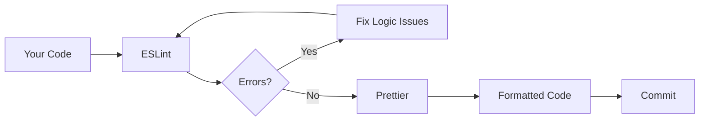
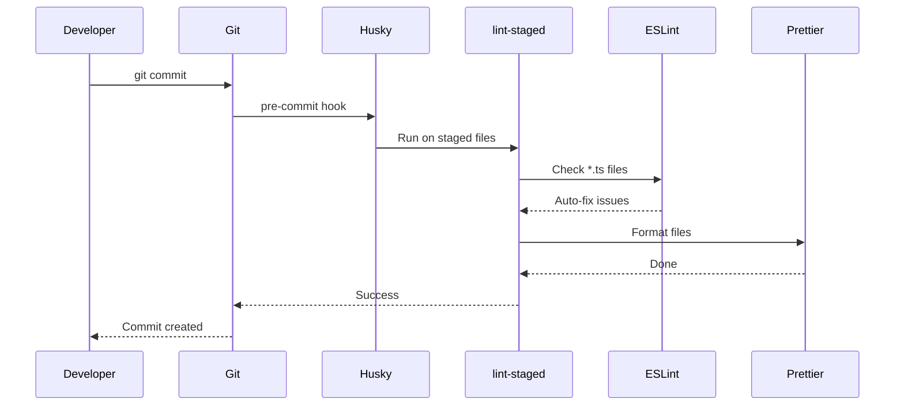

# How to Configure ESLint and Prettier for TypeScript

Author: [nawazdhandala](https://www.github.com/nawazdhandala)

Tags: TypeScript, ESLint, Prettier, Code Quality, Developer Tools, VS Code, DevOps

Description: A complete guide to setting up ESLint and Prettier for TypeScript projects with VS Code integration, pre-commit hooks, and production-ready configurations.

---

Every TypeScript project eventually faces the same question: how do you keep code consistent across a team without endless debates about semicolons and indentation? The answer is automated tooling. ESLint catches bugs and enforces patterns while Prettier handles formatting. Together they form the backbone of any serious TypeScript codebase.

## Why ESLint and Prettier Together?

ESLint focuses on code quality - finding bugs, enforcing best practices, and catching common mistakes. Prettier focuses purely on formatting - spacing, line breaks, quotes. They serve different purposes but overlap slightly in formatting rules.



Running them separately can cause conflicts where ESLint complains about something Prettier just changed. The solution is to integrate them so Prettier handles all formatting while ESLint handles everything else.

## Initial Setup

### Install Dependencies

Start by installing the core packages. We need ESLint, the TypeScript parser, and the Prettier integration.

```bash
npm install --save-dev \
  eslint \
  @typescript-eslint/parser \
  @typescript-eslint/eslint-plugin \
  prettier \
  eslint-config-prettier \
  eslint-plugin-prettier
```

Here is what each package does:

- `eslint` - The core linting engine
- `@typescript-eslint/parser` - Teaches ESLint to understand TypeScript syntax
- `@typescript-eslint/eslint-plugin` - TypeScript-specific linting rules
- `prettier` - The code formatter
- `eslint-config-prettier` - Disables ESLint rules that conflict with Prettier
- `eslint-plugin-prettier` - Runs Prettier as an ESLint rule

### ESLint Configuration

Create `.eslintrc.js` in your project root. This configuration works with ESLint 8.x.

```javascript
// .eslintrc.js
module.exports = {
  // Use the TypeScript parser instead of the default JavaScript parser
  parser: '@typescript-eslint/parser',

  // Tell the parser where to find your tsconfig for type-aware rules
  parserOptions: {
    project: './tsconfig.json',
    ecmaVersion: 2022,
    sourceType: 'module',
  },

  // Extend recommended configs in order of precedence (later overrides earlier)
  extends: [
    'eslint:recommended',
    'plugin:@typescript-eslint/recommended',
    'plugin:@typescript-eslint/recommended-requiring-type-checking',
    'plugin:prettier/recommended', // Must be last to override other formatting rules
  ],

  plugins: ['@typescript-eslint'],

  // Define global environments so ESLint knows about Node.js globals
  env: {
    node: true,
    es2022: true,
  },

  // Custom rule overrides
  rules: {
    // Warn instead of error for console statements (useful during development)
    'no-console': 'warn',

    // Require explicit return types on functions for better documentation
    '@typescript-eslint/explicit-function-return-type': 'warn',

    // Allow unused variables that start with underscore (common pattern for ignored params)
    '@typescript-eslint/no-unused-vars': [
      'error',
      { argsIgnorePattern: '^_', varsIgnorePattern: '^_' },
    ],

    // Enforce consistent type imports for better tree-shaking
    '@typescript-eslint/consistent-type-imports': [
      'error',
      { prefer: 'type-imports' },
    ],
  },

  // Ignore build outputs and dependencies
  ignorePatterns: ['dist/', 'build/', 'node_modules/', '*.js'],
};
```

### Prettier Configuration

Create `.prettierrc` for formatting preferences. Keep it simple - Prettier's defaults are sensible.

```json
{
  "semi": true,
  "singleQuote": true,
  "tabWidth": 2,
  "trailingComma": "es5",
  "printWidth": 100,
  "bracketSpacing": true,
  "arrowParens": "avoid"
}
```

Create `.prettierignore` to skip files that should not be formatted.

```
dist/
build/
coverage/
node_modules/
*.min.js
package-lock.json
```

## ESLint Flat Config (ESLint 9+)

If you are using ESLint 9 or planning to upgrade, the configuration system has changed to flat config using `eslint.config.js`. Here is the equivalent setup.

```javascript
// eslint.config.js
import eslint from '@eslint/js';
import tseslint from 'typescript-eslint';
import prettier from 'eslint-plugin-prettier/recommended';

export default tseslint.config(
  // Start with recommended JavaScript rules
  eslint.configs.recommended,

  // Add TypeScript-specific rules
  ...tseslint.configs.recommended,
  ...tseslint.configs.strictTypeChecked,

  // Configure language options for all files
  {
    languageOptions: {
      parserOptions: {
        project: './tsconfig.json',
      },
    },
  },

  // Custom rules
  {
    rules: {
      'no-console': 'warn',
      '@typescript-eslint/explicit-function-return-type': 'warn',
      '@typescript-eslint/no-unused-vars': [
        'error',
        { argsIgnorePattern: '^_' },
      ],
    },
  },

  // Prettier must come last
  prettier,

  // Ignore patterns
  {
    ignores: ['dist/', 'build/', 'node_modules/'],
  }
);
```

## VS Code Integration

Install the ESLint and Prettier extensions, then configure VS Code to format on save.

Add to `.vscode/settings.json` in your project.

```json
{
  "editor.defaultFormatter": "esbenp.prettier-vscode",
  "editor.formatOnSave": true,
  "editor.codeActionsOnSave": {
    "source.fixAll.eslint": "explicit"
  },
  "eslint.validate": [
    "javascript",
    "javascriptreact",
    "typescript",
    "typescriptreact"
  ],
  "typescript.preferences.importModuleSpecifier": "relative"
}
```

This setup ensures that when you save a file, VS Code first runs ESLint auto-fix (which includes Prettier via the plugin), then formats with Prettier for any remaining issues.

## Pre-Commit Hooks with Husky

Catching issues before they hit the repository saves review time. Husky runs scripts on git hooks.

### Install Husky and lint-staged

```bash
npm install --save-dev husky lint-staged
npx husky init
```

### Configure lint-staged

Add to `package.json` to run linting only on staged files.

```json
{
  "lint-staged": {
    "*.{ts,tsx}": ["eslint --fix", "prettier --write"],
    "*.{json,md,yml,yaml}": ["prettier --write"]
  }
}
```

### Create the Pre-Commit Hook

Create `.husky/pre-commit` to run lint-staged before each commit.

```bash
#!/usr/bin/env sh
. "$(dirname -- "$0")/_/husky.sh"

npx lint-staged
```

Now every commit automatically lints and formats staged files. If ESLint finds unfixable errors, the commit is blocked.



## NPM Scripts

Add convenient scripts to `package.json` for running linting manually.

```json
{
  "scripts": {
    "lint": "eslint src --ext .ts,.tsx",
    "lint:fix": "eslint src --ext .ts,.tsx --fix",
    "format": "prettier --write \"src/**/*.{ts,tsx,json}\"",
    "format:check": "prettier --check \"src/**/*.{ts,tsx,json}\"",
    "typecheck": "tsc --noEmit"
  }
}
```

Use `npm run lint` in CI to catch issues and `npm run lint:fix` locally to auto-repair.

## Recommended TypeScript Rules

Here are rules that catch real bugs without being overly restrictive.

```javascript
// Additional strict rules for production codebases
const strictRules = {
  // Prevent floating promises (common async bug)
  '@typescript-eslint/no-floating-promises': 'error',

  // Require await in async functions (catches mistakes)
  '@typescript-eslint/require-await': 'error',

  // Ban @ts-ignore without explanation
  '@typescript-eslint/ban-ts-comment': [
    'error',
    {
      'ts-ignore': 'allow-with-description',
      minimumDescriptionLength: 10,
    },
  ],

  // Enforce strict equality checks
  eqeqeq: ['error', 'always'],

  // Require explicit accessibility modifiers on class members
  '@typescript-eslint/explicit-member-accessibility': [
    'error',
    { accessibility: 'explicit' },
  ],

  // Enforce naming conventions
  '@typescript-eslint/naming-convention': [
    'error',
    // Interfaces must start with I
    { selector: 'interface', format: ['PascalCase'], prefix: ['I'] },
    // Types must be PascalCase
    { selector: 'typeAlias', format: ['PascalCase'] },
    // Constants must be UPPER_CASE or camelCase
    { selector: 'variable', modifiers: ['const'], format: ['camelCase', 'UPPER_CASE'] },
  ],
};
```

## React and TypeScript

For React projects, add the React plugin and JSX support.

```bash
npm install --save-dev eslint-plugin-react eslint-plugin-react-hooks
```

Extend your ESLint config.

```javascript
// Add to extends array
extends: [
  'eslint:recommended',
  'plugin:@typescript-eslint/recommended',
  'plugin:react/recommended',
  'plugin:react-hooks/recommended',
  'plugin:prettier/recommended',
],

// Add settings for React version detection
settings: {
  react: {
    version: 'detect',
  },
},

// Add React-specific rules
rules: {
  'react/react-in-jsx-scope': 'off', // Not needed with React 17+
  'react/prop-types': 'off', // TypeScript handles prop validation
  'react-hooks/rules-of-hooks': 'error',
  'react-hooks/exhaustive-deps': 'warn',
},
```

## Monorepo Configuration

In monorepos, share configuration across packages while allowing overrides.

Create a shared config package or root config that packages extend.

```javascript
// packages/eslint-config/index.js
module.exports = {
  parser: '@typescript-eslint/parser',
  extends: [
    'eslint:recommended',
    'plugin:@typescript-eslint/recommended',
    'plugin:prettier/recommended',
  ],
  rules: {
    // Shared rules for all packages
  },
};
```

Individual packages extend the shared config.

```javascript
// packages/api/eslint.config.js
module.exports = {
  extends: ['@myorg/eslint-config'],
  parserOptions: {
    project: './tsconfig.json',
  },
  rules: {
    // Package-specific overrides
  },
};
```

## CI Integration

Add linting to your CI pipeline. Fail fast on lint errors.

```yaml
# .github/workflows/ci.yml
name: CI

on: [push, pull_request]

jobs:
  lint:
    runs-on: ubuntu-latest
    steps:
      - uses: actions/checkout@v4

      - name: Setup Node.js
        uses: actions/setup-node@v4
        with:
          node-version: '20'
          cache: 'npm'

      - name: Install dependencies
        run: npm ci

      - name: Run ESLint
        run: npm run lint

      - name: Check formatting
        run: npm run format:check

      - name: Type check
        run: npm run typecheck
```

## Troubleshooting Common Issues

### ESLint Cannot Find Module

If ESLint complains about not finding TypeScript files, check that `parserOptions.project` points to the correct `tsconfig.json`.

```javascript
parserOptions: {
  // Use array for multiple tsconfig files
  project: ['./tsconfig.json', './tsconfig.node.json'],
  tsconfigRootDir: __dirname,
},
```

### Prettier and ESLint Conflict

If you see conflicting rules, ensure `eslint-config-prettier` is listed last in your extends array. It disables all formatting rules that might conflict.

### Performance Issues

Type-aware rules require TypeScript to parse your project, which is slow on large codebases. Disable type-checking rules for faster linting in development.

```javascript
// Faster config without type-aware rules
extends: [
  'eslint:recommended',
  'plugin:@typescript-eslint/recommended',
  // Remove: 'plugin:@typescript-eslint/recommended-requiring-type-checking',
  'plugin:prettier/recommended',
],
```

Use the full type-aware config only in CI where speed matters less than thoroughness.

## Summary

| Component | Purpose |
|-----------|---------|
| ESLint | Catches bugs and enforces patterns |
| Prettier | Handles all formatting consistently |
| eslint-config-prettier | Prevents rule conflicts |
| Husky | Runs checks on git hooks |
| lint-staged | Lints only changed files |
| VS Code integration | Fix on save workflow |

The initial setup takes about 15 minutes. After that, every file is automatically formatted on save and validated before commit. No more style debates in code review - the tools enforce consistency so developers can focus on logic.
