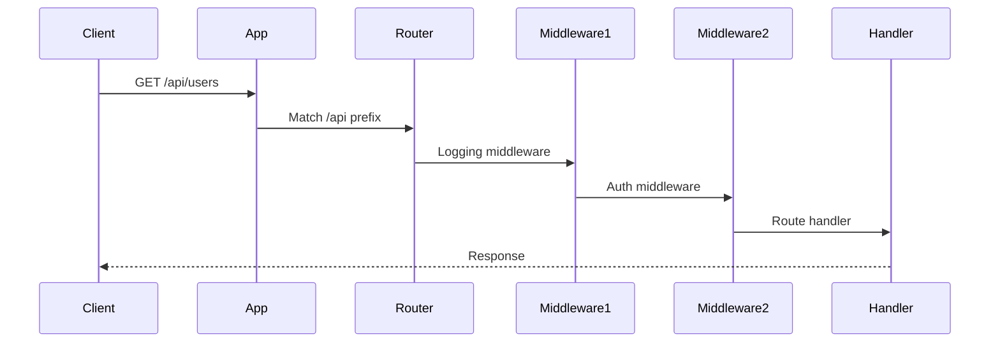
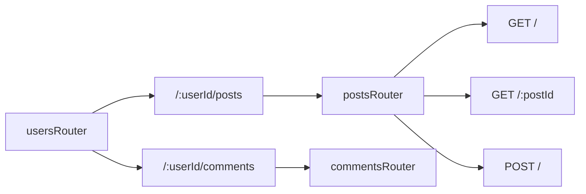

# How to Use Express Router Effectively

Author: [nawazdhandala](https://www.github.com/nawazdhandala)

Tags: Node.js, Express, Router, REST API, Backend

Description: Master Express Router for organized, maintainable APIs. This guide covers route modules, middleware, parameters, and best practices.

---

As Express applications grow, keeping all routes in a single file becomes unmanageable. Express Router provides a way to modularize your routes into separate files, apply middleware at different levels, and build clean, maintainable APIs. Whether you are building a small REST API or a large-scale microservice, understanding Express Router is essential for writing production-quality Node.js applications.

## Why Use Express Router?

Consider a monolithic Express application with all routes in one file:

```javascript
// app.js - Everything in one file (hard to maintain)
const express = require('express');
const app = express();

// User routes
app.get('/api/users', (req, res) => { /* ... */ });
app.get('/api/users/:id', (req, res) => { /* ... */ });
app.post('/api/users', (req, res) => { /* ... */ });
app.put('/api/users/:id', (req, res) => { /* ... */ });
app.delete('/api/users/:id', (req, res) => { /* ... */ });

// Product routes
app.get('/api/products', (req, res) => { /* ... */ });
app.get('/api/products/:id', (req, res) => { /* ... */ });
app.post('/api/products', (req, res) => { /* ... */ });
// ... many more routes

// Order routes
app.get('/api/orders', (req, res) => { /* ... */ });
// ... even more routes

app.listen(3000);
```

This approach has several problems:

| Issue | Impact |
|-------|--------|
| **Single file bloat** | Hard to navigate and maintain |
| **No separation of concerns** | Related routes are mixed together |
| **Testing difficulty** | Cannot test routes in isolation |
| **Team collaboration** | Merge conflicts when multiple developers work on routes |

Express Router solves these problems by allowing you to organize routes into modules.

## Router Basics

### Creating Your First Router

A Router is a mini Express application that handles only routing. Create a router with `express.Router()`:

```javascript
// routes/users.js
const express = require('express');
const router = express.Router();

// Define routes on the router
router.get('/', (req, res) => {
  res.json({ message: 'Get all users' });
});

router.get('/:id', (req, res) => {
  res.json({ message: `Get user ${req.params.id}` });
});

router.post('/', (req, res) => {
  res.json({ message: 'Create user' });
});

router.put('/:id', (req, res) => {
  res.json({ message: `Update user ${req.params.id}` });
});

router.delete('/:id', (req, res) => {
  res.json({ message: `Delete user ${req.params.id}` });
});

module.exports = router;
```

### Mounting Routers in the Main Application

Use `app.use()` to mount the router at a specific path:

```javascript
// app.js
const express = require('express');
const app = express();

// Import routers
const usersRouter = require('./routes/users');
const productsRouter = require('./routes/products');
const ordersRouter = require('./routes/orders');

// Parse JSON bodies
app.use(express.json());

// Mount routers at specific paths
app.use('/api/users', usersRouter);
app.use('/api/products', productsRouter);
app.use('/api/orders', ordersRouter);

app.listen(3000, () => {
  console.log('Server running on port 3000');
});
```

Now the routes are organized:
- `/api/users` routes are handled by `usersRouter`
- `/api/products` routes are handled by `productsRouter`
- `/api/orders` routes are handled by `ordersRouter`

## Modular Route Organization

### Project Structure

A well-organized Express project separates routes, controllers, middleware, and models. Here is how the routing hierarchy typically looks:

```mermaid
graph TD
    A[Express App] --> B[/api]
    B --> C[/auth]
    B --> D[/users]
    B --> E[/products]
    B --> F[/orders]
    D --> G[/:userId/posts]
    D --> H[/:userId/comments]
    F --> I[/:orderId/items]
```

The corresponding folder structure:

```
project/
  src/
    app.js              # Express app setup
    server.js           # Server startup
    routes/
      index.js          # Route aggregator
      users.js          # User routes
      products.js       # Product routes
      orders.js         # Order routes
      auth.js           # Authentication routes
    controllers/
      usersController.js
      productsController.js
      ordersController.js
      authController.js
    middleware/
      auth.js           # Authentication middleware
      validation.js     # Request validation
      errorHandler.js   # Error handling
    models/
      User.js
      Product.js
      Order.js
    services/
      userService.js
      productService.js
      orderService.js
```

### Route Aggregator Pattern

Create an index file that combines all routes:

```javascript
// routes/index.js
const express = require('express');
const router = express.Router();

const usersRouter = require('./users');
const productsRouter = require('./products');
const ordersRouter = require('./orders');
const authRouter = require('./auth');

// Mount all routes
router.use('/users', usersRouter);
router.use('/products', productsRouter);
router.use('/orders', ordersRouter);
router.use('/auth', authRouter);

module.exports = router;
```

```javascript
// app.js
const express = require('express');
const app = express();

const apiRoutes = require('./routes');

app.use(express.json());
app.use('/api', apiRoutes);

module.exports = app;
```

### Separating Routes from Controllers

Keep route definitions thin by moving logic to controllers:

```javascript
// controllers/usersController.js
const userService = require('../services/userService');

const usersController = {
  async getAll(req, res, next) {
    try {
      const { page = 1, limit = 10, sort = 'createdAt' } = req.query;
      const users = await userService.findAll({ page, limit, sort });
      res.json(users);
    } catch (error) {
      next(error);
    }
  },

  async getById(req, res, next) {
    try {
      const user = await userService.findById(req.params.id);
      if (!user) {
        return res.status(404).json({ error: 'User not found' });
      }
      res.json(user);
    } catch (error) {
      next(error);
    }
  },

  async create(req, res, next) {
    try {
      const user = await userService.create(req.body);
      res.status(201).json(user);
    } catch (error) {
      next(error);
    }
  },

  async update(req, res, next) {
    try {
      const user = await userService.update(req.params.id, req.body);
      if (!user) {
        return res.status(404).json({ error: 'User not found' });
      }
      res.json(user);
    } catch (error) {
      next(error);
    }
  },

  async delete(req, res, next) {
    try {
      const deleted = await userService.delete(req.params.id);
      if (!deleted) {
        return res.status(404).json({ error: 'User not found' });
      }
      res.status(204).send();
    } catch (error) {
      next(error);
    }
  },
};

module.exports = usersController;
```

```javascript
// routes/users.js
const express = require('express');
const router = express.Router();
const usersController = require('../controllers/usersController');
const { authenticate } = require('../middleware/auth');
const { validateUser } = require('../middleware/validation');

router.get('/', usersController.getAll);
router.get('/:id', usersController.getById);
router.post('/', authenticate, validateUser, usersController.create);
router.put('/:id', authenticate, validateUser, usersController.update);
router.delete('/:id', authenticate, usersController.delete);

module.exports = router;
```

## Router-Level Middleware

### Applying Middleware to All Routes in a Router

Use `router.use()` to apply middleware to all routes in a router:

```javascript
// routes/admin.js
const express = require('express');
const router = express.Router();
const { authenticate, requireAdmin } = require('../middleware/auth');

// Apply middleware to all routes in this router
router.use(authenticate);
router.use(requireAdmin);

// All routes below require authentication and admin role
router.get('/users', (req, res) => {
  res.json({ message: 'Admin user list' });
});

router.get('/stats', (req, res) => {
  res.json({ message: 'Admin statistics' });
});

router.post('/settings', (req, res) => {
  res.json({ message: 'Update settings' });
});

module.exports = router;
```

### Middleware Order Matters

Middleware executes in the order it is defined. Here is how a request flows through the middleware chain:



```javascript
const express = require('express');
const router = express.Router();

// This middleware runs first for all routes
router.use((req, res, next) => {
  console.log('Request received:', req.method, req.path);
  req.requestTime = Date.now();
  next();
});

// This middleware runs second
router.use((req, res, next) => {
  console.log('Processing request...');
  next();
});

// Route handlers run after all middleware
router.get('/', (req, res) => {
  const duration = Date.now() - req.requestTime;
  res.json({ message: 'Hello', processingTime: duration });
});

module.exports = router;
```

### Conditional Middleware

Apply middleware to specific routes:

```javascript
const express = require('express');
const router = express.Router();
const { authenticate, rateLimit } = require('../middleware');

// Public routes (no authentication)
router.get('/public', (req, res) => {
  res.json({ message: 'Public data' });
});

// Rate-limited route
router.get('/limited', rateLimit({ max: 10, windowMs: 60000 }), (req, res) => {
  res.json({ message: 'Rate limited data' });
});

// Protected routes (require authentication)
router.get('/protected', authenticate, (req, res) => {
  res.json({ message: 'Protected data', user: req.user });
});

// Multiple middleware
router.post(
  '/secure',
  authenticate,
  rateLimit({ max: 5, windowMs: 60000 }),
  (req, res) => {
    res.json({ message: 'Secure action performed' });
  }
);

module.exports = router;
```

## Route Parameters

### Basic Parameters

Access URL parameters with `req.params`:

```javascript
const express = require('express');
const router = express.Router();

// Single parameter
router.get('/users/:id', (req, res) => {
  const userId = req.params.id;
  res.json({ userId });
});

// Multiple parameters
router.get('/users/:userId/posts/:postId', (req, res) => {
  const { userId, postId } = req.params;
  res.json({ userId, postId });
});

// Optional parameters using regex
router.get('/files/:filename.:ext?', (req, res) => {
  const { filename, ext } = req.params;
  res.json({ filename, ext: ext || 'txt' });
});

module.exports = router;
```

### Parameter Validation with router.param()

Use `router.param()` to preprocess parameters:

```javascript
const express = require('express');
const router = express.Router();
const userService = require('../services/userService');

// Preprocess the 'id' parameter for all routes
router.param('id', async (req, res, next, id) => {
  // Validate format
  if (!/^[0-9a-fA-F]{24}$/.test(id)) {
    return res.status(400).json({ error: 'Invalid ID format' });
  }

  try {
    // Load the resource
    const user = await userService.findById(id);
    if (!user) {
      return res.status(404).json({ error: 'User not found' });
    }

    // Attach to request for use in route handlers
    req.user = user;
    next();
  } catch (error) {
    next(error);
  }
});

// Route handlers can now use req.user directly
router.get('/:id', (req, res) => {
  res.json(req.user);
});

router.put('/:id', (req, res) => {
  // Update the already-loaded user
  Object.assign(req.user, req.body);
  req.user.save();
  res.json(req.user);
});

router.delete('/:id', (req, res) => {
  req.user.remove();
  res.status(204).send();
});

module.exports = router;
```

### Parameter Constraints with Regular Expressions

Constrain parameters to specific patterns:

```javascript
const express = require('express');
const router = express.Router();

// Only match numeric IDs
router.get('/users/:id(\\d+)', (req, res) => {
  res.json({ numericId: req.params.id });
});

// Only match UUIDs
router.get('/items/:uuid([0-9a-f]{8}-[0-9a-f]{4}-[0-9a-f]{4}-[0-9a-f]{4}-[0-9a-f]{12})', (req, res) => {
  res.json({ uuid: req.params.uuid });
});

// Match specific values
router.get('/status/:status(active|inactive|pending)', (req, res) => {
  res.json({ status: req.params.status });
});

// Catch-all for unmatched patterns
router.get('/users/:id', (req, res) => {
  res.status(400).json({ error: 'ID must be numeric' });
});

module.exports = router;
```

## Nested Routers

### Creating Nested Route Hierarchies

Mount routers within routers for complex APIs. This pattern is useful when resources have natural parent-child relationships:



```javascript
// routes/users.js
const express = require('express');
const router = express.Router();
const postsRouter = require('./userPosts');
const commentsRouter = require('./userComments');

// User CRUD routes
router.get('/', (req, res) => {
  res.json({ message: 'Get all users' });
});

router.get('/:userId', (req, res) => {
  res.json({ message: `Get user ${req.params.userId}` });
});

// Mount nested routers
// /api/users/:userId/posts
router.use('/:userId/posts', postsRouter);

// /api/users/:userId/comments
router.use('/:userId/comments', commentsRouter);

module.exports = router;
```

```javascript
// routes/userPosts.js
const express = require('express');
// mergeParams: true allows access to parent router params
const router = express.Router({ mergeParams: true });

router.get('/', (req, res) => {
  // Access userId from parent router
  const { userId } = req.params;
  res.json({ message: `Get all posts for user ${userId}` });
});

router.get('/:postId', (req, res) => {
  const { userId, postId } = req.params;
  res.json({ message: `Get post ${postId} for user ${userId}` });
});

router.post('/', (req, res) => {
  const { userId } = req.params;
  res.json({ message: `Create post for user ${userId}` });
});

module.exports = router;
```

### Building RESTful Nested Resources

```javascript
// routes/api.js
const express = require('express');
const router = express.Router();

// Organizations
const orgRouter = express.Router();
router.use('/organizations', orgRouter);

orgRouter.get('/', listOrganizations);
orgRouter.post('/', createOrganization);
orgRouter.get('/:orgId', getOrganization);
orgRouter.put('/:orgId', updateOrganization);
orgRouter.delete('/:orgId', deleteOrganization);

// Teams within organizations
const teamRouter = express.Router({ mergeParams: true });
orgRouter.use('/:orgId/teams', teamRouter);

teamRouter.get('/', listTeams);
teamRouter.post('/', createTeam);
teamRouter.get('/:teamId', getTeam);
teamRouter.put('/:teamId', updateTeam);
teamRouter.delete('/:teamId', deleteTeam);

// Members within teams
const memberRouter = express.Router({ mergeParams: true });
teamRouter.use('/:teamId/members', memberRouter);

memberRouter.get('/', listMembers);
memberRouter.post('/', addMember);
memberRouter.delete('/:memberId', removeMember);

module.exports = router;

// Example URLs:
// GET  /api/organizations
// POST /api/organizations
// GET  /api/organizations/123/teams
// POST /api/organizations/123/teams
// GET  /api/organizations/123/teams/456/members
// POST /api/organizations/123/teams/456/members
```

## Error Handling

### Error Handling Middleware

Express error handlers have four parameters:

```javascript
// middleware/errorHandler.js
function errorHandler(err, req, res, next) {
  // Log the error
  console.error('Error:', {
    message: err.message,
    stack: err.stack,
    path: req.path,
    method: req.method,
  });

  // Determine status code
  const statusCode = err.statusCode || err.status || 500;

  // Send error response
  res.status(statusCode).json({
    error: {
      message: err.message,
      code: err.code,
      ...(process.env.NODE_ENV === 'development' && { stack: err.stack }),
    },
  });
}

module.exports = errorHandler;
```

### Custom Error Classes

Create custom errors for different scenarios:

```javascript
// errors/AppError.js
class AppError extends Error {
  constructor(message, statusCode, code) {
    super(message);
    this.statusCode = statusCode;
    this.code = code;
    this.isOperational = true;

    Error.captureStackTrace(this, this.constructor);
  }
}

class NotFoundError extends AppError {
  constructor(resource = 'Resource') {
    super(`${resource} not found`, 404, 'NOT_FOUND');
  }
}

class ValidationError extends AppError {
  constructor(message, errors = []) {
    super(message, 400, 'VALIDATION_ERROR');
    this.errors = errors;
  }
}

class UnauthorizedError extends AppError {
  constructor(message = 'Unauthorized') {
    super(message, 401, 'UNAUTHORIZED');
  }
}

class ForbiddenError extends AppError {
  constructor(message = 'Forbidden') {
    super(message, 403, 'FORBIDDEN');
  }
}

class ConflictError extends AppError {
  constructor(message = 'Resource already exists') {
    super(message, 409, 'CONFLICT');
  }
}

module.exports = {
  AppError,
  NotFoundError,
  ValidationError,
  UnauthorizedError,
  ForbiddenError,
  ConflictError,
};
```

### Using Custom Errors in Routes

```javascript
// routes/users.js
const express = require('express');
const router = express.Router();
const { NotFoundError, ValidationError, ConflictError } = require('../errors/AppError');
const userService = require('../services/userService');

router.get('/:id', async (req, res, next) => {
  try {
    const user = await userService.findById(req.params.id);
    if (!user) {
      throw new NotFoundError('User');
    }
    res.json(user);
  } catch (error) {
    next(error);
  }
});

router.post('/', async (req, res, next) => {
  try {
    const { email, name } = req.body;

    // Validation
    const errors = [];
    if (!email) errors.push({ field: 'email', message: 'Email is required' });
    if (!name) errors.push({ field: 'name', message: 'Name is required' });

    if (errors.length > 0) {
      throw new ValidationError('Invalid input', errors);
    }

    // Check for duplicates
    const existing = await userService.findByEmail(email);
    if (existing) {
      throw new ConflictError('User with this email already exists');
    }

    const user = await userService.create({ email, name });
    res.status(201).json(user);
  } catch (error) {
    next(error);
  }
});

module.exports = router;
```

### Async Error Wrapper

Wrap async route handlers to catch errors automatically:

```javascript
// utils/asyncWrapper.js
function asyncWrapper(fn) {
  return (req, res, next) => {
    Promise.resolve(fn(req, res, next)).catch(next);
  };
}

module.exports = asyncWrapper;
```

```javascript
// routes/users.js
const express = require('express');
const router = express.Router();
const asyncWrapper = require('../utils/asyncWrapper');
const { NotFoundError } = require('../errors/AppError');
const userService = require('../services/userService');

// No try-catch needed
router.get('/:id', asyncWrapper(async (req, res) => {
  const user = await userService.findById(req.params.id);
  if (!user) {
    throw new NotFoundError('User');
  }
  res.json(user);
}));

router.post('/', asyncWrapper(async (req, res) => {
  const user = await userService.create(req.body);
  res.status(201).json(user);
}));

router.put('/:id', asyncWrapper(async (req, res) => {
  const user = await userService.update(req.params.id, req.body);
  if (!user) {
    throw new NotFoundError('User');
  }
  res.json(user);
}));

module.exports = router;
```

### 404 Handler

Handle unmatched routes:

```javascript
// app.js
const express = require('express');
const app = express();
const apiRoutes = require('./routes');
const errorHandler = require('./middleware/errorHandler');

app.use(express.json());
app.use('/api', apiRoutes);

// 404 handler for unmatched routes
app.use((req, res, next) => {
  res.status(404).json({
    error: {
      message: `Cannot ${req.method} ${req.path}`,
      code: 'NOT_FOUND',
    },
  });
});

// Error handler must be last
app.use(errorHandler);

module.exports = app;
```

## Request Validation

### Using express-validator

```javascript
// middleware/validators/userValidator.js
const { body, param, query, validationResult } = require('express-validator');

const validateUser = [
  body('email')
    .isEmail()
    .withMessage('Must be a valid email')
    .normalizeEmail(),
  body('name')
    .trim()
    .isLength({ min: 2, max: 100 })
    .withMessage('Name must be between 2 and 100 characters'),
  body('password')
    .isLength({ min: 8 })
    .withMessage('Password must be at least 8 characters')
    .matches(/\d/)
    .withMessage('Password must contain a number'),
  body('role')
    .optional()
    .isIn(['user', 'admin', 'moderator'])
    .withMessage('Invalid role'),
];

const validateUserId = [
  param('id')
    .isMongoId()
    .withMessage('Invalid user ID format'),
];

const validateUserQuery = [
  query('page')
    .optional()
    .isInt({ min: 1 })
    .withMessage('Page must be a positive integer'),
  query('limit')
    .optional()
    .isInt({ min: 1, max: 100 })
    .withMessage('Limit must be between 1 and 100'),
  query('sort')
    .optional()
    .isIn(['name', 'email', 'createdAt', '-name', '-email', '-createdAt'])
    .withMessage('Invalid sort field'),
];

// Middleware to check validation results
const checkValidation = (req, res, next) => {
  const errors = validationResult(req);
  if (!errors.isEmpty()) {
    return res.status(400).json({
      error: {
        message: 'Validation failed',
        code: 'VALIDATION_ERROR',
        details: errors.array(),
      },
    });
  }
  next();
};

module.exports = {
  validateUser,
  validateUserId,
  validateUserQuery,
  checkValidation,
};
```

```javascript
// routes/users.js
const express = require('express');
const router = express.Router();
const usersController = require('../controllers/usersController');
const {
  validateUser,
  validateUserId,
  validateUserQuery,
  checkValidation,
} = require('../middleware/validators/userValidator');

router.get('/', validateUserQuery, checkValidation, usersController.getAll);
router.get('/:id', validateUserId, checkValidation, usersController.getById);
router.post('/', validateUser, checkValidation, usersController.create);
router.put('/:id', validateUserId, validateUser, checkValidation, usersController.update);
router.delete('/:id', validateUserId, checkValidation, usersController.delete);

module.exports = router;
```

### Custom Validation Middleware

```javascript
// middleware/validators/customValidators.js
const { body } = require('express-validator');
const userService = require('../../services/userService');

// Check if email is unique
const uniqueEmail = body('email').custom(async (email, { req }) => {
  const existingUser = await userService.findByEmail(email);
  if (existingUser && existingUser.id !== req.params.id) {
    throw new Error('Email already in use');
  }
  return true;
});

// Validate password confirmation
const passwordConfirmation = body('confirmPassword').custom((value, { req }) => {
  if (value !== req.body.password) {
    throw new Error('Password confirmation does not match');
  }
  return true;
});

// Validate date range
const dateRange = [
  body('startDate')
    .isISO8601()
    .withMessage('Start date must be a valid ISO 8601 date'),
  body('endDate')
    .isISO8601()
    .withMessage('End date must be a valid ISO 8601 date')
    .custom((endDate, { req }) => {
      if (new Date(endDate) <= new Date(req.body.startDate)) {
        throw new Error('End date must be after start date');
      }
      return true;
    }),
];

module.exports = {
  uniqueEmail,
  passwordConfirmation,
  dateRange,
};
```

## Route Chaining

### Using router.route()

Chain multiple handlers for the same path:

```javascript
const express = require('express');
const router = express.Router();
const usersController = require('../controllers/usersController');
const { authenticate } = require('../middleware/auth');
const { validateUser, validateUserId, checkValidation } = require('../middleware/validators');

// Chain handlers for /users
router.route('/')
  .get(usersController.getAll)
  .post(authenticate, validateUser, checkValidation, usersController.create);

// Chain handlers for /users/:id
router.route('/:id')
  .all(validateUserId, checkValidation)  // Apply to all methods
  .get(usersController.getById)
  .put(authenticate, validateUser, checkValidation, usersController.update)
  .patch(authenticate, usersController.partialUpdate)
  .delete(authenticate, usersController.delete);

module.exports = router;
```

### Common Middleware with .all()

Apply middleware to all HTTP methods for a path:

```javascript
const express = require('express');
const router = express.Router();

// Log all requests to this path
router.route('/resource/:id')
  .all((req, res, next) => {
    console.log(`${req.method} /resource/${req.params.id}`);
    next();
  })
  .all(authenticate)  // Require auth for all methods
  .get(getResource)
  .put(updateResource)
  .delete(deleteResource);

module.exports = router;
```

## API Versioning

### URL-Based Versioning

```javascript
// routes/v1/users.js
const express = require('express');
const router = express.Router();

router.get('/', (req, res) => {
  res.json({
    version: 'v1',
    data: [{ id: 1, name: 'User 1' }],
  });
});

module.exports = router;
```

```javascript
// routes/v2/users.js
const express = require('express');
const router = express.Router();

router.get('/', (req, res) => {
  res.json({
    version: 'v2',
    data: [{ id: 1, name: 'User 1', email: 'user1@example.com' }],
    pagination: { page: 1, total: 1 },
  });
});

module.exports = router;
```

```javascript
// routes/index.js
const express = require('express');
const router = express.Router();

// Version 1 routes
const v1Users = require('./v1/users');
router.use('/v1/users', v1Users);

// Version 2 routes
const v2Users = require('./v2/users');
router.use('/v2/users', v2Users);

// Default to latest version
router.use('/users', v2Users);

module.exports = router;
```

### Header-Based Versioning

```javascript
// middleware/apiVersion.js
function apiVersion(versions) {
  return (req, res, next) => {
    // Get version from header or query parameter
    const requestedVersion = req.headers['api-version'] ||
                            req.query.version ||
                            'latest';

    // Find matching version
    const version = requestedVersion === 'latest'
      ? Object.keys(versions).sort().pop()
      : requestedVersion;

    if (!versions[version]) {
      return res.status(400).json({
        error: {
          message: `API version ${requestedVersion} not supported`,
          supportedVersions: Object.keys(versions),
        },
      });
    }

    // Attach version handler to request
    req.apiVersion = version;
    req.versionHandler = versions[version];
    next();
  };
}

module.exports = apiVersion;
```

```javascript
// routes/users.js
const express = require('express');
const router = express.Router();
const apiVersion = require('../middleware/apiVersion');

const versions = {
  '1.0': require('./v1/usersHandler'),
  '2.0': require('./v2/usersHandler'),
};

router.get('/', apiVersion(versions), (req, res) => {
  req.versionHandler.getAll(req, res);
});

router.get('/:id', apiVersion(versions), (req, res) => {
  req.versionHandler.getById(req, res);
});

module.exports = router;
```

## Complete Example Application

Here is a complete Express Router application with all patterns combined:

```javascript
// app.js
const express = require('express');
const helmet = require('helmet');
const cors = require('cors');
const morgan = require('morgan');

const apiRoutes = require('./routes');
const errorHandler = require('./middleware/errorHandler');
const { NotFoundError } = require('./errors/AppError');

const app = express();

// Security middleware
app.use(helmet());
app.use(cors());

// Request parsing
app.use(express.json({ limit: '10mb' }));
app.use(express.urlencoded({ extended: true }));

// Logging
app.use(morgan('combined'));

// Health check
app.get('/health', (req, res) => {
  res.json({ status: 'ok', timestamp: new Date().toISOString() });
});

// API routes
app.use('/api', apiRoutes);

// 404 handler
app.use((req, res, next) => {
  next(new NotFoundError(`Route ${req.method} ${req.path}`));
});

// Error handler
app.use(errorHandler);

module.exports = app;
```

```javascript
// routes/index.js
const express = require('express');
const router = express.Router();

const authRouter = require('./auth');
const usersRouter = require('./users');
const productsRouter = require('./products');
const ordersRouter = require('./orders');

// Public routes
router.use('/auth', authRouter);

// Protected routes
router.use('/users', usersRouter);
router.use('/products', productsRouter);
router.use('/orders', ordersRouter);

module.exports = router;
```

```javascript
// routes/auth.js
const express = require('express');
const router = express.Router();
const asyncWrapper = require('../utils/asyncWrapper');
const authController = require('../controllers/authController');
const { validateLogin, validateRegister, checkValidation } = require('../middleware/validators');

router.post('/register', validateRegister, checkValidation, asyncWrapper(authController.register));
router.post('/login', validateLogin, checkValidation, asyncWrapper(authController.login));
router.post('/refresh', asyncWrapper(authController.refreshToken));
router.post('/logout', asyncWrapper(authController.logout));

module.exports = router;
```

```javascript
// routes/users.js
const express = require('express');
const router = express.Router();
const asyncWrapper = require('../utils/asyncWrapper');
const usersController = require('../controllers/usersController');
const { authenticate, requireRole } = require('../middleware/auth');
const {
  validateUser,
  validateUserId,
  validateUserQuery,
  checkValidation,
} = require('../middleware/validators');

// All routes require authentication
router.use(authenticate);

// User routes
router.route('/')
  .get(validateUserQuery, checkValidation, asyncWrapper(usersController.getAll))
  .post(requireRole('admin'), validateUser, checkValidation, asyncWrapper(usersController.create));

router.route('/:id')
  .all(validateUserId, checkValidation)
  .get(asyncWrapper(usersController.getById))
  .put(validateUser, checkValidation, asyncWrapper(usersController.update))
  .delete(requireRole('admin'), asyncWrapper(usersController.delete));

// Nested routes for user's resources
const userOrdersRouter = require('./userOrders');
router.use('/:userId/orders', userOrdersRouter);

module.exports = router;
```

```javascript
// routes/userOrders.js
const express = require('express');
const router = express.Router({ mergeParams: true });
const asyncWrapper = require('../utils/asyncWrapper');
const ordersController = require('../controllers/ordersController');

router.get('/', asyncWrapper(async (req, res) => {
  const { userId } = req.params;
  const orders = await ordersController.getByUser(userId, req.query);
  res.json(orders);
}));

router.get('/:orderId', asyncWrapper(async (req, res) => {
  const { userId, orderId } = req.params;
  const order = await ordersController.getOneByUser(userId, orderId);
  res.json(order);
}));

module.exports = router;
```

```javascript
// middleware/auth.js
const jwt = require('jsonwebtoken');
const { UnauthorizedError, ForbiddenError } = require('../errors/AppError');

function authenticate(req, res, next) {
  const authHeader = req.headers.authorization;

  if (!authHeader || !authHeader.startsWith('Bearer ')) {
    throw new UnauthorizedError('No token provided');
  }

  const token = authHeader.substring(7);

  try {
    const decoded = jwt.verify(token, process.env.JWT_SECRET);
    req.user = decoded;
    next();
  } catch (error) {
    throw new UnauthorizedError('Invalid token');
  }
}

function requireRole(...roles) {
  return (req, res, next) => {
    if (!req.user) {
      throw new UnauthorizedError('Not authenticated');
    }

    if (!roles.includes(req.user.role)) {
      throw new ForbiddenError('Insufficient permissions');
    }

    next();
  };
}

module.exports = { authenticate, requireRole };
```

```javascript
// middleware/errorHandler.js
const { AppError } = require('../errors/AppError');

function errorHandler(err, req, res, next) {
  // Log error
  console.error('Error:', {
    message: err.message,
    stack: err.stack,
    path: req.path,
    method: req.method,
    body: req.body,
    user: req.user?.id,
  });

  // Handle known operational errors
  if (err instanceof AppError) {
    return res.status(err.statusCode).json({
      error: {
        message: err.message,
        code: err.code,
        ...(err.errors && { details: err.errors }),
      },
    });
  }

  // Handle Mongoose validation errors
  if (err.name === 'ValidationError') {
    return res.status(400).json({
      error: {
        message: 'Validation failed',
        code: 'VALIDATION_ERROR',
        details: Object.values(err.errors).map(e => ({
          field: e.path,
          message: e.message,
        })),
      },
    });
  }

  // Handle JWT errors
  if (err.name === 'JsonWebTokenError') {
    return res.status(401).json({
      error: {
        message: 'Invalid token',
        code: 'INVALID_TOKEN',
      },
    });
  }

  // Handle unknown errors
  res.status(500).json({
    error: {
      message: process.env.NODE_ENV === 'production'
        ? 'Internal server error'
        : err.message,
      code: 'INTERNAL_ERROR',
      ...(process.env.NODE_ENV !== 'production' && { stack: err.stack }),
    },
  });
}

module.exports = errorHandler;
```

```javascript
// utils/asyncWrapper.js
function asyncWrapper(fn) {
  return (req, res, next) => {
    Promise.resolve(fn(req, res, next)).catch(next);
  };
}

module.exports = asyncWrapper;
```

```javascript
// server.js
const app = require('./app');

const PORT = process.env.PORT || 3000;

app.listen(PORT, () => {
  console.log(`Server running on port ${PORT}`);
  console.log(`Environment: ${process.env.NODE_ENV || 'development'}`);
});
```

## Testing Router Modules

### Unit Testing Routes

```javascript
// tests/routes/users.test.js
const request = require('supertest');
const express = require('express');
const usersRouter = require('../../routes/users');
const { authenticate } = require('../../middleware/auth');

// Mock authentication middleware
jest.mock('../../middleware/auth', () => ({
  authenticate: jest.fn((req, res, next) => {
    req.user = { id: '123', role: 'admin' };
    next();
  }),
  requireRole: jest.fn(() => (req, res, next) => next()),
}));

// Mock user service
jest.mock('../../services/userService', () => ({
  findAll: jest.fn(),
  findById: jest.fn(),
  create: jest.fn(),
  update: jest.fn(),
  delete: jest.fn(),
}));

const userService = require('../../services/userService');

describe('Users Router', () => {
  let app;

  beforeEach(() => {
    app = express();
    app.use(express.json());
    app.use('/users', usersRouter);

    // Reset mocks
    jest.clearAllMocks();
  });

  describe('GET /users', () => {
    it('should return a list of users', async () => {
      const mockUsers = [
        { id: '1', name: 'User 1' },
        { id: '2', name: 'User 2' },
      ];
      userService.findAll.mockResolvedValue(mockUsers);

      const response = await request(app)
        .get('/users')
        .expect(200);

      expect(response.body).toEqual(mockUsers);
      expect(userService.findAll).toHaveBeenCalled();
    });
  });

  describe('GET /users/:id', () => {
    it('should return a user by ID', async () => {
      const mockUser = { id: '1', name: 'User 1' };
      userService.findById.mockResolvedValue(mockUser);

      const response = await request(app)
        .get('/users/1')
        .expect(200);

      expect(response.body).toEqual(mockUser);
      expect(userService.findById).toHaveBeenCalledWith('1');
    });

    it('should return 404 if user not found', async () => {
      userService.findById.mockResolvedValue(null);

      await request(app)
        .get('/users/999')
        .expect(404);
    });
  });

  describe('POST /users', () => {
    it('should create a new user', async () => {
      const newUser = { name: 'New User', email: 'new@example.com' };
      const createdUser = { id: '3', ...newUser };
      userService.create.mockResolvedValue(createdUser);

      const response = await request(app)
        .post('/users')
        .send(newUser)
        .expect(201);

      expect(response.body).toEqual(createdUser);
      expect(userService.create).toHaveBeenCalledWith(newUser);
    });

    it('should return 400 for invalid input', async () => {
      await request(app)
        .post('/users')
        .send({ name: '' })
        .expect(400);
    });
  });
});
```

### Integration Testing

```javascript
// tests/integration/users.test.js
const request = require('supertest');
const app = require('../../app');
const { connectDB, closeDB, clearDB } = require('../testUtils/db');
const User = require('../../models/User');
const jwt = require('jsonwebtoken');

describe('Users API Integration', () => {
  let authToken;
  let testUser;

  beforeAll(async () => {
    await connectDB();
  });

  afterAll(async () => {
    await closeDB();
  });

  beforeEach(async () => {
    await clearDB();

    // Create test user
    testUser = await User.create({
      name: 'Test User',
      email: 'test@example.com',
      password: 'hashedpassword',
      role: 'admin',
    });

    // Generate auth token
    authToken = jwt.sign(
      { id: testUser.id, role: testUser.role },
      process.env.JWT_SECRET,
      { expiresIn: '1h' }
    );
  });

  describe('GET /api/users', () => {
    it('should return paginated users', async () => {
      // Create additional users
      await User.create([
        { name: 'User 2', email: 'user2@example.com', password: 'pass' },
        { name: 'User 3', email: 'user3@example.com', password: 'pass' },
      ]);

      const response = await request(app)
        .get('/api/users')
        .set('Authorization', `Bearer ${authToken}`)
        .query({ page: 1, limit: 2 })
        .expect(200);

      expect(response.body.data).toHaveLength(2);
      expect(response.body.pagination).toBeDefined();
    });

    it('should return 401 without authentication', async () => {
      await request(app)
        .get('/api/users')
        .expect(401);
    });
  });
});
```

## Summary

| Concept | Purpose |
|---------|---------|
| **Router Basics** | Modularize routes into separate files |
| **Mounting** | Attach routers at specific URL paths |
| **Router Middleware** | Apply middleware to all routes in a router |
| **Route Parameters** | Extract dynamic values from URLs |
| **router.param()** | Preprocess parameters before handlers |
| **Nested Routers** | Build hierarchical API structures |
| **mergeParams** | Access parent router parameters |
| **Error Handling** | Centralized error processing |
| **Validation** | Validate request data before processing |
| **Route Chaining** | Clean syntax for multiple HTTP methods |
| **API Versioning** | Support multiple API versions |

Express Router is the foundation of well-organized Express applications. By separating routes into modules, applying middleware strategically, and handling errors consistently, you can build maintainable APIs that scale with your team and requirements.

## Monitor Your Express APIs with OneUptime

Building well-structured Express APIs is just the beginning. To ensure your routes perform reliably in production, you need comprehensive monitoring and observability.

[OneUptime](https://oneuptime.com) provides complete observability for your Express applications:

- **API Monitoring**: Track response times, error rates, and throughput for every route
- **Distributed Tracing**: Follow requests as they flow through middleware and route handlers
- **Error Tracking**: Get instant alerts when routes fail or throw exceptions
- **Log Management**: Centralize logs from all your Express services
- **Status Pages**: Keep users informed about API availability
- **Alerting**: Set up alerts for slow endpoints or elevated error rates

Start monitoring your Express Router applications today with OneUptime's open-source observability platform.
