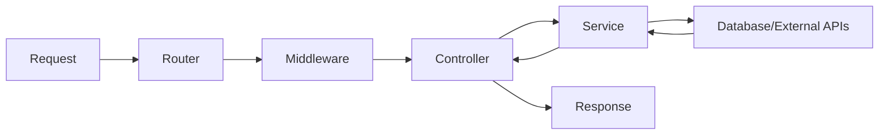
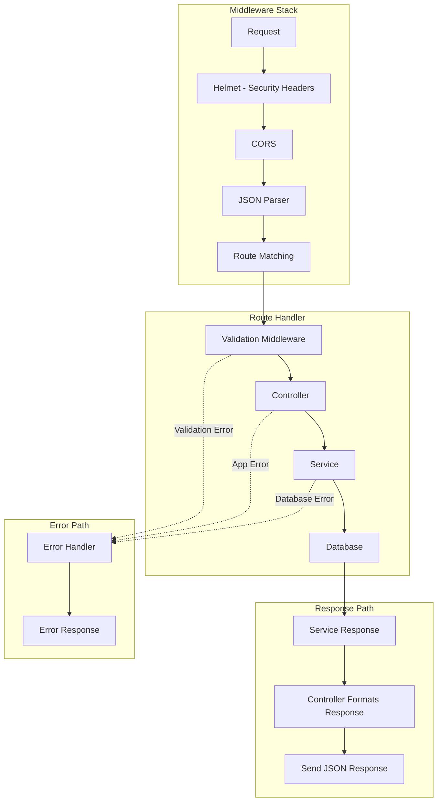

# How to Build REST APIs with Express and TypeScript

Author: [nawazdhandala](https://www.github.com/nawazdhandala)

Tags: TypeScript, Express, REST API, Node.js, Backend Development, Zod, Validation

Description: A practical guide to building type-safe REST APIs with Express and TypeScript, covering project structure, validation with Zod, controllers, services, and error handling.

---

Building REST APIs with plain JavaScript works fine until your codebase grows. Then you start chasing runtime errors that TypeScript would have caught at compile time. This guide walks through setting up a production-ready Express API with TypeScript, focusing on patterns that actually scale.

## Project Structure

Before writing code, settle on a structure that separates concerns. Here's a layout that has worked well for medium to large APIs:

```
src/
  controllers/     # Handle HTTP requests and responses
  services/        # Business logic lives here
  middleware/      # Express middleware (auth, validation, errors)
  routes/          # Route definitions
  models/          # TypeScript interfaces and types
  schemas/         # Zod validation schemas
  utils/           # Helper functions
  config/          # Environment and app configuration
  app.ts           # Express app setup
  server.ts        # Entry point
```

The flow looks like this:



Controllers handle the HTTP layer. Services contain business logic. This separation means you can test business logic without spinning up an HTTP server, and swap out the HTTP framework if needed.

## TypeScript Setup

Start with a minimal TypeScript configuration that enforces strict type checking.

Initialize the project and install dependencies:

```bash
npm init -y
npm install express dotenv
npm install -D typescript @types/node @types/express ts-node nodemon
```

Create a `tsconfig.json` with strict mode enabled:

```json
{
  "compilerOptions": {
    "target": "ES2022",
    "module": "commonjs",
    "lib": ["ES2022"],
    "outDir": "./dist",
    "rootDir": "./src",
    "strict": true,
    "esModuleInterop": true,
    "skipLibCheck": true,
    "forceConsistentCasingInFileNames": true,
    "resolveJsonModule": true,
    "declaration": true,
    "declarationMap": true,
    "sourceMap": true
  },
  "include": ["src/**/*"],
  "exclude": ["node_modules", "dist"]
}
```

Add scripts to `package.json` for development and production builds:

```json
{
  "scripts": {
    "dev": "nodemon --exec ts-node src/server.ts",
    "build": "tsc",
    "start": "node dist/server.js"
  }
}
```

## Typed Request and Response

Express types are generic, which means you can specify the shape of request bodies, query parameters, and route parameters. This catches mismatches at compile time instead of production.

Define interfaces for your API contracts:

```typescript
// src/models/user.ts

export interface User {
  id: string;
  email: string;
  name: string;
  createdAt: Date;
  updatedAt: Date;
}

export interface CreateUserRequest {
  email: string;
  name: string;
  password: string;
}

export interface UpdateUserRequest {
  email?: string;
  name?: string;
}

export interface UserResponse {
  id: string;
  email: string;
  name: string;
  createdAt: string;
}
```

Create a typed request handler helper that enforces these interfaces:

```typescript
// src/utils/typedHandler.ts

import { Request, Response, NextFunction } from 'express';

// Generic type for route handlers with typed body, params, and query
export type TypedRequest<
  TBody = unknown,
  TParams = Record<string, string>,
  TQuery = Record<string, string>
> = Request<TParams, unknown, TBody, TQuery>;

// Handler function type that includes proper typing
export type TypedHandler<
  TBody = unknown,
  TParams = Record<string, string>,
  TQuery = Record<string, string>,
  TResponse = unknown
> = (
  req: TypedRequest<TBody, TParams, TQuery>,
  res: Response<TResponse>,
  next: NextFunction
) => Promise<void> | void;
```

Now your controllers get full type checking:

```typescript
// src/controllers/userController.ts

import { Response, NextFunction } from 'express';
import { TypedRequest, TypedHandler } from '../utils/typedHandler';
import { CreateUserRequest, UserResponse } from '../models/user';
import { userService } from '../services/userService';

interface IdParams {
  id: string;
}

// TypeScript will flag if you try to access req.body.invalidField
export const createUser: TypedHandler<CreateUserRequest, {}, {}, UserResponse> = async (
  req,
  res,
  next
) => {
  try {
    const { email, name, password } = req.body;
    const user = await userService.create({ email, name, password });

    res.status(201).json({
      id: user.id,
      email: user.email,
      name: user.name,
      createdAt: user.createdAt.toISOString(),
    });
  } catch (error) {
    next(error);
  }
};

export const getUser: TypedHandler<{}, IdParams, {}, UserResponse> = async (
  req,
  res,
  next
) => {
  try {
    const user = await userService.findById(req.params.id);

    if (!user) {
      res.status(404).json({ error: 'User not found' } as any);
      return;
    }

    res.json({
      id: user.id,
      email: user.email,
      name: user.name,
      createdAt: user.createdAt.toISOString(),
    });
  } catch (error) {
    next(error);
  }
};
```

## Validation with Zod

TypeScript types disappear at runtime. Someone can still send malformed JSON to your API and cause crashes. Zod bridges this gap by validating incoming data and inferring TypeScript types from schemas.

Install Zod:

```bash
npm install zod
```

Define schemas that double as runtime validators and type definitions:

```typescript
// src/schemas/userSchemas.ts

import { z } from 'zod';

// Schema for creating a user - validates at runtime
export const createUserSchema = z.object({
  email: z
    .string()
    .email('Invalid email format')
    .max(255, 'Email must be 255 characters or less'),
  name: z
    .string()
    .min(1, 'Name is required')
    .max(100, 'Name must be 100 characters or less'),
  password: z
    .string()
    .min(8, 'Password must be at least 8 characters')
    .regex(/[A-Z]/, 'Password must contain at least one uppercase letter')
    .regex(/[0-9]/, 'Password must contain at least one number'),
});

// Schema for updating a user - all fields optional
export const updateUserSchema = z.object({
  email: z
    .string()
    .email('Invalid email format')
    .max(255)
    .optional(),
  name: z
    .string()
    .min(1)
    .max(100)
    .optional(),
});

// Schema for query parameters
export const listUsersQuerySchema = z.object({
  page: z.coerce.number().int().positive().default(1),
  limit: z.coerce.number().int().min(1).max(100).default(20),
  search: z.string().optional(),
});

// Infer TypeScript types from schemas
export type CreateUserInput = z.infer<typeof createUserSchema>;
export type UpdateUserInput = z.infer<typeof updateUserSchema>;
export type ListUsersQuery = z.infer<typeof listUsersQuerySchema>;
```

Create a validation middleware that works with any Zod schema:

```typescript
// src/middleware/validate.ts

import { Request, Response, NextFunction } from 'express';
import { AnyZodObject, ZodError } from 'zod';

interface ValidationSchemas {
  body?: AnyZodObject;
  query?: AnyZodObject;
  params?: AnyZodObject;
}

// Middleware factory that validates request parts against Zod schemas
export function validate(schemas: ValidationSchemas) {
  return async (req: Request, res: Response, next: NextFunction) => {
    try {
      // Validate each part of the request if a schema is provided
      if (schemas.body) {
        req.body = await schemas.body.parseAsync(req.body);
      }
      if (schemas.query) {
        req.query = await schemas.query.parseAsync(req.query);
      }
      if (schemas.params) {
        req.params = await schemas.params.parseAsync(req.params);
      }

      next();
    } catch (error) {
      if (error instanceof ZodError) {
        // Format Zod errors into a consistent response shape
        const errors = error.errors.map((err) => ({
          field: err.path.join('.'),
          message: err.message,
        }));

        res.status(400).json({
          error: 'Validation failed',
          details: errors,
        });
        return;
      }

      next(error);
    }
  };
}
```

Wire it up in your routes:

```typescript
// src/routes/userRoutes.ts

import { Router } from 'express';
import { validate } from '../middleware/validate';
import { createUserSchema, updateUserSchema, listUsersQuerySchema } from '../schemas/userSchemas';
import * as userController from '../controllers/userController';

const router = Router();

// Validation runs before the controller, so req.body is guaranteed to match the schema
router.post(
  '/',
  validate({ body: createUserSchema }),
  userController.createUser
);

router.get(
  '/',
  validate({ query: listUsersQuerySchema }),
  userController.listUsers
);

router.get('/:id', userController.getUser);

router.patch(
  '/:id',
  validate({ body: updateUserSchema }),
  userController.updateUser
);

router.delete('/:id', userController.deleteUser);

export default router;
```

## Service Layer

Services contain business logic and interact with databases or external APIs. Keeping this separate from controllers makes the code testable and reusable.

```typescript
// src/services/userService.ts

import { CreateUserInput, UpdateUserInput } from '../schemas/userSchemas';
import { User } from '../models/user';
import { AppError } from '../utils/errors';
import { hashPassword } from '../utils/crypto';

// In a real app, this would be a database client
const users: Map<string, User> = new Map();

class UserService {
  async create(input: CreateUserInput): Promise<User> {
    // Check for duplicate email
    const existing = Array.from(users.values()).find(
      (u) => u.email === input.email
    );

    if (existing) {
      throw new AppError('Email already registered', 409);
    }

    const hashedPassword = await hashPassword(input.password);

    const user: User = {
      id: crypto.randomUUID(),
      email: input.email,
      name: input.name,
      createdAt: new Date(),
      updatedAt: new Date(),
    };

    // Store user (in reality, save to database)
    users.set(user.id, user);

    return user;
  }

  async findById(id: string): Promise<User | null> {
    return users.get(id) || null;
  }

  async findAll(options: { page: number; limit: number; search?: string }) {
    let results = Array.from(users.values());

    // Filter by search term if provided
    if (options.search) {
      const searchLower = options.search.toLowerCase();
      results = results.filter(
        (u) =>
          u.name.toLowerCase().includes(searchLower) ||
          u.email.toLowerCase().includes(searchLower)
      );
    }

    // Calculate pagination
    const total = results.length;
    const start = (options.page - 1) * options.limit;
    const items = results.slice(start, start + options.limit);

    return {
      items,
      total,
      page: options.page,
      limit: options.limit,
      totalPages: Math.ceil(total / options.limit),
    };
  }

  async update(id: string, input: UpdateUserInput): Promise<User | null> {
    const user = users.get(id);

    if (!user) {
      return null;
    }

    // Check email uniqueness if changing email
    if (input.email && input.email !== user.email) {
      const existing = Array.from(users.values()).find(
        (u) => u.email === input.email
      );

      if (existing) {
        throw new AppError('Email already in use', 409);
      }
    }

    const updated: User = {
      ...user,
      ...input,
      updatedAt: new Date(),
    };

    users.set(id, updated);

    return updated;
  }

  async delete(id: string): Promise<boolean> {
    return users.delete(id);
  }
}

export const userService = new UserService();
```

## Error Handling Middleware

Centralize error handling to keep controllers clean and ensure consistent error responses.

Define custom error classes:

```typescript
// src/utils/errors.ts

export class AppError extends Error {
  constructor(
    message: string,
    public statusCode: number = 500,
    public code?: string
  ) {
    super(message);
    this.name = 'AppError';

    // Maintains proper stack trace in V8 environments
    Error.captureStackTrace(this, this.constructor);
  }
}

export class NotFoundError extends AppError {
  constructor(resource: string) {
    super(`${resource} not found`, 404, 'NOT_FOUND');
    this.name = 'NotFoundError';
  }
}

export class ValidationError extends AppError {
  constructor(message: string) {
    super(message, 400, 'VALIDATION_ERROR');
    this.name = 'ValidationError';
  }
}

export class UnauthorizedError extends AppError {
  constructor(message: string = 'Unauthorized') {
    super(message, 401, 'UNAUTHORIZED');
    this.name = 'UnauthorizedError';
  }
}

export class ForbiddenError extends AppError {
  constructor(message: string = 'Forbidden') {
    super(message, 403, 'FORBIDDEN');
    this.name = 'ForbiddenError';
  }
}
```

Create the error handling middleware:

```typescript
// src/middleware/errorHandler.ts

import { Request, Response, NextFunction } from 'express';
import { AppError } from '../utils/errors';
import { ZodError } from 'zod';

interface ErrorResponse {
  error: string;
  code?: string;
  details?: unknown;
  stack?: string;
}

export function errorHandler(
  err: Error,
  req: Request,
  res: Response<ErrorResponse>,
  next: NextFunction
) {
  // Log the error for debugging
  console.error(`[${new Date().toISOString()}] Error:`, {
    message: err.message,
    stack: err.stack,
    path: req.path,
    method: req.method,
  });

  // Handle known error types
  if (err instanceof AppError) {
    res.status(err.statusCode).json({
      error: err.message,
      code: err.code,
    });
    return;
  }

  if (err instanceof ZodError) {
    res.status(400).json({
      error: 'Validation failed',
      code: 'VALIDATION_ERROR',
      details: err.errors.map((e) => ({
        field: e.path.join('.'),
        message: e.message,
      })),
    });
    return;
  }

  // Handle unexpected errors
  const isDevelopment = process.env.NODE_ENV === 'development';

  res.status(500).json({
    error: isDevelopment ? err.message : 'Internal server error',
    code: 'INTERNAL_ERROR',
    stack: isDevelopment ? err.stack : undefined,
  });
}
```

Add a middleware to handle 404 for unknown routes:

```typescript
// src/middleware/notFound.ts

import { Request, Response } from 'express';

export function notFoundHandler(req: Request, res: Response) {
  res.status(404).json({
    error: `Route ${req.method} ${req.path} not found`,
    code: 'NOT_FOUND',
  });
}
```

## Putting It Together

Wire everything up in the main application file:

```typescript
// src/app.ts

import express, { Application } from 'express';
import helmet from 'helmet';
import cors from 'cors';
import userRoutes from './routes/userRoutes';
import { errorHandler } from './middleware/errorHandler';
import { notFoundHandler } from './middleware/notFound';

export function createApp(): Application {
  const app = express();

  // Security middleware
  app.use(helmet());
  app.use(cors());

  // Parse JSON bodies
  app.use(express.json({ limit: '10kb' }));

  // Health check endpoint
  app.get('/health', (req, res) => {
    res.json({ status: 'ok', timestamp: new Date().toISOString() });
  });

  // API routes
  app.use('/api/users', userRoutes);

  // Handle 404 for unknown routes
  app.use(notFoundHandler);

  // Global error handler - must be last
  app.use(errorHandler);

  return app;
}
```

Create the server entry point:

```typescript
// src/server.ts

import { createApp } from './app';

const PORT = process.env.PORT || 3000;

const app = createApp();

app.listen(PORT, () => {
  console.log(`Server running on port ${PORT}`);
  console.log(`Health check: http://localhost:${PORT}/health`);
});
```

The request flow through the application looks like this:



## Adding Authentication Middleware

Most APIs need authentication. Here's a pattern for JWT-based auth:

```typescript
// src/middleware/auth.ts

import { Request, Response, NextFunction } from 'express';
import jwt from 'jsonwebtoken';
import { UnauthorizedError, ForbiddenError } from '../utils/errors';

interface JwtPayload {
  userId: string;
  email: string;
  role: string;
}

// Extend Express Request to include user
declare global {
  namespace Express {
    interface Request {
      user?: JwtPayload;
    }
  }
}

export function authenticate(req: Request, res: Response, next: NextFunction) {
  const authHeader = req.headers.authorization;

  if (!authHeader?.startsWith('Bearer ')) {
    throw new UnauthorizedError('Missing or invalid authorization header');
  }

  const token = authHeader.slice(7);

  try {
    const secret = process.env.JWT_SECRET;

    if (!secret) {
      throw new Error('JWT_SECRET not configured');
    }

    const payload = jwt.verify(token, secret) as JwtPayload;
    req.user = payload;

    next();
  } catch (error) {
    if (error instanceof jwt.TokenExpiredError) {
      throw new UnauthorizedError('Token expired');
    }
    if (error instanceof jwt.JsonWebTokenError) {
      throw new UnauthorizedError('Invalid token');
    }
    throw error;
  }
}

// Role-based access control
export function requireRole(...roles: string[]) {
  return (req: Request, res: Response, next: NextFunction) => {
    if (!req.user) {
      throw new UnauthorizedError('Authentication required');
    }

    if (!roles.includes(req.user.role)) {
      throw new ForbiddenError('Insufficient permissions');
    }

    next();
  };
}
```

Apply authentication to protected routes:

```typescript
// src/routes/userRoutes.ts

import { Router } from 'express';
import { authenticate, requireRole } from '../middleware/auth';
import { validate } from '../middleware/validate';
import * as userController from '../controllers/userController';

const router = Router();

// Public routes
router.post('/register', validate({ body: createUserSchema }), userController.register);
router.post('/login', validate({ body: loginSchema }), userController.login);

// Protected routes - require authentication
router.use(authenticate);

router.get('/me', userController.getCurrentUser);
router.patch('/me', validate({ body: updateUserSchema }), userController.updateCurrentUser);

// Admin routes - require authentication and admin role
router.get('/', requireRole('admin'), userController.listUsers);
router.delete('/:id', requireRole('admin'), userController.deleteUser);

export default router;
```

## Summary

| Component | Purpose |
|-----------|---------|
| **TypeScript config** | Strict mode catches type errors at compile time |
| **Typed handlers** | Request bodies, params, and queries have full type checking |
| **Zod schemas** | Runtime validation that syncs with TypeScript types |
| **Service layer** | Business logic isolated from HTTP concerns |
| **Error middleware** | Consistent error responses and centralized logging |
| **Auth middleware** | JWT validation and role-based access control |

The combination of TypeScript and Zod gives you type safety at both compile time and runtime. The layered architecture keeps code testable and maintainable as the API grows. Start strict from the beginning - it's much harder to add type safety to an existing codebase than to build with it from day one.
