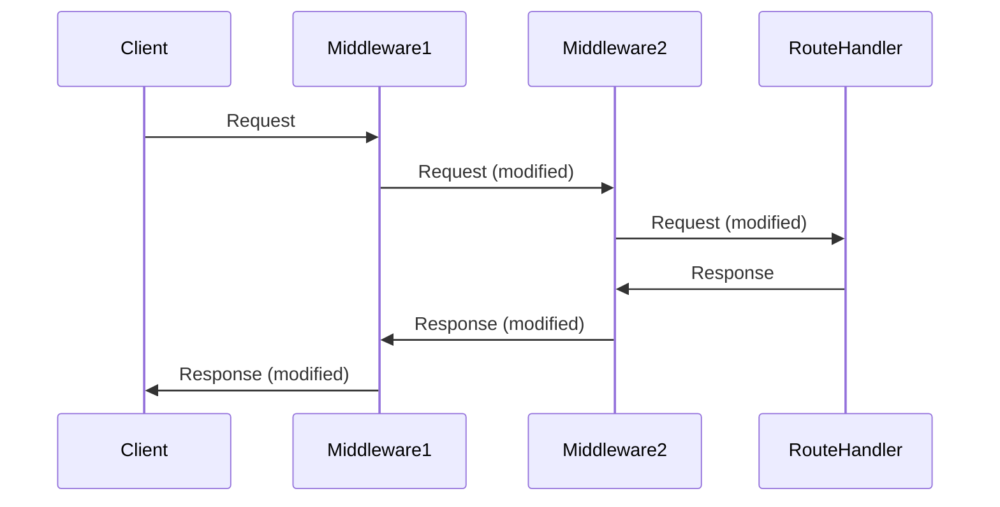
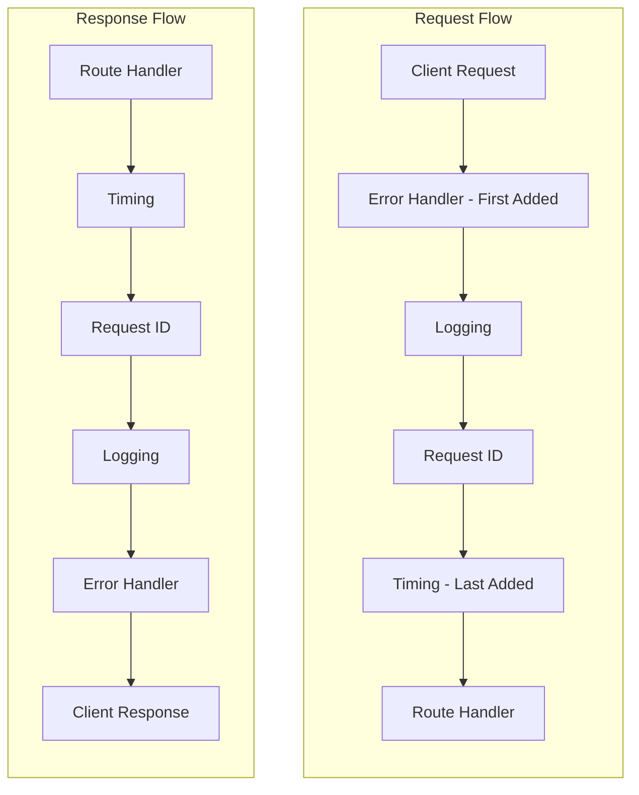

# How to Implement Custom Middleware in FastAPI

Author: [nawazdhandala](https://www.github.com/nawazdhandala)

Tags: Python, FastAPI, Middleware, API Development, Backend, Performance, Logging

Description: Learn how to build custom middleware in FastAPI for request timing, logging, error handling, and request/response modification with practical examples.

---

> Middleware sits between your client and your route handlers. Every request passes through it on the way in, and every response passes through it on the way out. This makes middleware the perfect place for cross-cutting concerns like logging, timing, authentication checks, and request transformation.

FastAPI gives you two main approaches to building middleware: class-based using `BaseHTTPMiddleware` and function-based using the `@app.middleware("http")` decorator. Both have their place, and understanding when to use each will make your APIs cleaner and more maintainable.

---

## How Middleware Works in FastAPI

Before diving into code, let's understand the request/response flow:



Middleware forms a chain. The first middleware added is the outermost layer - it sees the request first and the response last. This "onion" model is important when you need to control execution order.

---

## Function-Based Middleware

The simplest way to add middleware is with the decorator approach. Good for quick, single-purpose middleware.

This basic middleware logs every incoming request path:

```python
# main.py
from fastapi import FastAPI, Request

app = FastAPI()

# Function-based middleware using the decorator
@app.middleware("http")
async def log_requests(request: Request, call_next):
    # This runs BEFORE the request reaches your route
    print(f"Incoming request: {request.method} {request.url.path}")

    # call_next passes the request to the next middleware or route
    response = await call_next(request)

    # This runs AFTER your route returns a response
    print(f"Completed with status: {response.status_code}")

    return response

@app.get("/")
async def root():
    return {"message": "Hello World"}
```

---

## Class-Based Middleware with BaseHTTPMiddleware

For more complex middleware that needs initialization parameters or internal state, use `BaseHTTPMiddleware`.

Here's a timing middleware that measures request duration and adds it to response headers:

```python
# middleware/timing.py
import time
from fastapi import Request
from starlette.middleware.base import BaseHTTPMiddleware
from starlette.responses import Response

class TimingMiddleware(BaseHTTPMiddleware):
    """Measures request processing time and adds X-Process-Time header"""

    def __init__(self, app, header_name: str = "X-Process-Time"):
        super().__init__(app)
        self.header_name = header_name

    async def dispatch(self, request: Request, call_next) -> Response:
        start_time = time.perf_counter()

        # Process the request
        response = await call_next(request)

        # Calculate duration in milliseconds
        duration_ms = (time.perf_counter() - start_time) * 1000

        # Add timing header to response
        response.headers[self.header_name] = f"{duration_ms:.2f}ms"

        return response
```

Register it with your app:

```python
# main.py
from fastapi import FastAPI
from middleware.timing import TimingMiddleware

app = FastAPI()

# Add middleware - first added is outermost (runs first on request, last on response)
app.add_middleware(TimingMiddleware, header_name="X-Process-Time")
```

---

## Request Modification Middleware

Sometimes you need to modify the request before it reaches your handlers - adding headers, transforming data, or injecting context.

This middleware adds a unique request ID to every request for tracing:

```python
# middleware/request_id.py
import uuid
from fastapi import Request
from starlette.middleware.base import BaseHTTPMiddleware

class RequestIDMiddleware(BaseHTTPMiddleware):
    """Adds a unique request ID to each request for tracing"""

    async def dispatch(self, request: Request, call_next):
        # Generate unique ID or use one from incoming header
        request_id = request.headers.get("X-Request-ID")

        if not request_id:
            request_id = str(uuid.uuid4())

        # Store in request state for access in route handlers
        request.state.request_id = request_id

        response = await call_next(request)

        # Echo the request ID back in response
        response.headers["X-Request-ID"] = request_id

        return response
```

Access the request ID in your route handlers:

```python
# routes/users.py
from fastapi import APIRouter, Request

router = APIRouter()

@router.get("/users/{user_id}")
async def get_user(user_id: int, request: Request):
    # Access the request ID set by middleware
    request_id = request.state.request_id

    # Use it for logging, tracing, or including in error responses
    return {
        "user_id": user_id,
        "request_id": request_id
    }
```

---

## Logging Middleware

A proper logging middleware captures request details, response status, and timing - essential for debugging and monitoring.

```python
# middleware/logging.py
import time
import logging
from fastapi import Request
from starlette.middleware.base import BaseHTTPMiddleware

# Configure logger
logger = logging.getLogger("api")
logger.setLevel(logging.INFO)
handler = logging.StreamHandler()
handler.setFormatter(logging.Formatter(
    '%(asctime)s - %(name)s - %(levelname)s - %(message)s'
))
logger.addHandler(handler)

class LoggingMiddleware(BaseHTTPMiddleware):
    """Logs request and response details with timing"""

    def __init__(self, app, exclude_paths: list = None):
        super().__init__(app)
        # Skip logging for health checks, metrics, etc.
        self.exclude_paths = exclude_paths or ["/health", "/metrics"]

    async def dispatch(self, request: Request, call_next):
        # Skip excluded paths
        if request.url.path in self.exclude_paths:
            return await call_next(request)

        start_time = time.perf_counter()

        # Log request
        logger.info(
            f"Request started: {request.method} {request.url.path} "
            f"client={request.client.host if request.client else 'unknown'}"
        )

        # Process request
        response = await call_next(request)

        # Calculate duration
        duration_ms = (time.perf_counter() - start_time) * 1000

        # Log response with timing
        log_level = logging.WARNING if response.status_code >= 400 else logging.INFO
        logger.log(
            log_level,
            f"Request completed: {request.method} {request.url.path} "
            f"status={response.status_code} duration={duration_ms:.2f}ms"
        )

        return response
```

---

## Error Handling Middleware

Middleware is excellent for catching unhandled exceptions and returning consistent error responses.

```python
# middleware/error_handler.py
import traceback
import logging
from fastapi import Request
from fastapi.responses import JSONResponse
from starlette.middleware.base import BaseHTTPMiddleware

logger = logging.getLogger("api.errors")

class ErrorHandlerMiddleware(BaseHTTPMiddleware):
    """Catches unhandled exceptions and returns consistent error responses"""

    def __init__(self, app, debug: bool = False):
        super().__init__(app)
        self.debug = debug

    async def dispatch(self, request: Request, call_next):
        try:
            return await call_next(request)

        except Exception as exc:
            # Log the full traceback
            logger.error(
                f"Unhandled exception: {request.method} {request.url.path}",
                exc_info=True
            )

            # Build error response
            error_detail = {
                "error": "Internal Server Error",
                "message": "An unexpected error occurred"
            }

            # Include traceback in debug mode only
            if self.debug:
                error_detail["traceback"] = traceback.format_exc()
                error_detail["exception"] = str(exc)

            # Include request ID if available
            if hasattr(request.state, "request_id"):
                error_detail["request_id"] = request.state.request_id

            return JSONResponse(
                status_code=500,
                content=error_detail
            )
```

---

## Response Modification Middleware

You can modify responses after your handlers return. This is useful for adding security headers, transforming response data, or compressing content.

This middleware adds security headers to all responses:

```python
# middleware/security_headers.py
from fastapi import Request
from starlette.middleware.base import BaseHTTPMiddleware

class SecurityHeadersMiddleware(BaseHTTPMiddleware):
    """Adds security headers to all responses"""

    async def dispatch(self, request: Request, call_next):
        response = await call_next(request)

        # Add security headers
        response.headers["X-Content-Type-Options"] = "nosniff"
        response.headers["X-Frame-Options"] = "DENY"
        response.headers["X-XSS-Protection"] = "1; mode=block"
        response.headers["Strict-Transport-Security"] = "max-age=31536000; includeSubDomains"
        response.headers["Referrer-Policy"] = "strict-origin-when-cross-origin"

        return response
```

---

## Middleware Ordering

The order you add middleware matters. FastAPI processes middleware in reverse order of registration - the last middleware added is the innermost layer.



Here's how to set up middleware in the correct order:

```python
# main.py
from fastapi import FastAPI
from middleware.error_handler import ErrorHandlerMiddleware
from middleware.logging import LoggingMiddleware
from middleware.request_id import RequestIDMiddleware
from middleware.timing import TimingMiddleware
from middleware.security_headers import SecurityHeadersMiddleware

app = FastAPI()

# Order matters: first added is outermost, last added is innermost
# Error handler should be outermost to catch all exceptions
app.add_middleware(ErrorHandlerMiddleware, debug=False)

# Logging should be early to capture all requests
app.add_middleware(LoggingMiddleware, exclude_paths=["/health"])

# Request ID should be early so other middleware can use it
app.add_middleware(RequestIDMiddleware)

# Security headers can be added late
app.add_middleware(SecurityHeadersMiddleware)

# Timing should be innermost for accurate route-only timing
app.add_middleware(TimingMiddleware)
```

---

## Conditional Middleware

Sometimes you need middleware that only runs for certain routes or conditions.

```python
# middleware/auth_check.py
from fastapi import Request
from fastapi.responses import JSONResponse
from starlette.middleware.base import BaseHTTPMiddleware

class AuthCheckMiddleware(BaseHTTPMiddleware):
    """Checks for API key on protected routes"""

    def __init__(self, app, api_key: str, protected_prefixes: list = None):
        super().__init__(app)
        self.api_key = api_key
        self.protected_prefixes = protected_prefixes or ["/api/"]

    def _is_protected(self, path: str) -> bool:
        """Check if path requires authentication"""
        return any(path.startswith(prefix) for prefix in self.protected_prefixes)

    async def dispatch(self, request: Request, call_next):
        # Skip unprotected routes
        if not self._is_protected(request.url.path):
            return await call_next(request)

        # Check API key
        provided_key = request.headers.get("X-API-Key")

        if not provided_key:
            return JSONResponse(
                status_code=401,
                content={"error": "Missing API key"}
            )

        if provided_key != self.api_key:
            return JSONResponse(
                status_code=403,
                content={"error": "Invalid API key"}
            )

        return await call_next(request)
```

---

## Pure ASGI Middleware

For maximum performance, you can write pure ASGI middleware. This bypasses some of the convenience of `BaseHTTPMiddleware` but gives you more control.

```python
# middleware/pure_asgi.py
from starlette.types import ASGIApp, Receive, Scope, Send
import time

class PureASGITimingMiddleware:
    """
    Pure ASGI middleware for timing - more performant than BaseHTTPMiddleware
    for high-throughput scenarios
    """

    def __init__(self, app: ASGIApp):
        self.app = app

    async def __call__(self, scope: Scope, receive: Receive, send: Send):
        # Only process HTTP requests
        if scope["type"] != "http":
            await self.app(scope, receive, send)
            return

        start_time = time.perf_counter()

        # Wrapper to intercept response start
        async def send_wrapper(message):
            if message["type"] == "http.response.start":
                # Calculate timing
                duration_ms = (time.perf_counter() - start_time) * 1000

                # Add timing header
                headers = list(message.get("headers", []))
                headers.append((b"x-process-time", f"{duration_ms:.2f}ms".encode()))
                message["headers"] = headers

            await send(message)

        await self.app(scope, receive, send_wrapper)
```

Register pure ASGI middleware:

```python
# main.py
from fastapi import FastAPI
from middleware.pure_asgi import PureASGITimingMiddleware

app = FastAPI()

# Pure ASGI middleware uses app constructor directly
app = PureASGITimingMiddleware(app)
```

---

## Complete Example: Production-Ready Setup

Here's a complete example putting it all together:

```python
# main.py
import os
from fastapi import FastAPI, Request
from fastapi.responses import JSONResponse
from contextlib import asynccontextmanager

from middleware.error_handler import ErrorHandlerMiddleware
from middleware.logging import LoggingMiddleware
from middleware.request_id import RequestIDMiddleware
from middleware.timing import TimingMiddleware
from middleware.security_headers import SecurityHeadersMiddleware
from middleware.auth_check import AuthCheckMiddleware

# Lifespan for startup/shutdown events
@asynccontextmanager
async def lifespan(app: FastAPI):
    # Startup
    print("Application starting up...")
    yield
    # Shutdown
    print("Application shutting down...")

app = FastAPI(
    title="My API",
    version="1.0.0",
    lifespan=lifespan
)

# Configure middleware stack (order matters!)
# 1. Error handler - outermost to catch all errors
app.add_middleware(
    ErrorHandlerMiddleware,
    debug=os.getenv("DEBUG", "false").lower() == "true"
)

# 2. Logging - early for full request visibility
app.add_middleware(
    LoggingMiddleware,
    exclude_paths=["/health", "/ready", "/metrics"]
)

# 3. Request ID - for tracing
app.add_middleware(RequestIDMiddleware)

# 4. Auth check - protect API routes
app.add_middleware(
    AuthCheckMiddleware,
    api_key=os.getenv("API_KEY", "dev-key"),
    protected_prefixes=["/api/"]
)

# 5. Security headers
app.add_middleware(SecurityHeadersMiddleware)

# 6. Timing - innermost for accurate timing
app.add_middleware(TimingMiddleware)


# Health check endpoint (not protected, not logged)
@app.get("/health")
async def health():
    return {"status": "healthy"}

# Protected API endpoints
@app.get("/api/users/{user_id}")
async def get_user(user_id: int, request: Request):
    return {
        "user_id": user_id,
        "name": "John Doe",
        "request_id": request.state.request_id
    }

@app.post("/api/users")
async def create_user(request: Request):
    body = await request.json()
    return {
        "message": "User created",
        "request_id": request.state.request_id
    }
```

---

## Best Practices

| Practice | Why |
|----------|-----|
| Keep middleware focused | One middleware, one responsibility |
| Order matters | Error handlers first, timing last |
| Use `request.state` for context | Clean way to pass data to handlers |
| Exclude health checks from logging | Reduces noise in production logs |
| Handle exceptions in middleware | Prevent 500s from crashing the app |
| Avoid reading request body twice | Stream it once, store if needed |
| Test middleware in isolation | Unit test before integrating |

---

## Common Pitfalls

1. **Reading the request body multiple times** - The body is a stream. If you read it in middleware, your route handler won't be able to read it again. Cache it if needed.

2. **Forgetting to call `call_next`** - Your request will hang forever if you don't pass it along.

3. **Heavy processing in middleware** - Middleware runs on every request. Keep it fast.

4. **Not handling WebSocket connections** - `BaseHTTPMiddleware` only handles HTTP. Check `scope["type"]` for WebSocket support.

5. **Incorrect ordering** - Your timing middleware won't be accurate if error handling runs after it.

---

## Conclusion

Custom middleware in FastAPI gives you a clean way to handle cross-cutting concerns without cluttering your route handlers. Key takeaways:

- Use function-based middleware for simple cases
- Use `BaseHTTPMiddleware` when you need initialization or complex logic
- Order matters - first added is outermost
- Keep middleware focused and fast
- Use `request.state` to pass data between middleware and handlers

With these patterns, you can build maintainable, observable APIs that handle logging, timing, authentication, and error handling consistently across all your endpoints.

---

*Need to monitor your FastAPI application in production? [OneUptime](https://oneuptime.com) provides API monitoring, logging, and distributed tracing to help you understand how your middleware and routes perform under real traffic.*

**Related Reading:**
- [How to Implement Rate Limiting in FastAPI Without External Services](https://oneuptime.com/blog/post/2025-01-06-fastapi-rate-limiting/view)
