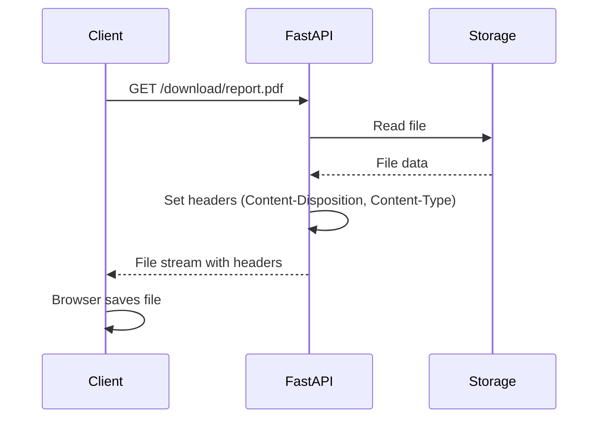
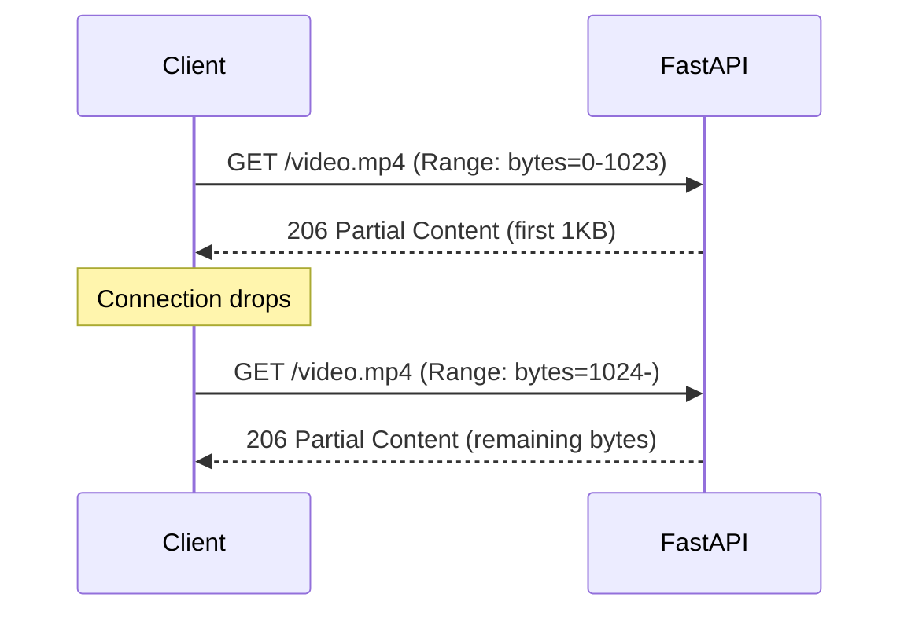

# How to Implement File Downloads in FastAPI

Author: [nawazdhandala](https://www.github.com/nawazdhandala)

Tags: Python, FastAPI, File Downloads, FileResponse, StreamingResponse, API Development, Performance

Description: A practical guide to serving file downloads in FastAPI - from simple static files to streaming large datasets and generating files on the fly.

---

> Serving files from your API seems straightforward until you hit a 2GB file and your server runs out of memory. FastAPI provides several ways to handle file downloads, each suited for different scenarios. This guide walks you through all of them.

File downloads are a common requirement - reports, exports, media files, or user uploads. The approach you choose depends on file size, whether the file exists on disk, and your performance requirements.

---

## File Download Flow

Here is how a typical file download works in FastAPI:



---

## FileResponse - Simple File Downloads

For files that already exist on disk, `FileResponse` is the simplest option. It handles content type detection, sets appropriate headers, and streams the file efficiently.

```python
# file_download.py
# Basic file download endpoint using FileResponse
from fastapi import FastAPI, HTTPException
from fastapi.responses import FileResponse
from pathlib import Path

app = FastAPI()

# Base directory for downloadable files
DOWNLOADS_DIR = Path("/app/downloads")

@app.get("/download/{filename}")
async def download_file(filename: str):
    """
    Download a file by name from the downloads directory.
    FileResponse handles streaming and content-type automatically.
    """
    # Construct full path and validate it exists
    file_path = DOWNLOADS_DIR / filename

    # Security check - prevent directory traversal attacks
    if not file_path.resolve().is_relative_to(DOWNLOADS_DIR.resolve()):
        raise HTTPException(status_code=400, detail="Invalid file path")

    if not file_path.exists():
        raise HTTPException(status_code=404, detail="File not found")

    # FileResponse streams the file and sets Content-Type based on extension
    return FileResponse(
        path=file_path,
        filename=filename,  # Sets Content-Disposition header
        media_type="application/octet-stream"  # Force download instead of display
    )
```

### FileResponse with Custom Headers

Sometimes you need more control over the response headers - for caching, tracking, or custom metadata.

```python
# custom_headers.py
# FileResponse with additional headers for caching and metadata
from fastapi import FastAPI
from fastapi.responses import FileResponse
from pathlib import Path
import os

app = FastAPI()

@app.get("/reports/{report_id}")
async def download_report(report_id: str):
    """
    Download a report with custom headers for caching and metadata.
    """
    file_path = Path(f"/app/reports/{report_id}.pdf")

    if not file_path.exists():
        raise HTTPException(status_code=404, detail="Report not found")

    # Get file stats for headers
    file_stat = file_path.stat()

    return FileResponse(
        path=file_path,
        filename=f"report-{report_id}.pdf",
        media_type="application/pdf",
        headers={
            # Cache for 1 hour - useful for static reports
            "Cache-Control": "private, max-age=3600",
            # File size for download progress indicators
            "Content-Length": str(file_stat.st_size),
            # Custom header for tracking
            "X-Report-ID": report_id
        }
    )
```

---

## StreamingResponse - Large Files and Generated Content

When you cannot or should not load the entire file into memory, `StreamingResponse` streams data in chunks. This is essential for large files or content generated on the fly.

### Streaming Large Files

This approach reads the file in chunks, keeping memory usage constant regardless of file size.

```python
# streaming_large.py
# Stream large files in chunks to avoid memory issues
from fastapi import FastAPI, HTTPException
from fastapi.responses import StreamingResponse
from pathlib import Path
from typing import Generator

app = FastAPI()

def file_iterator(file_path: Path, chunk_size: int = 1024 * 1024) -> Generator[bytes, None, None]:
    """
    Generator that yields file contents in chunks.
    Default chunk size is 1MB - adjust based on your needs.
    """
    with open(file_path, "rb") as file:
        while chunk := file.read(chunk_size):
            yield chunk

@app.get("/download/large/{filename}")
async def download_large_file(filename: str):
    """
    Download large files using streaming.
    Memory usage stays constant regardless of file size.
    """
    file_path = Path(f"/app/large-files/{filename}")

    if not file_path.exists():
        raise HTTPException(status_code=404, detail="File not found")

    file_size = file_path.stat().st_size

    # StreamingResponse accepts any iterable or generator
    return StreamingResponse(
        content=file_iterator(file_path),
        media_type="application/octet-stream",
        headers={
            "Content-Disposition": f'attachment; filename="{filename}"',
            "Content-Length": str(file_size)  # Enables progress indicators
        }
    )
```

### Async File Streaming

For better performance under load, use async file operations with `aiofiles`.

```python
# async_streaming.py
# Async file streaming for better concurrency
from fastapi import FastAPI, HTTPException
from fastapi.responses import StreamingResponse
from pathlib import Path
import aiofiles
from typing import AsyncGenerator

app = FastAPI()

async def async_file_iterator(
    file_path: Path,
    chunk_size: int = 1024 * 1024
) -> AsyncGenerator[bytes, None]:
    """
    Async generator for file streaming.
    Uses aiofiles to avoid blocking the event loop.
    """
    async with aiofiles.open(file_path, "rb") as file:
        while chunk := await file.read(chunk_size):
            yield chunk

@app.get("/download/async/{filename}")
async def download_file_async(filename: str):
    """
    Async file download - better for high-concurrency scenarios.
    The event loop is not blocked during file reads.
    """
    file_path = Path(f"/app/files/{filename}")

    if not file_path.exists():
        raise HTTPException(status_code=404, detail="File not found")

    return StreamingResponse(
        content=async_file_iterator(file_path),
        media_type="application/octet-stream",
        headers={
            "Content-Disposition": f'attachment; filename="{filename}"'
        }
    )
```

---

## Generating Files on the Fly

Sometimes you need to generate files dynamically - CSV exports, PDF reports, or ZIP archives. Streaming the content as it is generated keeps memory usage low and provides faster time-to-first-byte.

### CSV Export

This example streams CSV data row by row, useful for database exports where loading everything into memory is not feasible.

```python
# csv_export.py
# Generate and stream CSV exports from database queries
from fastapi import FastAPI
from fastapi.responses import StreamingResponse
import csv
import io
from typing import AsyncGenerator
from datetime import datetime

app = FastAPI()

async def generate_csv_rows(query_params: dict) -> AsyncGenerator[str, None]:
    """
    Generate CSV content row by row.
    Each yield sends data to the client immediately.
    """
    # Create a string buffer for CSV writing
    buffer = io.StringIO()
    writer = csv.writer(buffer)

    # Write header row
    writer.writerow(["id", "name", "email", "created_at"])
    yield buffer.getvalue()
    buffer.seek(0)
    buffer.truncate(0)

    # Simulate fetching data in batches from database
    # In real code, this would be an async database query
    batch_size = 1000
    offset = 0

    while True:
        # Fetch batch from database
        rows = await fetch_users_batch(offset, batch_size)

        if not rows:
            break

        # Write each row to the buffer
        for row in rows:
            writer.writerow([row["id"], row["name"], row["email"], row["created_at"]])

        # Yield the batch and clear the buffer
        yield buffer.getvalue()
        buffer.seek(0)
        buffer.truncate(0)

        offset += batch_size

@app.get("/export/users")
async def export_users_csv():
    """
    Export users as CSV with streaming.
    Client starts receiving data immediately.
    """
    timestamp = datetime.now().strftime("%Y%m%d-%H%M%S")

    return StreamingResponse(
        content=generate_csv_rows({}),
        media_type="text/csv",
        headers={
            "Content-Disposition": f'attachment; filename="users-{timestamp}.csv"'
        }
    )
```

### ZIP Archive Streaming

Create ZIP archives on the fly without writing to disk. This is useful for bundling multiple files into a single download.

```python
# zip_streaming.py
# Generate ZIP archives on the fly and stream to client
from fastapi import FastAPI, HTTPException
from fastapi.responses import StreamingResponse
from pathlib import Path
import zipfile
import io
from typing import Generator, List

app = FastAPI()

def generate_zip(files: List[Path]) -> Generator[bytes, None, None]:
    """
    Generate a ZIP archive incrementally.
    Yields compressed data as each file is added.
    """
    # Use BytesIO as the ZIP destination
    buffer = io.BytesIO()

    with zipfile.ZipFile(buffer, "w", zipfile.ZIP_DEFLATED) as zf:
        for file_path in files:
            if not file_path.exists():
                continue

            # Add file to archive
            zf.write(file_path, file_path.name)

            # Yield what we have so far
            buffer.seek(0)
            yield buffer.read()
            buffer.seek(0)
            buffer.truncate(0)

    # Yield any remaining data (ZIP footer)
    buffer.seek(0)
    remaining = buffer.read()
    if remaining:
        yield remaining

@app.get("/download/bundle/{bundle_id}")
async def download_bundle(bundle_id: str):
    """
    Download multiple files as a ZIP archive.
    Files are compressed and streamed without temp files.
    """
    # Get list of files for this bundle
    bundle_dir = Path(f"/app/bundles/{bundle_id}")

    if not bundle_dir.exists():
        raise HTTPException(status_code=404, detail="Bundle not found")

    files = list(bundle_dir.glob("*"))

    if not files:
        raise HTTPException(status_code=404, detail="No files in bundle")

    return StreamingResponse(
        content=generate_zip(files),
        media_type="application/zip",
        headers={
            "Content-Disposition": f'attachment; filename="bundle-{bundle_id}.zip"'
        }
    )
```

---

## Content-Disposition Headers

The `Content-Disposition` header controls how browsers handle the response - display inline or prompt for download.

```python
# content_disposition.py
# Different Content-Disposition modes for various use cases
from fastapi import FastAPI, Query
from fastapi.responses import FileResponse, Response
from pathlib import Path

app = FastAPI()

@app.get("/file/{filename}")
async def get_file(
    filename: str,
    download: bool = Query(False, description="Force download instead of inline display")
):
    """
    Serve file with configurable disposition.
    - download=false: Display in browser if supported (PDF, images)
    - download=true: Always prompt to save file
    """
    file_path = Path(f"/app/files/{filename}")

    if not file_path.exists():
        raise HTTPException(status_code=404, detail="File not found")

    # Determine disposition based on query parameter
    if download:
        # attachment: Browser will prompt to save
        disposition = f'attachment; filename="{filename}"'
    else:
        # inline: Browser will try to display (PDF, images, text)
        disposition = f'inline; filename="{filename}"'

    return FileResponse(
        path=file_path,
        headers={"Content-Disposition": disposition}
    )

@app.get("/preview/{filename}")
async def preview_file(filename: str):
    """
    Force inline display for preview purposes.
    Good for PDFs, images, and videos.
    """
    file_path = Path(f"/app/files/{filename}")

    # Map extensions to MIME types for proper display
    mime_types = {
        ".pdf": "application/pdf",
        ".png": "image/png",
        ".jpg": "image/jpeg",
        ".jpeg": "image/jpeg",
        ".gif": "image/gif",
        ".mp4": "video/mp4",
        ".txt": "text/plain"
    }

    ext = file_path.suffix.lower()
    media_type = mime_types.get(ext, "application/octet-stream")

    return FileResponse(
        path=file_path,
        media_type=media_type,
        headers={
            "Content-Disposition": f'inline; filename="{filename}"'
        }
    )
```

---

## Range Requests for Resumable Downloads

Range requests allow clients to download specific byte ranges of a file. This enables resumable downloads and video seeking.



```python
# range_requests.py
# Support range requests for resumable downloads and video streaming
from fastapi import FastAPI, HTTPException, Request
from fastapi.responses import Response, StreamingResponse
from pathlib import Path
from typing import Tuple, Optional
import re

app = FastAPI()

def parse_range_header(range_header: str, file_size: int) -> Tuple[int, int]:
    """
    Parse the Range header and return start and end byte positions.
    Supports formats: bytes=0-499, bytes=500-, bytes=-500
    """
    if not range_header or not range_header.startswith("bytes="):
        return 0, file_size - 1

    range_spec = range_header[6:]  # Remove "bytes="

    # Match different range formats
    match = re.match(r"(\d*)-(\d*)", range_spec)
    if not match:
        return 0, file_size - 1

    start_str, end_str = match.groups()

    if start_str and end_str:
        # bytes=0-499: Both start and end specified
        start = int(start_str)
        end = min(int(end_str), file_size - 1)
    elif start_str:
        # bytes=500-: Start specified, read to end
        start = int(start_str)
        end = file_size - 1
    elif end_str:
        # bytes=-500: Last N bytes
        start = max(0, file_size - int(end_str))
        end = file_size - 1
    else:
        start, end = 0, file_size - 1

    return start, end

def file_range_iterator(file_path: Path, start: int, end: int, chunk_size: int = 1024 * 64):
    """
    Generator that yields bytes from start to end position.
    Used for serving partial content responses.
    """
    with open(file_path, "rb") as file:
        file.seek(start)
        remaining = end - start + 1

        while remaining > 0:
            read_size = min(chunk_size, remaining)
            data = file.read(read_size)
            if not data:
                break
            remaining -= len(data)
            yield data

@app.get("/video/{filename}")
async def stream_video(filename: str, request: Request):
    """
    Stream video with range request support.
    Enables seeking and resumable playback in browsers.
    """
    file_path = Path(f"/app/videos/{filename}")

    if not file_path.exists():
        raise HTTPException(status_code=404, detail="Video not found")

    file_size = file_path.stat().st_size

    # Check for Range header
    range_header = request.headers.get("range")

    if range_header:
        # Partial content request
        start, end = parse_range_header(range_header, file_size)
        content_length = end - start + 1

        return StreamingResponse(
            content=file_range_iterator(file_path, start, end),
            status_code=206,  # Partial Content
            media_type="video/mp4",
            headers={
                "Content-Range": f"bytes {start}-{end}/{file_size}",
                "Content-Length": str(content_length),
                "Accept-Ranges": "bytes"
            }
        )
    else:
        # Full file request
        return StreamingResponse(
            content=file_range_iterator(file_path, 0, file_size - 1),
            media_type="video/mp4",
            headers={
                "Content-Length": str(file_size),
                "Accept-Ranges": "bytes"  # Tell client we support ranges
            }
        )
```

---

## Background Tasks for Cleanup

When generating temporary files for download, use background tasks to clean them up after the response is sent.

```python
# background_cleanup.py
# Clean up temporary files after download completes
from fastapi import FastAPI, BackgroundTasks, HTTPException
from fastapi.responses import FileResponse
from pathlib import Path
import tempfile
import uuid
from datetime import datetime

app = FastAPI()

def cleanup_file(file_path: Path):
    """
    Background task to delete temporary file.
    Runs after the response is sent to the client.
    """
    try:
        if file_path.exists():
            file_path.unlink()
            print(f"Cleaned up temporary file: {file_path}")
    except Exception as e:
        print(f"Failed to cleanup {file_path}: {e}")

async def generate_report(report_id: str) -> Path:
    """
    Generate a report and save to temporary file.
    Returns path to the generated file.
    """
    # Create temp file that persists after function returns
    temp_dir = Path(tempfile.gettempdir())
    temp_file = temp_dir / f"report-{report_id}-{uuid.uuid4().hex}.pdf"

    # Generate report content (placeholder - use your PDF library)
    content = f"Report {report_id} generated at {datetime.now()}"
    temp_file.write_text(content)

    return temp_file

@app.get("/reports/generate/{report_id}")
async def generate_and_download_report(
    report_id: str,
    background_tasks: BackgroundTasks
):
    """
    Generate a report, send it to client, then delete the temp file.
    Background task runs after response is fully sent.
    """
    # Generate the report to a temporary file
    temp_file = await generate_report(report_id)

    # Schedule cleanup after response is sent
    background_tasks.add_task(cleanup_file, temp_file)

    # Return the file - FastAPI streams it to the client
    return FileResponse(
        path=temp_file,
        filename=f"report-{report_id}.pdf",
        media_type="application/pdf"
    )
```

### Cleanup with Error Handling

A more robust cleanup implementation that handles edge cases.

```python
# robust_cleanup.py
# Robust temporary file management with cleanup
from fastapi import FastAPI, BackgroundTasks
from fastapi.responses import StreamingResponse
from pathlib import Path
import tempfile
import shutil
from contextlib import contextmanager
from typing import Generator
import os

app = FastAPI()

class TempFileManager:
    """Manage temporary files with automatic cleanup tracking."""

    def __init__(self, temp_dir: str = None):
        self.temp_dir = Path(temp_dir or tempfile.gettempdir()) / "app-downloads"
        self.temp_dir.mkdir(parents=True, exist_ok=True)

    def create_temp_file(self, suffix: str = "") -> Path:
        """Create a new temporary file and return its path."""
        fd, path = tempfile.mkstemp(suffix=suffix, dir=self.temp_dir)
        os.close(fd)  # Close the file descriptor
        return Path(path)

    def cleanup_file(self, file_path: Path) -> bool:
        """Delete a file, returning True if successful."""
        try:
            if file_path.exists() and file_path.is_relative_to(self.temp_dir):
                file_path.unlink()
                return True
        except Exception:
            pass
        return False

    def cleanup_old_files(self, max_age_hours: int = 1):
        """Remove files older than max_age_hours."""
        import time
        cutoff = time.time() - (max_age_hours * 3600)

        for file_path in self.temp_dir.iterdir():
            try:
                if file_path.stat().st_mtime < cutoff:
                    file_path.unlink()
            except Exception:
                pass

temp_manager = TempFileManager()

def file_stream_with_cleanup(
    file_path: Path,
    chunk_size: int = 1024 * 64
) -> Generator[bytes, None, None]:
    """
    Stream file and delete it when done.
    The file is deleted after the last chunk is yielded.
    """
    try:
        with open(file_path, "rb") as f:
            while chunk := f.read(chunk_size):
                yield chunk
    finally:
        # Cleanup happens when generator is exhausted or closed
        temp_manager.cleanup_file(file_path)

@app.get("/export/data")
async def export_data():
    """
    Export data with guaranteed cleanup.
    File is deleted after streaming completes.
    """
    # Create temp file and write data
    temp_file = temp_manager.create_temp_file(suffix=".csv")

    # Write export data to temp file
    with open(temp_file, "w") as f:
        f.write("id,name,value\n")
        for i in range(10000):
            f.write(f"{i},item-{i},{i * 100}\n")

    # Stream with automatic cleanup
    return StreamingResponse(
        content=file_stream_with_cleanup(temp_file),
        media_type="text/csv",
        headers={
            "Content-Disposition": 'attachment; filename="export.csv"'
        }
    )

# Periodic cleanup task - call from scheduler or startup
@app.on_event("startup")
async def startup_cleanup():
    """Clean up any orphaned temp files on startup."""
    temp_manager.cleanup_old_files(max_age_hours=1)
```

---

## Comparison of Approaches

| Approach | Memory Usage | Best For | Limitations |
|----------|--------------|----------|-------------|
| FileResponse | Low (streams from disk) | Static files | File must exist on disk |
| StreamingResponse | Constant (chunked) | Large files, generated content | No automatic content-type |
| In-memory response | High (entire file) | Small files only | Memory bound |
| Range requests | Low (partial file) | Video, resumable downloads | More complex implementation |

---

## Best Practices

### 1. Always Set Content-Disposition for Downloads

```python
# Without this, browsers may display instead of download
headers={"Content-Disposition": f'attachment; filename="{safe_filename}"'}
```

### 2. Sanitize Filenames

```python
import re

def sanitize_filename(filename: str) -> str:
    """Remove or replace unsafe characters from filename."""
    # Remove path separators and null bytes
    filename = re.sub(r'[/\\:\x00]', '', filename)
    # Replace other special characters with underscores
    filename = re.sub(r'[<>"|?*]', '_', filename)
    return filename or "download"
```

### 3. Set Content-Length When Possible

```python
# Enables download progress indicators in browsers
headers={"Content-Length": str(file_size)}
```

### 4. Use Appropriate Chunk Sizes

```python
# Small chunks (64KB) - Better for slow connections
chunk_size = 1024 * 64

# Large chunks (1MB) - Better throughput for fast connections
chunk_size = 1024 * 1024
```

### 5. Handle Timeouts for Large Files

```python
# In production, increase timeouts for large file downloads
# Gunicorn: --timeout 300
# Uvicorn: Configure at reverse proxy level (nginx, etc.)
```

---

## Conclusion

FastAPI provides flexible options for file downloads. Key takeaways:

- Use **FileResponse** for existing files on disk - simplest approach
- Use **StreamingResponse** for large files or generated content - constant memory usage
- Implement **range requests** for video streaming and resumable downloads
- Use **background tasks** to clean up temporary files after download completes
- Always set appropriate headers for proper browser handling

Choose the right approach based on your file sizes and whether content exists on disk or is generated dynamically.

---

*Need to monitor your API's file download performance? [OneUptime](https://oneuptime.com) provides comprehensive API monitoring with request tracking and alerting for slow responses.*

**Related Reading:**
- [How to Implement Rate Limiting in FastAPI Without External Services](https://oneuptime.com/blog/post/2025-01-06-fastapi-rate-limiting/view)
- [How to Build Health Checks and Readiness Probes in Python for Kubernetes](https://oneuptime.com/blog/post/2025-01-06-python-health-checks-kubernetes/view)
