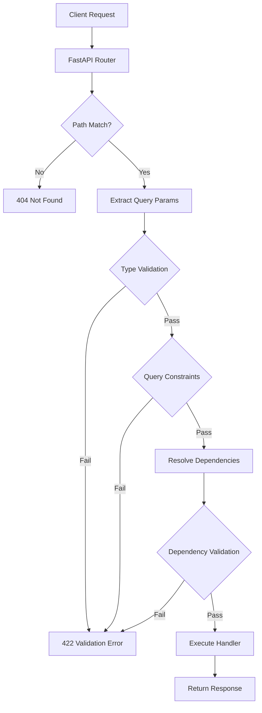

# How to Use FastAPI Query Parameters Effectively

Author: [nawazdhandala](https://www.github.com/nawazdhandala)

Tags: Python, FastAPI, Query Parameters, API Design, Validation, Pydantic, REST API

Description: Learn how to handle query parameters in FastAPI - from basic required and optional parameters to advanced patterns like validation, enums, lists, and reusable pagination dependencies.

---

> Query parameters are the backbone of REST API filtering and customization. FastAPI makes them intuitive with Python type hints, but there is more depth here than most tutorials cover. This guide walks through practical patterns that will make your APIs more robust and your code more maintainable.

Query parameters appear after the `?` in a URL and let clients customize their requests. FastAPI handles them elegantly, but knowing when to use required vs optional parameters, how to validate input, and how to structure reusable patterns can save you from headaches down the road.

---

## Required vs Optional Parameters

The difference between required and optional query parameters comes down to whether you provide a default value.

### Required Parameters

When you define a parameter without a default value, FastAPI treats it as required. If the client does not provide it, they get a 422 validation error.

```python
# required_params.py
# Required query parameters - no default value means the client must provide it
from fastapi import FastAPI

app = FastAPI()

@app.get("/search")
async def search_items(q: str):
    """
    The 'q' parameter has no default, so it is required.
    Request: GET /search?q=laptop
    Missing 'q' returns 422 Unprocessable Entity
    """
    return {"query": q, "results": []}
```

### Optional Parameters

Add a default value (often `None`) to make a parameter optional. Use `Optional` from typing to be explicit about the type.

```python
# optional_params.py
# Optional query parameters - provide a default value
from fastapi import FastAPI
from typing import Optional

app = FastAPI()

@app.get("/items")
async def get_items(
    category: Optional[str] = None,
    in_stock: Optional[bool] = None
):
    """
    Both parameters are optional.
    Request: GET /items
    Request: GET /items?category=electronics
    Request: GET /items?category=electronics&in_stock=true
    """
    filters = {}
    if category:
        filters["category"] = category
    if in_stock is not None:
        filters["in_stock"] = in_stock

    return {"filters": filters}
```

### Mixing Required and Optional

Most real-world endpoints combine both. Put required parameters first for readability.

```python
# mixed_params.py
# Combining required and optional parameters
from fastapi import FastAPI
from typing import Optional

app = FastAPI()

@app.get("/products/{product_id}/reviews")
async def get_reviews(
    product_id: int,              # Path parameter - always required
    min_rating: int,              # Query parameter - required
    max_rating: Optional[int] = None,  # Query parameter - optional
    verified_only: bool = False   # Query parameter - optional with default
):
    """
    product_id: Required path parameter
    min_rating: Required query parameter
    max_rating: Optional, defaults to None
    verified_only: Optional, defaults to False

    Request: GET /products/123/reviews?min_rating=3
    Request: GET /products/123/reviews?min_rating=3&max_rating=5&verified_only=true
    """
    return {
        "product_id": product_id,
        "min_rating": min_rating,
        "max_rating": max_rating,
        "verified_only": verified_only
    }
```

---

## Default Values

Default values do more than make parameters optional - they document expected behavior and reduce boilerplate in your handlers.

```python
# default_values.py
# Using default values effectively
from fastapi import FastAPI
from datetime import date, timedelta

app = FastAPI()

@app.get("/reports")
async def get_reports(
    format: str = "json",           # Default output format
    include_metadata: bool = True,  # Include extra info by default
    days: int = 30                  # Last 30 days by default
):
    """
    Sensible defaults mean most requests can be simple.
    Request: GET /reports (uses all defaults)
    Request: GET /reports?format=csv&days=7
    """
    end_date = date.today()
    start_date = end_date - timedelta(days=days)

    return {
        "format": format,
        "include_metadata": include_metadata,
        "date_range": {
            "start": str(start_date),
            "end": str(end_date)
        }
    }
```

---

## Query() for Validation

The `Query()` function gives you fine-grained control over validation, metadata, and documentation. This is where FastAPI really shines.

### Basic Validation

```python
# query_validation.py
# Using Query() for validation constraints
from fastapi import FastAPI, Query

app = FastAPI()

@app.get("/users")
async def list_users(
    # String length constraints
    username: str = Query(
        default=None,
        min_length=3,
        max_length=50,
        description="Filter by username (partial match)"
    ),
    # Numeric range constraints
    age_min: int = Query(
        default=0,
        ge=0,        # Greater than or equal to 0
        le=150,      # Less than or equal to 150
        description="Minimum age filter"
    ),
    age_max: int = Query(
        default=150,
        ge=0,
        le=150,
        description="Maximum age filter"
    )
):
    """
    Query() adds validation that runs before your code.
    Invalid input returns 422 with clear error messages.

    Request: GET /users?username=jo (fails - too short)
    Request: GET /users?age_min=-5 (fails - below minimum)
    Request: GET /users?username=john&age_min=18&age_max=65
    """
    return {
        "username_filter": username,
        "age_range": [age_min, age_max]
    }
```

### Pattern Matching with Regex

```python
# regex_validation.py
# Using regex patterns for validation
from fastapi import FastAPI, Query

app = FastAPI()

@app.get("/search")
async def search(
    # Email format validation
    email: str = Query(
        default=None,
        pattern=r"^[\w\.-]+@[\w\.-]+\.\w+$",
        description="Filter by email address"
    ),
    # Phone number format (US)
    phone: str = Query(
        default=None,
        pattern=r"^\d{3}-\d{3}-\d{4}$",
        description="Phone number in format XXX-XXX-XXXX"
    ),
    # Alphanumeric codes only
    code: str = Query(
        default=None,
        pattern=r"^[A-Z0-9]{6,10}$",
        description="Alphanumeric code (6-10 uppercase chars)"
    )
):
    """
    Regex validation catches malformed input early.

    Request: GET /search?email=invalid (fails validation)
    Request: GET /search?email=user@example.com (passes)
    Request: GET /search?phone=123-456-7890
    """
    return {
        "email": email,
        "phone": phone,
        "code": code
    }
```

### Adding Metadata for Documentation

```python
# query_metadata.py
# Using Query() to enhance API documentation
from fastapi import FastAPI, Query

app = FastAPI()

@app.get("/products")
async def search_products(
    q: str = Query(
        ...,  # ... means required
        title="Search Query",
        description="Full-text search across product names and descriptions",
        min_length=1,
        max_length=100,
        examples=["laptop", "wireless mouse", "USB-C cable"]
    ),
    sort_by: str = Query(
        default="relevance",
        title="Sort Field",
        description="Field to sort results by",
        examples=["relevance", "price", "rating", "newest"]
    ),
    sort_order: str = Query(
        default="desc",
        title="Sort Order",
        description="Sort direction",
        pattern="^(asc|desc)$"
    )
):
    """
    Metadata shows up in OpenAPI docs and helps API consumers.
    The examples appear in Swagger UI as suggestions.
    """
    return {
        "query": q,
        "sort_by": sort_by,
        "sort_order": sort_order
    }
```

### Deprecating Parameters

```python
# deprecated_params.py
# Marking parameters as deprecated
from fastapi import FastAPI, Query
from typing import Optional

app = FastAPI()

@app.get("/items")
async def get_items(
    # New parameter
    category_id: Optional[int] = Query(
        default=None,
        description="Filter by category ID"
    ),
    # Old parameter - still works but deprecated
    category: Optional[str] = Query(
        default=None,
        deprecated=True,
        description="DEPRECATED: Use category_id instead"
    )
):
    """
    Mark old parameters as deprecated to guide users toward new ones.
    Deprecated params show a warning in Swagger UI.
    """
    # Support both during transition
    if category and not category_id:
        # Map old category name to ID
        category_id = lookup_category_id(category)

    return {"category_id": category_id}
```

---

## Lists and Multiple Values

Sometimes you need to accept multiple values for the same parameter. FastAPI handles this with `List` types.

```python
# list_params.py
# Accepting multiple values for a single parameter
from fastapi import FastAPI, Query
from typing import List, Optional

app = FastAPI()

@app.get("/products")
async def filter_products(
    # Multiple category IDs
    category_ids: List[int] = Query(
        default=[],
        description="Filter by one or more category IDs"
    ),
    # Multiple tags
    tags: List[str] = Query(
        default=[],
        description="Filter by tags (OR logic)"
    ),
    # Multiple status values
    status: List[str] = Query(
        default=["active"],
        description="Filter by status values"
    )
):
    """
    List parameters accept multiple values via repeated query params.

    Request: GET /products?category_ids=1&category_ids=2&category_ids=3
    Request: GET /products?tags=sale&tags=featured
    Request: GET /products?status=active&status=pending
    """
    return {
        "category_ids": category_ids,
        "tags": tags,
        "status": status,
        "total_filters": len(category_ids) + len(tags) + len(status)
    }
```

### Validating List Items

```python
# validated_list.py
# Validating individual items in a list parameter
from fastapi import FastAPI, Query
from typing import List

app = FastAPI()

@app.get("/batch")
async def batch_lookup(
    # List with constraints on the list itself
    ids: List[int] = Query(
        ...,  # Required - must provide at least one
        description="IDs to look up (max 100)"
    )
):
    """
    You can add Query() validation to list parameters.
    Note: FastAPI validates that items are integers automatically.

    Request: GET /batch?ids=1&ids=2&ids=3
    Request: GET /batch?ids=abc (fails - not an integer)
    """
    # Add manual validation for list length
    if len(ids) > 100:
        from fastapi import HTTPException
        raise HTTPException(
            status_code=400,
            detail="Maximum 100 IDs per request"
        )

    if len(ids) != len(set(ids)):
        # Warn about duplicates but still process
        ids = list(set(ids))

    return {"ids": ids, "count": len(ids)}
```

---

## Enums for Constrained Choices

When a parameter should only accept specific values, use Python enums. This gives you validation, documentation, and code completion for free.

```python
# enum_params.py
# Using enums for constrained parameter values
from fastapi import FastAPI, Query
from enum import Enum
from typing import Optional

# Define allowed values as an enum
class SortField(str, Enum):
    created_at = "created_at"
    updated_at = "updated_at"
    name = "name"
    price = "price"
    rating = "rating"

class SortOrder(str, Enum):
    asc = "asc"
    desc = "desc"

class ProductStatus(str, Enum):
    draft = "draft"
    active = "active"
    archived = "archived"
    out_of_stock = "out_of_stock"

app = FastAPI()

@app.get("/products")
async def list_products(
    sort_by: SortField = SortField.created_at,
    order: SortOrder = SortOrder.desc,
    status: Optional[ProductStatus] = None
):
    """
    Enum parameters show allowed values in Swagger UI dropdown.
    Invalid values return 422 with the list of valid options.

    Request: GET /products?sort_by=price&order=asc
    Request: GET /products?sort_by=invalid (fails with helpful error)
    Request: GET /products?status=active
    """
    return {
        "sort_by": sort_by.value,
        "order": order.value,
        "status": status.value if status else None
    }
```

### Combining Enums with Lists

```python
# enum_list.py
# Using enums with list parameters
from fastapi import FastAPI, Query
from enum import Enum
from typing import List

class Tag(str, Enum):
    featured = "featured"
    sale = "sale"
    new_arrival = "new_arrival"
    bestseller = "bestseller"
    clearance = "clearance"

class Category(str, Enum):
    electronics = "electronics"
    clothing = "clothing"
    home = "home"
    sports = "sports"
    books = "books"

app = FastAPI()

@app.get("/products/filter")
async def filter_products(
    tags: List[Tag] = Query(
        default=[],
        description="Filter by product tags"
    ),
    categories: List[Category] = Query(
        default=[],
        description="Filter by categories"
    )
):
    """
    Combine enums with lists for validated multi-select filters.

    Request: GET /products/filter?tags=featured&tags=sale
    Request: GET /products/filter?categories=electronics&categories=books
    """
    return {
        "tags": [t.value for t in tags],
        "categories": [c.value for c in categories]
    }
```

---

## Dependency Injection for Common Parameters

When multiple endpoints share the same query parameters, dependency injection keeps your code DRY. This is especially powerful for patterns like filtering, sorting, and pagination.

### Basic Dependency

```python
# basic_dependency.py
# Extract common parameters into a dependency
from fastapi import FastAPI, Depends, Query
from typing import Optional
from dataclasses import dataclass

app = FastAPI()

@dataclass
class CommonFilters:
    """Common filtering parameters used across endpoints"""
    search: Optional[str] = None
    is_active: bool = True
    created_after: Optional[str] = None
    created_before: Optional[str] = None

def get_common_filters(
    search: Optional[str] = Query(
        default=None,
        min_length=1,
        max_length=100,
        description="Search term"
    ),
    is_active: bool = Query(
        default=True,
        description="Filter by active status"
    ),
    created_after: Optional[str] = Query(
        default=None,
        pattern=r"^\d{4}-\d{2}-\d{2}$",
        description="Filter items created after this date (YYYY-MM-DD)"
    ),
    created_before: Optional[str] = Query(
        default=None,
        pattern=r"^\d{4}-\d{2}-\d{2}$",
        description="Filter items created before this date (YYYY-MM-DD)"
    )
) -> CommonFilters:
    """Dependency function that returns validated filter parameters"""
    return CommonFilters(
        search=search,
        is_active=is_active,
        created_after=created_after,
        created_before=created_before
    )

@app.get("/users")
async def list_users(filters: CommonFilters = Depends(get_common_filters)):
    """List users with common filters"""
    return {"resource": "users", "filters": filters}

@app.get("/products")
async def list_products(filters: CommonFilters = Depends(get_common_filters)):
    """List products with the same filter interface"""
    return {"resource": "products", "filters": filters}

@app.get("/orders")
async def list_orders(filters: CommonFilters = Depends(get_common_filters)):
    """List orders with the same filter interface"""
    return {"resource": "orders", "filters": filters}
```

### Class-Based Dependencies

```python
# class_dependency.py
# Using a class for configurable dependencies
from fastapi import FastAPI, Depends, Query
from typing import Optional

app = FastAPI()

class SortingParams:
    """Reusable sorting parameters with configurable defaults"""

    def __init__(
        self,
        sort_by: str = Query(
            default="created_at",
            description="Field to sort by"
        ),
        sort_order: str = Query(
            default="desc",
            pattern="^(asc|desc)$",
            description="Sort order (asc or desc)"
        )
    ):
        self.sort_by = sort_by
        self.sort_order = sort_order

    def to_sql_order(self) -> str:
        """Convert to SQL ORDER BY clause"""
        direction = "ASC" if self.sort_order == "asc" else "DESC"
        return f"{self.sort_by} {direction}"

@app.get("/items")
async def list_items(sorting: SortingParams = Depends()):
    """
    Using Depends() without arguments instantiates the class.
    FastAPI extracts query params from __init__ parameters.
    """
    return {
        "sort_by": sorting.sort_by,
        "sort_order": sorting.sort_order,
        "sql_clause": sorting.to_sql_order()
    }
```

---

## Pagination Patterns

Pagination is a perfect use case for dependency injection. Here are patterns that scale from simple to production-ready.

### Offset-Based Pagination

The simplest approach - good for small datasets or when users need to jump to specific pages.

```python
# offset_pagination.py
# Classic offset-based pagination
from fastapi import FastAPI, Depends, Query, HTTPException
from typing import TypeVar, Generic, List
from pydantic import BaseModel

app = FastAPI()

class PaginationParams:
    """Offset-based pagination parameters"""

    def __init__(
        self,
        page: int = Query(
            default=1,
            ge=1,
            description="Page number (starts at 1)"
        ),
        page_size: int = Query(
            default=20,
            ge=1,
            le=100,
            alias="limit",  # Accept 'limit' as an alias
            description="Items per page (max 100)"
        )
    ):
        self.page = page
        self.page_size = page_size
        self.offset = (page - 1) * page_size

    def paginate(self, total: int) -> dict:
        """Calculate pagination metadata"""
        total_pages = (total + self.page_size - 1) // self.page_size

        return {
            "page": self.page,
            "page_size": self.page_size,
            "total_items": total,
            "total_pages": total_pages,
            "has_next": self.page < total_pages,
            "has_prev": self.page > 1
        }

# Generic response model for paginated data
T = TypeVar('T')

class PaginatedResponse(BaseModel, Generic[T]):
    items: List[T]
    pagination: dict

@app.get("/products")
async def list_products(
    pagination: PaginationParams = Depends()
):
    """
    Request: GET /products?page=2&limit=10

    Uses 'limit' alias so both work:
    - GET /products?page_size=10
    - GET /products?limit=10
    """
    # Simulate database query
    all_products = [{"id": i, "name": f"Product {i}"} for i in range(1, 251)]
    total = len(all_products)

    # Apply pagination
    items = all_products[pagination.offset:pagination.offset + pagination.page_size]

    return {
        "items": items,
        "pagination": pagination.paginate(total)
    }
```

### Cursor-Based Pagination

Better for large datasets and real-time data - avoids the "shifting window" problem of offset pagination.

```python
# cursor_pagination.py
# Cursor-based pagination for large datasets
from fastapi import FastAPI, Depends, Query, HTTPException
from typing import Optional
from datetime import datetime
import base64
import json

app = FastAPI()

class CursorPagination:
    """
    Cursor-based pagination using encoded cursors.
    Better for large datasets and real-time feeds.
    """

    def __init__(
        self,
        cursor: Optional[str] = Query(
            default=None,
            description="Pagination cursor from previous response"
        ),
        limit: int = Query(
            default=20,
            ge=1,
            le=100,
            description="Number of items to return"
        )
    ):
        self.cursor = cursor
        self.limit = limit
        self._decoded_cursor = self._decode_cursor(cursor)

    def _decode_cursor(self, cursor: Optional[str]) -> Optional[dict]:
        """Decode base64 cursor to dict"""
        if not cursor:
            return None
        try:
            decoded = base64.b64decode(cursor).decode('utf-8')
            return json.loads(decoded)
        except Exception:
            raise HTTPException(
                status_code=400,
                detail="Invalid cursor format"
            )

    def _encode_cursor(self, data: dict) -> str:
        """Encode dict to base64 cursor"""
        json_str = json.dumps(data)
        return base64.b64encode(json_str.encode('utf-8')).decode('utf-8')

    @property
    def last_id(self) -> Optional[int]:
        """Get last_id from decoded cursor"""
        if self._decoded_cursor:
            return self._decoded_cursor.get('last_id')
        return None

    @property
    def last_timestamp(self) -> Optional[str]:
        """Get last_timestamp from decoded cursor"""
        if self._decoded_cursor:
            return self._decoded_cursor.get('last_ts')
        return None

    def create_next_cursor(self, last_item: dict) -> Optional[str]:
        """Create cursor for the next page based on last item"""
        if not last_item:
            return None

        cursor_data = {
            'last_id': last_item.get('id'),
            'last_ts': last_item.get('created_at')
        }
        return self._encode_cursor(cursor_data)

@app.get("/feed")
async def get_feed(
    pagination: CursorPagination = Depends()
):
    """
    Cursor pagination is ideal for infinite scroll and feeds.

    First request: GET /feed?limit=20
    Next request: GET /feed?cursor=<cursor_from_response>&limit=20
    """
    # Simulate fetching items after cursor position
    items = fetch_items_after_cursor(
        last_id=pagination.last_id,
        limit=pagination.limit
    )

    # Create cursor for next page (if there are more items)
    next_cursor = None
    if len(items) == pagination.limit:
        next_cursor = pagination.create_next_cursor(items[-1])

    return {
        "items": items,
        "next_cursor": next_cursor,
        "has_more": next_cursor is not None
    }

def fetch_items_after_cursor(last_id: Optional[int], limit: int) -> list:
    """Simulate database fetch - in reality, use WHERE id > last_id"""
    all_items = [
        {"id": i, "name": f"Item {i}", "created_at": f"2024-01-{i:02d}"}
        for i in range(1, 101)
    ]

    if last_id:
        all_items = [item for item in all_items if item['id'] > last_id]

    return all_items[:limit]
```

### Complete Pagination Example

This brings together filtering, sorting, and pagination into a cohesive pattern.

```python
# complete_pagination.py
# Full-featured pagination with filtering and sorting
from fastapi import FastAPI, Depends, Query
from typing import Optional, List
from enum import Enum
from dataclasses import dataclass, asdict

app = FastAPI()

class SortField(str, Enum):
    created_at = "created_at"
    name = "name"
    price = "price"

class SortOrder(str, Enum):
    asc = "asc"
    desc = "desc"

@dataclass
class ListParams:
    """Combined filter, sort, and pagination parameters"""
    # Filtering
    search: Optional[str]
    category_id: Optional[int]
    min_price: Optional[float]
    max_price: Optional[float]
    # Sorting
    sort_by: SortField
    sort_order: SortOrder
    # Pagination
    page: int
    page_size: int

    @property
    def offset(self) -> int:
        return (self.page - 1) * self.page_size

def get_list_params(
    # Filtering
    search: Optional[str] = Query(
        default=None,
        min_length=1,
        max_length=100,
        description="Search in name and description"
    ),
    category_id: Optional[int] = Query(
        default=None,
        ge=1,
        description="Filter by category"
    ),
    min_price: Optional[float] = Query(
        default=None,
        ge=0,
        description="Minimum price filter"
    ),
    max_price: Optional[float] = Query(
        default=None,
        ge=0,
        description="Maximum price filter"
    ),
    # Sorting
    sort_by: SortField = Query(
        default=SortField.created_at,
        description="Field to sort by"
    ),
    sort_order: SortOrder = Query(
        default=SortOrder.desc,
        description="Sort direction"
    ),
    # Pagination
    page: int = Query(
        default=1,
        ge=1,
        description="Page number"
    ),
    page_size: int = Query(
        default=20,
        ge=1,
        le=100,
        description="Items per page"
    )
) -> ListParams:
    """Build validated list parameters from query string"""
    return ListParams(
        search=search,
        category_id=category_id,
        min_price=min_price,
        max_price=max_price,
        sort_by=sort_by,
        sort_order=sort_order,
        page=page,
        page_size=page_size
    )

@app.get("/products")
async def list_products(params: ListParams = Depends(get_list_params)):
    """
    Full-featured product listing with all the bells and whistles.

    Request: GET /products
    Request: GET /products?search=laptop&category_id=1&min_price=500
    Request: GET /products?sort_by=price&sort_order=asc&page=2&page_size=50
    """
    # Build query based on params
    query_info = {
        "filters_applied": {
            "search": params.search,
            "category_id": params.category_id,
            "price_range": [params.min_price, params.max_price]
        },
        "sorting": f"{params.sort_by.value} {params.sort_order.value}",
        "pagination": {
            "page": params.page,
            "page_size": params.page_size,
            "offset": params.offset
        }
    }

    return query_info
```

---

## Request Flow Diagram

The following diagram shows how FastAPI processes query parameters through validation and dependency injection.



---

## Best Practices

### 1. Use Descriptive Names

```python
# Good - clear intent
@app.get("/orders")
async def list_orders(
    customer_id: int,
    include_cancelled: bool = False,
    min_order_total: float = 0
):
    pass

# Bad - ambiguous
@app.get("/orders")
async def list_orders(
    cid: int,
    ic: bool = False,
    min: float = 0
):
    pass
```

### 2. Document with Query()

```python
# Good - self-documenting API
@app.get("/products")
async def search(
    q: str = Query(
        ...,
        min_length=1,
        description="Search query for product name",
        examples=["laptop", "wireless mouse"]
    )
):
    pass
```

### 3. Group Related Parameters

```python
# Good - related params in a dependency
@app.get("/items")
async def list_items(
    filters: FilterParams = Depends(),
    sorting: SortParams = Depends(),
    pagination: PageParams = Depends()
):
    pass

# Bad - 15 individual parameters
@app.get("/items")
async def list_items(
    search: str = None,
    category: int = None,
    # ... 12 more parameters
):
    pass
```

### 4. Validate Early

```python
# Good - validation happens before handler runs
@app.get("/date-range")
async def get_range(
    start_date: str = Query(..., pattern=r"^\d{4}-\d{2}-\d{2}$"),
    end_date: str = Query(..., pattern=r"^\d{4}-\d{2}-\d{2}$")
):
    # Dates are already validated
    pass
```

### 5. Use Enums for Fixed Choices

```python
# Good - clear constraints, auto-documented
class Status(str, Enum):
    pending = "pending"
    active = "active"
    completed = "completed"

@app.get("/tasks")
async def list_tasks(status: Status = Status.active):
    pass

# Bad - magic strings
@app.get("/tasks")
async def list_tasks(status: str = "active"):
    if status not in ["pending", "active", "completed"]:
        raise HTTPException(400, "Invalid status")
    pass
```

---

## Conclusion

Query parameters are fundamental to building flexible APIs. FastAPI gives you the tools to handle them elegantly:

- **Required vs Optional**: Default values control optionality
- **Query()**: Adds validation, documentation, and constraints
- **Lists and Enums**: Handle multiple values and fixed choices cleanly
- **Dependencies**: Extract common patterns for reuse
- **Pagination**: Offset for simplicity, cursor for scale

Master these patterns and your FastAPI endpoints will be more robust, self-documenting, and maintainable.

---

*Building APIs that need monitoring? [OneUptime](https://oneuptime.com) provides comprehensive API monitoring with latency tracking, error detection, and alerting - perfect for keeping your FastAPI services healthy in production.*

**Related Reading:**
- [How to Implement Rate Limiting in FastAPI Without External Services](https://oneuptime.com/blog/post/2025-01-06-fastapi-rate-limiting/view)
- [How to Build Health Checks and Readiness Probes in Python for Kubernetes](https://oneuptime.com/blog/post/2025-01-06-python-health-checks-kubernetes/view)
