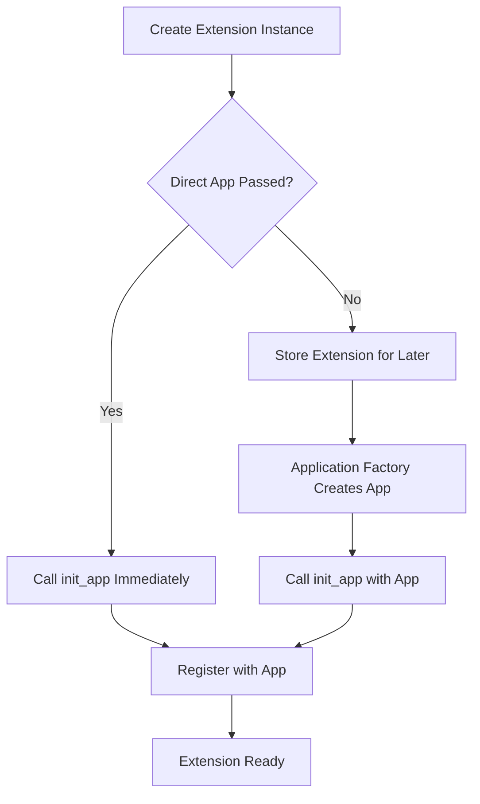
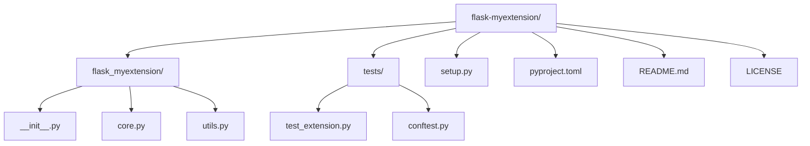

# How to Implement Flask Extensions

Author: [nawazdhandala](https://www.github.com/nawazdhandala)

Tags: Python, Flask, Extensions, Web Development, Application Factory, Configuration, Packaging

Description: Learn how to build Flask extensions from scratch, covering the init_app pattern, application factory compatibility, configuration management, and packaging for distribution.

---

> Flask extensions let you add reusable functionality to Flask applications in a clean, modular way. Whether you're wrapping a third-party library or sharing custom functionality across projects, understanding how to build extensions properly makes your code more maintainable and shareable.

Flask's extension ecosystem is one of its biggest strengths. Extensions like Flask-SQLAlchemy, Flask-Login, and Flask-CORS follow consistent patterns that make them easy to use. This guide walks you through building your own extensions using the same patterns the popular ones use.

---

## Understanding Flask Extension Structure

A Flask extension is essentially a Python package that integrates with Flask applications. The core concept is the `init_app` pattern, which allows extensions to work with Flask's application factory pattern.

Here's how extension initialization flows:



---

## The init_app Pattern

The `init_app` pattern is the foundation of Flask extensions. It separates extension instantiation from application binding, which is essential for the application factory pattern.

Here's a minimal extension showing the basic structure:

```python
# flask_example/__init__.py
from flask import current_app

class ExampleExtension:
    """A minimal Flask extension demonstrating the init_app pattern"""

    def __init__(self, app=None):
        # Store reference to app if provided
        self.app = app

        # Initialize immediately if app is provided
        if app is not None:
            self.init_app(app)

    def init_app(self, app):
        """Initialize the extension with a Flask application

        This method is called either:
        - Directly in __init__ when app is passed to constructor
        - Later when using application factory pattern
        """
        # Store default configuration values
        # These can be overridden in the app's config
        app.config.setdefault('EXAMPLE_SETTING', 'default_value')
        app.config.setdefault('EXAMPLE_ENABLED', True)

        # Store extension instance on the app for later access
        # This allows multiple apps to use the same extension class
        if not hasattr(app, 'extensions'):
            app.extensions = {}
        app.extensions['example'] = self

        # Register any teardown functions
        app.teardown_appcontext(self.teardown)

    def teardown(self, exception):
        """Clean up resources when application context ends"""
        pass

    def do_something(self):
        """Example method that uses the current app context"""
        if current_app.config['EXAMPLE_ENABLED']:
            return f"Setting: {current_app.config['EXAMPLE_SETTING']}"
        return "Extension disabled"
```

---

## Application Factory Compatibility

The application factory pattern lets you create multiple app instances with different configurations. Your extension needs to support both direct initialization and deferred initialization.

This example shows an extension that works with application factories:

```python
# flask_cache_simple/__init__.py
from flask import current_app, g
from functools import wraps
import time

class SimpleCache:
    """A simple caching extension compatible with application factories"""

    def __init__(self, app=None):
        self.app = app
        if app is not None:
            self.init_app(app)

    def init_app(self, app):
        """Register extension with Flask application"""
        # Set configuration defaults
        app.config.setdefault('CACHE_DEFAULT_TIMEOUT', 300)
        app.config.setdefault('CACHE_THRESHOLD', 500)

        # Register extension
        if not hasattr(app, 'extensions'):
            app.extensions = {}
        app.extensions['simple_cache'] = self

        # Initialize cache storage per-app
        # Using app context to support multiple apps
        app.teardown_appcontext(self._teardown)

    def _teardown(self, exception):
        """Clean up when app context ends"""
        cache = g.pop('_simple_cache', None)
        if cache is not None:
            # Perform any cleanup needed
            pass

    def _get_cache(self):
        """Get cache storage for current app context"""
        if '_simple_cache' not in g:
            g._simple_cache = {}
        return g._simple_cache

    def get(self, key):
        """Retrieve value from cache"""
        cache = self._get_cache()
        if key in cache:
            value, expiry = cache[key]
            if expiry > time.time():
                return value
            # Expired - remove it
            del cache[key]
        return None

    def set(self, key, value, timeout=None):
        """Store value in cache"""
        if timeout is None:
            timeout = current_app.config['CACHE_DEFAULT_TIMEOUT']

        cache = self._get_cache()

        # Enforce threshold
        threshold = current_app.config['CACHE_THRESHOLD']
        if len(cache) >= threshold:
            self._evict_oldest(cache)

        expiry = time.time() + timeout
        cache[key] = (value, expiry)

    def _evict_oldest(self, cache):
        """Remove oldest entries when threshold exceeded"""
        # Sort by expiry time and remove oldest 10%
        sorted_items = sorted(cache.items(), key=lambda x: x[1][1])
        to_remove = max(1, len(sorted_items) // 10)
        for key, _ in sorted_items[:to_remove]:
            del cache[key]

    def cached(self, timeout=None, key_prefix='view'):
        """Decorator for caching view function results"""
        def decorator(f):
            @wraps(f)
            def decorated_function(*args, **kwargs):
                # Build cache key from function name and arguments
                cache_key = f"{key_prefix}:{f.__name__}:{args}:{kwargs}"

                # Try to get cached value
                rv = self.get(cache_key)
                if rv is not None:
                    return rv

                # Call function and cache result
                rv = f(*args, **kwargs)
                self.set(cache_key, rv, timeout)
                return rv
            return decorated_function
        return decorator
```

Using this extension with an application factory:

```python
# app.py
from flask import Flask
from flask_cache_simple import SimpleCache

# Create extension instance without app
cache = SimpleCache()

def create_app(config_name='default'):
    """Application factory function"""
    app = Flask(__name__)

    # Load configuration
    app.config['CACHE_DEFAULT_TIMEOUT'] = 600
    app.config['CACHE_THRESHOLD'] = 1000

    # Initialize extension with this app
    cache.init_app(app)

    # Register routes
    @app.route('/data')
    @cache.cached(timeout=60)
    def get_data():
        # Expensive operation - result will be cached
        return {'data': 'expensive result'}

    return app

# Usage in production
app = create_app('production')

# Usage in testing - separate app instance
test_app = create_app('testing')
```

---

## Configuration Management

Good extensions make configuration straightforward while providing sensible defaults. Here's how to handle configuration properly.

This extension demonstrates configuration best practices:

```python
# flask_metrics/__init__.py
from flask import current_app, request, g
import time

# Default configuration values
# Defined at module level for documentation
DEFAULT_CONFIG = {
    'METRICS_ENABLED': True,
    'METRICS_ENDPOINT': '/metrics',
    'METRICS_EXCLUDE_PATHS': ['/health', '/ready'],
    'METRICS_INCLUDE_PATH_PARAMS': False,
}

class Metrics:
    """Request metrics extension with comprehensive configuration"""

    def __init__(self, app=None):
        self.app = app
        self._metrics = {}

        if app is not None:
            self.init_app(app)

    def init_app(self, app):
        """Initialize extension and apply configuration"""
        # Apply defaults for any missing config values
        for key, value in DEFAULT_CONFIG.items():
            app.config.setdefault(key, value)

        # Validate configuration
        self._validate_config(app)

        # Register extension
        if not hasattr(app, 'extensions'):
            app.extensions = {}
        app.extensions['metrics'] = self

        # Register middleware if enabled
        if app.config['METRICS_ENABLED']:
            app.before_request(self._before_request)
            app.after_request(self._after_request)

            # Register metrics endpoint
            endpoint = app.config['METRICS_ENDPOINT']
            app.add_url_rule(endpoint, 'metrics', self._metrics_view)

    def _validate_config(self, app):
        """Validate configuration values"""
        endpoint = app.config['METRICS_ENDPOINT']
        if not endpoint.startswith('/'):
            raise ValueError("METRICS_ENDPOINT must start with '/'")

        exclude = app.config['METRICS_EXCLUDE_PATHS']
        if not isinstance(exclude, (list, tuple)):
            raise TypeError("METRICS_EXCLUDE_PATHS must be a list or tuple")

    def _before_request(self):
        """Record request start time"""
        g._metrics_start = time.time()

    def _after_request(self, response):
        """Record request metrics"""
        # Skip excluded paths
        if request.path in current_app.config['METRICS_EXCLUDE_PATHS']:
            return response

        # Calculate duration
        duration = time.time() - g.get('_metrics_start', time.time())

        # Build metric key
        if current_app.config['METRICS_INCLUDE_PATH_PARAMS']:
            path = request.path
        else:
            path = request.url_rule.rule if request.url_rule else request.path

        key = f"{request.method}:{path}:{response.status_code}"

        # Update metrics
        if key not in self._metrics:
            self._metrics[key] = {
                'count': 0,
                'total_time': 0,
                'min_time': float('inf'),
                'max_time': 0,
            }

        self._metrics[key]['count'] += 1
        self._metrics[key]['total_time'] += duration
        self._metrics[key]['min_time'] = min(self._metrics[key]['min_time'], duration)
        self._metrics[key]['max_time'] = max(self._metrics[key]['max_time'], duration)

        return response

    def _metrics_view(self):
        """Endpoint returning collected metrics"""
        result = []
        for key, data in self._metrics.items():
            method, path, status = key.split(':')
            avg_time = data['total_time'] / data['count'] if data['count'] > 0 else 0
            result.append({
                'method': method,
                'path': path,
                'status': int(status),
                'count': data['count'],
                'avg_time_ms': round(avg_time * 1000, 2),
                'min_time_ms': round(data['min_time'] * 1000, 2),
                'max_time_ms': round(data['max_time'] * 1000, 2),
            })
        return {'metrics': result}

    def get_config(self, key):
        """Helper to get config value with extension prefix"""
        return current_app.config.get(f'METRICS_{key}')
```

---

## Creating Custom Extensions

Let's build a more complete extension that wraps external functionality. This example creates a rate limiting extension.

The extension structure follows Flask conventions:

```python
# flask_ratelimit/__init__.py
from flask import current_app, request, g, jsonify
from functools import wraps
import time
from collections import defaultdict

class RateLimitExceeded(Exception):
    """Raised when rate limit is exceeded"""
    def __init__(self, limit, window, retry_after):
        self.limit = limit
        self.window = window
        self.retry_after = retry_after
        super().__init__(f"Rate limit of {limit} per {window}s exceeded")

class RateLimiter:
    """Flask extension for rate limiting requests"""

    def __init__(self, app=None):
        self.app = app
        self._storage = defaultdict(list)

        if app is not None:
            self.init_app(app)

    def init_app(self, app):
        """Initialize extension with Flask app"""
        # Configuration defaults
        app.config.setdefault('RATELIMIT_ENABLED', True)
        app.config.setdefault('RATELIMIT_DEFAULT_LIMIT', 100)
        app.config.setdefault('RATELIMIT_DEFAULT_WINDOW', 60)
        app.config.setdefault('RATELIMIT_HEADERS_ENABLED', True)
        app.config.setdefault('RATELIMIT_KEY_FUNC', None)

        # Register extension
        if not hasattr(app, 'extensions'):
            app.extensions = {}
        app.extensions['ratelimit'] = self

        # Register error handler
        app.register_error_handler(RateLimitExceeded, self._handle_rate_limit_exceeded)

        # Clean up expired entries periodically
        app.teardown_appcontext(self._cleanup)

    def _handle_rate_limit_exceeded(self, error):
        """Error handler for rate limit exceeded"""
        response = jsonify({
            'error': 'Rate limit exceeded',
            'limit': error.limit,
            'window': error.window,
            'retry_after': error.retry_after
        })
        response.status_code = 429

        if current_app.config['RATELIMIT_HEADERS_ENABLED']:
            response.headers['Retry-After'] = str(int(error.retry_after))
            response.headers['X-RateLimit-Limit'] = str(error.limit)
            response.headers['X-RateLimit-Remaining'] = '0'

        return response

    def _cleanup(self, exception):
        """Remove expired entries from storage"""
        now = time.time()
        for key in list(self._storage.keys()):
            # Remove timestamps older than longest window we might use
            self._storage[key] = [ts for ts in self._storage[key] if now - ts < 3600]
            if not self._storage[key]:
                del self._storage[key]

    def _get_key(self):
        """Get rate limit key for current request"""
        key_func = current_app.config['RATELIMIT_KEY_FUNC']
        if key_func:
            return key_func()
        # Default: use client IP
        return request.remote_addr or 'unknown'

    def _is_allowed(self, key, limit, window):
        """Check if request is allowed under rate limit"""
        now = time.time()
        window_start = now - window

        # Get timestamps within window
        timestamps = self._storage[key]
        timestamps = [ts for ts in timestamps if ts > window_start]
        self._storage[key] = timestamps

        if len(timestamps) >= limit:
            # Calculate retry_after
            oldest = min(timestamps)
            retry_after = oldest + window - now
            return False, retry_after

        # Record this request
        timestamps.append(now)
        remaining = limit - len(timestamps)
        return True, remaining

    def limit(self, limit=None, window=None, key_func=None):
        """Decorator to apply rate limiting to a view function

        Args:
            limit: Maximum requests allowed (default from config)
            window: Time window in seconds (default from config)
            key_func: Custom function to generate rate limit key
        """
        def decorator(f):
            @wraps(f)
            def decorated_function(*args, **kwargs):
                if not current_app.config['RATELIMIT_ENABLED']:
                    return f(*args, **kwargs)

                # Get limit values
                _limit = limit or current_app.config['RATELIMIT_DEFAULT_LIMIT']
                _window = window or current_app.config['RATELIMIT_DEFAULT_WINDOW']

                # Get key
                if key_func:
                    key = key_func()
                else:
                    key = self._get_key()

                # Add endpoint to key for per-route limiting
                key = f"{key}:{request.endpoint}"

                # Check rate limit
                allowed, value = self._is_allowed(key, _limit, _window)

                if not allowed:
                    raise RateLimitExceeded(_limit, _window, value)

                # Execute view
                response = f(*args, **kwargs)

                # Add rate limit headers
                if current_app.config['RATELIMIT_HEADERS_ENABLED']:
                    if hasattr(response, 'headers'):
                        response.headers['X-RateLimit-Limit'] = str(_limit)
                        response.headers['X-RateLimit-Remaining'] = str(value)
                        response.headers['X-RateLimit-Reset'] = str(int(time.time() + _window))

                return response
            return decorated_function
        return decorator

    def exempt(self, f):
        """Decorator to exempt a view from rate limiting"""
        f._ratelimit_exempt = True
        return f
```

Using the rate limiter:

```python
# app.py
from flask import Flask
from flask_ratelimit import RateLimiter

limiter = RateLimiter()

def create_app():
    app = Flask(__name__)

    # Configure rate limiting
    app.config['RATELIMIT_DEFAULT_LIMIT'] = 60
    app.config['RATELIMIT_DEFAULT_WINDOW'] = 60

    limiter.init_app(app)

    @app.route('/api/data')
    @limiter.limit(limit=10, window=60)
    def get_data():
        return {'data': 'limited endpoint'}

    @app.route('/api/public')
    @limiter.limit(limit=100, window=60)
    def public_data():
        return {'data': 'higher limit'}

    @app.route('/health')
    @limiter.exempt
    def health():
        return {'status': 'ok'}

    return app
```

---

## Packaging Extensions

To distribute your extension, you need proper packaging. Here's a complete package structure:



The pyproject.toml file for modern packaging:

```toml
# pyproject.toml
[build-system]
requires = ["setuptools>=61.0", "wheel"]
build-backend = "setuptools.build_meta"

[project]
name = "flask-myextension"
version = "1.0.0"
description = "A Flask extension for doing awesome things"
readme = "README.md"
license = {text = "MIT"}
authors = [
    {name = "Your Name", email = "your.email@example.com"}
]
classifiers = [
    "Development Status :: 4 - Beta",
    "Environment :: Web Environment",
    "Framework :: Flask",
    "Intended Audience :: Developers",
    "License :: OSI Approved :: MIT License",
    "Operating System :: OS Independent",
    "Programming Language :: Python :: 3",
    "Programming Language :: Python :: 3.8",
    "Programming Language :: Python :: 3.9",
    "Programming Language :: Python :: 3.10",
    "Programming Language :: Python :: 3.11",
    "Programming Language :: Python :: 3.12",
    "Topic :: Internet :: WWW/HTTP :: Dynamic Content",
]
keywords = ["flask", "extension", "web"]
requires-python = ">=3.8"
dependencies = [
    "flask>=2.0.0",
]

[project.optional-dependencies]
dev = [
    "pytest>=7.0.0",
    "pytest-cov>=4.0.0",
    "black>=23.0.0",
    "ruff>=0.1.0",
]

[project.urls]
Homepage = "https://github.com/username/flask-myextension"
Documentation = "https://flask-myextension.readthedocs.io"
Repository = "https://github.com/username/flask-myextension"

[tool.setuptools.packages.find]
where = ["."]
include = ["flask_myextension*"]

[tool.pytest.ini_options]
testpaths = ["tests"]
python_files = "test_*.py"

[tool.black]
line-length = 88
target-version = ["py38"]

[tool.ruff]
line-length = 88
select = ["E", "F", "W", "I"]
```

The main extension module:

```python
# flask_myextension/__init__.py
"""Flask-MyExtension - A Flask extension for doing awesome things"""

from .core import MyExtension

__version__ = "1.0.0"
__all__ = ["MyExtension"]
```

A test file to verify extension behavior:

```python
# tests/conftest.py
import pytest
from flask import Flask
from flask_myextension import MyExtension

@pytest.fixture
def app():
    """Create test Flask application"""
    app = Flask(__name__)
    app.config['TESTING'] = True
    return app

@pytest.fixture
def extension(app):
    """Create extension instance bound to test app"""
    ext = MyExtension()
    ext.init_app(app)
    return ext

@pytest.fixture
def client(app):
    """Create test client"""
    return app.test_client()
```

```python
# tests/test_extension.py
import pytest
from flask_myextension import MyExtension

def test_init_app(app):
    """Test extension initialization"""
    ext = MyExtension()
    ext.init_app(app)

    assert 'myextension' in app.extensions
    assert app.extensions['myextension'] is ext

def test_direct_init(app):
    """Test direct initialization with app"""
    ext = MyExtension(app)

    assert 'myextension' in app.extensions

def test_config_defaults(app, extension):
    """Test default configuration is applied"""
    assert 'MYEXTENSION_ENABLED' in app.config
    assert app.config['MYEXTENSION_ENABLED'] is True

def test_config_override(app):
    """Test configuration can be overridden"""
    app.config['MYEXTENSION_ENABLED'] = False
    ext = MyExtension(app)

    assert app.config['MYEXTENSION_ENABLED'] is False
```

---

## Best Practices

### 1. Always Support init_app

Even if you don't use application factories yourself, others will:

```python
# Good - supports both patterns
class MyExtension:
    def __init__(self, app=None):
        if app is not None:
            self.init_app(app)

    def init_app(self, app):
        # Configuration and setup here
        pass
```

### 2. Use app.extensions for Storage

Store your extension instance on the app for proper isolation:

```python
def init_app(self, app):
    if not hasattr(app, 'extensions'):
        app.extensions = {}
    app.extensions['myextension'] = self
```

### 3. Prefix Configuration Keys

Use a consistent prefix to avoid conflicts:

```python
# Good
app.config.setdefault('MYEXT_TIMEOUT', 30)
app.config.setdefault('MYEXT_ENABLED', True)

# Bad - might conflict with other extensions
app.config.setdefault('TIMEOUT', 30)
```

### 4. Validate Configuration Early

Catch configuration errors at initialization:

```python
def init_app(self, app):
    timeout = app.config.get('MYEXT_TIMEOUT', 30)
    if not isinstance(timeout, (int, float)) or timeout <= 0:
        raise ValueError("MYEXT_TIMEOUT must be a positive number")
```

### 5. Use current_app in Methods

Access configuration through current_app, not stored references:

```python
# Good - works with multiple apps
def get_timeout(self):
    return current_app.config['MYEXT_TIMEOUT']

# Bad - only works with one app
def get_timeout(self):
    return self.app.config['MYEXT_TIMEOUT']
```

### 6. Clean Up Resources

Register teardown handlers for cleanup:

```python
def init_app(self, app):
    app.teardown_appcontext(self._teardown)

def _teardown(self, exception):
    # Close connections, clear caches, etc.
    pass
```

---

## Conclusion

Building Flask extensions is straightforward once you understand the patterns. Key takeaways:

- The `init_app` pattern is essential for application factory compatibility
- Store extension state on `app.extensions` for proper isolation
- Prefix configuration keys to avoid conflicts
- Use `current_app` instead of stored app references
- Validate configuration at initialization time
- Package properly with pyproject.toml for distribution

These patterns make your extensions work like the popular Flask extensions that developers already know and trust.

---

*Need to monitor your Flask applications in production? [OneUptime](https://oneuptime.com) provides comprehensive application monitoring with distributed tracing, error tracking, and performance metrics.*

**Related Reading:**
- [How to Instrument Python Applications with OpenTelemetry](https://oneuptime.com/blog/post/2025-01-06-instrument-python-opentelemetry/view)
- [How to Implement Rate Limiting in FastAPI Without External Services](https://oneuptime.com/blog/post/2025-01-06-fastapi-rate-limiting/view)
