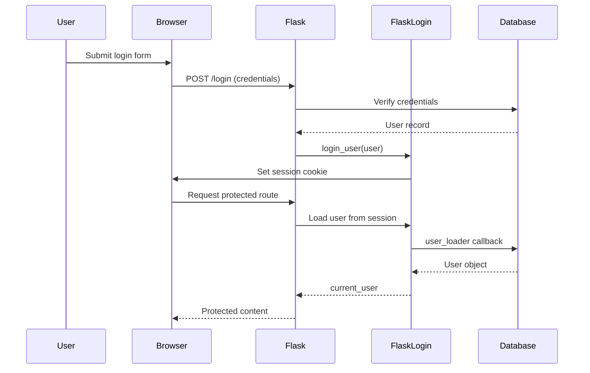
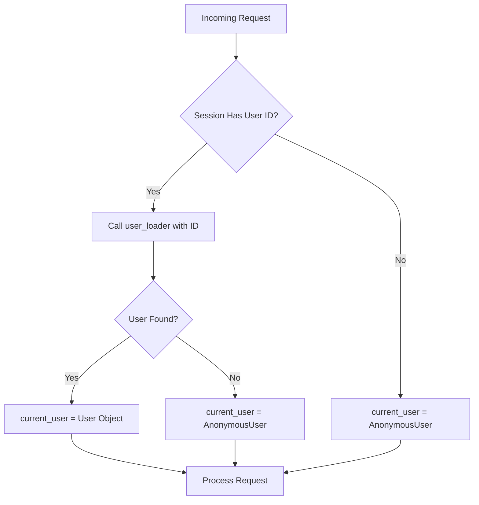
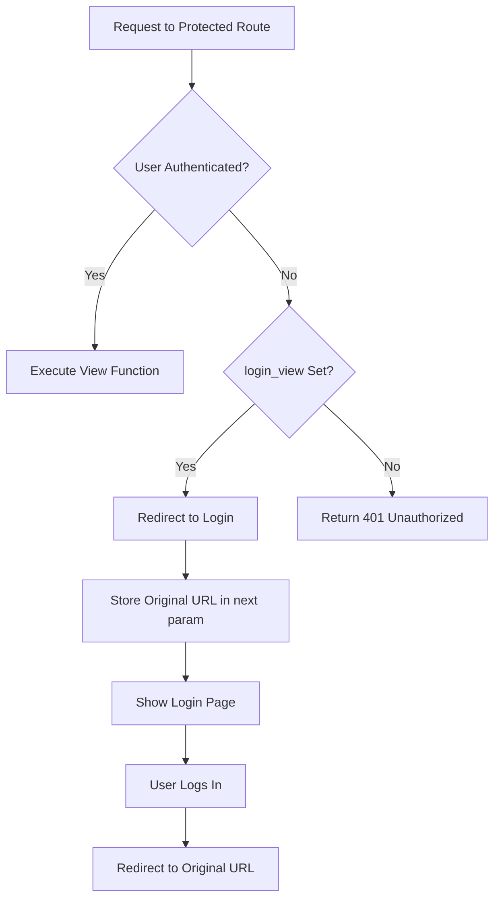

# How to Implement Flask-Login for Authentication

Author: [nawazdhandala](https://www.github.com/nawazdhandala)

Tags: Python, Flask, Authentication, Flask-Login, Security, Web Development, Sessions

Description: Learn how to implement user authentication in Flask applications using Flask-Login, covering everything from basic setup to remember me functionality and route protection.

---

> Authentication is the gatekeeper of your application. Without it, anyone can access anything. Flask-Login makes implementing authentication straightforward, handling the tedious session management so you can focus on building features. This guide walks you through setting up Flask-Login from scratch.

Flask-Login is the go-to library for handling user sessions in Flask applications. It manages the common tasks of logging in, logging out, and remembering users over extended periods. You write the user model and authentication logic - Flask-Login handles the rest.

---

## How Flask-Login Works

Before diving into code, here is the authentication flow:



---

## Installation and Basic Setup

Start by installing Flask-Login along with Flask:

```bash
pip install flask flask-login
```

### Minimal Application Structure

Here is the basic setup to get Flask-Login working:

```python
# app.py
# Basic Flask-Login configuration and initialization
from flask import Flask
from flask_login import LoginManager

app = Flask(__name__)

# Secret key is required for session management
# In production, load this from environment variables
app.config['SECRET_KEY'] = 'your-secret-key-change-in-production'

# Initialize the login manager
login_manager = LoginManager()
login_manager.init_app(app)

# Redirect unauthorized users to the login page
login_manager.login_view = 'login'

# Optional: Customize the flash message for unauthorized access
login_manager.login_message = 'Please log in to access this page.'
login_manager.login_message_category = 'info'
```

---

## Creating the User Model with UserMixin

Flask-Login requires your user model to implement certain properties and methods. The `UserMixin` class provides default implementations for all of them.

### Required Properties and Methods

| Property/Method | Purpose | UserMixin Default |
|----------------|---------|-------------------|
| `is_authenticated` | Is the user logged in? | Returns `True` |
| `is_active` | Is the account active? | Returns `True` |
| `is_anonymous` | Is this an anonymous user? | Returns `False` |
| `get_id()` | Return unique identifier as string | Returns `self.id` |

### User Model Implementation

This example uses SQLAlchemy, but Flask-Login works with any database or ORM:

```python
# models.py
# User model with Flask-Login integration
from flask_login import UserMixin
from werkzeug.security import generate_password_hash, check_password_hash
from flask_sqlalchemy import SQLAlchemy

db = SQLAlchemy()

class User(UserMixin, db.Model):
    """User model with authentication support"""

    __tablename__ = 'users'

    id = db.Column(db.Integer, primary_key=True)
    email = db.Column(db.String(120), unique=True, nullable=False)
    username = db.Column(db.String(80), unique=True, nullable=False)
    password_hash = db.Column(db.String(256), nullable=False)
    is_active = db.Column(db.Boolean, default=True)
    created_at = db.Column(db.DateTime, default=db.func.now())

    def set_password(self, password):
        """Hash and store the password - never store plain text"""
        self.password_hash = generate_password_hash(password)

    def check_password(self, password):
        """Verify a password against the stored hash"""
        return check_password_hash(self.password_hash, password)

    def __repr__(self):
        return f'<User {self.username}>'
```

---

## The User Loader Callback

Flask-Login needs a way to reload a user from the session. The user loader callback does exactly that - it runs on every request to fetch the current user from the database:

```python
# app.py (continued)
# User loader callback - Flask-Login calls this on every request
from models import User

@login_manager.user_loader
def load_user(user_id):
    """
    Load user from database by ID stored in session.
    This runs on every request for authenticated users.
    Return None if user doesn't exist.
    """
    return User.query.get(int(user_id))
```

### User Loader Flow



---

## Implementing login_user and logout_user

### Login View

The login view handles form submission, validates credentials, and creates the user session:

```python
# routes.py
# Login and logout route handlers
from flask import render_template, redirect, url_for, flash, request
from flask_login import login_user, logout_user, login_required, current_user
from models import User, db

@app.route('/login', methods=['GET', 'POST'])
def login():
    """Handle user login with optional remember me"""

    # Redirect already authenticated users
    if current_user.is_authenticated:
        return redirect(url_for('dashboard'))

    if request.method == 'POST':
        email = request.form.get('email')
        password = request.form.get('password')
        remember = request.form.get('remember', False)

        # Find user by email
        user = User.query.filter_by(email=email).first()

        # Validate credentials
        if user is None or not user.check_password(password):
            flash('Invalid email or password', 'error')
            return redirect(url_for('login'))

        # Check if account is active
        if not user.is_active:
            flash('Your account has been deactivated', 'error')
            return redirect(url_for('login'))

        # Log the user in - this creates the session
        login_user(user, remember=remember)

        # Redirect to the page they originally wanted
        next_page = request.args.get('next')
        if next_page:
            return redirect(next_page)

        return redirect(url_for('dashboard'))

    return render_template('login.html')
```

### Logout View

Logging out is straightforward - just call `logout_user()`:

```python
@app.route('/logout')
@login_required
def logout():
    """Log out the current user and clear the session"""
    logout_user()
    flash('You have been logged out', 'info')
    return redirect(url_for('login'))
```

---

## Protecting Routes with login_required

The `@login_required` decorator protects routes from anonymous users:

```python
# Protected routes using the login_required decorator
from flask_login import login_required, current_user

@app.route('/dashboard')
@login_required
def dashboard():
    """Dashboard - only accessible to logged in users"""
    # current_user is automatically available in templates too
    return render_template('dashboard.html', user=current_user)

@app.route('/profile')
@login_required
def profile():
    """User profile page"""
    return render_template('profile.html', user=current_user)

@app.route('/settings')
@login_required
def settings():
    """Account settings - only the logged in user can access"""
    return render_template('settings.html', user=current_user)
```

### How login_required Works



---

## Remember Me Functionality

The remember me feature keeps users logged in across browser sessions using a secure cookie.

### Configuration Options

```python
# app.py
# Remember me cookie configuration
from datetime import timedelta

# How long the remember me cookie lasts (default: 365 days)
app.config['REMEMBER_COOKIE_DURATION'] = timedelta(days=30)

# Cookie name (default: 'remember_token')
app.config['REMEMBER_COOKIE_NAME'] = 'remember_token'

# Only send cookie over HTTPS (recommended for production)
app.config['REMEMBER_COOKIE_SECURE'] = True

# Prevent JavaScript access to the cookie
app.config['REMEMBER_COOKIE_HTTPONLY'] = True

# Restrict cookie to same-site requests
app.config['REMEMBER_COOKIE_SAMESITE'] = 'Lax'
```

### Using Remember Me in Login

```python
@app.route('/login', methods=['GET', 'POST'])
def login():
    if request.method == 'POST':
        # ... credential validation ...

        # Check if user wants to be remembered
        remember = request.form.get('remember') == 'on'

        # Pass remember flag to login_user
        login_user(user, remember=remember)

        return redirect(url_for('dashboard'))

    return render_template('login.html')
```

### Login Form Template

```html
<!-- templates/login.html -->
<form method="POST" action="{{ url_for('login') }}">
    <div>
        <label for="email">Email</label>
        <input type="email" id="email" name="email" required>
    </div>

    <div>
        <label for="password">Password</label>
        <input type="password" id="password" name="password" required>
    </div>

    <div>
        <input type="checkbox" id="remember" name="remember">
        <label for="remember">Remember me</label>
    </div>

    <button type="submit">Log In</button>
</form>
```

---

## Complete Application Example

Here is a full working example bringing everything together:

```python
# app.py
# Complete Flask-Login example application
from flask import Flask, render_template, redirect, url_for, flash, request
from flask_login import (
    LoginManager,
    UserMixin,
    login_user,
    logout_user,
    login_required,
    current_user
)
from flask_sqlalchemy import SQLAlchemy
from werkzeug.security import generate_password_hash, check_password_hash
from datetime import timedelta

# Initialize Flask app
app = Flask(__name__)

# Configuration
app.config['SECRET_KEY'] = 'your-secret-key-here'
app.config['SQLALCHEMY_DATABASE_URI'] = 'sqlite:///users.db'
app.config['SQLALCHEMY_TRACK_MODIFICATIONS'] = False
app.config['REMEMBER_COOKIE_DURATION'] = timedelta(days=14)

# Initialize extensions
db = SQLAlchemy(app)
login_manager = LoginManager(app)
login_manager.login_view = 'login'
login_manager.login_message_category = 'warning'


class User(UserMixin, db.Model):
    """User model with authentication methods"""

    id = db.Column(db.Integer, primary_key=True)
    email = db.Column(db.String(120), unique=True, nullable=False)
    username = db.Column(db.String(80), unique=True, nullable=False)
    password_hash = db.Column(db.String(256), nullable=False)
    is_active = db.Column(db.Boolean, default=True)

    def set_password(self, password):
        self.password_hash = generate_password_hash(password)

    def check_password(self, password):
        return check_password_hash(self.password_hash, password)


@login_manager.user_loader
def load_user(user_id):
    """Reload user object from user ID stored in session"""
    return User.query.get(int(user_id))


@app.route('/')
def index():
    """Public home page"""
    return render_template('index.html')


@app.route('/register', methods=['GET', 'POST'])
def register():
    """Handle new user registration"""
    if current_user.is_authenticated:
        return redirect(url_for('dashboard'))

    if request.method == 'POST':
        email = request.form.get('email')
        username = request.form.get('username')
        password = request.form.get('password')

        # Check if user already exists
        if User.query.filter_by(email=email).first():
            flash('Email already registered', 'error')
            return redirect(url_for('register'))

        if User.query.filter_by(username=username).first():
            flash('Username already taken', 'error')
            return redirect(url_for('register'))

        # Create new user
        user = User(email=email, username=username)
        user.set_password(password)

        db.session.add(user)
        db.session.commit()

        flash('Registration successful! Please log in.', 'success')
        return redirect(url_for('login'))

    return render_template('register.html')


@app.route('/login', methods=['GET', 'POST'])
def login():
    """Handle user login"""
    if current_user.is_authenticated:
        return redirect(url_for('dashboard'))

    if request.method == 'POST':
        email = request.form.get('email')
        password = request.form.get('password')
        remember = request.form.get('remember') == 'on'

        user = User.query.filter_by(email=email).first()

        if user and user.check_password(password):
            login_user(user, remember=remember)

            next_page = request.args.get('next')
            return redirect(next_page or url_for('dashboard'))

        flash('Invalid email or password', 'error')

    return render_template('login.html')


@app.route('/logout')
@login_required
def logout():
    """Log out current user"""
    logout_user()
    flash('You have been logged out', 'info')
    return redirect(url_for('index'))


@app.route('/dashboard')
@login_required
def dashboard():
    """Protected dashboard page"""
    return render_template('dashboard.html')


@app.route('/profile')
@login_required
def profile():
    """User profile page"""
    return render_template('profile.html')


# Create database tables
with app.app_context():
    db.create_all()


if __name__ == '__main__':
    app.run(debug=True)
```

---

## Handling Anonymous Users

Flask-Login provides an `AnonymousUserMixin` for users who are not logged in. You can customize this for your application:

```python
# Custom anonymous user class
from flask_login import AnonymousUserMixin

class AnonymousUser(AnonymousUserMixin):
    """Custom anonymous user with application-specific defaults"""

    def __init__(self):
        self.username = 'Guest'

    @property
    def is_admin(self):
        """Anonymous users are never admins"""
        return False

    def can(self, permission):
        """Anonymous users have no permissions"""
        return False

# Register the custom anonymous user class
login_manager.anonymous_user = AnonymousUser
```

Now in your templates, you can safely access `current_user.username` even for anonymous users:

```html
<!-- Works for both logged in and anonymous users -->
<span>Welcome, {{ current_user.username }}</span>
```

---

## Role-Based Access Control

Extend Flask-Login with custom decorators for role-based access:

```python
# decorators.py
# Custom decorators for role-based access control
from functools import wraps
from flask import abort
from flask_login import current_user

def admin_required(f):
    """Decorator to require admin role"""
    @wraps(f)
    def decorated_function(*args, **kwargs):
        if not current_user.is_authenticated:
            return login_manager.unauthorized()
        if not current_user.is_admin:
            abort(403)  # Forbidden
        return f(*args, **kwargs)
    return decorated_function

def permission_required(permission):
    """Decorator to require specific permission"""
    def decorator(f):
        @wraps(f)
        def decorated_function(*args, **kwargs):
            if not current_user.is_authenticated:
                return login_manager.unauthorized()
            if not current_user.has_permission(permission):
                abort(403)
            return f(*args, **kwargs)
        return decorated_function
    return decorator
```

### Using Role Decorators

```python
@app.route('/admin')
@login_required
@admin_required
def admin_panel():
    """Admin-only area"""
    return render_template('admin/panel.html')

@app.route('/reports')
@login_required
@permission_required('view_reports')
def reports():
    """Requires view_reports permission"""
    return render_template('reports.html')
```

---

## Security Best Practices

### 1. Always Use HTTPS in Production

```python
# Force HTTPS for session cookies
app.config['SESSION_COOKIE_SECURE'] = True
app.config['REMEMBER_COOKIE_SECURE'] = True
```

### 2. Regenerate Session on Login

```python
from flask import session

@app.route('/login', methods=['POST'])
def login():
    # ... validate credentials ...

    # Regenerate session to prevent fixation attacks
    session.regenerate()

    login_user(user)
    return redirect(url_for('dashboard'))
```

### 3. Set Session Timeout

```python
from datetime import timedelta

# Session expires after 30 minutes of inactivity
app.config['PERMANENT_SESSION_LIFETIME'] = timedelta(minutes=30)

@app.before_request
def make_session_permanent():
    session.permanent = True
```

### 4. Protect Against CSRF

```python
# Use Flask-WTF for CSRF protection
from flask_wtf.csrf import CSRFProtect

csrf = CSRFProtect(app)
```

### 5. Rate Limit Login Attempts

```python
from flask_limiter import Limiter
from flask_limiter.util import get_remote_address

limiter = Limiter(
    app=app,
    key_func=get_remote_address,
    default_limits=["200 per day"]
)

@app.route('/login', methods=['POST'])
@limiter.limit("5 per minute")
def login():
    # ... login logic ...
    pass
```

---

## Common Patterns

### Redirect After Login

```python
@app.route('/login', methods=['POST'])
def login():
    # ... validation ...

    login_user(user)

    # Get the page user originally requested
    next_page = request.args.get('next')

    # Validate the next URL to prevent open redirect attacks
    if next_page and is_safe_url(next_page):
        return redirect(next_page)

    return redirect(url_for('dashboard'))

def is_safe_url(target):
    """Check if URL is safe for redirect"""
    from urllib.parse import urlparse, urljoin
    ref_url = urlparse(request.host_url)
    test_url = urlparse(urljoin(request.host_url, target))
    return test_url.scheme in ('http', 'https') and ref_url.netloc == test_url.netloc
```

### Fresh Login for Sensitive Operations

```python
from flask_login import fresh_login_required

@app.route('/change-password', methods=['GET', 'POST'])
@fresh_login_required
def change_password():
    """
    Requires a fresh login - user must have logged in recently,
    not just be remembered from a previous session.
    """
    # ... password change logic ...
    pass

# Configure fresh login settings
login_manager.refresh_view = 'reauth'
login_manager.needs_refresh_message = 'Please reauthenticate to access this page'
```

---

## Conclusion

Flask-Login handles the heavy lifting of user session management. The key pieces to remember:

- **UserMixin**: Provides required methods for your user model
- **user_loader**: Callback that loads users from session data
- **login_user/logout_user**: Create and destroy user sessions
- **login_required**: Decorator to protect routes
- **current_user**: Proxy to the logged-in user in views and templates

Start with the basic setup and add features like remember me and role-based access as your application grows.

---

*Building a web application that needs uptime monitoring? [OneUptime](https://oneuptime.com) provides comprehensive monitoring with real-time alerts to keep your authentication system running smoothly.*

**Related Reading:**
- [How to Implement Rate Limiting in FastAPI](https://oneuptime.com/blog/post/2025-01-06-fastapi-rate-limiting/view)
- [How to Build Health Checks in Python for Kubernetes](https://oneuptime.com/blog/post/2025-01-06-python-health-checks-kubernetes/view)
