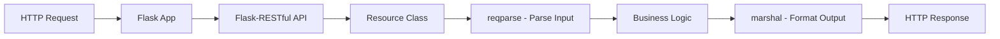
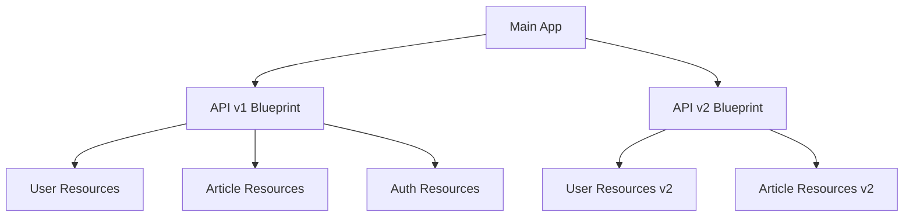

# How to Build APIs with Flask-RESTful

Author: [nawazdhandala](https://www.github.com/nawazdhandala)

Tags: Python, Flask, Flask-RESTful, REST API, Web Development, Backend

Description: Learn how to build clean, maintainable REST APIs with Flask-RESTful using resource classes, request parsing, output formatting, blueprints, and proper error handling.

---

> Flask-RESTful takes the simplicity of Flask and adds structure for building REST APIs. Instead of scattering route handlers across your codebase, you get resource classes that map directly to your API endpoints. This guide walks through everything you need to build production-ready APIs.

If you have worked with Flask before, you know how easy it is to get started. But as your API grows, things can get messy. Flask-RESTful brings order to the chaos by encouraging a resource-oriented approach that scales well.

---

## How Flask-RESTful Works



---

## Installation and Setup

Install Flask-RESTful with pip:

```bash
pip install flask flask-restful
```

Create a minimal API to verify everything works:

```python
# app.py
from flask import Flask
from flask_restful import Api, Resource

app = Flask(__name__)
api = Api(app)

# A simple resource that responds to GET requests
class HelloWorld(Resource):
    def get(self):
        return {"message": "Hello, World!"}

# Map the resource to a URL endpoint
api.add_resource(HelloWorld, "/")

if __name__ == "__main__":
    app.run(debug=True)
```

Run it and hit `http://localhost:5000` - you should see the JSON response.

---

## Resource Classes

Resources are the building blocks of your API. Each resource class maps HTTP methods to Python methods. This keeps your code organized and predictable.

```python
# resources/user.py
from flask_restful import Resource

class UserResource(Resource):
    """
    Resource for handling individual user operations.
    Each method corresponds to an HTTP verb.
    """

    def get(self, user_id):
        # GET /users/<user_id> - Retrieve a specific user
        user = find_user_by_id(user_id)
        if not user:
            return {"error": "User not found"}, 404
        return {"id": user.id, "name": user.name, "email": user.email}

    def put(self, user_id):
        # PUT /users/<user_id> - Update a user
        user = find_user_by_id(user_id)
        if not user:
            return {"error": "User not found"}, 404
        # Update logic here
        return {"message": "User updated", "id": user_id}

    def delete(self, user_id):
        # DELETE /users/<user_id> - Remove a user
        success = delete_user_by_id(user_id)
        if not success:
            return {"error": "User not found"}, 404
        return {"message": "User deleted"}, 200


class UserListResource(Resource):
    """
    Resource for handling collection-level operations.
    Separate from individual user operations for clarity.
    """

    def get(self):
        # GET /users - List all users
        users = get_all_users()
        return {"users": [{"id": u.id, "name": u.name} for u in users]}

    def post(self):
        # POST /users - Create a new user
        # We will add proper parsing in the next section
        return {"message": "User created", "id": 123}, 201
```

Register both resources with different URL patterns:

```python
# app.py
from flask import Flask
from flask_restful import Api
from resources.user import UserResource, UserListResource

app = Flask(__name__)
api = Api(app)

# Route to collection and individual resources
api.add_resource(UserListResource, "/users")
api.add_resource(UserResource, "/users/<int:user_id>")

if __name__ == "__main__":
    app.run(debug=True)
```

---

## Request Parsing with reqparse

Raw request data is messy and potentially dangerous. The `reqparse` module validates and sanitizes input before it reaches your business logic. Think of it as a bouncer for your API.

```python
# parsers/user_parser.py
from flask_restful import reqparse

def get_user_parser():
    """
    Build a parser for user creation and updates.
    Each argument defines validation rules.
    """
    parser = reqparse.RequestParser(bundle_errors=True)

    # Required string field with length validation
    parser.add_argument(
        "name",
        type=str,
        required=True,
        help="Name is required and must be a string",
        location="json"
    )

    # Email with custom validation
    parser.add_argument(
        "email",
        type=str,
        required=True,
        help="Valid email is required",
        location="json"
    )

    # Optional field with default value
    parser.add_argument(
        "role",
        type=str,
        choices=("admin", "user", "guest"),
        default="user",
        help="Role must be admin, user, or guest",
        location="json"
    )

    # Integer with range validation
    parser.add_argument(
        "age",
        type=int,
        required=False,
        location="json"
    )

    return parser
```

Use the parser in your resource:

```python
# resources/user.py
from flask_restful import Resource
from parsers.user_parser import get_user_parser

class UserListResource(Resource):
    def post(self):
        # Parse and validate the request
        parser = get_user_parser()
        args = parser.parse_args(strict=True)

        # args is now a clean dictionary with validated data
        new_user = create_user(
            name=args["name"],
            email=args["email"],
            role=args["role"],
            age=args.get("age")
        )

        return {
            "message": "User created",
            "user": {"id": new_user.id, "name": new_user.name}
        }, 201
```

### Custom Type Validators

Sometimes built-in types are not enough. Create custom validators for complex rules:

```python
# validators.py
import re
from flask_restful import inputs

def email(value):
    """
    Custom validator for email addresses.
    Raises ValueError if invalid - reqparse catches this.
    """
    pattern = r'^[a-zA-Z0-9._%+-]+@[a-zA-Z0-9.-]+\.[a-zA-Z]{2,}$'
    if not re.match(pattern, value):
        raise ValueError(f"'{value}' is not a valid email address")
    return value.lower()  # Normalize to lowercase

def password(value):
    """
    Validator for password strength.
    At least 8 chars, one uppercase, one digit.
    """
    if len(value) < 8:
        raise ValueError("Password must be at least 8 characters")
    if not re.search(r'[A-Z]', value):
        raise ValueError("Password must contain an uppercase letter")
    if not re.search(r'\d', value):
        raise ValueError("Password must contain a digit")
    return value

def positive_int(value):
    """Validator for positive integers."""
    try:
        num = int(value)
        if num <= 0:
            raise ValueError("Must be a positive integer")
        return num
    except (TypeError, ValueError):
        raise ValueError(f"'{value}' is not a valid positive integer")
```

Apply custom validators to your parser:

```python
# parsers/user_parser.py
from flask_restful import reqparse
from validators import email, password, positive_int

def get_registration_parser():
    parser = reqparse.RequestParser(bundle_errors=True)

    parser.add_argument(
        "email",
        type=email,  # Use custom validator
        required=True,
        location="json"
    )

    parser.add_argument(
        "password",
        type=password,  # Use custom validator
        required=True,
        location="json"
    )

    parser.add_argument(
        "age",
        type=positive_int,
        required=False,
        location="json"
    )

    return parser
```

---

## Output Formatting with marshal

Consistent API responses matter. The `marshal` module ensures your output always matches a defined schema, even when your internal data structures change.

```python
# schemas/user_schema.py
from flask_restful import fields

# Define the structure for user output
user_fields = {
    "id": fields.Integer,
    "name": fields.String,
    "email": fields.String,
    "role": fields.String,
    "created_at": fields.DateTime(dt_format="iso8601"),
    # Nested object
    "profile": fields.Nested({
        "bio": fields.String,
        "avatar_url": fields.String(attribute="avatar")
    })
}

# Simpler schema for list views
user_summary_fields = {
    "id": fields.Integer,
    "name": fields.String,
    "role": fields.String
}

# Wrapper for paginated responses
user_list_fields = {
    "users": fields.List(fields.Nested(user_summary_fields)),
    "total": fields.Integer,
    "page": fields.Integer,
    "per_page": fields.Integer
}
```

Apply marshalling with the decorator:

```python
# resources/user.py
from flask_restful import Resource, marshal_with, marshal
from schemas.user_schema import user_fields, user_list_fields

class UserResource(Resource):
    @marshal_with(user_fields)
    def get(self, user_id):
        """
        The decorator automatically formats the returned object.
        Even if user has extra fields, only defined ones appear.
        """
        user = find_user_by_id(user_id)
        if not user:
            # Return error without marshalling
            return {"error": "User not found"}, 404
        return user  # Object is automatically formatted


class UserListResource(Resource):
    def get(self):
        """
        For conditional marshalling, use marshal() directly.
        This gives more control over the response.
        """
        page = request.args.get("page", 1, type=int)
        per_page = request.args.get("per_page", 20, type=int)

        users, total = get_users_paginated(page, per_page)

        result = {
            "users": users,
            "total": total,
            "page": page,
            "per_page": per_page
        }

        return marshal(result, user_list_fields)
```

### Advanced Field Types

Flask-RESTful provides several field types for complex scenarios:

```python
# schemas/advanced_fields.py
from flask_restful import fields

class StatusField(fields.Raw):
    """
    Custom field that transforms status codes to readable strings.
    """
    STATUS_MAP = {
        0: "inactive",
        1: "active",
        2: "suspended"
    }

    def format(self, value):
        return self.STATUS_MAP.get(value, "unknown")


class FullNameField(fields.Raw):
    """
    Custom field that combines first and last name.
    """
    def format(self, value):
        return f"{value.first_name} {value.last_name}"


# Using advanced fields
article_fields = {
    "id": fields.Integer,
    "title": fields.String,
    "body": fields.String,
    "status": StatusField,
    # URL field generates API URLs
    "url": fields.Url("article_resource", absolute=True),
    # Attribute mapping - internal name differs from output
    "author_name": fields.String(attribute="author.name"),
    # Default values for missing data
    "views": fields.Integer(default=0),
    # Conditional field - only appears if not None
    "published_at": fields.DateTime(dt_format="iso8601")
}
```

---

## Organizing with Blueprints

As your API grows, a single file becomes unmanageable. Blueprints let you split your API into logical modules that can be developed and tested independently.



Project structure for a modular API:

```
project/
├── app.py
├── config.py
├── api/
│   ├── __init__.py
│   └── v1/
│       ├── __init__.py
│       ├── resources/
│       │   ├── __init__.py
│       │   ├── users.py
│       │   ├── articles.py
│       │   └── auth.py
│       ├── schemas/
│       │   ├── __init__.py
│       │   ├── user_schema.py
│       │   └── article_schema.py
│       └── parsers/
│           ├── __init__.py
│           └── user_parser.py
└── models/
    ├── __init__.py
    └── user.py
```

Create the v1 blueprint:

```python
# api/v1/__init__.py
from flask import Blueprint
from flask_restful import Api

# Create blueprint with URL prefix
v1_bp = Blueprint("api_v1", __name__, url_prefix="/api/v1")
api_v1 = Api(v1_bp)

# Import and register resources
from api.v1.resources.users import UserResource, UserListResource
from api.v1.resources.articles import ArticleResource, ArticleListResource
from api.v1.resources.auth import LoginResource, RegisterResource

# User endpoints
api_v1.add_resource(UserListResource, "/users")
api_v1.add_resource(UserResource, "/users/<int:user_id>")

# Article endpoints
api_v1.add_resource(ArticleListResource, "/articles")
api_v1.add_resource(ArticleResource, "/articles/<int:article_id>")

# Auth endpoints
api_v1.add_resource(LoginResource, "/auth/login")
api_v1.add_resource(RegisterResource, "/auth/register")
```

Register the blueprint in your main app:

```python
# app.py
from flask import Flask
from config import Config

def create_app(config_class=Config):
    """
    Application factory pattern.
    Creates and configures the Flask app.
    """
    app = Flask(__name__)
    app.config.from_object(config_class)

    # Initialize extensions
    from models import db
    db.init_app(app)

    # Register blueprints
    from api.v1 import v1_bp
    app.register_blueprint(v1_bp)

    # You can add v2 later without touching v1
    # from api.v2 import v2_bp
    # app.register_blueprint(v2_bp)

    return app

if __name__ == "__main__":
    app = create_app()
    app.run(debug=True)
```

---

## Error Handling

Good error handling makes your API predictable and debuggable. Flask-RESTful lets you define custom error handlers that return consistent JSON responses.

```python
# errors.py
from flask_restful import Api

class APIError(Exception):
    """Base class for API errors."""
    def __init__(self, message, status_code=400, payload=None):
        super().__init__()
        self.message = message
        self.status_code = status_code
        self.payload = payload

class NotFoundError(APIError):
    """Resource not found."""
    def __init__(self, resource_type, resource_id):
        super().__init__(
            message=f"{resource_type} with id {resource_id} not found",
            status_code=404
        )

class ValidationError(APIError):
    """Input validation failed."""
    def __init__(self, errors):
        super().__init__(
            message="Validation failed",
            status_code=400,
            payload={"errors": errors}
        )

class AuthenticationError(APIError):
    """Authentication required or failed."""
    def __init__(self, message="Authentication required"):
        super().__init__(message=message, status_code=401)

class AuthorizationError(APIError):
    """User lacks permission."""
    def __init__(self, message="Permission denied"):
        super().__init__(message=message, status_code=403)
```

Register error handlers with the API:

```python
# api/v1/__init__.py
from flask import Blueprint, jsonify
from flask_restful import Api
from errors import APIError, NotFoundError, ValidationError

v1_bp = Blueprint("api_v1", __name__, url_prefix="/api/v1")
api_v1 = Api(v1_bp)

@v1_bp.errorhandler(APIError)
def handle_api_error(error):
    """
    Handle all custom API errors.
    Returns consistent JSON structure.
    """
    response = {
        "error": True,
        "message": error.message
    }
    if error.payload:
        response.update(error.payload)
    return jsonify(response), error.status_code

@v1_bp.errorhandler(404)
def handle_not_found(error):
    """Handle Flask 404 errors."""
    return jsonify({
        "error": True,
        "message": "Resource not found"
    }), 404

@v1_bp.errorhandler(500)
def handle_server_error(error):
    """Handle unexpected server errors."""
    # Log the actual error for debugging
    app.logger.error(f"Server error: {error}")
    return jsonify({
        "error": True,
        "message": "Internal server error"
    }), 500
```

Use custom errors in your resources:

```python
# api/v1/resources/users.py
from flask_restful import Resource
from errors import NotFoundError, ValidationError
from models.user import User

class UserResource(Resource):
    def get(self, user_id):
        user = User.query.get(user_id)
        if not user:
            # Raise custom error - handler catches it
            raise NotFoundError("User", user_id)
        return {"id": user.id, "name": user.name}

    def put(self, user_id):
        user = User.query.get(user_id)
        if not user:
            raise NotFoundError("User", user_id)

        parser = get_user_parser()
        args = parser.parse_args()

        # Custom validation beyond reqparse
        if User.query.filter_by(email=args["email"]).first():
            if User.query.filter_by(email=args["email"]).first().id != user_id:
                raise ValidationError({"email": "Email already registered"})

        user.name = args["name"]
        user.email = args["email"]
        db.session.commit()

        return {"message": "User updated", "id": user_id}
```

---

## Complete CRUD Example

Let us put everything together with a complete task management API. This example shows how all the pieces connect in a real application.

```python
# models/task.py
from datetime import datetime
from flask_sqlalchemy import SQLAlchemy

db = SQLAlchemy()

class Task(db.Model):
    """Task model for the database."""
    __tablename__ = "tasks"

    id = db.Column(db.Integer, primary_key=True)
    title = db.Column(db.String(200), nullable=False)
    description = db.Column(db.Text)
    status = db.Column(db.String(20), default="pending")
    priority = db.Column(db.Integer, default=1)
    due_date = db.Column(db.DateTime)
    created_at = db.Column(db.DateTime, default=datetime.utcnow)
    updated_at = db.Column(db.DateTime, default=datetime.utcnow, onupdate=datetime.utcnow)
    user_id = db.Column(db.Integer, db.ForeignKey("users.id"))

    def __repr__(self):
        return f"<Task {self.id}: {self.title}>"
```

Define the schema for output formatting:

```python
# api/v1/schemas/task_schema.py
from flask_restful import fields

# Full task details
task_fields = {
    "id": fields.Integer,
    "title": fields.String,
    "description": fields.String,
    "status": fields.String,
    "priority": fields.Integer,
    "due_date": fields.DateTime(dt_format="iso8601"),
    "created_at": fields.DateTime(dt_format="iso8601"),
    "updated_at": fields.DateTime(dt_format="iso8601"),
    "user_id": fields.Integer
}

# Summary for list views
task_summary_fields = {
    "id": fields.Integer,
    "title": fields.String,
    "status": fields.String,
    "priority": fields.Integer,
    "due_date": fields.DateTime(dt_format="iso8601")
}

# Paginated list response
task_list_fields = {
    "tasks": fields.List(fields.Nested(task_summary_fields)),
    "total": fields.Integer,
    "page": fields.Integer,
    "per_page": fields.Integer,
    "pages": fields.Integer
}
```

Create the request parser:

```python
# api/v1/parsers/task_parser.py
from flask_restful import reqparse
from datetime import datetime

def valid_date(value):
    """Parse and validate ISO date string."""
    try:
        return datetime.fromisoformat(value.replace("Z", "+00:00"))
    except ValueError:
        raise ValueError(f"'{value}' is not a valid ISO date")

def get_task_parser():
    """Parser for creating and updating tasks."""
    parser = reqparse.RequestParser(bundle_errors=True)

    parser.add_argument(
        "title",
        type=str,
        required=True,
        trim=True,
        help="Title is required",
        location="json"
    )

    parser.add_argument(
        "description",
        type=str,
        required=False,
        location="json"
    )

    parser.add_argument(
        "status",
        type=str,
        choices=("pending", "in_progress", "completed", "cancelled"),
        default="pending",
        location="json"
    )

    parser.add_argument(
        "priority",
        type=int,
        choices=(1, 2, 3, 4, 5),
        default=1,
        help="Priority must be 1-5",
        location="json"
    )

    parser.add_argument(
        "due_date",
        type=valid_date,
        required=False,
        location="json"
    )

    return parser

def get_task_list_parser():
    """Parser for filtering and pagination."""
    parser = reqparse.RequestParser()

    parser.add_argument(
        "page",
        type=int,
        default=1,
        location="args"
    )

    parser.add_argument(
        "per_page",
        type=int,
        default=20,
        choices=range(1, 101),
        location="args"
    )

    parser.add_argument(
        "status",
        type=str,
        choices=("pending", "in_progress", "completed", "cancelled"),
        location="args"
    )

    parser.add_argument(
        "priority",
        type=int,
        choices=(1, 2, 3, 4, 5),
        location="args"
    )

    parser.add_argument(
        "sort",
        type=str,
        choices=("created_at", "due_date", "priority", "title"),
        default="created_at",
        location="args"
    )

    parser.add_argument(
        "order",
        type=str,
        choices=("asc", "desc"),
        default="desc",
        location="args"
    )

    return parser
```

Build the resource classes:

```python
# api/v1/resources/tasks.py
from flask import g
from flask_restful import Resource, marshal, marshal_with
from models.task import Task, db
from api.v1.schemas.task_schema import task_fields, task_list_fields
from api.v1.parsers.task_parser import get_task_parser, get_task_list_parser
from errors import NotFoundError, AuthorizationError

class TaskListResource(Resource):
    """Handle collection-level task operations."""

    def get(self):
        """
        GET /tasks - List tasks with filtering and pagination.
        Supports status, priority filters and sorting.
        """
        parser = get_task_list_parser()
        args = parser.parse_args()

        # Start with base query
        query = Task.query.filter_by(user_id=g.current_user.id)

        # Apply filters
        if args["status"]:
            query = query.filter_by(status=args["status"])
        if args["priority"]:
            query = query.filter_by(priority=args["priority"])

        # Apply sorting
        sort_column = getattr(Task, args["sort"])
        if args["order"] == "desc":
            sort_column = sort_column.desc()
        query = query.order_by(sort_column)

        # Paginate results
        pagination = query.paginate(
            page=args["page"],
            per_page=args["per_page"],
            error_out=False
        )

        result = {
            "tasks": pagination.items,
            "total": pagination.total,
            "page": pagination.page,
            "per_page": pagination.per_page,
            "pages": pagination.pages
        }

        return marshal(result, task_list_fields)

    def post(self):
        """
        POST /tasks - Create a new task.
        Validates input and returns the created task.
        """
        parser = get_task_parser()
        args = parser.parse_args(strict=True)

        task = Task(
            title=args["title"],
            description=args["description"],
            status=args["status"],
            priority=args["priority"],
            due_date=args["due_date"],
            user_id=g.current_user.id
        )

        db.session.add(task)
        db.session.commit()

        return marshal(task, task_fields), 201


class TaskResource(Resource):
    """Handle individual task operations."""

    def _get_task_or_404(self, task_id):
        """Helper to get task with ownership check."""
        task = Task.query.get(task_id)
        if not task:
            raise NotFoundError("Task", task_id)
        if task.user_id != g.current_user.id:
            raise AuthorizationError("You do not own this task")
        return task

    @marshal_with(task_fields)
    def get(self, task_id):
        """
        GET /tasks/<id> - Retrieve a specific task.
        Returns full task details.
        """
        return self._get_task_or_404(task_id)

    @marshal_with(task_fields)
    def put(self, task_id):
        """
        PUT /tasks/<id> - Update a task completely.
        All fields are replaced with new values.
        """
        task = self._get_task_or_404(task_id)

        parser = get_task_parser()
        args = parser.parse_args(strict=True)

        task.title = args["title"]
        task.description = args["description"]
        task.status = args["status"]
        task.priority = args["priority"]
        task.due_date = args["due_date"]

        db.session.commit()

        return task

    @marshal_with(task_fields)
    def patch(self, task_id):
        """
        PATCH /tasks/<id> - Partial update.
        Only provided fields are updated.
        """
        task = self._get_task_or_404(task_id)

        # Allow partial updates by not requiring fields
        parser = get_task_parser()
        for arg in parser.args:
            arg.required = False

        args = parser.parse_args()

        # Only update fields that were provided
        if args["title"] is not None:
            task.title = args["title"]
        if args["description"] is not None:
            task.description = args["description"]
        if args["status"] is not None:
            task.status = args["status"]
        if args["priority"] is not None:
            task.priority = args["priority"]
        if args["due_date"] is not None:
            task.due_date = args["due_date"]

        db.session.commit()

        return task

    def delete(self, task_id):
        """
        DELETE /tasks/<id> - Remove a task.
        Returns 204 No Content on success.
        """
        task = self._get_task_or_404(task_id)

        db.session.delete(task)
        db.session.commit()

        return "", 204
```

Wire everything together:

```python
# api/v1/__init__.py
from flask import Blueprint
from flask_restful import Api

v1_bp = Blueprint("api_v1", __name__, url_prefix="/api/v1")
api_v1 = Api(v1_bp)

# Import resources
from api.v1.resources.tasks import TaskResource, TaskListResource

# Register task endpoints
api_v1.add_resource(TaskListResource, "/tasks")
api_v1.add_resource(TaskResource, "/tasks/<int:task_id>")
```

Main application file:

```python
# app.py
from flask import Flask
from flask_sqlalchemy import SQLAlchemy
from models.task import db

def create_app():
    app = Flask(__name__)

    # Configuration
    app.config["SQLALCHEMY_DATABASE_URI"] = "sqlite:///tasks.db"
    app.config["SQLALCHEMY_TRACK_MODIFICATIONS"] = False

    # Initialize database
    db.init_app(app)

    # Register API blueprint
    from api.v1 import v1_bp
    app.register_blueprint(v1_bp)

    # Create tables
    with app.app_context():
        db.create_all()

    return app

if __name__ == "__main__":
    app = create_app()
    app.run(debug=True)
```

---

## Testing the API

Test your endpoints with curl or any HTTP client:

```bash
# Create a task
curl -X POST http://localhost:5000/api/v1/tasks \
  -H "Content-Type: application/json" \
  -d '{"title": "Write documentation", "priority": 3, "status": "pending"}'

# List all tasks
curl http://localhost:5000/api/v1/tasks

# List with filters
curl "http://localhost:5000/api/v1/tasks?status=pending&priority=3&sort=due_date&order=asc"

# Get a specific task
curl http://localhost:5000/api/v1/tasks/1

# Update a task
curl -X PUT http://localhost:5000/api/v1/tasks/1 \
  -H "Content-Type: application/json" \
  -d '{"title": "Write better documentation", "priority": 5, "status": "in_progress"}'

# Partial update
curl -X PATCH http://localhost:5000/api/v1/tasks/1 \
  -H "Content-Type: application/json" \
  -d '{"status": "completed"}'

# Delete a task
curl -X DELETE http://localhost:5000/api/v1/tasks/1
```

---

## Best Practices

| Practice | Why It Matters |
|----------|----------------|
| Use resource classes | Keeps HTTP methods organized together |
| Validate with reqparse | Prevents bad data from reaching your logic |
| Format with marshal | Ensures consistent output structure |
| Organize with blueprints | Makes large APIs manageable |
| Custom error handlers | Returns predictable error responses |
| Version your API | Allows breaking changes without breaking clients |

---

## Conclusion

Flask-RESTful brings structure to Flask APIs without adding complexity. The resource-oriented approach makes your code easier to understand and maintain. With proper request parsing, output formatting, and error handling, you can build APIs that are both robust and pleasant to work with.

The patterns shown here scale well from small projects to large applications. Start simple, add complexity only when needed, and keep your resources focused on single responsibilities.

---

*Building APIs that need monitoring? [OneUptime](https://oneuptime.com) provides real-time API monitoring with alerting, so you know when your endpoints have issues before your users do.*

**Related Reading:**
- [How to Implement Rate Limiting in FastAPI Without External Services](https://oneuptime.com/blog/post/2025-01-06-fastapi-rate-limiting/view)
- [Structured Logging with OpenTelemetry in Python](https://oneuptime.com/blog/post/2025-01-06-python-structured-logging-opentelemetry/view)
