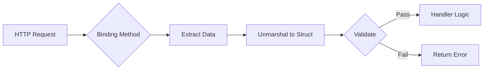

# How to Use Gin Binding for Request Validation

Author: [nawazdhandala](https://www.github.com/nawazdhandala)

Tags: Go, Gin, API, Validation, Web Development

Description: Master request validation in Gin using binding tags, validators, and custom error handling to build robust Go APIs.

---

When building APIs with Gin, you need to validate incoming requests before processing them. Manually checking every field is tedious and error-prone. Gin's binding system handles this automatically - you define validation rules on your structs, and Gin enforces them at the point of binding. This guide covers binding tags, validation rules, custom validators, and proper error handling.

## How Gin Binding Works

Gin uses struct tags to define how data should be bound from requests and what validation rules to apply. The binding happens when you call methods like `ShouldBind` or `MustBind`.



## Binding Tags: json, form, uri

Different request types need different binding tags. Here's when to use each one.

### JSON Body Binding

Use the `json` tag for JSON request bodies. This is the most common case for REST APIs.

```go
// CreateUserRequest binds JSON body fields to struct
type CreateUserRequest struct {
    Name     string `json:"name" binding:"required"`
    Email    string `json:"email" binding:"required,email"`
    Age      int    `json:"age" binding:"required,gte=18,lte=120"`
}

func CreateUser(c *gin.Context) {
    var req CreateUserRequest

    // ShouldBindJSON extracts JSON body and validates
    if err := c.ShouldBindJSON(&req); err != nil {
        c.JSON(http.StatusBadRequest, gin.H{"error": err.Error()})
        return
    }

    // Validation passed - req is populated and valid
    c.JSON(http.StatusOK, gin.H{"message": "User created", "name": req.Name})
}
```

### Form Data Binding

Use the `form` tag for URL-encoded form data or multipart forms.

```go
// LoginRequest binds form data from POST requests
type LoginRequest struct {
    Username string `form:"username" binding:"required,min=3,max=50"`
    Password string `form:"password" binding:"required,min=8"`
    Remember bool   `form:"remember"`
}

func Login(c *gin.Context) {
    var req LoginRequest

    // ShouldBind auto-detects content type (form, multipart, etc.)
    if err := c.ShouldBind(&req); err != nil {
        c.JSON(http.StatusBadRequest, gin.H{"error": err.Error()})
        return
    }

    // Process login
    c.JSON(http.StatusOK, gin.H{"username": req.Username})
}
```

### URI Parameter Binding

Use the `uri` tag for path parameters defined in your routes.

```go
// GetUserRequest binds path parameters like /users/:id
type GetUserRequest struct {
    ID int `uri:"id" binding:"required,gt=0"`
}

func GetUser(c *gin.Context) {
    var req GetUserRequest

    // ShouldBindUri extracts values from URL path
    if err := c.ShouldBindUri(&req); err != nil {
        c.JSON(http.StatusBadRequest, gin.H{"error": "Invalid user ID"})
        return
    }

    // req.ID is now an integer, validated to be greater than 0
    c.JSON(http.StatusOK, gin.H{"user_id": req.ID})
}

// Route definition
// router.GET("/users/:id", GetUser)
```

### Query Parameter Binding

Use the `form` tag with `ShouldBindQuery` for URL query parameters.

```go
// ListUsersRequest binds query params like ?page=1&limit=20
type ListUsersRequest struct {
    Page   int    `form:"page" binding:"required,gte=1"`
    Limit  int    `form:"limit" binding:"required,gte=1,lte=100"`
    Sort   string `form:"sort" binding:"omitempty,oneof=asc desc"`
    Search string `form:"search" binding:"omitempty,max=100"`
}

func ListUsers(c *gin.Context) {
    var req ListUsersRequest

    // ShouldBindQuery only binds from query string
    if err := c.ShouldBindQuery(&req); err != nil {
        c.JSON(http.StatusBadRequest, gin.H{"error": err.Error()})
        return
    }

    c.JSON(http.StatusOK, gin.H{
        "page":  req.Page,
        "limit": req.Limit,
    })
}
```

### Header Binding

Use the `header` tag for HTTP headers.

```go
// AuthRequest binds request headers
type AuthRequest struct {
    Authorization string `header:"Authorization" binding:"required"`
    ContentType   string `header:"Content-Type"`
    UserAgent     string `header:"User-Agent"`
}

func HandleAuth(c *gin.Context) {
    var req AuthRequest

    if err := c.ShouldBindHeader(&req); err != nil {
        c.JSON(http.StatusUnauthorized, gin.H{"error": "Missing authorization"})
        return
    }

    c.JSON(http.StatusOK, gin.H{"auth": req.Authorization})
}
```

## ShouldBind vs MustBind

Gin offers two binding styles. The difference is how they handle errors.

| Method | On Error | Use Case |
|--------|----------|----------|
| `ShouldBind*` | Returns error, you decide response | APIs where you control error format |
| `MustBind*` | Aborts with 400, writes error to response | Quick prototypes, simple cases |

### ShouldBind - You Handle Errors

```go
func CreateOrder(c *gin.Context) {
    var req OrderRequest

    // ShouldBindJSON returns error - you decide what to do
    if err := c.ShouldBindJSON(&req); err != nil {
        // Custom error response format
        c.JSON(http.StatusBadRequest, gin.H{
            "success": false,
            "error":   "Validation failed",
            "details": err.Error(),
        })
        return
    }

    // Continue processing
}
```

### MustBind - Automatic Error Response

```go
func CreateOrder(c *gin.Context) {
    var req OrderRequest

    // MustBindJSON calls c.AbortWithError(400, err) on failure
    // Response is already written - cannot customize
    if err := c.MustBindJSON(&req); err != nil {
        // Request already aborted with 400
        return
    }

    // Continue processing
}
```

**Recommendation:** Use `ShouldBind*` methods. They give you control over error responses, which matters for production APIs where you need consistent error formats.

## Validation Tags Reference

Gin uses the `go-playground/validator` package. Here are the most useful validation tags.

### String Validations

```go
type StringExamples struct {
    // Length constraints
    Name     string `binding:"required,min=2,max=100"`
    Code     string `binding:"len=6"`

    // Content patterns
    Email    string `binding:"email"`
    URL      string `binding:"url"`
    UUID     string `binding:"uuid"`
    Alpha    string `binding:"alpha"`         // letters only
    Alphanum string `binding:"alphanum"`      // letters and numbers

    // Enum/whitelist
    Status   string `binding:"oneof=active inactive pending"`

    // Optional field with validation when present
    Nickname string `binding:"omitempty,min=2,max=30"`
}
```

### Numeric Validations

```go
type NumericExamples struct {
    // Range constraints
    Age      int     `binding:"required,gte=0,lte=150"`
    Price    float64 `binding:"required,gt=0"`
    Quantity int     `binding:"required,min=1,max=1000"`

    // Comparison operators
    // gt  = greater than
    // gte = greater than or equal
    // lt  = less than
    // lte = less than or equal
    // eq  = equal
    // ne  = not equal
}
```

### Slice and Map Validations

```go
type CollectionExamples struct {
    // Slice length constraints
    Tags     []string          `binding:"required,min=1,max=10,dive,min=1,max=50"`
    Numbers  []int             `binding:"required,dive,gte=0"`

    // Map validation
    Metadata map[string]string `binding:"required,dive,keys,min=1,endkeys,required"`
}
```

The `dive` tag tells the validator to descend into the slice or map and validate each element.

### Time and Date Validations

```go
type TimeExamples struct {
    // Using custom format with time.Time
    StartDate time.Time `binding:"required"`
    EndDate   time.Time `binding:"required,gtfield=StartDate"`
}
```

### Cross-Field Validations

```go
type PasswordReset struct {
    Password        string `binding:"required,min=8"`
    ConfirmPassword string `binding:"required,eqfield=Password"`
}

type DateRange struct {
    StartDate time.Time `binding:"required"`
    EndDate   time.Time `binding:"required,gtfield=StartDate"`
}

type PriceRange struct {
    MinPrice float64 `binding:"required,gte=0"`
    MaxPrice float64 `binding:"required,gtfield=MinPrice"`
}
```

## Custom Validators

Built-in validators cover common cases, but you'll need custom ones for business rules.

### Registering a Custom Validator

```go
package main

import (
    "regexp"

    "github.com/gin-gonic/gin"
    "github.com/gin-gonic/gin/binding"
    "github.com/go-playground/validator/v10"
)

// phoneValidator checks if a string is a valid phone number format
var phoneValidator validator.Func = func(fl validator.FieldLevel) bool {
    phone, ok := fl.Field().Interface().(string)
    if !ok {
        return false
    }

    // Simple E.164 format check: +1234567890
    match, _ := regexp.MatchString(`^\+[1-9]\d{6,14}$`, phone)
    return match
}

// slugValidator ensures a string is URL-safe
var slugValidator validator.Func = func(fl validator.FieldLevel) bool {
    slug, ok := fl.Field().Interface().(string)
    if !ok {
        return false
    }

    match, _ := regexp.MatchString(`^[a-z0-9]+(?:-[a-z0-9]+)*$`, slug)
    return match
}

func main() {
    router := gin.Default()

    // Get the validator engine and register custom validators
    if v, ok := binding.Validator.Engine().(*validator.Validate); ok {
        v.RegisterValidation("phone", phoneValidator)
        v.RegisterValidation("slug", slugValidator)
    }

    router.POST("/contacts", CreateContact)
    router.Run(":8080")
}

// Now you can use the custom validators in your structs
type ContactRequest struct {
    Name  string `json:"name" binding:"required"`
    Phone string `json:"phone" binding:"required,phone"`
    Slug  string `json:"slug" binding:"required,slug"`
}

func CreateContact(c *gin.Context) {
    var req ContactRequest

    if err := c.ShouldBindJSON(&req); err != nil {
        c.JSON(http.StatusBadRequest, gin.H{"error": err.Error()})
        return
    }

    c.JSON(http.StatusOK, gin.H{"contact": req})
}
```

### Custom Validator with Parameters

```go
// notInListValidator rejects values that appear in a blacklist
// Usage: binding:"notinlist=admin root system"
var notInListValidator validator.Func = func(fl validator.FieldLevel) bool {
    value := fl.Field().String()
    param := fl.Param() // "admin root system"

    blacklist := strings.Split(param, " ")
    for _, blocked := range blacklist {
        if strings.EqualFold(value, blocked) {
            return false
        }
    }
    return true
}

// Register with parameter support
v.RegisterValidation("notinlist", notInListValidator)

// Usage in struct
type UserRequest struct {
    Username string `json:"username" binding:"required,notinlist=admin root system"`
}
```

### Struct-Level Validation

Sometimes validation depends on multiple fields together.

```go
// RegisterStructValidation for complex cross-field rules
func RegisterCustomValidations(v *validator.Validate) {
    v.RegisterStructValidation(orderValidation, OrderRequest{})
}

type OrderRequest struct {
    Type     string  `json:"type" binding:"required,oneof=standard express"`
    Amount   float64 `json:"amount" binding:"required,gt=0"`
    Discount float64 `json:"discount" binding:"gte=0"`
}

// orderValidation checks business rules across fields
func orderValidation(sl validator.StructLevel) {
    order := sl.Current().Interface().(OrderRequest)

    // Express orders must be at least $50
    if order.Type == "express" && order.Amount < 50 {
        sl.ReportError(order.Amount, "Amount", "amount", "express_minimum", "")
    }

    // Discount cannot exceed 50% of amount
    if order.Discount > order.Amount*0.5 {
        sl.ReportError(order.Discount, "Discount", "discount", "max_discount", "")
    }
}
```

## Better Error Messages

Default error messages from the validator are not user-friendly. Here's how to improve them.

### Extracting Validation Errors

```go
import (
    "github.com/go-playground/validator/v10"
)

// ValidationError represents a single field error
type ValidationError struct {
    Field   string `json:"field"`
    Message string `json:"message"`
}

// formatValidationErrors converts validator errors to readable messages
func formatValidationErrors(err error) []ValidationError {
    var errors []ValidationError

    // Check if it's a validation error
    validationErrors, ok := err.(validator.ValidationErrors)
    if !ok {
        return []ValidationError{{Field: "unknown", Message: err.Error()}}
    }

    for _, e := range validationErrors {
        errors = append(errors, ValidationError{
            Field:   toSnakeCase(e.Field()),
            Message: getErrorMessage(e),
        })
    }

    return errors
}

// getErrorMessage returns a human-readable message for each validation tag
func getErrorMessage(e validator.FieldError) string {
    switch e.Tag() {
    case "required":
        return "This field is required"
    case "email":
        return "Invalid email format"
    case "min":
        return fmt.Sprintf("Must be at least %s characters", e.Param())
    case "max":
        return fmt.Sprintf("Must be at most %s characters", e.Param())
    case "gte":
        return fmt.Sprintf("Must be greater than or equal to %s", e.Param())
    case "lte":
        return fmt.Sprintf("Must be less than or equal to %s", e.Param())
    case "oneof":
        return fmt.Sprintf("Must be one of: %s", e.Param())
    case "eqfield":
        return fmt.Sprintf("Must match %s", e.Param())
    case "phone":
        return "Invalid phone number format (use E.164: +1234567890)"
    case "slug":
        return "Must be a valid URL slug (lowercase letters, numbers, hyphens)"
    default:
        return fmt.Sprintf("Failed validation: %s", e.Tag())
    }
}

// toSnakeCase converts PascalCase to snake_case for JSON field names
func toSnakeCase(s string) string {
    var result []rune
    for i, r := range s {
        if i > 0 && r >= 'A' && r <= 'Z' {
            result = append(result, '_')
        }
        result = append(result, r)
    }
    return strings.ToLower(string(result))
}
```

### Using Formatted Errors in Handlers

```go
func CreateUser(c *gin.Context) {
    var req CreateUserRequest

    if err := c.ShouldBindJSON(&req); err != nil {
        c.JSON(http.StatusBadRequest, gin.H{
            "success": false,
            "errors":  formatValidationErrors(err),
        })
        return
    }

    c.JSON(http.StatusCreated, gin.H{"success": true, "user": req})
}
```

Example response for invalid input:

```json
{
  "success": false,
  "errors": [
    {"field": "email", "message": "Invalid email format"},
    {"field": "age", "message": "Must be greater than or equal to 18"}
  ]
}
```

## Combining Multiple Binding Sources

Real-world endpoints often need data from multiple sources - path parameters, query strings, headers, and body.

```go
// UpdateArticleRequest combines URI, query, and body binding
type UpdateArticleURI struct {
    ID int `uri:"id" binding:"required,gt=0"`
}

type UpdateArticleQuery struct {
    Version int `form:"version" binding:"required,gte=1"`
}

type UpdateArticleBody struct {
    Title   string   `json:"title" binding:"required,min=5,max=200"`
    Content string   `json:"content" binding:"required,min=50"`
    Tags    []string `json:"tags" binding:"required,min=1,max=5,dive,min=2,max=30"`
}

func UpdateArticle(c *gin.Context) {
    var uri UpdateArticleURI
    var query UpdateArticleQuery
    var body UpdateArticleBody

    // Bind URI parameters first
    if err := c.ShouldBindUri(&uri); err != nil {
        c.JSON(http.StatusBadRequest, gin.H{
            "error":  "Invalid article ID",
            "details": formatValidationErrors(err),
        })
        return
    }

    // Then bind query parameters
    if err := c.ShouldBindQuery(&query); err != nil {
        c.JSON(http.StatusBadRequest, gin.H{
            "error":  "Invalid query parameters",
            "details": formatValidationErrors(err),
        })
        return
    }

    // Finally bind JSON body
    if err := c.ShouldBindJSON(&body); err != nil {
        c.JSON(http.StatusBadRequest, gin.H{
            "error":  "Invalid request body",
            "details": formatValidationErrors(err),
        })
        return
    }

    // All validations passed - process the update
    c.JSON(http.StatusOK, gin.H{
        "message":    "Article updated",
        "article_id": uri.ID,
        "version":    query.Version,
        "title":      body.Title,
    })
}

// Route: router.PUT("/articles/:id", UpdateArticle)
// Example: PUT /articles/42?version=3
// Body: {"title": "New Title", "content": "...", "tags": ["go", "gin"]}
```

### Middleware for Common Validations

Extract repeated validations into middleware.

```go
// PaginationParams holds common pagination fields
type PaginationParams struct {
    Page  int `form:"page" binding:"omitempty,gte=1"`
    Limit int `form:"limit" binding:"omitempty,gte=1,lte=100"`
}

// PaginationMiddleware extracts and validates pagination params
func PaginationMiddleware() gin.HandlerFunc {
    return func(c *gin.Context) {
        var params PaginationParams

        if err := c.ShouldBindQuery(&params); err != nil {
            c.AbortWithStatusJSON(http.StatusBadRequest, gin.H{
                "error": "Invalid pagination parameters",
            })
            return
        }

        // Set defaults
        if params.Page == 0 {
            params.Page = 1
        }
        if params.Limit == 0 {
            params.Limit = 20
        }

        // Store in context for handlers to use
        c.Set("pagination", params)
        c.Next()
    }
}

// Handler retrieves pagination from context
func ListArticles(c *gin.Context) {
    pagination := c.MustGet("pagination").(PaginationParams)

    c.JSON(http.StatusOK, gin.H{
        "page":  pagination.Page,
        "limit": pagination.Limit,
    })
}
```

## Complete Example

Here's a production-ready setup combining everything.

```go
package main

import (
    "fmt"
    "net/http"
    "regexp"
    "strings"

    "github.com/gin-gonic/gin"
    "github.com/gin-gonic/gin/binding"
    "github.com/go-playground/validator/v10"
)

func main() {
    router := gin.Default()

    // Register custom validators
    registerCustomValidators()

    // Routes
    api := router.Group("/api/v1")
    {
        api.POST("/users", CreateUser)
        api.GET("/users/:id", GetUser)
        api.PUT("/users/:id", UpdateUser)
        api.GET("/users", PaginationMiddleware(), ListUsers)
    }

    router.Run(":8080")
}

func registerCustomValidators() {
    if v, ok := binding.Validator.Engine().(*validator.Validate); ok {
        // Phone number validation
        v.RegisterValidation("phone", func(fl validator.FieldLevel) bool {
            phone := fl.Field().String()
            match, _ := regexp.MatchString(`^\+[1-9]\d{6,14}$`, phone)
            return match
        })

        // Username validation - alphanumeric with underscores
        v.RegisterValidation("username", func(fl validator.FieldLevel) bool {
            username := fl.Field().String()
            match, _ := regexp.MatchString(`^[a-zA-Z][a-zA-Z0-9_]{2,29}$`, username)
            return match
        })
    }
}

// Request structs
type CreateUserRequest struct {
    Username string `json:"username" binding:"required,username"`
    Email    string `json:"email" binding:"required,email"`
    Phone    string `json:"phone" binding:"omitempty,phone"`
    Password string `json:"password" binding:"required,min=8,max=72"`
}

type GetUserURI struct {
    ID int `uri:"id" binding:"required,gt=0"`
}

type UpdateUserRequest struct {
    Email string `json:"email" binding:"omitempty,email"`
    Phone string `json:"phone" binding:"omitempty,phone"`
}

type PaginationParams struct {
    Page   int    `form:"page" binding:"omitempty,gte=1"`
    Limit  int    `form:"limit" binding:"omitempty,gte=1,lte=100"`
    Search string `form:"search" binding:"omitempty,max=100"`
}

// Handlers
func CreateUser(c *gin.Context) {
    var req CreateUserRequest

    if err := c.ShouldBindJSON(&req); err != nil {
        respondWithValidationError(c, err)
        return
    }

    c.JSON(http.StatusCreated, gin.H{
        "success": true,
        "user": gin.H{
            "username": req.Username,
            "email":    req.Email,
        },
    })
}

func GetUser(c *gin.Context) {
    var uri GetUserURI

    if err := c.ShouldBindUri(&uri); err != nil {
        respondWithValidationError(c, err)
        return
    }

    c.JSON(http.StatusOK, gin.H{
        "success": true,
        "user_id": uri.ID,
    })
}

func UpdateUser(c *gin.Context) {
    var uri GetUserURI
    var body UpdateUserRequest

    if err := c.ShouldBindUri(&uri); err != nil {
        respondWithValidationError(c, err)
        return
    }

    if err := c.ShouldBindJSON(&body); err != nil {
        respondWithValidationError(c, err)
        return
    }

    c.JSON(http.StatusOK, gin.H{
        "success": true,
        "user_id": uri.ID,
        "updated": body,
    })
}

func ListUsers(c *gin.Context) {
    pagination := c.MustGet("pagination").(PaginationParams)

    c.JSON(http.StatusOK, gin.H{
        "success": true,
        "page":    pagination.Page,
        "limit":   pagination.Limit,
        "search":  pagination.Search,
    })
}

// Middleware
func PaginationMiddleware() gin.HandlerFunc {
    return func(c *gin.Context) {
        var params PaginationParams

        if err := c.ShouldBindQuery(&params); err != nil {
            respondWithValidationError(c, err)
            c.Abort()
            return
        }

        if params.Page == 0 {
            params.Page = 1
        }
        if params.Limit == 0 {
            params.Limit = 20
        }

        c.Set("pagination", params)
        c.Next()
    }
}

// Error handling
type ValidationError struct {
    Field   string `json:"field"`
    Message string `json:"message"`
}

func respondWithValidationError(c *gin.Context, err error) {
    c.JSON(http.StatusBadRequest, gin.H{
        "success": false,
        "errors":  formatValidationErrors(err),
    })
}

func formatValidationErrors(err error) []ValidationError {
    var errors []ValidationError

    validationErrors, ok := err.(validator.ValidationErrors)
    if !ok {
        return []ValidationError{{Field: "unknown", Message: err.Error()}}
    }

    for _, e := range validationErrors {
        errors = append(errors, ValidationError{
            Field:   toSnakeCase(e.Field()),
            Message: getErrorMessage(e),
        })
    }

    return errors
}

func getErrorMessage(e validator.FieldError) string {
    messages := map[string]string{
        "required": "This field is required",
        "email":    "Invalid email format",
        "phone":    "Invalid phone format (use E.164: +1234567890)",
        "username": "Username must start with a letter and contain only letters, numbers, and underscores (3-30 chars)",
    }

    if msg, ok := messages[e.Tag()]; ok {
        return msg
    }

    switch e.Tag() {
    case "min":
        return fmt.Sprintf("Must be at least %s characters", e.Param())
    case "max":
        return fmt.Sprintf("Must be at most %s characters", e.Param())
    case "gte":
        return fmt.Sprintf("Must be at least %s", e.Param())
    case "lte":
        return fmt.Sprintf("Must be at most %s", e.Param())
    case "gt":
        return fmt.Sprintf("Must be greater than %s", e.Param())
    default:
        return fmt.Sprintf("Failed validation: %s", e.Tag())
    }
}

func toSnakeCase(s string) string {
    var result []rune
    for i, r := range s {
        if i > 0 && r >= 'A' && r <= 'Z' {
            result = append(result, '_')
        }
        result = append(result, r)
    }
    return strings.ToLower(string(result))
}
```

## Summary

| Topic | Key Points |
|-------|------------|
| **Binding tags** | `json` for body, `form` for query/form, `uri` for path, `header` for headers |
| **ShouldBind vs MustBind** | Use `ShouldBind*` for control over error responses |
| **Validation tags** | `required`, `min`, `max`, `email`, `oneof`, `dive` for nested |
| **Custom validators** | Register with `binding.Validator.Engine()` |
| **Error messages** | Parse `validator.ValidationErrors` for user-friendly output |
| **Multiple sources** | Call binding methods sequentially for URI, query, and body |

Gin's binding system removes the drudgery of manual validation. Define your rules once in struct tags, and Gin enforces them consistently. When the built-in validators fall short, custom validators let you encode business rules that stay close to your data structures.
