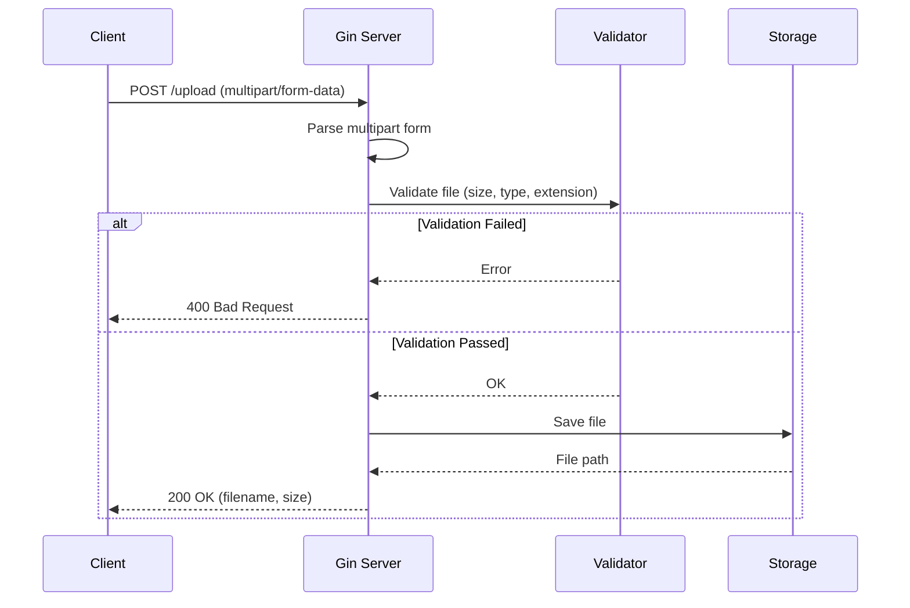
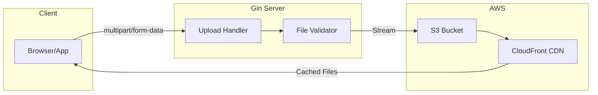

# How to Implement File Uploads with Gin

Author: [nawazdhandala](https://www.github.com/nawazdhandala)

Tags: Go, Gin, File Uploads, API, Storage, AWS S3, Security

Description: Learn how to handle single and multiple file uploads in Gin with validation, streaming, and cloud storage integration.

---

File uploads are a fundamental feature in most web applications. Whether you are building a document management system, a photo sharing platform, or just accepting user avatars, you need a solid file upload implementation. Gin makes this straightforward, but there are important considerations around validation, security, and scalability that many tutorials skip over.

This guide covers everything from basic single file uploads to production-ready implementations with S3 integration.

## Basic Single File Upload

The simplest way to handle a file upload in Gin uses the `FormFile` method. This works well for small files and simple use cases.

```go
// main.go
package main

import (
    "fmt"
    "net/http"
    "path/filepath"

    "github.com/gin-gonic/gin"
    "github.com/google/uuid"
)

func main() {
    r := gin.Default()

    // Set a lower memory limit for multipart forms (default is 32 MiB)
    r.MaxMultipartMemory = 8 << 20 // 8 MiB

    r.POST("/upload", uploadFile)

    r.Run(":8080")
}

func uploadFile(c *gin.Context) {
    // Get the file from the form
    file, err := c.FormFile("file")
    if err != nil {
        c.JSON(http.StatusBadRequest, gin.H{
            "error": "No file provided",
        })
        return
    }

    // Generate a unique filename to prevent overwrites
    ext := filepath.Ext(file.Filename)
    newFilename := uuid.New().String() + ext

    // Save the file to the uploads directory
    dst := filepath.Join("./uploads", newFilename)
    if err := c.SaveUploadedFile(file, dst); err != nil {
        c.JSON(http.StatusInternalServerError, gin.H{
            "error": "Failed to save file",
        })
        return
    }

    c.JSON(http.StatusOK, gin.H{
        "message":  "File uploaded successfully",
        "filename": newFilename,
        "size":     file.Size,
    })
}
```

## Multiple File Uploads

When you need to accept multiple files at once, Gin provides `MultipartForm` to handle the batch.

```go
// handlers/upload.go
package handlers

import (
    "fmt"
    "net/http"
    "path/filepath"

    "github.com/gin-gonic/gin"
    "github.com/google/uuid"
)

type UploadResult struct {
    Filename     string `json:"filename"`
    OriginalName string `json:"original_name"`
    Size         int64  `json:"size"`
}

func UploadMultipleFiles(c *gin.Context) {
    // Parse multipart form with 32 MB max memory
    form, err := c.MultipartForm()
    if err != nil {
        c.JSON(http.StatusBadRequest, gin.H{
            "error": "Failed to parse form",
        })
        return
    }

    // Get all files from the "files" field
    files := form.File["files"]
    if len(files) == 0 {
        c.JSON(http.StatusBadRequest, gin.H{
            "error": "No files provided",
        })
        return
    }

    var results []UploadResult

    for _, file := range files {
        // Generate unique filename
        ext := filepath.Ext(file.Filename)
        newFilename := uuid.New().String() + ext
        dst := filepath.Join("./uploads", newFilename)

        // Save file
        if err := c.SaveUploadedFile(file, dst); err != nil {
            c.JSON(http.StatusInternalServerError, gin.H{
                "error":    "Failed to save file",
                "filename": file.Filename,
            })
            return
        }

        results = append(results, UploadResult{
            Filename:     newFilename,
            OriginalName: file.Filename,
            Size:         file.Size,
        })
    }

    c.JSON(http.StatusOK, gin.H{
        "message": fmt.Sprintf("Uploaded %d files", len(results)),
        "files":   results,
    })
}
```

## File Validation

Accepting any file without validation is a security risk. You should validate file size, type, and extension before processing.

```go
// validation/file_validator.go
package validation

import (
    "errors"
    "mime/multipart"
    "net/http"
    "path/filepath"
    "strings"
)

type FileValidator struct {
    MaxSize          int64    // Maximum file size in bytes
    AllowedTypes     []string // Allowed MIME types
    AllowedExtensions []string // Allowed file extensions
}

// NewFileValidator creates a validator with common defaults
func NewFileValidator() *FileValidator {
    return &FileValidator{
        MaxSize: 10 << 20, // 10 MB default
        AllowedTypes: []string{
            "image/jpeg",
            "image/png",
            "image/gif",
            "application/pdf",
        },
        AllowedExtensions: []string{
            ".jpg", ".jpeg", ".png", ".gif", ".pdf",
        },
    }
}

// Validate checks if the file meets all requirements
func (v *FileValidator) Validate(file *multipart.FileHeader) error {
    // Check file size
    if file.Size > v.MaxSize {
        return errors.New("file size exceeds maximum allowed")
    }

    // Check file extension
    ext := strings.ToLower(filepath.Ext(file.Filename))
    if !v.isAllowedExtension(ext) {
        return errors.New("file extension not allowed")
    }

    // Check MIME type by reading file header
    mimeType, err := v.detectMimeType(file)
    if err != nil {
        return errors.New("failed to detect file type")
    }

    if !v.isAllowedType(mimeType) {
        return errors.New("file type not allowed")
    }

    return nil
}

func (v *FileValidator) isAllowedExtension(ext string) bool {
    for _, allowed := range v.AllowedExtensions {
        if ext == allowed {
            return true
        }
    }
    return false
}

func (v *FileValidator) isAllowedType(mimeType string) bool {
    for _, allowed := range v.AllowedTypes {
        if mimeType == allowed {
            return true
        }
    }
    return false
}

// detectMimeType reads the file header to detect the actual MIME type
func (v *FileValidator) detectMimeType(file *multipart.FileHeader) (string, error) {
    src, err := file.Open()
    if err != nil {
        return "", err
    }
    defer src.Close()

    // Read first 512 bytes for MIME detection
    buffer := make([]byte, 512)
    _, err = src.Read(buffer)
    if err != nil {
        return "", err
    }

    return http.DetectContentType(buffer), nil
}
```

Using the validator in your handler:

```go
// handlers/validated_upload.go
package handlers

import (
    "net/http"
    "path/filepath"

    "github.com/gin-gonic/gin"
    "github.com/google/uuid"
    "yourapp/validation"
)

func UploadWithValidation(c *gin.Context) {
    file, err := c.FormFile("file")
    if err != nil {
        c.JSON(http.StatusBadRequest, gin.H{"error": "No file provided"})
        return
    }

    // Create validator with custom settings
    validator := validation.NewFileValidator()
    validator.MaxSize = 5 << 20 // 5 MB limit
    validator.AllowedTypes = []string{"image/jpeg", "image/png"}
    validator.AllowedExtensions = []string{".jpg", ".jpeg", ".png"}

    // Validate the file
    if err := validator.Validate(file); err != nil {
        c.JSON(http.StatusBadRequest, gin.H{"error": err.Error()})
        return
    }

    // Save the validated file
    ext := filepath.Ext(file.Filename)
    newFilename := uuid.New().String() + ext
    dst := filepath.Join("./uploads", newFilename)

    if err := c.SaveUploadedFile(file, dst); err != nil {
        c.JSON(http.StatusInternalServerError, gin.H{"error": "Failed to save file"})
        return
    }

    c.JSON(http.StatusOK, gin.H{
        "message":  "File uploaded successfully",
        "filename": newFilename,
    })
}
```

## Streaming Uploads for Large Files

For large files, loading the entire file into memory is inefficient and can crash your server. Stream the file directly to disk instead.

```go
// handlers/stream_upload.go
package handlers

import (
    "io"
    "net/http"
    "os"
    "path/filepath"

    "github.com/gin-gonic/gin"
    "github.com/google/uuid"
)

const (
    MaxUploadSize = 100 << 20 // 100 MB
    UploadDir     = "./uploads"
)

func StreamUpload(c *gin.Context) {
    // Check content length before reading
    if c.Request.ContentLength > MaxUploadSize {
        c.JSON(http.StatusRequestEntityTooLarge, gin.H{
            "error": "File too large",
        })
        return
    }

    // Get the file from multipart form
    file, header, err := c.Request.FormFile("file")
    if err != nil {
        c.JSON(http.StatusBadRequest, gin.H{"error": "No file provided"})
        return
    }
    defer file.Close()

    // Create unique filename
    ext := filepath.Ext(header.Filename)
    newFilename := uuid.New().String() + ext
    dst := filepath.Join(UploadDir, newFilename)

    // Create destination file
    out, err := os.Create(dst)
    if err != nil {
        c.JSON(http.StatusInternalServerError, gin.H{"error": "Failed to create file"})
        return
    }
    defer out.Close()

    // Stream copy with size limit
    written, err := io.CopyN(out, file, MaxUploadSize)
    if err != nil && err != io.EOF {
        // Clean up partial file
        os.Remove(dst)
        c.JSON(http.StatusInternalServerError, gin.H{"error": "Failed to save file"})
        return
    }

    c.JSON(http.StatusOK, gin.H{
        "message":  "File uploaded successfully",
        "filename": newFilename,
        "size":     written,
    })
}
```

## Upload Flow Diagram

Here is how a typical file upload flows through your Gin application:



## Cloud Storage Integration with AWS S3

For production applications, storing files locally on your server is rarely the right choice. Files get lost when servers scale down or fail, and you cannot share files across multiple server instances. AWS S3 is the industry standard for file storage.

```go
// storage/s3.go
package storage

import (
    "context"
    "fmt"
    "io"
    "mime/multipart"
    "path/filepath"
    "time"

    "github.com/aws/aws-sdk-go-v2/aws"
    "github.com/aws/aws-sdk-go-v2/config"
    "github.com/aws/aws-sdk-go-v2/service/s3"
    "github.com/google/uuid"
)

type S3Storage struct {
    client     *s3.Client
    bucket     string
    region     string
    presigner  *s3.PresignClient
}

// NewS3Storage creates a new S3 storage instance
func NewS3Storage(bucket, region string) (*S3Storage, error) {
    cfg, err := config.LoadDefaultConfig(context.TODO(),
        config.WithRegion(region),
    )
    if err != nil {
        return nil, fmt.Errorf("failed to load AWS config: %w", err)
    }

    client := s3.NewFromConfig(cfg)
    presigner := s3.NewPresignClient(client)

    return &S3Storage{
        client:    client,
        bucket:    bucket,
        region:    region,
        presigner: presigner,
    }, nil
}

type UploadResult struct {
    Key      string `json:"key"`
    URL      string `json:"url"`
    Size     int64  `json:"size"`
    MimeType string `json:"mime_type"`
}

// Upload streams a file directly to S3
func (s *S3Storage) Upload(ctx context.Context, file *multipart.FileHeader) (*UploadResult, error) {
    src, err := file.Open()
    if err != nil {
        return nil, fmt.Errorf("failed to open file: %w", err)
    }
    defer src.Close()

    // Generate unique key with date prefix for organization
    ext := filepath.Ext(file.Filename)
    datePrefix := time.Now().Format("2006/01/02")
    key := fmt.Sprintf("%s/%s%s", datePrefix, uuid.New().String(), ext)

    // Detect content type
    buffer := make([]byte, 512)
    n, _ := src.Read(buffer)
    contentType := detectContentType(buffer[:n])

    // Reset reader position
    src.Seek(0, io.SeekStart)

    // Upload to S3
    _, err = s.client.PutObject(ctx, &s3.PutObjectInput{
        Bucket:        aws.String(s.bucket),
        Key:           aws.String(key),
        Body:          src,
        ContentType:   aws.String(contentType),
        ContentLength: aws.Int64(file.Size),
    })
    if err != nil {
        return nil, fmt.Errorf("failed to upload to S3: %w", err)
    }

    url := fmt.Sprintf("https://%s.s3.%s.amazonaws.com/%s", s.bucket, s.region, key)

    return &UploadResult{
        Key:      key,
        URL:      url,
        Size:     file.Size,
        MimeType: contentType,
    }, nil
}

// GetPresignedURL generates a temporary URL for private files
func (s *S3Storage) GetPresignedURL(ctx context.Context, key string, expiry time.Duration) (string, error) {
    request, err := s.presigner.PresignGetObject(ctx, &s3.GetObjectInput{
        Bucket: aws.String(s.bucket),
        Key:    aws.String(key),
    }, s3.WithPresignExpires(expiry))
    if err != nil {
        return "", fmt.Errorf("failed to generate presigned URL: %w", err)
    }

    return request.URL, nil
}

// Delete removes a file from S3
func (s *S3Storage) Delete(ctx context.Context, key string) error {
    _, err := s.client.DeleteObject(ctx, &s3.DeleteObjectInput{
        Bucket: aws.String(s.bucket),
        Key:    aws.String(key),
    })
    return err
}

func detectContentType(data []byte) string {
    return http.DetectContentType(data)
}
```

Using S3 storage in your handler:

```go
// handlers/s3_upload.go
package handlers

import (
    "net/http"

    "github.com/gin-gonic/gin"
    "yourapp/storage"
    "yourapp/validation"
)

var s3Store *storage.S3Storage

func init() {
    var err error
    s3Store, err = storage.NewS3Storage("your-bucket-name", "us-east-1")
    if err != nil {
        panic(err)
    }
}

func UploadToS3(c *gin.Context) {
    file, err := c.FormFile("file")
    if err != nil {
        c.JSON(http.StatusBadRequest, gin.H{"error": "No file provided"})
        return
    }

    // Validate before uploading
    validator := validation.NewFileValidator()
    if err := validator.Validate(file); err != nil {
        c.JSON(http.StatusBadRequest, gin.H{"error": err.Error()})
        return
    }

    // Upload to S3
    result, err := s3Store.Upload(c.Request.Context(), file)
    if err != nil {
        c.JSON(http.StatusInternalServerError, gin.H{"error": "Failed to upload file"})
        return
    }

    c.JSON(http.StatusOK, gin.H{
        "message": "File uploaded to S3",
        "key":     result.Key,
        "url":     result.URL,
        "size":    result.Size,
    })
}
```

## S3 Upload Architecture



## Security Considerations

File uploads are one of the most dangerous features you can add to a web application. Here are the security measures you should implement.

### 1. Never Trust File Extensions

Attackers can rename malicious files. Always check the actual file content, not just the extension.

```go
// security/file_check.go
package security

import (
    "bytes"
    "errors"
    "mime/multipart"
)

// Magic bytes for common file types
var magicBytes = map[string][]byte{
    "image/jpeg": {0xFF, 0xD8, 0xFF},
    "image/png":  {0x89, 0x50, 0x4E, 0x47},
    "image/gif":  {0x47, 0x49, 0x46},
    "application/pdf": {0x25, 0x50, 0x44, 0x46},
}

// VerifyFileContent checks if file content matches expected type
func VerifyFileContent(file *multipart.FileHeader, expectedType string) error {
    src, err := file.Open()
    if err != nil {
        return err
    }
    defer src.Close()

    // Read file header
    header := make([]byte, 8)
    _, err = src.Read(header)
    if err != nil {
        return err
    }

    // Check magic bytes
    expected, ok := magicBytes[expectedType]
    if !ok {
        return errors.New("unknown file type")
    }

    if !bytes.HasPrefix(header, expected) {
        return errors.New("file content does not match expected type")
    }

    return nil
}
```

### 2. Sanitize Filenames

Never use user-provided filenames directly. They can contain path traversal attacks.

```go
// security/sanitize.go
package security

import (
    "path/filepath"
    "regexp"
    "strings"
)

var unsafeChars = regexp.MustCompile(`[^a-zA-Z0-9._-]`)

// SanitizeFilename removes potentially dangerous characters
func SanitizeFilename(filename string) string {
    // Get just the filename, no path
    filename = filepath.Base(filename)

    // Remove null bytes
    filename = strings.ReplaceAll(filename, "\x00", "")

    // Replace unsafe characters
    filename = unsafeChars.ReplaceAllString(filename, "_")

    // Prevent empty filename
    if filename == "" || filename == "." || filename == ".." {
        filename = "unnamed"
    }

    // Limit length
    if len(filename) > 255 {
        ext := filepath.Ext(filename)
        name := strings.TrimSuffix(filename, ext)
        filename = name[:255-len(ext)] + ext
    }

    return filename
}
```

### 3. Store Files Outside Web Root

Never store uploaded files in a directory that is directly accessible via your web server.

```go
// config/upload.go
package config

import (
    "os"
    "path/filepath"
)

type UploadConfig struct {
    // StorageDir should be outside web root
    StorageDir string

    // PublicURL is where files are served from (via a separate handler)
    PublicURL string

    MaxFileSize int64
}

func NewUploadConfig() *UploadConfig {
    storageDir := os.Getenv("UPLOAD_STORAGE_DIR")
    if storageDir == "" {
        storageDir = "/var/app/uploads" // Not in /var/www
    }

    // Ensure directory exists
    os.MkdirAll(storageDir, 0750)

    return &UploadConfig{
        StorageDir:  storageDir,
        PublicURL:   "/files",
        MaxFileSize: 10 << 20, // 10 MB
    }
}

// GetStoragePath returns full path for a file
func (c *UploadConfig) GetStoragePath(filename string) string {
    return filepath.Join(c.StorageDir, filename)
}
```

### 4. Serve Files Through Your Application

Control access to uploaded files by serving them through a handler, not directly from the filesystem.

```go
// handlers/serve_file.go
package handlers

import (
    "net/http"
    "os"
    "path/filepath"

    "github.com/gin-gonic/gin"
    "yourapp/config"
)

func ServeFile(c *gin.Context) {
    cfg := config.NewUploadConfig()
    filename := c.Param("filename")

    // Sanitize to prevent directory traversal
    filename = filepath.Base(filename)

    filePath := cfg.GetStoragePath(filename)

    // Check if file exists
    if _, err := os.Stat(filePath); os.IsNotExist(err) {
        c.JSON(http.StatusNotFound, gin.H{"error": "File not found"})
        return
    }

    // You can add authentication/authorization here
    // if !userCanAccessFile(c, filename) {
    //     c.JSON(http.StatusForbidden, gin.H{"error": "Access denied"})
    //     return
    // }

    c.File(filePath)
}
```

### 5. Rate Limiting

Prevent abuse by limiting upload frequency.

```go
// middleware/rate_limit.go
package middleware

import (
    "net/http"
    "sync"
    "time"

    "github.com/gin-gonic/gin"
)

type RateLimiter struct {
    requests map[string][]time.Time
    mu       sync.Mutex
    limit    int
    window   time.Duration
}

func NewRateLimiter(limit int, window time.Duration) *RateLimiter {
    return &RateLimiter{
        requests: make(map[string][]time.Time),
        limit:    limit,
        window:   window,
    }
}

func (rl *RateLimiter) Middleware() gin.HandlerFunc {
    return func(c *gin.Context) {
        ip := c.ClientIP()

        rl.mu.Lock()
        defer rl.mu.Unlock()

        now := time.Now()
        windowStart := now.Add(-rl.window)

        // Filter old requests
        var recent []time.Time
        for _, t := range rl.requests[ip] {
            if t.After(windowStart) {
                recent = append(recent, t)
            }
        }

        if len(recent) >= rl.limit {
            c.JSON(http.StatusTooManyRequests, gin.H{
                "error": "Too many upload requests",
            })
            c.Abort()
            return
        }

        recent = append(recent, now)
        rl.requests[ip] = recent

        c.Next()
    }
}
```

## Complete Example

Here is a complete example putting everything together:

```go
// main.go
package main

import (
    "log"
    "time"

    "github.com/gin-gonic/gin"
    "yourapp/handlers"
    "yourapp/middleware"
)

func main() {
    r := gin.Default()

    // Configure upload limits
    r.MaxMultipartMemory = 8 << 20 // 8 MiB

    // Rate limit: 10 uploads per minute per IP
    rateLimiter := middleware.NewRateLimiter(10, time.Minute)

    // Upload routes
    upload := r.Group("/upload")
    upload.Use(rateLimiter.Middleware())
    {
        upload.POST("/single", handlers.UploadWithValidation)
        upload.POST("/multiple", handlers.UploadMultipleFiles)
        upload.POST("/s3", handlers.UploadToS3)
        upload.POST("/stream", handlers.StreamUpload)
    }

    // File serving route
    r.GET("/files/:filename", handlers.ServeFile)

    if err := r.Run(":8080"); err != nil {
        log.Fatal(err)
    }
}
```

## Summary

| Feature | Method | Best For |
|---------|--------|----------|
| Single file | `c.FormFile()` | Simple uploads |
| Multiple files | `c.MultipartForm()` | Batch uploads |
| Large files | Stream with `io.Copy` | Files over 10 MB |
| Production | S3 integration | Scalable applications |
| Validation | MIME + extension + size | All uploads |

Key takeaways:

- Always validate file type by reading the actual content, not just the extension
- Use streaming for large files to avoid memory issues
- Store files outside your web root and serve them through handlers
- Implement rate limiting to prevent abuse
- Use S3 or similar cloud storage for production applications
- Generate unique filenames to prevent overwrites and directory traversal attacks

File uploads in Gin are straightforward to implement, but the security and scalability details matter. Get these right from the start and you will save yourself from major headaches down the road.

---

*Need to monitor your file upload endpoints? [OneUptime](https://oneuptime.com) provides API monitoring with latency tracking, error alerting, and performance insights.*
