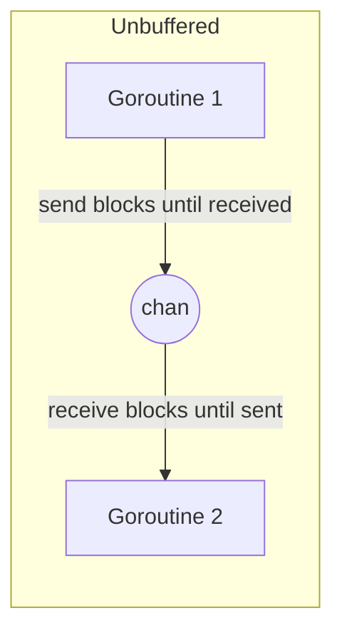
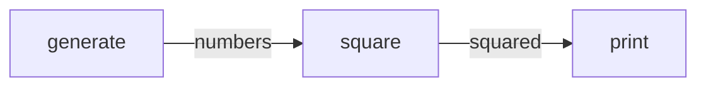
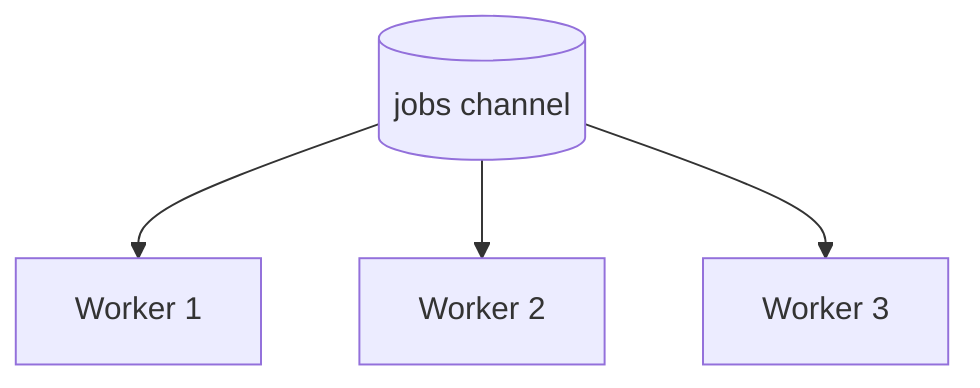
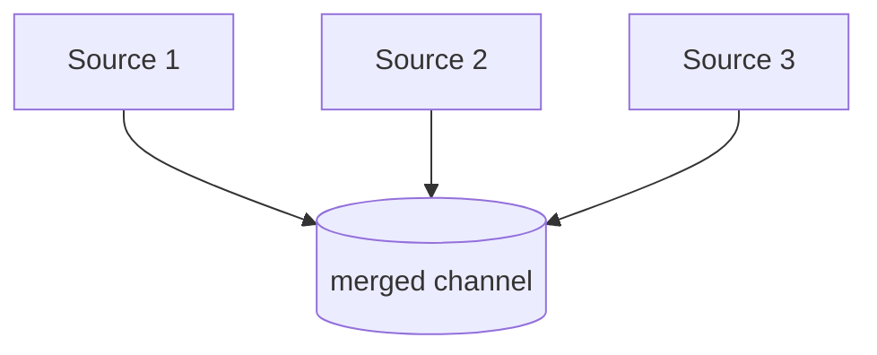

# How to Use Go Channels for Concurrent Programming

Author: [nawazdhandala](https://www.github.com/nawazdhandala)

Tags: Go, Concurrency, Channels, Backend, DevOps

Description: A practical guide to Go channels covering buffered vs unbuffered channels, channel operations, select statements, and common patterns like fan-in, fan-out, and pipelines.

---

Go was built with concurrency in mind. While goroutines give you lightweight threads, channels are how those threads talk to each other safely. The mantra is simple: do not communicate by sharing memory; instead, share memory by communicating. Channels make that possible.

This guide walks through the mechanics of channels and the patterns that make concurrent Go programs predictable and maintainable.

## What Channels Actually Are

A channel is a typed conduit through which you can send and receive values. Think of it as a pipe connecting goroutines. One goroutine pushes data in, another pulls it out. The type system ensures you only send what the channel expects.

Create a channel with `make`. The type after `chan` declares what can flow through it.

```go
// Create an unbuffered channel that carries integers
ch := make(chan int)

// Create a channel for custom types
type Job struct {
    ID   int
    Data string
}
jobs := make(chan Job)
```

## Unbuffered vs Buffered Channels

This distinction trips up most newcomers. Unbuffered channels have no storage - a send blocks until something receives. Buffered channels hold a fixed number of values before blocking.



```mermaid
flowchart LR
    subgraph Buffered capacity=3
        G3[Goroutine 1] -->|send blocks only when full| CH2[(buffer: 3 slots)]
        CH2 -->|receive blocks only when empty| G4[Goroutine 2]
    end
```

### Unbuffered Channels

With unbuffered channels, sends and receives happen at the same instant. The sender waits until the receiver is ready, and vice versa. This creates a synchronization point.

```go
package main

import (
    "fmt"
    "time"
)

func main() {
    // Unbuffered channel - no capacity specified
    ch := make(chan string)

    go func() {
        // This send will block until main() is ready to receive
        fmt.Println("Sending...")
        ch <- "hello"
        fmt.Println("Sent!")
    }()

    // Simulate some work before receiving
    time.Sleep(time.Second)

    // Now we receive - this unblocks the sender
    msg := <-ch
    fmt.Println("Received:", msg)
}
// Output:
// Sending...
// (1 second pause)
// Sent!
// Received: hello
```

### Buffered Channels

Buffered channels decouple sending and receiving. Sends only block when the buffer is full. Receives only block when the buffer is empty.

```go
package main

import "fmt"

func main() {
    // Buffered channel with capacity 2
    ch := make(chan int, 2)

    // These two sends do not block - buffer has room
    ch <- 1
    ch <- 2

    // This would block because the buffer is full:
    // ch <- 3

    // Receive the values
    fmt.Println(<-ch) // 1
    fmt.Println(<-ch) // 2
}
```

### When to Use Each

| Scenario | Channel Type | Why |
|----------|--------------|-----|
| Synchronization between goroutines | Unbuffered | Forces both sides to meet at the same point |
| Producer faster than consumer | Buffered | Absorbs bursts without blocking the producer |
| Request-response patterns | Unbuffered | Ensures the response is handled before continuing |
| Work queues with multiple workers | Buffered | Allows queueing work while workers are busy |
| Signaling completion | Unbuffered | One signal, one receive, no ambiguity |

## Channel Operations

### Send and Receive

The arrow operator shows direction. Arrow points into channel for send, out of channel for receive.

```go
ch := make(chan int, 1)

// Send: value flows into channel
ch <- 42

// Receive: value flows out of channel
value := <-ch
fmt.Println(value) // 42

// Receive and discard (useful for signaling channels)
<-done
```

### Closing Channels

Close a channel to signal that no more values will be sent. Receivers can detect this.

```go
package main

import "fmt"

func main() {
    ch := make(chan int, 3)

    // Send some values then close
    ch <- 1
    ch <- 2
    ch <- 3
    close(ch)

    // Range over channel - automatically stops when channel closes
    for v := range ch {
        fmt.Println(v)
    }
    // Output: 1, 2, 3

    // Receiving from closed channel returns zero value immediately
    v, ok := <-ch
    fmt.Println(v, ok) // 0 false - ok is false because channel is closed
}
```

Important rules about closing:

- Only the sender should close a channel, never the receiver
- Sending to a closed channel causes a panic
- Receiving from a closed channel returns the zero value immediately
- Use the comma-ok idiom to check if a channel is closed

### Checking Channel State

The comma-ok idiom tells you whether a receive got a real value or the zero value from a closed channel.

```go
// ok is true if we received an actual value
// ok is false if the channel is closed and empty
value, ok := <-ch
if !ok {
    fmt.Println("Channel closed, no more data")
    return
}
fmt.Println("Got value:", value)
```

## The Select Statement

Select lets a goroutine wait on multiple channel operations. It blocks until one of them can proceed, then executes that case. If multiple are ready, it picks one randomly.

```go
package main

import (
    "fmt"
    "time"
)

func main() {
    ch1 := make(chan string)
    ch2 := make(chan string)

    go func() {
        time.Sleep(100 * time.Millisecond)
        ch1 <- "from channel 1"
    }()

    go func() {
        time.Sleep(200 * time.Millisecond)
        ch2 <- "from channel 2"
    }()

    // Wait for both channels, handling whichever is ready first
    for i := 0; i < 2; i++ {
        select {
        case msg1 := <-ch1:
            fmt.Println(msg1)
        case msg2 := <-ch2:
            fmt.Println(msg2)
        }
    }
}
```

### Select with Default

Adding a default case makes select non-blocking. If no channel is ready, default runs immediately.

```go
select {
case msg := <-ch:
    fmt.Println("Got message:", msg)
default:
    // No message available right now, do something else
    fmt.Println("No message, moving on")
}
```

### Select with Timeout

Combine select with `time.After` to implement timeouts. This prevents goroutines from blocking forever.

```go
select {
case result := <-ch:
    fmt.Println("Got result:", result)
case <-time.After(3 * time.Second):
    fmt.Println("Timed out waiting for result")
}
```

### Select for Non-Blocking Send

Check if a send would block without actually blocking.

```go
select {
case ch <- value:
    fmt.Println("Sent value")
default:
    fmt.Println("Channel full, dropping value")
}
```

## Channel Patterns

### Pipeline

A pipeline connects stages where each stage is a group of goroutines running the same function. Each stage receives values from an upstream channel and sends to a downstream channel.



```go
package main

import "fmt"

// First stage: generate numbers
func generate(nums ...int) <-chan int {
    out := make(chan int)
    go func() {
        for _, n := range nums {
            out <- n
        }
        close(out)
    }()
    return out
}

// Second stage: square the numbers
func square(in <-chan int) <-chan int {
    out := make(chan int)
    go func() {
        for n := range in {
            out <- n * n
        }
        close(out)
    }()
    return out
}

func main() {
    // Set up the pipeline: generate -> square -> print
    numbers := generate(2, 3, 4, 5)
    squared := square(numbers)

    // Consume the pipeline output
    for result := range squared {
        fmt.Println(result)
    }
    // Output: 4, 9, 16, 25
}
```

### Fan-Out

Fan-out means multiple goroutines read from the same channel until it closes. This distributes work across workers.



```go
package main

import (
    "fmt"
    "sync"
    "time"
)

func worker(id int, jobs <-chan int, wg *sync.WaitGroup) {
    defer wg.Done()
    for job := range jobs {
        // Simulate work
        fmt.Printf("Worker %d processing job %d\n", id, job)
        time.Sleep(100 * time.Millisecond)
    }
    fmt.Printf("Worker %d done\n", id)
}

func main() {
    jobs := make(chan int, 10)
    var wg sync.WaitGroup

    // Start 3 workers (fan-out)
    for w := 1; w <= 3; w++ {
        wg.Add(1)
        go worker(w, jobs, &wg)
    }

    // Send 9 jobs
    for j := 1; j <= 9; j++ {
        jobs <- j
    }
    close(jobs)

    // Wait for all workers to finish
    wg.Wait()
}
```

### Fan-In

Fan-in merges multiple input channels into one output channel. This is the inverse of fan-out.



```go
package main

import (
    "fmt"
    "sync"
)

// fanIn reads from multiple input channels and sends all values to a single output channel
func fanIn(channels ...<-chan int) <-chan int {
    out := make(chan int)
    var wg sync.WaitGroup

    // Start a goroutine for each input channel
    for _, ch := range channels {
        wg.Add(1)
        go func(c <-chan int) {
            defer wg.Done()
            for v := range c {
                out <- v
            }
        }(ch)
    }

    // Close output channel when all inputs are done
    go func() {
        wg.Wait()
        close(out)
    }()

    return out
}

func main() {
    // Create three source channels
    ch1 := make(chan int)
    ch2 := make(chan int)
    ch3 := make(chan int)

    // Merge them into one
    merged := fanIn(ch1, ch2, ch3)

    // Send values from different sources
    go func() { ch1 <- 1; ch1 <- 4; close(ch1) }()
    go func() { ch2 <- 2; ch2 <- 5; close(ch2) }()
    go func() { ch3 <- 3; ch3 <- 6; close(ch3) }()

    // Receive all values from merged channel
    for v := range merged {
        fmt.Println(v)
    }
}
```

### Worker Pool

A worker pool combines fan-out (distributing jobs to workers) with fan-in (collecting results). This is one of the most common patterns in production Go code.

```go
package main

import (
    "fmt"
    "sync"
    "time"
)

type Job struct {
    ID    int
    Input int
}

type Result struct {
    JobID  int
    Output int
}

func workerPool(numWorkers int, jobs <-chan Job, results chan<- Result) {
    var wg sync.WaitGroup

    // Start workers
    for i := 0; i < numWorkers; i++ {
        wg.Add(1)
        go func(workerID int) {
            defer wg.Done()
            for job := range jobs {
                // Process the job
                output := job.Input * 2
                time.Sleep(50 * time.Millisecond) // Simulate work

                results <- Result{JobID: job.ID, Output: output}
            }
        }(i)
    }

    // Close results channel when all workers finish
    go func() {
        wg.Wait()
        close(results)
    }()
}

func main() {
    jobs := make(chan Job, 100)
    results := make(chan Result, 100)

    // Start worker pool with 5 workers
    workerPool(5, jobs, results)

    // Send jobs
    go func() {
        for i := 1; i <= 20; i++ {
            jobs <- Job{ID: i, Input: i * 10}
        }
        close(jobs)
    }()

    // Collect results
    for result := range results {
        fmt.Printf("Job %d: result = %d\n", result.JobID, result.Output)
    }
}
```

### Done Channel for Cancellation

Use a done channel to signal goroutines to stop. This is essential for cleaning up resources and avoiding goroutine leaks.

```go
package main

import (
    "fmt"
    "time"
)

func worker(done <-chan struct{}, work <-chan int) {
    for {
        select {
        case <-done:
            // Received cancellation signal, clean up and return
            fmt.Println("Worker: received done signal, shutting down")
            return
        case job := <-work:
            fmt.Println("Worker: processing job", job)
            time.Sleep(500 * time.Millisecond)
        }
    }
}

func main() {
    done := make(chan struct{})
    work := make(chan int)

    go worker(done, work)

    // Send some work
    work <- 1
    work <- 2
    work <- 3

    // Wait a bit then cancel
    time.Sleep(time.Second)
    close(done) // Signal all workers to stop

    // Give worker time to clean up
    time.Sleep(100 * time.Millisecond)
    fmt.Println("Main: all done")
}
```

## Common Pitfalls

### Deadlock from Unbuffered Channel in Same Goroutine

Sending to an unbuffered channel blocks until something receives. If you try to send and receive in the same goroutine without spawning another, you deadlock.

```go
// BAD: This deadlocks!
func main() {
    ch := make(chan int)
    ch <- 1    // Blocks forever - nothing will receive this
    fmt.Println(<-ch)
}

// GOOD: Use a goroutine or a buffered channel
func main() {
    ch := make(chan int, 1) // Buffered channel with capacity 1
    ch <- 1                 // Does not block because buffer has room
    fmt.Println(<-ch)
}
```

### Forgetting to Close Channels

Receivers using `range` will block forever if the sender forgets to close the channel.

```go
// BAD: receiver blocks forever
func main() {
    ch := make(chan int)
    go func() {
        ch <- 1
        ch <- 2
        // Forgot to close(ch)!
    }()

    for v := range ch {
        fmt.Println(v) // Prints 1, 2, then hangs forever
    }
}

// GOOD: always close channels when done sending
func main() {
    ch := make(chan int)
    go func() {
        ch <- 1
        ch <- 2
        close(ch) // Signal that we are done
    }()

    for v := range ch {
        fmt.Println(v)
    }
}
```

### Sending to a Closed Channel

This causes a panic. Structure your code so only the sender closes the channel.

```go
// BAD: This panics!
ch := make(chan int)
close(ch)
ch <- 1 // panic: send on closed channel

// GOOD: Sender owns closing
func producer(ch chan<- int) {
    for i := 0; i < 5; i++ {
        ch <- i
    }
    close(ch) // Only the sender closes
}
```

### Goroutine Leaks

If a goroutine blocks on a channel operation and nothing unblocks it, the goroutine leaks. This is a memory leak that grows over time.

```go
// BAD: Goroutine leaks if no one receives
func leakyFunction() <-chan int {
    ch := make(chan int)
    go func() {
        result := expensiveOperation()
        ch <- result // Blocks forever if caller does not receive
    }()
    return ch
}

// GOOD: Use context for cancellation
func safeFunction(ctx context.Context) <-chan int {
    ch := make(chan int)
    go func() {
        result := expensiveOperation()
        select {
        case ch <- result:
        case <-ctx.Done():
            // Caller cancelled, goroutine can exit
        }
    }()
    return ch
}
```

### Race Condition with Shared Buffer

Buffered channels do not protect the data inside from races. If you put a pointer or slice in a channel and then modify it, you have a race.

```go
// BAD: Race condition
data := []int{1, 2, 3}
ch <- data      // Send pointer to slice
data[0] = 999   // Modify while receiver might be reading - race!

// GOOD: Copy data or do not modify after sending
data := []int{1, 2, 3}
copied := make([]int, len(data))
copy(copied, data)
ch <- copied    // Send the copy
data[0] = 999   // Safe - receiver has independent copy
```

## Channel Direction in Function Signatures

Declare channel direction in function parameters to catch bugs at compile time. A send-only channel cannot receive, and vice versa.

```go
// Send-only channel: can only send, not receive
func producer(ch chan<- int) {
    ch <- 1
    // <-ch  // Compile error: cannot receive from send-only channel
}

// Receive-only channel: can only receive, not send
func consumer(ch <-chan int) {
    v := <-ch
    // ch <- 1  // Compile error: cannot send to receive-only channel
    fmt.Println(v)
}

func main() {
    ch := make(chan int)
    go producer(ch)
    consumer(ch)
}
```

## Summary

| Concept | Key Points |
|---------|------------|
| Unbuffered channels | Synchronous, blocks both sender and receiver until they meet |
| Buffered channels | Asynchronous up to capacity, decouples sender and receiver timing |
| Close | Signals no more values, only sender should close |
| Select | Multiplexes channel operations, handles timeouts and cancellation |
| Pipeline | Chain stages connected by channels for data processing |
| Fan-out | Multiple goroutines consume from one channel |
| Fan-in | Multiple channels merge into one |
| Done channel | Signal cancellation to prevent goroutine leaks |

Channels are Go's answer to the shared memory coordination problem. They make it harder to introduce races by encouraging message passing over mutex-protected shared state. Start simple with unbuffered channels for synchronization, graduate to buffered channels when you need to decouple timing, and reach for select when you need to handle multiple channels or timeouts. The patterns here - pipelines, fan-out, fan-in, worker pools - will cover most concurrent programming needs you will encounter in production systems.
