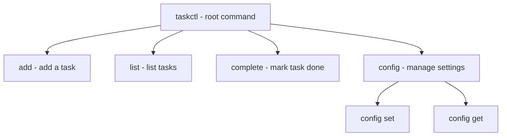
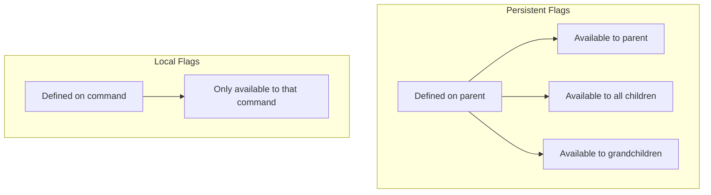
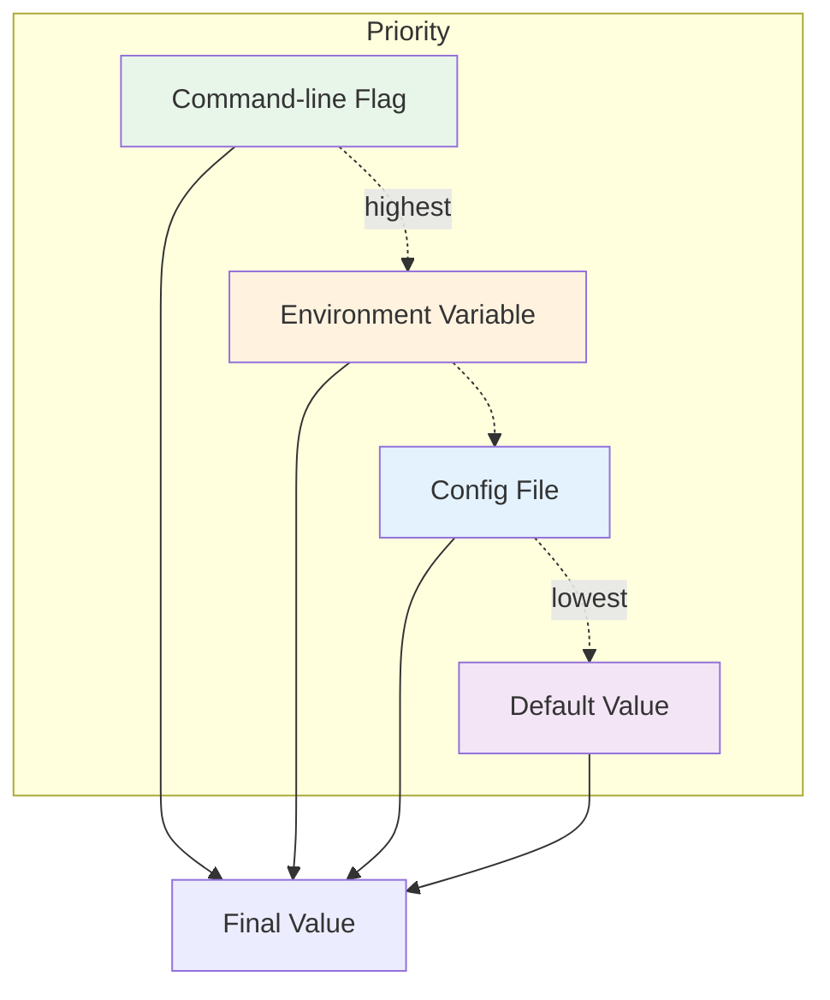

# How to Build a CLI Application with Cobra in Go

Author: [nawazdhandala](https://www.github.com/nawazdhandala)

Tags: Go, Cobra, CLI, DevOps, Tools, Development

Description: A practical guide to building production-ready command-line applications in Go using Cobra, covering commands, flags, arguments, and Viper configuration.

---

Command-line tools are everywhere in the DevOps and developer ecosystem. From `kubectl` to `docker` to `gh`, the best CLI tools share common traits: intuitive command structures, helpful documentation, and sensible defaults. Most of these tools are built with Cobra, a Go library that makes CLI development surprisingly pleasant.

Cobra powers the CLIs for Kubernetes, Hugo, GitHub CLI, and countless other tools you probably use daily. In this guide, we will build a complete CLI application from scratch, covering everything from basic commands to advanced configuration with Viper.

## Why Cobra?

Cobra handles the tedious parts of CLI development so you can focus on your application logic:

| Feature | What Cobra Gives You |
|---------|---------------------|
| Command structure | Nested subcommands with automatic help |
| Flag parsing | Persistent and local flags with validation |
| Auto-completion | Bash, Zsh, Fish, PowerShell support |
| Help generation | Automatic, customizable help text |
| Error handling | Consistent error messages and exit codes |

## Project Setup

Initialize a new Go module and install Cobra.

```bash
# Create project directory and initialize module
mkdir taskctl && cd taskctl
go mod init github.com/yourname/taskctl

# Install Cobra and Viper
go get -u github.com/spf13/cobra@latest
go get -u github.com/spf13/viper@latest
```

## Basic Application Structure

Cobra applications follow a predictable structure. The root command represents your application, and subcommands branch off from there.



Create the main entry point that simply executes the root command.

```go
// main.go
package main

import "github.com/yourname/taskctl/cmd"

func main() {
    cmd.Execute()
}
```

## The Root Command

The root command is the foundation. It runs when users invoke your CLI without subcommands and defines global behavior.

```go
// cmd/root.go
package cmd

import (
    "fmt"
    "os"

    "github.com/spf13/cobra"
    "github.com/spf13/viper"
)

var cfgFile string

// rootCmd represents the base command when called without any subcommands
var rootCmd = &cobra.Command{
    Use:   "taskctl",
    Short: "A simple task management CLI",
    Long: `taskctl is a command-line task manager that helps you
track your daily tasks and stay productive.

Examples:
  taskctl add "Write documentation"
  taskctl list --status pending
  taskctl complete 1`,
    // Run when no subcommand is specified
    Run: func(cmd *cobra.Command, args []string) {
        // Show help if no subcommand provided
        cmd.Help()
    },
}

// Execute adds all child commands to the root command and sets flags
func Execute() {
    if err := rootCmd.Execute(); err != nil {
        fmt.Fprintln(os.Stderr, err)
        os.Exit(1)
    }
}

func init() {
    // Called before any command runs
    cobra.OnInitialize(initConfig)

    // Persistent flags are available to this command and all subcommands
    rootCmd.PersistentFlags().StringVar(&cfgFile, "config", "",
        "config file (default is $HOME/.taskctl.yaml)")

    // Local flags only run when this command is called directly
    rootCmd.Flags().BoolP("version", "v", false, "Print version information")
}

func initConfig() {
    if cfgFile != "" {
        // Use config file from the flag
        viper.SetConfigFile(cfgFile)
    } else {
        // Find home directory
        home, err := os.UserHomeDir()
        cobra.CheckErr(err)

        // Search for config in home directory
        viper.AddConfigPath(home)
        viper.SetConfigType("yaml")
        viper.SetConfigName(".taskctl")
    }

    // Read environment variables that match
    viper.AutomaticEnv()

    // Read the config file if it exists
    if err := viper.ReadInConfig(); err == nil {
        fmt.Fprintln(os.Stderr, "Using config file:", viper.ConfigFileUsed())
    }
}
```

## Adding Subcommands

Each subcommand lives in its own file. The `add` command creates new tasks.

```go
// cmd/add.go
package cmd

import (
    "fmt"
    "strings"
    "time"

    "github.com/spf13/cobra"
    "github.com/spf13/viper"
)

var (
    priority string
    dueDate  string
    tags     []string
)

var addCmd = &cobra.Command{
    Use:   "add [task description]",
    Short: "Add a new task",
    Long: `Add a new task to your task list with optional priority and due date.

Examples:
  taskctl add "Review pull request"
  taskctl add "Deploy to production" --priority high --due 2024-01-15
  taskctl add "Update docs" --tags documentation,important`,
    // Require at least one argument (the task description)
    Args: cobra.MinimumNArgs(1),
    RunE: func(cmd *cobra.Command, args []string) error {
        // Join all arguments as the task description
        description := strings.Join(args, " ")

        // Validate priority if provided
        validPriorities := map[string]bool{"low": true, "medium": true, "high": true}
        if priority != "" && !validPriorities[priority] {
            return fmt.Errorf("invalid priority %q: must be low, medium, or high", priority)
        }

        // Parse due date if provided
        var parsedDue time.Time
        if dueDate != "" {
            var err error
            parsedDue, err = time.Parse("2006-01-02", dueDate)
            if err != nil {
                return fmt.Errorf("invalid date format %q: use YYYY-MM-DD", dueDate)
            }
        }

        // Get the default priority from config if not specified
        if priority == "" {
            priority = viper.GetString("defaults.priority")
            if priority == "" {
                priority = "medium"
            }
        }

        // Create the task (in a real app, save to database/file)
        task := Task{
            Description: description,
            Priority:    priority,
            DueDate:     parsedDue,
            Tags:        tags,
            CreatedAt:   time.Now(),
        }

        fmt.Printf("Added task: %s\n", task.Description)
        fmt.Printf("  Priority: %s\n", task.Priority)
        if !task.DueDate.IsZero() {
            fmt.Printf("  Due: %s\n", task.DueDate.Format("2006-01-02"))
        }
        if len(task.Tags) > 0 {
            fmt.Printf("  Tags: %s\n", strings.Join(task.Tags, ", "))
        }

        return nil
    },
}

type Task struct {
    Description string
    Priority    string
    DueDate     time.Time
    Tags        []string
    CreatedAt   time.Time
    Completed   bool
}

func init() {
    // Register as a subcommand of root
    rootCmd.AddCommand(addCmd)

    // Local flags for this command only
    addCmd.Flags().StringVarP(&priority, "priority", "p", "",
        "Task priority: low, medium, high")
    addCmd.Flags().StringVarP(&dueDate, "due", "d", "",
        "Due date in YYYY-MM-DD format")
    addCmd.Flags().StringSliceVarP(&tags, "tags", "t", []string{},
        "Comma-separated list of tags")
}
```

## Persistent vs Local Flags

Understanding the difference between persistent and local flags is key to designing a good CLI.



Here is how to use both effectively.

```go
// cmd/list.go
package cmd

import (
    "fmt"

    "github.com/spf13/cobra"
    "github.com/spf13/viper"
)

var (
    statusFilter string
    showAll      bool
    outputFormat string
)

var listCmd = &cobra.Command{
    Use:   "list",
    Short: "List all tasks",
    Long: `Display tasks with optional filtering by status.

Examples:
  taskctl list
  taskctl list --status pending
  taskctl list --all --output json`,
    RunE: func(cmd *cobra.Command, args []string) error {
        // Access persistent flag from root command
        verbose, _ := cmd.Flags().GetBool("verbose")

        if verbose {
            fmt.Println("Fetching tasks with verbose output...")
        }

        // Use output format from flag or config
        format := outputFormat
        if format == "" {
            format = viper.GetString("output.format")
            if format == "" {
                format = "table"
            }
        }

        fmt.Printf("Listing tasks (status: %s, format: %s)\n", statusFilter, format)

        // In a real app, fetch and display tasks here
        return nil
    },
}

func init() {
    rootCmd.AddCommand(listCmd)

    // Add a persistent flag to root that all commands can access
    rootCmd.PersistentFlags().BoolP("verbose", "V", false,
        "Enable verbose output")

    // Local flags for list command only
    listCmd.Flags().StringVarP(&statusFilter, "status", "s", "all",
        "Filter by status: pending, completed, all")
    listCmd.Flags().BoolVarP(&showAll, "all", "a", false,
        "Show all tasks including archived")
    listCmd.Flags().StringVarP(&outputFormat, "output", "o", "",
        "Output format: table, json, yaml")
}
```

## Argument Validation

Cobra provides built-in validators for command arguments.

```go
// cmd/complete.go
package cmd

import (
    "fmt"
    "strconv"

    "github.com/spf13/cobra"
)

var completeCmd = &cobra.Command{
    Use:   "complete [task-id]",
    Short: "Mark a task as completed",
    Long: `Mark one or more tasks as completed by their ID.

Examples:
  taskctl complete 1
  taskctl complete 1 2 3`,
    // Built-in argument validators
    Args: cobra.MinimumNArgs(1),
    RunE: func(cmd *cobra.Command, args []string) error {
        for _, arg := range args {
            // Validate that each argument is a valid integer
            taskID, err := strconv.Atoi(arg)
            if err != nil {
                return fmt.Errorf("invalid task ID %q: must be a number", arg)
            }

            fmt.Printf("Marked task %d as completed\n", taskID)
        }
        return nil
    },
}

func init() {
    rootCmd.AddCommand(completeCmd)
}
```

Cobra includes several argument validators you can use out of the box.

```go
// Common argument validators
cobra.NoArgs           // Command takes no arguments
cobra.ArbitraryArgs    // Any number of arguments
cobra.MinimumNArgs(n)  // At least n arguments required
cobra.MaximumNArgs(n)  // At most n arguments allowed
cobra.ExactArgs(n)     // Exactly n arguments required
cobra.RangeArgs(min, max)  // Between min and max arguments

// Custom validator example
var deleteCmd = &cobra.Command{
    Use:  "delete [task-id...]",
    Args: func(cmd *cobra.Command, args []string) error {
        if len(args) < 1 {
            return fmt.Errorf("requires at least one task ID")
        }
        for _, arg := range args {
            if _, err := strconv.Atoi(arg); err != nil {
                return fmt.Errorf("invalid task ID %q", arg)
            }
        }
        return nil
    },
    RunE: func(cmd *cobra.Command, args []string) error {
        // Delete logic here
        return nil
    },
}
```

## Nested Subcommands

Group related functionality under a parent command.

```go
// cmd/config.go
package cmd

import (
    "fmt"
    "os"
    "path/filepath"

    "github.com/spf13/cobra"
    "github.com/spf13/viper"
)

var configCmd = &cobra.Command{
    Use:   "config",
    Short: "Manage configuration",
    Long: `View and modify taskctl configuration settings.

Examples:
  taskctl config get defaults.priority
  taskctl config set defaults.priority high
  taskctl config list`,
}

var configGetCmd = &cobra.Command{
    Use:   "get [key]",
    Short: "Get a configuration value",
    Args:  cobra.ExactArgs(1),
    RunE: func(cmd *cobra.Command, args []string) error {
        key := args[0]
        value := viper.Get(key)

        if value == nil {
            return fmt.Errorf("configuration key %q not found", key)
        }

        fmt.Printf("%s: %v\n", key, value)
        return nil
    },
}

var configSetCmd = &cobra.Command{
    Use:   "set [key] [value]",
    Short: "Set a configuration value",
    Args:  cobra.ExactArgs(2),
    RunE: func(cmd *cobra.Command, args []string) error {
        key := args[0]
        value := args[1]

        viper.Set(key, value)

        // Write config to file
        if err := viper.WriteConfig(); err != nil {
            // If config file does not exist, create it
            if _, ok := err.(viper.ConfigFileNotFoundError); ok {
                home, _ := os.UserHomeDir()
                configPath := filepath.Join(home, ".taskctl.yaml")
                if err := viper.WriteConfigAs(configPath); err != nil {
                    return fmt.Errorf("failed to write config: %w", err)
                }
            } else {
                return fmt.Errorf("failed to write config: %w", err)
            }
        }

        fmt.Printf("Set %s = %s\n", key, value)
        return nil
    },
}

var configListCmd = &cobra.Command{
    Use:   "list",
    Short: "List all configuration values",
    RunE: func(cmd *cobra.Command, args []string) error {
        settings := viper.AllSettings()

        if len(settings) == 0 {
            fmt.Println("No configuration values set")
            return nil
        }

        for key, value := range settings {
            fmt.Printf("%s: %v\n", key, value)
        }
        return nil
    },
}

func init() {
    // Add config as subcommand of root
    rootCmd.AddCommand(configCmd)

    // Add get, set, list as subcommands of config
    configCmd.AddCommand(configGetCmd)
    configCmd.AddCommand(configSetCmd)
    configCmd.AddCommand(configListCmd)
}
```

## Viper Configuration Integration

Viper handles configuration from files, environment variables, and flags. Here is how to bind them together.

```go
// cmd/root.go (enhanced init function)
func init() {
    cobra.OnInitialize(initConfig)

    // Define persistent flag
    rootCmd.PersistentFlags().StringVar(&cfgFile, "config", "",
        "config file (default is $HOME/.taskctl.yaml)")

    // Bind flag to viper so it can also be set via config file
    viper.BindPFlag("config", rootCmd.PersistentFlags().Lookup("config"))

    // Set up environment variable prefix
    // TASKCTL_DEFAULTS_PRIORITY will map to defaults.priority
    viper.SetEnvPrefix("TASKCTL")
    viper.SetEnvKeyReplacer(strings.NewReplacer(".", "_"))
}

func initConfig() {
    if cfgFile != "" {
        viper.SetConfigFile(cfgFile)
    } else {
        home, err := os.UserHomeDir()
        cobra.CheckErr(err)

        // Look for config in multiple locations
        viper.AddConfigPath(home)
        viper.AddConfigPath(".")
        viper.SetConfigType("yaml")
        viper.SetConfigName(".taskctl")
    }

    // Read environment variables
    viper.AutomaticEnv()

    // Set defaults
    viper.SetDefault("defaults.priority", "medium")
    viper.SetDefault("output.format", "table")
    viper.SetDefault("storage.path", "~/.taskctl/tasks.json")

    // Try to read the config file
    if err := viper.ReadInConfig(); err != nil {
        if _, ok := err.(viper.ConfigFileNotFoundError); !ok {
            fmt.Fprintf(os.Stderr, "Error reading config: %v\n", err)
        }
    }
}
```

Example configuration file that users can create.

```yaml
# ~/.taskctl.yaml
defaults:
  priority: high
  tags:
    - work

output:
  format: table
  color: true

storage:
  path: ~/.taskctl/tasks.json

notifications:
  enabled: true
  reminder_minutes: 30
```

The configuration priority from highest to lowest is: flags, environment variables, config file, defaults.



## Adding Shell Completion

Cobra generates shell completion scripts automatically.

```go
// cmd/completion.go
package cmd

import (
    "os"

    "github.com/spf13/cobra"
)

var completionCmd = &cobra.Command{
    Use:   "completion [bash|zsh|fish|powershell]",
    Short: "Generate shell completion scripts",
    Long: `Generate shell completion scripts for taskctl.

To load completions:

Bash:
  $ source <(taskctl completion bash)

  # To load completions for each session, execute once:
  # Linux:
  $ taskctl completion bash > /etc/bash_completion.d/taskctl
  # macOS:
  $ taskctl completion bash > $(brew --prefix)/etc/bash_completion.d/taskctl

Zsh:
  $ source <(taskctl completion zsh)

  # To load completions for each session, execute once:
  $ taskctl completion zsh > "${fpath[1]}/_taskctl"

Fish:
  $ taskctl completion fish | source

  # To load completions for each session, execute once:
  $ taskctl completion fish > ~/.config/fish/completions/taskctl.fish

PowerShell:
  PS> taskctl completion powershell | Out-String | Invoke-Expression

  # To load completions for each session, add to your profile:
  PS> taskctl completion powershell >> $PROFILE
`,
    DisableFlagsInUseLine: true,
    ValidArgs:             []string{"bash", "zsh", "fish", "powershell"},
    Args:                  cobra.MatchAll(cobra.ExactArgs(1), cobra.OnlyValidArgs),
    RunE: func(cmd *cobra.Command, args []string) error {
        switch args[0] {
        case "bash":
            return cmd.Root().GenBashCompletion(os.Stdout)
        case "zsh":
            return cmd.Root().GenZshCompletion(os.Stdout)
        case "fish":
            return cmd.Root().GenFishCompletion(os.Stdout, true)
        case "powershell":
            return cmd.Root().GenPowerShellCompletionWithDesc(os.Stdout)
        }
        return nil
    },
}

func init() {
    rootCmd.AddCommand(completionCmd)
}
```

## Complete Working Example

Here is the final project structure and a fully working implementation.

```
taskctl/
├── main.go
├── go.mod
├── go.sum
└── cmd/
    ├── root.go
    ├── add.go
    ├── list.go
    ├── complete.go
    ├── config.go
    └── completion.go
```

Build and test your CLI.

```bash
# Build the application
go build -o taskctl

# Test the commands
./taskctl --help
./taskctl add "Write blog post" --priority high --tags writing,blog
./taskctl list --status pending
./taskctl complete 1
./taskctl config set defaults.priority high
./taskctl config get defaults.priority

# Generate completion for your shell
./taskctl completion bash > /tmp/taskctl_completion
source /tmp/taskctl_completion
```

## Best Practices

Keep these guidelines in mind when building CLI tools with Cobra.

**Use RunE instead of Run.** Returning errors lets Cobra handle them consistently.

```go
// Prefer this
RunE: func(cmd *cobra.Command, args []string) error {
    if err := doSomething(); err != nil {
        return fmt.Errorf("failed to do something: %w", err)
    }
    return nil
},

// Over this
Run: func(cmd *cobra.Command, args []string) {
    if err := doSomething(); err != nil {
        fmt.Fprintln(os.Stderr, err)
        os.Exit(1)
    }
},
```

**Keep commands focused.** Each command should do one thing well. Split complex operations into subcommands.

**Provide helpful examples.** Users often copy-paste from help text. Make your examples actually work.

**Use short and long flags.** Common flags deserve single-letter shortcuts (`-p` for `--priority`), but less common ones can be long-only.

**Validate early.** Check arguments and flags before doing any work. Fail fast with clear error messages.

## Summary

Cobra makes building production-quality CLI tools straightforward. You get automatic help generation, shell completion, and a clean command hierarchy out of the box. Combined with Viper for configuration, you can build tools that feel polished and professional.

The patterns covered here - root commands, subcommands, persistent and local flags, argument validation, and configuration binding - apply to CLIs of any size. Start small, add commands as needed, and your tool will grow naturally.
