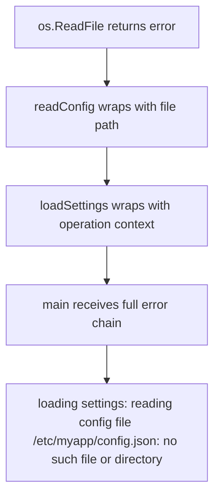
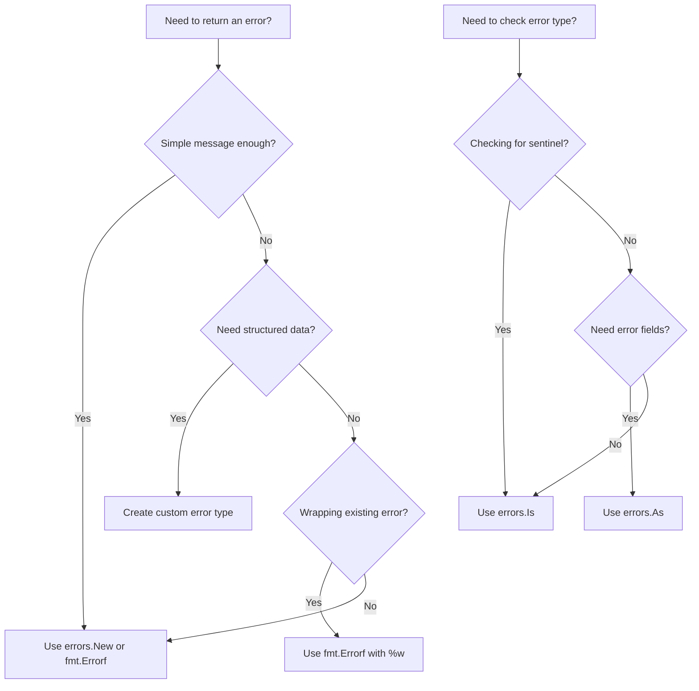

# How to Handle Errors Effectively in Go

Author: [nawazdhandala](https://www.github.com/nawazdhandala)

Tags: Go, Error Handling, Best Practices, Software Development, Backend

Description: A practical guide to Go's error handling patterns - from the error interface to custom errors, wrapping, sentinel errors, and production-ready techniques.

---

Go takes a different approach to error handling than most languages. There are no exceptions, no try-catch blocks, and no hidden control flow. Errors are just values, and you handle them explicitly. This design choice makes Go code predictable and forces you to think about failure cases upfront. Once you embrace it, error handling becomes one of Go's strengths rather than a chore.

## The Error Interface

At the heart of Go's error system is a simple interface. Any type that implements the `Error()` method is an error.

```go
// The built-in error interface - just one method
type error interface {
    Error() string
}
```

Functions that can fail return an error as their last return value. The caller checks if the error is nil and handles it accordingly.

```go
package main

import (
    "fmt"
    "os"
)

func main() {
    // Open a file - this returns a file handle and an error
    file, err := os.Open("config.json")
    if err != nil {
        fmt.Println("Failed to open config:", err)
        return
    }
    defer file.Close()

    // Continue with file processing...
}
```

This pattern appears everywhere in Go. It feels verbose at first, but it makes error paths explicit. You always know what can fail and how failures are handled.

## Creating Custom Errors

The simplest way to create an error is with `errors.New()` or `fmt.Errorf()`.

```go
package main

import (
    "errors"
    "fmt"
)

// errors.New creates a simple error with a message
var ErrInvalidInput = errors.New("invalid input provided")

func validateAge(age int) error {
    if age < 0 {
        // fmt.Errorf lets you format the error message
        return fmt.Errorf("age cannot be negative: got %d", age)
    }
    if age > 150 {
        return fmt.Errorf("age seems unrealistic: got %d", age)
    }
    return nil
}

func main() {
    if err := validateAge(-5); err != nil {
        fmt.Println("Validation failed:", err)
    }
}
```

For errors that need to carry additional data, define a custom error type.

```go
package main

import (
    "fmt"
)

// Custom error type with structured data
type ValidationError struct {
    Field   string
    Value   interface{}
    Message string
}

// Implement the error interface
func (e *ValidationError) Error() string {
    return fmt.Sprintf("validation failed on field %q: %s (got %v)",
        e.Field, e.Message, e.Value)
}

func validateUser(name string, age int) error {
    if name == "" {
        return &ValidationError{
            Field:   "name",
            Value:   name,
            Message: "cannot be empty",
        }
    }
    if age < 0 || age > 150 {
        return &ValidationError{
            Field:   "age",
            Value:   age,
            Message: "must be between 0 and 150",
        }
    }
    return nil
}

func main() {
    err := validateUser("", 25)
    if err != nil {
        fmt.Println(err)
        // Output: validation failed on field "name": cannot be empty (got )
    }
}
```

Custom error types are useful when callers need to inspect error details programmatically - not just print a message.

## Error Wrapping with fmt.Errorf

When an error propagates up the call stack, you often want to add context. Go 1.13 introduced the `%w` verb for wrapping errors.

```go
package main

import (
    "errors"
    "fmt"
    "os"
)

func readConfig(path string) ([]byte, error) {
    data, err := os.ReadFile(path)
    if err != nil {
        // Wrap the original error with context using %w
        return nil, fmt.Errorf("reading config file %s: %w", path, err)
    }
    return data, nil
}

func loadSettings() ([]byte, error) {
    data, err := readConfig("/etc/myapp/config.json")
    if err != nil {
        // Add another layer of context
        return nil, fmt.Errorf("loading settings: %w", err)
    }
    return data, nil
}

func main() {
    _, err := loadSettings()
    if err != nil {
        fmt.Println(err)
        // Output: loading settings: reading config file /etc/myapp/config.json:
        //         open /etc/myapp/config.json: no such file or directory
    }
}
```

The wrapped error chain preserves the original error while building a trail of context. This makes debugging production issues much easier - you see exactly where things went wrong and why.



## Unwrapping Errors with errors.Is and errors.As

Wrapped errors form a chain. Go provides two functions to inspect that chain: `errors.Is()` checks for a specific error value, and `errors.As()` extracts an error of a specific type.

### errors.Is - Checking for Sentinel Errors

Use `errors.Is()` when you want to check if an error (or any error in its chain) matches a specific sentinel error.

```go
package main

import (
    "errors"
    "fmt"
    "os"
)

func processFile(path string) error {
    _, err := os.Open(path)
    if err != nil {
        return fmt.Errorf("processing %s: %w", path, err)
    }
    return nil
}

func main() {
    err := processFile("missing.txt")

    // Check if the error chain contains os.ErrNotExist
    if errors.Is(err, os.ErrNotExist) {
        fmt.Println("File does not exist - create it first")
        return
    }

    // Check for permission errors
    if errors.Is(err, os.ErrPermission) {
        fmt.Println("Permission denied - check file permissions")
        return
    }

    if err != nil {
        fmt.Println("Unexpected error:", err)
    }
}
```

### errors.As - Extracting Custom Error Types

Use `errors.As()` when you need to extract a specific error type to access its fields.

```go
package main

import (
    "errors"
    "fmt"
    "net"
)

func connectToServer(addr string) error {
    conn, err := net.Dial("tcp", addr)
    if err != nil {
        return fmt.Errorf("connecting to server: %w", err)
    }
    defer conn.Close()
    return nil
}

func main() {
    err := connectToServer("invalid:99999")

    // Extract the underlying network error
    var netErr *net.OpError
    if errors.As(err, &netErr) {
        fmt.Printf("Network operation failed:\n")
        fmt.Printf("  Operation: %s\n", netErr.Op)
        fmt.Printf("  Network: %s\n", netErr.Net)
        fmt.Printf("  Address: %v\n", netErr.Addr)
        return
    }

    if err != nil {
        fmt.Println("Error:", err)
    }
}
```

The key difference: `errors.Is()` answers "is this error or any wrapped error equal to X?" while `errors.As()` answers "does this error chain contain an error of type T, and if so, give me that error."

## Sentinel Errors

Sentinel errors are package-level variables that represent specific error conditions. They give callers a way to check for known failure modes.

```go
package user

import (
    "errors"
)

// Sentinel errors - exported so callers can check for them
var (
    ErrNotFound      = errors.New("user not found")
    ErrAlreadyExists = errors.New("user already exists")
    ErrInvalidEmail  = errors.New("invalid email format")
)

type User struct {
    ID    string
    Email string
    Name  string
}

// In-memory store for demonstration
var users = make(map[string]*User)

func Create(email, name string) (*User, error) {
    if !isValidEmail(email) {
        return nil, ErrInvalidEmail
    }

    if _, exists := users[email]; exists {
        return nil, ErrAlreadyExists
    }

    user := &User{ID: generateID(), Email: email, Name: name}
    users[email] = user
    return user, nil
}

func GetByEmail(email string) (*User, error) {
    user, exists := users[email]
    if !exists {
        return nil, ErrNotFound
    }
    return user, nil
}

func isValidEmail(email string) bool {
    // Simplified validation
    return len(email) > 3 && contains(email, "@")
}

func contains(s, substr string) bool {
    for i := 0; i <= len(s)-len(substr); i++ {
        if s[i:i+len(substr)] == substr {
            return true
        }
    }
    return false
}

func generateID() string {
    return "user_123" // Simplified for example
}
```

Callers can then handle specific cases.

```go
package main

import (
    "errors"
    "fmt"
    "myapp/user"
)

func registerUser(email, name string) {
    _, err := user.Create(email, name)

    switch {
    case errors.Is(err, user.ErrAlreadyExists):
        fmt.Println("This email is already registered. Try logging in.")
    case errors.Is(err, user.ErrInvalidEmail):
        fmt.Println("Please enter a valid email address.")
    case err != nil:
        fmt.Println("Registration failed:", err)
    default:
        fmt.Println("Welcome! Your account has been created.")
    }
}

func main() {
    registerUser("alice@example.com", "Alice")
    registerUser("alice@example.com", "Alice Again") // Already exists
    registerUser("invalid", "Bob")                    // Invalid email
}
```

Sentinel errors work well for a fixed set of known conditions. If you need to attach dynamic data, use custom error types instead.

## Error Handling Patterns

### Pattern 1: Handle Once, at the Right Level

A common mistake is handling errors at every level - logging, then returning, then logging again. Handle errors once, at the level where you have enough context to make a decision.

```go
package main

import (
    "fmt"
    "log"
)

// Bad: logs at every level, creating noise
func badFetchData() error {
    err := queryDatabase()
    if err != nil {
        log.Println("database query failed:", err) // Logging here
        return err
    }
    return nil
}

func badProcessRequest() {
    err := badFetchData()
    if err != nil {
        log.Println("failed to fetch data:", err) // Logging again - duplicate
    }
}

// Good: wrap with context, handle at the top
func fetchData() error {
    err := queryDatabase()
    if err != nil {
        return fmt.Errorf("fetching data: %w", err) // Just wrap
    }
    return nil
}

func processRequest() {
    err := fetchData()
    if err != nil {
        log.Println("request failed:", err) // Handle once at the top
    }
}

func queryDatabase() error {
    return fmt.Errorf("connection refused")
}

func main() {
    processRequest()
}
```

### Pattern 2: Return Early, Keep the Happy Path Clear

Handling errors immediately keeps your main logic unindented and easy to follow.

```go
package main

import (
    "encoding/json"
    "fmt"
    "os"
)

type Config struct {
    Host string `json:"host"`
    Port int    `json:"port"`
}

// Clean: errors handled immediately, happy path is clear
func loadConfig(path string) (*Config, error) {
    data, err := os.ReadFile(path)
    if err != nil {
        return nil, fmt.Errorf("reading config: %w", err)
    }

    var cfg Config
    if err := json.Unmarshal(data, &cfg); err != nil {
        return nil, fmt.Errorf("parsing config: %w", err)
    }

    if cfg.Host == "" {
        return nil, fmt.Errorf("config: host is required")
    }

    if cfg.Port <= 0 || cfg.Port > 65535 {
        return nil, fmt.Errorf("config: invalid port %d", cfg.Port)
    }

    return &cfg, nil
}

func main() {
    cfg, err := loadConfig("config.json")
    if err != nil {
        fmt.Println("Error:", err)
        return
    }
    fmt.Printf("Loaded config: %s:%d\n", cfg.Host, cfg.Port)
}
```

### Pattern 3: Deferred Cleanup with Error Handling

When cleanup can fail (like closing a file or database transaction), capture errors properly.

```go
package main

import (
    "fmt"
    "os"
)

func writeToFile(path, content string) (err error) {
    file, err := os.Create(path)
    if err != nil {
        return fmt.Errorf("creating file: %w", err)
    }

    // Use named return to capture close errors
    defer func() {
        closeErr := file.Close()
        if err == nil && closeErr != nil {
            err = fmt.Errorf("closing file: %w", closeErr)
        }
    }()

    _, err = file.WriteString(content)
    if err != nil {
        return fmt.Errorf("writing content: %w", err)
    }

    return nil
}

func main() {
    if err := writeToFile("output.txt", "Hello, World!"); err != nil {
        fmt.Println("Error:", err)
        return
    }
    fmt.Println("File written successfully")
}
```

### Pattern 4: Collecting Multiple Errors

When validating multiple fields or processing batches, collect all errors instead of stopping at the first one.

```go
package main

import (
    "fmt"
    "strings"
)

type MultiError struct {
    Errors []error
}

func (m *MultiError) Error() string {
    if len(m.Errors) == 0 {
        return "no errors"
    }

    var msgs []string
    for _, err := range m.Errors {
        msgs = append(msgs, err.Error())
    }
    return strings.Join(msgs, "; ")
}

func (m *MultiError) Add(err error) {
    if err != nil {
        m.Errors = append(m.Errors, err)
    }
}

func (m *MultiError) HasErrors() bool {
    return len(m.Errors) > 0
}

type UserInput struct {
    Email    string
    Password string
    Age      int
}

func validateUserInput(input UserInput) error {
    errs := &MultiError{}

    if !strings.Contains(input.Email, "@") {
        errs.Add(fmt.Errorf("email: invalid format"))
    }

    if len(input.Password) < 8 {
        errs.Add(fmt.Errorf("password: must be at least 8 characters"))
    }

    if input.Age < 18 {
        errs.Add(fmt.Errorf("age: must be at least 18"))
    }

    if errs.HasErrors() {
        return errs
    }
    return nil
}

func main() {
    input := UserInput{
        Email:    "invalid",
        Password: "short",
        Age:      16,
    }

    if err := validateUserInput(input); err != nil {
        fmt.Println("Validation errors:", err)
        // Output: Validation errors: email: invalid format; password: must be
        //         at least 8 characters; age: must be at least 18
    }
}
```

## Best Practices Summary

Here are the patterns that will serve you well in production Go code:

| Practice | Why It Matters |
|----------|----------------|
| Always check returned errors | Ignored errors lead to silent failures and corrupt state |
| Add context when wrapping | `fmt.Errorf("doing X: %w", err)` creates debuggable error chains |
| Use sentinel errors for known conditions | Callers can handle specific cases with `errors.Is()` |
| Use custom types for structured data | Enables programmatic inspection with `errors.As()` |
| Handle errors once, at the right level | Avoids duplicate logging and unclear responsibility |
| Return early | Keeps the happy path readable and reduces nesting |
| Do not panic in libraries | Reserve panic for truly unrecoverable situations |

## Decision Flowchart

Use this to decide which error approach fits your situation.



## Putting It All Together

Here is a complete example showing these patterns working together in a realistic scenario.

```go
package main

import (
    "errors"
    "fmt"
    "strings"
)

// Sentinel errors for known failure modes
var (
    ErrUserNotFound     = errors.New("user not found")
    ErrInvalidInput     = errors.New("invalid input")
    ErrDatabaseTimeout  = errors.New("database timeout")
)

// Custom error type for validation failures
type ValidationError struct {
    Field   string
    Message string
}

func (e *ValidationError) Error() string {
    return fmt.Sprintf("%s: %s", e.Field, e.Message)
}

// Simulated database layer
func dbGetUser(id string) (map[string]string, error) {
    if id == "timeout" {
        return nil, ErrDatabaseTimeout
    }
    if id == "123" {
        return map[string]string{"id": "123", "name": "Alice"}, nil
    }
    return nil, ErrUserNotFound
}

// Service layer - wraps database errors with context
func getUserByID(id string) (map[string]string, error) {
    if id == "" {
        return nil, &ValidationError{Field: "id", Message: "cannot be empty"}
    }

    user, err := dbGetUser(id)
    if err != nil {
        return nil, fmt.Errorf("getUserByID(%s): %w", id, err)
    }

    return user, nil
}

// Handler layer - makes decisions based on error type
func handleGetUser(id string) {
    user, err := getUserByID(id)

    // Check for validation errors
    var validationErr *ValidationError
    if errors.As(err, &validationErr) {
        fmt.Printf("Bad request: %s\n", validationErr)
        return
    }

    // Check for known error conditions
    if errors.Is(err, ErrUserNotFound) {
        fmt.Printf("User %s not found\n", id)
        return
    }

    if errors.Is(err, ErrDatabaseTimeout) {
        fmt.Println("Database is slow, please retry")
        return
    }

    // Unknown error
    if err != nil {
        fmt.Printf("Internal error: %s\n", err)
        return
    }

    fmt.Printf("Found user: %s\n", user["name"])
}

func main() {
    fmt.Println("Test 1: Valid user")
    handleGetUser("123")

    fmt.Println("\nTest 2: Empty ID")
    handleGetUser("")

    fmt.Println("\nTest 3: User not found")
    handleGetUser("999")

    fmt.Println("\nTest 4: Database timeout")
    handleGetUser("timeout")
}
```

Go's error handling might feel tedious coming from languages with exceptions. But the explicitness pays off. Every error path is visible in the code. There is no hidden control flow. When something fails in production, the error chain tells you exactly what happened and where. That predictability is worth the extra keystrokes.
