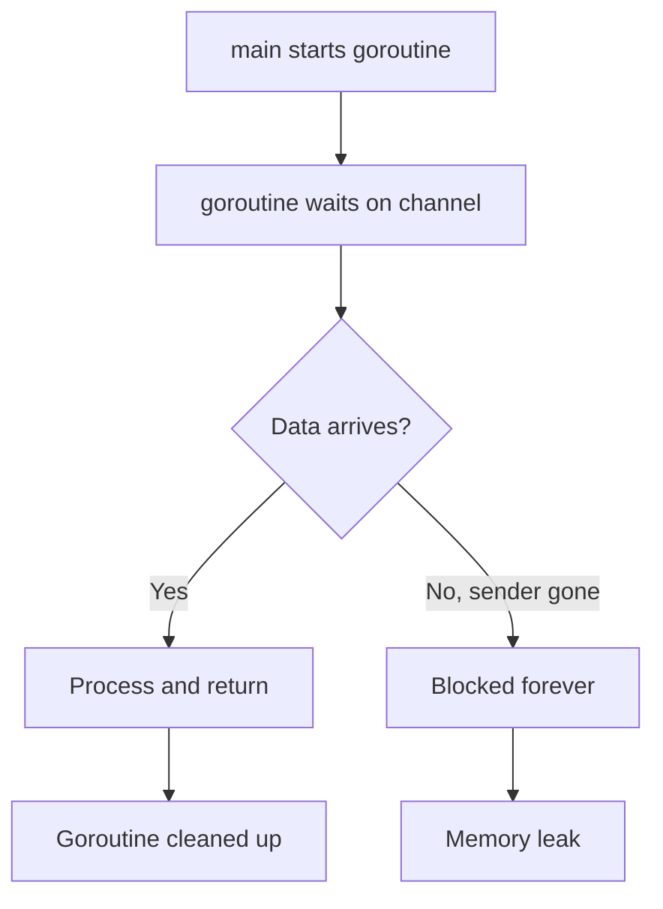
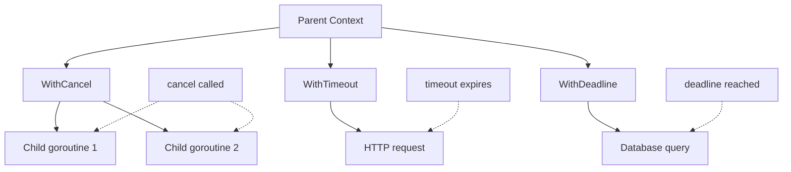
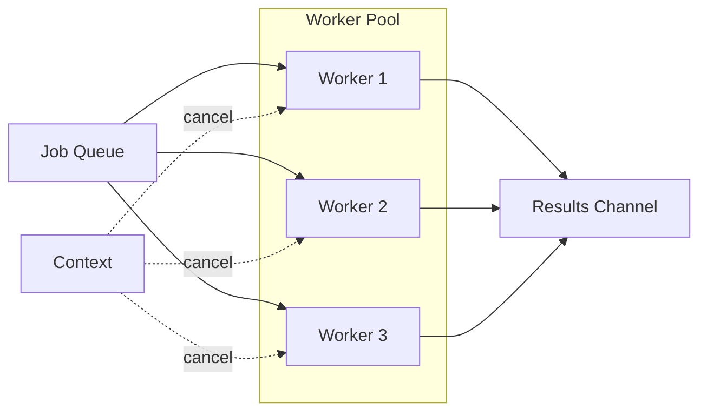

# How to Use Goroutines Without Memory Leaks

Author: [nawazdhandala](https://www.github.com/nawazdhandala)

Tags: Go, Golang, Concurrency, Performance, Memory, DevOps, Reliability

Description: A practical guide to writing leak-free goroutines using context cancellation, WaitGroups, and proven patterns for production Go applications.

---

Goroutines are one of Go's most powerful features. They're lightweight, cheap to create, and make concurrent programming approachable. But that ease of use comes with a trap: goroutines that never terminate. A leaked goroutine keeps consuming memory, holds onto resources, and can eventually bring down your application. The worst part? These leaks are silent. No error messages, no panics - just slowly growing memory until something breaks.

This guide covers the common causes of goroutine leaks and the patterns that prevent them.

## Understanding Goroutine Leaks

A goroutine leak occurs when a goroutine is started but never terminates. Unlike threads in other languages, the Go runtime doesn't forcibly kill goroutines. Once started, a goroutine runs until it returns or the program exits.



The most common scenarios that cause leaks:

| Leak Type | Cause | Symptom |
|-----------|-------|---------|
| Blocked channel read | Sender never sends or closes | Goroutine stuck waiting |
| Blocked channel send | Receiver stops receiving | Goroutine stuck sending |
| Infinite loop | No exit condition | CPU spike, memory growth |
| Missing cancellation | Parent doesn't signal shutdown | Goroutines outlive their purpose |
| Forgotten goroutine | Fire-and-forget pattern | Gradual resource exhaustion |

## Common Causes and Fixes

### 1. Blocked Channel Operations

The most frequent cause of goroutine leaks is a channel operation that never completes.

This example shows a goroutine blocked on a channel send because nobody is receiving:

```go
// LEAK: Goroutine blocked forever on send
func leakySearch(query string) string {
    results := make(chan string)

    go func() {
        // This goroutine will block forever if we return early
        results <- searchDatabase(query)
    }()

    go func() {
        // Same problem here
        results <- searchCache(query)
    }()

    // Return first result, second goroutine leaks
    return <-results
}
```

The fix uses a buffered channel so sends don't block even if nobody receives:

```go
// FIXED: Buffered channel allows non-blocking sends
func safeSearch(query string) string {
    // Buffer size matches number of senders
    results := make(chan string, 2)

    go func() {
        results <- searchDatabase(query)
    }()

    go func() {
        results <- searchCache(query)
    }()

    return <-results
}
```

### 2. Missing Channel Close

When a receiver waits for a channel that is never closed, it waits forever.

This function leaks because the channel is never closed after sending completes:

```go
// LEAK: Channel never closed, receiver blocks forever
func leakyProcessor(items []int) <-chan int {
    out := make(chan int)

    go func() {
        for _, item := range items {
            out <- item * 2
        }
        // Forgot to close(out)
    }()

    return out
}

func consumer() {
    ch := leakyProcessor([]int{1, 2, 3})
    for val := range ch {  // Blocks forever after last item
        fmt.Println(val)
    }
}
```

Always close channels when done sending:

```go
// FIXED: Close channel when done
func safeProcessor(items []int) <-chan int {
    out := make(chan int)

    go func() {
        defer close(out)  // Always close when done
        for _, item := range items {
            out <- item * 2
        }
    }()

    return out
}
```

### 3. Infinite Loops Without Exit Conditions

Background workers need a way to be told to stop.

This worker runs forever with no way to shut it down:

```go
// LEAK: No way to stop this goroutine
func leakyWorker() {
    go func() {
        for {
            doWork()
            time.Sleep(time.Second)
        }
    }()
}
```

Add a done channel or context for cancellation:

```go
// FIXED: Stoppable worker using done channel
func safeWorker(done <-chan struct{}) {
    go func() {
        ticker := time.NewTicker(time.Second)
        defer ticker.Stop()

        for {
            select {
            case <-done:
                return  // Clean exit
            case <-ticker.C:
                doWork()
            }
        }
    }()
}

// Usage
func main() {
    done := make(chan struct{})
    safeWorker(done)

    // Later, signal shutdown
    close(done)
}
```

### 4. Forgotten HTTP Request Goroutines

Making HTTP requests in goroutines without timeouts or cancellation is risky.

This code starts a goroutine for each URL but has no timeout or cancellation:

```go
// LEAK: No timeout, no cancellation
func leakyFetch(urls []string) {
    for _, url := range urls {
        go func(u string) {
            resp, err := http.Get(u)  // Could hang forever
            if err != nil {
                return
            }
            defer resp.Body.Close()
            processResponse(resp)
        }(url)
    }
}
```

Use context with timeout and wait for all goroutines:

```go
// FIXED: Context with timeout, proper cleanup
func safeFetch(ctx context.Context, urls []string) error {
    ctx, cancel := context.WithTimeout(ctx, 30*time.Second)
    defer cancel()

    var wg sync.WaitGroup
    errCh := make(chan error, len(urls))

    for _, url := range urls {
        wg.Add(1)
        go func(u string) {
            defer wg.Done()

            req, err := http.NewRequestWithContext(ctx, "GET", u, nil)
            if err != nil {
                errCh <- err
                return
            }

            resp, err := http.DefaultClient.Do(req)
            if err != nil {
                errCh <- err
                return
            }
            defer resp.Body.Close()
            processResponse(resp)
        }(url)
    }

    wg.Wait()
    close(errCh)

    // Return first error if any
    for err := range errCh {
        if err != nil {
            return err
        }
    }
    return nil
}
```

## Using Context for Cancellation

Context is Go's standard mechanism for cancellation propagation. It should flow through your entire call chain.



### Context Cancellation Pattern

Every goroutine should check for context cancellation:

```go
func worker(ctx context.Context, jobs <-chan Job, results chan<- Result) {
    for {
        select {
        case <-ctx.Done():
            // Context cancelled, clean up and exit
            return
        case job, ok := <-jobs:
            if !ok {
                // Channel closed, exit
                return
            }

            // Check context before expensive work
            if ctx.Err() != nil {
                return
            }

            result := processJob(ctx, job)

            select {
            case <-ctx.Done():
                return
            case results <- result:
            }
        }
    }
}
```

### Propagating Context Through Your Application

Build a proper shutdown flow from main:

```go
func main() {
    // Create root context that cancels on interrupt signal
    ctx, cancel := signal.NotifyContext(
        context.Background(),
        os.Interrupt,
        syscall.SIGTERM,
    )
    defer cancel()

    // Start services with context
    srv := NewServer(ctx)

    // Run blocks until context is cancelled
    if err := srv.Run(); err != nil && err != context.Canceled {
        log.Fatal(err)
    }

    log.Println("Shutdown complete")
}

type Server struct {
    ctx context.Context
}

func NewServer(ctx context.Context) *Server {
    return &Server{ctx: ctx}
}

func (s *Server) Run() error {
    var wg sync.WaitGroup

    // Start workers
    wg.Add(1)
    go func() {
        defer wg.Done()
        s.runWorker(s.ctx)
    }()

    // Wait for context cancellation
    <-s.ctx.Done()

    // Wait for workers to finish
    wg.Wait()

    return s.ctx.Err()
}
```

## WaitGroups for Goroutine Lifecycle Management

sync.WaitGroup tracks when a group of goroutines completes. Use it whenever you spawn multiple goroutines that need to finish before proceeding.

### Basic WaitGroup Pattern

```go
func processItems(items []Item) {
    var wg sync.WaitGroup

    for _, item := range items {
        wg.Add(1)  // Increment before starting goroutine
        go func(it Item) {
            defer wg.Done()  // Decrement when done
            process(it)
        }(item)
    }

    wg.Wait()  // Block until all goroutines complete
}
```

### Combining Context and WaitGroup

This pattern ensures all goroutines stop on cancellation and you wait for cleanup:

```go
func processWithCancellation(ctx context.Context, items []Item) error {
    ctx, cancel := context.WithCancel(ctx)
    defer cancel()  // Ensure cancellation on return

    var wg sync.WaitGroup
    errCh := make(chan error, 1)

    for _, item := range items {
        wg.Add(1)
        go func(it Item) {
            defer wg.Done()

            if err := processItem(ctx, it); err != nil {
                select {
                case errCh <- err:
                    cancel()  // Signal other goroutines to stop
                default:
                    // Error channel full, another error already recorded
                }
            }
        }(item)
    }

    // Wait for all goroutines in a separate goroutine
    go func() {
        wg.Wait()
        close(errCh)
    }()

    // Return first error or nil
    return <-errCh
}
```

## Worker Pool Pattern

A bounded worker pool prevents unbounded goroutine creation while still enabling concurrency.



Here is a clean implementation:

```go
type WorkerPool struct {
    jobs    chan Job
    results chan Result
    ctx     context.Context
    cancel  context.CancelFunc
    wg      sync.WaitGroup
}

func NewWorkerPool(ctx context.Context, numWorkers int) *WorkerPool {
    ctx, cancel := context.WithCancel(ctx)

    p := &WorkerPool{
        jobs:    make(chan Job, numWorkers*2),
        results: make(chan Result, numWorkers*2),
        ctx:     ctx,
        cancel:  cancel,
    }

    // Start workers
    for i := 0; i < numWorkers; i++ {
        p.wg.Add(1)
        go p.worker(i)
    }

    return p
}

func (p *WorkerPool) worker(id int) {
    defer p.wg.Done()

    for {
        select {
        case <-p.ctx.Done():
            return
        case job, ok := <-p.jobs:
            if !ok {
                return
            }

            result := job.Process(p.ctx)

            select {
            case <-p.ctx.Done():
                return
            case p.results <- result:
            }
        }
    }
}

func (p *WorkerPool) Submit(job Job) error {
    select {
    case <-p.ctx.Done():
        return p.ctx.Err()
    case p.jobs <- job:
        return nil
    }
}

func (p *WorkerPool) Results() <-chan Result {
    return p.results
}

func (p *WorkerPool) Shutdown() {
    p.cancel()
    close(p.jobs)
    p.wg.Wait()
    close(p.results)
}
```

## Detecting Goroutine Leaks

### Runtime Goroutine Count

Monitor the number of active goroutines over time:

```go
func monitorGoroutines(ctx context.Context, interval time.Duration) {
    ticker := time.NewTicker(interval)
    defer ticker.Stop()

    var baseline int

    for {
        select {
        case <-ctx.Done():
            return
        case <-ticker.C:
            count := runtime.NumGoroutine()

            if baseline == 0 {
                baseline = count
            }

            // Alert if goroutines grew significantly
            if count > baseline*2 {
                log.Printf("WARNING: Goroutine count grew from %d to %d",
                    baseline, count)
            }

            // Export metric for observability
            goroutineGauge.Set(float64(count))
        }
    }
}
```

### Stack Traces for Debugging

Get stack traces of all goroutines when a leak is suspected:

```go
func dumpGoroutineStacks() {
    buf := make([]byte, 1024*1024)
    n := runtime.Stack(buf, true)  // true = all goroutines

    filename := fmt.Sprintf("goroutines-%d.txt", time.Now().Unix())
    os.WriteFile(filename, buf[:n], 0644)

    log.Printf("Dumped %d bytes of goroutine stacks to %s", n, filename)
}

// Expose via debug endpoint
func debugHandler(w http.ResponseWriter, r *http.Request) {
    w.Header().Set("Content-Type", "text/plain")

    buf := make([]byte, 1024*1024)
    n := runtime.Stack(buf, true)
    w.Write(buf[:n])
}
```

### Using pprof for Production Debugging

Go's built-in pprof is essential for debugging goroutine leaks. Add it to your application:

```go
import (
    "net/http"
    _ "net/http/pprof"
)

func main() {
    // Start pprof server on separate port
    go func() {
        log.Println(http.ListenAndServe(":6060", nil))
    }()

    // Your application code
}
```

Then analyze from the command line:

```bash
# View goroutine stacks in terminal
curl http://localhost:6060/debug/pprof/goroutine?debug=1

# Download and analyze with go tool
go tool pprof http://localhost:6060/debug/pprof/goroutine

# Compare profiles over time to find growth
go tool pprof -base profile1.pb.gz profile2.pb.gz
```

### Testing for Leaks with goleak

Uber's goleak package catches leaks in tests before they reach production:

```bash
go get -u go.uber.org/goleak
```

Use it in your tests:

```go
import (
    "testing"
    "go.uber.org/goleak"
)

func TestMain(m *testing.M) {
    goleak.VerifyTestMain(m)
}

func TestWorkerPool(t *testing.T) {
    defer goleak.VerifyNone(t)

    ctx, cancel := context.WithCancel(context.Background())
    pool := NewWorkerPool(ctx, 4)

    // Submit work
    for i := 0; i < 10; i++ {
        pool.Submit(Job{ID: i})
    }

    // Collect results
    for i := 0; i < 10; i++ {
        <-pool.Results()
    }

    // Clean shutdown
    cancel()
    pool.Shutdown()

    // goleak.VerifyNone checks no goroutines leaked
}
```

## Leak Prevention Checklist

| Pattern | Implementation |
|---------|----------------|
| Every goroutine has an exit path | Use context or done channel |
| Channels are closed when done sending | Use `defer close(ch)` |
| Buffered channels for fire-and-forget sends | Match buffer size to sender count |
| HTTP requests have timeouts | Use `context.WithTimeout` |
| Worker pools have shutdown methods | Cancel context, wait for workers |
| Tests verify no leaks | Use `goleak.VerifyNone` |
| Production monitors goroutine count | Export `runtime.NumGoroutine()` |

## Complete Example: Leak-Free Pipeline

Here is a complete example that ties together all the patterns:

```go
package main

import (
    "context"
    "fmt"
    "os"
    "os/signal"
    "runtime"
    "sync"
    "syscall"
    "time"
)

// Pipeline processes items through multiple stages
type Pipeline struct {
    ctx    context.Context
    cancel context.CancelFunc
    wg     sync.WaitGroup
}

func NewPipeline(ctx context.Context) *Pipeline {
    ctx, cancel := context.WithCancel(ctx)
    return &Pipeline{ctx: ctx, cancel: cancel}
}

// Stage 1: Generate numbers
func (p *Pipeline) generate(nums ...int) <-chan int {
    out := make(chan int)

    p.wg.Add(1)
    go func() {
        defer p.wg.Done()
        defer close(out)

        for _, n := range nums {
            select {
            case <-p.ctx.Done():
                return
            case out <- n:
            }
        }
    }()

    return out
}

// Stage 2: Square numbers with multiple workers
func (p *Pipeline) square(in <-chan int, workers int) <-chan int {
    out := make(chan int)

    var workerWg sync.WaitGroup
    for i := 0; i < workers; i++ {
        workerWg.Add(1)
        go func() {
            defer workerWg.Done()

            for n := range in {
                select {
                case <-p.ctx.Done():
                    return
                case out <- n * n:
                }
            }
        }()
    }

    // Close output when all workers done
    p.wg.Add(1)
    go func() {
        defer p.wg.Done()
        workerWg.Wait()
        close(out)
    }()

    return out
}

// Stage 3: Collect results
func (p *Pipeline) collect(in <-chan int) []int {
    var results []int

    for n := range in {
        select {
        case <-p.ctx.Done():
            return results
        default:
            results = append(results, n)
        }
    }

    return results
}

func (p *Pipeline) Shutdown() {
    p.cancel()
    p.wg.Wait()
}

func main() {
    // Context with signal handling
    ctx, cancel := signal.NotifyContext(
        context.Background(),
        os.Interrupt,
        syscall.SIGTERM,
    )
    defer cancel()

    // Monitor goroutine count
    go func() {
        ticker := time.NewTicker(time.Second)
        defer ticker.Stop()
        for {
            select {
            case <-ctx.Done():
                return
            case <-ticker.C:
                fmt.Printf("Goroutines: %d\n", runtime.NumGoroutine())
            }
        }
    }()

    // Run pipeline
    pipe := NewPipeline(ctx)

    nums := pipe.generate(1, 2, 3, 4, 5, 6, 7, 8, 9, 10)
    squared := pipe.square(nums, 3)
    results := pipe.collect(squared)

    fmt.Println("Results:", results)

    // Clean shutdown
    pipe.Shutdown()

    // Final goroutine count
    time.Sleep(100 * time.Millisecond)
    fmt.Printf("Final goroutine count: %d\n", runtime.NumGoroutine())
}
```

## Summary

Goroutine leaks are preventable with disciplined patterns:

1. Every goroutine needs an exit path - use context or done channels
2. Close channels when done sending - receivers need to know when to stop
3. Use buffered channels when senders should not block
4. Combine context with WaitGroups for coordinated shutdown
5. Test with goleak to catch leaks before production
6. Monitor goroutine counts as a runtime metric

The Go runtime gives you powerful concurrency primitives. Using them safely requires thinking about the full lifecycle of every goroutine you create. When in doubt, ask: "How does this goroutine know when to stop?"

---

*Track your Go applications with OneUptime's OpenTelemetry-native observability. Monitor goroutine counts, memory usage, and more - all in one place.*
