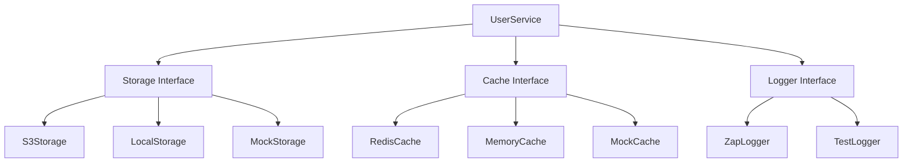
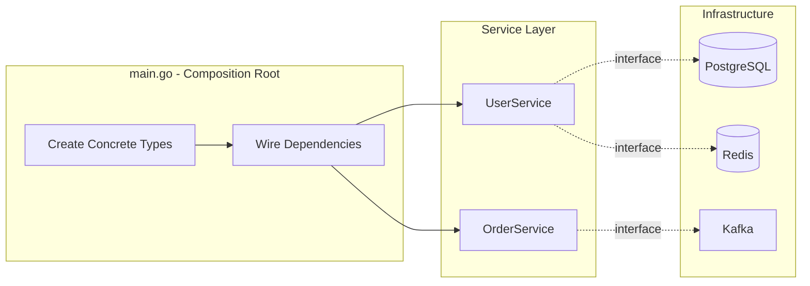

# How to Use Go Interfaces for Dependency Injection

Author: [nawazdhandala](https://www.github.com/nawazdhandala)

Tags: Go, Golang, Dependency Injection, Testing, Software Architecture

Description: Go interfaces enable clean dependency injection through implicit implementation - no decorators, no frameworks, just simple contracts that make your code testable and flexible.

---

Dependency injection sounds fancy, but at its core it just means passing dependencies into a function or struct instead of creating them inside. Go makes this pattern dead simple through interfaces. Unlike Java or C# where you explicitly declare that a class implements an interface, Go uses implicit implementation. If your type has the right methods, it satisfies the interface. No keywords required.

This design choice has profound implications for how we structure Go applications. You can define interfaces where you use them, not where you implement them. Your tests can mock any external dependency without touching the original code. Third-party packages become interchangeable. Let me show you how this works in practice.

## Interface Basics in Go

In Go, an interface is a set of method signatures. Any type that implements all those methods automatically satisfies the interface.

This Reader interface declares a single method. Any type with a matching Read method automatically satisfies it - no explicit declaration needed.

```go
// Reader is an interface that wraps the basic Read method.
// Any type with this method signature automatically implements Reader.
type Reader interface {
    Read(p []byte) (n int, err error)
}

// FileReader implements Reader implicitly by having a Read method
type FileReader struct {
    file *os.File
}

// Read satisfies the Reader interface - no "implements" keyword needed
func (f *FileReader) Read(p []byte) (n int, err error) {
    return f.file.Read(p)
}

// StringReader also implements Reader
type StringReader struct {
    data string
    pos  int
}

// This Read method makes StringReader a Reader automatically
func (s *StringReader) Read(p []byte) (n int, err error) {
    if s.pos >= len(s.data) {
        return 0, io.EOF
    }
    n = copy(p, s.data[s.pos:])
    s.pos += n
    return n, nil
}
```

The consumer of a Reader does not care about the concrete type. It only cares about the Read method.

This function accepts anything that satisfies the Reader interface. It works with files, strings, network connections, or any custom implementation.

```go
// ProcessData works with any Reader - files, strings, network, mocks
func ProcessData(r Reader) error {
    buf := make([]byte, 1024)
    for {
        n, err := r.Read(buf)
        if err == io.EOF {
            break
        }
        if err != nil {
            return err
        }
        // Process buf[:n]
        fmt.Printf("Read %d bytes\n", n)
    }
    return nil
}
```

## Implicit Implementation is the Key

The magic of Go interfaces is that the implementer does not need to know about the interface at compile time. You can define an interface in your package that matches methods from a third-party package, and it just works.

Here we define our own Storage interface that happens to match the Put method signature of some external SDK. The SDK never heard of our interface, but it still works.

```go
package myapp

// Storage defines what we need from an object storage service.
// We define this interface - the implementation doesn't need to know about it.
type Storage interface {
    Put(key string, data []byte) error
    Get(key string) ([]byte, error)
    Delete(key string) error
}

// UserService depends on the Storage interface, not a concrete implementation
type UserService struct {
    storage Storage
}

// NewUserService injects the storage dependency through the constructor
func NewUserService(s Storage) *UserService {
    return &UserService{storage: s}
}

// SaveAvatar uses the injected storage - it could be S3, GCS, or a test mock
func (u *UserService) SaveAvatar(userID string, data []byte) error {
    key := fmt.Sprintf("avatars/%s.png", userID)
    return u.storage.Put(key, data)
}
```

Now any struct with matching methods can be passed to UserService. The S3 client, a Google Cloud Storage client, or a simple in-memory map for tests all work the same way.

## The Dependency Injection Pattern

Here is a typical service with multiple dependencies. Each dependency is an interface, injected through the constructor. This makes the service testable and its dependencies explicit.



Each interface can have multiple implementations. Production code uses real services. Tests use mocks or in-memory implementations. Swapping implementations is a one-line change at the composition root.

```go
package user

// All dependencies are interfaces - defined where they're used
type Repository interface {
    FindByID(id string) (*User, error)
    Save(user *User) error
}

type Cache interface {
    Get(key string) ([]byte, bool)
    Set(key string, value []byte, ttl time.Duration)
}

type EventPublisher interface {
    Publish(topic string, event interface{}) error
}

// Service has all dependencies injected through the constructor
type Service struct {
    repo   Repository
    cache  Cache
    events EventPublisher
}

// NewService is the constructor - this is where injection happens
func NewService(repo Repository, cache Cache, events EventPublisher) *Service {
    return &Service{
        repo:   repo,
        cache:  cache,
        events: events,
    }
}

// GetUser uses injected dependencies - completely testable
func (s *Service) GetUser(id string) (*User, error) {
    // Try cache first
    cacheKey := "user:" + id
    if data, ok := s.cache.Get(cacheKey); ok {
        var user User
        if err := json.Unmarshal(data, &user); err == nil {
            return &user, nil
        }
    }

    // Cache miss - fetch from repository
    user, err := s.repo.FindByID(id)
    if err != nil {
        return nil, err
    }

    // Populate cache for next time
    if data, err := json.Marshal(user); err == nil {
        s.cache.Set(cacheKey, data, 5*time.Minute)
    }

    return user, nil
}
```

## Testing with Mocks

Here is where dependency injection pays off. Testing becomes trivial because you control every dependency.

Mock implementations let you control behavior and verify interactions. You can simulate errors, track method calls, and return predefined data without touching real databases or services.

```go
package user_test

import (
    "testing"
    "github.com/yourorg/app/user"
)

// MockRepository implements user.Repository for testing
type MockRepository struct {
    users    map[string]*user.User
    findErr  error  // Simulate errors when needed
    saveErr  error
    saveCalled bool  // Track if Save was called
}

func NewMockRepository() *MockRepository {
    return &MockRepository{
        users: make(map[string]*user.User),
    }
}

func (m *MockRepository) FindByID(id string) (*user.User, error) {
    if m.findErr != nil {
        return nil, m.findErr
    }
    if u, ok := m.users[id]; ok {
        return u, nil
    }
    return nil, user.ErrNotFound
}

func (m *MockRepository) Save(u *user.User) error {
    m.saveCalled = true
    if m.saveErr != nil {
        return m.saveErr
    }
    m.users[u.ID] = u
    return nil
}

// MockCache implements user.Cache for testing
type MockCache struct {
    data map[string][]byte
    hits int  // Track cache hits for assertions
}

func NewMockCache() *MockCache {
    return &MockCache{data: make(map[string][]byte)}
}

func (m *MockCache) Get(key string) ([]byte, bool) {
    if v, ok := m.data[key]; ok {
        m.hits++
        return v, true
    }
    return nil, false
}

func (m *MockCache) Set(key string, value []byte, ttl time.Duration) {
    m.data[key] = value
}

// MockEventPublisher implements user.EventPublisher for testing
type MockEventPublisher struct {
    published []interface{}  // Collect all published events
}

func (m *MockEventPublisher) Publish(topic string, event interface{}) error {
    m.published = append(m.published, event)
    return nil
}
```

With mocks in place, tests become straightforward. You set up the mock state, call the method under test, and verify the results and interactions.

```go
func TestGetUser_CacheMiss(t *testing.T) {
    // Arrange - set up mocks with known state
    repo := NewMockRepository()
    repo.users["123"] = &user.User{ID: "123", Name: "Alice"}

    cache := NewMockCache()  // Empty cache
    events := &MockEventPublisher{}

    // Inject mocks into the service
    svc := user.NewService(repo, cache, events)

    // Act
    u, err := svc.GetUser("123")

    // Assert
    if err != nil {
        t.Fatalf("unexpected error: %v", err)
    }
    if u.Name != "Alice" {
        t.Errorf("expected Alice, got %s", u.Name)
    }
    // Verify cache was populated after the miss
    if _, ok := cache.data["user:123"]; !ok {
        t.Error("expected cache to be populated")
    }
}

func TestGetUser_CacheHit(t *testing.T) {
    repo := NewMockRepository()
    cache := NewMockCache()
    events := &MockEventPublisher{}

    // Pre-populate cache
    userData, _ := json.Marshal(&user.User{ID: "456", Name: "Bob"})
    cache.data["user:456"] = userData

    svc := user.NewService(repo, cache, events)

    u, err := svc.GetUser("456")

    if err != nil {
        t.Fatalf("unexpected error: %v", err)
    }
    if u.Name != "Bob" {
        t.Errorf("expected Bob, got %s", u.Name)
    }
    // Verify cache was hit
    if cache.hits != 1 {
        t.Errorf("expected 1 cache hit, got %d", cache.hits)
    }
}

func TestGetUser_RepositoryError(t *testing.T) {
    repo := NewMockRepository()
    repo.findErr = errors.New("database connection failed")  // Simulate failure

    cache := NewMockCache()
    events := &MockEventPublisher{}

    svc := user.NewService(repo, cache, events)

    _, err := svc.GetUser("789")

    // Verify error propagates correctly
    if err == nil {
        t.Fatal("expected error, got nil")
    }
    if !strings.Contains(err.Error(), "database connection failed") {
        t.Errorf("unexpected error message: %v", err)
    }
}
```

## Interface Composition

Go allows you to compose interfaces from smaller interfaces. This follows the interface segregation principle - clients should not depend on methods they do not use.

Start with small, focused interfaces. Then compose them into larger ones when you need multiple capabilities together.

```go
// Small, focused interfaces
type Reader interface {
    Read(p []byte) (n int, err error)
}

type Writer interface {
    Write(p []byte) (n int, err error)
}

type Closer interface {
    Close() error
}

// Composed interfaces - combine capabilities as needed
type ReadWriter interface {
    Reader
    Writer
}

type ReadCloser interface {
    Reader
    Closer
}

type WriteCloser interface {
    Writer
    Closer
}

type ReadWriteCloser interface {
    Reader
    Writer
    Closer
}
```

Here is a practical example with a database interface. You might have read-only access in some contexts and full access in others.

```go
// QueryExecutor handles read operations
type QueryExecutor interface {
    Query(query string, args ...interface{}) (*sql.Rows, error)
    QueryRow(query string, args ...interface{}) *sql.Row
}

// CommandExecutor handles write operations
type CommandExecutor interface {
    Exec(query string, args ...interface{}) (sql.Result, error)
}

// TransactionStarter can begin transactions
type TransactionStarter interface {
    Begin() (*sql.Tx, error)
}

// Database combines all capabilities - use this when you need everything
type Database interface {
    QueryExecutor
    CommandExecutor
    TransactionStarter
}

// ReportGenerator only needs read access - accepts the smaller interface
type ReportGenerator struct {
    db QueryExecutor  // Cannot accidentally write to the database
}

// OrderProcessor needs full access
type OrderProcessor struct {
    db Database
}
```

## Real-World Example: HTTP Client Abstraction

External API calls are a common dependency to abstract. Here is how to wrap an HTTP client for testability.

This HTTPClient interface captures only what we need from the standard library. We can now mock HTTP calls without running a test server.

```go
package github

import (
    "encoding/json"
    "fmt"
    "io"
    "net/http"
    "time"
)

// HTTPClient defines what we need from an HTTP client.
// The standard http.Client satisfies this interface.
type HTTPClient interface {
    Do(req *http.Request) (*http.Response, error)
}

// Client wraps GitHub API operations
type Client struct {
    httpClient HTTPClient
    baseURL    string
    token      string
}

// NewClient creates a GitHub client with the given HTTP client.
// In production, pass http.DefaultClient or a configured *http.Client.
// In tests, pass a mock.
func NewClient(httpClient HTTPClient, token string) *Client {
    return &Client{
        httpClient: httpClient,
        baseURL:    "https://api.github.com",
        token:      token,
    }
}

// Repository represents a GitHub repository
type Repository struct {
    ID          int64     `json:"id"`
    Name        string    `json:"name"`
    FullName    string    `json:"full_name"`
    Description string    `json:"description"`
    Stars       int       `json:"stargazers_count"`
    CreatedAt   time.Time `json:"created_at"`
}

// GetRepository fetches repository information
func (c *Client) GetRepository(owner, repo string) (*Repository, error) {
    url := fmt.Sprintf("%s/repos/%s/%s", c.baseURL, owner, repo)

    req, err := http.NewRequest("GET", url, nil)
    if err != nil {
        return nil, fmt.Errorf("creating request: %w", err)
    }

    req.Header.Set("Authorization", "token "+c.token)
    req.Header.Set("Accept", "application/vnd.github.v3+json")

    // Uses injected HTTP client - could be real or mock
    resp, err := c.httpClient.Do(req)
    if err != nil {
        return nil, fmt.Errorf("executing request: %w", err)
    }
    defer resp.Body.Close()

    if resp.StatusCode != http.StatusOK {
        body, _ := io.ReadAll(resp.Body)
        return nil, fmt.Errorf("API error %d: %s", resp.StatusCode, body)
    }

    var repository Repository
    if err := json.NewDecoder(resp.Body).Decode(&repository); err != nil {
        return nil, fmt.Errorf("decoding response: %w", err)
    }

    return &repository, nil
}
```

Now testing GitHub API calls requires no network access. You control every response.

```go
package github_test

import (
    "bytes"
    "io"
    "net/http"
    "testing"
    "github.com/yourorg/app/github"
)

// MockHTTPClient records requests and returns predefined responses
type MockHTTPClient struct {
    Response *http.Response
    Error    error
    Requests []*http.Request  // Record requests for assertions
}

func (m *MockHTTPClient) Do(req *http.Request) (*http.Response, error) {
    m.Requests = append(m.Requests, req)
    return m.Response, m.Error
}

func TestGetRepository(t *testing.T) {
    // Prepare mock response with valid JSON
    responseBody := `{
        "id": 12345,
        "name": "oneuptime",
        "full_name": "oneuptime/oneuptime",
        "description": "Open source observability platform",
        "stargazers_count": 1500
    }`

    mockClient := &MockHTTPClient{
        Response: &http.Response{
            StatusCode: 200,
            Body:       io.NopCloser(bytes.NewBufferString(responseBody)),
        },
    }

    // Inject mock instead of real HTTP client
    client := github.NewClient(mockClient, "test-token")

    repo, err := client.GetRepository("oneuptime", "oneuptime")

    if err != nil {
        t.Fatalf("unexpected error: %v", err)
    }
    if repo.Name != "oneuptime" {
        t.Errorf("expected oneuptime, got %s", repo.Name)
    }
    if repo.Stars != 1500 {
        t.Errorf("expected 1500 stars, got %d", repo.Stars)
    }

    // Verify the request was formed correctly
    if len(mockClient.Requests) != 1 {
        t.Fatalf("expected 1 request, got %d", len(mockClient.Requests))
    }
    req := mockClient.Requests[0]
    if req.Header.Get("Authorization") != "token test-token" {
        t.Error("authorization header not set correctly")
    }
}

func TestGetRepository_NotFound(t *testing.T) {
    mockClient := &MockHTTPClient{
        Response: &http.Response{
            StatusCode: 404,
            Body:       io.NopCloser(bytes.NewBufferString(`{"message": "Not Found"}`)),
        },
    }

    client := github.NewClient(mockClient, "test-token")

    _, err := client.GetRepository("nonexistent", "repo")

    if err == nil {
        t.Fatal("expected error for 404 response")
    }
}
```

## Wiring It All Together

In a real application, you wire up all dependencies at the composition root - typically in main.go. This is the only place that knows about concrete implementations.

```go
package main

import (
    "database/sql"
    "log"
    "net/http"
    "os"
    "time"

    "github.com/yourorg/app/user"
    "github.com/yourorg/app/storage"
    "github.com/yourorg/app/cache"
    "github.com/yourorg/app/events"
    _ "github.com/lib/pq"
)

func main() {
    // Create concrete implementations
    db, err := sql.Open("postgres", os.Getenv("DATABASE_URL"))
    if err != nil {
        log.Fatal(err)
    }
    defer db.Close()

    // All concrete types are created here at the composition root
    userRepo := storage.NewPostgresUserRepository(db)
    redisCache := cache.NewRedisCache(os.Getenv("REDIS_URL"))
    kafkaPublisher := events.NewKafkaPublisher(os.Getenv("KAFKA_BROKERS"))

    // Inject dependencies - the service only sees interfaces
    userService := user.NewService(userRepo, redisCache, kafkaPublisher)

    // Set up HTTP handlers
    http.HandleFunc("/users/", userService.HandleGetUser)

    log.Println("Server starting on :8080")
    log.Fatal(http.ListenAndServe(":8080", nil))
}
```



## Best Practices

**Keep interfaces small.** A single-method interface is often ideal. The io.Reader and io.Writer interfaces from the standard library are excellent examples.

**Define interfaces where they are used, not where they are implemented.** Your user package defines what it needs from a repository. The storage package provides an implementation without importing user.

**Accept interfaces, return structs.** Functions should accept interface parameters for flexibility but return concrete types for clarity.

```go
// Good - accepts interface, returns concrete type
func NewService(repo Repository) *Service {
    return &Service{repo: repo}
}

// Avoid - returning an interface hides the concrete type unnecessarily
func NewService(repo Repository) ServiceInterface {
    return &Service{repo: repo}
}
```

**Use constructor injection.** Pass dependencies through constructors rather than setting them after creation. This makes dependencies explicit and required.

```go
// Good - dependencies are explicit and required
func NewOrderService(repo Repository, notifier Notifier) *OrderService {
    return &OrderService{repo: repo, notifier: notifier}
}

// Avoid - dependencies are implicit and optional
type OrderService struct {
    Repo     Repository  // Public fields can be nil
    Notifier Notifier
}
```

**Avoid interface pollution.** Do not create an interface for every type. Only create interfaces when you have multiple implementations or need testability through mocking.

---

Go interfaces and dependency injection work together naturally. The implicit implementation model removes boilerplate while keeping your code decoupled and testable. Define small interfaces where you need them, inject dependencies through constructors, and write tests that control every external interaction. Your production code uses real implementations. Your tests use mocks. The service layer never knows the difference.
