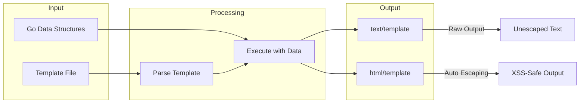
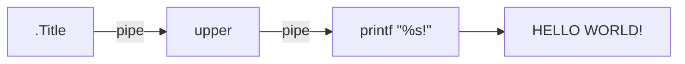
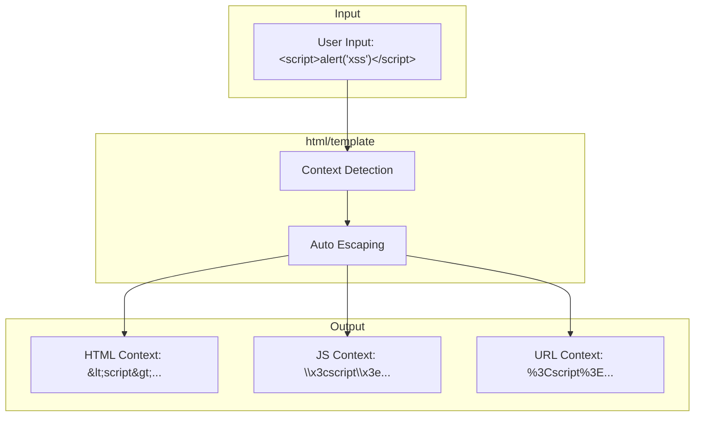

# How to Use Go Templates for HTML Generation

Author: [nawazdhandala](https://www.github.com/nawazdhandala)

Tags: Go, Templates, HTML, Web Development, Backend, text/template, html/template

Description: A practical guide to generating dynamic HTML with Go's template packages, covering syntax, actions, pipelines, custom functions, and security best practices.

---

Go ships with two powerful templating packages in its standard library: `text/template` and `html/template`. If you're building web applications or generating any kind of dynamic HTML, these packages give you everything you need without pulling in external dependencies. They share the same syntax and API, but `html/template` adds automatic escaping to protect against cross-site scripting (XSS) attacks.

## Understanding the Two Template Packages



The rule is simple: use `html/template` for anything that ends up in a browser, and `text/template` for everything else like config files, emails, or code generation.

## Basic Template Syntax

Templates use double curly braces to mark dynamic content. Everything outside the braces passes through unchanged.

Here is a simple template that renders a greeting:

```go
package main

import (
    "html/template"
    "os"
)

func main() {
    // Define a simple template with a placeholder
    tmpl := `<h1>Hello, {{.Name}}!</h1>`

    // Parse the template string
    t, err := template.New("greeting").Parse(tmpl)
    if err != nil {
        panic(err)
    }

    // Define data to pass into the template
    data := struct {
        Name string
    }{
        Name: "World",
    }

    // Execute the template, writing output to stdout
    err = t.Execute(os.Stdout, data)
    if err != nil {
        panic(err)
    }
}
```

Output:

```html
<h1>Hello, World!</h1>
```

The dot (`.`) represents the current data context. When you pass a struct, you access fields with `.FieldName`.

## Template Actions

Actions are the building blocks of template logic. They let you control flow, iterate over collections, and manipulate data.

### Conditionals with if/else

Use `if` to conditionally render content. The template evaluates the argument and renders the block if it's truthy (non-empty, non-zero, non-nil).

```go
package main

import (
    "html/template"
    "os"
)

func main() {
    tmpl := `
{{if .IsLoggedIn}}
    <p>Welcome back, {{.Username}}!</p>
    <a href="/logout">Logout</a>
{{else}}
    <p>Please log in to continue.</p>
    <a href="/login">Login</a>
{{end}}
`

    t, _ := template.New("auth").Parse(tmpl)

    // Test with logged in user
    t.Execute(os.Stdout, map[string]interface{}{
        "IsLoggedIn": true,
        "Username":   "alice",
    })

    // Test with logged out user
    t.Execute(os.Stdout, map[string]interface{}{
        "IsLoggedIn": false,
    })
}
```

### Loops with range

The `range` action iterates over slices, arrays, maps, and channels. Inside the loop, the dot changes to represent the current element.

```go
package main

import (
    "html/template"
    "os"
)

type Product struct {
    Name  string
    Price float64
}

func main() {
    tmpl := `
<ul class="products">
{{range .Products}}
    <li>{{.Name}} - ${{.Price}}</li>
{{else}}
    <li>No products available</li>
{{end}}
</ul>
`

    t, _ := template.New("products").Parse(tmpl)

    data := struct {
        Products []Product
    }{
        Products: []Product{
            {Name: "Keyboard", Price: 79.99},
            {Name: "Mouse", Price: 29.99},
            {Name: "Monitor", Price: 299.99},
        },
    }

    t.Execute(os.Stdout, data)
}
```

The `else` clause inside `range` executes when the collection is empty.

### Variable Assignment with with

The `with` action rebinds the dot to a new value if it's not empty. This cleans up deeply nested field access.

```go
tmpl := `
{{with .User.Profile.Address}}
    <p>{{.Street}}</p>
    <p>{{.City}}, {{.State}} {{.Zip}}</p>
{{else}}
    <p>No address on file</p>
{{end}}
`
```

### Declaring Variables

You can create variables inside templates to avoid repeating expressions or to capture loop indices.

```go
tmpl := `
{{range $index, $item := .Items}}
    <div class="item-{{$index}}">
        {{$item.Name}}
    </div>
{{end}}
`
```

## Pipelines and Chaining

Pipelines let you chain operations together using the pipe character. The output of each command becomes the input to the next.



Here is an example using built-in functions in a pipeline:

```go
package main

import (
    "html/template"
    "os"
    "strings"
)

func main() {
    // Create a template with custom functions
    funcMap := template.FuncMap{
        "upper": strings.ToUpper,
        "lower": strings.ToLower,
    }

    tmpl := `
<h1>{{.Title | upper}}</h1>
<p>Original: {{.Title}}</p>
<p>Lowercase: {{.Title | lower}}</p>
`

    t, _ := template.New("pipeline").Funcs(funcMap).Parse(tmpl)

    t.Execute(os.Stdout, map[string]string{
        "Title": "Hello World",
    })
}
```

Output:

```html
<h1>HELLO WORLD</h1>
<p>Original: Hello World</p>
<p>Lowercase: hello world</p>
```

## Built-in Functions

Go templates come with several built-in functions. Here are the most useful ones:

| Function | Description | Example |
|----------|-------------|---------|
| `and` | Returns boolean AND of arguments | `{{if and .A .B}}both true{{end}}` |
| `or` | Returns first non-empty argument | `{{or .Name "Anonymous"}}` |
| `not` | Returns boolean negation | `{{if not .Disabled}}enabled{{end}}` |
| `eq` | Returns true if args are equal | `{{if eq .Status "active"}}` |
| `ne` | Returns true if args are not equal | `{{if ne .Count 0}}` |
| `lt`, `le` | Less than, less than or equal | `{{if lt .Age 18}}minor{{end}}` |
| `gt`, `ge` | Greater than, greater than or equal | `{{if gt .Score 90}}A grade{{end}}` |
| `len` | Returns length of argument | `{{len .Items}} items` |
| `index` | Indexes into arrays, slices, maps | `{{index .Items 0}}` |
| `printf` | Formatted string output | `{{printf "%.2f" .Price}}` |
| `html` | HTML-escapes a string | `{{html .UserInput}}` |
| `js` | JavaScript-escapes a string | `{{js .Data}}` |
| `urlquery` | URL-encodes a string | `{{urlquery .SearchTerm}}` |

Here is a practical example combining several functions:

```go
tmpl := `
{{if and (gt .Count 0) (ne .Status "disabled")}}
    <p>Showing {{len .Items}} of {{.Count}} items</p>
    {{range .Items}}
        <div>{{.}}</div>
    {{end}}
{{else if eq .Count 0}}
    <p>No items found</p>
{{else}}
    <p>This section is currently disabled</p>
{{end}}
`
```

## Custom Template Functions

You can extend templates with custom functions. Register them before parsing.

```go
package main

import (
    "html/template"
    "os"
    "strings"
    "time"
)

func main() {
    funcMap := template.FuncMap{
        // Format a time value
        "formatDate": func(t time.Time, layout string) string {
            return t.Format(layout)
        },

        // Join slice elements with a separator
        "join": func(items []string, sep string) string {
            return strings.Join(items, sep)
        },

        // Check if a slice contains a value
        "contains": func(items []string, target string) bool {
            for _, item := range items {
                if item == target {
                    return true
                }
            }
            return false
        },

        // Safe way to add numbers in templates
        "add": func(a, b int) int {
            return a + b
        },

        // Truncate string with ellipsis
        "truncate": func(s string, maxLen int) string {
            if len(s) <= maxLen {
                return s
            }
            return s[:maxLen-3] + "..."
        },
    }

    tmpl := `
<article>
    <h1>{{.Title | truncate 50}}</h1>
    <time>{{formatDate .PublishedAt "January 2, 2006"}}</time>
    <p>Tags: {{join .Tags ", "}}</p>
    {{if contains .Tags "featured"}}
        <span class="badge">Featured</span>
    {{end}}
    <p>Page {{.Page}} of {{add .Page .Remaining}}</p>
</article>
`

    t, err := template.New("article").Funcs(funcMap).Parse(tmpl)
    if err != nil {
        panic(err)
    }

    data := struct {
        Title       string
        PublishedAt time.Time
        Tags        []string
        Page        int
        Remaining   int
    }{
        Title:       "Understanding Go Templates for Web Development",
        PublishedAt: time.Now(),
        Tags:        []string{"go", "web", "featured"},
        Page:        1,
        Remaining:   4,
    }

    t.Execute(os.Stdout, data)
}
```

## Template Composition

Real applications split templates into reusable pieces. Go supports this through template definitions and includes.

### Defining and Using Named Templates

```go
package main

import (
    "html/template"
    "os"
)

func main() {
    // Define multiple templates in one string
    tmpl := `
{{define "header"}}
<!DOCTYPE html>
<html>
<head>
    <title>{{.Title}}</title>
</head>
<body>
    <nav>
        <a href="/">Home</a>
        <a href="/about">About</a>
    </nav>
{{end}}

{{define "footer"}}
    <footer>
        <p>Copyright 2026</p>
    </footer>
</body>
</html>
{{end}}

{{define "page"}}
{{template "header" .}}
    <main>
        <h1>{{.Title}}</h1>
        <div>{{.Content}}</div>
    </main>
{{template "footer"}}
{{end}}
`

    t, _ := template.New("site").Parse(tmpl)

    data := map[string]string{
        "Title":   "Welcome",
        "Content": "This is the home page.",
    }

    // Execute the named template "page"
    t.ExecuteTemplate(os.Stdout, "page", data)
}
```

### Loading Templates from Files

For larger applications, store templates in separate files and load them with `ParseFiles` or `ParseGlob`.

```go
package main

import (
    "html/template"
    "net/http"
)

// Templates holds the parsed template collection
var templates *template.Template

func init() {
    // Parse all template files at startup
    // Assumes a templates/ directory with .html files
    templates = template.Must(template.ParseGlob("templates/*.html"))
}

func homeHandler(w http.ResponseWriter, r *http.Request) {
    data := map[string]interface{}{
        "Title": "Home",
        "User":  "Alice",
    }

    // Execute a specific template by name
    err := templates.ExecuteTemplate(w, "home.html", data)
    if err != nil {
        http.Error(w, err.Error(), http.StatusInternalServerError)
    }
}

func main() {
    http.HandleFunc("/", homeHandler)
    http.ListenAndServe(":8080", nil)
}
```

### Template Inheritance Pattern

You can simulate template inheritance by using a base layout that expects content blocks.

File structure:

```
templates/
    base.html
    home.html
    about.html
```

base.html:

```html
{{define "base"}}
<!DOCTYPE html>
<html>
<head>
    <title>{{template "title" .}}</title>
</head>
<body>
    <header>
        <h1>My Site</h1>
    </header>
    <main>
        {{template "content" .}}
    </main>
    <footer>
        <p>Footer content</p>
    </footer>
</body>
</html>
{{end}}
```

home.html:

```html
{{define "title"}}Home{{end}}

{{define "content"}}
<h2>Welcome, {{.User}}!</h2>
<p>This is the home page content.</p>
{{end}}
```

Loading and using the inheritance:

```go
package main

import (
    "html/template"
    "net/http"
)

func renderPage(w http.ResponseWriter, page string, data interface{}) {
    // Parse base and page templates together
    t, err := template.ParseFiles("templates/base.html", "templates/"+page)
    if err != nil {
        http.Error(w, err.Error(), http.StatusInternalServerError)
        return
    }

    // Execute the base template
    err = t.ExecuteTemplate(w, "base", data)
    if err != nil {
        http.Error(w, err.Error(), http.StatusInternalServerError)
    }
}

func homeHandler(w http.ResponseWriter, r *http.Request) {
    renderPage(w, "home.html", map[string]string{"User": "Alice"})
}
```

## Security Considerations

The `html/template` package automatically escapes content based on context. This is one of its strongest features.



### Automatic Contextual Escaping

The package detects where in the HTML your data appears and escapes accordingly:

```go
package main

import (
    "html/template"
    "os"
)

func main() {
    tmpl := `
<div>
    <!-- HTML context - HTML entities escaped -->
    <p>{{.UserInput}}</p>

    <!-- Attribute context - quotes and special chars escaped -->
    <input value="{{.UserInput}}">

    <!-- URL context - URL encoded -->
    <a href="/search?q={{.UserInput}}">Search</a>

    <!-- JavaScript context - JS string escaped -->
    <script>
        var name = "{{.UserInput}}";
    </script>

    <!-- CSS context - CSS escaped -->
    <style>
        .user-{{.UserInput}} { color: blue; }
    </style>
</div>
`

    t, _ := template.New("security").Parse(tmpl)

    // Malicious input - template will escape it appropriately
    data := map[string]string{
        "UserInput": `<script>alert("xss")</script>`,
    }

    t.Execute(os.Stdout, data)
}
```

### When You Need Raw HTML

Sometimes you intentionally want to render HTML without escaping. Use `template.HTML` for this, but only with trusted content.

```go
package main

import (
    "html/template"
    "os"
)

func main() {
    tmpl := `
<div class="content">
    <!-- This will be escaped (safe) -->
    <p>User comment: {{.Comment}}</p>

    <!-- This will NOT be escaped (trusted admin content) -->
    <div class="admin-content">{{.TrustedHTML}}</div>
</div>
`

    t, _ := template.New("raw").Parse(tmpl)

    data := map[string]interface{}{
        // Regular string - will be escaped
        "Comment": "<b>Hello</b> world",

        // template.HTML type - renders as-is
        // Only use with content you fully control
        "TrustedHTML": template.HTML("<strong>Admin notice:</strong> Site maintenance tonight."),
    }

    t.Execute(os.Stdout, data)
}
```

Output:

```html
<div class="content">
    <!-- User content is escaped -->
    <p>User comment: &lt;b&gt;Hello&lt;/b&gt; world</p>

    <!-- Admin content renders as HTML -->
    <div class="admin-content"><strong>Admin notice:</strong> Site maintenance tonight.</div>
</div>
```

### Safe Types for Different Contexts

Go provides special types for different contexts when you need to bypass escaping:

| Type | Use Case |
|------|----------|
| `template.HTML` | Trusted HTML content |
| `template.JS` | Trusted JavaScript code |
| `template.JSStr` | Trusted JavaScript string literal |
| `template.CSS` | Trusted CSS content |
| `template.URL` | Trusted URL |
| `template.Srcset` | Trusted srcset attribute value |

Only use these with content from trusted sources - never with user input.

## Putting It Together - A Complete Example

Here is a full web server using Go templates with best practices:

```go
package main

import (
    "html/template"
    "log"
    "net/http"
    "strings"
    "time"
)

// Custom functions for templates
var funcMap = template.FuncMap{
    "upper": strings.ToUpper,
    "formatDate": func(t time.Time) string {
        return t.Format("Jan 2, 2006")
    },
    "iterate": func(count int) []int {
        result := make([]int, count)
        for i := range result {
            result[i] = i + 1
        }
        return result
    },
}

// Templates cached at startup
var templates *template.Template

func init() {
    // Parse templates with custom functions
    templates = template.Must(
        template.New("").Funcs(funcMap).ParseGlob("templates/*.html"),
    )
}

// PageData holds common data for all pages
type PageData struct {
    Title       string
    CurrentYear int
    User        *User
    Content     interface{}
}

type User struct {
    Name  string
    Email string
}

type Article struct {
    Title     string
    Body      string
    Author    string
    CreatedAt time.Time
    Tags      []string
}

func homeHandler(w http.ResponseWriter, r *http.Request) {
    articles := []Article{
        {
            Title:     "Getting Started with Go",
            Body:      "Go is a statically typed language...",
            Author:    "Alice",
            CreatedAt: time.Now().Add(-24 * time.Hour),
            Tags:      []string{"go", "tutorial"},
        },
        {
            Title:     "Web Development in Go",
            Body:      "Building web apps with Go is straightforward...",
            Author:    "Bob",
            CreatedAt: time.Now().Add(-48 * time.Hour),
            Tags:      []string{"go", "web"},
        },
    }

    data := PageData{
        Title:       "Home",
        CurrentYear: time.Now().Year(),
        User:        &User{Name: "Guest", Email: "guest@example.com"},
        Content:     articles,
    }

    err := templates.ExecuteTemplate(w, "home.html", data)
    if err != nil {
        log.Printf("Template error: %v", err)
        http.Error(w, "Internal Server Error", http.StatusInternalServerError)
    }
}

func main() {
    http.HandleFunc("/", homeHandler)

    log.Println("Server starting on :8080")
    log.Fatal(http.ListenAndServe(":8080", nil))
}
```

And the corresponding template file (templates/home.html):

```html
{{define "home.html"}}
<!DOCTYPE html>
<html lang="en">
<head>
    <meta charset="UTF-8">
    <title>{{.Title}} - My Blog</title>
</head>
<body>
    <header>
        <h1>My Blog</h1>
        {{if .User}}
            <p>Welcome, {{.User.Name}}!</p>
        {{end}}
    </header>

    <main>
        <h2>Recent Articles</h2>
        {{range .Content}}
            <article>
                <h3>{{.Title}}</h3>
                <p class="meta">
                    By {{.Author}} on {{formatDate .CreatedAt}}
                </p>
                <p>{{.Body}}</p>
                {{if .Tags}}
                    <p class="tags">
                        Tags:
                        {{range $i, $tag := .Tags}}
                            {{if $i}}, {{end}}
                            <span class="tag">{{$tag}}</span>
                        {{end}}
                    </p>
                {{end}}
            </article>
        {{else}}
            <p>No articles yet.</p>
        {{end}}
    </main>

    <footer>
        <p>Copyright {{.CurrentYear}}</p>
    </footer>
</body>
</html>
{{end}}
```

---

Go's template packages give you everything needed for server-side HTML generation without external dependencies. The `html/template` package handles security automatically through contextual escaping, custom functions let you extend functionality, and template composition keeps your code maintainable. Start simple, add complexity as needed, and always use `html/template` for anything that touches a browser.
