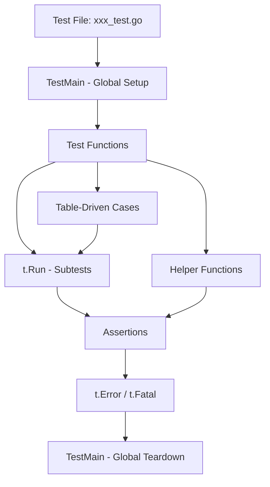

# How to Write Unit Tests in Go with the Testing Package

Author: [nawazdhandala](https://www.github.com/nawazdhandala)

Tags: Go, Testing, Unit Tests, TDD, Backend, Software Quality

Description: A hands-on guide to writing effective unit tests in Go using the built-in testing package, covering test functions, table-driven tests, subtests, helpers, benchmarks, and coverage.

---

Go ships with a powerful testing framework built right into the standard library. No external dependencies, no complex setup - just write your tests and run `go test`. This simplicity is one of Go's greatest strengths. You get everything you need for unit testing, benchmarking, and coverage analysis out of the box.

This guide walks through practical patterns for writing tests that are readable, maintainable, and actually useful for catching bugs before they hit production.

## Testing Package Basics

The `testing` package provides the foundation for all tests in Go. Test files live alongside your code with a `_test.go` suffix, and test functions start with `Test` followed by a descriptive name.

Here is a simple function we want to test - it calculates the sum of integers in a slice:

```go
// math.go
package mathutil

// Sum returns the sum of all integers in the slice.
// Returns 0 for an empty slice.
func Sum(numbers []int) int {
    total := 0
    for _, n := range numbers {
        total += n
    }
    return total
}
```

The corresponding test file uses the testing package to verify the function works correctly:

```go
// math_test.go
package mathutil

import "testing"

// Test function names must start with Test followed by a capital letter.
// The *testing.T parameter provides methods for reporting failures.
func TestSum(t *testing.T) {
    numbers := []int{1, 2, 3, 4, 5}
    expected := 15

    result := Sum(numbers)

    // t.Errorf marks the test as failed but continues execution.
    // Use t.Fatalf when you need to stop the test immediately.
    if result != expected {
        t.Errorf("Sum(%v) = %d; want %d", numbers, result, expected)
    }
}
```

Run tests with the `go test` command:

```bash
# Run tests in the current package
go test

# Run tests with verbose output showing each test name
go test -v

# Run tests in all packages recursively
go test ./...
```

## Test Functions and Assertions

Go takes a different approach than languages with assertion libraries. Instead of `assert.Equal()`, you write explicit if statements. This might feel verbose at first, but it gives you complete control over error messages and makes test failures easier to debug.

Here is a more comprehensive test demonstrating different failure scenarios:

```go
// user.go
package user

import (
    "errors"
    "strings"
)

var ErrInvalidEmail = errors.New("invalid email format")

// User represents a user account.
type User struct {
    ID    int
    Name  string
    Email string
}

// Validate checks if the user data is valid.
// Returns an error if validation fails.
func (u *User) Validate() error {
    if u.Name == "" {
        return errors.New("name is required")
    }
    if !strings.Contains(u.Email, "@") {
        return ErrInvalidEmail
    }
    return nil
}
```

The test covers both success and failure cases:

```go
// user_test.go
package user

import (
    "errors"
    "testing"
)

func TestUserValidate(t *testing.T) {
    // Test valid user - should return nil error
    validUser := &User{
        ID:    1,
        Name:  "Alice",
        Email: "alice@example.com",
    }

    if err := validUser.Validate(); err != nil {
        t.Errorf("valid user returned error: %v", err)
    }

    // Test missing name - should return error
    noName := &User{
        ID:    2,
        Name:  "",
        Email: "bob@example.com",
    }

    if err := noName.Validate(); err == nil {
        t.Error("expected error for empty name, got nil")
    }

    // Test invalid email - should return specific error type
    badEmail := &User{
        ID:    3,
        Name:  "Charlie",
        Email: "not-an-email",
    }

    err := badEmail.Validate()
    // errors.Is checks if the error matches, handling wrapped errors
    if !errors.Is(err, ErrInvalidEmail) {
        t.Errorf("expected ErrInvalidEmail, got %v", err)
    }
}
```

## Table-Driven Tests

When you need to test a function with many different inputs, table-driven tests keep your code DRY and make it trivial to add new test cases. This pattern is idiomatic Go and you will see it everywhere in the standard library.

Here is a string utility function that needs testing with various inputs:

```go
// strings.go
package stringutil

import "unicode"

// Slugify converts a string to a URL-friendly slug.
// It lowercases the string, replaces spaces with hyphens,
// and removes non-alphanumeric characters.
func Slugify(s string) string {
    var result []rune
    prevHyphen := false

    for _, r := range s {
        if unicode.IsLetter(r) || unicode.IsDigit(r) {
            result = append(result, unicode.ToLower(r))
            prevHyphen = false
        } else if unicode.IsSpace(r) || r == '-' {
            // Avoid consecutive hyphens
            if !prevHyphen && len(result) > 0 {
                result = append(result, '-')
                prevHyphen = true
            }
        }
    }

    // Trim trailing hyphen
    if len(result) > 0 && result[len(result)-1] == '-' {
        result = result[:len(result)-1]
    }

    return string(result)
}
```

A table-driven test defines test cases as a slice of structs:

```go
// strings_test.go
package stringutil

import "testing"

func TestSlugify(t *testing.T) {
    // Define test cases as a slice of anonymous structs.
    // Each struct contains the input, expected output, and a description.
    tests := []struct {
        name     string // describes what this test case verifies
        input    string
        expected string
    }{
        {
            name:     "simple string",
            input:    "Hello World",
            expected: "hello-world",
        },
        {
            name:     "with special characters",
            input:    "Hello, World!",
            expected: "hello-world",
        },
        {
            name:     "multiple spaces",
            input:    "Hello    World",
            expected: "hello-world",
        },
        {
            name:     "already lowercase",
            input:    "already-slugified",
            expected: "already-slugified",
        },
        {
            name:     "numbers preserved",
            input:    "Version 2.0 Release",
            expected: "version-20-release",
        },
        {
            name:     "empty string",
            input:    "",
            expected: "",
        },
        {
            name:     "leading and trailing spaces",
            input:    "  trimmed  ",
            expected: "trimmed",
        },
    }

    // Iterate over test cases
    for _, tc := range tests {
        result := Slugify(tc.input)
        if result != tc.expected {
            // Include test name and input in error for easier debugging
            t.Errorf("%s: Slugify(%q) = %q; want %q",
                tc.name, tc.input, result, tc.expected)
        }
    }
}
```

## Subtests

Subtests let you run each test case as a named sub-test, providing better output formatting, selective test running, and parallel execution. They are the preferred way to structure table-driven tests.

Here is a calculator function with multiple operations to test:

```go
// calculator.go
package calculator

import "errors"

var ErrDivideByZero = errors.New("division by zero")

// Divide returns the result of a divided by b.
// Returns an error if b is zero.
func Divide(a, b float64) (float64, error) {
    if b == 0 {
        return 0, ErrDivideByZero
    }
    return a / b, nil
}
```

Using subtests with `t.Run()`:

```go
// calculator_test.go
package calculator

import (
    "errors"
    "math"
    "testing"
)

func TestDivide(t *testing.T) {
    tests := []struct {
        name      string
        a, b      float64
        expected  float64
        expectErr error
    }{
        {
            name:     "positive numbers",
            a:        10,
            b:        2,
            expected: 5,
        },
        {
            name:     "negative dividend",
            a:        -10,
            b:        2,
            expected: -5,
        },
        {
            name:     "negative divisor",
            a:        10,
            b:        -2,
            expected: -5,
        },
        {
            name:     "fractional result",
            a:        7,
            b:        2,
            expected: 3.5,
        },
        {
            name:      "divide by zero",
            a:         10,
            b:         0,
            expectErr: ErrDivideByZero,
        },
    }

    for _, tc := range tests {
        // t.Run creates a subtest with the given name.
        // Each subtest runs independently and reports separately.
        t.Run(tc.name, func(t *testing.T) {
            result, err := Divide(tc.a, tc.b)

            // Check error expectation first
            if tc.expectErr != nil {
                if !errors.Is(err, tc.expectErr) {
                    t.Errorf("expected error %v, got %v", tc.expectErr, err)
                }
                return // Don't check result when error expected
            }

            if err != nil {
                t.Fatalf("unexpected error: %v", err)
            }

            // Use epsilon comparison for floating point
            if math.Abs(result-tc.expected) > 0.0001 {
                t.Errorf("Divide(%.2f, %.2f) = %.4f; want %.4f",
                    tc.a, tc.b, result, tc.expected)
            }
        })
    }
}
```

Run specific subtests by name:

```bash
# Run only the "divide by zero" subtest
go test -v -run "TestDivide/divide_by_zero"

# Run all subtests matching "negative"
go test -v -run "TestDivide/negative"
```

## Parallel Tests

For test suites that take a long time to run, you can mark tests to run in parallel. This is especially useful when tests involve I/O operations or sleep calls.

```go
// slow_test.go
package slowpkg

import (
    "testing"
    "time"
)

func TestSlowOperation(t *testing.T) {
    tests := []struct {
        name     string
        duration time.Duration
        input    string
    }{
        {"short", 100 * time.Millisecond, "a"},
        {"medium", 200 * time.Millisecond, "b"},
        {"long", 300 * time.Millisecond, "c"},
    }

    for _, tc := range tests {
        // Capture range variable for goroutine safety.
        // Without this, all subtests would use the last tc value.
        tc := tc

        t.Run(tc.name, func(t *testing.T) {
            // Mark this subtest as safe to run in parallel.
            // It will run concurrently with other parallel subtests.
            t.Parallel()

            // Simulate slow operation
            time.Sleep(tc.duration)

            // Your assertions here
            if len(tc.input) == 0 {
                t.Error("input should not be empty")
            }
        })
    }
}
```

Control parallelism with the `-parallel` flag:

```bash
# Run up to 4 tests in parallel (default is GOMAXPROCS)
go test -parallel 4
```

## Test Helpers

When multiple tests share common setup or assertion logic, extract it into helper functions. Mark helpers with `t.Helper()` so that error messages report the caller's line number instead of the helper's.

```go
// api_test.go
package api

import (
    "encoding/json"
    "net/http"
    "net/http/httptest"
    "testing"
)

// Helper function to create a test HTTP request.
// t.Helper() ensures errors report the calling test's line number.
func newTestRequest(t *testing.T, method, path string) *http.Request {
    t.Helper() // Marks this function as a test helper

    req, err := http.NewRequest(method, path, nil)
    if err != nil {
        // t.Fatalf stops the test immediately on fatal errors
        t.Fatalf("failed to create request: %v", err)
    }
    return req
}

// Helper to assert HTTP status code
func assertStatus(t *testing.T, got, want int) {
    t.Helper()

    if got != want {
        // Error reports the line in the calling test, not here
        t.Errorf("status code = %d; want %d", got, want)
    }
}

// Helper to decode JSON response body
func decodeJSON(t *testing.T, resp *httptest.ResponseRecorder, v interface{}) {
    t.Helper()

    if err := json.NewDecoder(resp.Body).Decode(v); err != nil {
        t.Fatalf("failed to decode response: %v", err)
    }
}

// Response type for our API
type Response struct {
    Message string `json:"message"`
    Code    int    `json:"code"`
}

// Handler we want to test
func healthHandler(w http.ResponseWriter, r *http.Request) {
    w.Header().Set("Content-Type", "application/json")
    json.NewEncoder(w).Encode(Response{
        Message: "healthy",
        Code:    200,
    })
}

func TestHealthEndpoint(t *testing.T) {
    // Use helpers to reduce boilerplate
    req := newTestRequest(t, "GET", "/health")
    recorder := httptest.NewRecorder()

    healthHandler(recorder, req)

    // Clean assertions using helpers
    assertStatus(t, recorder.Code, http.StatusOK)

    var resp Response
    decodeJSON(t, recorder, &resp)

    if resp.Message != "healthy" {
        t.Errorf("message = %q; want %q", resp.Message, "healthy")
    }
}
```

## Test Fixtures and Setup

For tests that need external files or complex setup, use `TestMain` or setup functions. Test data typically lives in a `testdata` directory which Go ignores during normal builds.

```go
// parser_test.go
package parser

import (
    "os"
    "path/filepath"
    "testing"
)

// TestMain runs before and after all tests in the package.
// Use it for global setup and teardown.
func TestMain(m *testing.M) {
    // Setup: create test fixtures
    setup()

    // Run all tests
    code := m.Run()

    // Teardown: clean up test artifacts
    teardown()

    os.Exit(code)
}

func setup() {
    // Create testdata directory if it doesn't exist
    os.MkdirAll("testdata", 0755)
}

func teardown() {
    // Clean up any generated test files
    os.RemoveAll("testdata/generated")
}

// Helper to load fixture files from testdata directory
func loadFixture(t *testing.T, filename string) []byte {
    t.Helper()

    path := filepath.Join("testdata", filename)
    data, err := os.ReadFile(path)
    if err != nil {
        t.Fatalf("failed to load fixture %s: %v", filename, err)
    }
    return data
}

func TestParseConfig(t *testing.T) {
    // Load test data from testdata/config.json
    data := loadFixture(t, "config.json")

    config, err := ParseConfig(data)
    if err != nil {
        t.Fatalf("ParseConfig failed: %v", err)
    }

    if config.Name == "" {
        t.Error("expected config to have a name")
    }
}
```

## Benchmarks

The testing package includes benchmarking support. Benchmark functions start with `Benchmark` and receive a `*testing.B` parameter. The framework runs your code multiple times and measures execution time.

Here are two implementations of a Fibonacci function to compare:

```go
// fibonacci.go
package fibonacci

// FibRecursive calculates Fibonacci using naive recursion.
// Simple but slow - O(2^n) time complexity.
func FibRecursive(n int) int {
    if n <= 1 {
        return n
    }
    return FibRecursive(n-1) + FibRecursive(n-2)
}

// FibIterative calculates Fibonacci using iteration.
// Efficient - O(n) time complexity.
func FibIterative(n int) int {
    if n <= 1 {
        return n
    }
    a, b := 0, 1
    for i := 2; i <= n; i++ {
        a, b = b, a+b
    }
    return b
}
```

Benchmark both implementations:

```go
// fibonacci_test.go
package fibonacci

import "testing"

// Benchmark function names start with Benchmark.
// The testing framework determines how many times to run the loop.
func BenchmarkFibRecursive(b *testing.B) {
    // b.N is set by the framework to achieve stable timing
    for i := 0; i < b.N; i++ {
        FibRecursive(20) // Calculate 20th Fibonacci number
    }
}

func BenchmarkFibIterative(b *testing.B) {
    for i := 0; i < b.N; i++ {
        FibIterative(20)
    }
}

// Benchmark with different input sizes using sub-benchmarks
func BenchmarkFibIterativeSizes(b *testing.B) {
    sizes := []int{10, 20, 30, 40}

    for _, n := range sizes {
        // Use Sprintf to create dynamic benchmark names
        b.Run(fmt.Sprintf("n=%d", n), func(b *testing.B) {
            for i := 0; i < b.N; i++ {
                FibIterative(n)
            }
        })
    }
}

// Benchmark memory allocations
func BenchmarkWithAllocs(b *testing.B) {
    // Report memory allocation statistics
    b.ReportAllocs()

    for i := 0; i < b.N; i++ {
        // Function that allocates memory
        _ = make([]int, 1000)
    }
}
```

Run benchmarks:

```bash
# Run all benchmarks
go test -bench=.

# Run specific benchmark
go test -bench=FibIterative

# Include memory allocation stats
go test -bench=. -benchmem

# Run benchmarks for 5 seconds each (more stable results)
go test -bench=. -benchtime=5s
```

Sample output:

```
BenchmarkFibRecursive-8       31264    38419 ns/op
BenchmarkFibIterative-8    69529411       17.24 ns/op
```

The iterative version is over 2000x faster than the recursive version for n=20.

## Test Coverage

Go has built-in coverage analysis. Use it to identify untested code paths and ensure critical logic has test coverage.

```bash
# Run tests with coverage
go test -cover

# Generate coverage profile
go test -coverprofile=coverage.out

# View coverage in terminal by function
go tool cover -func=coverage.out

# Generate HTML coverage report
go tool cover -html=coverage.out -o coverage.html

# Set coverage mode (set, count, or atomic)
go test -covermode=count -coverprofile=coverage.out
```

The coverage modes determine how coverage is tracked:

| Mode | Description | Use Case |
|------|-------------|----------|
| set | Boolean hit/not-hit | Default, fastest |
| count | Number of times each statement runs | Finding hot paths |
| atomic | Like count, but thread-safe | Parallel tests |

Example coverage output:

```
github.com/yourorg/pkg/mathutil/math.go:8:     Sum         100.0%
github.com/yourorg/pkg/mathutil/math.go:18:    Average      80.0%
github.com/yourorg/pkg/mathutil/math.go:28:    Max           0.0%
total:                                         (statements) 60.0%
```

The HTML report color-codes your source: green for covered, red for uncovered, allowing you to visually identify gaps.

## Test Organization

A well-organized test suite follows a predictable structure. Here is how tests typically flow:



Recommended project structure for tests:

```
project/
    mathutil/
        math.go           # Production code
        math_test.go      # Tests for math.go
        testdata/         # Test fixtures
            input.json
            expected.json
    api/
        handler.go
        handler_test.go
        mock_test.go      # Shared mocks for this package
```

## Common Testing Patterns

### Testing Error Conditions

```go
func TestOpenFile(t *testing.T) {
    // Test that non-existent file returns appropriate error
    _, err := OpenFile("nonexistent.txt")

    if err == nil {
        t.Fatal("expected error for non-existent file")
    }

    // Check for specific error type using errors.Is
    if !errors.Is(err, os.ErrNotExist) {
        t.Errorf("expected os.ErrNotExist, got %v", err)
    }
}
```

### Testing with Interfaces for Mocking

```go
// Define interface for external dependency
type EmailSender interface {
    Send(to, subject, body string) error
}

// Mock implementation for testing
type mockSender struct {
    sentEmails []email
    shouldFail bool
}

type email struct {
    to, subject, body string
}

func (m *mockSender) Send(to, subject, body string) error {
    if m.shouldFail {
        return errors.New("send failed")
    }
    m.sentEmails = append(m.sentEmails, email{to, subject, body})
    return nil
}

func TestNotificationService(t *testing.T) {
    mock := &mockSender{}
    service := NewNotificationService(mock)

    err := service.NotifyUser("user@example.com", "Welcome!")

    if err != nil {
        t.Fatalf("unexpected error: %v", err)
    }

    if len(mock.sentEmails) != 1 {
        t.Errorf("expected 1 email sent, got %d", len(mock.sentEmails))
    }

    if mock.sentEmails[0].to != "user@example.com" {
        t.Errorf("wrong recipient: %s", mock.sentEmails[0].to)
    }
}
```

### Cleanup with t.Cleanup

```go
func TestWithTempFile(t *testing.T) {
    // Create temp file
    f, err := os.CreateTemp("", "test")
    if err != nil {
        t.Fatal(err)
    }

    // t.Cleanup runs after the test completes, even if it fails
    t.Cleanup(func() {
        os.Remove(f.Name())
    })

    // Use the temp file in your test
    _, err = f.WriteString("test data")
    if err != nil {
        t.Fatal(err)
    }
}
```

## Summary

| Concept | Description |
|---------|-------------|
| **Test Files** | End with `_test.go`, same package as code |
| **Test Functions** | Start with `Test`, take `*testing.T` |
| **Table-Driven Tests** | Slice of test cases, iterate and check |
| **Subtests** | `t.Run()` for named, filterable tests |
| **Parallel Tests** | `t.Parallel()` for concurrent execution |
| **Helpers** | Use `t.Helper()` for accurate line numbers |
| **Benchmarks** | Start with `Benchmark`, take `*testing.B` |
| **Coverage** | `-cover` flag, `-coverprofile` for reports |

Go's testing package is intentionally simple. There are no assertions, no complex matchers - just if statements and error reporting. This simplicity means less magic to learn and debug, and test failures show exactly what went wrong with context you control.

Start with basic test functions, evolve to table-driven tests when you have multiple cases, and add benchmarks when performance matters. The built-in tooling handles the rest.

---

*Building reliable systems starts with reliable tests. Go's testing philosophy of simplicity and explicitness makes it easier to write tests that actually catch bugs rather than tests that just increase coverage numbers.*
