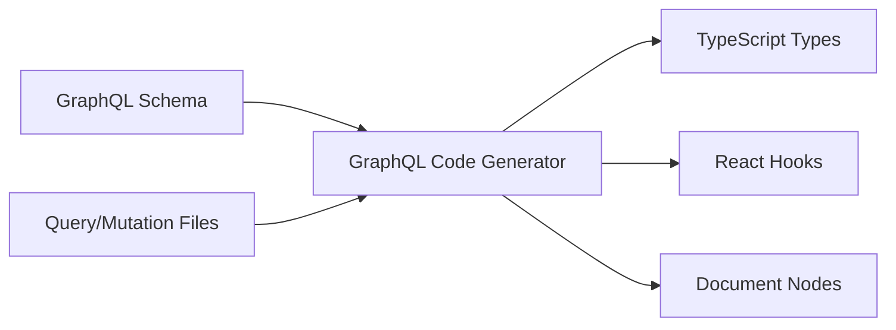
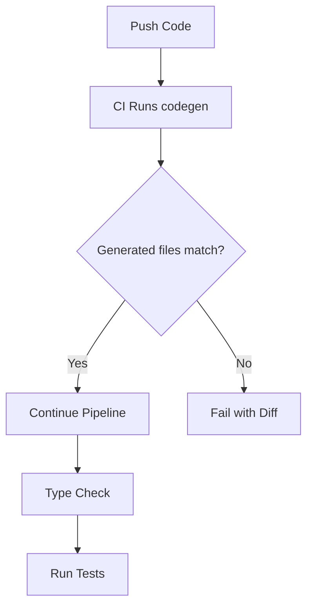

# How to Use GraphQL Code Generator

Author: [nawazdhandala](https://www.github.com/nawazdhandala)

Tags: GraphQL, TypeScript, Code Generation, React, Apollo, Frontend, Developer Tools

Description: A practical guide to setting up GraphQL Code Generator for type-safe queries, mutations, and React hooks in your TypeScript projects.

---

If you have ever written GraphQL queries in a TypeScript project, you know the pain: manually defining types for every query response, keeping them in sync with schema changes, and hoping you did not miss a field somewhere. GraphQL Code Generator eliminates this entire class of bugs by generating TypeScript types and hooks directly from your schema and operations.

This guide walks through setting up codegen from scratch, configuring plugins for different use cases, and integrating it into your development workflow.

---

## Table of Contents

1. What GraphQL Code Generator Does
2. Installation and Setup
3. Basic Configuration File
4. TypeScript Types Plugin
5. React Hooks Plugin
6. Working with Fragments
7. Custom Scalars
8. Watch Mode for Development
9. CI Integration
10. Troubleshooting Common Issues

---

## 1. What GraphQL Code Generator Does

GraphQL Code Generator reads your schema and your `.graphql` operation files, then generates TypeScript code that matches your exact queries.



The benefits are straightforward:
- No more manually writing response types
- Compile-time errors when queries do not match the schema
- Auto-generated hooks with proper typing
- Refactoring becomes safer since the compiler catches mismatches

---

## 2. Installation and Setup

Start by installing the core package and the CLI.

```bash
# Install the CLI and core library
npm install -D @graphql-codegen/cli

# Initialize the configuration
npx graphql-code-generator init
```

The init wizard asks a few questions about your project. For a typical React + Apollo setup, choose:
- React as your framework
- TypeScript as your output
- Your schema location (URL or local file)
- Where your operations live (usually `src/**/*.graphql`)

After the wizard completes, you will have a `codegen.ts` file and the necessary plugins installed.

---

## 3. Basic Configuration File

Here is a minimal configuration that generates types from a remote schema.

```typescript
// codegen.ts
import type { CodegenConfig } from '@graphql-codegen/cli';

const config: CodegenConfig = {
  // Point to your GraphQL endpoint or local schema file
  schema: 'https://api.example.com/graphql',

  // Where your .graphql files live
  documents: ['src/**/*.graphql'],

  // Output configuration
  generates: {
    // Single output file for all generated types
    'src/generated/graphql.ts': {
      plugins: [
        'typescript',
        'typescript-operations',
      ],
    },
  },
};

export default config;
```

Run the generator with:

```bash
npx graphql-codegen
```

This produces a `graphql.ts` file containing TypeScript types for every type in your schema and every operation you have defined.

---

## 4. TypeScript Types Plugin

The `typescript` plugin generates types for your schema, while `typescript-operations` generates types for your queries and mutations.

Suppose you have this schema:

```graphql
type User {
  id: ID!
  name: String!
  email: String!
  createdAt: DateTime!
}

type Query {
  user(id: ID!): User
  users: [User!]!
}
```

And this query file:

```graphql
# src/graphql/user.graphql
query GetUser($id: ID!) {
  user(id: $id) {
    id
    name
    email
  }
}

query GetAllUsers {
  users {
    id
    name
  }
}
```

The generator produces types like these:

```typescript
// Generated types for the query variables
export type GetUserQueryVariables = Exact<{
  id: Scalars['ID']['input'];
}>;

// Generated types for the query response
export type GetUserQuery = {
  __typename?: 'Query';
  user?: {
    __typename?: 'User';
    id: string;
    name: string;
    email: string;
  } | null;
};

export type GetAllUsersQuery = {
  __typename?: 'Query';
  users: Array<{
    __typename?: 'User';
    id: string;
    name: string;
  }>;
};
```

Notice how `GetAllUsersQuery` only includes `id` and `name` since those are the only fields selected. The generated types match your actual queries, not just the full schema types.

---

## 5. React Hooks Plugin

For React projects using Apollo Client, the `typescript-react-apollo` plugin generates ready-to-use hooks.

Update your configuration:

```typescript
// codegen.ts
import type { CodegenConfig } from '@graphql-codegen/cli';

const config: CodegenConfig = {
  schema: 'https://api.example.com/graphql',
  documents: ['src/**/*.graphql'],
  generates: {
    'src/generated/graphql.ts': {
      plugins: [
        'typescript',
        'typescript-operations',
        'typescript-react-apollo',
      ],
      config: {
        // Generate hooks instead of HOCs and render props
        withHooks: true,
        // Skip generating components and HOCs
        withComponent: false,
        withHOC: false,
      },
    },
  },
};

export default config;
```

Install the plugin:

```bash
npm install -D @graphql-codegen/typescript-react-apollo
```

Now the generator creates hooks for each operation:

```typescript
// Using the generated hook in a component
import { useGetUserQuery, useGetAllUsersQuery } from '../generated/graphql';

function UserProfile({ userId }: { userId: string }) {
  // Hook is fully typed - data, loading, error all have correct types
  const { data, loading, error } = useGetUserQuery({
    variables: { id: userId },
  });

  if (loading) return <div>Loading...</div>;
  if (error) return <div>Error: {error.message}</div>;

  // TypeScript knows data.user can be null
  if (!data?.user) return <div>User not found</div>;

  // data.user is now narrowed to the correct type
  return (
    <div>
      <h1>{data.user.name}</h1>
      <p>{data.user.email}</p>
    </div>
  );
}
```

The hook knows:
- What variables it accepts (and which are required)
- What the response shape looks like
- Whether fields can be null

---

## 6. Working with Fragments

Fragments let you reuse field selections across queries. Codegen handles them well, generating types for each fragment.

Define a fragment:

```graphql
# src/graphql/fragments.graphql
fragment UserBasicInfo on User {
  id
  name
  email
}

fragment UserWithTimestamps on User {
  ...UserBasicInfo
  createdAt
  updatedAt
}
```

Use it in queries:

```graphql
# src/graphql/user.graphql
query GetUser($id: ID!) {
  user(id: $id) {
    ...UserWithTimestamps
  }
}

query GetAllUsers {
  users {
    ...UserBasicInfo
  }
}
```

The generator creates types for each fragment:

```typescript
// Generated fragment types
export type UserBasicInfoFragment = {
  __typename?: 'User';
  id: string;
  name: string;
  email: string;
};

export type UserWithTimestampsFragment = {
  __typename?: 'User';
  id: string;
  name: string;
  email: string;
  createdAt: any;
  updatedAt: any;
};
```

You can use these fragment types directly in your components:

```typescript
import { UserBasicInfoFragment } from '../generated/graphql';

// Component accepts the fragment type as a prop
function UserCard({ user }: { user: UserBasicInfoFragment }) {
  return (
    <div>
      <h2>{user.name}</h2>
      <p>{user.email}</p>
    </div>
  );
}
```

This pattern keeps your components decoupled from specific queries while maintaining type safety.

---

## 7. Custom Scalars

GraphQL schemas often include custom scalars like `DateTime`, `JSON`, or `UUID`. By default, codegen maps these to `any`, which defeats the purpose of type safety.

Configure scalar mappings:

```typescript
// codegen.ts
import type { CodegenConfig } from '@graphql-codegen/cli';

const config: CodegenConfig = {
  schema: 'https://api.example.com/graphql',
  documents: ['src/**/*.graphql'],
  generates: {
    'src/generated/graphql.ts': {
      plugins: [
        'typescript',
        'typescript-operations',
        'typescript-react-apollo',
      ],
      config: {
        withHooks: true,
        // Map custom scalars to TypeScript types
        scalars: {
          // DateTime becomes string (ISO format from server)
          DateTime: 'string',
          // JSON becomes a record type
          JSON: 'Record<string, unknown>',
          // UUID is just a string with semantic meaning
          UUID: 'string',
          // BigInt maps to JavaScript bigint
          BigInt: 'bigint',
          // Upload for file uploads
          Upload: 'File',
        },
      },
    },
  },
};

export default config;
```

Now `createdAt: DateTime!` generates as `createdAt: string` instead of `createdAt: any`.

For more complex cases, you can point scalars to custom type definitions:

```typescript
// src/types/scalars.ts
export type DateTimeScalar = Date;
export type MoneyScalar = { amount: number; currency: string };
```

```typescript
// codegen.ts config
scalars: {
  DateTime: '../types/scalars#DateTimeScalar',
  Money: '../types/scalars#MoneyScalar',
},
```

---

## 8. Watch Mode for Development

Running codegen manually after every change gets tedious. Watch mode regenerates types automatically when files change.

Add a script to your package.json:

```json
{
  "scripts": {
    "codegen": "graphql-codegen",
    "codegen:watch": "graphql-codegen --watch"
  }
}
```

Run watch mode in a separate terminal:

```bash
npm run codegen:watch
```

The watcher monitors:
- Your schema (re-fetches if using a URL, or watches the file)
- Your document files (`.graphql` files matching your glob pattern)

For better DX, run watch mode alongside your dev server. With something like `concurrently`:

```json
{
  "scripts": {
    "dev": "concurrently \"npm run codegen:watch\" \"npm run start\""
  }
}
```

---

## 9. CI Integration

Your CI pipeline should fail if generated files are out of date. This catches cases where someone edited a query but forgot to run codegen.

Add a check script:

```json
{
  "scripts": {
    "codegen": "graphql-codegen",
    "codegen:check": "graphql-codegen && git diff --exit-code src/generated/"
  }
}
```

The `codegen:check` script:
1. Runs codegen
2. Checks if any generated files changed
3. Exits with error code 1 if there are uncommitted changes

Use it in your CI workflow:

```yaml
# .github/workflows/ci.yml
name: CI

on: [push, pull_request]

jobs:
  build:
    runs-on: ubuntu-latest
    steps:
      - uses: actions/checkout@v4

      - name: Setup Node
        uses: actions/setup-node@v4
        with:
          node-version: '20'
          cache: 'npm'

      - name: Install dependencies
        run: npm ci

      - name: Check generated files are up to date
        run: npm run codegen:check

      - name: Type check
        run: npm run typecheck

      - name: Run tests
        run: npm test
```

If someone modifies a query but forgets to regenerate, CI fails with a clear diff showing what changed.



---

## 10. Troubleshooting Common Issues

**Schema fetch fails with authentication error**

If your GraphQL endpoint requires auth, add headers:

```typescript
const config: CodegenConfig = {
  schema: [
    {
      'https://api.example.com/graphql': {
        headers: {
          Authorization: `Bearer ${process.env.GRAPHQL_TOKEN}`,
        },
      },
    },
  ],
  // ...
};
```

**"Cannot find module" errors after generation**

Make sure your generated file is included in TypeScript's compilation. Check `tsconfig.json`:

```json
{
  "include": ["src/**/*"],
  "exclude": ["node_modules"]
}
```

**Types are "any" for certain fields**

Usually means a custom scalar is not mapped. Check your schema for custom scalar definitions and add mappings as shown in section 7.

**Watch mode misses changes**

Some editors save to temp files first. Try increasing the debounce time:

```typescript
const config: CodegenConfig = {
  // ...
  watch: true,
  watchConfig: {
    chokidar: {
      usePolling: true,
      interval: 1000,
    },
  },
};
```

**Generated hooks do not appear**

Verify you installed `@graphql-codegen/typescript-react-apollo` and included it in your plugins array. Also check that your operation files match the `documents` glob pattern.

---

## Putting It All Together

Here is a complete configuration for a production React + Apollo project:

```typescript
// codegen.ts
import type { CodegenConfig } from '@graphql-codegen/cli';

const config: CodegenConfig = {
  // Fetch schema from endpoint with auth
  schema: [
    {
      'https://api.example.com/graphql': {
        headers: {
          Authorization: `Bearer ${process.env.GRAPHQL_TOKEN}`,
        },
      },
    },
  ],

  // Find all GraphQL files in src
  documents: ['src/**/*.graphql'],

  generates: {
    'src/generated/graphql.ts': {
      plugins: [
        'typescript',
        'typescript-operations',
        'typescript-react-apollo',
      ],
      config: {
        // Hooks only, no legacy patterns
        withHooks: true,
        withComponent: false,
        withHOC: false,

        // Map custom scalars
        scalars: {
          DateTime: 'string',
          UUID: 'string',
          JSON: 'Record<string, unknown>',
        },

        // Use string enums for better DX
        enumsAsTypes: true,

        // Skip __typename in input types
        skipTypename: false,

        // Generate DocumentNode for each operation
        documentMode: 'documentNode',
      },
    },
  },

  // Hooks for pre/post generation
  hooks: {
    afterAllFileWrite: ['prettier --write'],
  },
};

export default config;
```

With this setup:
- Types and hooks regenerate on schema or query changes
- CI catches out-of-date generated code
- Custom scalars are properly typed
- Generated code is formatted consistently

---

## Summary

| Task | Solution |
|------|----------|
| Generate types from schema | `typescript` plugin |
| Generate types for queries | `typescript-operations` plugin |
| Generate React hooks | `typescript-react-apollo` plugin |
| Handle custom scalars | `scalars` config option |
| Reuse field selections | GraphQL fragments |
| Auto-regenerate on change | `--watch` flag |
| Validate in CI | Check for git diff after generation |

GraphQL Code Generator removes an entire category of runtime errors by catching type mismatches at compile time. The initial setup takes maybe 15 minutes, and then you never manually write a query response type again.

---

**Related Reading:**

- [GraphQL Code Generator Documentation](https://the-guild.dev/graphql/codegen)
- [Apollo Client with TypeScript](https://www.apollographql.com/docs/react/development-testing/typescript/)
