# How to Use GraphQL Fragments

Author: [nawazdhandala](https://www.github.com/nawazdhandala)

Tags: GraphQL, Fragments, API, Frontend, TypeScript, React, Code Organization

Description: A hands-on guide to GraphQL fragments - from basic syntax to advanced patterns for building maintainable, reusable queries in real applications.

---

GraphQL queries can get verbose fast. You start with a simple user query, then you need the same fields in another component, and suddenly you're copying field lists across a dozen files. When someone adds a new field, you hunt down every place it needs updating. Sound familiar?

Fragments solve this. They let you define reusable chunks of query fields and compose them wherever needed. This guide walks through everything from basic fragment syntax to organizing fragments in large codebases.

---

## What Are Fragments?

A fragment is a named, reusable set of fields that you can include in any query or mutation. Think of it like a function for your field selections - define once, use everywhere.

Here's the basic structure:

```graphql
# Define a fragment on a specific type
fragment UserBasicInfo on User {
  id
  email
  displayName
  avatarUrl
}
```

The syntax breaks down to:
- `fragment` keyword starts the definition
- `UserBasicInfo` is the name you'll reference later
- `on User` specifies which GraphQL type this fragment applies to
- The field list inside braces is what gets included when you use the fragment

Use fragments in queries with the spread operator:

```graphql
query GetCurrentUser {
  me {
    ...UserBasicInfo
    createdAt
  }
}
```

The `...UserBasicInfo` spreads all fields from that fragment into your query. The server sees it as if you wrote out all the fields by hand.

---

## Why Fragments Matter

Fragments aren't just about saving keystrokes. They bring real benefits to your codebase:

**Consistency** - When every component pulls from the same fragment, you know the data shape is identical everywhere. No more "this component has `user.name` but that one expects `user.displayName`" bugs.

**Single source of truth** - Add a field to a fragment and every query using it gets the update. Remove a deprecated field in one place, not thirty.

**Co-location** - Components can define exactly what data they need right next to the code that uses it. This is a game changer for large teams.

**Type generation** - Tools like GraphQL Code Generator produce TypeScript types from fragments. Your component gets a precise type for exactly the fields it requested.

---

## Fragment Syntax Deep Dive

Let's look at more complete examples.

A fragment with nested fields:

```graphql
# Fragment that includes nested object fields
fragment PostWithAuthor on Post {
  id
  title
  content
  publishedAt
  author {
    id
    displayName
    avatarUrl
  }
  tags {
    id
    name
  }
}
```

Using multiple fragments in one query:

```graphql
query GetDashboard {
  featuredPosts {
    ...PostWithAuthor
  }
  me {
    ...UserBasicInfo
    notifications {
      ...NotificationFields
    }
  }
}
```

Fragments can also reference other fragments:

```graphql
# Base user fragment
fragment UserBasicInfo on User {
  id
  email
  displayName
  avatarUrl
}

# Extended fragment that includes the base
fragment UserWithStats on User {
  ...UserBasicInfo
  postsCount
  followersCount
  joinedAt
}
```

This composition lets you build up complex data requirements from simple, focused pieces.

---

## Inline Fragments

Sometimes you need conditional field selection based on the concrete type. Inline fragments handle this without requiring a named definition.

The classic use case is querying a union or interface:

```graphql
query GetTimelineEvents {
  timeline {
    # Fields common to all event types
    id
    createdAt

    # Conditional fields based on concrete type
    ... on PostEvent {
      post {
        title
        excerpt
      }
    }

    ... on CommentEvent {
      comment {
        body
        parentPost {
          title
        }
      }
    }

    ... on FollowEvent {
      followedUser {
        displayName
      }
    }
  }
}
```

The server only returns fields for the actual type of each item. A `PostEvent` won't have `comment` or `followedUser` - those fields simply aren't present in the response for that item.

Inline fragments also work for type narrowing without unions:

```graphql
query GetNode($id: ID!) {
  node(id: $id) {
    id
    ... on User {
      email
      displayName
    }
    ... on Post {
      title
      content
    }
  }
}
```

---

## Fragments on Interfaces

When your schema uses interfaces, fragments become even more powerful. You can define fragments on the interface itself, and they'll work across all implementing types.

Consider a schema with a `Node` interface:

```graphql
# Schema definition
interface Node {
  id: ID!
  createdAt: DateTime!
  updatedAt: DateTime!
}

type User implements Node {
  id: ID!
  createdAt: DateTime!
  updatedAt: DateTime!
  email: String!
  displayName: String!
}

type Post implements Node {
  id: ID!
  createdAt: DateTime!
  updatedAt: DateTime!
  title: String!
  content: String!
}
```

A fragment on the interface:

```graphql
# This fragment works on User, Post, and any other Node implementer
fragment NodeTimestamps on Node {
  id
  createdAt
  updatedAt
}
```

Combine interface fragments with type-specific inline fragments:

```graphql
query GetRecentItems {
  recentItems {
    ...NodeTimestamps

    ... on User {
      displayName
      avatarUrl
    }

    ... on Post {
      title
      excerpt
    }
  }
}
```

This pattern is common in Relay-style schemas where everything implements `Node` and you frequently fetch heterogeneous lists.

---

## Fragment Composition Patterns

Real applications need more than single fragments. Here are patterns that work well at scale.

**Layered Fragments** - Build from atomic to composite:

```graphql
# Layer 1: Atomic fragments for each type
fragment UserCore on User {
  id
  email
  displayName
}

fragment PostCore on Post {
  id
  title
  slug
}

# Layer 2: Extended fragments that add common relations
fragment UserWithAvatar on User {
  ...UserCore
  avatarUrl
  avatarAlt
}

fragment PostWithMeta on Post {
  ...PostCore
  publishedAt
  readingTime
  tags {
    id
    name
  }
}

# Layer 3: Full fragments for specific views
fragment PostCard on Post {
  ...PostWithMeta
  excerpt
  author {
    ...UserWithAvatar
  }
}
```

**Page-Level Composition** - Assemble fragments for an entire view:

```graphql
query BlogHomePage {
  featuredPost {
    ...PostCard
    content  # Only the featured post needs full content
  }
  recentPosts(limit: 10) {
    ...PostCard
  }
  popularTags(limit: 5) {
    id
    name
    postsCount
  }
}
```

---

## Colocated Fragments in React

The real power of fragments emerges when you colocate them with the components that use the data. Each component declares its own data requirements.

Here's how this looks in practice:

```tsx
// UserAvatar.tsx
import { gql } from '@apollo/client';

// Fragment lives right next to the component
export const USER_AVATAR_FRAGMENT = gql`
  fragment UserAvatar on User {
    id
    displayName
    avatarUrl
  }
`;

interface Props {
  user: UserAvatarFragment;  // Type generated from fragment
}

export function UserAvatar({ user }: Props) {
  return (
    
  );
}
```

```tsx
// PostCard.tsx
import { gql } from '@apollo/client';
import { UserAvatar, USER_AVATAR_FRAGMENT } from './UserAvatar';

// This component's fragment includes the child's fragment
export const POST_CARD_FRAGMENT = gql`
  fragment PostCard on Post {
    id
    title
    excerpt
    publishedAt
    author {
      ...UserAvatar
    }
  }
  ${USER_AVATAR_FRAGMENT}
`;

interface Props {
  post: PostCardFragment;
}

export function PostCard({ post }: Props) {
  return (
    <article>
      <h2>{post.title}</h2>
      <p>{post.excerpt}</p>
      <UserAvatar user={post.author} />
      <time>{post.publishedAt}</time>
    </article>
  );
}
```

```tsx
// BlogPage.tsx
import { gql, useQuery } from '@apollo/client';
import { PostCard, POST_CARD_FRAGMENT } from './PostCard';

// Page query composes all child fragments
const BLOG_PAGE_QUERY = gql`
  query BlogPage {
    posts(limit: 10) {
      ...PostCard
    }
  }
  ${POST_CARD_FRAGMENT}
`;

export function BlogPage() {
  const { data, loading } = useQuery(BLOG_PAGE_QUERY);

  if (loading) return <Spinner />;

  return (
    <div>
      {data.posts.map(post => (
        <PostCard key={post.id} post={post} />
      ))}
    </div>
  );
}
```

The data requirements flow up the component tree. `PostCard` doesn't know or care what fields `UserAvatar` needs - it just includes the fragment. If `UserAvatar` later needs a new field, you add it to `USER_AVATAR_FRAGMENT` and everything updates automatically.

---

## Fragment Flow in Component Trees

Here's how fragments compose through a typical component hierarchy:

```mermaid
graph TD
    A[BlogPage Query] --> B[PostCard Fragment]
    B --> C[UserAvatar Fragment]
    B --> D[TagBadge Fragment]
    A --> E[Sidebar Fragment]
    E --> F[UserAvatar Fragment]
    E --> G[PopularTags Fragment]

    style A fill:#2d5a27,stroke:#1a3518
    style B fill:#1e3a5f,stroke:#0d1f33
    style C fill:#5c4033,stroke:#3d2a22
    style D fill:#5c4033,stroke:#3d2a22
    style E fill:#1e3a5f,stroke:#0d1f33
    style F fill:#5c4033,stroke:#3d2a22
    style G fill:#5c4033,stroke:#3d2a22
```



Each component owns its fragment. The page query includes top-level component fragments, which in turn include their children's fragments. GraphQL deduplicates overlapping fields, so `UserAvatar` being used in two places doesn't double-fetch.

---

## Organizing Fragments in Large Applications

As your app grows, fragment organization becomes critical. Here are approaches that scale.

**Option 1: Colocated with components** (recommended for most apps)

```
src/
  components/
    User/
      UserAvatar.tsx
      UserAvatar.fragment.graphql
      UserCard.tsx
      UserCard.fragment.graphql
    Post/
      PostCard.tsx
      PostCard.fragment.graphql
```

Each component has a sibling fragment file. Import and compose as needed.

**Option 2: Centralized fragments directory** (works for smaller apps)

```
src/
  graphql/
    fragments/
      user.ts
      post.ts
      comment.ts
    queries/
      blog.ts
      dashboard.ts
```

All fragments live together, organized by domain entity.

**Option 3: Hybrid approach** (large apps with shared fragments)

```
src/
  graphql/
    fragments/
      shared/           # Cross-cutting fragments used everywhere
        node.ts
        timestamps.ts
      index.ts          # Re-exports all shared fragments
  features/
    blog/
      components/
        PostCard/
          PostCard.tsx
          PostCard.fragment.ts    # Feature-specific fragment
```

Shared fragments live centrally, feature-specific ones stay colocated.

---

## Fragment Naming Conventions

Consistent naming makes fragments easier to find and understand. Here's a convention that works:

```graphql
# Pattern: {ComponentName}{TypeName}
fragment UserAvatarUser on User { ... }
fragment PostCardPost on Post { ... }
fragment CommentThreadComment on Comment { ... }

# For extended variants, add a suffix
fragment UserCardUserWithStats on User { ... }
fragment PostPreviewPostMinimal on Post { ... }
```

Some teams prefer shorter names when the context is clear:

```graphql
# In UserAvatar.fragment.graphql, just call it:
fragment UserAvatar on User { ... }

# The file location provides context
```

Pick a convention and stick with it across your codebase.

---

## Type Generation with Fragments

GraphQL Code Generator produces TypeScript types from your operations. With fragments, each component gets a precise type for its data.

Configuration example:

```yaml
# codegen.yml
generates:
  src/generated/graphql.ts:
    plugins:
      - typescript
      - typescript-operations
    config:
      # Generate separate type for each fragment
      preResolveTypes: true
      skipTypename: false
```

The generated types look like:

```typescript
// Generated from fragment
export type UserAvatarFragment = {
  __typename: 'User';
  id: string;
  displayName: string;
  avatarUrl: string;
};

// Generated from query
export type BlogPageQuery = {
  __typename: 'Query';
  posts: Array<PostCardFragment>;
};
```

Your component props become trivially typed:

```tsx
import type { UserAvatarFragment } from '../generated/graphql';

interface Props {
  user: UserAvatarFragment;
}
```

When the fragment changes, types update on the next codegen run. TypeScript catches any mismatches at compile time.

---

## Common Mistakes to Avoid

**Over-fragmentation** - Not every three fields need a fragment. If a set of fields is only used once, inline them. Fragments add indirection; use them when reuse or co-location justifies it.

**Mega-fragments** - A fragment with 50 fields defeats the purpose. If you're including everything, you might as well not use fragments. Keep them focused on specific use cases.

**Circular fragment dependencies** - Fragment A includes B, B includes A. GraphQL won't allow this, but you can create confusing chains. Keep the dependency graph simple and acyclic.

**Forgetting to include child fragments** - A common error when composing:

```tsx
// Wrong - missing the child fragment definition
const QUERY = gql`
  query GetUser {
    user {
      ...UserAvatar
    }
  }
`;

// Right - include all referenced fragments
const QUERY = gql`
  query GetUser {
    user {
      ...UserAvatar
    }
  }
  ${USER_AVATAR_FRAGMENT}
`;
```

**Ignoring `__typename`** - Apollo Client uses `__typename` for cache normalization. When using inline fragments on unions/interfaces, ensure your fragments or queries include it, or configure your client to add it automatically.

---

## Performance Considerations

Fragments don't impact runtime performance - they're purely a query organization tool. The server receives the fully expanded query with all fields inlined.

However, fragments can impact perceived performance through:

**Bundle size** - Large fragment strings add to your JavaScript bundle. Tools like `graphql-tag` with webpack loaders can help by extracting queries at build time.

**Cache efficiency** - Well-designed fragments with consistent field sets help Apollo Client normalize and cache data effectively. Random field subsets across queries can lead to cache misses.

**Over-fetching** - If a fragment includes fields a component doesn't actually render, you're fetching unnecessary data. Keep fragments aligned with actual usage.

---

## Fragments with Relay

Relay takes colocated fragments to the extreme with its compiler. Each component declares exactly what it needs, and Relay generates optimized queries automatically.

```tsx
// Relay-style fragment declaration
const UserAvatar = graphql`
  fragment UserAvatar_user on User {
    displayName
    avatarUrl
  }
`;

function UserAvatar(props) {
  const user = useFragment(UserAvatar, props.user);
  return ;
}
```

Relay's compiler validates fragment usage at build time and optimizes network requests. It's more opinionated than Apollo but offers stronger guarantees for large applications.

---

## Wrapping Up

Fragments transform GraphQL from verbose query strings into composable, maintainable data requirements. The key patterns:

1. **Define fragments on the types they select from** - `fragment Foo on User`
2. **Use inline fragments for unions and interfaces** - `... on ConcreteType`
3. **Compose fragments hierarchically** - atomic to composite to page-level
4. **Colocate fragments with components** - each component owns its data needs
5. **Generate types from fragments** - get compile-time safety for free

Start simple. Add a fragment when you find yourself copying field lists. Let the patterns emerge from real duplication rather than prematurely abstracting. Your future self (and your teammates) will thank you when that field rename only requires changing one file.

---

**Related Reading:**

- [GraphQL Best Practices](https://graphql.org/learn/best-practices/)
- [Apollo Client Fragment Documentation](https://www.apollographql.com/docs/react/data/fragments/)
- [Relay Fragment Container Guide](https://relay.dev/docs/guided-tour/rendering/fragments/)
