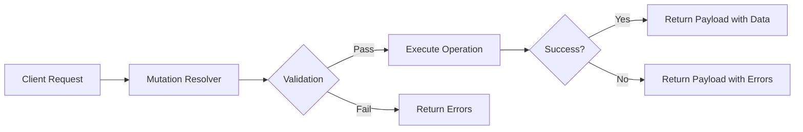
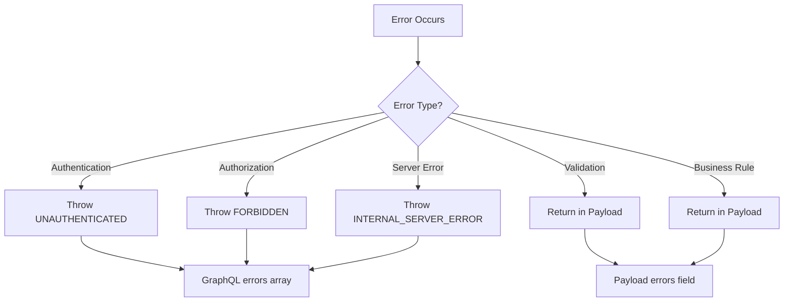
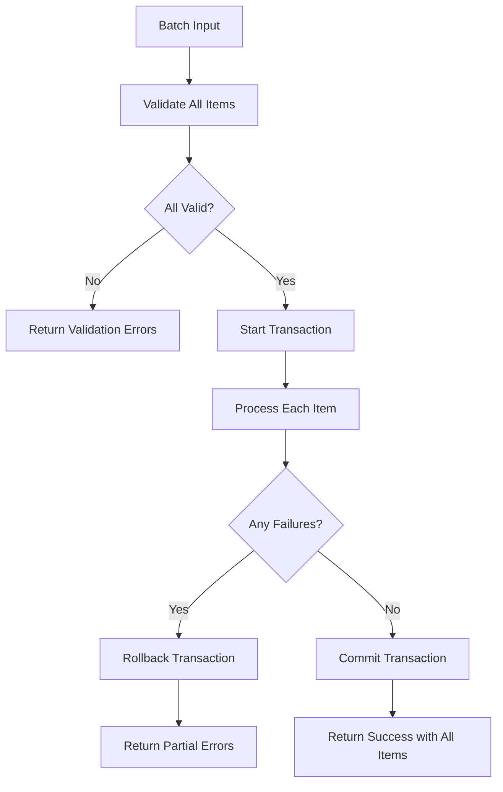

# How to Implement GraphQL Mutations

Author: [nawazdhandala](https://www.github.com/nawazdhandala)

Tags: GraphQL, API, Mutations, TypeScript, NodeJS, Backend, Web Development

Description: A hands-on guide to implementing GraphQL mutations - from basic CRUD operations to advanced patterns like validation, error handling, optimistic updates, and batch mutations.

---

GraphQL mutations are the write operations of your API. While queries fetch data, mutations create, update, and delete it. Getting mutations right means designing clear input types, returning useful payloads, handling errors gracefully, and building patterns that scale with your application.

This guide walks through everything you need to implement mutations properly - starting with the basics and building up to production-ready patterns.

---

## Table of Contents

1. Mutation Basics
2. Input Types
3. Return Types and Payloads
4. Validation
5. Error Handling
6. Optimistic Updates
7. Batch Mutations
8. Best Practices
9. Putting It All Together

---

## 1. Mutation Basics

A mutation is a GraphQL operation that modifies server-side data. Every mutation has a name, optional arguments, and a return type. Unlike REST where you pick between POST, PUT, PATCH, and DELETE, GraphQL uses mutations for all write operations.

Here is a simple mutation schema:

```graphql
type Mutation {
  createUser(name: String!, email: String!): User
  updateUser(id: ID!, name: String, email: String): User
  deleteUser(id: ID!): Boolean
}

type User {
  id: ID!
  name: String!
  email: String!
  createdAt: String!
}
```

The resolver handles the actual logic:

```typescript
// resolvers/user.ts
import { db } from '../database';

export const userMutations = {
  // Create a new user and return the created record
  createUser: async (_: unknown, args: { name: string; email: string }) => {
    const user = await db.users.create({
      name: args.name,
      email: args.email,
    });
    return user;
  },

  // Update existing user fields
  updateUser: async (_: unknown, args: { id: string; name?: string; email?: string }) => {
    const user = await db.users.update(args.id, {
      ...(args.name && { name: args.name }),
      ...(args.email && { email: args.email }),
    });
    return user;
  },

  // Delete user and return success status
  deleteUser: async (_: unknown, args: { id: string }) => {
    await db.users.delete(args.id);
    return true;
  },
};
```

The client calls mutations like this:

```graphql
mutation CreateUser {
  createUser(name: "Alice", email: "alice@example.com") {
    id
    name
    email
  }
}
```

---

## 2. Input Types

Passing individual arguments works for simple mutations, but it gets messy fast. Input types group related fields into a single object, making your schema cleaner and your mutations easier to evolve.

Define input types with the `input` keyword:

```graphql
input CreateUserInput {
  name: String!
  email: String!
  role: UserRole
  profile: ProfileInput
}

input ProfileInput {
  bio: String
  avatarUrl: String
  socialLinks: [SocialLinkInput!]
}

input SocialLinkInput {
  platform: String!
  url: String!
}

input UpdateUserInput {
  name: String
  email: String
  role: UserRole
  profile: ProfileInput
}

enum UserRole {
  ADMIN
  EDITOR
  VIEWER
}

type Mutation {
  createUser(input: CreateUserInput!): UserPayload!
  updateUser(id: ID!, input: UpdateUserInput!): UserPayload!
}
```

The resolver receives the input as a nested object:

```typescript
// resolvers/user.ts
interface CreateUserInput {
  name: string;
  email: string;
  role?: 'ADMIN' | 'EDITOR' | 'VIEWER';
  profile?: {
    bio?: string;
    avatarUrl?: string;
    socialLinks?: Array<{ platform: string; url: string }>;
  };
}

export const userMutations = {
  createUser: async (_: unknown, { input }: { input: CreateUserInput }) => {
    // Input is a clean, typed object
    const user = await db.users.create({
      name: input.name,
      email: input.email,
      role: input.role || 'VIEWER',
      profile: input.profile,
    });

    return { user, success: true };
  },
};
```

Input types have a few rules:
- They can only contain scalar types, enums, and other input types
- They cannot include output types like `User` or interfaces
- Nesting input types is fine and encouraged for complex structures

---

## 3. Return Types and Payloads

Returning just the modified entity works, but mutation payloads give you more flexibility. A payload can include the entity, success flags, error information, and metadata - all in one response.

Define a structured payload type:

```graphql
type UserPayload {
  success: Boolean!
  user: User
  errors: [FieldError!]
}

type FieldError {
  field: String!
  message: String!
}

type DeleteUserPayload {
  success: Boolean!
  deletedId: ID
  errors: [FieldError!]
}

type Mutation {
  createUser(input: CreateUserInput!): UserPayload!
  updateUser(id: ID!, input: UpdateUserInput!): UserPayload!
  deleteUser(id: ID!): DeleteUserPayload!
}
```

The flow looks like this:



Implement the resolver to always return a payload:

```typescript
// resolvers/user.ts
interface UserPayload {
  success: boolean;
  user?: User;
  errors?: Array<{ field: string; message: string }>;
}

export const userMutations = {
  createUser: async (_: unknown, { input }: { input: CreateUserInput }): Promise<UserPayload> => {
    // Always return a payload structure
    try {
      const user = await db.users.create(input);
      return {
        success: true,
        user,
      };
    } catch (error) {
      return {
        success: false,
        errors: [{ field: 'general', message: 'Failed to create user' }],
      };
    }
  },

  deleteUser: async (_: unknown, { id }: { id: string }) => {
    const user = await db.users.findById(id);

    if (!user) {
      return {
        success: false,
        errors: [{ field: 'id', message: 'User not found' }],
      };
    }

    await db.users.delete(id);

    return {
      success: true,
      deletedId: id,
    };
  },
};
```

This pattern lets clients handle responses consistently:

```graphql
mutation CreateUser($input: CreateUserInput!) {
  createUser(input: $input) {
    success
    user {
      id
      name
      email
    }
    errors {
      field
      message
    }
  }
}
```

---

## 4. Validation

Validation happens at multiple layers. GraphQL handles type checking automatically - a `String!` must be a string and cannot be null. But business rules need custom validation in your resolvers.

Here is a validation approach using a helper function:

```typescript
// validation/user.ts
interface ValidationResult {
  valid: boolean;
  errors: Array<{ field: string; message: string }>;
}

export function validateCreateUserInput(input: CreateUserInput): ValidationResult {
  const errors: Array<{ field: string; message: string }> = [];

  // Email format validation
  const emailRegex = /^[^\s@]+@[^\s@]+\.[^\s@]+$/;
  if (!emailRegex.test(input.email)) {
    errors.push({ field: 'email', message: 'Invalid email format' });
  }

  // Name length validation
  if (input.name.length < 2) {
    errors.push({ field: 'name', message: 'Name must be at least 2 characters' });
  }

  if (input.name.length > 100) {
    errors.push({ field: 'name', message: 'Name must be less than 100 characters' });
  }

  // Profile URL validation
  if (input.profile?.avatarUrl) {
    try {
      new URL(input.profile.avatarUrl);
    } catch {
      errors.push({ field: 'profile.avatarUrl', message: 'Invalid URL format' });
    }
  }

  return {
    valid: errors.length === 0,
    errors,
  };
}
```

Use the validator in your resolver:

```typescript
// resolvers/user.ts
import { validateCreateUserInput } from '../validation/user';

export const userMutations = {
  createUser: async (_: unknown, { input }: { input: CreateUserInput }): Promise<UserPayload> => {
    // Run validation first
    const validation = validateCreateUserInput(input);

    if (!validation.valid) {
      return {
        success: false,
        errors: validation.errors,
      };
    }

    // Check for duplicate email
    const existingUser = await db.users.findByEmail(input.email);
    if (existingUser) {
      return {
        success: false,
        errors: [{ field: 'email', message: 'Email already registered' }],
      };
    }

    // Validation passed - create the user
    const user = await db.users.create(input);

    return {
      success: true,
      user,
    };
  },
};
```

For more complex validation, consider using a library like Zod or Yup:

```typescript
// validation/schemas.ts
import { z } from 'zod';

export const createUserSchema = z.object({
  name: z.string().min(2).max(100),
  email: z.string().email(),
  role: z.enum(['ADMIN', 'EDITOR', 'VIEWER']).optional(),
  profile: z.object({
    bio: z.string().max(500).optional(),
    avatarUrl: z.string().url().optional(),
    socialLinks: z.array(z.object({
      platform: z.string(),
      url: z.string().url(),
    })).optional(),
  }).optional(),
});

// In resolver
export const userMutations = {
  createUser: async (_: unknown, { input }: { input: CreateUserInput }): Promise<UserPayload> => {
    const result = createUserSchema.safeParse(input);

    if (!result.success) {
      const errors = result.error.issues.map(issue => ({
        field: issue.path.join('.'),
        message: issue.message,
      }));
      return { success: false, errors };
    }

    const user = await db.users.create(result.data);
    return { success: true, user };
  },
};
```

---

## 5. Error Handling

GraphQL has two ways to communicate errors: through the `errors` array in the response, or through your payload types. Each approach has its place.

Use GraphQL errors for unexpected failures and authorization issues:

```typescript
// resolvers/user.ts
import { GraphQLError } from 'graphql';

export const userMutations = {
  updateUser: async (
    _: unknown,
    { id, input }: { id: string; input: UpdateUserInput },
    context: { user?: { id: string; role: string } }
  ): Promise<UserPayload> => {
    // Authentication check - throw GraphQL error
    if (!context.user) {
      throw new GraphQLError('You must be logged in', {
        extensions: { code: 'UNAUTHENTICATED' },
      });
    }

    // Authorization check - throw GraphQL error
    const targetUser = await db.users.findById(id);
    if (context.user.id !== id && context.user.role !== 'ADMIN') {
      throw new GraphQLError('Not authorized to update this user', {
        extensions: { code: 'FORBIDDEN' },
      });
    }

    // Validation errors - return in payload
    const validation = validateUpdateUserInput(input);
    if (!validation.valid) {
      return {
        success: false,
        errors: validation.errors,
      };
    }

    // Business logic errors - return in payload
    if (input.email) {
      const existingUser = await db.users.findByEmail(input.email);
      if (existingUser && existingUser.id !== id) {
        return {
          success: false,
          errors: [{ field: 'email', message: 'Email already in use' }],
        };
      }
    }

    const user = await db.users.update(id, input);
    return { success: true, user };
  },
};
```

The error flow decision tree:



Create custom error classes for consistency:

```typescript
// errors/graphql-errors.ts
import { GraphQLError } from 'graphql';

export class AuthenticationError extends GraphQLError {
  constructor(message = 'You must be logged in') {
    super(message, {
      extensions: { code: 'UNAUTHENTICATED' },
    });
  }
}

export class ForbiddenError extends GraphQLError {
  constructor(message = 'You do not have permission') {
    super(message, {
      extensions: { code: 'FORBIDDEN' },
    });
  }
}

export class NotFoundError extends GraphQLError {
  constructor(resource: string) {
    super(`${resource} not found`, {
      extensions: { code: 'NOT_FOUND' },
    });
  }
}

export class ValidationError extends GraphQLError {
  constructor(message: string, field?: string) {
    super(message, {
      extensions: {
        code: 'VALIDATION_ERROR',
        field,
      },
    });
  }
}
```

---

## 6. Optimistic Updates

Optimistic updates make your UI feel instant by assuming the mutation will succeed and updating the UI immediately. If the mutation fails, you roll back. This is a client-side pattern, but your mutations need to return the right data to support it.

Your mutation must return the complete updated state:

```graphql
type Mutation {
  updateTask(id: ID!, input: UpdateTaskInput!): TaskPayload!
  toggleTaskComplete(id: ID!): TaskPayload!
}

type TaskPayload {
  success: Boolean!
  task: Task
  errors: [FieldError!]
}

type Task {
  id: ID!
  title: String!
  completed: Boolean!
  updatedAt: String!
}
```

The resolver returns everything the client needs:

```typescript
// resolvers/task.ts
export const taskMutations = {
  toggleTaskComplete: async (_: unknown, { id }: { id: string }): Promise<TaskPayload> => {
    const task = await db.tasks.findById(id);

    if (!task) {
      return {
        success: false,
        errors: [{ field: 'id', message: 'Task not found' }],
      };
    }

    // Toggle the completed status
    const updatedTask = await db.tasks.update(id, {
      completed: !task.completed,
      updatedAt: new Date().toISOString(),
    });

    // Return complete task state for cache update
    return {
      success: true,
      task: updatedTask,
    };
  },
};
```

Client-side implementation with Apollo Client:

```typescript
// client/mutations/task.ts
import { gql, useMutation } from '@apollo/client';

const TOGGLE_TASK = gql`
  mutation ToggleTask($id: ID!) {
    toggleTaskComplete(id: $id) {
      success
      task {
        id
        title
        completed
        updatedAt
      }
      errors {
        field
        message
      }
    }
  }
`;

export function useToggleTask() {
  const [toggleTask] = useMutation(TOGGLE_TASK, {
    // Optimistic response - assume success
    optimisticResponse: ({ id }) => ({
      toggleTaskComplete: {
        success: true,
        task: {
          __typename: 'Task',
          id,
          // These values come from the cache
          completed: true, // Will be overwritten with actual toggle
          updatedAt: new Date().toISOString(),
        },
        errors: null,
      },
    }),

    // Update cache with response
    update(cache, { data }) {
      if (data?.toggleTaskComplete.success) {
        // Cache automatically updates because we return the task with ID
      }
    },

    // Handle rollback on error
    onError(error) {
      console.error('Toggle failed, rolling back:', error);
    },
  });

  return toggleTask;
}
```

For a more accurate optimistic response, read current state from cache:

```typescript
// client/mutations/task.ts
export function useToggleTask() {
  const client = useApolloClient();

  const [toggleTask] = useMutation(TOGGLE_TASK, {
    optimisticResponse: ({ id }) => {
      // Read current task state from cache
      const existingTask = client.readFragment({
        id: `Task:${id}`,
        fragment: gql`
          fragment TaskFields on Task {
            id
            title
            completed
            updatedAt
          }
        `,
      });

      return {
        toggleTaskComplete: {
          __typename: 'TaskPayload',
          success: true,
          task: {
            __typename: 'Task',
            id,
            title: existingTask?.title || '',
            completed: !existingTask?.completed, // Actual toggle
            updatedAt: new Date().toISOString(),
          },
          errors: null,
        },
      };
    },
  });

  return toggleTask;
}
```

---

## 7. Batch Mutations

Sometimes you need to modify multiple records in one operation. Batch mutations reduce round trips and let you handle the operations atomically.

Define batch mutation types:

```graphql
input CreateUsersInput {
  users: [CreateUserInput!]!
}

type BatchUserPayload {
  success: Boolean!
  users: [User!]
  failedIndexes: [Int!]
  errors: [BatchError!]
}

type BatchError {
  index: Int!
  field: String!
  message: String!
}

input UpdateTasksInput {
  updates: [TaskUpdate!]!
}

input TaskUpdate {
  id: ID!
  title: String
  completed: Boolean
}

type BatchTaskPayload {
  success: Boolean!
  tasks: [Task!]
  errors: [BatchError!]
}

type Mutation {
  createUsers(input: CreateUsersInput!): BatchUserPayload!
  updateTasks(input: UpdateTasksInput!): BatchTaskPayload!
  deleteUsers(ids: [ID!]!): BatchDeletePayload!
}
```

Implement with transaction support:

```typescript
// resolvers/user.ts
interface BatchUserPayload {
  success: boolean;
  users?: User[];
  failedIndexes?: number[];
  errors?: Array<{ index: number; field: string; message: string }>;
}

export const userMutations = {
  createUsers: async (
    _: unknown,
    { input }: { input: { users: CreateUserInput[] } }
  ): Promise<BatchUserPayload> => {
    const errors: Array<{ index: number; field: string; message: string }> = [];
    const validUsers: Array<{ index: number; data: CreateUserInput }> = [];

    // Validate all inputs first
    for (let i = 0; i < input.users.length; i++) {
      const validation = validateCreateUserInput(input.users[i]);

      if (!validation.valid) {
        validation.errors.forEach(err => {
          errors.push({ index: i, field: err.field, message: err.message });
        });
      } else {
        validUsers.push({ index: i, data: input.users[i] });
      }
    }

    // If any validation failed, return early
    if (errors.length > 0) {
      return {
        success: false,
        failedIndexes: [...new Set(errors.map(e => e.index))],
        errors,
      };
    }

    // Create all users in a transaction
    try {
      const users = await db.transaction(async (tx) => {
        const created: User[] = [];

        for (const { data } of validUsers) {
          const user = await tx.users.create(data);
          created.push(user);
        }

        return created;
      });

      return {
        success: true,
        users,
      };
    } catch (error) {
      return {
        success: false,
        errors: [{ index: -1, field: 'general', message: 'Transaction failed' }],
      };
    }
  },

  updateTasks: async (
    _: unknown,
    { input }: { input: { updates: Array<{ id: string; title?: string; completed?: boolean }> } }
  ): Promise<BatchTaskPayload> => {
    const errors: Array<{ index: number; field: string; message: string }> = [];
    const tasks: Task[] = [];

    // Process updates - could also use Promise.all for parallel execution
    await db.transaction(async (tx) => {
      for (let i = 0; i < input.updates.length; i++) {
        const update = input.updates[i];
        const task = await tx.tasks.findById(update.id);

        if (!task) {
          errors.push({ index: i, field: 'id', message: 'Task not found' });
          continue;
        }

        const updated = await tx.tasks.update(update.id, {
          ...(update.title !== undefined && { title: update.title }),
          ...(update.completed !== undefined && { completed: update.completed }),
        });

        tasks.push(updated);
      }
    });

    return {
      success: errors.length === 0,
      tasks,
      errors: errors.length > 0 ? errors : undefined,
    };
  },
};
```

The batch operation flow:



---

## 8. Best Practices

These patterns will save you headaches as your API grows.

### Use Descriptive Mutation Names

Name mutations after the action, not the implementation:

```graphql
# Good - describes the business action
type Mutation {
  publishArticle(id: ID!): ArticlePayload!
  archiveArticle(id: ID!): ArticlePayload!
  submitForReview(id: ID!): ArticlePayload!
}

# Bad - too generic
type Mutation {
  updateArticle(id: ID!, status: String!): Article
}
```

### Make Mutations Idempotent When Possible

Idempotent mutations produce the same result when called multiple times:

```typescript
// Idempotent - calling twice has same effect
export const mutations = {
  setTaskComplete: async (_: unknown, { id }: { id: string }) => {
    // Always sets to true, not a toggle
    return db.tasks.update(id, { completed: true });
  },

  // Non-idempotent - avoid when possible
  incrementCounter: async (_: unknown, { id }: { id: string }) => {
    const counter = await db.counters.findById(id);
    return db.counters.update(id, { value: counter.value + 1 });
  },
};
```

### Return Enough Data to Update the Cache

Always return at least the `id` and any modified fields:

```graphql
type Mutation {
  updateUser(id: ID!, input: UpdateUserInput!): UserPayload!
}

# Query response should include everything that might have changed
mutation UpdateUser($id: ID!, $input: UpdateUserInput!) {
  updateUser(id: $id, input: $input) {
    success
    user {
      id
      name
      email
      updatedAt
      # Include nested objects that might be affected
      profile {
        bio
        avatarUrl
      }
    }
    errors {
      field
      message
    }
  }
}
```

### Version Your Input Types

When you need to change input shapes, create new versions:

```graphql
# Original
input CreateUserInput {
  name: String!
  email: String!
}

# New version with additional fields
input CreateUserInputV2 {
  name: String!
  email: String!
  preferences: UserPreferencesInput
}

type Mutation {
  createUser(input: CreateUserInput!): UserPayload! @deprecated(reason: "Use createUserV2")
  createUserV2(input: CreateUserInputV2!): UserPayload!
}
```

### Document Side Effects

If a mutation triggers other actions, document them:

```graphql
type Mutation {
  """
  Creates a new user account.

  Side effects:
  - Sends welcome email
  - Creates default workspace
  - Logs analytics event
  """
  createUser(input: CreateUserInput!): UserPayload!
}
```

---

## 9. Putting It All Together

Here is a complete mutation implementation that combines all the patterns:

```graphql
# schema.graphql
input CreateOrderInput {
  items: [OrderItemInput!]!
  shippingAddress: AddressInput!
  billingAddress: AddressInput
  paymentMethod: PaymentMethodInput!
  notes: String
}

input OrderItemInput {
  productId: ID!
  quantity: Int!
}

input AddressInput {
  street: String!
  city: String!
  state: String!
  postalCode: String!
  country: String!
}

input PaymentMethodInput {
  type: PaymentType!
  cardToken: String
}

enum PaymentType {
  CREDIT_CARD
  PAYPAL
  BANK_TRANSFER
}

type OrderPayload {
  success: Boolean!
  order: Order
  errors: [FieldError!]
}

type Order {
  id: ID!
  items: [OrderItem!]!
  total: Float!
  status: OrderStatus!
  shippingAddress: Address!
  createdAt: String!
}

enum OrderStatus {
  PENDING
  CONFIRMED
  SHIPPED
  DELIVERED
  CANCELLED
}

type Mutation {
  createOrder(input: CreateOrderInput!): OrderPayload!
  cancelOrder(id: ID!, reason: String): OrderPayload!
}
```

The resolver with full validation and error handling:

```typescript
// resolvers/order.ts
import { GraphQLError } from 'graphql';
import { validateCreateOrderInput } from '../validation/order';
import { AuthenticationError, ForbiddenError } from '../errors/graphql-errors';

interface Context {
  user?: {
    id: string;
    role: string;
  };
}

export const orderMutations = {
  createOrder: async (
    _: unknown,
    { input }: { input: CreateOrderInput },
    context: Context
  ): Promise<OrderPayload> => {
    // Authentication check
    if (!context.user) {
      throw new AuthenticationError();
    }

    // Validate input
    const validation = validateCreateOrderInput(input);
    if (!validation.valid) {
      return {
        success: false,
        errors: validation.errors,
      };
    }

    // Check product availability
    const availabilityErrors: FieldError[] = [];
    for (const item of input.items) {
      const product = await db.products.findById(item.productId);

      if (!product) {
        availabilityErrors.push({
          field: `items.${item.productId}`,
          message: 'Product not found',
        });
        continue;
      }

      if (product.stock < item.quantity) {
        availabilityErrors.push({
          field: `items.${item.productId}`,
          message: `Only ${product.stock} items available`,
        });
      }
    }

    if (availabilityErrors.length > 0) {
      return {
        success: false,
        errors: availabilityErrors,
      };
    }

    // Create order in transaction
    try {
      const order = await db.transaction(async (tx) => {
        // Calculate total
        let total = 0;
        const orderItems: OrderItem[] = [];

        for (const item of input.items) {
          const product = await tx.products.findById(item.productId);
          total += product.price * item.quantity;

          // Reserve inventory
          await tx.products.update(item.productId, {
            stock: product.stock - item.quantity,
          });

          orderItems.push({
            productId: item.productId,
            quantity: item.quantity,
            price: product.price,
          });
        }

        // Create order record
        const order = await tx.orders.create({
          userId: context.user!.id,
          items: orderItems,
          total,
          status: 'PENDING',
          shippingAddress: input.shippingAddress,
          billingAddress: input.billingAddress || input.shippingAddress,
          notes: input.notes,
        });

        // Process payment
        const paymentResult = await processPayment({
          orderId: order.id,
          amount: total,
          method: input.paymentMethod,
        });

        if (!paymentResult.success) {
          throw new Error('Payment failed');
        }

        // Update order status
        await tx.orders.update(order.id, { status: 'CONFIRMED' });

        return { ...order, status: 'CONFIRMED' };
      });

      // Send confirmation email (outside transaction)
      await sendOrderConfirmation(order.id);

      return {
        success: true,
        order,
      };
    } catch (error) {
      console.error('Order creation failed:', error);
      return {
        success: false,
        errors: [{ field: 'general', message: 'Failed to create order' }],
      };
    }
  },

  cancelOrder: async (
    _: unknown,
    { id, reason }: { id: string; reason?: string },
    context: Context
  ): Promise<OrderPayload> => {
    if (!context.user) {
      throw new AuthenticationError();
    }

    const order = await db.orders.findById(id);

    if (!order) {
      return {
        success: false,
        errors: [{ field: 'id', message: 'Order not found' }],
      };
    }

    // Check ownership
    if (order.userId !== context.user.id && context.user.role !== 'ADMIN') {
      throw new ForbiddenError('Cannot cancel this order');
    }

    // Check if cancellable
    if (['SHIPPED', 'DELIVERED', 'CANCELLED'].includes(order.status)) {
      return {
        success: false,
        errors: [{ field: 'status', message: `Cannot cancel order with status ${order.status}` }],
      };
    }

    // Cancel and restore inventory
    await db.transaction(async (tx) => {
      // Restore inventory
      for (const item of order.items) {
        const product = await tx.products.findById(item.productId);
        await tx.products.update(item.productId, {
          stock: product.stock + item.quantity,
        });
      }

      // Update order
      await tx.orders.update(id, {
        status: 'CANCELLED',
        cancelReason: reason,
        cancelledAt: new Date().toISOString(),
      });
    });

    const updatedOrder = await db.orders.findById(id);

    return {
      success: true,
      order: updatedOrder,
    };
  },
};
```

---

## Summary

| Concept | What to Remember |
|---------|------------------|
| **Input Types** | Group related arguments, nest when needed, keep them flat when simple |
| **Return Types** | Use payloads with success flags, data, and errors - not just the entity |
| **Validation** | Layer it: GraphQL types first, then custom validation, then business rules |
| **Error Handling** | Throw for auth issues, return in payload for validation and business errors |
| **Optimistic Updates** | Return complete state so clients can update their cache immediately |
| **Batch Mutations** | Use transactions, validate all items first, return indexed errors |
| **Best Practices** | Descriptive names, idempotent when possible, version input types |

GraphQL mutations are more than just "the write side of the API." Done well, they provide a clean, predictable interface for all state changes in your application. Start simple, add complexity only when needed, and always think about how your clients will consume the mutations you design.

---

### Further Reading

- [GraphQL Official Documentation](https://graphql.org/learn/queries/#mutations)
- [Apollo Server Documentation](https://www.apollographql.com/docs/apollo-server/)
- [GraphQL Best Practices](https://graphql.org/learn/best-practices/)
