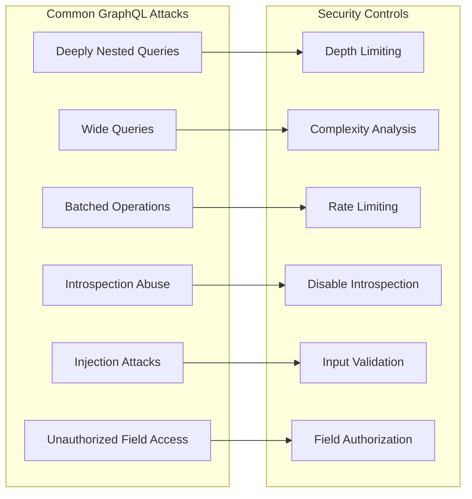
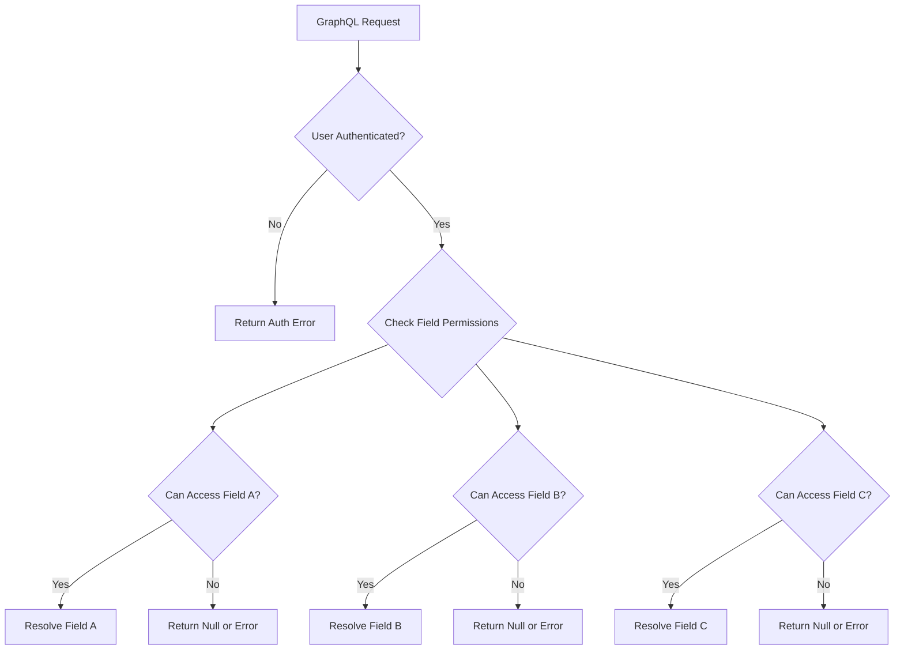
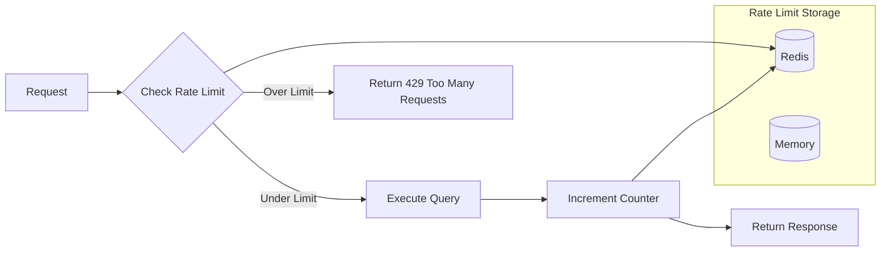
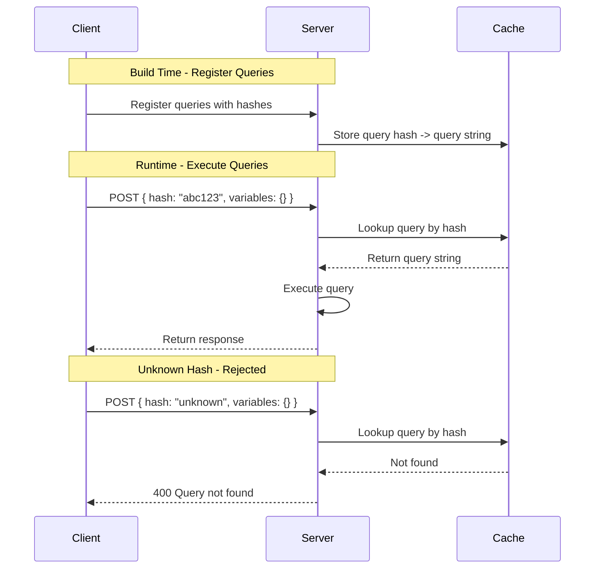

# How to Secure GraphQL APIs

Author: [nawazdhandala](https://www.github.com/nawazdhandala)

Tags: GraphQL, Security, API, Authentication, Authorization, Rate Limiting

Description: A practical guide to hardening GraphQL APIs against common attack vectors - from authentication and authorization to query depth limiting, complexity analysis, and beyond.

---

GraphQL gives clients tremendous power to request exactly what they need. That flexibility is also its biggest security risk. Without proper safeguards, a single malicious query can bring down your server or leak sensitive data.

This guide covers the essential techniques for securing GraphQL APIs in production. We will walk through authentication context, field-level authorization, query depth limiting, complexity analysis, rate limiting, input validation, disabling introspection, and persisted queries.

---

## The GraphQL Attack Surface

Before diving into defenses, let's understand what we're protecting against.



---

## Authentication Context

Every GraphQL request should carry authentication context. This typically means extracting a JWT or session token from the request headers and attaching the user to the context object.

The context is passed to every resolver, making it the foundation for all authorization decisions.

```javascript
// Apollo Server example - extract user from JWT and attach to context
import { ApolloServer } from '@apollo/server';
import { expressMiddleware } from '@apollo/server/express4';
import jwt from 'jsonwebtoken';

// Verify the JWT and return the decoded user payload
function getUserFromToken(token) {
  if (!token) return null;

  try {
    // Remove 'Bearer ' prefix if present
    const cleanToken = token.replace('Bearer ', '');
    return jwt.verify(cleanToken, process.env.JWT_SECRET);
  } catch (error) {
    // Invalid or expired token
    return null;
  }
}

const server = new ApolloServer({
  typeDefs,
  resolvers,
});

await server.start();

// Attach context middleware that extracts user from Authorization header
app.use(
  '/graphql',
  expressMiddleware(server, {
    context: async ({ req }) => {
      const token = req.headers.authorization || '';
      const user = getUserFromToken(token);

      return {
        user,
        // Include other context like dataloaders, db connections
        loaders: createDataLoaders(),
      };
    },
  })
);
```

For operations that require authentication, check early and fail fast.

```javascript
// Resolver that requires authentication
const resolvers = {
  Query: {
    me: (parent, args, context) => {
      // Throw if no authenticated user in context
      if (!context.user) {
        throw new AuthenticationError('You must be logged in');
      }
      return context.user;
    },
  },
};
```

---

## Field-Level Authorization

Authentication tells you who is making the request. Authorization determines what they can access. In GraphQL, you need authorization checks at the field level because clients can request any combination of fields.



Use a directive-based approach to keep authorization logic declarative and visible in the schema.

```graphql
# Define a custom directive for role-based access
directive @auth(requires: Role = USER) on FIELD_DEFINITION

enum Role {
  ADMIN
  USER
  GUEST
}

type User {
  id: ID!
  email: String!
  # Only admins can see the user's role
  role: Role! @auth(requires: ADMIN)
  # Only the user themselves or admins can see billing info
  billingInfo: BillingInfo @auth(requires: ADMIN)
}

type Query {
  users: [User!]! @auth(requires: ADMIN)
  me: User @auth(requires: USER)
  publicPosts: [Post!]!  # No auth required
}
```

Implement the directive transformer to enforce these rules.

```javascript
// Directive implementation for authorization
import { mapSchema, getDirective, MapperKind } from '@graphql-tools/utils';
import { defaultFieldResolver } from 'graphql';

function authDirectiveTransformer(schema) {
  return mapSchema(schema, {
    [MapperKind.OBJECT_FIELD]: (fieldConfig) => {
      const authDirective = getDirective(schema, fieldConfig, 'auth')?.[0];

      if (authDirective) {
        const { requires } = authDirective;
        const originalResolver = fieldConfig.resolve || defaultFieldResolver;

        // Wrap the original resolver with authorization check
        fieldConfig.resolve = async (source, args, context, info) => {
          const user = context.user;

          // No user means not authenticated
          if (!user) {
            throw new AuthenticationError('Not authenticated');
          }

          // Check if user has required role
          const roleHierarchy = ['GUEST', 'USER', 'ADMIN'];
          const userRoleIndex = roleHierarchy.indexOf(user.role);
          const requiredRoleIndex = roleHierarchy.indexOf(requires);

          if (userRoleIndex < requiredRoleIndex) {
            throw new ForbiddenError(
              `Requires ${requires} role, you have ${user.role}`
            );
          }

          return originalResolver(source, args, context, info);
        };
      }

      return fieldConfig;
    },
  });
}
```

---

## Query Depth Limiting

GraphQL's nested nature allows attackers to craft deeply nested queries that consume server resources exponentially.

```graphql
# Malicious deeply nested query - each level multiplies database calls
query DeepAttack {
  users {
    friends {
      friends {
        friends {
          friends {
            friends {
              # This keeps going...
              id
              email
            }
          }
        }
      }
    }
  }
}
```

Set a maximum depth limit to reject these queries before execution.

```javascript
// Using graphql-depth-limit to restrict query depth
import depthLimit from 'graphql-depth-limit';
import { ApolloServer } from '@apollo/server';

const server = new ApolloServer({
  typeDefs,
  resolvers,
  validationRules: [
    // Reject queries deeper than 5 levels
    depthLimit(5, { ignore: ['__schema', '__type'] }),
  ],
});
```

You can also implement custom depth limiting with more granular control.

```javascript
// Custom depth limit implementation with field-specific limits
import { getNamedType, isObjectType } from 'graphql';

function createDepthLimitRule(maxDepth, options = {}) {
  return function depthLimitRule(context) {
    const { ignore = [] } = options;
    const depths = new Map();

    return {
      Field: {
        enter(node, key, parent, path, ancestors) {
          // Skip ignored fields
          if (ignore.includes(node.name.value)) {
            return;
          }

          // Calculate current depth
          const depth = ancestors.filter(
            (ancestor) => ancestor.kind === 'Field'
          ).length;

          if (depth > maxDepth) {
            context.reportError(
              new GraphQLError(
                `Query depth of ${depth} exceeds maximum allowed depth of ${maxDepth}`,
                { nodes: [node] }
              )
            );
          }
        },
      },
    };
  };
}
```

---

## Query Complexity Analysis

Depth limiting alone is not enough. A shallow but wide query can be just as dangerous.

```graphql
# Wide query - shallow but requests thousands of records
query WideAttack {
  users(first: 10000) { id email }
  posts(first: 10000) { id title }
  comments(first: 10000) { id body }
  products(first: 10000) { id name price }
}
```

Assign complexity costs to fields and reject queries that exceed a threshold.

```javascript
// Using graphql-query-complexity for cost analysis
import {
  getComplexity,
  simpleEstimator,
  fieldExtensionsEstimator,
} from 'graphql-query-complexity';

const server = new ApolloServer({
  typeDefs,
  resolvers,
  plugins: [
    {
      requestDidStart: () => ({
        didResolveOperation({ request, document }) {
          const complexity = getComplexity({
            schema,
            operationName: request.operationName,
            query: document,
            variables: request.variables,
            estimators: [
              // Use field extensions first, fall back to simple estimator
              fieldExtensionsEstimator(),
              // Default cost of 1 for each field
              simpleEstimator({ defaultComplexity: 1 }),
            ],
          });

          const maxComplexity = 1000;

          if (complexity > maxComplexity) {
            throw new GraphQLError(
              `Query complexity of ${complexity} exceeds maximum of ${maxComplexity}`
            );
          }

          // Log complexity for monitoring
          console.log(`Query complexity: ${complexity}`);
        },
      }),
    },
  ],
});
```

Define complexity in your schema for more accurate cost calculation.

```graphql
# Schema with complexity hints
type Query {
  # Simple field - default cost
  me: User

  # List field - cost multiplied by requested items
  users(first: Int = 10): [User!]! @complexity(multiplier: 10)

  # Expensive field - high fixed cost
  analyticsReport(dateRange: DateRange!): Report @complexity(value: 500)
}

type User {
  id: ID!
  email: String!
  # Relationship fields are more expensive
  posts(first: Int = 10): [Post!]! @complexity(multiplier: 5)
  followers(first: Int = 10): [User!]! @complexity(multiplier: 10)
}
```

---

## Rate Limiting

Even with depth and complexity limits, you need rate limiting to prevent abuse over time. Rate limit by user, IP, or both.



Implement rate limiting as middleware or a GraphQL plugin.

```javascript
// Rate limiting with Redis for distributed systems
import Redis from 'ioredis';

const redis = new Redis(process.env.REDIS_URL);

async function checkRateLimit(identifier, limit, windowSeconds) {
  const key = `ratelimit:${identifier}`;
  const current = await redis.incr(key);

  // Set expiry on first request in window
  if (current === 1) {
    await redis.expire(key, windowSeconds);
  }

  return {
    allowed: current <= limit,
    current,
    limit,
    remaining: Math.max(0, limit - current),
    resetAt: await redis.ttl(key),
  };
}

// Apollo Server plugin for rate limiting
const rateLimitPlugin = {
  async requestDidStart({ context }) {
    // Use user ID if authenticated, otherwise IP address
    const identifier = context.user?.id || context.ip;

    // 100 requests per minute
    const result = await checkRateLimit(identifier, 100, 60);

    if (!result.allowed) {
      throw new GraphQLError('Rate limit exceeded', {
        extensions: {
          code: 'RATE_LIMITED',
          limit: result.limit,
          resetAt: result.resetAt,
        },
      });
    }

    // Add rate limit info to response headers
    context.res.set({
      'X-RateLimit-Limit': result.limit,
      'X-RateLimit-Remaining': result.remaining,
      'X-RateLimit-Reset': result.resetAt,
    });
  },
};
```

Consider implementing operation-specific rate limits for expensive queries.

```javascript
// Different rate limits based on operation complexity
async function checkOperationRateLimit(context, complexity) {
  const identifier = context.user?.id || context.ip;

  // Expensive queries get stricter limits
  if (complexity > 500) {
    return checkRateLimit(`${identifier}:expensive`, 10, 60);
  }

  // Mutations have separate limits
  if (context.operation?.operation === 'mutation') {
    return checkRateLimit(`${identifier}:mutation`, 50, 60);
  }

  // Standard queries
  return checkRateLimit(`${identifier}:query`, 100, 60);
}
```

---

## Input Validation

Never trust client input. Validate all arguments before they reach your resolvers or database.

```javascript
// Using Zod for input validation
import { z } from 'zod';

// Define validation schemas for your inputs
const CreateUserSchema = z.object({
  email: z.string().email().max(255),
  password: z.string().min(8).max(128),
  name: z.string().min(1).max(100).regex(/^[a-zA-Z\s]+$/),
});

const PaginationSchema = z.object({
  first: z.number().int().min(1).max(100).default(10),
  after: z.string().optional(),
});

// Apply validation in resolvers
const resolvers = {
  Mutation: {
    createUser: async (parent, args, context) => {
      // Validate input - throws ZodError if invalid
      const validated = CreateUserSchema.parse(args.input);

      // Input is now safe to use
      return context.dataSources.users.create(validated);
    },
  },
  Query: {
    users: async (parent, args, context) => {
      const { first, after } = PaginationSchema.parse(args);
      return context.dataSources.users.findMany({ first, after });
    },
  },
};
```

Create a validation directive for schema-level input validation.

```graphql
# Schema with validation directives
directive @validate(
  maxLength: Int
  minLength: Int
  pattern: String
  min: Int
  max: Int
) on INPUT_FIELD_DEFINITION | ARGUMENT_DEFINITION

input CreateUserInput {
  email: String! @validate(maxLength: 255)
  password: String! @validate(minLength: 8, maxLength: 128)
  name: String! @validate(minLength: 1, maxLength: 100, pattern: "^[a-zA-Z\\s]+$")
}

type Mutation {
  createUser(input: CreateUserInput!): User!

  # Validate arguments directly
  updateUserName(
    id: ID!
    name: String! @validate(minLength: 1, maxLength: 100)
  ): User!
}
```

---

## Disabling Introspection

Introspection lets clients discover your entire schema. While useful in development, it exposes your API structure to attackers in production.

```javascript
// Disable introspection in production
import { ApolloServer } from '@apollo/server';
import { ApolloServerPluginLandingPageDisabled } from '@apollo/server/plugin/disabled';

const server = new ApolloServer({
  typeDefs,
  resolvers,
  introspection: process.env.NODE_ENV !== 'production',
  plugins: [
    // Also disable the landing page in production
    ...(process.env.NODE_ENV === 'production'
      ? [ApolloServerPluginLandingPageDisabled()]
      : []),
  ],
});
```

For more granular control, create a validation rule that blocks introspection queries.

```javascript
// Custom rule to block introspection queries
import { GraphQLError } from 'graphql';

function noIntrospection(context) {
  return {
    Field(node) {
      // Block __schema and __type queries
      if (
        node.name.value === '__schema' ||
        node.name.value === '__type'
      ) {
        context.reportError(
          new GraphQLError(
            'Introspection is disabled',
            { nodes: [node] }
          )
        );
      }
    },
  };
}

// Add to validation rules
const server = new ApolloServer({
  typeDefs,
  resolvers,
  validationRules: [
    ...(process.env.NODE_ENV === 'production' ? [noIntrospection] : []),
  ],
});
```

---

## Persisted Queries

Persisted queries replace arbitrary query strings with pre-approved query hashes. This prevents attackers from sending malicious queries entirely.



Apollo Server supports automatic persisted queries (APQ) out of the box.

```javascript
// Enable automatic persisted queries
import { ApolloServer } from '@apollo/server';
import { ApolloServerPluginCacheControl } from '@apollo/server/plugin/cacheControl';
import { KeyvAdapter } from '@apollo/utils.keyvadapter';
import Keyv from 'keyv';

// Use Redis for distributed cache
const cache = new KeyvAdapter(new Keyv(process.env.REDIS_URL));

const server = new ApolloServer({
  typeDefs,
  resolvers,
  cache,
  persistedQueries: {
    cache,
    // Only allow persisted queries in production
    ...(process.env.NODE_ENV === 'production' && {
      // Reject queries that aren't persisted
      ttl: null, // Never auto-expire
    }),
  },
});
```

For strict security, only allow pre-registered queries.

```javascript
// Strict persisted queries - only allow pre-registered queries
const allowedQueries = new Map([
  ['abc123hash', 'query GetUser($id: ID!) { user(id: $id) { id name } }'],
  ['def456hash', 'query ListPosts { posts { id title } }'],
  ['ghi789hash', 'mutation CreatePost($input: CreatePostInput!) { createPost(input: $input) { id } }'],
]);

const strictPersistedQueriesPlugin = {
  async requestDidStart({ request }) {
    // In production, only allow persisted queries
    if (process.env.NODE_ENV === 'production') {
      const hash = request.extensions?.persistedQuery?.sha256Hash;

      if (!hash) {
        throw new GraphQLError('Only persisted queries are allowed');
      }

      const query = allowedQueries.get(hash);
      if (!query) {
        throw new GraphQLError('Unknown query hash');
      }

      // Replace the request query with the stored one
      request.query = query;
    }
  },
};
```

---

## Putting It All Together

Here is a complete security configuration combining all the techniques.

```javascript
// Complete secure GraphQL server setup
import { ApolloServer } from '@apollo/server';
import { expressMiddleware } from '@apollo/server/express4';
import depthLimit from 'graphql-depth-limit';
import { getComplexity, simpleEstimator } from 'graphql-query-complexity';
import express from 'express';
import helmet from 'helmet';
import cors from 'cors';

const app = express();

// Standard security headers
app.use(helmet());
app.use(cors({ origin: process.env.ALLOWED_ORIGINS?.split(',') }));
app.use(express.json({ limit: '100kb' })); // Limit request body size

const server = new ApolloServer({
  typeDefs: secureTypeDefs,
  resolvers: secureResolvers,

  // Disable introspection in production
  introspection: process.env.NODE_ENV !== 'production',

  // Validation rules
  validationRules: [
    depthLimit(10),
    ...(process.env.NODE_ENV === 'production' ? [noIntrospection] : []),
  ],

  plugins: [
    // Complexity analysis
    {
      requestDidStart: () => ({
        didResolveOperation({ request, document }) {
          const complexity = getComplexity({
            schema,
            query: document,
            variables: request.variables,
            estimators: [simpleEstimator({ defaultComplexity: 1 })],
          });

          if (complexity > 1000) {
            throw new GraphQLError(`Query too complex: ${complexity}`);
          }
        },
      }),
    },
    // Rate limiting
    rateLimitPlugin,
    // Persisted queries enforcement
    strictPersistedQueriesPlugin,
  ],
});

await server.start();

app.use(
  '/graphql',
  expressMiddleware(server, {
    context: async ({ req, res }) => {
      const user = await getUserFromToken(req.headers.authorization);
      return {
        user,
        ip: req.ip,
        res,
        loaders: createDataLoaders(user),
      };
    },
  })
);
```

---

## Security Checklist

Before deploying your GraphQL API to production, verify these items:

- [ ] Authentication extracts and validates tokens on every request
- [ ] Field-level authorization checks user permissions in resolvers
- [ ] Query depth is limited to prevent nested query attacks
- [ ] Query complexity is calculated and capped
- [ ] Rate limiting is enabled per user and IP
- [ ] All inputs are validated before reaching business logic
- [ ] Introspection is disabled in production
- [ ] Persisted queries are enforced (or APQ is configured)
- [ ] Request body size is limited
- [ ] Error messages do not leak internal details
- [ ] Logging captures query patterns for anomaly detection

---

GraphQL's flexibility is a double-edged sword. The same features that make it developer-friendly also create security risks that do not exist in traditional REST APIs. By layering these defenses - authentication context, field authorization, depth and complexity limits, rate limiting, input validation, disabled introspection, and persisted queries - you build an API that is both powerful and resilient to abuse.

Start with the basics (authentication and depth limiting), then progressively add more controls as your API matures. Security is not a one-time task but an ongoing practice.
