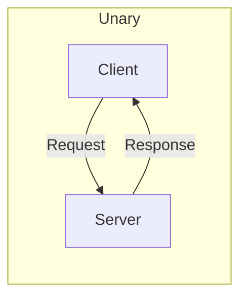
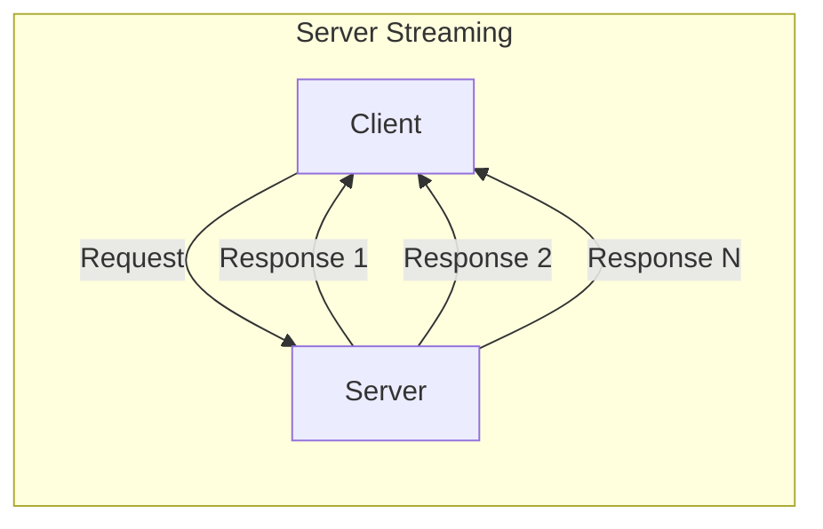
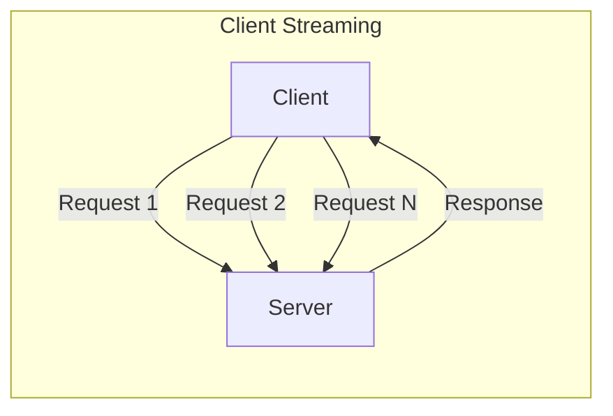
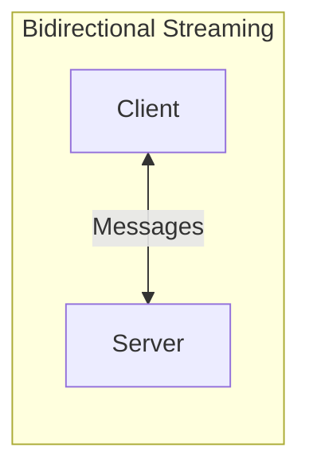
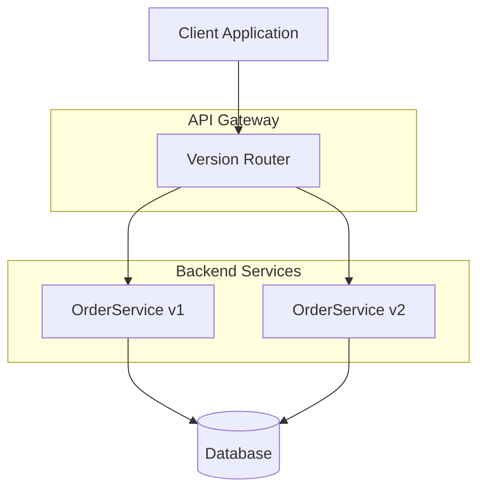
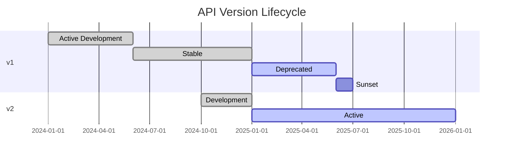

# How to Design gRPC Service Contracts

Author: [nawazdhandala](https://www.github.com/nawazdhandala)

Tags: gRPC, Protocol Buffers, API Design, Microservices, Backend, Distributed Systems

Description: A practical guide to designing robust gRPC service contracts using Protocol Buffers, covering message design, RPC patterns, error handling, and API evolution strategies.

---

gRPC has become the go-to choice for internal microservice communication. Its binary protocol is faster than JSON, the contract-first approach catches breaking changes at compile time, and streaming support handles real-time use cases that REST struggles with.

But designing good gRPC contracts takes practice. A poorly designed proto file leads to awkward client code, painful migrations, and frustrated developers. This guide walks through the fundamentals of Protocol Buffers and gives you patterns that scale.

---

## Table of Contents

1. Protocol Buffers Basics
2. Message Design Principles
3. Defining Services and RPCs
4. RPC Patterns (Unary and Streaming)
5. Error Handling with Status Codes
6. Versioning Strategies
7. Best Practices for API Evolution
8. Complete Example

---

## 1. Protocol Buffers Basics

Protocol Buffers (protobuf) is the interface definition language for gRPC. You define your data structures and services in `.proto` files, then generate client and server code for your target language.

Here is a minimal proto file structure.

```protobuf
// Specify the proto syntax version - always use proto3 for new projects
syntax = "proto3";

// Package prevents naming conflicts when importing across files
package mycompany.inventory.v1;

// Go-specific option - sets the import path for generated code
option go_package = "github.com/mycompany/api/inventory/v1;inventorypb";

// Java-specific options
option java_multiple_files = true;
option java_package = "com.mycompany.api.inventory.v1";
```

### Scalar Types

Proto3 provides these scalar types that map to native types in each language.

| Proto Type | Go | Java | Python | TypeScript |
|------------|-----|------|--------|------------|
| `double` | float64 | double | float | number |
| `float` | float32 | float | float | number |
| `int32` | int32 | int | int | number |
| `int64` | int64 | long | int | number (or bigint) |
| `uint32` | uint32 | int | int | number |
| `uint64` | uint64 | long | int | number (or bigint) |
| `bool` | bool | boolean | bool | boolean |
| `string` | string | String | str | string |
| `bytes` | []byte | ByteString | bytes | Uint8Array |

### Field Numbers

Every field needs a unique number within its message. These numbers identify fields in the binary format - they matter more than field names for wire compatibility.

```protobuf
message Product {
  string id = 1;           // Field number 1
  string name = 2;         // Field number 2
  int32 quantity = 3;      // Field number 3
  double price = 4;        // Field number 4
}
```

Reserve numbers 1-15 for frequently used fields since they encode in one byte. Numbers 16-2047 take two bytes.

---

## 2. Message Design Principles

### Use Specific Types, Not Primitives

Wrap primitive values in messages when they represent domain concepts. This gives you room to add fields later without breaking clients.

Bad - raw string prevents adding metadata later.

```protobuf
// Avoid this - you cannot add fields to a string
rpc GetProduct(string) returns (Product);
```

Good - wrapper message can evolve.

```protobuf
message GetProductRequest {
  string product_id = 1;
  // Later you can add: bool include_inventory = 2;
}

rpc GetProduct(GetProductRequest) returns (Product);
```

### Group Related Fields

Nest messages to represent logical groupings. This improves readability and lets you reuse structures.

```protobuf
message Order {
  string order_id = 1;
  Customer customer = 2;
  repeated LineItem items = 3;
  ShippingAddress shipping = 4;
  PaymentInfo payment = 5;
  OrderStatus status = 6;
}

message Customer {
  string customer_id = 1;
  string email = 2;
  string name = 3;
}

message LineItem {
  string product_id = 1;
  int32 quantity = 2;
  Money unit_price = 3;
}

// Reusable money type with currency
message Money {
  int64 units = 1;        // Whole units (dollars)
  int32 nanos = 2;        // Nano units (billionths)
  string currency = 3;    // ISO 4217 code
}
```

### Use Enums for Fixed Sets of Values

Enums are perfect for status fields and other constrained choices.

```protobuf
enum OrderStatus {
  ORDER_STATUS_UNSPECIFIED = 0;  // Always have an unspecified zero value
  ORDER_STATUS_PENDING = 1;
  ORDER_STATUS_CONFIRMED = 2;
  ORDER_STATUS_SHIPPED = 3;
  ORDER_STATUS_DELIVERED = 4;
  ORDER_STATUS_CANCELLED = 5;
}
```

The zero value should always be `UNSPECIFIED` or `UNKNOWN`. This handles cases where the field was not set or the client does not recognize a new enum value.

### Repeated Fields for Collections

Use `repeated` for lists. They are always optional in proto3 - an empty list and a missing field are equivalent.

```protobuf
message SearchResponse {
  repeated Product products = 1;
  int32 total_count = 2;
  string next_page_token = 3;
}
```

### Optional Fields and Presence

In proto3, scalar fields do not track presence - a missing `int32` and an explicit `0` look the same. Use `optional` when you need to distinguish between "not set" and "set to default."

```protobuf
message UpdateProductRequest {
  string product_id = 1;

  // These use optional so we can detect "update to empty" vs "do not update"
  optional string name = 2;
  optional string description = 3;
  optional double price = 4;
}
```

### Maps for Key-Value Data

Maps provide native support for dictionaries.

```protobuf
message Product {
  string id = 1;
  string name = 2;
  map<string, string> attributes = 3;  // e.g., "color" -> "blue"
  map<string, int32> inventory_by_warehouse = 4;
}
```

### Oneof for Mutually Exclusive Fields

When only one of several fields should be set, use `oneof`.

```protobuf
message PaymentMethod {
  oneof method {
    CreditCard credit_card = 1;
    BankTransfer bank_transfer = 2;
    DigitalWallet digital_wallet = 3;
  }
}

message CreditCard {
  string card_number = 1;
  string expiry = 2;
  string cvv = 3;
}
```

---

## 3. Defining Services and RPCs

A service groups related RPC methods. Think of it as a class or module that handles one domain.

```protobuf
service InventoryService {
  // Check current stock levels for a product
  rpc GetInventory(GetInventoryRequest) returns (GetInventoryResponse);

  // Reserve inventory for an order
  rpc ReserveInventory(ReserveInventoryRequest) returns (ReserveInventoryResponse);

  // Release previously reserved inventory
  rpc ReleaseInventory(ReleaseInventoryRequest) returns (ReleaseInventoryResponse);

  // Watch inventory changes in real-time
  rpc WatchInventory(WatchInventoryRequest) returns (stream InventoryUpdate);
}
```

### Naming Conventions

Follow these naming patterns for consistency.

| Element | Convention | Example |
|---------|------------|---------|
| Package | lowercase with dots | `mycompany.inventory.v1` |
| Service | PascalCase with Service suffix | `InventoryService` |
| RPC method | PascalCase verb phrase | `GetInventory`, `CreateOrder` |
| Message | PascalCase | `GetInventoryRequest` |
| Field | snake_case | `product_id`, `created_at` |
| Enum | SCREAMING_SNAKE_CASE | `ORDER_STATUS_PENDING` |

### Request/Response Pairing

Always create dedicated request and response messages for each RPC - even if the request is empty or the response just wraps a single field.

```protobuf
// Even empty requests get their own message type
message ListCategoriesRequest {
  // Empty for now, but can add pagination later
}

message ListCategoriesResponse {
  repeated Category categories = 1;
}

rpc ListCategories(ListCategoriesRequest) returns (ListCategoriesResponse);
```

---

## 4. RPC Patterns

gRPC supports four communication patterns. Choose based on your data flow requirements.









### Unary RPC

One request, one response. Use for simple CRUD operations and queries.

```protobuf
// Client sends one request, server sends one response
rpc GetProduct(GetProductRequest) returns (Product);
rpc CreateProduct(CreateProductRequest) returns (Product);
rpc DeleteProduct(DeleteProductRequest) returns (DeleteProductResponse);
```

Go server implementation.

```go
// GetProduct handles a unary RPC call
func (s *ProductServer) GetProduct(
    ctx context.Context,
    req *pb.GetProductRequest,
) (*pb.Product, error) {
    // Validate the request
    if req.ProductId == "" {
        return nil, status.Error(codes.InvalidArgument, "product_id is required")
    }

    // Fetch from database
    product, err := s.db.FindProduct(ctx, req.ProductId)
    if err != nil {
        if errors.Is(err, sql.ErrNoRows) {
            return nil, status.Error(codes.NotFound, "product not found")
        }
        return nil, status.Error(codes.Internal, "failed to fetch product")
    }

    return product, nil
}
```

### Server Streaming RPC

Client sends one request, server sends multiple responses. Use for large datasets, real-time feeds, or progress updates.

```protobuf
// Server streams multiple responses back to the client
rpc ListProducts(ListProductsRequest) returns (stream Product);
rpc WatchOrderStatus(WatchOrderRequest) returns (stream OrderStatusUpdate);
rpc DownloadReport(ReportRequest) returns (stream ReportChunk);
```

Go server implementation.

```go
// ListProducts streams products matching the filter
func (s *ProductServer) ListProducts(
    req *pb.ListProductsRequest,
    stream pb.ProductService_ListProductsServer,
) error {
    // Query database with cursor-based pagination internally
    cursor := ""
    for {
        products, nextCursor, err := s.db.FetchProducts(
            stream.Context(),
            req.CategoryId,
            cursor,
            100, // batch size
        )
        if err != nil {
            return status.Error(codes.Internal, "failed to fetch products")
        }

        // Send each product to the client
        for _, product := range products {
            if err := stream.Send(product); err != nil {
                return err // Client disconnected or error
            }
        }

        if nextCursor == "" {
            break // No more results
        }
        cursor = nextCursor
    }

    return nil
}
```

### Client Streaming RPC

Client sends multiple requests, server sends one response. Use for uploading large files, batch operations, or aggregating data.

```protobuf
// Client streams multiple requests, server sends one response
rpc UploadImage(stream ImageChunk) returns (UploadResponse);
rpc BatchCreateProducts(stream CreateProductRequest) returns (BatchCreateResponse);
rpc RecordMetrics(stream Metric) returns (RecordMetricsResponse);
```

Go server implementation.

```go
// BatchCreateProducts receives a stream of products to create
func (s *ProductServer) BatchCreateProducts(
    stream pb.ProductService_BatchCreateProductsServer,
) error {
    var created int32
    var failed int32

    for {
        req, err := stream.Recv()
        if err == io.EOF {
            // Client finished sending - return the summary
            return stream.SendAndClose(&pb.BatchCreateResponse{
                CreatedCount: created,
                FailedCount:  failed,
            })
        }
        if err != nil {
            return err
        }

        // Process each product
        if err := s.db.CreateProduct(stream.Context(), req); err != nil {
            failed++
            continue
        }
        created++
    }
}
```

### Bidirectional Streaming RPC

Both client and server send streams of messages independently. Use for chat systems, real-time collaboration, or interactive protocols.

```protobuf
// Both sides stream messages independently
rpc Chat(stream ChatMessage) returns (stream ChatMessage);
rpc SyncInventory(stream InventoryUpdate) returns (stream SyncAck);
rpc InteractiveQuery(stream QueryRequest) returns (stream QueryResult);
```

Go server implementation.

```go
// Chat handles bidirectional message streaming
func (s *ChatServer) Chat(stream pb.ChatService_ChatServer) error {
    // Start a goroutine to send messages to this client
    go func() {
        for msg := range s.broadcaster.Subscribe(stream.Context()) {
            if err := stream.Send(msg); err != nil {
                return
            }
        }
    }()

    // Receive messages from this client
    for {
        msg, err := stream.Recv()
        if err == io.EOF {
            return nil
        }
        if err != nil {
            return err
        }

        // Broadcast to all connected clients
        s.broadcaster.Publish(msg)
    }
}
```

### Choosing the Right Pattern

| Use Case | Pattern | Why |
|----------|---------|-----|
| Get single resource | Unary | Simple request/response |
| Create/Update resource | Unary | Transactional operation |
| List with pagination | Unary | Client controls paging |
| Large dataset export | Server streaming | Reduces memory, progressive loading |
| Real-time notifications | Server streaming | Push updates to client |
| File upload | Client streaming | Chunk large payloads |
| Batch inserts | Client streaming | Efficient bulk operations |
| Chat/collaboration | Bidirectional | Real-time back-and-forth |
| Interactive debugging | Bidirectional | Conversational protocol |

---

## 5. Error Handling with Status Codes

gRPC uses a standardized set of status codes. Return the right code so clients can handle errors appropriately.

### Standard Status Codes

| Code | Name | When to Use |
|------|------|-------------|
| 0 | OK | Success |
| 1 | CANCELLED | Operation cancelled by client |
| 2 | UNKNOWN | Unknown error (avoid - be specific) |
| 3 | INVALID_ARGUMENT | Client sent bad data |
| 4 | DEADLINE_EXCEEDED | Operation timed out |
| 5 | NOT_FOUND | Resource does not exist |
| 6 | ALREADY_EXISTS | Resource already exists (on create) |
| 7 | PERMISSION_DENIED | Caller lacks permission |
| 8 | RESOURCE_EXHAUSTED | Rate limit or quota exceeded |
| 9 | FAILED_PRECONDITION | System not in required state |
| 10 | ABORTED | Concurrency conflict (retry may help) |
| 11 | OUT_OF_RANGE | Value outside valid range |
| 12 | UNIMPLEMENTED | Method not implemented |
| 13 | INTERNAL | Internal server error |
| 14 | UNAVAILABLE | Service temporarily unavailable |
| 16 | UNAUTHENTICATED | Missing or invalid credentials |

### Returning Errors in Go

```go
import (
    "google.golang.org/grpc/codes"
    "google.golang.org/grpc/status"
)

func (s *OrderServer) CreateOrder(
    ctx context.Context,
    req *pb.CreateOrderRequest,
) (*pb.Order, error) {
    // Validate input
    if len(req.Items) == 0 {
        return nil, status.Error(codes.InvalidArgument, "order must have at least one item")
    }

    // Check authentication
    userID, ok := auth.UserFromContext(ctx)
    if !ok {
        return nil, status.Error(codes.Unauthenticated, "authentication required")
    }

    // Check authorization
    if !s.authz.CanCreateOrder(userID) {
        return nil, status.Error(codes.PermissionDenied, "not authorized to create orders")
    }

    // Check inventory
    available, err := s.inventory.CheckAvailability(ctx, req.Items)
    if err != nil {
        return nil, status.Error(codes.Internal, "failed to check inventory")
    }
    if !available {
        return nil, status.Error(codes.FailedPrecondition, "insufficient inventory")
    }

    // Create order
    order, err := s.db.CreateOrder(ctx, req)
    if err != nil {
        if errors.Is(err, ErrDuplicateOrder) {
            return nil, status.Error(codes.AlreadyExists, "order already exists")
        }
        return nil, status.Error(codes.Internal, "failed to create order")
    }

    return order, nil
}
```

### Rich Error Details

For complex errors, attach structured details using the `errdetails` package.

```go
import (
    "google.golang.org/genproto/googleapis/rpc/errdetails"
    "google.golang.org/grpc/status"
)

func (s *ProductServer) CreateProduct(
    ctx context.Context,
    req *pb.CreateProductRequest,
) (*pb.Product, error) {
    // Collect validation errors
    var violations []*errdetails.BadRequest_FieldViolation

    if req.Name == "" {
        violations = append(violations, &errdetails.BadRequest_FieldViolation{
            Field:       "name",
            Description: "name is required",
        })
    }

    if req.Price < 0 {
        violations = append(violations, &errdetails.BadRequest_FieldViolation{
            Field:       "price",
            Description: "price must be non-negative",
        })
    }

    if len(violations) > 0 {
        st := status.New(codes.InvalidArgument, "validation failed")
        st, _ = st.WithDetails(&errdetails.BadRequest{
            FieldViolations: violations,
        })
        return nil, st.Err()
    }

    // ... proceed with creation
}
```

### Handling Errors on the Client

```go
func getProduct(client pb.ProductServiceClient, productID string) (*pb.Product, error) {
    ctx, cancel := context.WithTimeout(context.Background(), 5*time.Second)
    defer cancel()

    product, err := client.GetProduct(ctx, &pb.GetProductRequest{
        ProductId: productID,
    })
    if err != nil {
        st, ok := status.FromError(err)
        if !ok {
            return nil, fmt.Errorf("unknown error: %w", err)
        }

        switch st.Code() {
        case codes.NotFound:
            return nil, ErrProductNotFound
        case codes.InvalidArgument:
            return nil, fmt.Errorf("invalid request: %s", st.Message())
        case codes.Unavailable:
            // Could retry with backoff
            return nil, ErrServiceUnavailable
        default:
            return nil, fmt.Errorf("grpc error: %s", st.Message())
        }
    }

    return product, nil
}
```

---

## 6. Versioning Strategies

APIs evolve. Plan for it from day one.

### Package-Based Versioning

Include the version in your package name. This is the most common approach.

```protobuf
// v1 of the API
package mycompany.orders.v1;

service OrderService {
  rpc CreateOrder(CreateOrderRequest) returns (Order);
}
```

```protobuf
// v2 with breaking changes
package mycompany.orders.v2;

service OrderService {
  // Different request/response structure
  rpc CreateOrder(CreateOrderRequestV2) returns (OrderV2);
}
```

### Service Architecture with Versioning



### Running Multiple Versions

You can serve multiple API versions from the same server.

```go
func main() {
    server := grpc.NewServer()

    // Register both versions
    ordersv1.RegisterOrderServiceServer(server, NewOrderServiceV1())
    ordersv2.RegisterOrderServiceServer(server, NewOrderServiceV2())

    lis, _ := net.Listen("tcp", ":50051")
    server.Serve(lis)
}
```

### Deprecation Flow



---

## 7. Best Practices for API Evolution

### Safe Changes (Non-Breaking)

These changes are backward compatible.

**Adding new fields** - Old clients ignore unknown fields.

```protobuf
// Before
message Product {
  string id = 1;
  string name = 2;
}

// After - old clients still work
message Product {
  string id = 1;
  string name = 2;
  string description = 3;  // New field
  repeated string tags = 4;  // Another new field
}
```

**Adding new enum values** - Old clients treat unknown values as the default (0).

```protobuf
enum OrderStatus {
  ORDER_STATUS_UNSPECIFIED = 0;
  ORDER_STATUS_PENDING = 1;
  ORDER_STATUS_SHIPPED = 2;
  ORDER_STATUS_REFUNDED = 3;  // New status
}
```

**Adding new RPC methods** - Old clients simply do not call them.

```protobuf
service OrderService {
  rpc CreateOrder(CreateOrderRequest) returns (Order);
  rpc CancelOrder(CancelOrderRequest) returns (Order);  // New method
}
```

**Adding new services** - No impact on existing clients.

### Breaking Changes (Avoid in Same Version)

These require a new API version.

| Change | Why It Breaks |
|--------|---------------|
| Removing a field | Old clients may depend on it |
| Renaming a field | Field names are for humans; numbers matter for wire format, but generated code breaks |
| Changing field type | Binary encoding differs |
| Changing field number | Completely breaks wire compatibility |
| Removing enum value | Clients expecting that value fail |
| Changing RPC signature | Generated client code breaks |

### Reserved Fields

When you remove a field, reserve its number so it is never reused accidentally.

```protobuf
message Product {
  reserved 3, 7;  // Do not reuse these field numbers
  reserved "old_field", "deprecated_field";  // Document removed names

  string id = 1;
  string name = 2;
  // field 3 was 'legacy_sku' - removed in v1.2
  double price = 4;
}
```

### Field Deprecation

Mark fields as deprecated before removing them.

```protobuf
message Product {
  string id = 1;
  string name = 2;

  // Use sku_code instead
  string legacy_sku = 3 [deprecated = true];
  string sku_code = 4;
}
```

### Default Values and Presence

Remember that proto3 scalar fields have implicit defaults. Design APIs that handle defaults gracefully.

```protobuf
message UpdateInventoryRequest {
  string product_id = 1;

  // Bad: cannot distinguish "set to 0" from "not provided"
  int32 quantity = 2;

  // Good: explicit presence tracking
  optional int32 quantity = 3;

  // Alternative: use a wrapper message
  google.protobuf.Int32Value quantity_value = 4;
}
```

### Pagination Pattern

Use cursor-based pagination for list endpoints - it handles concurrent modifications better than offset-based.

```protobuf
message ListOrdersRequest {
  int32 page_size = 1;  // Max items to return
  string page_token = 2;  // Opaque cursor from previous response

  // Optional filters
  string customer_id = 3;
  OrderStatus status = 4;
}

message ListOrdersResponse {
  repeated Order orders = 1;
  string next_page_token = 2;  // Empty when no more pages
  int32 total_count = 3;  // Optional: total matching items
}
```

### Field Masks for Partial Updates

Use field masks to specify which fields to update.

```protobuf
import "google/protobuf/field_mask.proto";

message UpdateProductRequest {
  Product product = 1;
  google.protobuf.FieldMask update_mask = 2;
}

// Client specifies: update_mask = "name,price"
// Server only updates those fields
```

---

## 8. Complete Example

Here is a complete proto file for an order management service demonstrating the patterns covered.

```protobuf
syntax = "proto3";

package mycompany.orders.v1;

option go_package = "github.com/mycompany/api/orders/v1;orderspb";

import "google/protobuf/timestamp.proto";
import "google/protobuf/field_mask.proto";

// OrderService manages customer orders
service OrderService {
  // Create a new order
  rpc CreateOrder(CreateOrderRequest) returns (Order);

  // Get an existing order by ID
  rpc GetOrder(GetOrderRequest) returns (Order);

  // List orders with filtering and pagination
  rpc ListOrders(ListOrdersRequest) returns (ListOrdersResponse);

  // Update an existing order
  rpc UpdateOrder(UpdateOrderRequest) returns (Order);

  // Cancel an order
  rpc CancelOrder(CancelOrderRequest) returns (Order);

  // Stream order status updates in real-time
  rpc WatchOrders(WatchOrdersRequest) returns (stream OrderEvent);

  // Batch create orders from a stream
  rpc BatchCreateOrders(stream CreateOrderRequest) returns (BatchCreateResponse);
}

// Order represents a customer order
message Order {
  string order_id = 1;
  string customer_id = 2;
  repeated LineItem items = 3;
  Money total = 4;
  OrderStatus status = 5;
  ShippingAddress shipping_address = 6;
  google.protobuf.Timestamp created_at = 7;
  google.protobuf.Timestamp updated_at = 8;
  map<string, string> metadata = 9;
}

message LineItem {
  string product_id = 1;
  string product_name = 2;
  int32 quantity = 3;
  Money unit_price = 4;
  Money total_price = 5;
}

message Money {
  int64 units = 1;
  int32 nanos = 2;
  string currency_code = 3;
}

message ShippingAddress {
  string recipient_name = 1;
  string line1 = 2;
  string line2 = 3;
  string city = 4;
  string state = 5;
  string postal_code = 6;
  string country_code = 7;
}

enum OrderStatus {
  ORDER_STATUS_UNSPECIFIED = 0;
  ORDER_STATUS_PENDING = 1;
  ORDER_STATUS_CONFIRMED = 2;
  ORDER_STATUS_PROCESSING = 3;
  ORDER_STATUS_SHIPPED = 4;
  ORDER_STATUS_DELIVERED = 5;
  ORDER_STATUS_CANCELLED = 6;
  ORDER_STATUS_REFUNDED = 7;
}

// Request/Response messages

message CreateOrderRequest {
  string customer_id = 1;
  repeated LineItemInput items = 2;
  ShippingAddress shipping_address = 3;
  map<string, string> metadata = 4;
}

message LineItemInput {
  string product_id = 1;
  int32 quantity = 2;
}

message GetOrderRequest {
  string order_id = 1;
}

message ListOrdersRequest {
  int32 page_size = 1;
  string page_token = 2;
  string customer_id = 3;
  repeated OrderStatus statuses = 4;
  google.protobuf.Timestamp created_after = 5;
  google.protobuf.Timestamp created_before = 6;
}

message ListOrdersResponse {
  repeated Order orders = 1;
  string next_page_token = 2;
  int32 total_count = 3;
}

message UpdateOrderRequest {
  Order order = 1;
  google.protobuf.FieldMask update_mask = 2;
}

message CancelOrderRequest {
  string order_id = 1;
  string reason = 2;
}

message WatchOrdersRequest {
  string customer_id = 1;
  repeated OrderStatus statuses = 2;
}

message OrderEvent {
  string order_id = 1;
  OrderEventType event_type = 2;
  Order order = 3;
  google.protobuf.Timestamp timestamp = 4;
}

enum OrderEventType {
  ORDER_EVENT_TYPE_UNSPECIFIED = 0;
  ORDER_EVENT_TYPE_CREATED = 1;
  ORDER_EVENT_TYPE_UPDATED = 2;
  ORDER_EVENT_TYPE_STATUS_CHANGED = 3;
  ORDER_EVENT_TYPE_CANCELLED = 4;
}

message BatchCreateResponse {
  int32 success_count = 1;
  int32 failure_count = 2;
  repeated BatchCreateError errors = 3;
}

message BatchCreateError {
  int32 index = 1;
  string error_message = 2;
}
```

---

## Summary

| Topic | Key Takeaway |
|-------|--------------|
| **Message Design** | Wrap primitives, use specific types, plan for evolution |
| **Services** | One service per domain, dedicated request/response messages |
| **RPC Patterns** | Match pattern to data flow - unary for simple ops, streaming for large data or real-time |
| **Error Handling** | Use standard codes, add rich details for complex errors |
| **Versioning** | Package-based versioning, run multiple versions in parallel |
| **Evolution** | Add fields freely, reserve removed numbers, use field masks for updates |

Good gRPC contracts make your services a pleasure to consume. Invest time in design upfront - your future self and your API consumers will thank you.

---

**Related Reading:**

- [What are Traces and Spans in OpenTelemetry](https://oneuptime.com/blog/post/2025-08-27-traces-and-spans-in-opentelemetry/view) - Understand distributed tracing for debugging gRPC calls across services.
- [How to Structure Logs Properly in OpenTelemetry](https://oneuptime.com/blog/post/2025-08-28-how-to-structure-logs-properly-in-opentelemetry/view) - Correlate logs with your gRPC traces for full observability.
