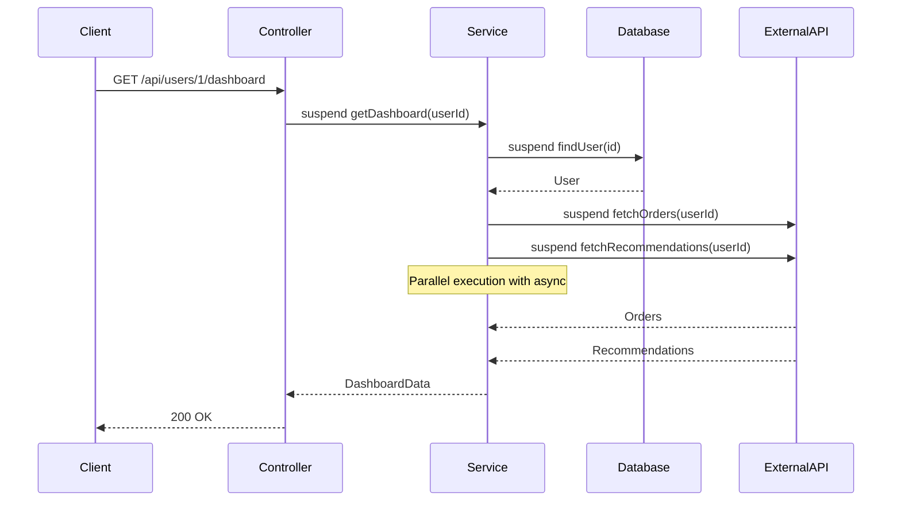
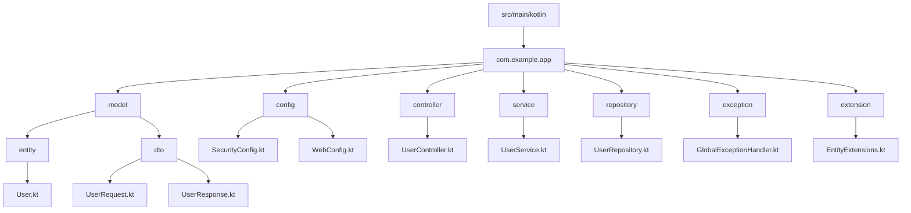

# How to Implement Spring Boot with Kotlin

Author: [nawazdhandala](https://www.github.com/nawazdhandala)

Tags: Kotlin, Spring Boot, Backend, Java, Microservices, WebFlux, Coroutines

Description: A practical guide to building Spring Boot applications with Kotlin, covering data classes, null safety, extension functions, coroutines, and testing with MockK.

---

Kotlin has become a first-class citizen in the Spring ecosystem, and for good reason. The language's concise syntax, null safety, and coroutine support make it a natural fit for building robust backend services. If you're coming from Java, you'll find that Kotlin eliminates a lot of boilerplate while keeping full interoperability with existing Spring libraries.

This guide walks through setting up a Spring Boot project with Kotlin, building real features, and testing them properly.

## Project Setup

Start with Spring Initializr or add the required dependencies manually. The key is configuring the Kotlin compiler plugin for Spring.

```kotlin
// build.gradle.kts
plugins {
    id("org.springframework.boot") version "3.2.2"
    id("io.spring.dependency-management") version "1.1.4"
    kotlin("jvm") version "1.9.22"
    kotlin("plugin.spring") version "1.9.22"  // Opens classes for Spring proxies
    kotlin("plugin.jpa") version "1.9.22"     // Generates no-arg constructors for JPA
}

dependencies {
    implementation("org.springframework.boot:spring-boot-starter-web")
    implementation("org.springframework.boot:spring-boot-starter-data-jpa")
    implementation("org.springframework.boot:spring-boot-starter-validation")
    implementation("com.fasterxml.jackson.module:jackson-module-kotlin")
    implementation("org.jetbrains.kotlin:kotlin-reflect")

    // For reactive applications
    implementation("org.springframework.boot:spring-boot-starter-webflux")
    implementation("org.jetbrains.kotlinx:kotlinx-coroutines-reactor")

    runtimeOnly("org.postgresql:postgresql")

    testImplementation("org.springframework.boot:spring-boot-starter-test")
    testImplementation("io.mockk:mockk:1.13.9")
    testImplementation("com.ninja-squad:springmockk:4.0.2")
}
```

The `plugin.spring` is essential - it makes Kotlin classes open by default for Spring's proxy-based AOP. Without it, you'll hit runtime errors when Spring tries to subclass your components.

## Data Classes for Entities

Kotlin data classes are perfect for DTOs, but JPA entities need some adjustments. JPA requires a no-arg constructor and mutable properties for lazy loading to work correctly.

```kotlin
// Entity with JPA requirements
@Entity
@Table(name = "users")
class User(
    @Id
    @GeneratedValue(strategy = GenerationType.IDENTITY)
    val id: Long = 0,

    @Column(nullable = false, unique = true)
    var email: String,

    @Column(nullable = false)
    var name: String,

    @Column(name = "created_at")
    val createdAt: Instant = Instant.now(),

    @OneToMany(mappedBy = "user", cascade = [CascadeType.ALL], orphanRemoval = true)
    val orders: MutableList<Order> = mutableListOf()
)
```

For DTOs and request/response objects, data classes work great and give you equals, hashCode, copy, and destructuring for free.

```kotlin
// Request DTO - immutable and concise
data class CreateUserRequest(
    @field:NotBlank(message = "Email is required")
    @field:Email(message = "Invalid email format")
    val email: String,

    @field:NotBlank(message = "Name is required")
    @field:Size(min = 2, max = 100, message = "Name must be between 2 and 100 characters")
    val name: String
)

// Response DTO with factory method
data class UserResponse(
    val id: Long,
    val email: String,
    val name: String,
    val createdAt: Instant
) {
    companion object {
        fun from(user: User) = UserResponse(
            id = user.id,
            email = user.email,
            name = user.name,
            createdAt = user.createdAt
        )
    }
}
```

## Null Safety in Spring

Kotlin's null safety is one of its biggest selling points, but Spring annotations need proper handling. The key is using nullable types where Spring might return null.

```kotlin
@Repository
interface UserRepository : JpaRepository<User, Long> {

    // Returns nullable - user might not exist
    fun findByEmail(email: String): User?

    // Returns non-null list (empty if no results)
    fun findByNameContaining(name: String): List<User>

    // Optional is redundant in Kotlin - use nullable instead
    // Don't do this: fun findById(id: Long): Optional<User>
}
```

In your service layer, leverage Kotlin's null-safe operators to keep code clean and explicit.

```kotlin
@Service
class UserService(
    private val userRepository: UserRepository
) {

    fun findById(id: Long): User {
        // Elvis operator throws if null
        return userRepository.findById(id).orElse(null)
            ?: throw UserNotFoundException("User not found with id: $id")
    }

    fun findByEmail(email: String): User? {
        // Explicitly nullable return type
        return userRepository.findByEmail(email)
    }

    fun updateUser(id: Long, request: UpdateUserRequest): User {
        val user = findById(id)

        // Safe call with let - only updates if value is present
        request.name?.let { user.name = it }
        request.email?.let { user.email = it }

        return userRepository.save(user)
    }
}
```

The compiler catches null pointer bugs at compile time. If a function can return null, you must handle it explicitly.

## Extension Functions for Clean APIs

Extension functions let you add behavior to existing classes without inheritance. They're great for adding domain-specific utilities.

```kotlin
// Extensions for cleaner entity operations
fun User.toResponse() = UserResponse.from(this)

fun List<User>.toResponse() = map { it.toResponse() }

// Extensions for validation
fun String.isValidEmail(): Boolean {
    val emailRegex = "^[A-Za-z0-9+_.-]+@[A-Za-z0-9.-]+\$".toRegex()
    return matches(emailRegex)
}

// Extensions for Spring's ResponseEntity
fun <T> T.toResponseEntity(): ResponseEntity<T> = ResponseEntity.ok(this)

fun <T> T.toCreatedResponse(location: URI): ResponseEntity<T> =
    ResponseEntity.created(location).body(this)
```

Using these extensions in your controller makes the code read naturally.

```kotlin
@RestController
@RequestMapping("/api/users")
class UserController(
    private val userService: UserService
) {

    @GetMapping("/{id}")
    fun getUser(@PathVariable id: Long): ResponseEntity<UserResponse> {
        return userService.findById(id).toResponse().toResponseEntity()
    }

    @GetMapping
    fun getAllUsers(): ResponseEntity<List<UserResponse>> {
        return userService.findAll().toResponse().toResponseEntity()
    }

    @PostMapping
    fun createUser(@Valid @RequestBody request: CreateUserRequest): ResponseEntity<UserResponse> {
        val user = userService.createUser(request)
        val location = URI.create("/api/users/${user.id}")
        return user.toResponse().toCreatedResponse(location)
    }
}
```

## Coroutines with WebFlux

When you need non-blocking I/O, Kotlin coroutines integrate beautifully with Spring WebFlux. The suspend keyword makes async code look synchronous.



Set up a reactive repository and service.

```kotlin
// Reactive repository with coroutines
interface UserReactiveRepository : CoroutineCrudRepository<User, Long> {
    suspend fun findByEmail(email: String): User?
    fun findByStatus(status: String): Flow<User>
}

@Service
class UserReactiveService(
    private val userRepository: UserReactiveRepository,
    private val orderClient: OrderClient,
    private val recommendationClient: RecommendationClient
) {

    // Suspend function - non-blocking but looks synchronous
    suspend fun findById(id: Long): User {
        return userRepository.findById(id)
            ?: throw UserNotFoundException("User not found with id: $id")
    }

    // Flow for streaming multiple results
    fun findActiveUsers(): Flow<User> {
        return userRepository.findByStatus("active")
    }

    // Parallel execution with coroutines
    suspend fun getDashboard(userId: Long): DashboardData = coroutineScope {
        val user = findById(userId)

        // Launch parallel requests
        val ordersDeferred = async { orderClient.fetchOrders(userId) }
        val recommendationsDeferred = async { recommendationClient.fetchRecommendations(userId) }

        // Await results
        DashboardData(
            user = user.toResponse(),
            orders = ordersDeferred.await(),
            recommendations = recommendationsDeferred.await()
        )
    }
}
```

The controller uses suspend functions directly.

```kotlin
@RestController
@RequestMapping("/api/users")
class UserReactiveController(
    private val userService: UserReactiveService
) {

    @GetMapping("/{id}")
    suspend fun getUser(@PathVariable id: Long): UserResponse {
        return userService.findById(id).toResponse()
    }

    @GetMapping("/{id}/dashboard")
    suspend fun getDashboard(@PathVariable id: Long): DashboardData {
        return userService.getDashboard(id)
    }

    // Return Flow for Server-Sent Events
    @GetMapping("/stream", produces = [MediaType.TEXT_EVENT_STREAM_VALUE])
    fun streamUsers(): Flow<UserResponse> {
        return userService.findActiveUsers().map { it.toResponse() }
    }
}
```

## Repository Patterns

For complex queries, combine Spring Data's query derivation with custom implementations.

```kotlin
interface UserRepository : JpaRepository<User, Long>, UserRepositoryCustom {

    // Derived query - Spring generates the SQL
    fun findByEmailAndStatus(email: String, status: String): User?

    // JPQL query
    @Query("SELECT u FROM User u WHERE u.createdAt > :since ORDER BY u.createdAt DESC")
    fun findRecentUsers(@Param("since") since: Instant): List<User>

    // Native query for performance-critical operations
    @Query(
        value = "SELECT * FROM users WHERE status = :status LIMIT :limit",
        nativeQuery = true
    )
    fun findByStatusLimited(@Param("status") status: String, @Param("limit") limit: Int): List<User>
}

// Custom implementation for complex logic
interface UserRepositoryCustom {
    fun searchUsers(criteria: UserSearchCriteria): Page<User>
}

class UserRepositoryCustomImpl(
    private val entityManager: EntityManager
) : UserRepositoryCustom {

    override fun searchUsers(criteria: UserSearchCriteria): Page<User> {
        val cb = entityManager.criteriaBuilder
        val query = cb.createQuery(User::class.java)
        val root = query.from(User::class.java)

        val predicates = mutableListOf<Predicate>()

        criteria.name?.let {
            predicates.add(cb.like(cb.lower(root.get("name")), "%${it.lowercase()}%"))
        }

        criteria.email?.let {
            predicates.add(cb.equal(root.get<String>("email"), it))
        }

        criteria.status?.let {
            predicates.add(cb.equal(root.get<String>("status"), it))
        }

        query.where(*predicates.toTypedArray())
        query.orderBy(cb.desc(root.get<Instant>("createdAt")))

        val typedQuery = entityManager.createQuery(query)
        typedQuery.firstResult = criteria.page * criteria.size
        typedQuery.maxResults = criteria.size

        val results = typedQuery.resultList
        val total = countUsers(criteria)

        return PageImpl(results, PageRequest.of(criteria.page, criteria.size), total)
    }

    private fun countUsers(criteria: UserSearchCriteria): Long {
        // Count query implementation
        // ...
    }
}
```

## Testing with MockK

MockK is the idiomatic mocking library for Kotlin. It handles final classes, extension functions, and coroutines naturally.

```kotlin
@ExtendWith(MockKExtension::class)
class UserServiceTest {

    @MockK
    private lateinit var userRepository: UserRepository

    @InjectMockKs
    private lateinit var userService: UserService

    @BeforeEach
    fun setup() {
        // Clear mocks before each test
        clearAllMocks()
    }

    @Test
    fun `findById returns user when exists`() {
        // Given
        val user = User(id = 1, email = "test@example.com", name = "Test User")
        every { userRepository.findById(1) } returns Optional.of(user)

        // When
        val result = userService.findById(1)

        // Then
        assertThat(result.email).isEqualTo("test@example.com")
        verify(exactly = 1) { userRepository.findById(1) }
    }

    @Test
    fun `findById throws exception when user not found`() {
        // Given
        every { userRepository.findById(999) } returns Optional.empty()

        // When/Then
        assertThrows<UserNotFoundException> {
            userService.findById(999)
        }
    }

    @Test
    fun `createUser saves and returns user`() {
        // Given
        val request = CreateUserRequest(email = "new@example.com", name = "New User")
        val savedUser = User(id = 1, email = "new@example.com", name = "New User")

        every { userRepository.findByEmail("new@example.com") } returns null
        every { userRepository.save(any()) } returns savedUser

        // When
        val result = userService.createUser(request)

        // Then
        assertThat(result.id).isEqualTo(1)
        assertThat(result.email).isEqualTo("new@example.com")

        verify { userRepository.findByEmail("new@example.com") }
        verify { userRepository.save(match { it.email == "new@example.com" }) }
    }
}
```

For testing coroutines, use `runTest` and MockK's coEvery/coVerify functions.

```kotlin
@ExtendWith(MockKExtension::class)
class UserReactiveServiceTest {

    @MockK
    private lateinit var userRepository: UserReactiveRepository

    @MockK
    private lateinit var orderClient: OrderClient

    @MockK
    private lateinit var recommendationClient: RecommendationClient

    @InjectMockKs
    private lateinit var userService: UserReactiveService

    @Test
    fun `getDashboard fetches data in parallel`() = runTest {
        // Given
        val user = User(id = 1, email = "test@example.com", name = "Test")
        val orders = listOf(Order(id = 1, userId = 1, total = 100.0))
        val recommendations = listOf(Recommendation(id = 1, productId = 42))

        coEvery { userRepository.findById(1) } returns user
        coEvery { orderClient.fetchOrders(1) } returns orders
        coEvery { recommendationClient.fetchRecommendations(1) } returns recommendations

        // When
        val dashboard = userService.getDashboard(1)

        // Then
        assertThat(dashboard.user.id).isEqualTo(1)
        assertThat(dashboard.orders).hasSize(1)
        assertThat(dashboard.recommendations).hasSize(1)

        coVerify { userRepository.findById(1) }
        coVerify { orderClient.fetchOrders(1) }
        coVerify { recommendationClient.fetchRecommendations(1) }
    }

    @Test
    fun `findActiveUsers returns flow of users`() = runTest {
        // Given
        val users = listOf(
            User(id = 1, email = "a@test.com", name = "A"),
            User(id = 2, email = "b@test.com", name = "B")
        )
        every { userRepository.findByStatus("active") } returns users.asFlow()

        // When
        val results = userService.findActiveUsers().toList()

        // Then
        assertThat(results).hasSize(2)
    }
}
```

For integration tests, use Spring's test slices with MockK.

```kotlin
@WebMvcTest(UserController::class)
class UserControllerTest {

    @Autowired
    private lateinit var mockMvc: MockMvc

    @MockkBean
    private lateinit var userService: UserService

    @Test
    fun `GET user by id returns user response`() {
        // Given
        val user = User(id = 1, email = "test@example.com", name = "Test User")
        every { userService.findById(1) } returns user

        // When/Then
        mockMvc.perform(get("/api/users/1"))
            .andExpect(status().isOk)
            .andExpect(jsonPath("$.id").value(1))
            .andExpect(jsonPath("$.email").value("test@example.com"))
    }

    @Test
    fun `POST creates user and returns 201`() {
        // Given
        val request = CreateUserRequest(email = "new@example.com", name = "New User")
        val savedUser = User(id = 1, email = "new@example.com", name = "New User")
        every { userService.createUser(any()) } returns savedUser

        // When/Then
        mockMvc.perform(
            post("/api/users")
                .contentType(MediaType.APPLICATION_JSON)
                .content("""{"email": "new@example.com", "name": "New User"}""")
        )
            .andExpect(status().isCreated)
            .andExpect(header().string("Location", "/api/users/1"))
            .andExpect(jsonPath("$.id").value(1))
    }

    @Test
    fun `POST with invalid email returns 400`() {
        mockMvc.perform(
            post("/api/users")
                .contentType(MediaType.APPLICATION_JSON)
                .content("""{"email": "invalid-email", "name": "Test"}""")
        )
            .andExpect(status().isBadRequest)
    }
}
```

## Project Structure

A well-organized Kotlin Spring Boot project typically follows this layout:



## Summary

| Feature | Kotlin Approach |
|---------|-----------------|
| **Entities** | Regular classes with JPA annotations, use `plugin.jpa` |
| **DTOs** | Data classes with validation annotations |
| **Null safety** | Nullable types, Elvis operator, safe calls |
| **Utilities** | Extension functions on domain types |
| **Async** | Coroutines with suspend functions and Flow |
| **Testing** | MockK with coEvery/coVerify for coroutines |

Kotlin brings modern language features to Spring Boot without sacrificing the maturity and ecosystem of the JVM. The null safety alone prevents entire categories of bugs, and coroutines make async code readable. Once you've built a service with Kotlin and Spring Boot, going back to verbose Java feels like a step backward.
