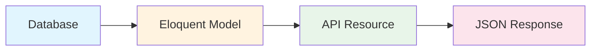
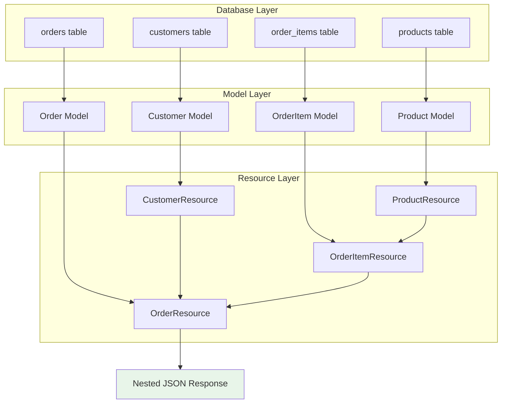
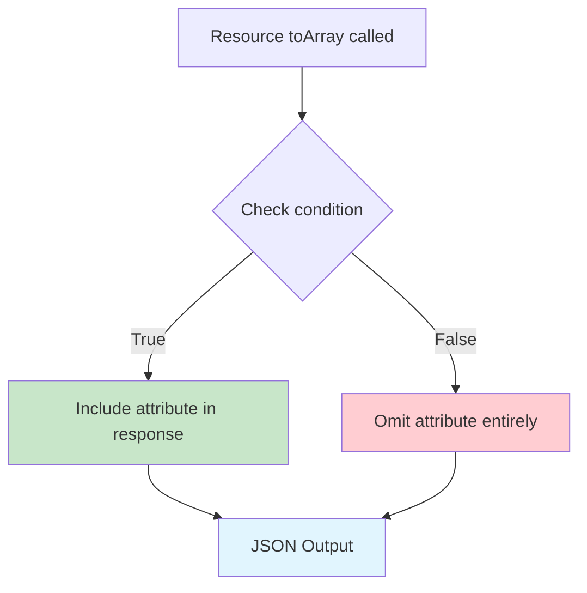
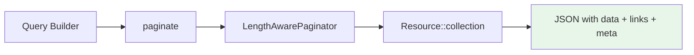

# How to Build APIs with Laravel Resources

Author: [nawazdhandala](https://www.github.com/nawazdhandala)

Tags: PHP, Laravel, API, Resources, REST

Description: Learn how to build clean APIs with Laravel Resources. This guide covers resource classes, collections, conditional attributes, and response customization.

---

> Your API is your product's handshake with the outside world. Laravel Resources let you craft that handshake with precision - controlling exactly what data gets exposed and how it's formatted.

Building APIs in Laravel requires transforming your Eloquent models into JSON responses that clients can consume. Laravel Resources provide an elegant transformation layer that sits between your models and the JSON responses, giving you full control over how your data is structured and presented.

Here's how the data flows through the transformation layer:



---

## What Are Laravel Resources?

Laravel Resources are transformation classes that convert your models and collections into JSON-serializable arrays. They act as a presentation layer, decoupling your database schema from your API output. This separation lets you:

- **Control exactly what data is exposed** to API consumers
- **Format data consistently** across all endpoints
- **Handle relationships** in a structured, efficient manner
- **Add computed fields** that do not exist in your database
- **Version your API responses** without touching your models

---

## Creating Your First Resource

Generate a resource using Artisan:

```bash
php artisan make:resource UserResource
```

This creates a new file at `app/Http/Resources/UserResource.php`:

```php
<?php

namespace App\Http\Resources;

use Illuminate\Http\Request;
use Illuminate\Http\Resources\Json\JsonResource;

class UserResource extends JsonResource
{
    /**
     * Transform the resource into an array.
     *
     * @return array<string, mixed>
     */
    public function toArray(Request $request): array
    {
        return [
            'id' => $this->id,
            'name' => $this->name,
            'email' => $this->email,
            'created_at' => $this->created_at->toISOString(),
            'updated_at' => $this->updated_at->toISOString(),
        ];
    }
}
```

Use the resource in your controller:

```php
<?php

namespace App\Http\Controllers;

use App\Http\Resources\UserResource;
use App\Models\User;

class UserController extends Controller
{
    public function show(User $user): UserResource
    {
        return new UserResource($user);
    }
}
```

The JSON response:

```json
{
    "data": {
        "id": 1,
        "name": "John Doe",
        "email": "john@example.com",
        "created_at": "2026-02-03T10:30:00.000Z",
        "updated_at": "2026-02-03T10:30:00.000Z"
    }
}
```

---

## Resource Collections

When returning multiple resources, use the `collection` method:

```php
<?php

namespace App\Http\Controllers;

use App\Http\Resources\UserResource;
use App\Models\User;
use Illuminate\Http\Resources\Json\AnonymousResourceCollection;

class UserController extends Controller
{
    public function index(): AnonymousResourceCollection
    {
        $users = User::all();

        return UserResource::collection($users);
    }
}
```

For more control over collection behavior, create a dedicated resource collection:

```bash
php artisan make:resource UserCollection --collection
```

```php
<?php

namespace App\Http\Resources;

use Illuminate\Http\Request;
use Illuminate\Http\Resources\Json\ResourceCollection;

class UserCollection extends ResourceCollection
{
    /**
     * The resource that this resource collects.
     *
     * @var string
     */
    public $collects = UserResource::class;

    /**
     * Transform the resource collection into an array.
     *
     * @return array<int|string, mixed>
     */
    public function toArray(Request $request): array
    {
        return [
            'data' => $this->collection,
            'meta' => [
                'total_count' => $this->collection->count(),
                'api_version' => 'v1',
            ],
        ];
    }
}
```

Use the collection in your controller:

```php
public function index(): UserCollection
{
    return new UserCollection(User::all());
}
```

---

## Working with Relationships

### Eager Loading and Including Related Data

Load related models efficiently with eager loading:

```php
<?php

namespace App\Http\Controllers;

use App\Http\Resources\PostResource;
use App\Models\Post;
use Illuminate\Http\Resources\Json\AnonymousResourceCollection;

class PostController extends Controller
{
    public function index(): AnonymousResourceCollection
    {
        // Eager load to prevent N+1 queries
        $posts = Post::with(['author', 'comments', 'tags'])->get();

        return PostResource::collection($posts);
    }
}
```

Define the PostResource to include relationships:

```php
<?php

namespace App\Http\Resources;

use Illuminate\Http\Request;
use Illuminate\Http\Resources\Json\JsonResource;

class PostResource extends JsonResource
{
    public function toArray(Request $request): array
    {
        return [
            'id' => $this->id,
            'title' => $this->title,
            'slug' => $this->slug,
            'content' => $this->content,
            'excerpt' => $this->excerpt,
            'published_at' => $this->published_at?->toISOString(),
            'author' => new UserResource($this->whenLoaded('author')),
            'comments' => CommentResource::collection($this->whenLoaded('comments')),
            'tags' => TagResource::collection($this->whenLoaded('tags')),
            'created_at' => $this->created_at->toISOString(),
            'updated_at' => $this->updated_at->toISOString(),
        ];
    }
}
```

### The whenLoaded Method

The `whenLoaded` method prevents accessing relationships that were not eager loaded, avoiding N+1 query problems:

```php
// Only includes 'author' if it was eager loaded
'author' => new UserResource($this->whenLoaded('author')),

// If 'author' is not loaded, the key is omitted from the response
```

### Nested Relationships

Handle deeply nested relationships:

```php
<?php

namespace App\Http\Resources;

use Illuminate\Http\Request;
use Illuminate\Http\Resources\Json\JsonResource;

class OrderResource extends JsonResource
{
    public function toArray(Request $request): array
    {
        return [
            'id' => $this->id,
            'order_number' => $this->order_number,
            'status' => $this->status,
            'total' => $this->total,
            'currency' => $this->currency,
            'customer' => new CustomerResource($this->whenLoaded('customer')),
            'items' => OrderItemResource::collection($this->whenLoaded('items')),
            'shipping_address' => new AddressResource($this->whenLoaded('shippingAddress')),
            'billing_address' => new AddressResource($this->whenLoaded('billingAddress')),
            'payment' => new PaymentResource($this->whenLoaded('payment')),
            'created_at' => $this->created_at->toISOString(),
        ];
    }
}
```

```php
<?php

namespace App\Http\Resources;

use Illuminate\Http\Request;
use Illuminate\Http\Resources\Json\JsonResource;

class OrderItemResource extends JsonResource
{
    public function toArray(Request $request): array
    {
        return [
            'id' => $this->id,
            'quantity' => $this->quantity,
            'unit_price' => $this->unit_price,
            'total_price' => $this->total_price,
            'product' => new ProductResource($this->whenLoaded('product')),
        ];
    }
}
```

Eager load nested relationships in your controller:

```php
public function show(int $id): OrderResource
{
    $order = Order::with([
        'customer',
        'items.product',
        'shippingAddress',
        'billingAddress',
        'payment',
    ])->findOrFail($id);

    return new OrderResource($order);
}
```

Here's how nested resources transform hierarchical data:



---

## Conditional Attributes

### Basic Conditional Inclusion

Include fields only when certain conditions are met:

```php
<?php

namespace App\Http\Resources;

use Illuminate\Http\Request;
use Illuminate\Http\Resources\Json\JsonResource;

class UserResource extends JsonResource
{
    public function toArray(Request $request): array
    {
        return [
            'id' => $this->id,
            'name' => $this->name,
            'email' => $this->email,

            // Only include if the value is not null
            'phone' => $this->when($this->phone !== null, $this->phone),

            // Only include for verified users
            'verified_at' => $this->when(
                $this->email_verified_at !== null,
                fn() => $this->email_verified_at->toISOString()
            ),

            // Admin-only fields
            'role' => $this->when($request->user()?->isAdmin(), $this->role),
            'permissions' => $this->when(
                $request->user()?->isAdmin(),
                fn() => $this->permissions->pluck('name')
            ),
        ];
    }
}
```

### The whenHas Method

Include attributes only when they exist on the model:

```php
public function toArray(Request $request): array
{
    return [
        'id' => $this->id,
        'name' => $this->name,

        // Only include if 'statistics' attribute exists
        'statistics' => $this->whenHas('statistics'),

        // Only include if 'metrics' relationship is loaded
        'metrics' => MetricResource::collection($this->whenLoaded('metrics')),
    ];
}
```

### Merging Conditional Attributes

Merge multiple conditional attributes at once:

```php
public function toArray(Request $request): array
{
    return [
        'id' => $this->id,
        'name' => $this->name,
        'email' => $this->email,

        // Merge additional fields for authenticated users
        $this->mergeWhen($request->user() !== null, [
            'is_following' => $this->followers->contains($request->user()),
            'can_message' => $this->acceptsMessagesFrom($request->user()),
        ]),

        // Merge admin-specific fields
        $this->mergeWhen($request->user()?->isAdmin(), [
            'internal_notes' => $this->internal_notes,
            'account_status' => $this->account_status,
            'last_login_ip' => $this->last_login_ip,
            'login_attempts' => $this->login_attempts,
        ]),
    ];
}
```

The conditional attribute flow works like this:



### Conditional Relationships

Include relationships conditionally:

```php
public function toArray(Request $request): array
{
    return [
        'id' => $this->id,
        'title' => $this->title,

        // Include full comments for single post view
        'comments' => $this->when(
            $request->routeIs('posts.show'),
            fn() => CommentResource::collection($this->whenLoaded('comments'))
        ),

        // Include only comment count for list view
        'comments_count' => $this->when(
            $request->routeIs('posts.index'),
            fn() => $this->comments_count
        ),
    ];
}
```

---

## Pagination

Laravel Resources work seamlessly with pagination. When you pass a paginated query to a resource collection, Laravel automatically wraps the response with pagination metadata:



Here's how it works in practice:

```php
<?php

namespace App\Http\Controllers;

use App\Http\Resources\PostResource;
use App\Models\Post;
use Illuminate\Http\Resources\Json\AnonymousResourceCollection;

class PostController extends Controller
{
    public function index(): AnonymousResourceCollection
    {
        $posts = Post::with('author')
            ->published()
            ->orderByDesc('published_at')
            ->paginate(15);

        return PostResource::collection($posts);
    }
}
```

The response automatically includes pagination metadata:

```json
{
    "data": [
        {
            "id": 1,
            "title": "Getting Started with Laravel",
            "author": {
                "id": 1,
                "name": "John Doe"
            }
        }
    ],
    "links": {
        "first": "http://api.example.com/posts?page=1",
        "last": "http://api.example.com/posts?page=10",
        "prev": null,
        "next": "http://api.example.com/posts?page=2"
    },
    "meta": {
        "current_page": 1,
        "from": 1,
        "last_page": 10,
        "links": [
            {
                "url": null,
                "label": "&laquo; Previous",
                "active": false
            },
            {
                "url": "http://api.example.com/posts?page=1",
                "label": "1",
                "active": true
            },
            {
                "url": "http://api.example.com/posts?page=2",
                "label": "2",
                "active": false
            }
        ],
        "path": "http://api.example.com/posts",
        "per_page": 15,
        "to": 15,
        "total": 150
    }
}
```

### Custom Pagination Meta

Customize pagination information in a resource collection:

```php
<?php

namespace App\Http\Resources;

use Illuminate\Http\Request;
use Illuminate\Http\Resources\Json\ResourceCollection;

class PostCollection extends ResourceCollection
{
    public $collects = PostResource::class;

    public function toArray(Request $request): array
    {
        return [
            'data' => $this->collection,
        ];
    }

    public function paginationInformation(Request $request, array $paginated, array $default): array
    {
        return [
            'meta' => [
                'current_page' => $paginated['current_page'],
                'total_pages' => $paginated['last_page'],
                'per_page' => $paginated['per_page'],
                'total_items' => $paginated['total'],
                'has_more' => $paginated['current_page'] < $paginated['last_page'],
            ],
            'links' => [
                'self' => $paginated['path'] . '?page=' . $paginated['current_page'],
                'next' => $paginated['next_page_url'],
                'prev' => $paginated['prev_page_url'],
            ],
        ];
    }
}
```

---

## Adding Additional Metadata

### Using the additional Method

Add extra data to your response:

```php
public function show(Post $post): PostResource
{
    return (new PostResource($post))
        ->additional([
            'meta' => [
                'api_version' => 'v1',
                'generated_at' => now()->toISOString(),
            ],
        ]);
}
```

### Using the with Method

Define default additional data in your resource:

```php
<?php

namespace App\Http\Resources;

use Illuminate\Http\Request;
use Illuminate\Http\Resources\Json\JsonResource;

class PostResource extends JsonResource
{
    public function toArray(Request $request): array
    {
        return [
            'id' => $this->id,
            'title' => $this->title,
            'content' => $this->content,
        ];
    }

    public function with(Request $request): array
    {
        return [
            'meta' => [
                'api_version' => config('api.version'),
                'documentation' => config('api.docs_url'),
            ],
        ];
    }
}
```

---

## Customizing the Response

### Removing the Data Wrapper

By default, resources wrap data in a `data` key. Remove it globally in your AppServiceProvider:

```php
<?php

namespace App\Providers;

use Illuminate\Http\Resources\Json\JsonResource;
use Illuminate\Support\ServiceProvider;

class AppServiceProvider extends ServiceProvider
{
    public function boot(): void
    {
        JsonResource::withoutWrapping();
    }
}
```

Or preserve wrapping for collections while removing it for single resources:

```php
public function show(User $user): JsonResponse
{
    return response()->json(
        (new UserResource($user))->resolve()
    );
}
```

### Custom Response Headers

Add custom headers to resource responses:

```php
public function show(Post $post): PostResource
{
    return (new PostResource($post))
        ->response()
        ->header('X-Post-Id', $post->id)
        ->header('X-Cache-Control', 'max-age=3600');
}
```

### Customizing the Response in the Resource

Override the `withResponse` method:

```php
<?php

namespace App\Http\Resources;

use Illuminate\Http\JsonResponse;
use Illuminate\Http\Request;
use Illuminate\Http\Resources\Json\JsonResource;

class PostResource extends JsonResource
{
    public function toArray(Request $request): array
    {
        return [
            'id' => $this->id,
            'title' => $this->title,
            'content' => $this->content,
        ];
    }

    public function withResponse(Request $request, JsonResponse $response): void
    {
        $response->header('X-Resource-Type', 'post');

        if ($this->resource->isPublished()) {
            $response->header('Cache-Control', 'public, max-age=3600');
        }
    }
}
```

---

## Resource Parameters and Context

Pass additional parameters to resources for context-aware transformations:

```php
<?php

namespace App\Http\Resources;

use Illuminate\Http\Request;
use Illuminate\Http\Resources\Json\JsonResource;

class ProductResource extends JsonResource
{
    private bool $includeInventory = false;
    private ?string $priceRegion = null;

    public function includeInventory(bool $include = true): self
    {
        $this->includeInventory = $include;
        return $this;
    }

    public function forRegion(string $region): self
    {
        $this->priceRegion = $region;
        return $this;
    }

    public function toArray(Request $request): array
    {
        $data = [
            'id' => $this->id,
            'name' => $this->name,
            'description' => $this->description,
            'sku' => $this->sku,
            'price' => $this->getPriceForRegion($this->priceRegion),
            'currency' => $this->getCurrencyForRegion($this->priceRegion),
            'images' => ImageResource::collection($this->whenLoaded('images')),
        ];

        if ($this->includeInventory) {
            $data['inventory'] = [
                'in_stock' => $this->in_stock,
                'quantity' => $this->quantity,
                'reserved' => $this->reserved_quantity,
                'available' => $this->quantity - $this->reserved_quantity,
            ];
        }

        return $data;
    }
}
```

Use the parameterized resource:

```php
public function show(Product $product): ProductResource
{
    $product->load('images');

    return (new ProductResource($product))
        ->includeInventory(auth()->user()?->isAdmin())
        ->forRegion(request()->header('X-Region', 'US'));
}
```

---

## Resource Collections with Custom Logic

Create collections that perform aggregations:

```php
<?php

namespace App\Http\Resources;

use Illuminate\Http\Request;
use Illuminate\Http\Resources\Json\ResourceCollection;

class OrderCollection extends ResourceCollection
{
    public $collects = OrderResource::class;

    public function toArray(Request $request): array
    {
        return [
            'data' => $this->collection,
        ];
    }

    public function with(Request $request): array
    {
        return [
            'summary' => [
                'total_orders' => $this->collection->count(),
                'total_revenue' => $this->collection->sum('total'),
                'average_order_value' => $this->collection->avg('total'),
                'orders_by_status' => $this->collection
                    ->groupBy('status')
                    ->map(fn($group) => $group->count()),
            ],
        ];
    }
}
```

---

## Handling Computed and Virtual Attributes

Add computed fields that do not exist in your database:

```php
<?php

namespace App\Http\Resources;

use Illuminate\Http\Request;
use Illuminate\Http\Resources\Json\JsonResource;

class UserResource extends JsonResource
{
    public function toArray(Request $request): array
    {
        return [
            'id' => $this->id,
            'name' => $this->name,
            'email' => $this->email,

            // Computed fields
            'full_name' => "{$this->first_name} {$this->last_name}",
            'initials' => $this->getInitials(),
            'avatar_url' => $this->avatar_path
                ? asset("storage/{$this->avatar_path}")
                : $this->getGravatarUrl(),
            'member_since' => $this->created_at->diffForHumans(),
            'account_age_days' => $this->created_at->diffInDays(now()),

            // Status indicators
            'is_verified' => $this->email_verified_at !== null,
            'is_active' => $this->last_seen_at?->isAfter(now()->subMinutes(5)),
            'has_two_factor' => $this->two_factor_secret !== null,

            // Aggregated data
            'posts_count' => $this->whenCounted('posts'),
            'followers_count' => $this->whenCounted('followers'),
            'following_count' => $this->whenCounted('following'),
        ];
    }

    private function getInitials(): string
    {
        $words = explode(' ', $this->name);
        $initials = array_map(fn($word) => strtoupper($word[0] ?? ''), $words);
        return implode('', array_slice($initials, 0, 2));
    }

    private function getGravatarUrl(): string
    {
        $hash = md5(strtolower(trim($this->email)));
        return "https://www.gravatar.com/avatar/{$hash}?d=mp";
    }
}
```

---

## Sparse Fieldsets

Allow clients to request specific fields:

```php
<?php

namespace App\Http\Resources;

use Illuminate\Http\Request;
use Illuminate\Http\Resources\Json\JsonResource;

class ArticleResource extends JsonResource
{
    public function toArray(Request $request): array
    {
        $fields = $this->parseRequestedFields($request);

        $allFields = [
            'id' => $this->id,
            'title' => $this->title,
            'slug' => $this->slug,
            'content' => $this->content,
            'excerpt' => $this->excerpt,
            'author' => new UserResource($this->whenLoaded('author')),
            'category' => new CategoryResource($this->whenLoaded('category')),
            'tags' => TagResource::collection($this->whenLoaded('tags')),
            'published_at' => $this->published_at?->toISOString(),
            'created_at' => $this->created_at->toISOString(),
            'updated_at' => $this->updated_at->toISOString(),
        ];

        if (empty($fields)) {
            return $allFields;
        }

        return array_intersect_key($allFields, array_flip($fields));
    }

    private function parseRequestedFields(Request $request): array
    {
        $fieldsParam = $request->query('fields.articles', '');

        if (empty($fieldsParam)) {
            return [];
        }

        return array_map('trim', explode(',', $fieldsParam));
    }
}
```

Usage:

```
GET /api/articles?fields[articles]=id,title,author
```

---

## Error Handling in Resources

Handle missing or null data gracefully:

```php
<?php

namespace App\Http\Resources;

use Illuminate\Http\Request;
use Illuminate\Http\Resources\Json\JsonResource;

class ProfileResource extends JsonResource
{
    public function toArray(Request $request): array
    {
        return [
            'id' => $this->id,
            'user' => new UserResource($this->whenLoaded('user')),

            // Handle potentially null nested properties safely
            'location' => [
                'city' => $this->address?->city,
                'country' => $this->address?->country,
                'timezone' => $this->address?->timezone ?? 'UTC',
            ],

            // Provide defaults for missing data
            'preferences' => [
                'theme' => $this->preferences['theme'] ?? 'light',
                'language' => $this->preferences['language'] ?? 'en',
                'notifications' => $this->preferences['notifications'] ?? true,
            ],

            // Handle relationships that might not exist
            'organization' => $this->when(
                $this->relationLoaded('organization') && $this->organization !== null,
                fn() => new OrganizationResource($this->organization)
            ),
        ];
    }
}
```

---

## Testing Resources

Write tests to ensure your resources output the expected structure:

```php
<?php

namespace Tests\Unit\Resources;

use App\Http\Resources\UserResource;
use App\Models\User;
use Illuminate\Foundation\Testing\RefreshDatabase;
use Tests\TestCase;

class UserResourceTest extends TestCase
{
    use RefreshDatabase;

    public function test_user_resource_returns_correct_structure(): void
    {
        $user = User::factory()->create([
            'name' => 'John Doe',
            'email' => 'john@example.com',
        ]);

        $resource = new UserResource($user);
        $response = $resource->toArray(request());

        $this->assertArrayHasKey('id', $response);
        $this->assertArrayHasKey('name', $response);
        $this->assertArrayHasKey('email', $response);
        $this->assertEquals('John Doe', $response['name']);
        $this->assertEquals('john@example.com', $response['email']);
    }

    public function test_user_resource_hides_sensitive_fields(): void
    {
        $user = User::factory()->create([
            'password' => 'secret',
            'remember_token' => 'token123',
        ]);

        $resource = new UserResource($user);
        $response = $resource->toArray(request());

        $this->assertArrayNotHasKey('password', $response);
        $this->assertArrayNotHasKey('remember_token', $response);
    }

    public function test_user_resource_includes_posts_when_loaded(): void
    {
        $user = User::factory()
            ->has(\App\Models\Post::factory()->count(3))
            ->create();

        $user->load('posts');

        $resource = new UserResource($user);
        $response = $resource->toArray(request());

        $this->assertArrayHasKey('posts', $response);
        $this->assertCount(3, $response['posts']);
    }

    public function test_user_resource_excludes_posts_when_not_loaded(): void
    {
        $user = User::factory()->create();

        $resource = new UserResource($user);
        $response = $resource->toArray(request());

        $this->assertArrayNotHasKey('posts', $response);
    }
}
```

---

## Complete Example: E-commerce API

Here is a complete example showing how resources work together:

### Models

```php
// app/Models/Product.php
class Product extends Model
{
    protected $fillable = ['name', 'slug', 'description', 'price', 'category_id'];

    public function category(): BelongsTo
    {
        return $this->belongsTo(Category::class);
    }

    public function reviews(): HasMany
    {
        return $this->hasMany(Review::class);
    }

    public function images(): HasMany
    {
        return $this->hasMany(ProductImage::class);
    }
}
```

### Resources

```php
<?php

namespace App\Http\Resources;

use Illuminate\Http\Request;
use Illuminate\Http\Resources\Json\JsonResource;

class ProductResource extends JsonResource
{
    public function toArray(Request $request): array
    {
        return [
            'id' => $this->id,
            'name' => $this->name,
            'slug' => $this->slug,
            'description' => $this->description,
            'price' => [
                'amount' => $this->price,
                'formatted' => '$' . number_format($this->price / 100, 2),
                'currency' => 'USD',
            ],
            'category' => new CategoryResource($this->whenLoaded('category')),
            'images' => ProductImageResource::collection($this->whenLoaded('images')),
            'reviews' => ReviewResource::collection($this->whenLoaded('reviews')),
            'rating' => [
                'average' => $this->whenCounted('reviews',
                    fn() => round($this->reviews_avg_rating, 1)),
                'count' => $this->whenCounted('reviews'),
            ],
            'in_stock' => $this->quantity > 0,
            'created_at' => $this->created_at->toISOString(),
            'updated_at' => $this->updated_at->toISOString(),
            'links' => [
                'self' => route('api.products.show', $this->slug),
                'category' => $this->when(
                    $this->category_id,
                    fn() => route('api.categories.show', $this->category_id)
                ),
            ],
        ];
    }
}
```

```php
<?php

namespace App\Http\Resources;

use Illuminate\Http\Request;
use Illuminate\Http\Resources\Json\ResourceCollection;

class ProductCollection extends ResourceCollection
{
    public $collects = ProductResource::class;

    public function toArray(Request $request): array
    {
        return [
            'data' => $this->collection,
        ];
    }

    public function with(Request $request): array
    {
        return [
            'meta' => [
                'filters_applied' => $this->getAppliedFilters($request),
            ],
        ];
    }

    private function getAppliedFilters(Request $request): array
    {
        $filters = [];

        if ($request->filled('category')) {
            $filters['category'] = $request->query('category');
        }

        if ($request->filled('min_price')) {
            $filters['min_price'] = (int) $request->query('min_price');
        }

        if ($request->filled('max_price')) {
            $filters['max_price'] = (int) $request->query('max_price');
        }

        return $filters;
    }
}
```

### Controller

```php
<?php

namespace App\Http\Controllers\Api;

use App\Http\Controllers\Controller;
use App\Http\Resources\ProductCollection;
use App\Http\Resources\ProductResource;
use App\Models\Product;
use Illuminate\Http\Request;

class ProductController extends Controller
{
    public function index(Request $request): ProductCollection
    {
        $products = Product::query()
            ->with(['category', 'images'])
            ->withCount('reviews')
            ->withAvg('reviews', 'rating')
            ->when($request->filled('category'), function ($query) use ($request) {
                $query->where('category_id', $request->query('category'));
            })
            ->when($request->filled('min_price'), function ($query) use ($request) {
                $query->where('price', '>=', $request->query('min_price'));
            })
            ->when($request->filled('max_price'), function ($query) use ($request) {
                $query->where('price', '<=', $request->query('max_price'));
            })
            ->when($request->filled('search'), function ($query) use ($request) {
                $query->where('name', 'like', '%' . $request->query('search') . '%');
            })
            ->orderBy($request->query('sort', 'created_at'), $request->query('order', 'desc'))
            ->paginate($request->query('per_page', 15));

        return new ProductCollection($products);
    }

    public function show(string $slug): ProductResource
    {
        $product = Product::query()
            ->with(['category', 'images', 'reviews.user'])
            ->withCount('reviews')
            ->withAvg('reviews', 'rating')
            ->where('slug', $slug)
            ->firstOrFail();

        return new ProductResource($product);
    }
}
```

---

## Best Practices

1. **Always use eager loading** with `whenLoaded` to prevent N+1 queries
2. **Keep resources focused** on presentation logic, not business logic
3. **Use conditional attributes** to avoid leaking sensitive data
4. **Create dedicated collection classes** when you need custom meta information
5. **Test your resources** to ensure API contracts remain stable
6. **Version your resources** when making breaking changes
7. **Document expected response structures** for API consumers

---

## Monitoring Your Laravel API

Building clean APIs is only half the battle. You also need visibility into how those APIs perform in production. Response times, error rates, and throughput metrics help you catch issues before users report them.

OneUptime provides comprehensive API monitoring that tracks endpoint performance, alerts on anomalies, and correlates slow requests with infrastructure metrics. With synthetic monitoring, you can continuously test your API endpoints from multiple locations and get notified when response times degrade or endpoints become unreachable.

Pair your well-structured Laravel Resources with proper observability to deliver reliable APIs that scale. Start monitoring your API endpoints today at [oneuptime.com](https://oneuptime.com).
