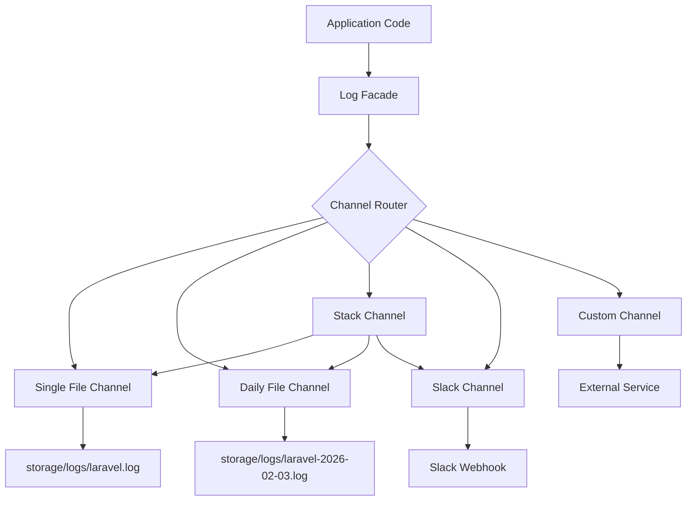
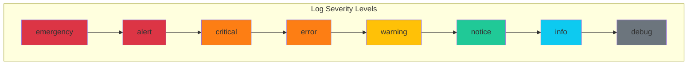

# How to Configure Laravel Logging

Author: [nawazdhandala](https://www.github.com/nawazdhandala)

Tags: Laravel, PHP, Logging, Monolog, Observability, Application Monitoring, Debugging

Description: A complete guide to configuring Laravel logging - covering channels, log levels, custom channels, stack channels, daily logs, contextual logging, Monolog handlers, and integration with external services.

---

> Your logs are only as useful as your logging configuration. Laravel provides a powerful and flexible logging system built on top of Monolog, giving you everything from simple file logging to sophisticated multi-channel setups that can route different log types to different destinations.

Understanding how to properly configure Laravel's logging system is essential for debugging issues in development and monitoring your application in production. This guide walks through everything you need to know about Laravel logging, from basic setup to advanced customization.

---

## Laravel's Logging Architecture

Laravel's logging system is channel-based, meaning you can configure multiple "channels" that handle logs differently. Each channel can write to files, databases, Slack, external services, or any custom destination you define.

Here's how the logging flow works in Laravel:



---

## Basic Logging Configuration

Laravel's logging configuration lives in `config/logging.php`. The default configuration includes several pre-configured channels that cover most common use cases.

This is the core logging configuration file. The `default` key determines which channel handles logs when you don't specify one explicitly. The `channels` array defines all available logging destinations.

```php
<?php

// config/logging.php
// Main logging configuration file for Laravel applications

return [
    // Default channel used when no specific channel is requested
    // Change this to 'stack' for production to use multiple channels
    'default' => env('LOG_CHANNEL', 'stack'),

    // Deprecations channel for PHP deprecation warnings
    // Useful for tracking deprecated feature usage before upgrades
    'deprecations' => [
        'channel' => env('LOG_DEPRECATIONS_CHANNEL', 'null'),
        'trace' => false,
    ],

    // Channel definitions - each channel is a logging destination
    'channels' => [
        // Stack channel combines multiple channels into one
        // Logs are sent to all channels in the array
        'stack' => [
            'driver' => 'stack',
            'channels' => ['single', 'slack'],  // Send to both file and Slack
            'ignore_exceptions' => false,        // Fail if any channel fails
        ],

        // Single file channel - all logs go to one file
        // Simple but can grow large in high-traffic apps
        'single' => [
            'driver' => 'single',
            'path' => storage_path('logs/laravel.log'),
            'level' => env('LOG_LEVEL', 'debug'),
            'replace_placeholders' => true,  // Replace {context} placeholders
        ],

        // Daily rotating files - new file each day
        // Prevents single file from growing too large
        'daily' => [
            'driver' => 'daily',
            'path' => storage_path('logs/laravel.log'),
            'level' => env('LOG_LEVEL', 'debug'),
            'days' => 14,  // Keep 14 days of logs, delete older
            'replace_placeholders' => true,
        ],

        // Slack integration for real-time alerts
        // Great for error notifications to team channels
        'slack' => [
            'driver' => 'slack',
            'url' => env('LOG_SLACK_WEBHOOK_URL'),
            'username' => 'Laravel Log',
            'emoji' => ':boom:',
            'level' => env('LOG_LEVEL', 'critical'),  // Only critical errors
        ],

        // Papertrail cloud logging service
        // Centralized logging for distributed systems
        'papertrail' => [
            'driver' => 'monolog',
            'level' => env('LOG_LEVEL', 'debug'),
            'handler' => env('LOG_PAPERTRAIL_HANDLER', SyslogUdpHandler::class),
            'handler_with' => [
                'host' => env('PAPERTRAIL_URL'),
                'port' => env('PAPERTRAIL_PORT'),
                'connectionString' => 'tls://' . env('PAPERTRAIL_URL') . ':' . env('PAPERTRAIL_PORT'),
            ],
        ],

        // Standard error output - useful for Docker/Kubernetes
        // Container orchestrators capture stderr automatically
        'stderr' => [
            'driver' => 'monolog',
            'level' => env('LOG_LEVEL', 'debug'),
            'handler' => StreamHandler::class,
            'formatter' => env('LOG_STDERR_FORMATTER'),
            'with' => [
                'stream' => 'php://stderr',
            ],
        ],

        // Syslog integration for system-level logging
        // Integrates with system log aggregation tools
        'syslog' => [
            'driver' => 'syslog',
            'level' => env('LOG_LEVEL', 'debug'),
            'facility' => LOG_USER,
            'replace_placeholders' => true,
        ],

        // Error log - writes to PHP's error_log
        // Uses whatever PHP is configured to use
        'errorlog' => [
            'driver' => 'errorlog',
            'level' => env('LOG_LEVEL', 'debug'),
            'replace_placeholders' => true,
        ],

        // Null channel - discards all logs
        // Useful for testing or disabling specific log types
        'null' => [
            'driver' => 'monolog',
            'handler' => NullHandler::class,
        ],

        // Emergency channel - fallback when other channels fail
        // Always writes to a simple file
        'emergency' => [
            'path' => storage_path('logs/laravel.log'),
        ],
    ],
];
```

---

## Understanding Log Levels

Laravel supports eight log levels defined by the PSR-3 standard. Using the right level for each message is crucial for filtering and alerting.



Here's a practical guide to when each level should be used in your application code.

```php
<?php

use Illuminate\Support\Facades\Log;

// EMERGENCY: System is unusable - entire application is down
// Example: Database server unreachable, memory exhausted
Log::emergency('Application cannot start - database connection failed');

// ALERT: Action must be taken immediately
// Example: Entire payment system down, data corruption detected
Log::alert('Payment gateway returning errors for all transactions');

// CRITICAL: Critical conditions that need immediate attention
// Example: Unexpected exception that affects core functionality
Log::critical('User authentication service unavailable', [
    'service' => 'auth-service',
    'last_response' => $response,
]);

// ERROR: Runtime errors that don't require immediate action
// Example: Failed API call, missing required parameter
Log::error('Failed to send notification email', [
    'user_id' => $user->id,
    'email' => $user->email,
    'error' => $exception->getMessage(),
]);

// WARNING: Exceptional occurrences that aren't errors
// Example: Deprecated API usage, cache miss, retry succeeded
Log::warning('Rate limit threshold approaching', [
    'current_rate' => $currentRate,
    'limit' => $rateLimit,
    'window' => '60 seconds',
]);

// NOTICE: Normal but significant events
// Example: User login, configuration change, cache cleared
Log::notice('User password changed', [
    'user_id' => $user->id,
    'changed_by' => auth()->id(),
]);

// INFO: Interesting events for monitoring
// Example: User registered, order placed, job completed
Log::info('Order placed successfully', [
    'order_id' => $order->id,
    'total' => $order->total,
    'items_count' => $order->items->count(),
]);

// DEBUG: Detailed information for debugging
// Example: Variable values, SQL queries, execution flow
Log::debug('Processing payment request', [
    'payment_method' => $method,
    'amount' => $amount,
    'currency' => $currency,
    'gateway_response' => $response,
]);
```

---

## Channel Types Deep Dive

### Single Channel

The single channel writes all logs to one file. It's simple to set up but the file can grow large over time.

```php
<?php

// config/logging.php - Single channel configuration
'single' => [
    'driver' => 'single',
    'path' => storage_path('logs/laravel.log'),  // Output file path
    'level' => env('LOG_LEVEL', 'debug'),         // Minimum level to log
    'replace_placeholders' => true,               // Replace {foo} with context values
    'permission' => 0664,                         // Unix file permissions
    'locking' => false,                           // File locking for concurrent writes
],
```

### Daily Channel

The daily channel creates a new log file each day and automatically removes old files. This is the recommended option for most production applications.

```php
<?php

// config/logging.php - Daily channel with rotation
'daily' => [
    'driver' => 'daily',
    'path' => storage_path('logs/laravel.log'),  // Base filename
    'level' => env('LOG_LEVEL', 'debug'),
    'days' => 14,                                 // Keep logs for 14 days
    'replace_placeholders' => true,
    'permission' => 0664,
],

// This creates files like:
// storage/logs/laravel-2026-02-01.log
// storage/logs/laravel-2026-02-02.log
// storage/logs/laravel-2026-02-03.log
```

### Stack Channel

The stack channel is a meta-channel that sends logs to multiple destinations simultaneously. Use it to log to files locally while also sending alerts to Slack.

```php
<?php

// config/logging.php - Stack channel configuration
'stack' => [
    'driver' => 'stack',
    'channels' => ['daily', 'slack'],  // Send to both channels
    'ignore_exceptions' => false,       // Set true to continue if one channel fails
],

// You can also define multiple stacks for different purposes
'production' => [
    'driver' => 'stack',
    'channels' => ['daily', 'slack', 'papertrail'],
],

'development' => [
    'driver' => 'stack',
    'channels' => ['single', 'stderr'],
],
```

### Slack Channel

The Slack channel sends log messages to a Slack webhook. It's perfect for alerting your team about critical errors in real-time.

```php
<?php

// config/logging.php - Slack channel for team alerts
'slack' => [
    'driver' => 'slack',
    'url' => env('LOG_SLACK_WEBHOOK_URL'),  // Slack incoming webhook URL
    'username' => 'Laravel Logger',          // Bot username in Slack
    'emoji' => ':warning:',                  // Bot emoji
    'level' => 'error',                      // Only send errors and above
    'channel' => '#alerts',                  // Slack channel (optional)
],

// Usage in application code
Log::channel('slack')->error('Payment failed', [
    'order_id' => $order->id,
    'error' => $exception->getMessage(),
]);
```

---

## Creating Custom Channels

When built-in channels don't fit your needs, you can create custom channels using Monolog handlers directly.

### Custom File Channel with JSON Formatting

JSON formatted logs are easier to parse by log aggregation tools and enable structured queries.

```php
<?php

// config/logging.php - Custom JSON channel
use Monolog\Handler\StreamHandler;
use Monolog\Formatter\JsonFormatter;

'json' => [
    'driver' => 'monolog',
    'handler' => StreamHandler::class,
    'with' => [
        'stream' => storage_path('logs/json.log'),
        'level' => Monolog\Level::Debug,
    ],
    'formatter' => JsonFormatter::class,
    'formatter_with' => [
        'includeStacktraces' => true,  // Include stack traces in JSON
    ],
],
```

### Custom Channel with Multiple Handlers

You can use a custom factory to configure channels with complex requirements. This factory creates a channel that writes to both a file and sends to a webhook.

```php
<?php

// app/Logging/CustomLogger.php
namespace App\Logging;

use Monolog\Logger;
use Monolog\Handler\StreamHandler;
use Monolog\Handler\RotatingFileHandler;
use Monolog\Formatter\LineFormatter;
use Monolog\Processor\WebProcessor;
use Monolog\Processor\IntrospectionProcessor;

class CustomLogger
{
    /**
     * Create a custom Monolog instance with multiple handlers
     * Laravel calls this method when the channel is used
     */
    public function __invoke(array $config): Logger
    {
        // Create the logger with the channel name
        $logger = new Logger('custom');

        // Define a clean log format
        $formatter = new LineFormatter(
            "[%datetime%] %channel%.%level_name%: %message% %context% %extra%\n",
            'Y-m-d H:i:s',  // Date format
            true,            // Allow inline line breaks
            true             // Ignore empty context and extra
        );

        // Add a rotating file handler - creates new file daily
        $fileHandler = new RotatingFileHandler(
            storage_path('logs/custom.log'),
            30,                        // Keep 30 days of logs
            Monolog\Level::Debug       // Log everything debug and above
        );
        $fileHandler->setFormatter($formatter);
        $logger->pushHandler($fileHandler);

        // Add a stream handler for errors - separate file for errors only
        $errorHandler = new StreamHandler(
            storage_path('logs/errors.log'),
            Monolog\Level::Error       // Only errors and above
        );
        $errorHandler->setFormatter($formatter);
        $logger->pushHandler($errorHandler);

        // Add processors to enrich log data
        // WebProcessor adds request URL, IP, etc.
        $logger->pushProcessor(new WebProcessor());

        // IntrospectionProcessor adds file, line, class, function
        $logger->pushProcessor(new IntrospectionProcessor(
            Monolog\Level::Debug,
            ['Illuminate\\']  // Skip Laravel framework classes
        ));

        return $logger;
    }
}
```

Register the custom channel in your configuration.

```php
<?php

// config/logging.php - Register the custom channel
'custom' => [
    'driver' => 'custom',
    'via' => App\Logging\CustomLogger::class,
],
```

---

## Contextual Logging

Laravel makes it easy to add context to your logs. Context helps you understand the circumstances around a log message when debugging.

### Adding Context to Individual Log Calls

Pass an array as the second argument to any log method to include structured data.

```php
<?php

use Illuminate\Support\Facades\Log;

// Basic context - pass an array of data
Log::info('User registered', [
    'user_id' => $user->id,
    'email' => $user->email,
    'registration_source' => 'api',
    'ip_address' => request()->ip(),
]);

// Error context with exception details
try {
    $result = $paymentGateway->charge($amount);
} catch (PaymentException $e) {
    Log::error('Payment failed', [
        'order_id' => $order->id,
        'amount' => $amount,
        'currency' => $currency,
        'gateway' => $gateway->getName(),
        'error_code' => $e->getCode(),
        'error_message' => $e->getMessage(),
        'user_id' => auth()->id(),
    ]);
}
```

### Shared Context Across Multiple Logs

When multiple log calls share the same context, use `withContext` to avoid repeating yourself.

```php
<?php

use Illuminate\Support\Facades\Log;

// Set shared context for the current request
// All subsequent logs will include this data
Log::withContext([
    'request_id' => request()->header('X-Request-ID'),
    'user_id' => auth()->id(),
    'session_id' => session()->getId(),
]);

// These logs automatically include the shared context
Log::info('Processing order');           // Includes request_id, user_id, session_id
Log::info('Validating payment details'); // Includes request_id, user_id, session_id
Log::info('Order completed');            // Includes request_id, user_id, session_id
```

### Middleware for Automatic Context

Create middleware to automatically add request context to all logs within a request lifecycle.

```php
<?php

// app/Http/Middleware/LogContextMiddleware.php
namespace App\Http\Middleware;

use Closure;
use Illuminate\Http\Request;
use Illuminate\Support\Facades\Log;
use Illuminate\Support\Str;

class LogContextMiddleware
{
    /**
     * Add request context to all logs in this request
     */
    public function handle(Request $request, Closure $next)
    {
        // Generate or extract request ID for distributed tracing
        $requestId = $request->header('X-Request-ID') ?? Str::uuid()->toString();

        // Set context that will be included in all logs
        Log::withContext([
            'request_id' => $requestId,
            'method' => $request->method(),
            'path' => $request->path(),
            'ip' => $request->ip(),
            'user_agent' => $request->userAgent(),
            'user_id' => $request->user()?->id,
        ]);

        // Add request ID to response headers for client-side correlation
        $response = $next($request);
        $response->headers->set('X-Request-ID', $requestId);

        return $response;
    }
}
```

Register the middleware in your kernel.

```php
<?php

// app/Http/Kernel.php
protected $middleware = [
    // ... other middleware
    \App\Http\Middleware\LogContextMiddleware::class,
];
```

---

## Monolog Handlers

Laravel uses Monolog under the hood, which provides dozens of handlers for different logging destinations. Here are some commonly used ones.

### RotatingFileHandler

Creates a new log file each day and removes old files automatically.

```php
<?php

// config/logging.php - Rotating file handler
use Monolog\Handler\RotatingFileHandler;

'rotating' => [
    'driver' => 'monolog',
    'handler' => RotatingFileHandler::class,
    'with' => [
        'filename' => storage_path('logs/app.log'),
        'maxFiles' => 30,                    // Keep 30 files
        'level' => Monolog\Level::Info,
    ],
],
```

### BufferHandler

Buffers logs in memory and writes them in batches. Improves performance by reducing disk I/O.

```php
<?php

// app/Logging/BufferedLogger.php
namespace App\Logging;

use Monolog\Logger;
use Monolog\Handler\StreamHandler;
use Monolog\Handler\BufferHandler;

class BufferedLogger
{
    public function __invoke(array $config): Logger
    {
        $logger = new Logger('buffered');

        // Create the base file handler
        $streamHandler = new StreamHandler(
            storage_path('logs/buffered.log'),
            Monolog\Level::Debug
        );

        // Wrap it in a buffer handler
        // Logs are held in memory until buffer fills or request ends
        $bufferHandler = new BufferHandler(
            $streamHandler,
            100,    // Buffer up to 100 log entries
            Monolog\Level::Debug,
            true,   // Flush on overflow (when buffer is full)
            true    // Flush on shutdown (end of request)
        );

        $logger->pushHandler($bufferHandler);

        return $logger;
    }
}
```

### FilterHandler

Filters logs by level before passing to another handler. Useful for sending only certain levels to specific destinations.

```php
<?php

// app/Logging/FilteredLogger.php
namespace App\Logging;

use Monolog\Logger;
use Monolog\Handler\StreamHandler;
use Monolog\Handler\FilterHandler;

class FilteredLogger
{
    public function __invoke(array $config): Logger
    {
        $logger = new Logger('filtered');

        // Handler that receives all logs
        $allLogsHandler = new StreamHandler(
            storage_path('logs/all.log'),
            Monolog\Level::Debug
        );
        $logger->pushHandler($allLogsHandler);

        // Handler that only receives warnings and errors (not critical/emergency)
        $warningsHandler = new StreamHandler(
            storage_path('logs/warnings.log'),
            Monolog\Level::Warning
        );

        // Wrap in filter to accept Warning to Error only
        $filteredHandler = new FilterHandler(
            $warningsHandler,
            Monolog\Level::Warning,  // Minimum level
            Monolog\Level::Error     // Maximum level
        );
        $logger->pushHandler($filteredHandler);

        return $logger;
    }
}
```

### RedisHandler

Publishes logs to a Redis channel for real-time log streaming or processing.

```php
<?php

// app/Logging/RedisLogger.php
namespace App\Logging;

use Monolog\Logger;
use Monolog\Handler\RedisHandler;
use Monolog\Formatter\JsonFormatter;
use Predis\Client as RedisClient;

class RedisLogger
{
    public function __invoke(array $config): Logger
    {
        $logger = new Logger('redis');

        // Create Redis connection
        $redis = new RedisClient([
            'host' => config('database.redis.default.host'),
            'port' => config('database.redis.default.port'),
            'password' => config('database.redis.default.password'),
        ]);

        // Create Redis handler that publishes to a list
        $handler = new RedisHandler(
            $redis,
            'logs:application',      // Redis key (list name)
            Monolog\Level::Debug,
            true,                    // Bubble to other handlers
            1000                     // Max list length (RPUSH + LTRIM)
        );

        // Use JSON format for structured logs
        $handler->setFormatter(new JsonFormatter());

        $logger->pushHandler($handler);

        return $logger;
    }
}
```

---

## Logging to External Services

### Logging to Elasticsearch

Send logs directly to Elasticsearch for powerful search and visualization capabilities.

```php
<?php

// app/Logging/ElasticsearchLogger.php
namespace App\Logging;

use Monolog\Logger;
use Monolog\Handler\ElasticsearchHandler;
use Monolog\Formatter\ElasticsearchFormatter;
use Elastic\Elasticsearch\ClientBuilder;

class ElasticsearchLogger
{
    public function __invoke(array $config): Logger
    {
        $logger = new Logger('elasticsearch');

        // Build Elasticsearch client
        $client = ClientBuilder::create()
            ->setHosts([config('services.elasticsearch.host')])
            ->setBasicAuthentication(
                config('services.elasticsearch.username'),
                config('services.elasticsearch.password')
            )
            ->build();

        // Create handler with index naming pattern
        $handler = new ElasticsearchHandler(
            $client,
            [
                'index' => 'laravel-logs',      // Index name
                'type' => '_doc',               // Document type
                'ignore_error' => true,         // Don't throw on ES errors
            ],
            Monolog\Level::Debug
        );

        // Use Elasticsearch formatter for proper field mapping
        $handler->setFormatter(new ElasticsearchFormatter(
            'laravel-logs',     // Index name
            '_doc'              // Document type
        ));

        $logger->pushHandler($handler);

        return $logger;
    }
}
```

### Logging with OpenTelemetry

Integrate with OpenTelemetry for distributed tracing and log correlation across services.

```php
<?php

// app/Logging/OpenTelemetryLogger.php
namespace App\Logging;

use Monolog\Logger;
use Monolog\Handler\StreamHandler;
use Monolog\Processor\ProcessorInterface;
use Monolog\LogRecord;
use OpenTelemetry\API\Trace\SpanInterface;
use OpenTelemetry\API\Trace\TracerInterface;

class OpenTelemetryProcessor implements ProcessorInterface
{
    private TracerInterface $tracer;

    public function __construct(TracerInterface $tracer)
    {
        $this->tracer = $tracer;
    }

    /**
     * Add trace context to log records for correlation
     */
    public function __invoke(LogRecord $record): LogRecord
    {
        $span = \OpenTelemetry\API\Trace\Span::getCurrent();
        $context = $span->getContext();

        // Only add trace context if span is recording
        if ($context->isValid()) {
            $record->extra['trace_id'] = $context->getTraceId();
            $record->extra['span_id'] = $context->getSpanId();
            $record->extra['trace_flags'] = $context->getTraceFlags();
        }

        return $record;
    }
}

class OpenTelemetryLogger
{
    public function __invoke(array $config): Logger
    {
        $logger = new Logger('otel');

        // Add OpenTelemetry processor for trace correlation
        $tracer = \OpenTelemetry\API\Globals::tracerProvider()
            ->getTracer('laravel-app');
        $logger->pushProcessor(new OpenTelemetryProcessor($tracer));

        // Use JSON handler for structured output
        $handler = new StreamHandler(
            storage_path('logs/otel.log'),
            Monolog\Level::Debug
        );
        $handler->setFormatter(new \Monolog\Formatter\JsonFormatter());

        $logger->pushHandler($handler);

        return $logger;
    }
}
```

### Logging to OneUptime

Send logs to OneUptime for centralized observability with automatic correlation to traces and metrics.

```php
<?php

// app/Logging/OneUptimeLogger.php
namespace App\Logging;

use Monolog\Logger;
use Monolog\Handler\AbstractProcessingHandler;
use Monolog\LogRecord;
use Illuminate\Support\Facades\Http;

class OneUptimeHandler extends AbstractProcessingHandler
{
    private string $endpoint;
    private string $token;

    public function __construct(string $endpoint, string $token, $level = Monolog\Level::Debug)
    {
        parent::__construct($level, true);
        $this->endpoint = $endpoint;
        $this->token = $token;
    }

    /**
     * Write log record to OneUptime OTLP endpoint
     */
    protected function write(LogRecord $record): void
    {
        // Format log for OTLP protocol
        $logRecord = [
            'timestamp' => $record->datetime->format('c'),
            'severityText' => $record->level->name,
            'body' => $record->message,
            'attributes' => array_merge(
                $record->context,
                $record->extra,
                [
                    'service.name' => config('app.name'),
                    'service.version' => config('app.version', '1.0.0'),
                    'deployment.environment' => config('app.env'),
                ]
            ),
        ];

        // Send asynchronously to avoid blocking
        Http::withToken($this->token)
            ->timeout(5)
            ->async()
            ->post($this->endpoint, [
                'resourceLogs' => [
                    [
                        'scopeLogs' => [
                            [
                                'logRecords' => [$logRecord],
                            ],
                        ],
                    ],
                ],
            ]);
    }
}

class OneUptimeLogger
{
    public function __invoke(array $config): Logger
    {
        $logger = new Logger('oneuptime');

        $handler = new OneUptimeHandler(
            config('services.oneuptime.endpoint'),
            config('services.oneuptime.token'),
            Monolog\Level::fromName($config['level'] ?? 'debug')
        );

        $logger->pushHandler($handler);

        return $logger;
    }
}
```

Register OneUptime in your services configuration.

```php
<?php

// config/services.php
'oneuptime' => [
    'endpoint' => env('ONEUPTIME_ENDPOINT', 'https://oneuptime.com/otlp/v1/logs'),
    'token' => env('ONEUPTIME_TOKEN'),
],

// config/logging.php
'oneuptime' => [
    'driver' => 'custom',
    'via' => App\Logging\OneUptimeLogger::class,
    'level' => env('LOG_LEVEL', 'debug'),
],
```

---

## Formatting Logs

Customize how your logs appear with Monolog formatters.

### Line Formatter

The default formatter that outputs logs as single lines of text.

```php
<?php

// app/Logging/FormattedLogger.php
namespace App\Logging;

use Monolog\Logger;
use Monolog\Handler\StreamHandler;
use Monolog\Formatter\LineFormatter;

class FormattedLogger
{
    public function __invoke(array $config): Logger
    {
        $logger = new Logger('formatted');

        // Custom format: timestamp - level - message with context
        $format = "[%datetime%] %level_name%: %message% %context%\n";
        $dateFormat = "Y-m-d H:i:s";

        $formatter = new LineFormatter(
            $format,
            $dateFormat,
            true,   // Allow inline line breaks in messages
            true    // Remove empty context/extra brackets
        );

        $handler = new StreamHandler(
            storage_path('logs/formatted.log'),
            Monolog\Level::Debug
        );
        $handler->setFormatter($formatter);

        $logger->pushHandler($handler);

        return $logger;
    }
}
```

### JSON Formatter

JSON formatted logs are ideal for log aggregation systems that parse structured data.

```php
<?php

// config/logging.php - JSON formatted channel
use Monolog\Handler\StreamHandler;
use Monolog\Formatter\JsonFormatter;

'json' => [
    'driver' => 'monolog',
    'handler' => StreamHandler::class,
    'with' => [
        'stream' => storage_path('logs/app.json'),
    ],
    'formatter' => JsonFormatter::class,
    'formatter_with' => [
        'batchMode' => JsonFormatter::BATCH_MODE_JSON,  // Array of JSON objects
        'appendNewline' => true,                         // Newline after each entry
        'includeStacktraces' => true,                    // Include stack traces
    ],
],
```

---

## Conditional Logging

### Log Only in Certain Environments

Use environment checks to avoid verbose logging in production.

```php
<?php

use Illuminate\Support\Facades\Log;

// Log debug information only in non-production environments
if (app()->environment(['local', 'staging'])) {
    Log::debug('Detailed debug information', [
        'sql_queries' => DB::getQueryLog(),
        'memory_usage' => memory_get_usage(true),
    ]);
}

// Or use a helper method
class LogHelper
{
    /**
     * Log debug info only in development environments
     */
    public static function debugNonProduction(string $message, array $context = []): void
    {
        if (!app()->environment('production')) {
            Log::debug($message, $context);
        }
    }

    /**
     * Log with sampling to reduce volume
     */
    public static function sampled(string $level, string $message, array $context = [], int $sampleRate = 100): void
    {
        // Log only 1 in $sampleRate messages
        if (random_int(1, $sampleRate) === 1) {
            Log::log($level, $message, array_merge($context, ['sampled' => true]));
        }
    }
}
```

### Feature Flag Based Logging

Enable verbose logging for specific features or users without redeploying.

```php
<?php

use Illuminate\Support\Facades\Log;

class FeatureLogger
{
    /**
     * Log if feature flag is enabled
     */
    public static function logForFeature(string $feature, string $level, string $message, array $context = []): void
    {
        // Check if verbose logging is enabled for this feature
        if (config("features.{$feature}.verbose_logging", false)) {
            Log::log($level, "[{$feature}] {$message}", $context);
        }
    }

    /**
     * Log if user has verbose logging enabled
     */
    public static function logForUser(int $userId, string $level, string $message, array $context = []): void
    {
        // Check if this user has debug logging enabled
        $debugUsers = config('logging.debug_users', []);

        if (in_array($userId, $debugUsers)) {
            Log::log($level, $message, array_merge($context, ['debug_user' => true]));
        }
    }
}

// Usage
FeatureLogger::logForFeature('payments', 'debug', 'Processing payment', [
    'payment_id' => $payment->id,
]);
```

---

## Best Practices

### 1. Use Appropriate Log Levels

```php
<?php

// Good: Clear severity levels
Log::error('Payment failed', ['order_id' => $orderId]);      // Actual error
Log::warning('Retrying API call', ['attempt' => $attempt]);  // Potential issue
Log::info('Order created', ['order_id' => $orderId]);        // Business event
Log::debug('Cache hit', ['key' => $cacheKey]);               // Debug only

// Bad: Everything at the same level
Log::info('ERROR: Payment failed');  // Misleading level
Log::info('DEBUG: Cache hit');       // Wrong level for debug info
```

### 2. Include Structured Context

```php
<?php

// Good: Structured context for easy filtering
Log::error('API request failed', [
    'endpoint' => $endpoint,
    'status_code' => $response->status(),
    'response_time_ms' => $duration,
    'request_id' => $requestId,
]);

// Bad: Information buried in message string
Log::error("API request to {$endpoint} failed with status {$response->status()} after {$duration}ms");
```

### 3. Avoid Logging Sensitive Data

```php
<?php

// Good: Mask sensitive information
Log::info('User authenticated', [
    'user_id' => $user->id,
    'email_domain' => Str::after($user->email, '@'),  // Domain only
    'auth_method' => 'password',
]);

// Bad: Logging sensitive data
Log::info('User authenticated', [
    'email' => $user->email,
    'password' => $request->password,  // Never log passwords
    'token' => $user->api_token,       // Never log tokens
]);
```

### 4. Use Daily Logs in Production

```php
<?php

// config/logging.php - Production recommended setup
'channels' => [
    'stack' => [
        'driver' => 'stack',
        'channels' => ['daily', 'slack'],
    ],

    'daily' => [
        'driver' => 'daily',
        'path' => storage_path('logs/laravel.log'),
        'level' => 'info',      // Skip debug in production
        'days' => 30,           // Keep 30 days
    ],

    'slack' => [
        'driver' => 'slack',
        'url' => env('LOG_SLACK_WEBHOOK_URL'),
        'level' => 'error',     // Only errors to Slack
    ],
],
```

---

## Troubleshooting Common Issues

### Permission Errors

If Laravel can't write to log files, check permissions on the logs directory.

```bash
# Fix log directory permissions
chmod 775 storage/logs
chown -R www-data:www-data storage/logs

# Clear Laravel's config cache after changes
php artisan config:clear
```

### Log File Too Large

Use daily logs with rotation to prevent oversized files.

```php
<?php

// config/logging.php
'daily' => [
    'driver' => 'daily',
    'path' => storage_path('logs/laravel.log'),
    'days' => 7,  // Reduce retention period
],
```

### Missing Logs in Stack Channel

Ensure all channels in the stack are properly configured.

```php
<?php

// Verify each channel works individually first
Log::channel('single')->info('Test single channel');
Log::channel('slack')->info('Test slack channel');

// Then test the stack
Log::channel('stack')->info('Test stack channel');
```

---

## Summary

Laravel's logging system is both powerful and flexible. Key takeaways:

1. **Use channels wisely** - Stack channels let you log to multiple destinations simultaneously
2. **Choose the right log level** - Proper levels make filtering and alerting effective
3. **Add context** - Structured context makes debugging much easier
4. **Rotate logs** - Use daily logs in production to manage file sizes
5. **Integrate with external services** - Centralized logging helps with distributed systems
6. **Never log sensitive data** - Passwords, tokens, and PII should never appear in logs

With proper logging configuration, you'll have the visibility you need to debug issues quickly and monitor your application's health in production.

---

*Need centralized logging with powerful search and alerting? [OneUptime](https://oneuptime.com) provides native OpenTelemetry support with automatic log correlation to traces and metrics, making it easy to understand what's happening in your Laravel applications.*

**Related Reading:**
- [How to Structure Logs Properly in OpenTelemetry](https://oneuptime.com/blog/post/2025-08-28-how-to-structure-logs-properly-in-opentelemetry/view)
- [Three Pillars of Observability: Logs, Metrics, Traces](https://oneuptime.com/blog/post/2025-08-20-three-pillars-of-observability-logs-metrics-traces/view)
- [How to Structure Logs Properly in Python with OpenTelemetry](https://oneuptime.com/blog/post/2025-01-06-python-structured-logging-opentelemetry/view)
