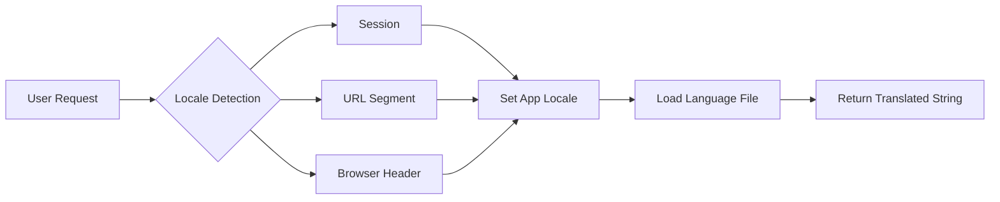

# How to Build Multi-Language Applications in Laravel

Author: [nawazdhandala](https://www.github.com/nawazdhandala)

Tags: Laravel, PHP, Localization, i18n, Web Development, Backend

Description: A practical guide to building multi-language Laravel applications using language files, translation helpers, middleware, and Blade directives.

---

Supporting multiple languages is no longer optional for web applications that target a global audience. Laravel ships with a robust localization system that handles translation strings, pluralization, and locale switching out of the box. This guide walks through everything you need to build a fully localized Laravel application.

## How Laravel Localization Works

Laravel stores translation strings in files under the `lang` directory. When you call a translation function, Laravel looks up the string in the file that matches the current locale. The flow looks like this:



The default locale is set in `config/app.php`. You can change it at runtime using `App::setLocale()`.

## Setting Up Language Files

Laravel supports two formats for language files: PHP arrays and JSON. PHP files work well for organized, nested keys. JSON files are better for simple key-value pairs where the key is the default text.

Create your language directories under `lang`:

```
lang/
├── en/
│   ├── messages.php
│   └── validation.php
├── es/
│   ├── messages.php
│   └── validation.php
└── fr/
    ├── messages.php
    └── validation.php
```

Here is an example English language file with common application strings:

```php
// lang/en/messages.php
<?php

return [
    'welcome' => 'Welcome to our application',
    'greeting' => 'Hello, :name!',
    'dashboard' => [
        'title' => 'Dashboard',
        'stats' => 'Your Statistics',
        'last_login' => 'Last login: :time',
    ],
    'errors' => [
        'not_found' => 'The requested resource was not found.',
        'unauthorized' => 'You do not have permission to access this resource.',
    ],
];
```

The Spanish version would mirror this structure:

```php
// lang/es/messages.php
<?php

return [
    'welcome' => 'Bienvenido a nuestra aplicacion',
    'greeting' => 'Hola, :name!',
    'dashboard' => [
        'title' => 'Panel de control',
        'stats' => 'Tus estadisticas',
        'last_login' => 'Ultimo acceso: :time',
    ],
    'errors' => [
        'not_found' => 'El recurso solicitado no fue encontrado.',
        'unauthorized' => 'No tienes permiso para acceder a este recurso.',
    ],
];
```

## Using the Translation Helper

Laravel provides several ways to retrieve translation strings. The `__()` helper is the most common approach.

Basic translation retrieval using the double underscore helper:

```php
// Retrieve a simple translation
echo __('messages.welcome');
// Output: Welcome to our application

// Access nested keys using dot notation
echo __('messages.dashboard.title');
// Output: Dashboard

// Fallback to the key if translation is missing
echo __('messages.nonexistent');
// Output: messages.nonexistent
```

You can also use the `trans()` function, which works identically:

```php
echo trans('messages.welcome');
// Output: Welcome to our application
```

For JSON translation files, the key is the actual string:

```php
// lang/en.json
{
    "Welcome back!": "Welcome back!",
    "Your cart is empty.": "Your cart is empty."
}

// lang/es.json
{
    "Welcome back!": "Bienvenido de nuevo!",
    "Your cart is empty.": "Tu carrito esta vacio."
}
```

Retrieve JSON translations by using the string itself as the key:

```php
echo __('Welcome back!');
// Output depends on current locale
```

## Translation with Parameters

Dynamic values in translations use placeholder syntax with a colon prefix. Pass replacements as the second argument.

Inserting dynamic values into translation strings:

```php
// Language file: 'greeting' => 'Hello, :name!'
echo __('messages.greeting', ['name' => 'Sarah']);
// Output: Hello, Sarah!

// Multiple placeholders work the same way
// 'order_confirmation' => 'Order #:id confirmed for :email'
echo __('messages.order_confirmation', [
    'id' => 12345,
    'email' => 'user@example.com'
]);
// Output: Order #12345 confirmed for user@example.com
```

Placeholders are case-sensitive. Use `:Name` for capitalized output and `:NAME` for uppercase:

```php
// 'welcome' => 'Welcome, :Name! Your code is :CODE'
echo __('messages.welcome', ['name' => 'john', 'code' => 'abc123']);
// Output: Welcome, John! Your code is ABC123
```

## Handling Pluralization

Laravel handles pluralization rules for different languages. Use the `trans_choice()` function or the `Str::plural()` helper.

Define plural forms using pipe-separated options:

```php
// lang/en/messages.php
return [
    'notifications' => '{0} No notifications|{1} One notification|[2,*] :count notifications',
    'items_in_cart' => '{0} Your cart is empty|{1} You have one item|[2,*] You have :count items',
    'comments' => ':count comment|:count comments',
];
```

Use trans_choice to select the correct plural form based on count:

```php
echo trans_choice('messages.notifications', 0);
// Output: No notifications

echo trans_choice('messages.notifications', 1);
// Output: One notification

echo trans_choice('messages.notifications', 5);
// Output: 5 notifications

// The :count placeholder is replaced automatically
echo trans_choice('messages.items_in_cart', 3);
// Output: You have 3 items
```

For simpler cases with just singular and plural:

```php
// 'apples' => ':count apple|:count apples'
echo trans_choice('messages.apples', 1);
// Output: 1 apple

echo trans_choice('messages.apples', 10);
// Output: 10 apples
```

## Building Locale Middleware

Middleware lets you set the locale based on URL segments, session data, or user preferences. This keeps locale logic centralized and consistent.

Create middleware to detect and set the application locale:

```php
// app/Http/Middleware/SetLocale.php
<?php

namespace App\Http\Middleware;

use Closure;
use Illuminate\Http\Request;
use Illuminate\Support\Facades\App;

class SetLocale
{
    // Supported locales for validation
    protected array $supportedLocales = ['en', 'es', 'fr', 'de'];

    public function handle(Request $request, Closure $next)
    {
        // Priority 1: URL segment (e.g., /es/dashboard)
        $locale = $request->segment(1);

        if ($this->isValidLocale($locale)) {
            App::setLocale($locale);
            return $next($request);
        }

        // Priority 2: Session value
        if ($request->session()->has('locale')) {
            $sessionLocale = $request->session()->get('locale');
            if ($this->isValidLocale($sessionLocale)) {
                App::setLocale($sessionLocale);
                return $next($request);
            }
        }

        // Priority 3: User preference from database
        if ($request->user() && $request->user()->locale) {
            $userLocale = $request->user()->locale;
            if ($this->isValidLocale($userLocale)) {
                App::setLocale($userLocale);
                return $next($request);
            }
        }

        // Priority 4: Browser Accept-Language header
        $browserLocale = $request->getPreferredLanguage($this->supportedLocales);
        if ($browserLocale) {
            App::setLocale($browserLocale);
            return $next($request);
        }

        // Fallback to default config locale
        App::setLocale(config('app.locale'));

        return $next($request);
    }

    protected function isValidLocale(?string $locale): bool
    {
        return $locale && in_array($locale, $this->supportedLocales);
    }
}
```

Register the middleware in your kernel or route group:

```php
// bootstrap/app.php (Laravel 11+)
->withMiddleware(function (Middleware $middleware) {
    $middleware->web(append: [
        \App\Http\Middleware\SetLocale::class,
    ]);
})

// Or for specific route groups in routes/web.php
Route::middleware(['web', SetLocale::class])->group(function () {
    Route::get('/{locale}/dashboard', [DashboardController::class, 'index']);
});
```

## Storing User Language Preferences

Let users choose their preferred language and persist it across sessions. Add a locale column to your users table.

Create a migration to store locale preference:

```php
// database/migrations/2026_02_03_add_locale_to_users_table.php
<?php

use Illuminate\Database\Migrations\Migration;
use Illuminate\Database\Schema\Blueprint;
use Illuminate\Support\Facades\Schema;

return new class extends Migration
{
    public function up(): void
    {
        Schema::table('users', function (Blueprint $table) {
            $table->string('locale', 5)->default('en')->after('email');
        });
    }

    public function down(): void
    {
        Schema::table('users', function (Blueprint $table) {
            $table->dropColumn('locale');
        });
    }
};
```

Build a controller to handle language switching:

```php
// app/Http/Controllers/LanguageController.php
<?php

namespace App\Http\Controllers;

use Illuminate\Http\Request;
use Illuminate\Support\Facades\App;

class LanguageController extends Controller
{
    protected array $supportedLocales = ['en', 'es', 'fr', 'de'];

    public function switch(Request $request, string $locale)
    {
        // Validate the requested locale
        if (!in_array($locale, $this->supportedLocales)) {
            abort(400, 'Unsupported language');
        }

        // Store in session for guests
        $request->session()->put('locale', $locale);

        // Persist to database for authenticated users
        if ($request->user()) {
            $request->user()->update(['locale' => $locale]);
        }

        // Set for current request
        App::setLocale($locale);

        // Redirect back to previous page
        return redirect()->back();
    }

    public function available()
    {
        return response()->json([
            'current' => App::getLocale(),
            'available' => $this->supportedLocales,
        ]);
    }
}
```

Add the route for language switching:

```php
// routes/web.php
Route::get('/language/{locale}', [LanguageController::class, 'switch'])
    ->name('language.switch');
```

## Localization in Blade Templates

Blade provides the `@lang` directive and supports the `__()` helper directly in templates.

Use the @lang directive for clean translation syntax:

```blade
{{-- resources/views/dashboard.blade.php --}}
<h1>@lang('messages.dashboard.title')</h1>

{{-- With parameters --}}
<p>@lang('messages.greeting', ['name' => $user->name])</p>

{{-- Using the helper function --}}
<p>{{ __('messages.welcome') }}</p>

{{-- Pluralization in Blade --}}
<span>{{ trans_choice('messages.notifications', $notificationCount) }}</span>
```

Build a language selector component for your navigation:

```blade
{{-- resources/views/components/language-selector.blade.php --}}
<div class="language-selector">
    <select onchange="window.location.href = this.value">
        <option value="{{ route('language.switch', 'en') }}"
                {{ app()->getLocale() === 'en' ? 'selected' : '' }}>
            English
        </option>
        <option value="{{ route('language.switch', 'es') }}"
                {{ app()->getLocale() === 'es' ? 'selected' : '' }}>
            Espanol
        </option>
        <option value="{{ route('language.switch', 'fr') }}"
                {{ app()->getLocale() === 'fr' ? 'selected' : '' }}>
            Francais
        </option>
        <option value="{{ route('language.switch', 'de') }}"
                {{ app()->getLocale() === 'de' ? 'selected' : '' }}>
            Deutsch
        </option>
    </select>
</div>
```

Pass the locale to JavaScript when needed:

```blade
{{-- In your layout file --}}
<script>
    window.AppLocale = @json([
        'current' => app()->getLocale(),
        'fallback' => config('app.fallback_locale'),
    ]);
</script>
```

## Localizing Dates and Numbers

Format dates and numbers according to the user's locale using Carbon and PHP's NumberFormatter.

Configure Carbon for locale-aware date formatting:

```php
// app/Providers/AppServiceProvider.php
<?php

namespace App\Providers;

use Carbon\Carbon;
use Illuminate\Support\ServiceProvider;

class AppServiceProvider extends ServiceProvider
{
    public function boot(): void
    {
        // Set Carbon locale from app locale
        Carbon::setLocale(config('app.locale'));

        // Update when locale changes
        app()->afterResolving('translator', function () {
            Carbon::setLocale(app()->getLocale());
        });
    }
}
```

Use localized date formatting in your views and controllers:

```php
use Carbon\Carbon;

// Translate month and day names
$date = Carbon::now();

echo $date->translatedFormat('l, F j, Y');
// English: Monday, February 3, 2026
// Spanish: lunes, febrero 3, 2026

echo $date->diffForHumans();
// English: 2 hours ago
// Spanish: hace 2 horas
```

Format numbers and currency for different locales:

```php
// Helper function for localized number formatting
function formatNumber(float $number, int $decimals = 2): string
{
    $formatter = new NumberFormatter(app()->getLocale(), NumberFormatter::DECIMAL);
    $formatter->setAttribute(NumberFormatter::FRACTION_DIGITS, $decimals);
    return $formatter->format($number);
}

function formatCurrency(float $amount, string $currency = 'USD'): string
{
    $formatter = new NumberFormatter(app()->getLocale(), NumberFormatter::CURRENCY);
    return $formatter->formatCurrency($amount, $currency);
}

// Usage
echo formatNumber(1234567.89);
// en: 1,234,567.89
// de: 1.234.567,89

echo formatCurrency(99.99, 'EUR');
// en: EUR99.99
// de: 99,99 EUR
```

## Validating Localized Input

Laravel's validation messages are already localized. Publish and translate them for your supported languages.

Publish validation language files:

```bash
php artisan lang:publish
```

Customize validation messages for each locale:

```php
// lang/es/validation.php
<?php

return [
    'required' => 'El campo :attribute es obligatorio.',
    'email' => 'El campo :attribute debe ser una direccion de correo valida.',
    'min' => [
        'string' => 'El campo :attribute debe tener al menos :min caracteres.',
        'numeric' => 'El campo :attribute debe ser al menos :min.',
    ],
    'max' => [
        'string' => 'El campo :attribute no debe superar los :max caracteres.',
    ],
    'attributes' => [
        'email' => 'correo electronico',
        'password' => 'contrasena',
        'name' => 'nombre',
    ],
];
```

## Testing Your Localization

Write tests to verify translations work correctly across locales:

```php
// tests/Feature/LocalizationTest.php
<?php

namespace Tests\Feature;

use Tests\TestCase;
use Illuminate\Support\Facades\App;

class LocalizationTest extends TestCase
{
    public function test_switches_locale_via_url(): void
    {
        $response = $this->get('/language/es');

        $response->assertRedirect();
        $this->assertEquals('es', session('locale'));
    }

    public function test_translations_load_for_each_locale(): void
    {
        App::setLocale('en');
        $this->assertEquals('Welcome to our application', __('messages.welcome'));

        App::setLocale('es');
        $this->assertEquals('Bienvenido a nuestra aplicacion', __('messages.welcome'));
    }

    public function test_pluralization_works_correctly(): void
    {
        App::setLocale('en');

        $this->assertEquals('No notifications', trans_choice('messages.notifications', 0));
        $this->assertEquals('One notification', trans_choice('messages.notifications', 1));
        $this->assertEquals('5 notifications', trans_choice('messages.notifications', 5));
    }

    public function test_authenticated_user_locale_persists(): void
    {
        $user = User::factory()->create(['locale' => 'fr']);

        $this->actingAs($user)
            ->get('/dashboard')
            ->assertOk();

        $this->assertEquals('fr', App::getLocale());
    }
}
```

## Summary

| Feature | Implementation |
|---------|----------------|
| Language files | PHP arrays in `lang/{locale}/` or JSON in `lang/{locale}.json` |
| Basic translation | `__('file.key')` or `trans('file.key')` |
| Parameters | `__('file.key', ['name' => $value])` |
| Pluralization | `trans_choice('file.key', $count)` |
| Locale switching | Middleware with session/database persistence |
| Blade templates | `@lang()` directive or `{{ __() }}` helper |
| Date formatting | Carbon's `translatedFormat()` and `diffForHumans()` |

Laravel's localization system handles the heavy lifting of multi-language support. Start with your primary language, add translations as you expand to new markets, and use middleware to make locale switching seamless. The investment in proper localization pays off in user experience and market reach.
