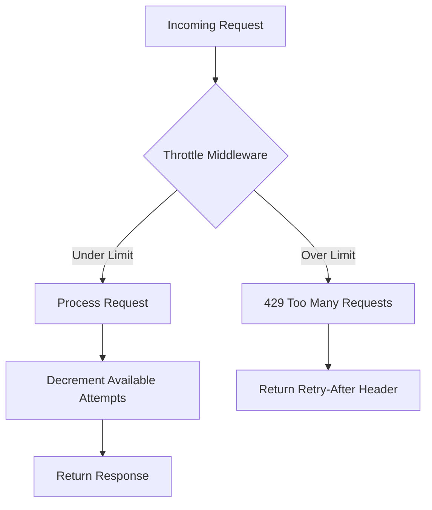
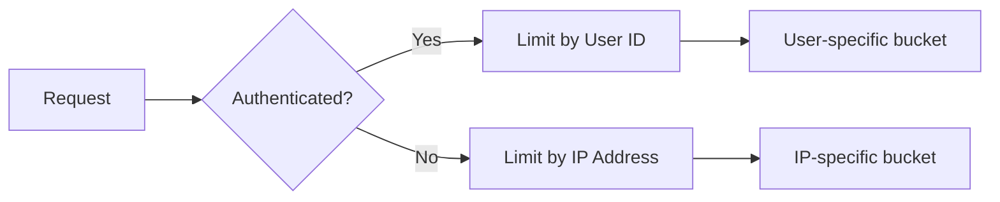
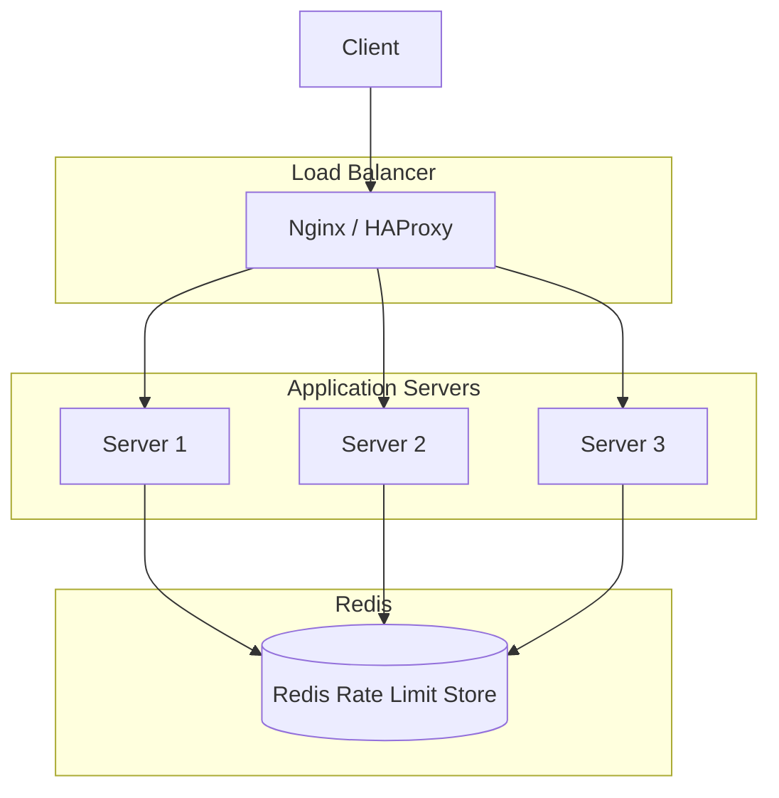

# How to Implement Rate Limiting in Laravel

Author: [nawazdhandala](https://www.github.com/nawazdhandala)

Tags: Laravel, PHP, Rate Limiting, API Security, Middleware, Redis, Performance

Description: A practical guide to implementing rate limiting in Laravel using the RateLimiter facade, throttle middleware, and custom rate limit strategies.

---

Rate limiting is one of those things you rarely think about until your API gets hammered by a misbehaving client or an overly enthusiastic bot. Laravel ships with excellent rate limiting tools out of the box, and once you understand how they work, you can protect your application in minutes.

This guide covers everything from basic throttle middleware to advanced patterns like dynamic limits and Redis-backed rate limiting for distributed systems.

---

## How Rate Limiting Works in Laravel



Laravel uses a token bucket approach under the hood. Each client gets a bucket of attempts that refills over time. When the bucket is empty, requests get rejected with a 429 status code.

---

## The Throttle Middleware

The quickest way to add rate limiting is the built-in `throttle` middleware. Apply it to routes or route groups.

```php
// routes/api.php

// Limit to 60 requests per minute per user/IP
Route::middleware('throttle:60,1')->group(function () {
    Route::get('/posts', [PostController::class, 'index']);
    Route::get('/posts/{id}', [PostController::class, 'show']);
});

// Different limits for different routes
Route::post('/posts', [PostController::class, 'store'])
    ->middleware('throttle:10,1'); // 10 requests per minute for writes
```

The format is `throttle:maxAttempts,decayMinutes`. So `throttle:60,1` means 60 requests per minute.

---

## Defining Custom Rate Limiters

For more control, define custom rate limiters in your `AppServiceProvider`. This is where the `RateLimiter` facade really shines.

```php
// app/Providers/AppServiceProvider.php

namespace App\Providers;

use Illuminate\Cache\RateLimiting\Limit;
use Illuminate\Support\Facades\RateLimiter;
use Illuminate\Support\ServiceProvider;
use Illuminate\Http\Request;

class AppServiceProvider extends ServiceProvider
{
    public function boot(): void
    {
        // Basic API rate limiter - 60 requests per minute
        RateLimiter::for('api', function (Request $request) {
            return Limit::perMinute(60)->by($request->user()?->id ?: $request->ip());
        });

        // Stricter limit for authentication endpoints
        RateLimiter::for('auth', function (Request $request) {
            return Limit::perMinute(5)->by($request->ip());
        });

        // Higher limits for premium users
        RateLimiter::for('premium-api', function (Request $request) {
            if ($request->user()?->isPremium()) {
                return Limit::perMinute(1000)->by($request->user()->id);
            }

            return Limit::perMinute(60)->by($request->user()?->id ?: $request->ip());
        });
    }
}
```

Reference your custom limiters by name in routes.

```php
// routes/api.php

Route::middleware('throttle:api')->group(function () {
    Route::get('/data', [DataController::class, 'index']);
});

Route::middleware('throttle:auth')->group(function () {
    Route::post('/login', [AuthController::class, 'login']);
    Route::post('/register', [AuthController::class, 'register']);
});
```

---

## Dynamic Rate Limits

Sometimes you need rate limits that change based on context - user subscription tier, endpoint cost, or time of day. Laravel handles this cleanly.

```php
// app/Providers/AppServiceProvider.php

use Illuminate\Cache\RateLimiting\Limit;
use Illuminate\Support\Facades\RateLimiter;

public function boot(): void
{
    // Dynamic limits based on user tier
    RateLimiter::for('tiered-api', function (Request $request) {
        $user = $request->user();

        if (!$user) {
            // Anonymous users get strict limits
            return Limit::perMinute(10)->by($request->ip());
        }

        // Map subscription tiers to request limits
        $limits = [
            'free' => 100,
            'starter' => 500,
            'professional' => 2000,
            'enterprise' => 10000,
        ];

        $maxRequests = $limits[$user->subscription_tier] ?? 100;

        return Limit::perMinute($maxRequests)->by($user->id);
    });

    // Different limits per endpoint type
    RateLimiter::for('resource-based', function (Request $request) {
        // Heavy operations get stricter limits
        $expensiveEndpoints = ['/api/reports', '/api/exports', '/api/bulk'];

        $isExpensive = collect($expensiveEndpoints)
            ->contains(fn ($path) => str_starts_with($request->path(), ltrim($path, '/')));

        if ($isExpensive) {
            return Limit::perHour(10)->by($request->user()?->id ?: $request->ip());
        }

        return Limit::perMinute(60)->by($request->user()?->id ?: $request->ip());
    });
}
```

---

## Multiple Rate Limits

You can stack multiple limits on a single route. This is useful when you want both per-minute and per-day limits.

```php
// app/Providers/AppServiceProvider.php

RateLimiter::for('uploads', function (Request $request) {
    return [
        // Short-term burst protection
        Limit::perMinute(10)->by($request->user()->id),
        // Daily quota
        Limit::perDay(100)->by($request->user()->id),
    ];
});
```

Both limits must pass for the request to proceed. Hit either one and you get a 429.

---

## Rate Limiting by User vs IP

Choosing the right key for rate limiting matters more than you might think.

```php
// app/Providers/AppServiceProvider.php

RateLimiter::for('smart-limiting', function (Request $request) {
    $user = $request->user();

    // Authenticated users - limit by user ID
    // Prevents one user from affecting another
    if ($user) {
        return Limit::perMinute(100)->by('user:' . $user->id);
    }

    // Anonymous users - limit by IP
    // Be careful with shared IPs (offices, VPNs)
    return Limit::perMinute(20)->by('ip:' . $request->ip());
});

// Combine user and IP for extra security on auth endpoints
RateLimiter::for('strict-auth', function (Request $request) {
    // Limit login attempts by both IP and email
    $email = $request->input('email', 'unknown');

    return [
        Limit::perMinute(5)->by('ip:' . $request->ip()),
        Limit::perMinute(5)->by('email:' . $email),
    ];
});
```



---

## Custom Rate Limit Responses

The default 429 response is functional but not exactly user-friendly. Customize it for a better developer experience.

```php
// app/Providers/AppServiceProvider.php

use Illuminate\Cache\RateLimiting\Limit;
use Illuminate\Http\Request;

RateLimiter::for('api', function (Request $request) {
    return Limit::perMinute(60)
        ->by($request->user()?->id ?: $request->ip())
        ->response(function (Request $request, array $headers) {
            return response()->json([
                'error' => 'rate_limit_exceeded',
                'message' => 'Too many requests. Please slow down.',
                'retry_after' => $headers['Retry-After'] ?? 60,
                'documentation' => 'https://api.example.com/docs/rate-limits',
            ], 429, $headers);
        });
});
```

Or handle it globally with exception handling.

```php
// app/Exceptions/Handler.php

namespace App\Exceptions;

use Illuminate\Foundation\Exceptions\Handler as ExceptionHandler;
use Illuminate\Http\Exceptions\ThrottleRequestsException;
use Throwable;

class Handler extends ExceptionHandler
{
    public function register(): void
    {
        $this->renderable(function (ThrottleRequestsException $e, $request) {
            if ($request->expectsJson()) {
                return response()->json([
                    'error' => 'rate_limit_exceeded',
                    'message' => 'You have exceeded the rate limit.',
                    'retry_after_seconds' => $e->getHeaders()['Retry-After'] ?? 60,
                ], 429, $e->getHeaders());
            }
        });
    }
}
```

---

## Redis Configuration for Distributed Systems

In-memory rate limiting falls apart when you scale to multiple servers. Redis provides a shared state that all your app instances can use.

First, set up Redis in your configuration.

```php
// config/database.php

'redis' => [
    'client' => env('REDIS_CLIENT', 'phpredis'),

    'default' => [
        'host' => env('REDIS_HOST', '127.0.0.1'),
        'password' => env('REDIS_PASSWORD'),
        'port' => env('REDIS_PORT', 6379),
        'database' => env('REDIS_DB', 0),
    ],

    // Dedicated connection for rate limiting
    'rate-limiting' => [
        'host' => env('REDIS_HOST', '127.0.0.1'),
        'password' => env('REDIS_PASSWORD'),
        'port' => env('REDIS_PORT', 6379),
        'database' => env('REDIS_RATE_LIMIT_DB', 1),
    ],
],
```

Configure your cache to use Redis for rate limiting.

```php
// config/cache.php

'stores' => [
    'rate-limiting' => [
        'driver' => 'redis',
        'connection' => 'rate-limiting',
    ],
],
```

Update your environment file.

```bash
# .env
CACHE_DRIVER=redis
REDIS_HOST=127.0.0.1
REDIS_PORT=6379
REDIS_PASSWORD=null
REDIS_RATE_LIMIT_DB=1
```



---

## Checking Rate Limit Status Programmatically

Sometimes you need to check limits without actually consuming an attempt - useful for showing users their quota.

```php
// app/Http/Controllers/RateLimitController.php

namespace App\Http\Controllers;

use Illuminate\Http\Request;
use Illuminate\Support\Facades\RateLimiter;

class RateLimitController extends Controller
{
    public function status(Request $request)
    {
        $key = 'api:' . ($request->user()?->id ?: $request->ip());

        $maxAttempts = 60;
        $remaining = RateLimiter::remaining($key, $maxAttempts);
        $availableIn = RateLimiter::availableIn($key);

        return response()->json([
            'limit' => $maxAttempts,
            'remaining' => $remaining,
            'resets_in_seconds' => $availableIn > 0 ? $availableIn : 0,
        ]);
    }
}
```

Manually hitting the rate limiter for custom logic.

```php
// Manual rate limiting in a controller

public function expensiveOperation(Request $request)
{
    $key = 'expensive:' . $request->user()->id;

    // Check if already rate limited
    if (RateLimiter::tooManyAttempts($key, $maxAttempts = 5)) {
        $seconds = RateLimiter::availableIn($key);

        return response()->json([
            'error' => 'Too many attempts',
            'retry_after' => $seconds,
        ], 429);
    }

    // Record this attempt
    RateLimiter::hit($key, $decaySeconds = 3600);

    // Do the expensive work
    $result = $this->performExpensiveOperation();

    return response()->json($result);
}

// Clear rate limit (useful after successful password reset, etc.)
public function clearLimit(Request $request)
{
    $key = 'auth:' . $request->ip();
    RateLimiter::clear($key);
}
```

---

## Middleware for Custom Rate Limiting Logic

When the built-in throttle middleware is not enough, create your own.

```php
// app/Http/Middleware/CustomRateLimiter.php

namespace App\Http\Middleware;

use Closure;
use Illuminate\Http\Request;
use Illuminate\Support\Facades\RateLimiter;
use Symfony\Component\HttpFoundation\Response;

class CustomRateLimiter
{
    public function handle(Request $request, Closure $next, string $limiterName): Response
    {
        $key = $this->resolveKey($request, $limiterName);
        $limit = $this->getLimit($request, $limiterName);

        if (RateLimiter::tooManyAttempts($key, $limit)) {
            return $this->buildRateLimitResponse($key);
        }

        RateLimiter::hit($key, $this->getDecaySeconds($limiterName));

        $response = $next($request);

        return $this->addHeaders(
            $response,
            $limit,
            RateLimiter::remaining($key, $limit)
        );
    }

    protected function resolveKey(Request $request, string $limiterName): string
    {
        $identifier = $request->user()?->id ?: $request->ip();
        return "{$limiterName}:{$identifier}";
    }

    protected function getLimit(Request $request, string $limiterName): int
    {
        // Custom logic for determining limits
        $limits = [
            'api' => $request->user()?->isPremium() ? 1000 : 100,
            'auth' => 5,
            'uploads' => 20,
        ];

        return $limits[$limiterName] ?? 60;
    }

    protected function getDecaySeconds(string $limiterName): int
    {
        $decay = [
            'api' => 60,
            'auth' => 300,    // 5 minutes for auth
            'uploads' => 3600, // 1 hour for uploads
        ];

        return $decay[$limiterName] ?? 60;
    }

    protected function buildRateLimitResponse(string $key): Response
    {
        $retryAfter = RateLimiter::availableIn($key);

        return response()->json([
            'error' => 'rate_limit_exceeded',
            'message' => 'Too many requests.',
            'retry_after' => $retryAfter,
        ], 429, ['Retry-After' => $retryAfter]);
    }

    protected function addHeaders(Response $response, int $limit, int $remaining): Response
    {
        $response->headers->set('X-RateLimit-Limit', $limit);
        $response->headers->set('X-RateLimit-Remaining', max(0, $remaining));

        return $response;
    }
}
```

Register and use your middleware.

```php
// bootstrap/app.php (Laravel 11+)

->withMiddleware(function (Middleware $middleware) {
    $middleware->alias([
        'custom.throttle' => \App\Http\Middleware\CustomRateLimiter::class,
    ]);
})

// routes/api.php

Route::middleware('custom.throttle:api')->group(function () {
    Route::get('/data', [DataController::class, 'index']);
});
```

---

## Testing Rate Limits

Do not skip testing your rate limits. It is easy to misconfigure them and either block legitimate users or leave your API wide open.

```php
// tests/Feature/RateLimitTest.php

namespace Tests\Feature;

use App\Models\User;
use Illuminate\Foundation\Testing\RefreshDatabase;
use Illuminate\Support\Facades\RateLimiter;
use Tests\TestCase;

class RateLimitTest extends TestCase
{
    use RefreshDatabase;

    protected function setUp(): void
    {
        parent::setUp();
        // Clear rate limiters before each test
        RateLimiter::clear('api:127.0.0.1');
    }

    public function test_rate_limit_allows_requests_within_limit(): void
    {
        $user = User::factory()->create();

        // Make 60 requests - all should succeed
        for ($i = 0; $i < 60; $i++) {
            $response = $this->actingAs($user)
                ->getJson('/api/data');

            $response->assertStatus(200);
        }
    }

    public function test_rate_limit_blocks_excessive_requests(): void
    {
        $user = User::factory()->create();

        // Exhaust the limit
        for ($i = 0; $i < 60; $i++) {
            $this->actingAs($user)->getJson('/api/data');
        }

        // 61st request should be blocked
        $response = $this->actingAs($user)
            ->getJson('/api/data');

        $response->assertStatus(429)
            ->assertJsonStructure(['error', 'message', 'retry_after']);
    }

    public function test_rate_limit_headers_are_present(): void
    {
        $user = User::factory()->create();

        $response = $this->actingAs($user)
            ->getJson('/api/data');

        $response->assertHeader('X-RateLimit-Limit')
            ->assertHeader('X-RateLimit-Remaining');
    }

    public function test_premium_users_have_higher_limits(): void
    {
        $premiumUser = User::factory()->create(['subscription_tier' => 'premium']);

        // Premium users should be able to make more requests
        for ($i = 0; $i < 100; $i++) {
            $response = $this->actingAs($premiumUser)
                ->getJson('/api/data');

            $response->assertStatus(200);
        }
    }
}
```

---

## Common Patterns and Best Practices

Here are some patterns that work well in production.

Separate limits for read and write operations.

```php
// app/Providers/AppServiceProvider.php

RateLimiter::for('reads', function (Request $request) {
    return Limit::perMinute(100)->by($request->user()?->id ?: $request->ip());
});

RateLimiter::for('writes', function (Request $request) {
    return Limit::perMinute(20)->by($request->user()?->id ?: $request->ip());
});
```

Exempt internal services from rate limiting.

```php
// app/Providers/AppServiceProvider.php

RateLimiter::for('api', function (Request $request) {
    // Skip rate limiting for internal service calls
    if ($request->hasHeader('X-Internal-Service-Key')) {
        $key = $request->header('X-Internal-Service-Key');
        if (hash_equals(config('services.internal_key'), $key)) {
            return Limit::none();
        }
    }

    return Limit::perMinute(60)->by($request->user()?->id ?: $request->ip());
});
```

Gradual backoff for repeat offenders.

```php
// app/Providers/AppServiceProvider.php

RateLimiter::for('strict', function (Request $request) {
    $key = $request->ip();
    $violations = cache()->get("violations:{$key}", 0);

    // Reduce limits for repeat offenders
    $limit = match (true) {
        $violations >= 10 => 5,    // Heavy restriction
        $violations >= 5 => 20,    // Moderate restriction
        $violations >= 1 => 40,    // Light restriction
        default => 60,             // Normal limit
    };

    return Limit::perMinute($limit)->by($key);
});
```

---

## Conclusion

Laravel makes rate limiting straightforward, but there is more to it than slapping `throttle:60,1` on your routes. Think about who you are rate limiting, what endpoints need protection, and how you will handle distributed deployments.

Key takeaways:

- Use the `RateLimiter` facade for flexible, dynamic limits
- Stack multiple limits for burst protection plus daily quotas
- Configure Redis for multi-server deployments
- Customize your 429 responses to help developers debug
- Test your rate limits - they are easy to get wrong

Rate limiting is your first line of defense against API abuse. Get it right and your infrastructure will thank you.

---

*Monitoring your rate limits in production? [OneUptime](https://oneuptime.com) tracks API performance and alerts you when rate limiting starts affecting legitimate users.*
