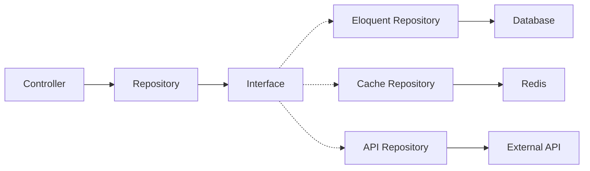
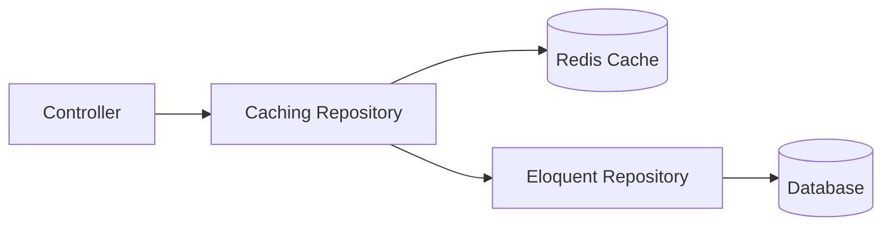

# How to Implement Repository Pattern in Laravel

Author: [nawazdhandala](https://www.github.com/nawazdhandala)

Tags: Laravel, PHP, Design Patterns, Clean Architecture, Testing, Backend Development

Description: A practical guide to implementing the repository pattern in Laravel for cleaner, testable, and maintainable code.

---

The repository pattern sits between your application logic and your data layer. It gives you a clean API for data access while hiding the implementation details - whether you're using Eloquent, raw SQL, or an external API. This separation makes your code easier to test and more flexible when requirements change.

## Why Use the Repository Pattern?

Laravel's Eloquent ORM is excellent, but sprinkling model queries throughout your controllers and services creates tight coupling. When you need to change how data is fetched - adding caching, switching databases, or optimizing queries - you end up touching code all over your application.

The repository pattern solves this by centralizing data access logic. Your controllers ask the repository for data, and the repository handles the details.



## Defining the Repository Interface

Start with an interface that defines what operations your repository supports. This contract ensures any implementation - Eloquent, cache-decorated, or mock - provides the same methods.

```php
<?php

namespace App\Repositories\Contracts;

use Illuminate\Database\Eloquent\Collection;
use Illuminate\Pagination\LengthAwarePaginator;

/**
 * Contract for user data operations.
 * All implementations must fulfill this interface.
 */
interface UserRepositoryInterface
{
    /**
     * Find a user by their primary key.
     */
    public function find(int $id): ?User;

    /**
     * Find a user by email address.
     */
    public function findByEmail(string $email): ?User;

    /**
     * Get all users matching the given criteria.
     */
    public function all(array $filters = []): Collection;

    /**
     * Get paginated users.
     */
    public function paginate(int $perPage = 15, array $filters = []): LengthAwarePaginator;

    /**
     * Create a new user.
     */
    public function create(array $data): User;

    /**
     * Update an existing user.
     */
    public function update(int $id, array $data): bool;

    /**
     * Delete a user.
     */
    public function delete(int $id): bool;
}
```

## The Eloquent Implementation

Now implement the interface using Eloquent. This is where the actual database queries live.

```php
<?php

namespace App\Repositories\Eloquent;

use App\Models\User;
use App\Repositories\Contracts\UserRepositoryInterface;
use Illuminate\Database\Eloquent\Collection;
use Illuminate\Pagination\LengthAwarePaginator;

class UserRepository implements UserRepositoryInterface
{
    /**
     * The User model instance.
     */
    protected User $model;

    public function __construct(User $model)
    {
        $this->model = $model;
    }

    /**
     * Find user by ID, returns null if not found.
     */
    public function find(int $id): ?User
    {
        return $this->model->find($id);
    }

    /**
     * Find user by email - useful for authentication flows.
     */
    public function findByEmail(string $email): ?User
    {
        return $this->model->where('email', $email)->first();
    }

    /**
     * Get all users with optional filtering.
     * Filters can include: status, role, created_after, etc.
     */
    public function all(array $filters = []): Collection
    {
        $query = $this->model->newQuery();

        // Apply filters dynamically
        if (isset($filters['status'])) {
            $query->where('status', $filters['status']);
        }

        if (isset($filters['role'])) {
            $query->where('role', $filters['role']);
        }

        if (isset($filters['created_after'])) {
            $query->where('created_at', '>=', $filters['created_after']);
        }

        // Always order by most recent first
        return $query->orderBy('created_at', 'desc')->get();
    }

    /**
     * Paginated results for listing pages.
     */
    public function paginate(int $perPage = 15, array $filters = []): LengthAwarePaginator
    {
        $query = $this->model->newQuery();

        if (isset($filters['status'])) {
            $query->where('status', $filters['status']);
        }

        if (isset($filters['search'])) {
            $query->where(function ($q) use ($filters) {
                $q->where('name', 'like', "%{$filters['search']}%")
                  ->orWhere('email', 'like', "%{$filters['search']}%");
            });
        }

        return $query->orderBy('created_at', 'desc')->paginate($perPage);
    }

    /**
     * Create a new user record.
     */
    public function create(array $data): User
    {
        return $this->model->create($data);
    }

    /**
     * Update user by ID. Returns true on success.
     */
    public function update(int $id, array $data): bool
    {
        $user = $this->find($id);

        if (!$user) {
            return false;
        }

        return $user->update($data);
    }

    /**
     * Delete user by ID. Returns true on success.
     */
    public function delete(int $id): bool
    {
        $user = $this->find($id);

        if (!$user) {
            return false;
        }

        return $user->delete();
    }
}
```

## Creating a Base Repository

Most repositories share common CRUD operations. Extract these into a base class to avoid repetition.

```php
<?php

namespace App\Repositories\Eloquent;

use Illuminate\Database\Eloquent\Model;
use Illuminate\Database\Eloquent\Collection;
use Illuminate\Pagination\LengthAwarePaginator;

/**
 * Base repository with common CRUD operations.
 * Extend this for entity-specific repositories.
 */
abstract class BaseRepository
{
    protected Model $model;

    public function __construct(Model $model)
    {
        $this->model = $model;
    }

    public function find(int $id): ?Model
    {
        return $this->model->find($id);
    }

    public function findOrFail(int $id): Model
    {
        return $this->model->findOrFail($id);
    }

    public function all(): Collection
    {
        return $this->model->all();
    }

    public function paginate(int $perPage = 15): LengthAwarePaginator
    {
        return $this->model->paginate($perPage);
    }

    public function create(array $data): Model
    {
        return $this->model->create($data);
    }

    public function update(int $id, array $data): bool
    {
        $record = $this->find($id);
        return $record ? $record->update($data) : false;
    }

    public function delete(int $id): bool
    {
        $record = $this->find($id);
        return $record ? $record->delete() : false;
    }

    /**
     * Get the underlying model for complex queries.
     */
    public function getModel(): Model
    {
        return $this->model;
    }
}
```

Now your UserRepository becomes much simpler:

```php
<?php

namespace App\Repositories\Eloquent;

use App\Models\User;
use App\Repositories\Contracts\UserRepositoryInterface;

class UserRepository extends BaseRepository implements UserRepositoryInterface
{
    public function __construct(User $model)
    {
        parent::__construct($model);
    }

    /**
     * User-specific query method.
     */
    public function findByEmail(string $email): ?User
    {
        return $this->model->where('email', $email)->first();
    }

    /**
     * Get users by their role.
     */
    public function findByRole(string $role): Collection
    {
        return $this->model->where('role', $role)->get();
    }

    /**
     * Get active users who logged in within the last N days.
     */
    public function getRecentlyActive(int $days = 30): Collection
    {
        return $this->model
            ->where('last_login_at', '>=', now()->subDays($days))
            ->orderBy('last_login_at', 'desc')
            ->get();
    }
}
```

## Binding in the Service Provider

Laravel's service container needs to know which implementation to use when a controller asks for the interface. Set this up in a service provider.

```php
<?php

namespace App\Providers;

use Illuminate\Support\ServiceProvider;
use App\Repositories\Contracts\UserRepositoryInterface;
use App\Repositories\Contracts\PostRepositoryInterface;
use App\Repositories\Eloquent\UserRepository;
use App\Repositories\Eloquent\PostRepository;

class RepositoryServiceProvider extends ServiceProvider
{
    /**
     * All repository bindings.
     * Add new repositories here as your app grows.
     */
    protected array $repositories = [
        UserRepositoryInterface::class => UserRepository::class,
        PostRepositoryInterface::class => PostRepository::class,
    ];

    public function register(): void
    {
        foreach ($this->repositories as $interface => $implementation) {
            $this->app->bind($interface, $implementation);
        }
    }

    public function boot(): void
    {
        //
    }
}
```

Register the provider in `config/app.php`:

```php
'providers' => [
    // Other providers...
    App\Providers\RepositoryServiceProvider::class,
],
```

## Using Repositories in Controllers

With the binding in place, type-hint the interface in your controller. Laravel automatically injects the correct implementation.

```php
<?php

namespace App\Http\Controllers;

use App\Http\Requests\StoreUserRequest;
use App\Http\Requests\UpdateUserRequest;
use App\Repositories\Contracts\UserRepositoryInterface;
use Illuminate\Http\JsonResponse;
use Illuminate\Http\Request;

class UserController extends Controller
{
    /**
     * Inject the repository via constructor.
     * Laravel resolves this from the service container.
     */
    public function __construct(
        protected UserRepositoryInterface $userRepository
    ) {}

    /**
     * List users with optional filtering.
     */
    public function index(Request $request): JsonResponse
    {
        $filters = $request->only(['status', 'role', 'search']);
        $users = $this->userRepository->paginate(
            perPage: $request->get('per_page', 15),
            filters: $filters
        );

        return response()->json($users);
    }

    /**
     * Get a single user.
     */
    public function show(int $id): JsonResponse
    {
        $user = $this->userRepository->find($id);

        if (!$user) {
            return response()->json(['message' => 'User not found'], 404);
        }

        return response()->json($user);
    }

    /**
     * Create a new user.
     */
    public function store(StoreUserRequest $request): JsonResponse
    {
        $user = $this->userRepository->create($request->validated());

        return response()->json($user, 201);
    }

    /**
     * Update an existing user.
     */
    public function update(UpdateUserRequest $request, int $id): JsonResponse
    {
        $updated = $this->userRepository->update($id, $request->validated());

        if (!$updated) {
            return response()->json(['message' => 'User not found'], 404);
        }

        return response()->json(['message' => 'User updated']);
    }

    /**
     * Delete a user.
     */
    public function destroy(int $id): JsonResponse
    {
        $deleted = $this->userRepository->delete($id);

        if (!$deleted) {
            return response()->json(['message' => 'User not found'], 404);
        }

        return response()->json(null, 204);
    }
}
```

Notice how the controller has no idea about Eloquent, query builders, or databases. It just calls repository methods. This separation pays off when you need to change how data is stored or retrieved.

## Adding Caching with the Decorator Pattern

One major benefit of repositories is you can wrap them with additional behavior. Here's a caching decorator that sits in front of your Eloquent repository.



```php
<?php

namespace App\Repositories\Decorators;

use App\Models\User;
use App\Repositories\Contracts\UserRepositoryInterface;
use Illuminate\Database\Eloquent\Collection;
use Illuminate\Pagination\LengthAwarePaginator;
use Illuminate\Support\Facades\Cache;

/**
 * Caching decorator for the user repository.
 * Wraps another repository and adds cache layer.
 */
class CachingUserRepository implements UserRepositoryInterface
{
    /**
     * TTL for cached items in seconds.
     */
    protected int $ttl = 3600; // 1 hour

    protected string $cachePrefix = 'users:';

    public function __construct(
        protected UserRepositoryInterface $repository
    ) {}

    /**
     * Try cache first, fall back to database.
     */
    public function find(int $id): ?User
    {
        $cacheKey = $this->cachePrefix . $id;

        return Cache::remember($cacheKey, $this->ttl, function () use ($id) {
            return $this->repository->find($id);
        });
    }

    public function findByEmail(string $email): ?User
    {
        $cacheKey = $this->cachePrefix . 'email:' . md5($email);

        return Cache::remember($cacheKey, $this->ttl, function () use ($email) {
            return $this->repository->findByEmail($email);
        });
    }

    /**
     * Skip cache for listings - they change too often.
     */
    public function all(array $filters = []): Collection
    {
        return $this->repository->all($filters);
    }

    public function paginate(int $perPage = 15, array $filters = []): LengthAwarePaginator
    {
        return $this->repository->paginate($perPage, $filters);
    }

    /**
     * Create and cache the new record.
     */
    public function create(array $data): User
    {
        $user = $this->repository->create($data);

        // Cache the newly created user
        Cache::put($this->cachePrefix . $user->id, $user, $this->ttl);

        return $user;
    }

    /**
     * Update and invalidate cache.
     */
    public function update(int $id, array $data): bool
    {
        $result = $this->repository->update($id, $data);

        if ($result) {
            // Clear cache so next read gets fresh data
            Cache::forget($this->cachePrefix . $id);
        }

        return $result;
    }

    /**
     * Delete and remove from cache.
     */
    public function delete(int $id): bool
    {
        // Get user before deletion for email cache clearing
        $user = $this->repository->find($id);
        $result = $this->repository->delete($id);

        if ($result) {
            Cache::forget($this->cachePrefix . $id);
            if ($user) {
                Cache::forget($this->cachePrefix . 'email:' . md5($user->email));
            }
        }

        return $result;
    }
}
```

Update the service provider to use the decorator:

```php
<?php

namespace App\Providers;

use Illuminate\Support\ServiceProvider;
use App\Repositories\Contracts\UserRepositoryInterface;
use App\Repositories\Eloquent\UserRepository;
use App\Repositories\Decorators\CachingUserRepository;

class RepositoryServiceProvider extends ServiceProvider
{
    public function register(): void
    {
        // Bind the caching decorator that wraps the Eloquent repository
        $this->app->bind(UserRepositoryInterface::class, function ($app) {
            $eloquentRepo = new UserRepository(new \App\Models\User());
            return new CachingUserRepository($eloquentRepo);
        });
    }
}
```

Your controllers remain unchanged - they still type-hint `UserRepositoryInterface`, but now they get caching for free.

## Testing with Repository Mocks

The repository pattern makes testing straightforward. You can mock the interface and test your controllers in isolation, without touching the database.

```php
<?php

namespace Tests\Feature;

use Tests\TestCase;
use App\Models\User;
use App\Repositories\Contracts\UserRepositoryInterface;
use Mockery;

class UserControllerTest extends TestCase
{
    /**
     * Test listing users returns paginated results.
     */
    public function test_index_returns_paginated_users(): void
    {
        // Create a mock repository
        $mockRepo = Mockery::mock(UserRepositoryInterface::class);

        // Define what the mock should return
        $mockRepo->shouldReceive('paginate')
            ->once()
            ->with(15, [])
            ->andReturn(new \Illuminate\Pagination\LengthAwarePaginator(
                collect([
                    new User(['id' => 1, 'name' => 'John', 'email' => 'john@example.com']),
                    new User(['id' => 2, 'name' => 'Jane', 'email' => 'jane@example.com']),
                ]),
                2, // total
                15 // per page
            ));

        // Bind the mock to the container
        $this->app->instance(UserRepositoryInterface::class, $mockRepo);

        // Make the request
        $response = $this->getJson('/api/users');

        $response->assertStatus(200)
            ->assertJsonCount(2, 'data');
    }

    /**
     * Test show returns 404 for missing user.
     */
    public function test_show_returns_404_when_user_not_found(): void
    {
        $mockRepo = Mockery::mock(UserRepositoryInterface::class);

        $mockRepo->shouldReceive('find')
            ->once()
            ->with(999)
            ->andReturn(null);

        $this->app->instance(UserRepositoryInterface::class, $mockRepo);

        $response = $this->getJson('/api/users/999');

        $response->assertStatus(404)
            ->assertJson(['message' => 'User not found']);
    }

    /**
     * Test creating a user.
     */
    public function test_store_creates_user(): void
    {
        $mockRepo = Mockery::mock(UserRepositoryInterface::class);

        $userData = [
            'name' => 'New User',
            'email' => 'newuser@example.com',
            'password' => 'password123',
        ];

        $createdUser = new User(array_merge(['id' => 1], $userData));

        $mockRepo->shouldReceive('create')
            ->once()
            ->andReturn($createdUser);

        $this->app->instance(UserRepositoryInterface::class, $mockRepo);

        $response = $this->postJson('/api/users', $userData);

        $response->assertStatus(201)
            ->assertJson(['id' => 1, 'name' => 'New User']);
    }

    protected function tearDown(): void
    {
        Mockery::close();
        parent::tearDown();
    }
}
```

You can also create a fake repository for more complex test scenarios:

```php
<?php

namespace Tests\Fakes;

use App\Models\User;
use App\Repositories\Contracts\UserRepositoryInterface;
use Illuminate\Database\Eloquent\Collection;
use Illuminate\Pagination\LengthAwarePaginator;

/**
 * In-memory fake repository for testing.
 * Stores users in an array instead of the database.
 */
class FakeUserRepository implements UserRepositoryInterface
{
    protected array $users = [];
    protected int $nextId = 1;

    public function find(int $id): ?User
    {
        return $this->users[$id] ?? null;
    }

    public function findByEmail(string $email): ?User
    {
        foreach ($this->users as $user) {
            if ($user->email === $email) {
                return $user;
            }
        }
        return null;
    }

    public function all(array $filters = []): Collection
    {
        return new Collection(array_values($this->users));
    }

    public function paginate(int $perPage = 15, array $filters = []): LengthAwarePaginator
    {
        $items = array_values($this->users);
        return new LengthAwarePaginator($items, count($items), $perPage);
    }

    public function create(array $data): User
    {
        $user = new User(array_merge(['id' => $this->nextId], $data));
        $this->users[$this->nextId] = $user;
        $this->nextId++;
        return $user;
    }

    public function update(int $id, array $data): bool
    {
        if (!isset($this->users[$id])) {
            return false;
        }
        $this->users[$id]->fill($data);
        return true;
    }

    public function delete(int $id): bool
    {
        if (!isset($this->users[$id])) {
            return false;
        }
        unset($this->users[$id]);
        return true;
    }

    /**
     * Helper to seed the fake repository with test data.
     */
    public function seed(array $users): void
    {
        foreach ($users as $userData) {
            $this->create($userData);
        }
    }
}
```

## Project Structure

Here's how the repository files fit into a Laravel project:

```
app/
├── Http/
│   └── Controllers/
│       └── UserController.php
├── Models/
│   └── User.php
├── Providers/
│   └── RepositoryServiceProvider.php
└── Repositories/
    ├── Contracts/
    │   ├── UserRepositoryInterface.php
    │   └── PostRepositoryInterface.php
    ├── Decorators/
    │   └── CachingUserRepository.php
    └── Eloquent/
        ├── BaseRepository.php
        ├── UserRepository.php
        └── PostRepository.php

tests/
├── Fakes/
│   └── FakeUserRepository.php
└── Feature/
    └── UserControllerTest.php
```

## When to Skip the Repository Pattern

The repository pattern adds a layer of abstraction. That extra layer has costs:

- More files to create and maintain
- Another concept for new team members to learn
- Can feel like over-engineering for small projects

Consider skipping repositories when:

- You're building a prototype or MVP
- The app will always use a single database
- Your team is small and queries are simple
- You're unlikely to need extensive unit testing

The pattern shines when:

- You need to swap data sources (database to API, for example)
- Caching requirements are complex
- You want thorough unit tests without database hits
- Multiple services share data access logic
- Your team values explicit contracts between layers

## Summary

| Component | Purpose |
|-----------|---------|
| **Interface** | Defines the contract for data operations |
| **Eloquent Repository** | Implements the interface using Eloquent |
| **Base Repository** | Shared CRUD logic to reduce duplication |
| **Service Provider** | Binds interfaces to implementations |
| **Caching Decorator** | Adds cache layer without changing existing code |
| **Mock/Fake Repository** | Enables isolated unit testing |

The repository pattern gives you flexibility and testability at the cost of some additional structure. For applications that will grow and evolve, that trade-off usually pays for itself. Start with the interface and Eloquent implementation, then add caching decorators and other features as your needs become clear.
