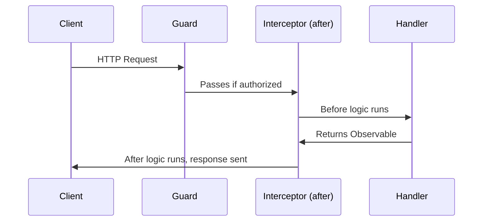
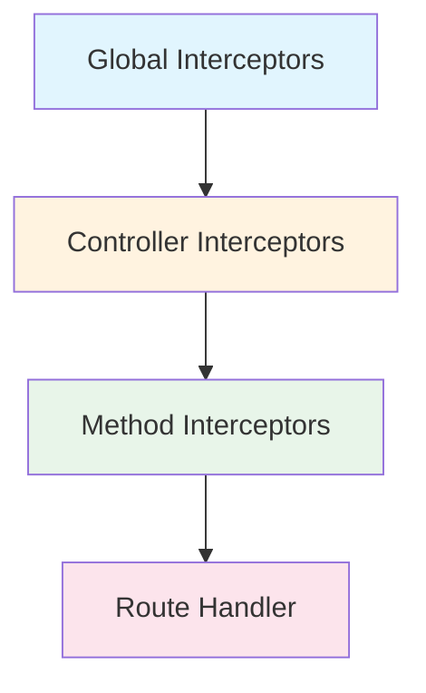
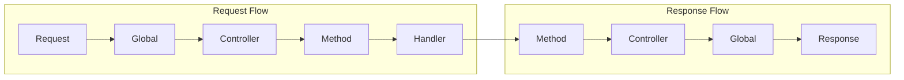

# How to Use NestJS Interceptors

Author: [nawazdhandala](https://www.github.com/nawazdhandala)

Tags: NestJS, TypeScript, NodeJS, Backend, API, Middleware, RxJS

Description: Master NestJS interceptors to transform responses, log requests, implement caching, handle timeouts, and apply cross-cutting concerns across your application.

---

Interceptors in NestJS sit between the incoming request and the route handler, and also between the handler response and the client. They give you the ability to transform data, add logging, implement caching, handle errors - all without cluttering your business logic. If you have used middleware before, interceptors are similar but more powerful because they have access to what happens both before and after the handler executes.

## Understanding the Interceptor Architecture

Before diving into code, let's see where interceptors fit in the NestJS request lifecycle.



The key thing to understand is that interceptors wrap the execution - they run code before the handler, then get access to the response stream after the handler finishes.

## The NestInterceptor Interface

Every interceptor implements the `NestInterceptor` interface. The interface has one method - `intercept` - that receives the execution context and a call handler.

```typescript
import {
  Injectable,
  NestInterceptor,
  ExecutionContext,
  CallHandler,
} from '@nestjs/common';
import { Observable } from 'rxjs';

@Injectable()
export class ExampleInterceptor implements NestInterceptor {
  intercept(context: ExecutionContext, next: CallHandler): Observable<any> {
    // Code here runs BEFORE the route handler
    console.log('Before handler...');

    // next.handle() calls the route handler and returns an Observable
    return next.handle();
  }
}
```

## ExecutionContext - Knowing Your Request

The `ExecutionContext` gives you access to details about the current request. You can extract the request object, check which controller and handler will run, and even determine if this is an HTTP request, WebSocket, or RPC call.

```typescript
import {
  Injectable,
  NestInterceptor,
  ExecutionContext,
  CallHandler,
} from '@nestjs/common';
import { Observable } from 'rxjs';

@Injectable()
export class ContextAwareInterceptor implements NestInterceptor {
  intercept(context: ExecutionContext, next: CallHandler): Observable<any> {
    // Get the request type (http, ws, rpc)
    const type = context.getType();

    // Get controller class and handler method names
    const controller = context.getClass().name;
    const handler = context.getHandler().name;

    // For HTTP requests, get the request object
    if (type === 'http') {
      const request = context.switchToHttp().getRequest();
      const { method, url, ip } = request;

      console.log(`[${method}] ${url} - Controller: ${controller}.${handler}`);
    }

    return next.handle();
  }
}
```

## CallHandler and RxJS - The Power of Observables

The `CallHandler` interface has a single method - `handle()` - that returns an Observable. This is where the route handler's response comes through. Using RxJS operators, you can transform, delay, cache, or modify the response in any way you need.

```typescript
import {
  Injectable,
  NestInterceptor,
  ExecutionContext,
  CallHandler,
} from '@nestjs/common';
import { Observable } from 'rxjs';
import { map, tap } from 'rxjs/operators';

@Injectable()
export class TransformInterceptor implements NestInterceptor {
  intercept(context: ExecutionContext, next: CallHandler): Observable<any> {
    return next.handle().pipe(
      // tap lets you perform side effects without modifying the response
      tap((data) => console.log('Response data:', data)),

      // map transforms the response
      map((data) => ({
        success: true,
        timestamp: new Date().toISOString(),
        data,
      })),
    );
  }
}
```

## Building a Logging Interceptor

A logging interceptor is one of the most common use cases. It captures request details and response times without touching your controller code.

```typescript
import {
  Injectable,
  NestInterceptor,
  ExecutionContext,
  CallHandler,
  Logger,
} from '@nestjs/common';
import { Observable } from 'rxjs';
import { tap } from 'rxjs/operators';

@Injectable()
export class LoggingInterceptor implements NestInterceptor {
  private readonly logger = new Logger(LoggingInterceptor.name);

  intercept(context: ExecutionContext, next: CallHandler): Observable<any> {
    const request = context.switchToHttp().getRequest();
    const { method, url, ip, body } = request;
    const userAgent = request.get('user-agent') || '';

    const now = Date.now();
    const requestId = `${now}-${Math.random().toString(36).substr(2, 9)}`;

    this.logger.log(
      `[${requestId}] Incoming ${method} ${url} from ${ip} - ${userAgent}`,
    );

    // Log request body for POST/PUT/PATCH (be careful with sensitive data)
    if (['POST', 'PUT', 'PATCH'].includes(method)) {
      this.logger.debug(`[${requestId}] Body: ${JSON.stringify(body)}`);
    }

    return next.handle().pipe(
      tap({
        next: (data) => {
          const response = context.switchToHttp().getResponse();
          const duration = Date.now() - now;

          this.logger.log(
            `[${requestId}] ${method} ${url} ${response.statusCode} - ${duration}ms`,
          );
        },
        error: (error) => {
          const duration = Date.now() - now;

          this.logger.error(
            `[${requestId}] ${method} ${url} failed after ${duration}ms - ${error.message}`,
          );
        },
      }),
    );
  }
}
```

## Response Transformation

Standardizing your API response format is a great use case for interceptors. Instead of wrapping every controller response manually, let an interceptor handle it.

```typescript
import {
  Injectable,
  NestInterceptor,
  ExecutionContext,
  CallHandler,
} from '@nestjs/common';
import { Observable } from 'rxjs';
import { map } from 'rxjs/operators';

// Define a standard response structure
export interface ApiResponse<T> {
  success: boolean;
  statusCode: number;
  timestamp: string;
  path: string;
  data: T;
}

@Injectable()
export class ResponseTransformInterceptor<T>
  implements NestInterceptor<T, ApiResponse<T>>
{
  intercept(
    context: ExecutionContext,
    next: CallHandler,
  ): Observable<ApiResponse<T>> {
    const request = context.switchToHttp().getRequest();
    const response = context.switchToHttp().getResponse();

    return next.handle().pipe(
      map((data) => ({
        success: true,
        statusCode: response.statusCode,
        timestamp: new Date().toISOString(),
        path: request.url,
        data,
      })),
    );
  }
}
```

Now your controller can return plain data and the interceptor wraps it consistently.

```typescript
// Controller returns simple data
@Get('users/:id')
findOne(@Param('id') id: string) {
  return this.usersService.findOne(id);
}

// Client receives wrapped response
// {
//   "success": true,
//   "statusCode": 200,
//   "timestamp": "2026-02-03T10:30:00.000Z",
//   "path": "/users/123",
//   "data": { "id": "123", "name": "John" }
// }
```

## Implementing a Caching Interceptor

Caching frequently requested data can dramatically improve performance. Here's an interceptor that caches GET request responses.

```typescript
import {
  Injectable,
  NestInterceptor,
  ExecutionContext,
  CallHandler,
} from '@nestjs/common';
import { Observable, of } from 'rxjs';
import { tap } from 'rxjs/operators';

@Injectable()
export class CacheInterceptor implements NestInterceptor {
  // Simple in-memory cache - use Redis in production
  private cache = new Map<string, { data: any; expiry: number }>();
  private readonly ttlMs = 60000; // 1 minute

  intercept(context: ExecutionContext, next: CallHandler): Observable<any> {
    const request = context.switchToHttp().getRequest();

    // Only cache GET requests
    if (request.method !== 'GET') {
      return next.handle();
    }

    const cacheKey = this.generateCacheKey(request);
    const cached = this.cache.get(cacheKey);

    // Return cached data if valid
    if (cached && cached.expiry > Date.now()) {
      console.log(`Cache hit for ${cacheKey}`);
      return of(cached.data);
    }

    // Cache miss - call handler and cache the result
    return next.handle().pipe(
      tap((data) => {
        console.log(`Cache miss - storing ${cacheKey}`);
        this.cache.set(cacheKey, {
          data,
          expiry: Date.now() + this.ttlMs,
        });
      }),
    );
  }

  private generateCacheKey(request: any): string {
    const { url, query } = request;
    return `${url}?${JSON.stringify(query)}`;
  }
}
```

For production use, integrate with a proper caching solution like Redis.

```typescript
import { CACHE_MANAGER } from '@nestjs/cache-manager';
import { Cache } from 'cache-manager';

@Injectable()
export class RedisCacheInterceptor implements NestInterceptor {
  constructor(@Inject(CACHE_MANAGER) private cacheManager: Cache) {}

  async intercept(
    context: ExecutionContext,
    next: CallHandler,
  ): Promise<Observable<any>> {
    const request = context.switchToHttp().getRequest();

    if (request.method !== 'GET') {
      return next.handle();
    }

    const cacheKey = `api:${request.url}`;
    const cached = await this.cacheManager.get(cacheKey);

    if (cached) {
      return of(cached);
    }

    return next.handle().pipe(
      tap((data) => {
        this.cacheManager.set(cacheKey, data, 60); // 60 seconds TTL
      }),
    );
  }
}
```

## Timeout Handling

Long-running requests can tie up resources and frustrate users. A timeout interceptor ensures requests complete within a reasonable time or fail gracefully.

```typescript
import {
  Injectable,
  NestInterceptor,
  ExecutionContext,
  CallHandler,
  RequestTimeoutException,
} from '@nestjs/common';
import { Observable, throwError, TimeoutError } from 'rxjs';
import { catchError, timeout } from 'rxjs/operators';

@Injectable()
export class TimeoutInterceptor implements NestInterceptor {
  constructor(private readonly timeoutMs: number = 5000) {}

  intercept(context: ExecutionContext, next: CallHandler): Observable<any> {
    return next.handle().pipe(
      timeout(this.timeoutMs),
      catchError((err) => {
        if (err instanceof TimeoutError) {
          return throwError(
            () => new RequestTimeoutException('Request timed out'),
          );
        }
        return throwError(() => err);
      }),
    );
  }
}
```

You can make the timeout configurable per route using custom metadata.

```typescript
import { SetMetadata } from '@nestjs/common';
import { Reflector } from '@nestjs/core';

// Custom decorator to set timeout
export const Timeout = (ms: number) => SetMetadata('timeout', ms);

@Injectable()
export class ConfigurableTimeoutInterceptor implements NestInterceptor {
  constructor(private reflector: Reflector) {}

  intercept(context: ExecutionContext, next: CallHandler): Observable<any> {
    const timeoutMs =
      this.reflector.get<number>('timeout', context.getHandler()) || 5000;

    return next.handle().pipe(
      timeout(timeoutMs),
      catchError((err) => {
        if (err instanceof TimeoutError) {
          return throwError(
            () => new RequestTimeoutException(`Request timed out after ${timeoutMs}ms`),
          );
        }
        return throwError(() => err);
      }),
    );
  }
}

// Usage in controller
@Get('slow-endpoint')
@Timeout(30000) // 30 seconds for this endpoint
async processLargeFile() {
  return this.fileService.process();
}
```

## Global vs Scoped Interceptors

NestJS provides three levels for applying interceptors - global, controller, and method level.



### Global Interceptors

Apply to every route in your application.

```typescript
// main.ts - Using app.useGlobalInterceptors
import { NestFactory } from '@nestjs/core';
import { AppModule } from './app.module';
import { LoggingInterceptor } from './interceptors/logging.interceptor';

async function bootstrap() {
  const app = await NestFactory.create(AppModule);

  // Global interceptor - applied to all routes
  app.useGlobalInterceptors(new LoggingInterceptor());

  await app.listen(3000);
}
bootstrap();
```

For dependency injection support in global interceptors, register them in a module.

```typescript
// app.module.ts
import { Module } from '@nestjs/common';
import { APP_INTERCEPTOR } from '@nestjs/core';
import { LoggingInterceptor } from './interceptors/logging.interceptor';

@Module({
  providers: [
    {
      provide: APP_INTERCEPTOR,
      useClass: LoggingInterceptor,
    },
  ],
})
export class AppModule {}
```

### Controller-Level Interceptors

Apply to all methods in a specific controller.

```typescript
import { Controller, Get, UseInterceptors } from '@nestjs/common';
import { CacheInterceptor } from './interceptors/cache.interceptor';

@Controller('products')
@UseInterceptors(CacheInterceptor) // Applied to all methods in this controller
export class ProductsController {
  @Get()
  findAll() {
    return this.productsService.findAll();
  }

  @Get(':id')
  findOne(@Param('id') id: string) {
    return this.productsService.findOne(id);
  }
}
```

### Method-Level Interceptors

Apply to a single route handler.

```typescript
import { Controller, Get, UseInterceptors } from '@nestjs/common';
import { TimeoutInterceptor } from './interceptors/timeout.interceptor';

@Controller('reports')
export class ReportsController {
  @Get('daily')
  @UseInterceptors(new TimeoutInterceptor(30000)) // 30 second timeout for this route
  generateDailyReport() {
    return this.reportsService.generateDaily();
  }

  @Get('quick-stats')
  // Uses default timeout from global interceptor
  getQuickStats() {
    return this.reportsService.getQuickStats();
  }
}
```

## Execution Order

When multiple interceptors are applied, they execute in a specific order - global first, then controller, then method level. The response flows back in reverse order.



```typescript
// Execution order example
@Module({
  providers: [
    { provide: APP_INTERCEPTOR, useClass: GlobalInterceptor }, // Runs 1st (request), 4th (response)
  ],
})
export class AppModule {}

@Controller('users')
@UseInterceptors(ControllerInterceptor) // Runs 2nd (request), 3rd (response)
export class UsersController {
  @Get()
  @UseInterceptors(MethodInterceptor) // Runs 3rd (request), 2nd (response)
  findAll() {
    return this.usersService.findAll();
  }
}
```

## Practical Example - Combining Multiple Interceptors

Here's a real-world setup combining logging, transformation, and error handling.

```typescript
// interceptors/index.ts
export * from './logging.interceptor';
export * from './transform.interceptor';
export * from './timeout.interceptor';
export * from './errors.interceptor';

// interceptors/errors.interceptor.ts
import {
  Injectable,
  NestInterceptor,
  ExecutionContext,
  CallHandler,
  HttpException,
  HttpStatus,
} from '@nestjs/common';
import { Observable, throwError } from 'rxjs';
import { catchError } from 'rxjs/operators';

@Injectable()
export class ErrorsInterceptor implements NestInterceptor {
  intercept(context: ExecutionContext, next: CallHandler): Observable<any> {
    return next.handle().pipe(
      catchError((error) => {
        // Log the error
        console.error('Error caught in interceptor:', error);

        // Transform unknown errors into HTTP exceptions
        if (!(error instanceof HttpException)) {
          return throwError(
            () =>
              new HttpException(
                {
                  success: false,
                  message: 'Internal server error',
                  error: process.env.NODE_ENV === 'development' ? error.message : undefined,
                },
                HttpStatus.INTERNAL_SERVER_ERROR,
              ),
          );
        }

        return throwError(() => error);
      }),
    );
  }
}
```

Register all interceptors in the correct order.

```typescript
// app.module.ts
import { Module } from '@nestjs/common';
import { APP_INTERCEPTOR } from '@nestjs/core';
import {
  LoggingInterceptor,
  ResponseTransformInterceptor,
  TimeoutInterceptor,
  ErrorsInterceptor,
} from './interceptors';

@Module({
  providers: [
    // Order matters - first registered runs first on request
    {
      provide: APP_INTERCEPTOR,
      useClass: LoggingInterceptor,
    },
    {
      provide: APP_INTERCEPTOR,
      useClass: TimeoutInterceptor,
    },
    {
      provide: APP_INTERCEPTOR,
      useClass: ErrorsInterceptor,
    },
    {
      provide: APP_INTERCEPTOR,
      useClass: ResponseTransformInterceptor,
    },
  ],
})
export class AppModule {}
```

## Skipping Interceptors for Specific Routes

Sometimes you need to bypass certain interceptors for specific routes. Use custom metadata and check it in the interceptor.

```typescript
import { SetMetadata } from '@nestjs/common';

// Decorator to skip cache
export const NoCache = () => SetMetadata('noCache', true);

// Decorator to skip transformation
export const RawResponse = () => SetMetadata('rawResponse', true);

@Injectable()
export class CacheInterceptor implements NestInterceptor {
  constructor(private reflector: Reflector) {}

  intercept(context: ExecutionContext, next: CallHandler): Observable<any> {
    const noCache = this.reflector.get<boolean>('noCache', context.getHandler());

    if (noCache) {
      return next.handle(); // Skip caching
    }

    // Normal caching logic...
  }
}

// Usage
@Controller('users')
export class UsersController {
  @Get()
  findAll() {
    // This route uses cache
    return this.usersService.findAll();
  }

  @Get('me')
  @NoCache() // Skip cache for this route
  getCurrentUser(@Request() req) {
    return req.user;
  }
}
```

## Summary

| Concept | Purpose |
|---------|---------|
| **NestInterceptor** | Interface to implement for creating interceptors |
| **ExecutionContext** | Access request details, controller, and handler info |
| **CallHandler** | Calls the route handler, returns Observable |
| **tap** | Side effects without modifying response |
| **map** | Transform response data |
| **timeout** | Limit request duration |
| **catchError** | Handle and transform errors |
| **Global scope** | Applies to all routes |
| **Controller scope** | Applies to all methods in a controller |
| **Method scope** | Applies to a single route handler |

Interceptors are one of the cleanest ways to add cross-cutting concerns to your NestJS application. They keep your controllers focused on business logic while handling the plumbing - logging, caching, transformation, and error handling - in a consistent, reusable way. Start with a logging interceptor to see the pattern, then expand to response transformation and caching as your needs grow.
