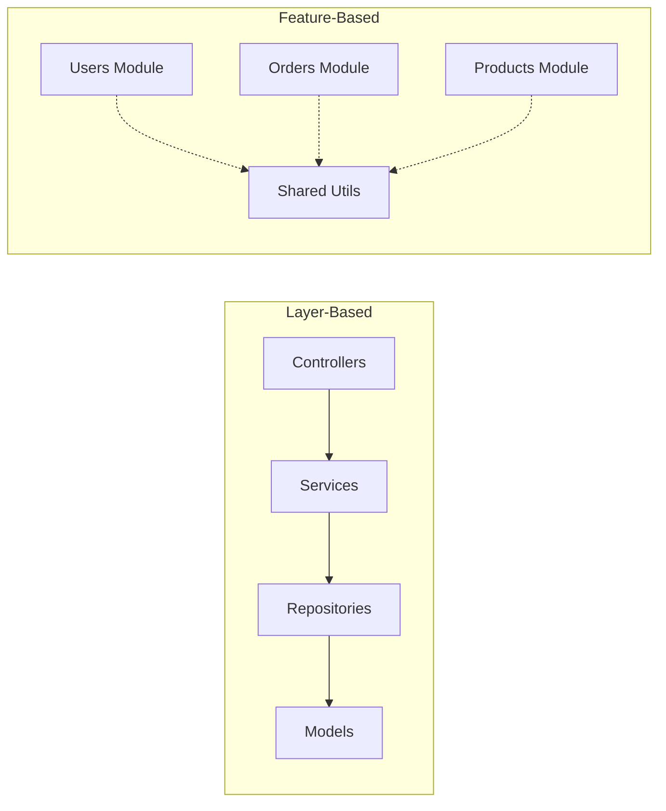
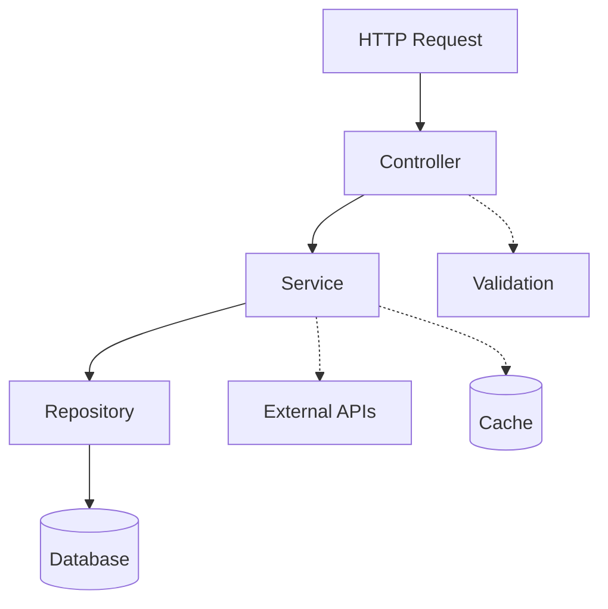
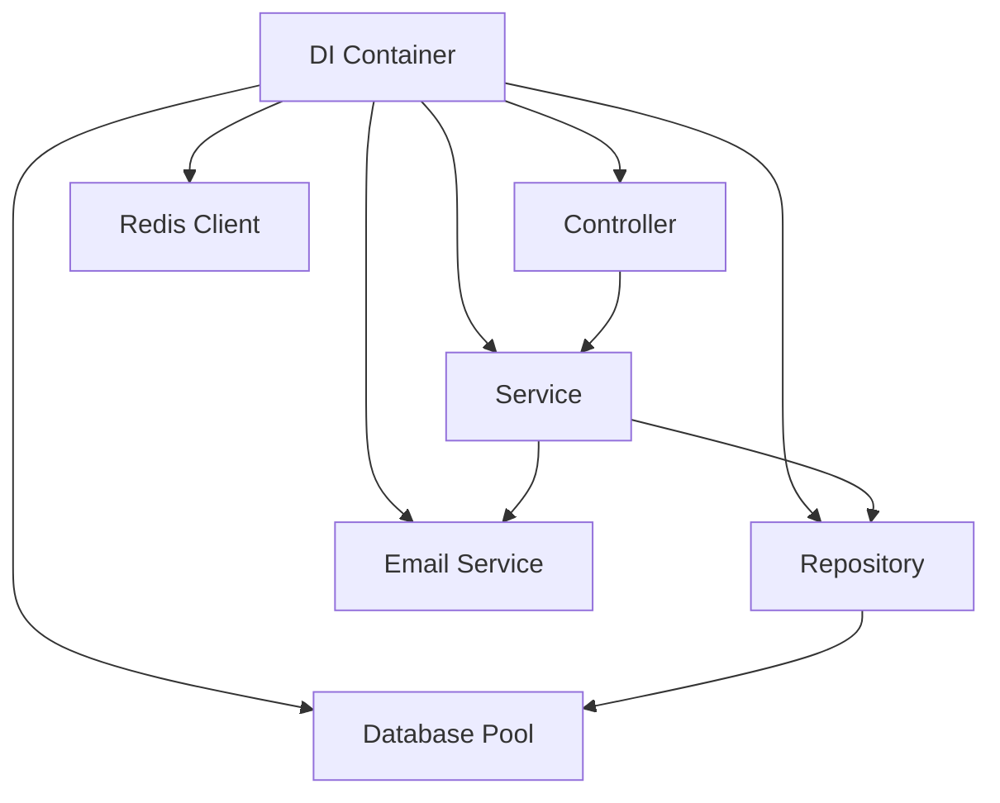
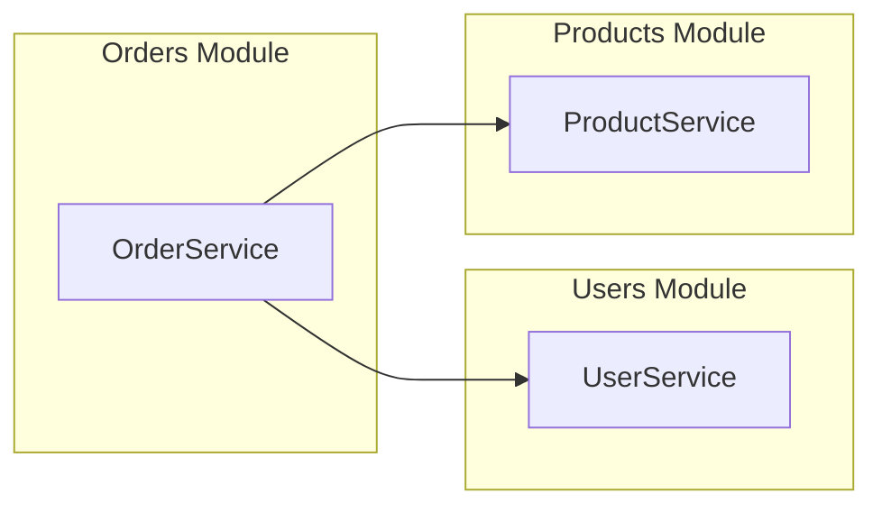
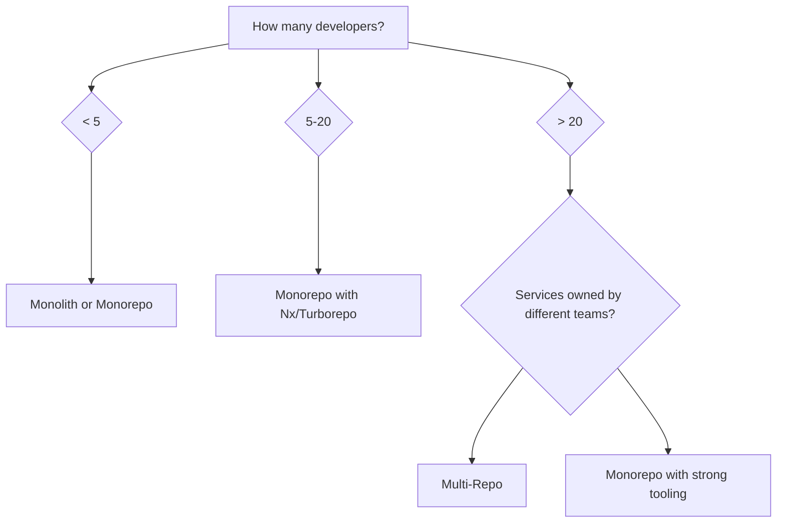
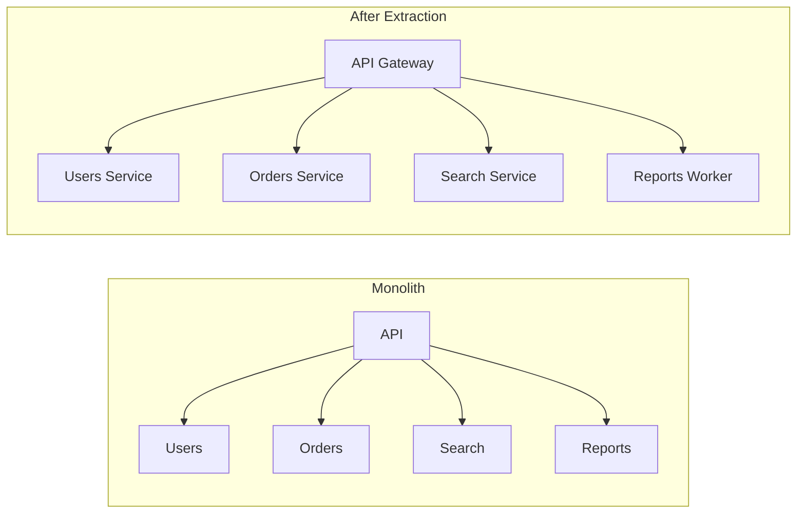

# How to Structure Large Node.js Applications

Author: [nawazdhandala](https://www.github.com/nawazdhandala)

Tags: NodeJS, Architecture, Software Development, Backend, TypeScript

Description: A practical guide to organizing Node.js codebases that scale - covering layered architecture, dependency injection, module organization, and monorepo strategies.

---

Small Node.js projects are easy. Throw everything in a few files, export some functions, and you're done. But once your application grows beyond a handful of routes and a couple of database models, the lack of structure starts hurting. Developers step on each other's toes, bugs hide in unexpected places, and onboarding new team members takes weeks instead of days.

This guide covers battle-tested patterns for structuring Node.js applications that need to scale - whether you're building a monolith, a service in a microservices architecture, or something in between.

## The Problem with "No Structure"

Most Node.js tutorials show you how to build a CRUD app in 50 lines. That's fine for learning, but real applications end up looking like this:

```
app/
  index.js        # 2000 lines of routes, business logic, and database calls
  utils.js        # 800 lines of "helper" functions
  db.js           # Raw SQL mixed with ORM calls
  config.js       # Environment variables and hardcoded values
```

The symptoms show up fast:
- Changing one feature breaks three others
- Tests are impossible to write (or don't exist)
- Two developers can't work on different features without merge conflicts
- "Where does this code go?" becomes a daily question

## Project Structure Patterns

There are two main approaches to organizing a Node.js codebase: by technical role (MVC-style) or by feature/domain.

### Pattern 1: Layer-Based Structure

Group code by what it does technically - controllers, services, repositories.

```
src/
  controllers/
    user.controller.ts
    order.controller.ts
    product.controller.ts
  services/
    user.service.ts
    order.service.ts
    product.service.ts
  repositories/
    user.repository.ts
    order.repository.ts
    product.repository.ts
  models/
    user.model.ts
    order.model.ts
    product.model.ts
  routes/
    user.routes.ts
    order.routes.ts
    index.ts
  middleware/
    auth.middleware.ts
    validation.middleware.ts
  config/
    database.ts
    app.ts
  index.ts
```

This works well for smaller applications where the team is comfortable with MVC patterns. The downside is that working on a single feature requires touching files across multiple directories.

### Pattern 2: Feature-Based Structure

Group code by business domain - everything related to users lives together.

```
src/
  modules/
    users/
      user.controller.ts
      user.service.ts
      user.repository.ts
      user.model.ts
      user.routes.ts
      user.validation.ts
      user.types.ts
      __tests__/
        user.service.test.ts
        user.controller.test.ts
    orders/
      order.controller.ts
      order.service.ts
      order.repository.ts
      order.model.ts
      order.routes.ts
      order.validation.ts
      order.types.ts
      __tests__/
    products/
      ...
  shared/
    middleware/
    utils/
    types/
  config/
  index.ts
```

Feature-based structure scales better for larger teams. Each module is self-contained, reducing cognitive load and merge conflicts. The tradeoff is some code duplication and slightly more complex imports.

### Visual Comparison



## Layered Architecture in Practice

Regardless of folder structure, large applications benefit from clear separation of concerns through layers.



### Layer Responsibilities

| Layer | Responsibility | Knows About |
|-------|---------------|-------------|
| Controller | HTTP handling, request/response transformation | Service |
| Service | Business logic, orchestration, transactions | Repository, External APIs |
| Repository | Data access, query building | Database/ORM |
| Model | Data structure, validation rules | Nothing |

### Controller Layer

Controllers handle HTTP concerns only - parsing requests, calling services, formatting responses.

```typescript
// src/modules/users/user.controller.ts
import { Request, Response, NextFunction } from 'express';
import { UserService } from './user.service';
import { CreateUserDto, UpdateUserDto } from './user.types';

export class UserController {
  constructor(private userService: UserService) {}

  // Handle HTTP request, delegate to service, return HTTP response
  async create(req: Request, res: Response, next: NextFunction) {
    try {
      const dto: CreateUserDto = req.body;
      const user = await this.userService.createUser(dto);
      res.status(201).json(user);
    } catch (error) {
      next(error);
    }
  }

  async getById(req: Request, res: Response, next: NextFunction) {
    try {
      const user = await this.userService.findById(req.params.id);
      if (!user) {
        return res.status(404).json({ error: 'User not found' });
      }
      res.json(user);
    } catch (error) {
      next(error);
    }
  }

  async update(req: Request, res: Response, next: NextFunction) {
    try {
      const dto: UpdateUserDto = req.body;
      const user = await this.userService.updateUser(req.params.id, dto);
      res.json(user);
    } catch (error) {
      next(error);
    }
  }
}
```

### Service Layer

Services contain business logic. They don't know about HTTP or database specifics.

```typescript
// src/modules/users/user.service.ts
import { UserRepository } from './user.repository';
import { EmailService } from '../../shared/services/email.service';
import { CreateUserDto, UpdateUserDto, User } from './user.types';
import { ConflictError, NotFoundError } from '../../shared/errors';

export class UserService {
  constructor(
    private userRepository: UserRepository,
    private emailService: EmailService
  ) {}

  // Business logic lives here - validation, orchestration, rules
  async createUser(dto: CreateUserDto): Promise<User> {
    // Check business rules
    const existing = await this.userRepository.findByEmail(dto.email);
    if (existing) {
      throw new ConflictError('Email already registered');
    }

    // Create the user
    const user = await this.userRepository.create({
      ...dto,
      createdAt: new Date(),
      status: 'pending',
    });

    // Side effects
    await this.emailService.sendWelcomeEmail(user.email, user.name);

    return user;
  }

  async findById(id: string): Promise<User | null> {
    return this.userRepository.findById(id);
  }

  async updateUser(id: string, dto: UpdateUserDto): Promise<User> {
    const user = await this.userRepository.findById(id);
    if (!user) {
      throw new NotFoundError('User not found');
    }

    return this.userRepository.update(id, dto);
  }
}
```

### Repository Layer

Repositories handle data access. They translate between your domain objects and database operations.

```typescript
// src/modules/users/user.repository.ts
import { Pool } from 'pg';
import { User, CreateUserData, UpdateUserDto } from './user.types';

export class UserRepository {
  constructor(private db: Pool) {}

  // Data access only - no business logic
  async findById(id: string): Promise<User | null> {
    const result = await this.db.query(
      'SELECT id, email, name, status, created_at FROM users WHERE id = $1',
      [id]
    );
    return result.rows[0] || null;
  }

  async findByEmail(email: string): Promise<User | null> {
    const result = await this.db.query(
      'SELECT id, email, name, status, created_at FROM users WHERE email = $1',
      [email]
    );
    return result.rows[0] || null;
  }

  async create(data: CreateUserData): Promise<User> {
    const result = await this.db.query(
      `INSERT INTO users (email, name, status, created_at)
       VALUES ($1, $2, $3, $4)
       RETURNING id, email, name, status, created_at`,
      [data.email, data.name, data.status, data.createdAt]
    );
    return result.rows[0];
  }

  async update(id: string, data: UpdateUserDto): Promise<User> {
    const fields = Object.keys(data);
    const values = Object.values(data);
    const setClause = fields.map((f, i) => `${f} = $${i + 2}`).join(', ');

    const result = await this.db.query(
      `UPDATE users SET ${setClause} WHERE id = $1
       RETURNING id, email, name, status, created_at`,
      [id, ...values]
    );
    return result.rows[0];
  }
}
```

## Dependency Injection

Hard-coded dependencies make testing painful and coupling tight. Dependency injection solves this.

### The Problem

```typescript
// Bad: Hard-coded dependencies
class UserService {
  private repository = new UserRepository();  // Can't mock this
  private emailService = new EmailService();  // Can't mock this either
}
```

### Manual Dependency Injection

The simplest approach - pass dependencies through constructors.

```typescript
// Good: Dependencies injected through constructor
class UserService {
  constructor(
    private repository: UserRepository,
    private emailService: EmailService
  ) {}
}

// Wire everything up in a composition root
function createApp() {
  const db = new Pool({ connectionString: process.env.DATABASE_URL });

  // Repositories
  const userRepository = new UserRepository(db);
  const orderRepository = new OrderRepository(db);

  // Services
  const emailService = new EmailService();
  const userService = new UserService(userRepository, emailService);
  const orderService = new OrderService(orderRepository, userService);

  // Controllers
  const userController = new UserController(userService);
  const orderController = new OrderController(orderService);

  return { userController, orderController };
}
```

### Using a DI Container

For larger applications, a DI container reduces boilerplate. Here's an example with tsyringe:

```typescript
// src/container.ts
import 'reflect-metadata';
import { container } from 'tsyringe';
import { Pool } from 'pg';

// Register the database connection
container.register('Database', {
  useFactory: () => new Pool({ connectionString: process.env.DATABASE_URL })
});

export { container };

// src/modules/users/user.repository.ts
import { injectable, inject } from 'tsyringe';
import { Pool } from 'pg';

@injectable()
export class UserRepository {
  constructor(@inject('Database') private db: Pool) {}
  // ... methods
}

// src/modules/users/user.service.ts
import { injectable } from 'tsyringe';

@injectable()
export class UserService {
  constructor(
    private userRepository: UserRepository,
    private emailService: EmailService
  ) {}
  // ... methods
}

// Usage
import { container } from './container';
const userService = container.resolve(UserService);
```

### Dependency Flow



## Module Organization

Each module should have a clear public interface. Other modules interact through that interface, not by reaching into internal files.

```typescript
// src/modules/users/index.ts
// This is the module's public API

export { UserService } from './user.service';
export { UserController } from './user.controller';
export { userRoutes } from './user.routes';
export type { User, CreateUserDto, UpdateUserDto } from './user.types';

// Internal implementation details are NOT exported
// user.repository.ts - internal
// user.validation.ts - internal
```

Other modules import from the index:

```typescript
// src/modules/orders/order.service.ts
import { UserService, User } from '../users';  // Clean import

// Not this:
// import { UserRepository } from '../users/user.repository';  // Breaks encapsulation
```

### Module Communication Patterns



For async communication between modules, use events:

```typescript
// src/shared/events/event-bus.ts
import { EventEmitter } from 'events';

export const eventBus = new EventEmitter();

// src/modules/users/user.service.ts
import { eventBus } from '../../shared/events/event-bus';

async createUser(dto: CreateUserDto): Promise<User> {
  const user = await this.userRepository.create(dto);

  // Emit event instead of calling other services directly
  eventBus.emit('user.created', { userId: user.id, email: user.email });

  return user;
}

// src/modules/notifications/notification.listener.ts
import { eventBus } from '../../shared/events/event-bus';

eventBus.on('user.created', async (data) => {
  await sendWelcomeEmail(data.email);
});
```

## Configuration Management

Configuration should be centralized, validated at startup, and strongly typed.

```typescript
// src/config/index.ts
import { z } from 'zod';

// Define the schema for all configuration
const configSchema = z.object({
  nodeEnv: z.enum(['development', 'test', 'production']),
  port: z.number().default(3000),

  database: z.object({
    host: z.string(),
    port: z.number().default(5432),
    name: z.string(),
    user: z.string(),
    password: z.string(),
    poolSize: z.number().default(10),
  }),

  redis: z.object({
    url: z.string(),
  }),

  jwt: z.object({
    secret: z.string().min(32),
    expiresIn: z.string().default('7d'),
  }),

  email: z.object({
    provider: z.enum(['sendgrid', 'ses', 'smtp']),
    apiKey: z.string().optional(),
    from: z.string().email(),
  }),
});

type Config = z.infer<typeof configSchema>;

// Load and validate configuration
function loadConfig(): Config {
  const config = {
    nodeEnv: process.env.NODE_ENV,
    port: parseInt(process.env.PORT || '3000', 10),

    database: {
      host: process.env.DB_HOST,
      port: parseInt(process.env.DB_PORT || '5432', 10),
      name: process.env.DB_NAME,
      user: process.env.DB_USER,
      password: process.env.DB_PASSWORD,
      poolSize: parseInt(process.env.DB_POOL_SIZE || '10', 10),
    },

    redis: {
      url: process.env.REDIS_URL,
    },

    jwt: {
      secret: process.env.JWT_SECRET,
      expiresIn: process.env.JWT_EXPIRES_IN || '7d',
    },

    email: {
      provider: process.env.EMAIL_PROVIDER,
      apiKey: process.env.EMAIL_API_KEY,
      from: process.env.EMAIL_FROM,
    },
  };

  // Validate and throw if invalid - fail fast at startup
  const result = configSchema.safeParse(config);
  if (!result.success) {
    console.error('Configuration validation failed:');
    console.error(result.error.format());
    process.exit(1);
  }

  return result.data;
}

// Export singleton config object
export const config = loadConfig();
```

### Environment-Specific Overrides

```typescript
// src/config/environments/development.ts
export const developmentConfig = {
  database: {
    poolSize: 5,  // Smaller pool for development
  },
  logging: {
    level: 'debug',
  },
};

// src/config/environments/production.ts
export const productionConfig = {
  database: {
    poolSize: 20,
  },
  logging: {
    level: 'info',
  },
};
```

## Monorepo vs Multi-Repo

When your application grows into multiple services, you need to decide how to organize the code.

### Single Repo (Monolith)

Everything in one repository.

```
my-app/
  src/
  package.json
```

**Pros:** Simple, easy refactoring, single CI pipeline
**Cons:** Scales poorly with team size, long CI times

### Monorepo

Multiple packages in one repository.

```
my-platform/
  packages/
    api/
      package.json
    worker/
      package.json
    shared/
      package.json
    web/
      package.json
  package.json
  pnpm-workspace.yaml
```

**Pros:** Shared code is easy, atomic changes across packages, single source of truth
**Cons:** Requires tooling (Nx, Turborepo, Lerna), complex CI

### Multi-Repo

Each service in its own repository.

```
api-service/        (separate repo)
worker-service/     (separate repo)
shared-library/     (separate repo, published to npm)
web-app/            (separate repo)
```

**Pros:** Independent deployments, clear ownership, simpler repos
**Cons:** Sharing code requires publishing packages, harder to make cross-repo changes

### Decision Framework



### Monorepo Setup with pnpm

```yaml
# pnpm-workspace.yaml
packages:
  - 'packages/*'
  - 'apps/*'
```

```json
// packages/shared/package.json
{
  "name": "@myorg/shared",
  "version": "1.0.0",
  "main": "dist/index.js",
  "types": "dist/index.d.ts"
}

// apps/api/package.json
{
  "name": "@myorg/api",
  "dependencies": {
    "@myorg/shared": "workspace:*"
  }
}
```

## Scaling Considerations

As your application grows, structure decisions impact performance and maintainability.

### Horizontal Scaling Readiness

Design services to be stateless from day one:

```typescript
// Bad: In-memory state
const userSessions = new Map();  // Lost on restart, not shared across instances

// Good: External state store
class SessionService {
  constructor(private redis: Redis) {}

  async setSession(userId: string, data: SessionData) {
    await this.redis.setex(`session:${userId}`, 3600, JSON.stringify(data));
  }

  async getSession(userId: string): Promise<SessionData | null> {
    const data = await this.redis.get(`session:${userId}`);
    return data ? JSON.parse(data) : null;
  }
}
```

### Background Job Extraction

Move heavy operations out of request handlers:

```typescript
// Instead of processing in the request
app.post('/reports', async (req, res) => {
  const report = await generateReport(req.body);  // Takes 30 seconds
  res.json(report);
});

// Queue the work and return immediately
app.post('/reports', async (req, res) => {
  const jobId = await jobQueue.add('generate-report', req.body);
  res.status(202).json({ jobId, status: 'queued' });
});

// Check status
app.get('/reports/:jobId', async (req, res) => {
  const job = await jobQueue.getJob(req.params.jobId);
  res.json({
    status: job.status,
    result: job.status === 'completed' ? job.result : null,
  });
});
```

### Service Extraction Patterns

When a module becomes too large or needs independent scaling:



Signs a module should become a service:
- Different scaling requirements (Search needs more CPU)
- Different deployment cadence (Reports changes rarely)
- Clear domain boundary (minimal dependencies on other modules)
- Team ownership alignment (team A owns Search)

## Error Handling Strategy

Consistent error handling across layers:

```typescript
// src/shared/errors/index.ts
export class AppError extends Error {
  constructor(
    message: string,
    public statusCode: number = 500,
    public code: string = 'INTERNAL_ERROR'
  ) {
    super(message);
    this.name = this.constructor.name;
  }
}

export class NotFoundError extends AppError {
  constructor(message = 'Resource not found') {
    super(message, 404, 'NOT_FOUND');
  }
}

export class ValidationError extends AppError {
  constructor(message: string, public details?: Record<string, string[]>) {
    super(message, 400, 'VALIDATION_ERROR');
  }
}

export class ConflictError extends AppError {
  constructor(message: string) {
    super(message, 409, 'CONFLICT');
  }
}

// src/shared/middleware/error-handler.ts
export function errorHandler(err: Error, req: Request, res: Response, next: NextFunction) {
  if (err instanceof AppError) {
    return res.status(err.statusCode).json({
      error: {
        code: err.code,
        message: err.message,
        details: (err as ValidationError).details,
      },
    });
  }

  // Log unexpected errors
  console.error('Unexpected error:', err);

  res.status(500).json({
    error: {
      code: 'INTERNAL_ERROR',
      message: 'An unexpected error occurred',
    },
  });
}
```

## Testing Strategy

Structure enables testing. Each layer can be tested in isolation.

```typescript
// Unit test - service layer with mocked dependencies
describe('UserService', () => {
  let userService: UserService;
  let mockRepository: jest.Mocked<UserRepository>;
  let mockEmailService: jest.Mocked<EmailService>;

  beforeEach(() => {
    mockRepository = {
      findById: jest.fn(),
      findByEmail: jest.fn(),
      create: jest.fn(),
    } as any;

    mockEmailService = {
      sendWelcomeEmail: jest.fn(),
    } as any;

    userService = new UserService(mockRepository, mockEmailService);
  });

  it('should create user and send welcome email', async () => {
    mockRepository.findByEmail.mockResolvedValue(null);
    mockRepository.create.mockResolvedValue({ id: '1', email: 'test@example.com' });

    await userService.createUser({ email: 'test@example.com', name: 'Test' });

    expect(mockRepository.create).toHaveBeenCalled();
    expect(mockEmailService.sendWelcomeEmail).toHaveBeenCalledWith(
      'test@example.com',
      'Test'
    );
  });

  it('should throw conflict error if email exists', async () => {
    mockRepository.findByEmail.mockResolvedValue({ id: '1' });

    await expect(
      userService.createUser({ email: 'test@example.com', name: 'Test' })
    ).rejects.toThrow(ConflictError);
  });
});

// Integration test - repository with real database
describe('UserRepository', () => {
  let repository: UserRepository;
  let db: Pool;

  beforeAll(async () => {
    db = new Pool({ connectionString: process.env.TEST_DATABASE_URL });
    repository = new UserRepository(db);
  });

  afterAll(async () => {
    await db.end();
  });

  beforeEach(async () => {
    await db.query('TRUNCATE users CASCADE');
  });

  it('should create and retrieve user', async () => {
    const created = await repository.create({
      email: 'test@example.com',
      name: 'Test User',
      status: 'active',
      createdAt: new Date(),
    });

    const found = await repository.findById(created.id);

    expect(found).toMatchObject({
      email: 'test@example.com',
      name: 'Test User',
    });
  });
});
```

## Summary

| Aspect | Small App | Medium App | Large App |
|--------|-----------|------------|-----------|
| Structure | Layer-based | Feature-based | Feature-based with clear modules |
| DI | Manual | Manual or container | Container |
| Configuration | Simple env vars | Validated config object | Validated + environment-specific |
| Repository | Single | Monorepo | Monorepo or multi-repo |
| Testing | E2E | Unit + integration | Unit + integration + E2E |

The key principles remain constant regardless of size:

1. **Separate concerns** - Controllers handle HTTP, services handle logic, repositories handle data
2. **Inject dependencies** - Makes testing possible and coupling loose
3. **Define clear interfaces** - Modules expose public APIs, hide implementation details
4. **Validate early** - Configuration at startup, requests at the boundary
5. **Plan for growth** - Stateless design, external state stores, queue-based async work

Start simple and add structure as complexity demands it. Over-engineering a small application is just as painful as under-engineering a large one.
