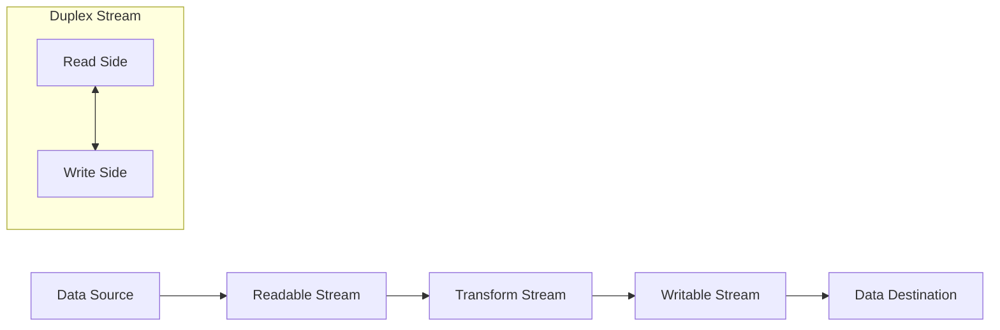
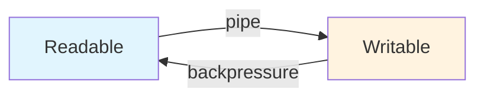
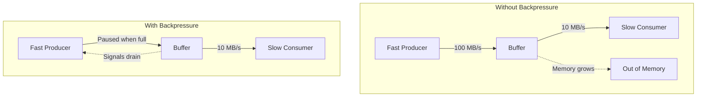

# How to Use Node.js Streams Effectively

Author: [nawazdhandala](https://www.github.com/nawazdhandala)

Tags: NodeJS, Performance, Backend, DevOps

Description: Master Node.js streams for efficient memory usage and data processing - covering stream types, piping, backpressure, custom streams, and real-world file processing patterns.

---

When you need to process a 2GB log file, loading it entirely into memory is not an option. Node.js streams let you process data piece by piece, keeping memory usage constant regardless of file size. Instead of waiting for all data to load, you start processing immediately as chunks arrive.

Streams are everywhere in Node.js - HTTP requests, file operations, compression, cryptography, and TCP sockets all use the stream interface. Understanding streams unlocks efficient data processing patterns that scale gracefully.

## The Four Stream Types

Node.js provides four fundamental stream types. Each serves a specific purpose in the data flow pipeline.



| Stream Type | Description | Examples |
|-------------|-------------|----------|
| Readable | Data source you read from | `fs.createReadStream`, HTTP response body, `process.stdin` |
| Writable | Data sink you write to | `fs.createWriteStream`, HTTP request body, `process.stdout` |
| Duplex | Both readable and writable (independent) | TCP socket, WebSocket connection |
| Transform | Duplex that modifies data passing through | `zlib.createGzip`, `crypto.createCipher` |

## Reading Data with Readable Streams

Readable streams operate in two modes: flowing and paused. In flowing mode, data is pushed to you automatically. In paused mode, you explicitly request chunks with `read()`.

### Flowing Mode with Events

The simplest way to consume a readable stream is listening to the `data` event. This puts the stream in flowing mode where chunks arrive automatically.

```javascript
const fs = require('fs');

// Create a readable stream from a file
// The stream reads the file in chunks (default 64KB) instead of loading it all at once
const readStream = fs.createReadStream('./large-file.txt', {
  encoding: 'utf8',    // Decode bytes to string
  highWaterMark: 64 * 1024  // Chunk size in bytes (64KB)
});

let totalBytes = 0;

// 'data' event fires for each chunk - stream enters flowing mode automatically
readStream.on('data', (chunk) => {
  totalBytes += chunk.length;
  console.log(`Received chunk: ${chunk.length} bytes`);
});

// 'end' event fires when all data has been read
readStream.on('end', () => {
  console.log(`Total bytes read: ${totalBytes}`);
});

// Always handle errors - unhandled stream errors crash the process
readStream.on('error', (err) => {
  console.error('Stream error:', err.message);
});
```

### Paused Mode with read()

For more control, use paused mode with the `readable` event. This lets you decide when to pull the next chunk, which is useful when you need to pace consumption.

```javascript
const fs = require('fs');

const readStream = fs.createReadStream('./data.json', {
  encoding: 'utf8'
});

// 'readable' event signals data is available to read
// Stream stays in paused mode - you control when to consume
readStream.on('readable', () => {
  let chunk;

  // read() returns null when no more data is currently available
  // Keep reading until the internal buffer is drained
  while ((chunk = readStream.read()) !== null) {
    console.log(`Processing chunk of ${chunk.length} bytes`);
    processChunk(chunk);
  }
});

readStream.on('end', () => {
  console.log('Finished reading');
});
```

## Writing Data with Writable Streams

Writable streams accept data and write it to a destination. The key challenge is handling backpressure - what happens when you write faster than the destination can consume.

### Basic Writing

The `write()` method sends data to the stream. It returns a boolean indicating whether you should continue writing or wait for the stream to drain.

```javascript
const fs = require('fs');

// Create a writable stream to a file
const writeStream = fs.createWriteStream('./output.txt');

// write() returns false when internal buffer is full (backpressure signal)
const canContinue = writeStream.write('First chunk of data\n');

// Write more data - each call adds to the internal buffer
writeStream.write('Second chunk of data\n');
writeStream.write('Third chunk of data\n');

// end() writes final data (optional) and closes the stream
// No more writes allowed after calling end()
writeStream.end('Final chunk\n');

// 'finish' event fires when all data has been flushed to the underlying system
writeStream.on('finish', () => {
  console.log('All data written to disk');
});

writeStream.on('error', (err) => {
  console.error('Write error:', err.message);
});
```

### Handling Backpressure Correctly

Ignoring the return value of `write()` causes memory to balloon as data queues up faster than it drains. Proper backpressure handling waits for the `drain` event before continuing.

```javascript
const fs = require('fs');

const writeStream = fs.createWriteStream('./large-output.txt');
const dataChunks = generateLargeDataset(); // Imagine millions of records

async function writeAllData() {
  for (const chunk of dataChunks) {
    // write() returns false when the internal buffer exceeds highWaterMark
    const canContinue = writeStream.write(chunk);

    if (!canContinue) {
      // Buffer is full - pause and wait for it to drain
      // This prevents memory from growing unbounded
      await new Promise(resolve => writeStream.once('drain', resolve));
    }
  }

  // Signal no more data will be written
  writeStream.end();
}

writeAllData().catch(console.error);
```

## Connecting Streams with pipe()

The `pipe()` method connects a readable stream to a writable stream, automatically handling backpressure. This is the most common way to use streams.



### Basic Piping

Pipe connects streams and manages flow control automatically. When the writable stream is overwhelmed, pipe pauses the readable stream until it drains.

```javascript
const fs = require('fs');

const readStream = fs.createReadStream('./source.txt');
const writeStream = fs.createWriteStream('./destination.txt');

// pipe() does three things:
// 1. Forwards all data from readable to writable
// 2. Handles backpressure automatically (pauses/resumes readable)
// 3. Returns the destination stream for chaining
readStream.pipe(writeStream);

// Note: pipe does NOT forward errors or close the readable stream
writeStream.on('finish', () => {
  console.log('Copy complete');
});

// You must handle errors on both streams
readStream.on('error', (err) => console.error('Read error:', err));
writeStream.on('error', (err) => console.error('Write error:', err));
```

### Chaining Multiple Transforms

Pipe returns the destination stream, enabling you to chain multiple transforms together. Data flows through each stage in sequence.

```javascript
const fs = require('fs');
const zlib = require('zlib');
const crypto = require('crypto');

// Chain: read file -> compress -> encrypt -> write to new file
// Each stage processes chunks as they flow through
fs.createReadStream('./data.json')
  .pipe(zlib.createGzip())         // Compress with gzip
  .pipe(crypto.createCipheriv(     // Encrypt the compressed data
    'aes-256-cbc',
    secretKey,
    initVector
  ))
  .pipe(fs.createWriteStream('./data.json.gz.enc'))
  .on('finish', () => {
    console.log('Compressed and encrypted');
  });
```

## Using pipeline() for Robust Error Handling

The `pipe()` method has a critical flaw: errors do not propagate through the chain, and streams may not be properly cleaned up on failure. The `pipeline()` function from `stream` module solves both problems.

```javascript
const { pipeline } = require('stream');
const fs = require('fs');
const zlib = require('zlib');

// pipeline() properly handles errors and cleanup across all streams
// When any stream errors, all streams are destroyed and callback fires
pipeline(
  fs.createReadStream('./input.txt'),
  zlib.createGzip(),
  fs.createWriteStream('./input.txt.gz'),
  (err) => {
    if (err) {
      console.error('Pipeline failed:', err.message);
    } else {
      console.log('Pipeline succeeded');
    }
  }
);
```

### Promise-based Pipeline

For async/await workflows, use the promisified version. This is the recommended approach for modern Node.js code.

```javascript
const { pipeline } = require('stream/promises');
const fs = require('fs');
const zlib = require('zlib');

async function compressFile(input, output) {
  try {
    // Promisified pipeline - await resolves when complete, rejects on error
    await pipeline(
      fs.createReadStream(input),
      zlib.createGzip(),
      fs.createWriteStream(output)
    );
    console.log('Compression complete');
  } catch (err) {
    console.error('Compression failed:', err.message);
    throw err;
  }
}

compressFile('./logs.txt', './logs.txt.gz');
```

## Understanding Backpressure

Backpressure is the mechanism that prevents fast producers from overwhelming slow consumers. Without it, memory grows unbounded as data queues up faster than it can be processed.



### How Backpressure Works

When you write to a stream, data goes into an internal buffer. When this buffer exceeds `highWaterMark`, `write()` returns `false`, signaling you should stop. When the buffer drains below the threshold, the `drain` event fires, and you can resume.

```javascript
const { Writable } = require('stream');

// Custom writable that simulates slow processing
const slowConsumer = new Writable({
  highWaterMark: 16 * 1024,  // 16KB buffer threshold

  write(chunk, encoding, callback) {
    // Simulate slow processing - 100ms per chunk
    setTimeout(() => {
      console.log(`Processed ${chunk.length} bytes`);
      callback();  // Signal ready for next chunk
    }, 100);
  }
});

// Demonstrate backpressure in action
let writes = 0;
let drains = 0;

slowConsumer.on('drain', () => {
  drains++;
  console.log(`Drain event #${drains} - buffer cleared, can write again`);
});

// Write rapidly until backpressure kicks in
const chunk = Buffer.alloc(1024, 'x');  // 1KB chunk

function writeUntilFull() {
  let ok = true;

  while (ok && writes < 100) {
    writes++;
    ok = slowConsumer.write(chunk);  // false when buffer is full

    if (!ok) {
      console.log(`Backpressure at write #${writes} - waiting for drain`);
    }
  }

  if (writes < 100) {
    // Wait for drain before continuing
    slowConsumer.once('drain', writeUntilFull);
  } else {
    slowConsumer.end();
  }
}

writeUntilFull();
```

## Creating Custom Streams

Sometimes built-in streams are not enough. Node.js makes it straightforward to create custom streams for your specific use cases.

### Custom Readable Stream

Create a readable stream by extending `Readable` and implementing the `_read()` method. This method is called when the consumer wants more data.

```javascript
const { Readable } = require('stream');

// Custom readable that generates a sequence of numbers
class NumberStream extends Readable {
  constructor(max, options) {
    super(options);
    this.max = max;
    this.current = 0;
  }

  // _read is called when the consumer wants more data
  // Push data into the internal buffer, push null to signal end
  _read() {
    if (this.current >= this.max) {
      // Push null signals end of stream - no more data
      this.push(null);
      return;
    }

    // Generate next chunk of numbers
    const numbers = [];
    for (let i = 0; i < 10 && this.current < this.max; i++) {
      numbers.push(this.current++);
    }

    // Push stringified data into the stream buffer
    // Consumer receives this on next 'data' event or read() call
    this.push(JSON.stringify(numbers) + '\n');
  }
}

// Usage - stream 100 numbers in batches of 10
const numberStream = new NumberStream(100);

numberStream.on('data', (chunk) => {
  console.log('Received:', chunk.toString().trim());
});

numberStream.on('end', () => {
  console.log('Stream complete');
});
```

### Custom Writable Stream

Create a writable stream by extending `Writable` and implementing the `_write()` method. Call the callback when you are ready for the next chunk.

```javascript
const { Writable } = require('stream');
const fs = require('fs');

// Custom writable that batches writes to reduce I/O operations
class BatchWriter extends Writable {
  constructor(filePath, batchSize = 100, options) {
    super(options);
    this.filePath = filePath;
    this.batchSize = batchSize;
    this.batch = [];
    this.fd = null;
  }

  // Called before first write - open the file
  _construct(callback) {
    fs.open(this.filePath, 'w', (err, fd) => {
      if (err) {
        callback(err);
        return;
      }
      this.fd = fd;
      callback();
    });
  }

  // Called for each write() call - accumulate in batch, flush when full
  _write(chunk, encoding, callback) {
    this.batch.push(chunk.toString());

    if (this.batch.length >= this.batchSize) {
      // Batch is full - flush to disk
      this.flush(callback);
    } else {
      // Batch not full yet - ready for next chunk
      callback();
    }
  }

  // Flush accumulated batch to disk
  flush(callback) {
    if (this.batch.length === 0) {
      callback();
      return;
    }

    const data = this.batch.join('');
    this.batch = [];

    fs.write(this.fd, data, callback);
  }

  // Called when stream ends - flush remaining data and close file
  _final(callback) {
    this.flush((err) => {
      if (err) {
        callback(err);
        return;
      }
      fs.close(this.fd, callback);
    });
  }
}

// Usage
const writer = new BatchWriter('./output.txt', 50);

for (let i = 0; i < 200; i++) {
  writer.write(`Line ${i}\n`);
}

writer.end();
writer.on('finish', () => console.log('Done'));
```

### Custom Transform Stream

Transform streams modify data as it passes through. Implement `_transform()` to process each chunk and optionally `_flush()` for finalization.

```javascript
const { Transform } = require('stream');

// Transform that converts JSON lines to CSV
class JsonToCsvTransform extends Transform {
  constructor(options) {
    super(options);
    this.headerWritten = false;
    this.buffer = '';  // Handle partial lines
  }

  _transform(chunk, encoding, callback) {
    // Append chunk to buffer and split by newlines
    this.buffer += chunk.toString();
    const lines = this.buffer.split('\n');

    // Keep last element - might be incomplete line
    this.buffer = lines.pop();

    try {
      for (const line of lines) {
        if (!line.trim()) continue;

        const obj = JSON.parse(line);

        // Write CSV header from first object's keys
        if (!this.headerWritten) {
          this.push(Object.keys(obj).join(',') + '\n');
          this.headerWritten = true;
        }

        // Write CSV row - escape values containing commas
        const values = Object.values(obj).map(v => {
          const str = String(v);
          return str.includes(',') ? `"${str}"` : str;
        });
        this.push(values.join(',') + '\n');
      }

      callback();
    } catch (err) {
      callback(err);
    }
  }

  // _flush is called when input ends - process any remaining buffered data
  _flush(callback) {
    if (this.buffer.trim()) {
      try {
        const obj = JSON.parse(this.buffer);
        const values = Object.values(obj).map(String);
        this.push(values.join(',') + '\n');
        callback();
      } catch (err) {
        callback(err);
      }
    } else {
      callback();
    }
  }
}

// Usage - convert JSON lines file to CSV
const { pipeline } = require('stream/promises');
const fs = require('fs');

async function convertJsonToCsv(inputPath, outputPath) {
  await pipeline(
    fs.createReadStream(inputPath),
    new JsonToCsvTransform(),
    fs.createWriteStream(outputPath)
  );
}
```

## Practical Examples

### Processing Large Log Files

Parse and filter a multi-gigabyte log file without loading it into memory. Each line is processed independently as it streams through.

```javascript
const { pipeline } = require('stream/promises');
const { Transform } = require('stream');
const fs = require('fs');
const readline = require('readline');

// Transform that filters log lines by severity and extracts fields
class LogFilterTransform extends Transform {
  constructor(minLevel, options) {
    super({ ...options, objectMode: true });
    this.minLevel = minLevel;
    this.levels = { DEBUG: 0, INFO: 1, WARN: 2, ERROR: 3 };
  }

  _transform(line, encoding, callback) {
    // Parse log line format: "2024-01-15T10:30:00Z [ERROR] Message here"
    const match = line.match(/^(\S+)\s+\[(\w+)\]\s+(.+)$/);

    if (!match) {
      callback();  // Skip malformed lines
      return;
    }

    const [, timestamp, level, message] = match;

    // Filter by minimum severity level
    if (this.levels[level] >= this.levels[this.minLevel]) {
      this.push({
        timestamp: new Date(timestamp),
        level,
        message
      });
    }

    callback();
  }
}

async function analyzeErrorLogs(logPath) {
  const errors = [];

  // Create readline interface for line-by-line reading
  const rl = readline.createInterface({
    input: fs.createReadStream(logPath),
    crlfDelay: Infinity  // Handle both \n and \r\n
  });

  const filter = new LogFilterTransform('ERROR');

  // Process each line through the filter
  for await (const line of rl) {
    // Manually push through transform
    filter.write(line);
  }
  filter.end();

  // Collect filtered results
  for await (const entry of filter) {
    errors.push(entry);
  }

  return errors;
}

// Alternative: Using pipeline for full stream processing
async function filterLogsToFile(inputPath, outputPath, minLevel) {
  await pipeline(
    fs.createReadStream(inputPath),
    new Transform({
      transform(chunk, encoding, callback) {
        // Simple line-based filtering
        const lines = chunk.toString().split('\n');
        const filtered = lines
          .filter(line => line.includes(`[${minLevel}]`) ||
                         line.includes('[ERROR]'))
          .join('\n');
        callback(null, filtered + '\n');
      }
    }),
    fs.createWriteStream(outputPath)
  );
}
```

### Streaming HTTP Responses

Stream large files or generated content directly to HTTP responses without buffering the entire payload in memory.

```javascript
const http = require('http');
const fs = require('fs');
const { pipeline } = require('stream/promises');
const zlib = require('zlib');

const server = http.createServer(async (req, res) => {
  // Serve large file with optional gzip compression
  if (req.url === '/download/large-file') {
    const filePath = './data/large-export.csv';
    const stat = fs.statSync(filePath);

    // Check if client accepts gzip
    const acceptGzip = req.headers['accept-encoding']?.includes('gzip');

    if (acceptGzip) {
      res.setHeader('Content-Encoding', 'gzip');
      res.setHeader('Content-Type', 'text/csv');

      // Stream file through gzip compressor to response
      try {
        await pipeline(
          fs.createReadStream(filePath),
          zlib.createGzip(),
          res
        );
      } catch (err) {
        // Client may have disconnected
        console.error('Stream error:', err.message);
      }
    } else {
      res.setHeader('Content-Length', stat.size);
      res.setHeader('Content-Type', 'text/csv');

      // Stream file directly without compression
      fs.createReadStream(filePath).pipe(res);
    }
    return;
  }

  // Stream generated data
  if (req.url === '/api/export') {
    res.setHeader('Content-Type', 'application/json');
    res.write('[\n');

    let first = true;

    // Simulate database cursor or paginated API
    for await (const record of fetchRecordsFromDatabase()) {
      if (!first) res.write(',\n');
      first = false;

      // Write each record as it is fetched
      res.write(JSON.stringify(record));

      // Check if client disconnected
      if (res.destroyed) break;
    }

    res.end('\n]');
  }
});

// Async generator simulating database fetch
async function* fetchRecordsFromDatabase() {
  for (let i = 0; i < 10000; i++) {
    // Simulate database latency
    await new Promise(r => setTimeout(r, 1));
    yield { id: i, data: `Record ${i}` };
  }
}

server.listen(3000);
```

### File Upload Processing

Process uploaded files as they arrive without storing the entire file in memory first.

```javascript
const http = require('http');
const { pipeline } = require('stream/promises');
const { Transform } = require('stream');
const crypto = require('crypto');
const fs = require('fs');

const server = http.createServer(async (req, res) => {
  if (req.method === 'POST' && req.url === '/upload') {
    const uploadId = crypto.randomUUID();
    const outputPath = `./uploads/${uploadId}`;

    // Track upload progress
    let bytesReceived = 0;
    const contentLength = parseInt(req.headers['content-length'], 10);

    // Transform that calculates checksum while passing data through
    const checksumStream = new Transform({
      transform(chunk, encoding, callback) {
        bytesReceived += chunk.length;

        // Log progress every 10MB
        if (bytesReceived % (10 * 1024 * 1024) < chunk.length) {
          const percent = ((bytesReceived / contentLength) * 100).toFixed(1);
          console.log(`Upload ${uploadId}: ${percent}%`);
        }

        callback(null, chunk);  // Pass chunk through unchanged
      }
    });

    // Calculate SHA256 as data streams through
    const hash = crypto.createHash('sha256');
    checksumStream.on('data', chunk => hash.update(chunk));

    try {
      // Stream upload directly to disk through checksum calculator
      await pipeline(
        req,
        checksumStream,
        fs.createWriteStream(outputPath)
      );

      const checksum = hash.digest('hex');

      res.writeHead(200, { 'Content-Type': 'application/json' });
      res.end(JSON.stringify({
        success: true,
        uploadId,
        size: bytesReceived,
        checksum
      }));
    } catch (err) {
      // Clean up partial upload on failure
      fs.unlink(outputPath, () => {});

      res.writeHead(500, { 'Content-Type': 'application/json' });
      res.end(JSON.stringify({ error: err.message }));
    }
  }
});

server.listen(3000);
```

## Error Handling Best Practices

Streams can fail at any point. Proper error handling prevents resource leaks and provides meaningful feedback.

### Common Error Patterns

```javascript
const fs = require('fs');
const { pipeline } = require('stream/promises');
const { finished } = require('stream/promises');

// Pattern 1: Using pipeline (recommended)
async function safeStreamOperation() {
  try {
    await pipeline(
      fs.createReadStream('./input.txt'),
      transformStream,
      fs.createWriteStream('./output.txt')
    );
  } catch (err) {
    // Handles errors from any stream in the pipeline
    // All streams are properly destroyed on error
    console.error('Operation failed:', err.message);
  }
}

// Pattern 2: Using finished() for single streams
async function waitForStream(stream) {
  try {
    await finished(stream);
    console.log('Stream completed successfully');
  } catch (err) {
    console.error('Stream failed:', err.message);
  }
}

// Pattern 3: Error events for pipe() chains
function pipeWithErrorHandling(source, destination) {
  // Must listen for errors on BOTH streams when using pipe()
  source.on('error', (err) => {
    console.error('Source error:', err.message);
    destination.destroy(err);  // Propagate error
  });

  destination.on('error', (err) => {
    console.error('Destination error:', err.message);
    source.destroy();  // Clean up source
  });

  return source.pipe(destination);
}

// Pattern 4: Cleanup on premature close
function handlePrematureClose(stream, cleanup) {
  stream.on('close', () => {
    if (!stream.readableEnded && !stream.writableFinished) {
      // Stream closed before completing - likely client disconnect
      console.log('Stream closed prematurely');
      cleanup();
    }
  });
}
```

### Destroying Streams Properly

When you need to abort a stream operation, use `destroy()` to release resources and emit an error.

```javascript
const fs = require('fs');

const readStream = fs.createReadStream('./large-file.bin');
const writeStream = fs.createWriteStream('./output.bin');

// Set up timeout for slow operations
const timeout = setTimeout(() => {
  // Destroy both streams with an error
  const error = new Error('Operation timed out');
  readStream.destroy(error);
  writeStream.destroy(error);
}, 30000);

readStream.pipe(writeStream);

writeStream.on('finish', () => {
  clearTimeout(timeout);
  console.log('Complete');
});

writeStream.on('error', (err) => {
  clearTimeout(timeout);
  console.error('Failed:', err.message);

  // Clean up partial output file
  fs.unlink('./output.bin', () => {});
});
```

## Performance Tips

### 1. Choose Appropriate highWaterMark

The `highWaterMark` option controls buffer size. Larger buffers mean fewer I/O operations but more memory usage. Tune based on your workload.

```javascript
const fs = require('fs');

// Small files or memory-constrained environments
const smallBuffer = fs.createReadStream('./small.txt', {
  highWaterMark: 16 * 1024  // 16KB
});

// Large files on systems with available memory
const largeBuffer = fs.createReadStream('./huge.bin', {
  highWaterMark: 1024 * 1024  // 1MB - fewer read syscalls
});
```

### 2. Use Object Mode for Structured Data

When streaming objects instead of bytes, enable object mode. This treats each pushed item as a single chunk, simplifying transform logic.

```javascript
const { Transform } = require('stream');

// Object mode transform - each chunk is a JS object, not a Buffer
const objectTransform = new Transform({
  objectMode: true,

  transform(record, encoding, callback) {
    // No need to parse - record is already an object
    const enriched = {
      ...record,
      processedAt: new Date().toISOString()
    };
    callback(null, enriched);
  }
});
```

### 3. Avoid Unnecessary Transforms

Each transform adds overhead. Combine operations when possible.

```javascript
// Inefficient: Multiple transforms in chain
source
  .pipe(parseJson)
  .pipe(filterRecords)
  .pipe(transformFields)
  .pipe(stringify);

// Better: Single transform doing all operations
source.pipe(new Transform({
  objectMode: true,
  transform(chunk, enc, cb) {
    const record = JSON.parse(chunk);
    if (record.status !== 'active') return cb();
    record.transformed = true;
    cb(null, JSON.stringify(record));
  }
}));
```

## Summary

| Concept | Key Points |
|---------|------------|
| **Stream Types** | Readable, Writable, Duplex, Transform |
| **pipe()** | Connects streams, handles backpressure, does NOT forward errors |
| **pipeline()** | Recommended approach - proper error handling and cleanup |
| **Backpressure** | Check write() return value, wait for drain event |
| **Custom Streams** | Extend base classes, implement _read/_write/_transform |
| **Error Handling** | Use pipeline(), listen to error events, destroy on failure |

Node.js streams provide a powerful abstraction for processing data efficiently. Whether you are parsing log files, handling file uploads, or serving large HTTP responses, streams keep memory usage constant while enabling you to start processing immediately. Master the fundamentals - backpressure, error handling, and the four stream types - and you will have a solid foundation for building scalable data processing pipelines.
