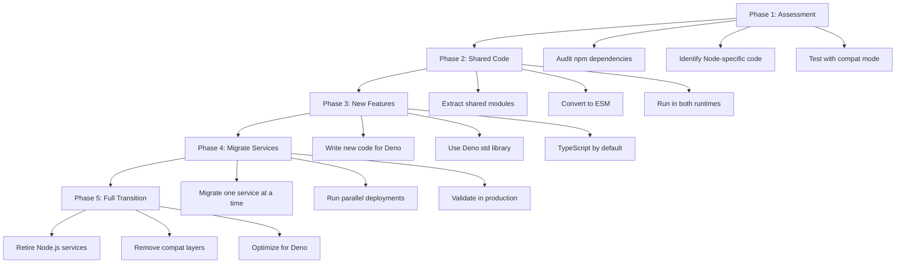

# How to Migrate from Node.js to Deno

Author: [nawazdhandala](https://www.github.com/nawazdhandala)

Tags: Deno, NodeJS, JavaScript, TypeScript, Migration, Backend

Description: A practical guide to migrating your Node.js applications to Deno, covering compatibility modes, module conversion, npm package usage, and incremental adoption strategies.

---

Deno has matured into a production-ready runtime with first-class TypeScript support, built-in tooling, and a security-first architecture. If you have been eyeing a migration from Node.js, the path has never been smoother. Deno 2.x ships with robust Node compatibility, npm package support, and escape hatches that let you migrate incrementally rather than rewriting everything at once.

This guide walks through the practical steps: what breaks, what works out of the box, and how to approach the transition without halting feature development.

## Key Differences at a Glance

| Aspect | Node.js | Deno |
|--------|---------|------|
| **Module system** | CommonJS (default) + ESM | ESM only |
| **Package management** | npm + node_modules | URL imports + npm: specifier |
| **TypeScript** | Requires ts-node or build step | Native, zero config |
| **Security** | Full system access by default | Explicit permissions required |
| **Standard library** | Minimal, rely on npm | Rich built-in std library |
| **Config file** | package.json | deno.json (optional) |

## Node Compatibility Mode

Deno includes a compatibility layer that lets you run many Node.js programs without modification. Enable it via the `--unstable-node-compat` flag or by using `node:` prefixed imports.

This command runs a Node.js script directly in Deno:

```bash
# Run an existing Node.js file in Deno
deno run --allow-all --unstable-node-compat server.js
```

For projects using package.json, Deno can resolve dependencies automatically:

```bash
# Deno reads package.json and installs dependencies
deno run --allow-all main.ts
```

The compatibility layer handles most of the Node.js core APIs. Check the [Deno Node compatibility documentation](https://docs.deno.com/runtime/manual/node/) for the current list of supported modules.

## Converting CommonJS to ES Modules

Deno only speaks ESM. If your codebase uses `require()` and `module.exports`, you will need to convert it. The good news: this is a one-time mechanical transformation.

Before - CommonJS syntax:

```javascript
// utils.js (CommonJS)
const fs = require('fs');
const path = require('path');

function readConfig(configPath) {
  const fullPath = path.resolve(configPath);
  const content = fs.readFileSync(fullPath, 'utf-8');
  return JSON.parse(content);
}

module.exports = { readConfig };
```

After - ES Module syntax:

```typescript
// utils.ts (ESM for Deno)
import * as fs from "node:fs";
import * as path from "node:path";

export function readConfig(configPath: string): Record<string, unknown> {
  const fullPath = path.resolve(configPath);
  const content = fs.readFileSync(fullPath, "utf-8");
  return JSON.parse(content);
}
```

Key conversion patterns:

| CommonJS | ES Module |
|----------|-----------|
| `const x = require('x')` | `import x from 'x'` |
| `const { a, b } = require('x')` | `import { a, b } from 'x'` |
| `module.exports = x` | `export default x` |
| `module.exports = { a, b }` | `export { a, b }` |
| `exports.foo = bar` | `export const foo = bar` |

For large codebases, tools like [cjs-to-esm](https://github.com/nicolo-ribaudo/cjs-to-esm) or [lebab](https://lebab.io/) can automate most of the conversion.

## Using npm Packages in Deno

Deno 2.x supports npm packages natively using the `npm:` specifier. No node_modules folder required - Deno caches packages globally.

Import npm packages directly in your code:

```typescript
// Import Express from npm
import express from "npm:express@4";
import cors from "npm:cors";
import helmet from "npm:helmet";

const app = express();
app.use(cors());
app.use(helmet());

app.get("/", (req, res) => {
  res.json({ message: "Running Express on Deno" });
});

app.listen(3000, () => {
  console.log("Server running on port 3000");
});
```

You can also specify npm packages in your deno.json for cleaner imports:

```json
{
  "imports": {
    "express": "npm:express@4",
    "lodash": "npm:lodash@4",
    "pg": "npm:pg@8"
  }
}
```

Then import them without the npm: prefix:

```typescript
// Clean imports using import map
import express from "express";
import _ from "lodash";
import pg from "pg";
```

## Replacing Node.js Core APIs

While many Node.js APIs work via the `node:` prefix, Deno offers native alternatives that are often cleaner. Here is how to translate common patterns.

### File System Operations

Deno provides a simpler async-first file API:

```typescript
// Node.js style (still works in Deno)
import * as fs from "node:fs/promises";
const content = await fs.readFile("config.json", "utf-8");

// Deno native style (preferred)
const content = await Deno.readTextFile("config.json");
const data = JSON.parse(content);

// Writing files
await Deno.writeTextFile("output.json", JSON.stringify(data, null, 2));
```

### HTTP Server

Deno has a built-in HTTP server that does not require Express:

```typescript
// Simple HTTP server using Deno.serve
Deno.serve({ port: 3000 }, async (request: Request) => {
  const url = new URL(request.url);

  if (url.pathname === "/health") {
    return new Response(JSON.stringify({ status: "ok" }), {
      headers: { "Content-Type": "application/json" },
    });
  }

  if (url.pathname === "/api/users" && request.method === "GET") {
    const users = [{ id: 1, name: "Alice" }];
    return new Response(JSON.stringify(users), {
      headers: { "Content-Type": "application/json" },
    });
  }

  return new Response("Not Found", { status: 404 });
});
```

### Fetch and HTTP Requests

Fetch is built into Deno - no node-fetch needed:

```typescript
// Fetch is globally available in Deno
async function getUser(userId: string) {
  const response = await fetch(`https://api.example.com/users/${userId}`);

  if (!response.ok) {
    throw new Error(`HTTP error: ${response.status}`);
  }

  return await response.json();
}

// POST request with JSON body
async function createUser(userData: { name: string; email: string }) {
  const response = await fetch("https://api.example.com/users", {
    method: "POST",
    headers: { "Content-Type": "application/json" },
    body: JSON.stringify(userData),
  });

  return await response.json();
}
```

## Handling Environment Variables

Deno requires explicit permission to read environment variables. Use `Deno.env` instead of `process.env`.

Access environment variables with the Deno API:

```typescript
// Reading environment variables
const dbHost = Deno.env.get("DATABASE_HOST") ?? "localhost";
const dbPort = parseInt(Deno.env.get("DATABASE_PORT") ?? "5432", 10);
const apiKey = Deno.env.get("API_KEY");

if (!apiKey) {
  console.error("API_KEY environment variable is required");
  Deno.exit(1);
}

// Setting environment variables (if needed)
Deno.env.set("NODE_ENV", "production");
```

For compatibility, you can also load .env files using the standard library:

```typescript
// Load .env file using Deno standard library
import { load } from "https://deno.land/std/dotenv/mod.ts";

const env = await load();
const dbUrl = env["DATABASE_URL"] || Deno.env.get("DATABASE_URL");
```

Run with environment permission:

```bash
# Grant access to specific environment variables
deno run --allow-env=DATABASE_HOST,DATABASE_PORT,API_KEY app.ts

# Or grant access to all environment variables
deno run --allow-env app.ts
```

## Permission Flags

Deno's security model requires explicit permissions. Here are the common flags you will need during migration.

| Permission | Flag | What It Allows |
|------------|------|----------------|
| Network | `--allow-net` | HTTP requests, sockets |
| File read | `--allow-read` | Reading files and directories |
| File write | `--allow-write` | Writing files and directories |
| Environment | `--allow-env` | Access to environment variables |
| Run subprocess | `--allow-run` | Spawning child processes |
| FFI | `--allow-ffi` | Foreign function interface |
| All | `--allow-all` or `-A` | Grants all permissions |

You can scope permissions to specific paths or hosts:

```bash
# Allow network access only to specific hosts
deno run --allow-net=api.example.com,localhost:5432 app.ts

# Allow reading only from specific directories
deno run --allow-read=/etc/config,./data app.ts
```

## Gradual Migration Strategy

Rewriting everything at once is risky. Here is a phased approach that lets you migrate incrementally.



### Phase 1: Assessment

Start by testing your existing code with Deno's compatibility mode:

```bash
# Test if your app runs in Deno compat mode
deno run --allow-all --unstable-node-compat src/index.ts
```

Create a compatibility checklist:

```typescript
// scripts/check-deno-compat.ts
// Run this to identify potential migration issues

const issues: string[] = [];

// Check for CommonJS usage
const files = [...Deno.readDirSync("./src")];
for (const file of files) {
  if (file.name.endsWith(".js") || file.name.endsWith(".ts")) {
    const content = await Deno.readTextFile(`./src/${file.name}`);

    if (content.includes("require(")) {
      issues.push(`${file.name}: Uses CommonJS require()`);
    }
    if (content.includes("__dirname")) {
      issues.push(`${file.name}: Uses __dirname (use import.meta.dirname)`);
    }
    if (content.includes("__filename")) {
      issues.push(`${file.name}: Uses __filename (use import.meta.filename)`);
    }
  }
}

console.log("Compatibility Issues Found:");
issues.forEach((issue) => console.log(`  - ${issue}`));
```

### Phase 2: Shared Code Library

Extract code that needs to run in both Node.js and Deno:

```typescript
// shared/http-client.ts
// Works in both Node.js (18+) and Deno

export interface HttpResponse<T> {
  data: T;
  status: number;
}

export async function httpGet<T>(url: string): Promise<HttpResponse<T>> {
  const response = await fetch(url);
  const data = await response.json();
  return { data, status: response.status };
}

export async function httpPost<T>(
  url: string,
  body: unknown
): Promise<HttpResponse<T>> {
  const response = await fetch(url, {
    method: "POST",
    headers: { "Content-Type": "application/json" },
    body: JSON.stringify(body),
  });
  const data = await response.json();
  return { data, status: response.status };
}
```

### Phase 3: Write New Features in Deno

Any new service or feature should be written for Deno first:

```typescript
// services/analytics/mod.ts
// New analytics service written for Deno

import { serve } from "https://deno.land/std/http/server.ts";

interface AnalyticsEvent {
  eventName: string;
  userId: string;
  properties: Record<string, unknown>;
  timestamp: number;
}

const events: AnalyticsEvent[] = [];

Deno.serve({ port: 8080 }, async (req: Request) => {
  const url = new URL(req.url);

  if (req.method === "POST" && url.pathname === "/track") {
    const event: AnalyticsEvent = await req.json();
    event.timestamp = Date.now();
    events.push(event);

    return new Response(JSON.stringify({ success: true }), {
      headers: { "Content-Type": "application/json" },
    });
  }

  if (req.method === "GET" && url.pathname === "/events") {
    return new Response(JSON.stringify(events), {
      headers: { "Content-Type": "application/json" },
    });
  }

  return new Response("Not Found", { status: 404 });
});
```

### Phase 4: Migrate Existing Services

Migrate one service at a time. Run both versions in parallel and compare outputs:

```typescript
// migration/parallel-runner.ts
// Run both Node and Deno versions, compare results

async function runParallelTest(endpoint: string) {
  const [nodeResponse, denoResponse] = await Promise.all([
    fetch(`http://localhost:3000${endpoint}`),
    fetch(`http://localhost:3001${endpoint}`),
  ]);

  const nodeData = await nodeResponse.json();
  const denoData = await denoResponse.json();

  const matches = JSON.stringify(nodeData) === JSON.stringify(denoData);

  console.log(`Endpoint: ${endpoint}`);
  console.log(`  Node status: ${nodeResponse.status}`);
  console.log(`  Deno status: ${denoResponse.status}`);
  console.log(`  Responses match: ${matches}`);

  if (!matches) {
    console.log("  Node response:", nodeData);
    console.log("  Deno response:", denoData);
  }

  return matches;
}
```

## Configuration: deno.json

Set up your Deno project configuration:

```json
{
  "compilerOptions": {
    "strict": true,
    "noImplicitAny": true
  },
  "imports": {
    "express": "npm:express@4",
    "pg": "npm:pg@8",
    "@std/": "https://deno.land/std@0.220.0/"
  },
  "tasks": {
    "dev": "deno run --watch --allow-all src/main.ts",
    "start": "deno run --allow-net --allow-read --allow-env src/main.ts",
    "test": "deno test --allow-all",
    "lint": "deno lint",
    "fmt": "deno fmt"
  },
  "lint": {
    "rules": {
      "tags": ["recommended"]
    }
  },
  "fmt": {
    "useTabs": false,
    "lineWidth": 100,
    "indentWidth": 2,
    "singleQuote": false
  }
}
```

Run tasks like npm scripts:

```bash
# Development with watch mode
deno task dev

# Run tests
deno task test

# Format code
deno task fmt
```

## Common Migration Pitfalls

### __dirname and __filename

These globals do not exist in ESM. Use `import.meta` instead:

```typescript
// Node.js CommonJS
const __dirname = path.dirname(__filename);

// Deno / ESM
const __dirname = import.meta.dirname;
const __filename = import.meta.filename;

// For dynamic imports relative to current file
const configPath = new URL("./config.json", import.meta.url);
const config = JSON.parse(await Deno.readTextFile(configPath));
```

### Dynamic require()

Dynamic requires need refactoring to dynamic imports:

```typescript
// Node.js - dynamic require
const plugin = require(`./plugins/${pluginName}`);

// Deno - dynamic import (returns a promise)
const plugin = await import(`./plugins/${pluginName}.ts`);
```

### Buffer

Buffer is not global in Deno. Import it from the node compatibility layer:

```typescript
// Import Buffer from node:buffer
import { Buffer } from "node:buffer";

const encoded = Buffer.from("hello", "utf-8").toString("base64");
const decoded = Buffer.from(encoded, "base64").toString("utf-8");
```

## Testing Your Migration

Deno has a built-in test runner. Convert your Jest or Mocha tests:

```typescript
// tests/user_service_test.ts
import { assertEquals, assertRejects } from "https://deno.land/std/assert/mod.ts";
import { UserService } from "../src/services/user_service.ts";

Deno.test("UserService - creates user with valid data", async () => {
  const service = new UserService();
  const user = await service.create({ name: "Alice", email: "alice@example.com" });

  assertEquals(user.name, "Alice");
  assertEquals(user.email, "alice@example.com");
});

Deno.test("UserService - throws on invalid email", async () => {
  const service = new UserService();

  await assertRejects(
    () => service.create({ name: "Bob", email: "invalid-email" }),
    Error,
    "Invalid email format"
  );
});

Deno.test("UserService - fetches user by ID", async () => {
  const service = new UserService();
  const user = await service.getById("123");

  assertEquals(typeof user.id, "string");
});
```

Run tests with coverage:

```bash
# Run all tests
deno test --allow-all

# Run with coverage report
deno test --allow-all --coverage=coverage/

# Generate HTML coverage report
deno coverage coverage/ --html
```

## Summary

Migrating from Node.js to Deno is no longer the all-or-nothing proposition it was a few years ago. With native npm support, Node compatibility mode, and a mature standard library, you can migrate at your own pace.

| Step | Action |
|------|--------|
| 1 | Test existing code with `--unstable-node-compat` |
| 2 | Convert CommonJS to ESM |
| 3 | Replace `require()` with `import` |
| 4 | Use `npm:` specifier for npm packages |
| 5 | Swap Node APIs for Deno equivalents where cleaner |
| 6 | Add permission flags to run commands |
| 7 | Migrate services one at a time |

The migration does not have to be a big bang. Start with a single service, validate it in production, and expand from there. The TypeScript-first experience and built-in tooling will pay dividends as your codebase grows.
