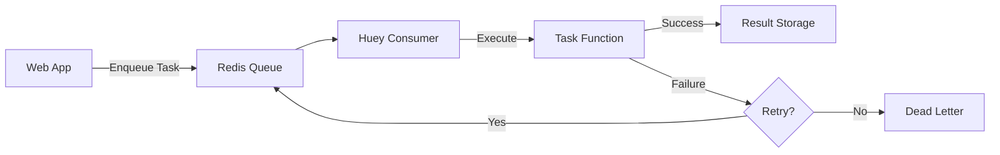

# How to Implement Background Tasks with Huey

Author: [nawazdhandala](https://www.github.com/nawazdhandala)

Tags: Python, Huey, Background Tasks, Task Queue, Redis, Scheduling, Periodic Tasks, Async

Description: Learn how to implement background tasks in Python with Huey - a lightweight task queue that handles scheduling, retries, and periodic tasks with minimal configuration.

---

> Background tasks are the backbone of any production application. Whether you're sending emails, processing uploads, or running scheduled jobs, offloading work to a background queue keeps your app responsive. Huey is a lightweight alternative to Celery that gets the job done without the complexity.

Most Python developers reach for Celery when they need background tasks, but Celery can be overkill for many applications. Huey offers a simpler API, less configuration, and lower resource usage while still providing the features you actually need - task scheduling, retries, periodic tasks, and result storage.

---

## Why Huey Over Celery?

Huey is designed to be simple. Here's what you get:

| Feature | Huey | Celery |
|---------|------|--------|
| Configuration | Minimal | Extensive |
| Memory footprint | Low | Higher |
| Learning curve | Gentle | Steeper |
| Dependencies | Few | Many |
| Redis support | Built-in | Via broker |
| SQLite support | Yes | No |

Huey works well for small to medium applications. If you're building a system that processes millions of tasks per day, Celery might be the better choice. For everything else, Huey keeps things simple.

---

## Setting Up Huey with Redis

### Installation

Install huey and redis client together.

```bash
pip install huey redis
```

### Basic Configuration

The following code creates a Huey instance connected to Redis. The name parameter identifies your application in Redis, and the connection pool handles multiple worker threads efficiently.

```python
# tasks.py
# Configure Huey with Redis as the backend storage
from huey import RedisHuey
from redis import ConnectionPool

# Create a connection pool for efficient Redis connections
pool = ConnectionPool(host='localhost', port=6379, db=0, max_connections=20)

# Initialize Huey with the Redis backend
huey = RedisHuey(
    name='my_app',  # Namespace for tasks in Redis
    connection_pool=pool,  # Reuse connections across workers
    immediate=False  # Set True for testing without workers
)
```

### Environment-Based Configuration

Production applications need different settings for development and production. This configuration class handles both environments and includes sensible defaults.

```python
# config.py
# Environment-aware Huey configuration
import os
from huey import RedisHuey, SqliteHuey

def get_huey():
    """
    Create Huey instance based on environment.
    Uses SQLite for development, Redis for production.
    """
    env = os.getenv('ENVIRONMENT', 'development')

    if env == 'production':
        # Production: Use Redis for distributed workers
        return RedisHuey(
            name='my_app',
            host=os.getenv('REDIS_HOST', 'localhost'),
            port=int(os.getenv('REDIS_PORT', 6379)),
            password=os.getenv('REDIS_PASSWORD'),
            db=int(os.getenv('REDIS_DB', 0))
        )
    else:
        # Development: Use SQLite - no Redis needed
        return SqliteHuey(
            name='my_app',
            filename='/tmp/huey.db'  # Local file for task storage
        )

# Create the Huey instance
huey = get_huey()
```

---

## How Huey Works

Before diving into code, let's understand how Huey processes tasks.



When your application calls a task, Huey serializes the function and arguments, stores them in Redis, and returns immediately. The consumer process picks up tasks from the queue and executes them. Results can be stored for later retrieval.

---

## Defining Tasks

### Basic Task

The `@huey.task()` decorator turns any function into a background task. When you call the function, it returns a result handle instead of executing immediately.

```python
# tasks.py
# Basic task definition with the Huey decorator
from config import huey
import time

@huey.task()
def send_email(to_address, subject, body):
    """
    Send an email in the background.
    This function runs in a worker process, not the web request.
    """
    # Simulate sending email - replace with actual SMTP logic
    time.sleep(2)  # Network latency simulation

    # In production, use smtplib or a service like SendGrid
    print(f"Email sent to {to_address}: {subject}")

    return {"status": "sent", "recipient": to_address}
```

### Calling Tasks

When you call a task function, it returns a TaskResultWrapper - not the actual result. Use this to check task status or retrieve the result later.

```python
# app.py
# How to enqueue and monitor background tasks
from tasks import send_email

# Enqueue the task - returns immediately
result = send_email('user@example.com', 'Welcome!', 'Thanks for signing up.')

# The result object is a TaskResultWrapper
print(result.id)  # Unique task ID like 'a1b2c3d4'

# Check if the task has finished (non-blocking)
if result.is_complete():
    print("Task finished!")

# Block until task completes and get result (with timeout)
try:
    actual_result = result.get(blocking=True, timeout=30)
    print(actual_result)  # {'status': 'sent', 'recipient': 'user@example.com'}
except TimeoutError:
    print("Task did not complete in time")
```

---

## Scheduling Tasks

### Delayed Execution

Sometimes you need to run a task at a specific time - sending a reminder email, scheduling a report, or delaying a notification. Huey supports both relative delays and absolute times.

```python
# scheduled_tasks.py
# Schedule tasks to run at specific times
from config import huey
from datetime import datetime, timedelta

@huey.task()
def send_reminder(user_id, message):
    """Send a reminder notification to a user"""
    # Look up user and send notification
    print(f"Reminder for user {user_id}: {message}")
    return {"sent": True}

@huey.task()
def generate_report(report_type, date_range):
    """Generate a report asynchronously"""
    # Heavy processing happens here
    print(f"Generating {report_type} report for {date_range}")
    return {"report_url": "/reports/123.pdf"}

# Schedule for 30 minutes from now
reminder_task = send_reminder.schedule(
    args=('user_123', 'Your trial expires tomorrow'),
    delay=1800  # Delay in seconds
)

# Schedule for a specific datetime
run_at = datetime(2026, 2, 4, 9, 0, 0)  # Tomorrow at 9 AM
report_task = generate_report.schedule(
    args=('sales', 'last_month'),
    eta=run_at  # Exact time to run
)

# Schedule relative to now using timedelta
five_hours_later = datetime.now() + timedelta(hours=5)
another_task = send_reminder.schedule(
    args=('user_456', 'Check your inbox'),
    eta=five_hours_later
)
```

### Task Pipeline

You can chain tasks together so that one task's output becomes another task's input. This is useful for multi-step processing like: upload -> validate -> process -> notify.

```python
# pipeline.py
# Chain multiple tasks together in a pipeline
from config import huey

@huey.task()
def download_file(url):
    """Download a file from URL and return local path"""
    # Download logic here
    local_path = f"/tmp/{url.split('/')[-1]}"
    print(f"Downloaded {url} to {local_path}")
    return local_path

@huey.task()
def process_file(file_path):
    """Process the downloaded file"""
    # Processing logic here
    print(f"Processing {file_path}")
    return {"processed": True, "path": file_path}

@huey.task()
def cleanup_file(file_path):
    """Remove temporary file after processing"""
    import os
    os.remove(file_path)
    print(f"Cleaned up {file_path}")
    return {"deleted": True}

# Chain tasks using the pipeline method
# Each task receives the previous task's result
pipeline = (
    download_file.s('https://example.com/data.csv')  # .s() creates a signature
    .then(process_file)  # Receives file_path from download_file
    .then(cleanup_file)  # Receives result from process_file
)

# Execute the pipeline
result = pipeline()
```

---

## Periodic Tasks

### Cron-Style Scheduling

Huey supports periodic tasks that run on a schedule - similar to cron jobs. These are defined using the `@huey.periodic_task()` decorator with a crontab schedule.

```python
# periodic.py
# Define tasks that run on a schedule
from config import huey
from huey import crontab
from datetime import datetime

@huey.periodic_task(crontab(minute='0', hour='*/2'))
def sync_inventory():
    """
    Sync inventory from external system every 2 hours.
    Runs at minute 0 of hours 0, 2, 4, 6, 8, 10, 12, 14, 16, 18, 20, 22.
    """
    print(f"Syncing inventory at {datetime.now()}")
    # Fetch and update inventory data
    return {"synced_items": 1500}

@huey.periodic_task(crontab(minute='30', hour='2'))
def generate_daily_report():
    """
    Generate daily report at 2:30 AM every day.
    Running at night avoids impacting daytime performance.
    """
    print("Generating daily report...")
    # Heavy report generation logic
    return {"report": "daily_2026-02-03.pdf"}

@huey.periodic_task(crontab(minute='0', hour='9', day_of_week='1'))
def send_weekly_digest():
    """
    Send weekly digest every Monday at 9:00 AM.
    day_of_week: 0=Sunday, 1=Monday, ..., 6=Saturday
    """
    print("Sending weekly digest to all users")
    return {"emails_sent": 250}

@huey.periodic_task(crontab(minute='*/5'))
def health_check():
    """
    Run health check every 5 minutes.
    Good for monitoring external services or cleaning up stale data.
    """
    # Check external services, clean caches, etc.
    return {"healthy": True}
```

### Crontab Reference

The crontab function accepts these parameters.

```python
# crontab_reference.py
# Common crontab patterns for reference
from huey import crontab

# Every minute
every_minute = crontab()

# Every hour at minute 0
every_hour = crontab(minute='0')

# Every day at midnight
daily_midnight = crontab(minute='0', hour='0')

# Every Monday at 9 AM
weekly_monday = crontab(minute='0', hour='9', day_of_week='1')

# First day of every month at midnight
monthly = crontab(minute='0', hour='0', day='1')

# Every 15 minutes
every_15_min = crontab(minute='*/15')

# Weekdays at 8 AM
weekday_morning = crontab(minute='0', hour='8', day_of_week='1-5')

# Multiple specific hours (9 AM, 12 PM, 5 PM)
business_hours = crontab(minute='0', hour='9,12,17')
```

---

## Task Priorities

Huey supports task priorities to ensure important tasks run first. Higher priority tasks are processed before lower priority ones.

```python
# priorities.py
# Define tasks with different priority levels
from config import huey

# Priority levels: higher number = higher priority
PRIORITY_LOW = 0
PRIORITY_NORMAL = 50
PRIORITY_HIGH = 100
PRIORITY_CRITICAL = 200

@huey.task(priority=PRIORITY_CRITICAL)
def process_payment(payment_id, amount):
    """
    Payment processing - highest priority.
    Should never wait behind less important tasks.
    """
    print(f"Processing payment {payment_id} for ${amount}")
    return {"status": "completed"}

@huey.task(priority=PRIORITY_HIGH)
def send_order_confirmation(order_id, email):
    """
    Order confirmation - high priority.
    Customer expects this immediately after checkout.
    """
    print(f"Sending confirmation for order {order_id} to {email}")
    return {"sent": True}

@huey.task(priority=PRIORITY_NORMAL)
def update_search_index(product_id):
    """
    Search index update - normal priority.
    Important but can wait a bit.
    """
    print(f"Updating search index for product {product_id}")
    return {"indexed": True}

@huey.task(priority=PRIORITY_LOW)
def generate_analytics(date_range):
    """
    Analytics generation - low priority.
    Can run whenever there's spare capacity.
    """
    print(f"Generating analytics for {date_range}")
    return {"report_id": "analytics_123"}

# When enqueueing, tasks are sorted by priority
# Even if generate_analytics is called first, process_payment runs first!
generate_analytics('last_week')  # Priority 0
process_payment('pay_123', 99.99)  # Priority 200 - runs first
```

---

## Error Handling and Retries

### Automatic Retries

Tasks fail. Networks go down, services become unavailable, and databases lock up. Huey's retry mechanism handles transient failures automatically.

```python
# retries.py
# Configure automatic retries for failing tasks
from config import huey
import random

@huey.task(retries=3, retry_delay=60)
def call_external_api(endpoint, payload):
    """
    Call an external API with automatic retries.

    retries: Number of times to retry on failure
    retry_delay: Seconds to wait between retries
    """
    # Simulate intermittent failure
    if random.random() < 0.3:  # 30% failure rate
        raise ConnectionError("API temporarily unavailable")

    # Actual API call would go here
    print(f"Successfully called {endpoint}")
    return {"success": True}

@huey.task(retries=5, retry_delay=30)
def send_webhook(url, data):
    """
    Send webhook with exponential backoff simulation.
    Retries 5 times with 30 second delays.
    """
    import requests

    response = requests.post(url, json=data, timeout=10)
    response.raise_for_status()  # Raises exception on 4xx/5xx

    return {"status_code": response.status_code}
```

### Custom Retry Logic

For more control over retry behavior, you can implement exponential backoff or custom conditions.

```python
# custom_retries.py
# Implement custom retry logic with exponential backoff
from config import huey

class RetryableError(Exception):
    """Exception that should trigger a retry"""
    pass

class PermanentError(Exception):
    """Exception that should not be retried"""
    pass

@huey.task(retries=5)
def process_with_backoff(item_id, attempt=1):
    """
    Process with exponential backoff.
    Delay increases: 2s, 4s, 8s, 16s, 32s
    """
    try:
        # Your processing logic here
        result = do_processing(item_id)
        return result

    except RetryableError as e:
        # Calculate exponential backoff delay
        delay = 2 ** attempt  # 2, 4, 8, 16, 32 seconds

        if attempt < 5:
            # Re-schedule with increased attempt counter
            process_with_backoff.schedule(
                args=(item_id,),
                kwargs={'attempt': attempt + 1},
                delay=delay
            )
            print(f"Retrying {item_id} in {delay}s (attempt {attempt + 1})")
        else:
            # Max retries exceeded - log and alert
            print(f"Failed permanently: {item_id}")
            raise

    except PermanentError as e:
        # Don't retry - this error won't resolve itself
        print(f"Permanent failure for {item_id}: {e}")
        raise

def do_processing(item_id):
    """Placeholder for actual processing logic"""
    # Your business logic here
    pass
```

### Dead Letter Queue

For tasks that fail permanently, you might want to store them for manual review instead of losing them.

```python
# dead_letter.py
# Implement a dead letter queue for failed tasks
from config import huey
from datetime import datetime
import json

# Use a separate Redis key for dead letters
DEAD_LETTER_KEY = 'dead_letter_queue'

def move_to_dead_letter(task_id, task_name, args, kwargs, error):
    """Store failed task info for manual review"""
    import redis
    r = redis.Redis()

    dead_letter = {
        'task_id': task_id,
        'task_name': task_name,
        'args': args,
        'kwargs': kwargs,
        'error': str(error),
        'failed_at': datetime.utcnow().isoformat()
    }

    r.lpush(DEAD_LETTER_KEY, json.dumps(dead_letter))
    r.ltrim(DEAD_LETTER_KEY, 0, 999)  # Keep last 1000 failures

@huey.task(retries=3, retry_delay=60)
def critical_task(data):
    """Task that moves to dead letter on permanent failure"""
    try:
        # Your critical processing here
        process_critical_data(data)
    except Exception as e:
        # Let Huey handle the retry
        raise

# Hook into task failure events
@huey.signal()
def task_failed_handler(signal, task, exc=None):
    """Called when a task fails after all retries"""
    if signal == 'task-failed':
        move_to_dead_letter(
            task_id=task.id,
            task_name=task.name,
            args=task.args,
            kwargs=task.kwargs,
            error=exc
        )
```

---

## Monitoring Tasks

### Task Introspection

Huey stores task state in Redis, so you can query it to build monitoring dashboards or health checks.

```python
# monitoring.py
# Monitor task queue and worker status
from config import huey
from datetime import datetime

def get_queue_stats():
    """Get current queue statistics"""
    # Access the underlying storage
    storage = huey.storage

    # Count pending tasks
    pending = storage.queue_size()

    # Count scheduled tasks (tasks waiting for their ETA)
    scheduled = storage.scheduled_count()

    return {
        'pending': pending,
        'scheduled': scheduled,
        'timestamp': datetime.utcnow().isoformat()
    }

def check_task_status(task_result):
    """Check the status of a specific task"""
    return {
        'task_id': task_result.id,
        'is_complete': task_result.is_complete(),
        'result': task_result.get(blocking=False) if task_result.is_complete() else None
    }
```

### Health Check Endpoint

Expose queue health as an HTTP endpoint for Kubernetes probes or monitoring systems.

```python
# health_endpoint.py
# FastAPI endpoint for task queue health
from fastapi import FastAPI, Response, status
from config import huey

app = FastAPI()

@app.get("/health/tasks")
async def task_health(response: Response):
    """
    Health check for the task queue.
    Returns 503 if queue is unhealthy.
    """
    try:
        storage = huey.storage

        # Check Redis connectivity
        pending = storage.queue_size()

        # Check if queue is backing up
        if pending > 10000:
            response.status_code = status.HTTP_503_SERVICE_UNAVAILABLE
            return {
                "status": "unhealthy",
                "reason": "Queue backlog too large",
                "pending_tasks": pending
            }

        return {
            "status": "healthy",
            "pending_tasks": pending,
            "scheduled_tasks": storage.scheduled_count()
        }

    except Exception as e:
        response.status_code = status.HTTP_503_SERVICE_UNAVAILABLE
        return {
            "status": "unhealthy",
            "reason": str(e)
        }
```

### Logging Integration

Add structured logging to your tasks for observability.

```python
# logged_tasks.py
# Tasks with structured logging for observability
from config import huey
import logging
import json
from datetime import datetime
from functools import wraps

# Configure structured JSON logging
logging.basicConfig(level=logging.INFO, format='%(message)s')
logger = logging.getLogger('huey_tasks')

def log_task(func):
    """Decorator to add structured logging to tasks"""
    @wraps(func)
    def wrapper(*args, **kwargs):
        task_name = func.__name__
        start_time = datetime.utcnow()

        # Log task start
        logger.info(json.dumps({
            "event": "task_started",
            "task": task_name,
            "args": str(args),
            "timestamp": start_time.isoformat()
        }))

        try:
            result = func(*args, **kwargs)
            duration = (datetime.utcnow() - start_time).total_seconds()

            # Log task success
            logger.info(json.dumps({
                "event": "task_completed",
                "task": task_name,
                "duration_seconds": duration,
                "timestamp": datetime.utcnow().isoformat()
            }))

            return result

        except Exception as e:
            duration = (datetime.utcnow() - start_time).total_seconds()

            # Log task failure
            logger.error(json.dumps({
                "event": "task_failed",
                "task": task_name,
                "error": str(e),
                "error_type": type(e).__name__,
                "duration_seconds": duration,
                "timestamp": datetime.utcnow().isoformat()
            }))

            raise

    return wrapper

@huey.task()
@log_task
def logged_task(data):
    """Example task with automatic logging"""
    # Your task logic here
    return {"processed": True}
```

---

## Running the Consumer

### Basic Consumer

Start the consumer to process tasks. The consumer is a separate process that pulls tasks from Redis and executes them.

```bash
# Start a single worker
huey_consumer.py tasks.huey

# Start with verbose logging
huey_consumer.py tasks.huey --verbose

# Start with multiple worker threads
huey_consumer.py tasks.huey --workers 4

# Start with periodic task scheduler
huey_consumer.py tasks.huey --periodic
```

### Production Configuration

For production, configure the consumer with appropriate settings.

```bash
# Production consumer with all options
huey_consumer.py tasks.huey \
    --workers 4 \
    --worker-type thread \
    --periodic \
    --logfile /var/log/huey/consumer.log \
    --verbose
```

### Systemd Service

Run Huey as a systemd service for automatic restarts and logging.

```ini
# /etc/systemd/system/huey.service
[Unit]
Description=Huey Task Consumer
After=network.target redis.service

[Service]
Type=simple
User=app
Group=app
WorkingDirectory=/opt/myapp
Environment=ENVIRONMENT=production
Environment=REDIS_HOST=localhost
ExecStart=/opt/myapp/venv/bin/huey_consumer.py tasks.huey --workers 4 --periodic
Restart=always
RestartSec=5

[Install]
WantedBy=multi-user.target
```

### Docker Deployment

Run Huey workers in Docker alongside your web application.

```dockerfile
# Dockerfile.worker
FROM python:3.11-slim

WORKDIR /app

COPY requirements.txt .
RUN pip install --no-cache-dir -r requirements.txt

COPY . .

# Run the Huey consumer
CMD ["huey_consumer.py", "tasks.huey", "--workers", "4", "--periodic"]
```

```yaml
# docker-compose.yml
version: '3.8'

services:
  web:
    build: .
    ports:
      - "8000:8000"
    environment:
      - REDIS_HOST=redis
    depends_on:
      - redis

  worker:
    build:
      context: .
      dockerfile: Dockerfile.worker
    environment:
      - REDIS_HOST=redis
    depends_on:
      - redis
    deploy:
      replicas: 2  # Run 2 worker containers

  redis:
    image: redis:7-alpine
    volumes:
      - redis_data:/data

volumes:
  redis_data:
```

---

## Complete Example

Here's a complete example bringing everything together - a FastAPI application with background email sending, scheduled reports, and monitoring.

```python
# complete_example.py
# Full Huey integration with FastAPI
from fastapi import FastAPI, Response
from huey import RedisHuey, crontab
from datetime import datetime
import os

# Initialize Huey
huey = RedisHuey(
    name='my_app',
    host=os.getenv('REDIS_HOST', 'localhost'),
    results=True  # Store task results
)

# Initialize FastAPI
app = FastAPI()

# Task Definitions

@huey.task(retries=3, retry_delay=60)
def send_welcome_email(user_id, email):
    """Send welcome email to new user"""
    # Your email sending logic
    print(f"Sending welcome email to {email}")
    return {"sent": True, "user_id": user_id}

@huey.task(priority=100)
def process_payment(payment_id, amount):
    """High priority payment processing"""
    print(f"Processing payment {payment_id}: ${amount}")
    return {"status": "completed", "payment_id": payment_id}

@huey.periodic_task(crontab(minute='0', hour='6'))
def daily_cleanup():
    """Run daily cleanup at 6 AM"""
    print("Running daily cleanup...")
    return {"cleaned": True}

# API Endpoints

@app.post("/users")
async def create_user(email: str, name: str):
    """Create user and send welcome email in background"""
    # Create user in database
    user_id = "user_123"  # From database insert

    # Queue welcome email - doesn't block the response
    task = send_welcome_email(user_id, email)

    return {
        "user_id": user_id,
        "email_task_id": task.id
    }

@app.post("/payments")
async def create_payment(amount: float):
    """Process payment in background with high priority"""
    payment_id = "pay_456"  # From database

    task = process_payment(payment_id, amount)

    return {
        "payment_id": payment_id,
        "task_id": task.id
    }

@app.get("/tasks/{task_id}")
async def get_task_status(task_id: str):
    """Check status of a background task"""
    from huey.api import Result
    result = Result(huey, task_id)

    return {
        "task_id": task_id,
        "complete": result.is_complete(),
        "result": result.get(blocking=False) if result.is_complete() else None
    }

@app.get("/health/queue")
async def queue_health():
    """Health check for task queue"""
    return {
        "pending": huey.storage.queue_size(),
        "scheduled": huey.storage.scheduled_count()
    }
```

---

## Best Practices

### 1. Keep Tasks Idempotent

Tasks may run more than once due to retries or worker restarts. Design accordingly.

```python
# GOOD: Idempotent task
@huey.task()
def update_user_status(user_id, status):
    # Can safely run multiple times
    db.users.update({'_id': user_id}, {'$set': {'status': status}})

# BAD: Not idempotent
@huey.task()
def increment_counter(counter_id):
    # Running twice doubles the increment!
    db.counters.update({'_id': counter_id}, {'$inc': {'value': 1}})
```

### 2. Don't Pass Large Objects

Pass identifiers, not full objects. Large payloads slow down Redis and use unnecessary memory.

```python
# GOOD: Pass ID, fetch in task
@huey.task()
def process_order(order_id):
    order = Order.get(order_id)  # Fetch fresh data
    # Process order...

# BAD: Pass full object
@huey.task()
def process_order(order_dict):  # Serialized object in Redis
    # Process order...
```

### 3. Set Appropriate Timeouts

Prevent tasks from running forever.

```python
@huey.task(expires=3600)  # Task expires after 1 hour if not processed
def long_running_task(data):
    # If this task sits in queue for > 1 hour, it won't run
    pass
```

### 4. Use Task Context for Metadata

Store metadata with tasks for debugging.

```python
@huey.task(context=True)
def task_with_context(data, task=None):
    """The task parameter receives metadata about the task"""
    print(f"Task ID: {task.id}")
    print(f"Retries: {task.retries}")
    # Your logic here
```

---

## Conclusion

Huey provides a clean, simple approach to background tasks in Python. It handles the common cases well - scheduled tasks, retries, periodic jobs, and result storage - without the configuration overhead of larger systems like Celery.

Key takeaways:

- **Start simple**: SQLite backend for development, Redis for production
- **Use priorities**: Critical tasks like payments should run first
- **Handle failures**: Configure retries and dead letter queues
- **Monitor everything**: Log task execution and expose health endpoints
- **Keep tasks idempotent**: Assume tasks may run more than once

Huey is a solid choice when you need background tasks without the complexity. It scales well for most applications, and when you outgrow it, the concepts transfer directly to larger systems.

---

*Need to monitor your background task queues? [OneUptime](https://oneuptime.com) provides comprehensive monitoring for your task workers, including queue depth, processing times, and failure rates.*

**Related Reading:**
- [How to Build a Graceful Shutdown Handler in Python](https://oneuptime.com/blog/post/2025-01-06-python-graceful-shutdown-kubernetes/view)
- [How to Structure Logs Properly in Python with OpenTelemetry](https://oneuptime.com/blog/post/2025-01-06-python-structured-logging-opentelemetry/view)
