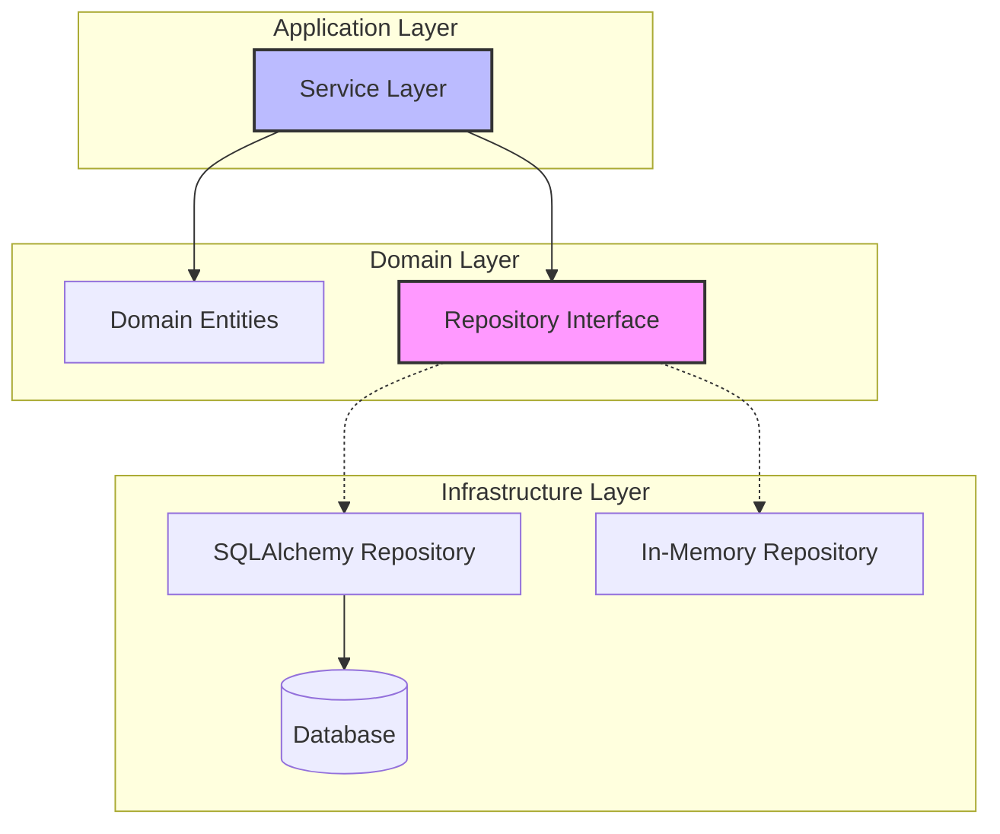
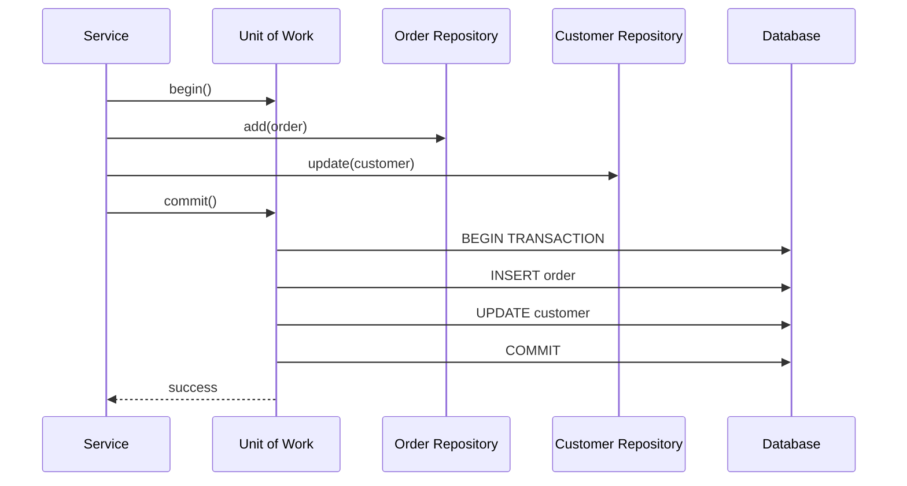

# How to Implement the Repository Pattern in Python

Author: [nawazdhandala](https://www.github.com/nawazdhandala)

Tags: Python, Repository Pattern, Design Patterns, SQLAlchemy, Unit Testing, Clean Architecture, Domain-Driven Design

Description: Learn how to implement the repository pattern in Python to decouple your domain logic from data access, enable easy testing with in-memory implementations, and integrate with the unit of work pattern.

---

> The repository pattern is one of those patterns that pays dividends the moment you need to write your first test. By abstracting data access behind a clean interface, you gain the flexibility to swap implementations, test without databases, and keep your domain logic pure.

If you have ever struggled with mocking database calls in tests or found your business logic tangled up with ORM queries, the repository pattern is your way out. It creates a clear boundary between what your application does and how it stores data.

---

## What is the Repository Pattern?

The repository pattern acts as a collection-like interface for accessing domain objects. Instead of scattering database queries throughout your codebase, you centralize data access operations in repository classes that expose simple methods like `get`, `add`, and `list`.

Here is how the pattern fits into a typical application architecture:



The key insight is that your service layer depends on the abstract repository interface, not on any concrete implementation. This inversion of dependencies is what makes the pattern powerful.

---

## Why Use the Repository Pattern?

Before diving into code, let's understand when this pattern makes sense:

**Benefits:**
- **Testability** - Swap SQLAlchemy for an in-memory dict in tests
- **Single Responsibility** - Data access logic lives in one place
- **Flexibility** - Switch databases or ORMs without touching business logic
- **Domain Focus** - Services work with domain objects, not ORM models

**When to Skip It:**
- Simple CRUD applications with no complex domain logic
- Prototypes where speed matters more than architecture
- Applications where you will never need to swap the data layer

---

## Defining the Abstract Repository Interface

Start with an abstract base class that defines the contract all repositories must follow. This interface uses Python's ABC module and generics for type safety.

```python
# repositories/base.py
# Abstract base class defining the repository contract
from abc import ABC, abstractmethod
from typing import Generic, TypeVar, Optional, List

# Generic type variable for domain entities
T = TypeVar('T')

class AbstractRepository(ABC, Generic[T]):
    """
    Abstract repository interface.
    All concrete repositories must implement these methods.
    """

    @abstractmethod
    def add(self, entity: T) -> None:
        """Add a new entity to the repository"""
        raise NotImplementedError

    @abstractmethod
    def get(self, id: str) -> Optional[T]:
        """Retrieve an entity by its unique identifier"""
        raise NotImplementedError

    @abstractmethod
    def get_by_id(self, id: str) -> Optional[T]:
        """Alias for get() - retrieve entity by ID"""
        raise NotImplementedError

    @abstractmethod
    def list(self) -> List[T]:
        """Return all entities in the repository"""
        raise NotImplementedError

    @abstractmethod
    def update(self, entity: T) -> None:
        """Update an existing entity"""
        raise NotImplementedError

    @abstractmethod
    def delete(self, id: str) -> None:
        """Remove an entity by its identifier"""
        raise NotImplementedError
```

---

## Domain Entities

Before implementing repositories, define your domain entities. These are plain Python classes that represent your business objects - they should have no knowledge of how they are persisted.

```python
# domain/entities.py
# Domain entities are pure Python classes with no persistence logic
from dataclasses import dataclass, field
from datetime import datetime
from typing import Optional, List
from enum import Enum
import uuid

class OrderStatus(Enum):
    """Enum for order status values"""
    PENDING = "pending"
    CONFIRMED = "confirmed"
    SHIPPED = "shipped"
    DELIVERED = "delivered"
    CANCELLED = "cancelled"

@dataclass
class OrderItem:
    """Represents a single item in an order"""
    product_id: str
    product_name: str
    quantity: int
    unit_price: float

    @property
    def total_price(self) -> float:
        """Calculate total price for this line item"""
        return self.quantity * self.unit_price

@dataclass
class Order:
    """
    Order domain entity.
    Contains business logic but no persistence concerns.
    """
    customer_id: str
    items: List[OrderItem] = field(default_factory=list)
    id: str = field(default_factory=lambda: str(uuid.uuid4()))
    status: OrderStatus = OrderStatus.PENDING
    created_at: datetime = field(default_factory=datetime.utcnow)
    updated_at: Optional[datetime] = None

    @property
    def total_amount(self) -> float:
        """Calculate the total order amount"""
        return sum(item.total_price for item in self.items)

    def add_item(self, item: OrderItem) -> None:
        """Add an item to the order"""
        if self.status != OrderStatus.PENDING:
            raise ValueError("Cannot modify a non-pending order")
        self.items.append(item)
        self.updated_at = datetime.utcnow()

    def confirm(self) -> None:
        """Confirm the order for processing"""
        if self.status != OrderStatus.PENDING:
            raise ValueError("Only pending orders can be confirmed")
        if not self.items:
            raise ValueError("Cannot confirm an empty order")
        self.status = OrderStatus.CONFIRMED
        self.updated_at = datetime.utcnow()

    def cancel(self) -> None:
        """Cancel the order"""
        if self.status in (OrderStatus.SHIPPED, OrderStatus.DELIVERED):
            raise ValueError("Cannot cancel shipped or delivered orders")
        self.status = OrderStatus.CANCELLED
        self.updated_at = datetime.utcnow()

@dataclass
class Customer:
    """Customer domain entity"""
    email: str
    name: str
    id: str = field(default_factory=lambda: str(uuid.uuid4()))
    created_at: datetime = field(default_factory=datetime.utcnow)
```

---

## SQLAlchemy Repository Implementation

Now for the real database implementation. This repository translates between SQLAlchemy ORM models and your domain entities.

First, define the SQLAlchemy models:

```python
# infrastructure/orm.py
# SQLAlchemy ORM models - separate from domain entities
from sqlalchemy import Column, String, Float, Integer, DateTime, Enum, ForeignKey
from sqlalchemy.orm import relationship, declarative_base
from datetime import datetime

Base = declarative_base()

class OrderModel(Base):
    """SQLAlchemy model for orders table"""
    __tablename__ = "orders"

    id = Column(String(36), primary_key=True)
    customer_id = Column(String(36), nullable=False, index=True)
    status = Column(String(20), nullable=False, default="pending")
    created_at = Column(DateTime, default=datetime.utcnow)
    updated_at = Column(DateTime, onupdate=datetime.utcnow)

    # Relationship to order items
    items = relationship("OrderItemModel", back_populates="order", cascade="all, delete-orphan")

class OrderItemModel(Base):
    """SQLAlchemy model for order_items table"""
    __tablename__ = "order_items"

    id = Column(Integer, primary_key=True, autoincrement=True)
    order_id = Column(String(36), ForeignKey("orders.id"), nullable=False)
    product_id = Column(String(36), nullable=False)
    product_name = Column(String(255), nullable=False)
    quantity = Column(Integer, nullable=False)
    unit_price = Column(Float, nullable=False)

    # Back reference to order
    order = relationship("OrderModel", back_populates="items")

class CustomerModel(Base):
    """SQLAlchemy model for customers table"""
    __tablename__ = "customers"

    id = Column(String(36), primary_key=True)
    email = Column(String(255), nullable=False, unique=True)
    name = Column(String(255), nullable=False)
    created_at = Column(DateTime, default=datetime.utcnow)
```

Now implement the repository that converts between models and entities:

```python
# repositories/sqlalchemy_repository.py
# Concrete SQLAlchemy implementation of the repository
from typing import Optional, List
from sqlalchemy.orm import Session
from domain.entities import Order, OrderItem, OrderStatus, Customer
from infrastructure.orm import OrderModel, OrderItemModel, CustomerModel
from repositories.base import AbstractRepository

class SqlAlchemyOrderRepository(AbstractRepository[Order]):
    """
    SQLAlchemy implementation of the order repository.
    Handles translation between domain entities and ORM models.
    """

    def __init__(self, session: Session):
        # Store the session for database operations
        self.session = session

    def add(self, order: Order) -> None:
        """Persist a new order to the database"""
        # Convert domain entity to ORM model
        model = self._to_model(order)
        self.session.add(model)
        # Note: commit is handled by Unit of Work, not here

    def get(self, id: str) -> Optional[Order]:
        """Retrieve an order by ID"""
        model = self.session.query(OrderModel).filter_by(id=id).first()
        if model is None:
            return None
        # Convert ORM model back to domain entity
        return self._to_entity(model)

    def get_by_id(self, id: str) -> Optional[Order]:
        """Alias for get()"""
        return self.get(id)

    def list(self) -> List[Order]:
        """Return all orders"""
        models = self.session.query(OrderModel).all()
        return [self._to_entity(m) for m in models]

    def list_by_customer(self, customer_id: str) -> List[Order]:
        """Return all orders for a specific customer"""
        models = self.session.query(OrderModel).filter_by(
            customer_id=customer_id
        ).all()
        return [self._to_entity(m) for m in models]

    def list_by_status(self, status: OrderStatus) -> List[Order]:
        """Return all orders with a specific status"""
        models = self.session.query(OrderModel).filter_by(
            status=status.value
        ).all()
        return [self._to_entity(m) for m in models]

    def update(self, order: Order) -> None:
        """Update an existing order"""
        model = self.session.query(OrderModel).filter_by(id=order.id).first()
        if model is None:
            raise ValueError(f"Order {order.id} not found")

        # Update model fields from entity
        model.status = order.status.value
        model.updated_at = order.updated_at

        # Sync items - delete existing and add new
        model.items.clear()
        for item in order.items:
            model.items.append(OrderItemModel(
                product_id=item.product_id,
                product_name=item.product_name,
                quantity=item.quantity,
                unit_price=item.unit_price
            ))

    def delete(self, id: str) -> None:
        """Delete an order by ID"""
        model = self.session.query(OrderModel).filter_by(id=id).first()
        if model:
            self.session.delete(model)

    def _to_model(self, order: Order) -> OrderModel:
        """Convert domain entity to ORM model"""
        return OrderModel(
            id=order.id,
            customer_id=order.customer_id,
            status=order.status.value,
            created_at=order.created_at,
            updated_at=order.updated_at,
            items=[
                OrderItemModel(
                    product_id=item.product_id,
                    product_name=item.product_name,
                    quantity=item.quantity,
                    unit_price=item.unit_price
                )
                for item in order.items
            ]
        )

    def _to_entity(self, model: OrderModel) -> Order:
        """Convert ORM model to domain entity"""
        return Order(
            id=model.id,
            customer_id=model.customer_id,
            status=OrderStatus(model.status),
            created_at=model.created_at,
            updated_at=model.updated_at,
            items=[
                OrderItem(
                    product_id=item.product_id,
                    product_name=item.product_name,
                    quantity=item.quantity,
                    unit_price=item.unit_price
                )
                for item in model.items
            ]
        )
```

---

## In-Memory Repository for Testing

One of the biggest advantages of the repository pattern is testability. This in-memory implementation stores entities in a dictionary, making tests fast and deterministic.

```python
# repositories/in_memory_repository.py
# In-memory implementation for testing - no database required
from typing import Optional, List, Dict
from copy import deepcopy
from domain.entities import Order, OrderStatus, Customer
from repositories.base import AbstractRepository

class InMemoryOrderRepository(AbstractRepository[Order]):
    """
    In-memory repository for testing.
    Stores orders in a dictionary - fast and deterministic.
    """

    def __init__(self):
        # Dictionary keyed by order ID
        self._storage: Dict[str, Order] = {}

    def add(self, order: Order) -> None:
        """Add an order to the in-memory store"""
        if order.id in self._storage:
            raise ValueError(f"Order {order.id} already exists")
        # Deep copy to prevent external mutations affecting stored data
        self._storage[order.id] = deepcopy(order)

    def get(self, id: str) -> Optional[Order]:
        """Retrieve an order by ID"""
        order = self._storage.get(id)
        # Return a copy to preserve encapsulation
        return deepcopy(order) if order else None

    def get_by_id(self, id: str) -> Optional[Order]:
        """Alias for get()"""
        return self.get(id)

    def list(self) -> List[Order]:
        """Return all orders"""
        return [deepcopy(order) for order in self._storage.values()]

    def list_by_customer(self, customer_id: str) -> List[Order]:
        """Return all orders for a specific customer"""
        return [
            deepcopy(order)
            for order in self._storage.values()
            if order.customer_id == customer_id
        ]

    def list_by_status(self, status: OrderStatus) -> List[Order]:
        """Return all orders with a specific status"""
        return [
            deepcopy(order)
            for order in self._storage.values()
            if order.status == status
        ]

    def update(self, order: Order) -> None:
        """Update an existing order"""
        if order.id not in self._storage:
            raise ValueError(f"Order {order.id} not found")
        self._storage[order.id] = deepcopy(order)

    def delete(self, id: str) -> None:
        """Remove an order from storage"""
        if id in self._storage:
            del self._storage[id]

    def clear(self) -> None:
        """Clear all stored orders - useful for test cleanup"""
        self._storage.clear()

    def count(self) -> int:
        """Return the number of stored orders"""
        return len(self._storage)


class InMemoryCustomerRepository(AbstractRepository[Customer]):
    """In-memory repository for customers"""

    def __init__(self):
        self._storage: Dict[str, Customer] = {}
        self._email_index: Dict[str, str] = {}  # email -> id

    def add(self, customer: Customer) -> None:
        """Add a customer"""
        if customer.id in self._storage:
            raise ValueError(f"Customer {customer.id} already exists")
        if customer.email in self._email_index:
            raise ValueError(f"Email {customer.email} already registered")

        self._storage[customer.id] = deepcopy(customer)
        self._email_index[customer.email] = customer.id

    def get(self, id: str) -> Optional[Customer]:
        """Get customer by ID"""
        customer = self._storage.get(id)
        return deepcopy(customer) if customer else None

    def get_by_id(self, id: str) -> Optional[Customer]:
        """Alias for get()"""
        return self.get(id)

    def get_by_email(self, email: str) -> Optional[Customer]:
        """Get customer by email address"""
        customer_id = self._email_index.get(email)
        if customer_id:
            return self.get(customer_id)
        return None

    def list(self) -> List[Customer]:
        """Return all customers"""
        return [deepcopy(c) for c in self._storage.values()]

    def update(self, customer: Customer) -> None:
        """Update a customer"""
        if customer.id not in self._storage:
            raise ValueError(f"Customer {customer.id} not found")

        old_customer = self._storage[customer.id]
        # Update email index if email changed
        if old_customer.email != customer.email:
            del self._email_index[old_customer.email]
            self._email_index[customer.email] = customer.id

        self._storage[customer.id] = deepcopy(customer)

    def delete(self, id: str) -> None:
        """Remove a customer"""
        if id in self._storage:
            customer = self._storage[id]
            del self._email_index[customer.email]
            del self._storage[id]
```

---

## The Unit of Work Pattern

The Unit of Work pattern coordinates writes across multiple repositories and manages transactions. It ensures that either all changes are committed together or none are.



Here is the implementation:

```python
# unit_of_work/base.py
# Abstract Unit of Work interface
from abc import ABC, abstractmethod
from typing import Any

class AbstractUnitOfWork(ABC):
    """
    Unit of Work manages transactions across repositories.
    Use as a context manager to ensure proper cleanup.
    """

    # Repositories are accessed as attributes
    orders: Any  # Will be typed as AbstractRepository[Order]
    customers: Any  # Will be typed as AbstractRepository[Customer]

    @abstractmethod
    def __enter__(self):
        """Enter the context - begin transaction"""
        return self

    @abstractmethod
    def __exit__(self, exc_type, exc_val, exc_tb):
        """Exit the context - rollback if exception occurred"""
        pass

    @abstractmethod
    def commit(self):
        """Commit all changes made within this unit of work"""
        pass

    @abstractmethod
    def rollback(self):
        """Rollback all changes made within this unit of work"""
        pass
```

SQLAlchemy implementation:

```python
# unit_of_work/sqlalchemy_uow.py
# SQLAlchemy Unit of Work implementation
from sqlalchemy import create_engine
from sqlalchemy.orm import sessionmaker, Session
from unit_of_work.base import AbstractUnitOfWork
from repositories.sqlalchemy_repository import SqlAlchemyOrderRepository
from infrastructure.orm import Base

class SqlAlchemyUnitOfWork(AbstractUnitOfWork):
    """
    SQLAlchemy implementation of Unit of Work.
    Manages a database session and coordinates commits.
    """

    def __init__(self, session_factory: sessionmaker):
        # Store the factory to create sessions
        self.session_factory = session_factory
        self._session: Session = None

    def __enter__(self):
        """Begin a new database session"""
        self._session = self.session_factory()
        # Create repositories with the session
        self.orders = SqlAlchemyOrderRepository(self._session)
        return self

    def __exit__(self, exc_type, exc_val, exc_tb):
        """Clean up - rollback on exception, close session"""
        if exc_type is not None:
            # Exception occurred - rollback changes
            self.rollback()
        # Always close the session
        self._session.close()

    def commit(self):
        """Commit the current transaction"""
        try:
            self._session.commit()
        except Exception:
            self._session.rollback()
            raise

    def rollback(self):
        """Rollback the current transaction"""
        self._session.rollback()


def create_uow(database_url: str) -> SqlAlchemyUnitOfWork:
    """
    Factory function to create a Unit of Work.
    Call once at application startup with your database URL.
    """
    engine = create_engine(database_url)
    # Create tables if they do not exist
    Base.metadata.create_all(engine)
    # Create session factory bound to the engine
    session_factory = sessionmaker(bind=engine)
    return SqlAlchemyUnitOfWork(session_factory)
```

In-memory implementation for testing:

```python
# unit_of_work/in_memory_uow.py
# In-memory Unit of Work for testing
from unit_of_work.base import AbstractUnitOfWork
from repositories.in_memory_repository import (
    InMemoryOrderRepository,
    InMemoryCustomerRepository
)

class InMemoryUnitOfWork(AbstractUnitOfWork):
    """
    In-memory Unit of Work for testing.
    No actual transaction management needed.
    """

    def __init__(self):
        # Initialize repositories
        self.orders = InMemoryOrderRepository()
        self.customers = InMemoryCustomerRepository()
        self._committed = False

    def __enter__(self):
        """Enter context - nothing to do for in-memory"""
        self._committed = False
        return self

    def __exit__(self, exc_type, exc_val, exc_tb):
        """Exit context - no cleanup needed"""
        if exc_type is not None:
            self.rollback()

    def commit(self):
        """Mark as committed - in-memory changes are immediate"""
        self._committed = True

    def rollback(self):
        """Rollback - clear all repositories"""
        self.orders.clear()
        self.customers.clear()
        self._committed = False

    @property
    def committed(self) -> bool:
        """Check if commit was called - useful for test assertions"""
        return self._committed
```

---

## Integrating with Services

Now tie everything together with a service layer that uses the Unit of Work. Services contain business logic and coordinate operations across repositories.

```python
# services/order_service.py
# Service layer coordinates business operations
from typing import List, Optional
from domain.entities import Order, OrderItem, OrderStatus
from unit_of_work.base import AbstractUnitOfWork

class OrderService:
    """
    Service layer for order operations.
    Depends on abstract Unit of Work - implementation injected.
    """

    def __init__(self, uow: AbstractUnitOfWork):
        # Accept any Unit of Work implementation
        self.uow = uow

    def create_order(self, customer_id: str, items: List[dict]) -> Order:
        """
        Create a new order for a customer.

        Args:
            customer_id: The customer placing the order
            items: List of item dicts with product_id, product_name,
                   quantity, and unit_price

        Returns:
            The created Order entity
        """
        with self.uow:
            # Create domain entity
            order = Order(customer_id=customer_id)

            # Add items from input data
            for item_data in items:
                order.add_item(OrderItem(
                    product_id=item_data["product_id"],
                    product_name=item_data["product_name"],
                    quantity=item_data["quantity"],
                    unit_price=item_data["unit_price"]
                ))

            # Persist through repository
            self.uow.orders.add(order)
            self.uow.commit()

            return order

    def get_order(self, order_id: str) -> Optional[Order]:
        """Retrieve an order by ID"""
        with self.uow:
            return self.uow.orders.get(order_id)

    def get_customer_orders(self, customer_id: str) -> List[Order]:
        """Get all orders for a customer"""
        with self.uow:
            return self.uow.orders.list_by_customer(customer_id)

    def confirm_order(self, order_id: str) -> Order:
        """
        Confirm an order for processing.

        Raises:
            ValueError: If order not found or cannot be confirmed
        """
        with self.uow:
            order = self.uow.orders.get(order_id)
            if order is None:
                raise ValueError(f"Order {order_id} not found")

            # Domain logic in entity
            order.confirm()

            # Persist the change
            self.uow.orders.update(order)
            self.uow.commit()

            return order

    def cancel_order(self, order_id: str) -> Order:
        """
        Cancel an order.

        Raises:
            ValueError: If order not found or cannot be cancelled
        """
        with self.uow:
            order = self.uow.orders.get(order_id)
            if order is None:
                raise ValueError(f"Order {order_id} not found")

            # Domain logic handles validation
            order.cancel()

            self.uow.orders.update(order)
            self.uow.commit()

            return order

    def get_pending_orders(self) -> List[Order]:
        """Get all orders awaiting confirmation"""
        with self.uow:
            return self.uow.orders.list_by_status(OrderStatus.PENDING)
```

---

## Writing Tests with the In-Memory Repository

With the in-memory implementation, tests run fast and require no database setup. Here is how to test the order service:

```python
# tests/test_order_service.py
# Unit tests using in-memory repository
import pytest
from domain.entities import Order, OrderItem, OrderStatus
from unit_of_work.in_memory_uow import InMemoryUnitOfWork
from services.order_service import OrderService

@pytest.fixture
def uow():
    """Create a fresh in-memory Unit of Work for each test"""
    return InMemoryUnitOfWork()

@pytest.fixture
def order_service(uow):
    """Create OrderService with in-memory UoW"""
    return OrderService(uow)

class TestOrderCreation:
    """Tests for order creation functionality"""

    def test_create_order_with_items(self, order_service, uow):
        """Should create an order with the specified items"""
        items = [
            {
                "product_id": "prod_1",
                "product_name": "Widget",
                "quantity": 2,
                "unit_price": 10.00
            },
            {
                "product_id": "prod_2",
                "product_name": "Gadget",
                "quantity": 1,
                "unit_price": 25.00
            }
        ]

        order = order_service.create_order("cust_123", items)

        # Verify order was created correctly
        assert order.id is not None
        assert order.customer_id == "cust_123"
        assert len(order.items) == 2
        assert order.total_amount == 45.00  # (2*10) + (1*25)
        assert order.status == OrderStatus.PENDING

    def test_create_order_persists_to_repository(self, order_service, uow):
        """Should persist the order through the repository"""
        items = [{"product_id": "p1", "product_name": "Test",
                  "quantity": 1, "unit_price": 5.00}]

        order = order_service.create_order("cust_456", items)

        # Verify we can retrieve the order
        retrieved = uow.orders.get(order.id)
        assert retrieved is not None
        assert retrieved.id == order.id
        assert retrieved.customer_id == "cust_456"

class TestOrderConfirmation:
    """Tests for order confirmation"""

    def test_confirm_pending_order(self, order_service):
        """Should confirm a pending order"""
        items = [{"product_id": "p1", "product_name": "Test",
                  "quantity": 1, "unit_price": 10.00}]
        order = order_service.create_order("cust_789", items)

        confirmed = order_service.confirm_order(order.id)

        assert confirmed.status == OrderStatus.CONFIRMED

    def test_confirm_nonexistent_order_raises(self, order_service):
        """Should raise ValueError for nonexistent order"""
        with pytest.raises(ValueError, match="not found"):
            order_service.confirm_order("nonexistent_id")

    def test_confirm_already_confirmed_raises(self, order_service):
        """Should raise ValueError when confirming already confirmed order"""
        items = [{"product_id": "p1", "product_name": "Test",
                  "quantity": 1, "unit_price": 10.00}]
        order = order_service.create_order("cust_101", items)
        order_service.confirm_order(order.id)

        with pytest.raises(ValueError, match="pending"):
            order_service.confirm_order(order.id)

class TestOrderCancellation:
    """Tests for order cancellation"""

    def test_cancel_pending_order(self, order_service):
        """Should cancel a pending order"""
        items = [{"product_id": "p1", "product_name": "Test",
                  "quantity": 1, "unit_price": 10.00}]
        order = order_service.create_order("cust_202", items)

        cancelled = order_service.cancel_order(order.id)

        assert cancelled.status == OrderStatus.CANCELLED

    def test_cancel_confirmed_order(self, order_service):
        """Should allow cancelling a confirmed order"""
        items = [{"product_id": "p1", "product_name": "Test",
                  "quantity": 1, "unit_price": 10.00}]
        order = order_service.create_order("cust_303", items)
        order_service.confirm_order(order.id)

        # Should still be cancellable before shipping
        cancelled = order_service.cancel_order(order.id)
        assert cancelled.status == OrderStatus.CANCELLED

class TestOrderRetrieval:
    """Tests for retrieving orders"""

    def test_get_customer_orders(self, order_service):
        """Should return all orders for a customer"""
        customer_id = "cust_multi"
        items = [{"product_id": "p1", "product_name": "Test",
                  "quantity": 1, "unit_price": 10.00}]

        # Create multiple orders for same customer
        order_service.create_order(customer_id, items)
        order_service.create_order(customer_id, items)
        order_service.create_order("other_customer", items)

        customer_orders = order_service.get_customer_orders(customer_id)

        assert len(customer_orders) == 2
        assert all(o.customer_id == customer_id for o in customer_orders)

    def test_get_pending_orders(self, order_service):
        """Should return only pending orders"""
        items = [{"product_id": "p1", "product_name": "Test",
                  "quantity": 1, "unit_price": 10.00}]

        order1 = order_service.create_order("c1", items)
        order2 = order_service.create_order("c2", items)
        order_service.confirm_order(order1.id)

        pending = order_service.get_pending_orders()

        assert len(pending) == 1
        assert pending[0].id == order2.id
```

---

## Dependency Injection Setup

Wire everything together with dependency injection. This example uses a simple factory pattern, but you can integrate with frameworks like FastAPI's dependency injection or dependency-injector library.

```python
# dependencies.py
# Dependency injection setup for the application
import os
from typing import Callable
from unit_of_work.base import AbstractUnitOfWork
from unit_of_work.sqlalchemy_uow import create_uow
from unit_of_work.in_memory_uow import InMemoryUnitOfWork
from services.order_service import OrderService

class Container:
    """
    Simple dependency injection container.
    Configures dependencies based on environment.
    """

    def __init__(self, testing: bool = False):
        self.testing = testing
        self._uow: AbstractUnitOfWork = None

    def get_uow(self) -> AbstractUnitOfWork:
        """Get or create Unit of Work instance"""
        if self._uow is None:
            if self.testing:
                # Use in-memory for tests
                self._uow = InMemoryUnitOfWork()
            else:
                # Use SQLAlchemy for production
                database_url = os.getenv(
                    "DATABASE_URL",
                    "sqlite:///./orders.db"
                )
                self._uow = create_uow(database_url)
        return self._uow

    def get_order_service(self) -> OrderService:
        """Create OrderService with appropriate UoW"""
        return OrderService(self.get_uow())

# Global container instance
_container: Container = None

def get_container() -> Container:
    """Get or create the global container"""
    global _container
    if _container is None:
        testing = os.getenv("TESTING", "").lower() == "true"
        _container = Container(testing=testing)
    return _container

def reset_container():
    """Reset container - useful for tests"""
    global _container
    _container = None
```

FastAPI integration example:

```python
# main.py
# FastAPI application with dependency injection
from fastapi import FastAPI, Depends, HTTPException
from pydantic import BaseModel
from typing import List
from dependencies import get_container
from services.order_service import OrderService

app = FastAPI(title="Order Service")

# Pydantic models for API
class OrderItemInput(BaseModel):
    product_id: str
    product_name: str
    quantity: int
    unit_price: float

class CreateOrderRequest(BaseModel):
    customer_id: str
    items: List[OrderItemInput]

class OrderResponse(BaseModel):
    id: str
    customer_id: str
    status: str
    total_amount: float

# Dependency provider
def get_order_service() -> OrderService:
    """Provide OrderService to route handlers"""
    return get_container().get_order_service()

@app.post("/orders", response_model=OrderResponse)
def create_order(
    request: CreateOrderRequest,
    service: OrderService = Depends(get_order_service)
):
    """Create a new order"""
    order = service.create_order(
        customer_id=request.customer_id,
        items=[item.dict() for item in request.items]
    )
    return OrderResponse(
        id=order.id,
        customer_id=order.customer_id,
        status=order.status.value,
        total_amount=order.total_amount
    )

@app.get("/orders/{order_id}", response_model=OrderResponse)
def get_order(
    order_id: str,
    service: OrderService = Depends(get_order_service)
):
    """Get an order by ID"""
    order = service.get_order(order_id)
    if order is None:
        raise HTTPException(status_code=404, detail="Order not found")
    return OrderResponse(
        id=order.id,
        customer_id=order.customer_id,
        status=order.status.value,
        total_amount=order.total_amount
    )

@app.post("/orders/{order_id}/confirm", response_model=OrderResponse)
def confirm_order(
    order_id: str,
    service: OrderService = Depends(get_order_service)
):
    """Confirm an order"""
    try:
        order = service.confirm_order(order_id)
        return OrderResponse(
            id=order.id,
            customer_id=order.customer_id,
            status=order.status.value,
            total_amount=order.total_amount
        )
    except ValueError as e:
        raise HTTPException(status_code=400, detail=str(e))

@app.post("/orders/{order_id}/cancel", response_model=OrderResponse)
def cancel_order(
    order_id: str,
    service: OrderService = Depends(get_order_service)
):
    """Cancel an order"""
    try:
        order = service.cancel_order(order_id)
        return OrderResponse(
            id=order.id,
            customer_id=order.customer_id,
            status=order.status.value,
            total_amount=order.total_amount
        )
    except ValueError as e:
        raise HTTPException(status_code=400, detail=str(e))
```

---

## Complete Project Structure

Here is how all the pieces fit together in a typical project layout:

```
order_service/
├── domain/
│   ├── __init__.py
│   └── entities.py          # Order, OrderItem, Customer entities
├── repositories/
│   ├── __init__.py
│   ├── base.py              # AbstractRepository interface
│   ├── sqlalchemy_repository.py
│   └── in_memory_repository.py
├── infrastructure/
│   ├── __init__.py
│   └── orm.py               # SQLAlchemy models
├── unit_of_work/
│   ├── __init__.py
│   ├── base.py              # AbstractUnitOfWork interface
│   ├── sqlalchemy_uow.py
│   └── in_memory_uow.py
├── services/
│   ├── __init__.py
│   └── order_service.py
├── tests/
│   ├── __init__.py
│   ├── conftest.py          # Pytest fixtures
│   └── test_order_service.py
├── dependencies.py          # Dependency injection
├── main.py                  # FastAPI application
└── requirements.txt
```

---

## Key Takeaways

The repository pattern introduces abstraction at the data access layer, which provides several benefits:

1. **Separation of Concerns** - Domain logic stays pure, persistence details stay in repositories
2. **Testability** - Swap real databases for in-memory implementations in tests
3. **Flexibility** - Change storage mechanisms without touching business logic
4. **Consistency** - Unit of Work ensures transactional integrity across operations

The pattern does add complexity, so evaluate whether your project needs it. For CRUD-heavy apps with simple logic, direct ORM usage might be fine. But for applications with complex domain rules and extensive test suites, the repository pattern is worth the investment.

---

*Building Python applications with clean architecture? Proper observability helps you debug issues faster. [OneUptime](https://oneuptime.com) provides full-stack monitoring with logs, traces, and metrics to keep your services running smoothly.*

**Related Reading:**
- [How to Structure Logs Properly in Python with OpenTelemetry](https://oneuptime.com/blog/post/2025-01-06-python-structured-logging-opentelemetry/view)
- [When Performance Matters, Skip the ORM](https://oneuptime.com/blog/post/2025-11-13-when-performance-matters-skip-the-orm/view)
- [Python Health Checks for Kubernetes](https://oneuptime.com/blog/post/2025-01-06-python-health-checks-kubernetes/view)
