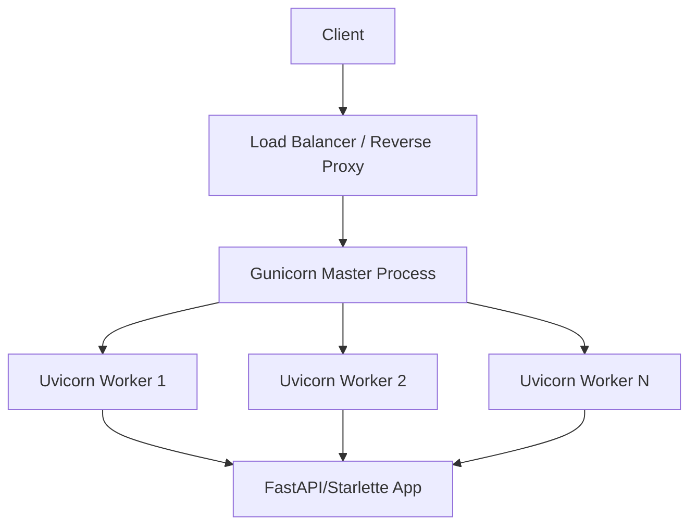
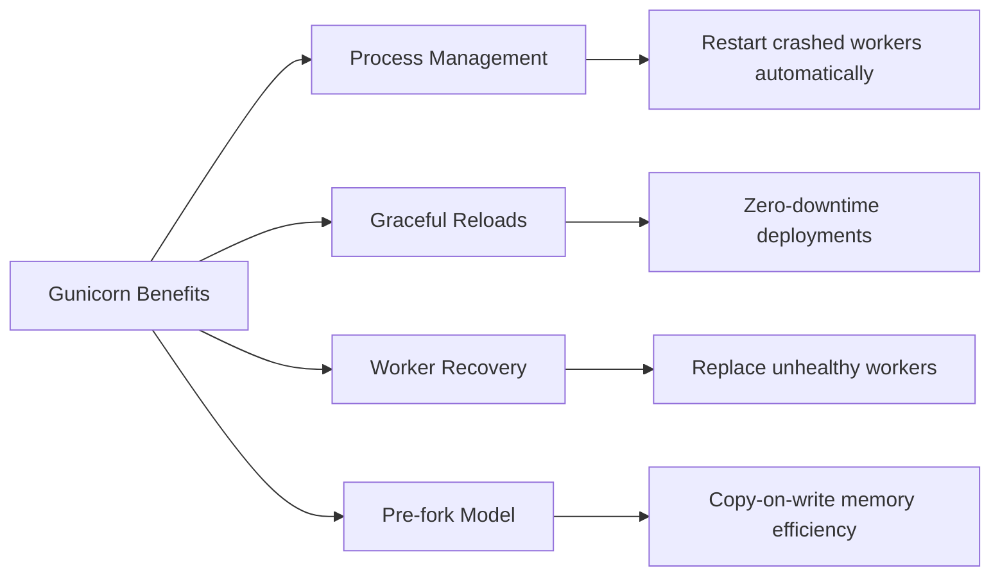

# How to Use Uvicorn for Production Deployments

Author: [nawazdhandala](https://www.github.com/nawazdhandala)

Tags: Python, Uvicorn, ASGI, FastAPI, Gunicorn, Production, Deployment, Docker, Systemd, SSL, Performance

Description: Learn how to configure and deploy Uvicorn in production environments with worker management, SSL/TLS, logging, performance tuning, Docker containers, and systemd services.

---

> Uvicorn is the go-to ASGI server for Python async frameworks like FastAPI and Starlette. While it works great for development with a simple command, production deployments require careful configuration of workers, SSL, logging, and process management. This guide walks you through everything you need to deploy Uvicorn reliably.

Running `uvicorn main:app` is fine for local development, but production is a different story. You need multiple workers to handle concurrent requests, proper SSL termination, structured logging for debugging, and a process manager to keep things running when they crash.

---

## Understanding Uvicorn Architecture

Uvicorn is an ASGI server implementation that uses `uvloop` for fast async performance. Here is how it fits into a typical production stack:



| Component | Role | When to Use |
|-----------|------|-------------|
| **Uvicorn standalone** | Single process ASGI server | Development, low traffic |
| **Uvicorn + Gunicorn** | Multi-process with worker management | Production |
| **Uvicorn behind Nginx** | Reverse proxy + ASGI server | Production with SSL termination |

---

## Basic Uvicorn Configuration

### Installation

Install Uvicorn with the standard extras for better performance.

```bash
# Install uvicorn with uvloop and httptools for best performance
pip install uvicorn[standard]

# Or install components separately
pip install uvicorn uvloop httptools
```

### Command Line Options

The simplest way to run Uvicorn with production-ready settings.

```bash
# Basic production command
uvicorn main:app \
    --host 0.0.0.0 \
    --port 8000 \
    --workers 4 \
    --loop uvloop \
    --http httptools \
    --no-access-log

# With SSL (for direct HTTPS termination)
uvicorn main:app \
    --host 0.0.0.0 \
    --port 443 \
    --ssl-keyfile /path/to/key.pem \
    --ssl-certfile /path/to/cert.pem \
    --workers 4
```

### Programmatic Configuration

For more control, configure Uvicorn programmatically in your application.

```python
# run.py
# Programmatic Uvicorn configuration for production deployments
import uvicorn
import multiprocessing
import os

def get_worker_count():
    """Calculate optimal worker count based on CPU cores"""
    # Formula: (2 x CPU cores) + 1 for I/O bound applications
    # Use fewer workers for CPU-bound apps
    cpu_count = multiprocessing.cpu_count()
    return (2 * cpu_count) + 1

if __name__ == "__main__":
    # Production configuration
    uvicorn.run(
        "app.main:app",  # Import path to your ASGI app
        host="0.0.0.0",  # Bind to all interfaces
        port=int(os.getenv("PORT", 8000)),  # Port from environment
        workers=int(os.getenv("WORKERS", get_worker_count())),  # Worker count
        loop="uvloop",  # Use uvloop for better async performance
        http="httptools",  # Use httptools for faster HTTP parsing
        log_level="info",  # Log level for uvicorn itself
        access_log=False,  # Disable access log (handle in app)
        proxy_headers=True,  # Trust X-Forwarded headers from reverse proxy
        forwarded_allow_ips="*",  # Allow forwarded headers from any IP
    )
```

---

## Running Uvicorn with Gunicorn

Gunicorn provides robust process management that Uvicorn alone does not offer. It handles worker lifecycle, graceful restarts, and process supervision.

### Why Use Gunicorn?



### Basic Gunicorn + Uvicorn Setup

Install Gunicorn and run Uvicorn workers under its supervision.

```bash
# Install gunicorn
pip install gunicorn

# Run with UvicornWorker class
gunicorn main:app \
    --workers 4 \
    --worker-class uvicorn.workers.UvicornWorker \
    --bind 0.0.0.0:8000 \
    --timeout 120 \
    --keep-alive 5 \
    --graceful-timeout 30
```

### Production Gunicorn Configuration

Create a Gunicorn configuration file for comprehensive production settings.

```python
# gunicorn.conf.py
# Production Gunicorn configuration for Uvicorn workers
import multiprocessing
import os

# Server socket binding
bind = os.getenv("BIND", "0.0.0.0:8000")
backlog = 2048  # Maximum pending connections queue

# Worker processes
workers = int(os.getenv("WORKERS", (2 * multiprocessing.cpu_count()) + 1))
worker_class = "uvicorn.workers.UvicornWorker"  # ASGI worker
worker_connections = 1000  # Max simultaneous clients per worker
max_requests = 10000  # Restart worker after this many requests
max_requests_jitter = 1000  # Randomize max_requests to avoid thundering herd

# Timeouts
timeout = 120  # Worker timeout for handling a request
graceful_timeout = 30  # Time to finish requests during shutdown
keepalive = 5  # Seconds to wait for requests on keep-alive connection

# Process naming
proc_name = "myapp"  # Process name in ps output

# Server mechanics
daemon = False  # Do not daemonize (let systemd handle this)
pidfile = None  # PID file path (optional)
user = None  # User to run workers as
group = None  # Group to run workers as
tmp_upload_dir = None  # Temp directory for uploads

# Logging configuration
accesslog = "-"  # Log to stdout for container environments
errorlog = "-"  # Log errors to stderr
loglevel = os.getenv("LOG_LEVEL", "info")
access_log_format = '%(h)s %(l)s %(u)s %(t)s "%(r)s" %(s)s %(b)s "%(f)s" "%(a)s" %(D)s'

# Security settings
limit_request_line = 4094  # Max HTTP request line size
limit_request_fields = 100  # Max number of headers
limit_request_field_size = 8190  # Max size of each header

# SSL configuration (if terminating SSL at Gunicorn)
# Uncomment and configure if not using a reverse proxy for SSL
# keyfile = "/path/to/key.pem"
# certfile = "/path/to/cert.pem"
# ssl_version = "TLSv1_2"
# cert_reqs = 0
# ca_certs = None
# ciphers = "TLS_AES_256_GCM_SHA384:TLS_CHACHA20_POLY1305_SHA256"

# Hook functions for lifecycle events
def on_starting(server):
    """Called before the master process is initialized"""
    print(f"Starting Gunicorn with {workers} workers")

def on_reload(server):
    """Called before reloading the configuration"""
    print("Reloading Gunicorn configuration")

def worker_int(worker):
    """Called when a worker receives SIGINT or SIGQUIT"""
    print(f"Worker {worker.pid} interrupted")

def worker_abort(worker):
    """Called when a worker receives SIGABRT"""
    print(f"Worker {worker.pid} aborted")

def pre_fork(server, worker):
    """Called just before a worker is forked"""
    pass

def post_fork(server, worker):
    """Called just after a worker is forked"""
    print(f"Worker {worker.pid} spawned")

def post_worker_init(worker):
    """Called just after a worker has initialized"""
    pass

def worker_exit(server, worker):
    """Called just after a worker has exited"""
    print(f"Worker {worker.pid} exited")
```

Run Gunicorn with the configuration file.

```bash
# Run with config file
gunicorn main:app --config gunicorn.conf.py

# Or specify config via environment variable
GUNICORN_CMD_ARGS="--config gunicorn.conf.py" gunicorn main:app
```

---

## SSL/TLS Configuration

For production, you typically terminate SSL at a reverse proxy like Nginx. However, Uvicorn can handle SSL directly when needed.

### Direct SSL Termination

Configure Uvicorn to handle HTTPS connections directly.

```python
# ssl_config.py
# Uvicorn SSL configuration for direct HTTPS termination
import ssl
import uvicorn

# Create SSL context with secure settings
ssl_context = ssl.SSLContext(ssl.PROTOCOL_TLS_SERVER)

# Load certificate chain
ssl_context.load_cert_chain(
    certfile="/etc/ssl/certs/server.crt",  # Your certificate
    keyfile="/etc/ssl/private/server.key",  # Your private key
    password=None  # Key password if encrypted
)

# Security settings
ssl_context.minimum_version = ssl.TLSVersion.TLSv1_2  # Minimum TLS 1.2
ssl_context.set_ciphers(  # Modern cipher suite
    "ECDHE+AESGCM:DHE+AESGCM:ECDHE+CHACHA20:DHE+CHACHA20"
)

# Optional: Require client certificates for mutual TLS
# ssl_context.verify_mode = ssl.CERT_REQUIRED
# ssl_context.load_verify_locations("/etc/ssl/certs/ca-bundle.crt")

if __name__ == "__main__":
    uvicorn.run(
        "app.main:app",
        host="0.0.0.0",
        port=443,
        ssl_keyfile="/etc/ssl/private/server.key",
        ssl_certfile="/etc/ssl/certs/server.crt",
        ssl_ca_certs="/etc/ssl/certs/ca-bundle.crt",  # For client cert verification
        workers=4
    )
```

### Nginx Reverse Proxy with SSL

The recommended approach is to terminate SSL at Nginx and proxy to Uvicorn.

```nginx
# /etc/nginx/sites-available/myapp
# Nginx reverse proxy configuration for Uvicorn

# Redirect HTTP to HTTPS
server {
    listen 80;
    server_name example.com;
    return 301 https://$server_name$request_uri;
}

# HTTPS server block
server {
    listen 443 ssl http2;
    server_name example.com;

    # SSL certificate configuration
    ssl_certificate /etc/letsencrypt/live/example.com/fullchain.pem;
    ssl_certificate_key /etc/letsencrypt/live/example.com/privkey.pem;

    # SSL security settings
    ssl_protocols TLSv1.2 TLSv1.3;
    ssl_ciphers ECDHE-ECDSA-AES128-GCM-SHA256:ECDHE-RSA-AES128-GCM-SHA256;
    ssl_prefer_server_ciphers off;
    ssl_session_cache shared:SSL:10m;
    ssl_session_timeout 1d;
    ssl_session_tickets off;

    # HSTS header for security
    add_header Strict-Transport-Security "max-age=63072000" always;

    # Proxy settings for Uvicorn
    location / {
        proxy_pass http://127.0.0.1:8000;
        proxy_http_version 1.1;

        # WebSocket support
        proxy_set_header Upgrade $http_upgrade;
        proxy_set_header Connection "upgrade";

        # Forward client information
        proxy_set_header Host $host;
        proxy_set_header X-Real-IP $remote_addr;
        proxy_set_header X-Forwarded-For $proxy_add_x_forwarded_for;
        proxy_set_header X-Forwarded-Proto $scheme;
        proxy_set_header X-Forwarded-Host $host;
        proxy_set_header X-Forwarded-Port $server_port;

        # Timeouts
        proxy_connect_timeout 60s;
        proxy_send_timeout 60s;
        proxy_read_timeout 60s;

        # Buffering (disable for streaming responses)
        proxy_buffering on;
        proxy_buffer_size 4k;
        proxy_buffers 8 4k;
    }

    # Health check endpoint (bypass rate limiting)
    location /health {
        proxy_pass http://127.0.0.1:8000/health;
        proxy_http_version 1.1;
        proxy_set_header Host $host;
    }

    # Static files (serve directly from Nginx)
    location /static/ {
        alias /var/www/myapp/static/;
        expires 30d;
        add_header Cache-Control "public, immutable";
    }
}
```

---

## Logging Configuration

Proper logging is essential for debugging production issues. Configure both Uvicorn and your application logging.

### Uvicorn Logging Setup

Configure Uvicorn's built-in logging with a custom configuration dictionary.

```python
# logging_config.py
# Production logging configuration for Uvicorn
import logging
import sys

# Logging configuration dictionary
LOGGING_CONFIG = {
    "version": 1,
    "disable_existing_loggers": False,
    "formatters": {
        "default": {
            "()": "uvicorn.logging.DefaultFormatter",
            "fmt": "%(levelprefix)s %(message)s",
            "use_colors": None,  # Auto-detect terminal
        },
        "access": {
            "()": "uvicorn.logging.AccessFormatter",
            "fmt": '%(levelprefix)s %(client_addr)s - "%(request_line)s" %(status_code)s',
        },
        "json": {
            "()": "pythonjsonlogger.jsonlogger.JsonFormatter",
            "fmt": "%(asctime)s %(levelname)s %(name)s %(message)s",
        },
    },
    "handlers": {
        "default": {
            "formatter": "json",  # Use JSON in production
            "class": "logging.StreamHandler",
            "stream": "ext://sys.stdout",
        },
        "access": {
            "formatter": "json",  # Use JSON for access logs too
            "class": "logging.StreamHandler",
            "stream": "ext://sys.stdout",
        },
    },
    "loggers": {
        "uvicorn": {
            "handlers": ["default"],
            "level": "INFO",
            "propagate": False,
        },
        "uvicorn.error": {
            "handlers": ["default"],
            "level": "INFO",
            "propagate": False,
        },
        "uvicorn.access": {
            "handlers": ["access"],
            "level": "INFO",
            "propagate": False,
        },
    },
}

# Apply configuration to Uvicorn
if __name__ == "__main__":
    import uvicorn

    uvicorn.run(
        "app.main:app",
        host="0.0.0.0",
        port=8000,
        log_config=LOGGING_CONFIG,  # Custom logging config
        workers=4
    )
```

### Structured JSON Logging

For production environments, JSON logging enables better parsing and analysis.

```python
# structured_logging.py
# Structured JSON logging for Uvicorn applications
import logging
import json
import sys
from datetime import datetime
from typing import Any, Dict

class JSONFormatter(logging.Formatter):
    """Custom JSON formatter for structured logging"""

    def __init__(self, service_name: str = "uvicorn-app"):
        super().__init__()
        self.service_name = service_name

    def format(self, record: logging.LogRecord) -> str:
        # Build structured log record
        log_data: Dict[str, Any] = {
            "timestamp": datetime.utcnow().isoformat() + "Z",
            "level": record.levelname.lower(),
            "logger": record.name,
            "message": record.getMessage(),
            "service": self.service_name,
        }

        # Add source location for errors
        if record.levelno >= logging.ERROR:
            log_data["source"] = {
                "file": record.pathname,
                "line": record.lineno,
                "function": record.funcName
            }

        # Add exception info if present
        if record.exc_info:
            log_data["exception"] = {
                "type": record.exc_info[0].__name__ if record.exc_info[0] else None,
                "message": str(record.exc_info[1]) if record.exc_info[1] else None,
                "traceback": self.formatException(record.exc_info)
            }

        # Add any extra fields
        for key, value in record.__dict__.items():
            if key not in [
                'name', 'msg', 'args', 'created', 'filename', 'funcName',
                'levelname', 'levelno', 'lineno', 'module', 'msecs',
                'pathname', 'process', 'processName', 'relativeCreated',
                'stack_info', 'exc_info', 'exc_text', 'thread', 'threadName',
                'message', 'taskName'
            ]:
                log_data[key] = value

        return json.dumps(log_data)


def setup_logging(service_name: str = "uvicorn-app", level: str = "INFO"):
    """Configure structured logging for the application"""

    # Create JSON formatter
    formatter = JSONFormatter(service_name)

    # Create stdout handler
    handler = logging.StreamHandler(sys.stdout)
    handler.setFormatter(formatter)

    # Configure root logger
    root = logging.getLogger()
    root.handlers = []
    root.addHandler(handler)
    root.setLevel(getattr(logging, level.upper()))

    # Configure uvicorn loggers to use same format
    for logger_name in ["uvicorn", "uvicorn.error", "uvicorn.access"]:
        logger = logging.getLogger(logger_name)
        logger.handlers = []
        logger.addHandler(handler)
        logger.propagate = False

    return root


# Initialize logging before starting the app
setup_logging("my-api", "INFO")
```

### Access Logging Middleware

Create custom access logging with request timing and metadata.

```python
# access_logging.py
# Custom access logging middleware for FastAPI
from fastapi import FastAPI, Request
from starlette.middleware.base import BaseHTTPMiddleware
import logging
import time
import uuid

logger = logging.getLogger("access")

class AccessLogMiddleware(BaseHTTPMiddleware):
    """Middleware to log all HTTP requests with timing"""

    async def dispatch(self, request: Request, call_next):
        # Generate request ID for tracing
        request_id = request.headers.get("X-Request-ID", str(uuid.uuid4()))
        start_time = time.time()

        # Process request
        response = await call_next(request)

        # Calculate duration
        duration_ms = (time.time() - start_time) * 1000

        # Log the request
        logger.info(
            "Request completed",
            extra={
                "request_id": request_id,
                "method": request.method,
                "path": request.url.path,
                "query": str(request.query_params),
                "status_code": response.status_code,
                "duration_ms": round(duration_ms, 2),
                "client_ip": request.client.host if request.client else "unknown",
                "user_agent": request.headers.get("user-agent", "unknown"),
            }
        )

        # Add request ID to response headers
        response.headers["X-Request-ID"] = request_id

        return response

# Add middleware to your app
app = FastAPI()
app.add_middleware(AccessLogMiddleware)
```

---

## Performance Tuning

Optimize Uvicorn for your specific workload and hardware.

### Worker Calculation

Choose the right number of workers based on your application type.

```python
# worker_config.py
# Worker calculation for different application types
import multiprocessing
import os

def calculate_workers(app_type: str = "io_bound") -> int:
    """
    Calculate optimal worker count based on application characteristics.

    - IO-bound apps (API calls, database queries): More workers
    - CPU-bound apps (image processing, ML inference): Fewer workers
    - Mixed workloads: Balance based on profiling
    """
    cpu_count = multiprocessing.cpu_count()

    if app_type == "io_bound":
        # IO-bound: (2 x CPU) + 1
        # Workers spend time waiting for IO, so more is better
        return (2 * cpu_count) + 1

    elif app_type == "cpu_bound":
        # CPU-bound: CPU count only
        # More workers would compete for CPU time
        return cpu_count

    elif app_type == "mixed":
        # Mixed workload: 1.5 x CPU
        # Balance between IO waiting and CPU usage
        return int(1.5 * cpu_count)

    else:
        # Default to IO-bound assumption
        return (2 * cpu_count) + 1


# Environment variable based configuration
WORKERS = int(os.getenv("WORKERS", calculate_workers(
    os.getenv("APP_TYPE", "io_bound")
)))

print(f"Configured {WORKERS} workers for {os.getenv('APP_TYPE', 'io_bound')} workload")
```

### Connection and Timeout Tuning

Configure connection limits and timeouts for your traffic patterns.

```python
# performance_config.py
# Performance tuning configuration
import uvicorn
import os

# Performance-optimized configuration
config = uvicorn.Config(
    "app.main:app",
    host="0.0.0.0",
    port=8000,

    # Worker settings
    workers=int(os.getenv("WORKERS", 4)),
    loop="uvloop",  # Fast event loop
    http="httptools",  # Fast HTTP parser

    # Connection settings
    limit_concurrency=1000,  # Max concurrent connections per worker
    limit_max_requests=10000,  # Restart worker after N requests
    backlog=2048,  # Connection queue size

    # Timeout settings
    timeout_keep_alive=5,  # Keep-alive timeout in seconds
    timeout_notify=30,  # Graceful shutdown timeout

    # Header limits
    h11_max_incomplete_event_size=16384,  # Max header size

    # Disable access logging for performance
    # Handle access logging in your app instead
    access_log=False,

    # Trust proxy headers (when behind load balancer)
    proxy_headers=True,
    forwarded_allow_ips="*",
)

if __name__ == "__main__":
    server = uvicorn.Server(config)
    server.run()
```

### Memory Optimization

Reduce memory usage with preloading and copy-on-write benefits.

```python
# gunicorn_preload.conf.py
# Memory-optimized Gunicorn configuration with preloading
import multiprocessing

bind = "0.0.0.0:8000"
workers = (2 * multiprocessing.cpu_count()) + 1
worker_class = "uvicorn.workers.UvicornWorker"

# Preload app for copy-on-write memory sharing
# Workers share read-only memory pages from the master process
preload_app = True

# Restart workers periodically to prevent memory leaks
max_requests = 10000  # Restart after 10k requests
max_requests_jitter = 1000  # Add randomness to prevent thundering herd

# Worker memory monitoring (requires setproctitle)
worker_tmp_dir = "/dev/shm"  # Use shared memory for worker temp files

def post_fork(server, worker):
    """Called after worker fork - good place for per-worker setup"""
    # Import heavy libraries here if they don't work well with preload
    pass

def pre_request(worker, req):
    """Called just before handling each request"""
    # Can be used for per-request setup
    pass

def post_request(worker, req, environ, resp):
    """Called after handling each request"""
    # Can be used for cleanup
    pass
```

---

## Docker Deployment

Package your Uvicorn application in a Docker container for consistent deployments.

### Production Dockerfile

A multi-stage Dockerfile that creates a minimal production image.

```dockerfile
# Dockerfile
# Multi-stage build for minimal production image

# Build stage - install dependencies
FROM python:3.11-slim as builder

WORKDIR /app

# Install build dependencies
RUN apt-get update && apt-get install -y --no-install-recommends \
    build-essential \
    && rm -rf /var/lib/apt/lists/*

# Create virtual environment
RUN python -m venv /opt/venv
ENV PATH="/opt/venv/bin:$PATH"

# Install Python dependencies
COPY requirements.txt .
RUN pip install --no-cache-dir --upgrade pip && \
    pip install --no-cache-dir -r requirements.txt

# Production stage - minimal runtime image
FROM python:3.11-slim as production

WORKDIR /app

# Create non-root user for security
RUN groupadd --gid 1000 appgroup && \
    useradd --uid 1000 --gid appgroup --shell /bin/bash appuser

# Copy virtual environment from builder
COPY --from=builder /opt/venv /opt/venv
ENV PATH="/opt/venv/bin:$PATH"

# Copy application code
COPY --chown=appuser:appgroup . .

# Switch to non-root user
USER appuser

# Environment variables for production
ENV PYTHONDONTWRITEBYTECODE=1 \
    PYTHONUNBUFFERED=1 \
    PYTHONPATH=/app \
    PORT=8000 \
    WORKERS=4

# Expose the application port
EXPOSE 8000

# Health check
HEALTHCHECK --interval=30s --timeout=10s --start-period=5s --retries=3 \
    CMD python -c "import urllib.request; urllib.request.urlopen('http://localhost:8000/health')"

# Run with Gunicorn + Uvicorn workers
CMD ["gunicorn", "app.main:app", \
     "--worker-class", "uvicorn.workers.UvicornWorker", \
     "--bind", "0.0.0.0:8000", \
     "--workers", "4", \
     "--timeout", "120", \
     "--keep-alive", "5", \
     "--access-logfile", "-", \
     "--error-logfile", "-"]
```

### Docker Compose for Development and Production

Configure both development and production environments with Docker Compose.

```yaml
# docker-compose.yml
# Docker Compose configuration for development and production

version: "3.8"

services:
  api:
    build:
      context: .
      dockerfile: Dockerfile
      target: production
    ports:
      - "8000:8000"
    environment:
      - WORKERS=4
      - LOG_LEVEL=info
      - DATABASE_URL=postgresql://postgres:password@db:5432/myapp
      - REDIS_URL=redis://redis:6379/0
    depends_on:
      db:
        condition: service_healthy
      redis:
        condition: service_healthy
    healthcheck:
      test: ["CMD", "python", "-c", "import urllib.request; urllib.request.urlopen('http://localhost:8000/health')"]
      interval: 30s
      timeout: 10s
      retries: 3
      start_period: 10s
    deploy:
      resources:
        limits:
          cpus: "2"
          memory: 1G
        reservations:
          cpus: "0.5"
          memory: 256M
    restart: unless-stopped

  db:
    image: postgres:15-alpine
    environment:
      POSTGRES_USER: postgres
      POSTGRES_PASSWORD: password
      POSTGRES_DB: myapp
    volumes:
      - postgres_data:/var/lib/postgresql/data
    healthcheck:
      test: ["CMD-SHELL", "pg_isready -U postgres"]
      interval: 10s
      timeout: 5s
      retries: 5

  redis:
    image: redis:7-alpine
    volumes:
      - redis_data:/data
    healthcheck:
      test: ["CMD", "redis-cli", "ping"]
      interval: 10s
      timeout: 5s
      retries: 5

  nginx:
    image: nginx:alpine
    ports:
      - "80:80"
      - "443:443"
    volumes:
      - ./nginx.conf:/etc/nginx/nginx.conf:ro
      - ./ssl:/etc/nginx/ssl:ro
    depends_on:
      - api
    restart: unless-stopped

volumes:
  postgres_data:
  redis_data:
```

### Kubernetes Deployment

Deploy Uvicorn to Kubernetes with proper resource management and probes.

```yaml
# kubernetes/deployment.yaml
# Kubernetes deployment for Uvicorn application
apiVersion: apps/v1
kind: Deployment
metadata:
  name: uvicorn-api
  labels:
    app: uvicorn-api
spec:
  replicas: 3
  selector:
    matchLabels:
      app: uvicorn-api
  template:
    metadata:
      labels:
        app: uvicorn-api
    spec:
      terminationGracePeriodSeconds: 60
      containers:
      - name: api
        image: myregistry/uvicorn-api:latest
        ports:
        - containerPort: 8000
        env:
        - name: WORKERS
          value: "2"  # Fewer workers per pod since K8s scales pods
        - name: LOG_LEVEL
          value: "info"
        resources:
          requests:
            cpu: "250m"
            memory: "256Mi"
          limits:
            cpu: "1000m"
            memory: "512Mi"

        # Startup probe - wait for app to initialize
        startupProbe:
          httpGet:
            path: /health
            port: 8000
          initialDelaySeconds: 5
          periodSeconds: 5
          failureThreshold: 30

        # Liveness probe - restart if unhealthy
        livenessProbe:
          httpGet:
            path: /health
            port: 8000
          initialDelaySeconds: 0
          periodSeconds: 10
          timeoutSeconds: 5
          failureThreshold: 3

        # Readiness probe - remove from service if not ready
        readinessProbe:
          httpGet:
            path: /ready
            port: 8000
          initialDelaySeconds: 0
          periodSeconds: 5
          timeoutSeconds: 5
          failureThreshold: 3

        lifecycle:
          preStop:
            exec:
              # Allow time for load balancer to stop sending traffic
              command: ["/bin/sh", "-c", "sleep 10"]
---
apiVersion: v1
kind: Service
metadata:
  name: uvicorn-api
spec:
  selector:
    app: uvicorn-api
  ports:
  - port: 80
    targetPort: 8000
  type: ClusterIP
```

---

## Systemd Service Setup

For bare-metal or VM deployments, use systemd to manage your Uvicorn process.

### Basic Systemd Service

Create a systemd service file for your application.

```ini
# /etc/systemd/system/uvicorn-api.service
# Systemd service file for Uvicorn with Gunicorn

[Unit]
Description=Uvicorn API Service
Documentation=https://www.uvicorn.org/
After=network.target
Wants=network-online.target

[Service]
Type=notify
User=www-data
Group=www-data
WorkingDirectory=/var/www/myapp
Environment="PATH=/var/www/myapp/venv/bin"
Environment="PYTHONPATH=/var/www/myapp"
Environment="WORKERS=4"
Environment="LOG_LEVEL=info"

# Run Gunicorn with Uvicorn workers
ExecStart=/var/www/myapp/venv/bin/gunicorn app.main:app \
    --worker-class uvicorn.workers.UvicornWorker \
    --bind unix:/var/run/uvicorn/uvicorn.sock \
    --workers ${WORKERS} \
    --timeout 120 \
    --keep-alive 5 \
    --access-logfile - \
    --error-logfile -

# Graceful reload
ExecReload=/bin/kill -s HUP $MAINPID

# Restart policy
Restart=on-failure
RestartSec=5

# Security hardening
NoNewPrivileges=true
PrivateTmp=true
ProtectSystem=strict
ProtectHome=true
ReadWritePaths=/var/run/uvicorn /var/log/uvicorn

# Resource limits
LimitNOFILE=65535
LimitNPROC=65535

[Install]
WantedBy=multi-user.target
```

### Socket Activation

Use socket activation for better systemd integration and zero-downtime restarts.

```ini
# /etc/systemd/system/uvicorn-api.socket
# Systemd socket file for socket activation

[Unit]
Description=Uvicorn API Socket
PartOf=uvicorn-api.service

[Socket]
ListenStream=/var/run/uvicorn/uvicorn.sock
SocketUser=www-data
SocketGroup=www-data
SocketMode=0660

[Install]
WantedBy=sockets.target
```

### Managing the Service

Common systemd commands for managing your Uvicorn service.

```bash
# Create socket directory
sudo mkdir -p /var/run/uvicorn
sudo chown www-data:www-data /var/run/uvicorn

# Reload systemd configuration
sudo systemctl daemon-reload

# Enable and start the service
sudo systemctl enable uvicorn-api.socket
sudo systemctl enable uvicorn-api.service
sudo systemctl start uvicorn-api.socket
sudo systemctl start uvicorn-api.service

# Check status
sudo systemctl status uvicorn-api.service

# View logs
sudo journalctl -u uvicorn-api.service -f

# Graceful reload (zero downtime)
sudo systemctl reload uvicorn-api.service

# Restart (brief downtime)
sudo systemctl restart uvicorn-api.service

# Stop the service
sudo systemctl stop uvicorn-api.service
```

---

## Health Checks and Monitoring

Implement health checks for load balancers and orchestrators.

```python
# health.py
# Health check endpoints for production monitoring
from fastapi import FastAPI, Response, status
from datetime import datetime
import asyncio

app = FastAPI()

# Track application state
startup_time = datetime.utcnow()
ready = False
shutting_down = False

@app.on_event("startup")
async def startup():
    global ready
    # Initialize connections, warm caches, etc.
    await initialize_services()
    ready = True

@app.on_event("shutdown")
async def shutdown():
    global shutting_down, ready
    shutting_down = True
    ready = False
    # Wait for in-flight requests
    await asyncio.sleep(5)
    # Close connections
    await cleanup_services()

@app.get("/health")
async def health_check():
    """
    Liveness probe - is the process alive?
    Keep this simple and fast.
    """
    return {
        "status": "healthy",
        "timestamp": datetime.utcnow().isoformat()
    }

@app.get("/ready")
async def readiness_check(response: Response):
    """
    Readiness probe - can we handle traffic?
    Check dependencies and return 503 if not ready.
    """
    if shutting_down:
        response.status_code = status.HTTP_503_SERVICE_UNAVAILABLE
        return {"status": "shutting_down"}

    if not ready:
        response.status_code = status.HTTP_503_SERVICE_UNAVAILABLE
        return {"status": "not_ready"}

    # Check critical dependencies
    db_healthy = await check_database()
    cache_healthy = await check_cache()

    if not db_healthy or not cache_healthy:
        response.status_code = status.HTTP_503_SERVICE_UNAVAILABLE
        return {
            "status": "unhealthy",
            "database": db_healthy,
            "cache": cache_healthy
        }

    return {
        "status": "ready",
        "uptime_seconds": (datetime.utcnow() - startup_time).total_seconds()
    }

@app.get("/metrics")
async def metrics():
    """Prometheus-style metrics endpoint"""
    # Return metrics in Prometheus format
    return Response(
        content=generate_prometheus_metrics(),
        media_type="text/plain"
    )
```

---

## Best Practices Summary

### 1. Use Gunicorn for Process Management

```bash
# Always use Gunicorn in production for worker management
gunicorn app:app --worker-class uvicorn.workers.UvicornWorker --workers 4
```

### 2. Calculate Workers Based on Workload

```python
# IO-bound (most web apps)
workers = (2 * cpu_count) + 1

# CPU-bound (ML inference, image processing)
workers = cpu_count
```

### 3. Terminate SSL at Reverse Proxy

```nginx
# Let Nginx handle SSL, proxy to Uvicorn over HTTP
proxy_pass http://127.0.0.1:8000;
```

### 4. Use JSON Logging

```python
# Structured logs for easier parsing and analysis
log_config = {"formatters": {"json": {"class": "JSONFormatter"}}}
```

### 5. Implement Proper Health Checks

```python
# Separate liveness and readiness probes
@app.get("/health")  # Simple - is process alive?
@app.get("/ready")   # Comprehensive - can handle traffic?
```

### 6. Run as Non-Root User

```dockerfile
# Security best practice in containers
USER appuser
```

---

## Conclusion

Deploying Uvicorn in production requires more than just running the development server. Key takeaways:

- **Use Gunicorn** as a process manager for worker lifecycle management
- **Calculate workers** based on whether your app is IO or CPU bound
- **Terminate SSL** at a reverse proxy like Nginx for better performance
- **Configure logging** with JSON format for production observability
- **Implement health checks** for load balancers and orchestrators
- **Use systemd or Docker** for process supervision and auto-restart

With these configurations in place, your Uvicorn deployment will be ready for production traffic.

---

*Need to monitor your Uvicorn applications? [OneUptime](https://oneuptime.com) provides comprehensive monitoring with automatic health checks, performance metrics, and alerting for Python applications.*

**Related Reading:**
- [How to Build Health Checks and Readiness Probes in Python for Kubernetes](https://oneuptime.com/blog/post/2025-01-06-python-health-checks-kubernetes/view)
- [How to Structure Logs Properly in Python with OpenTelemetry](https://oneuptime.com/blog/post/2025-01-06-python-structured-logging-opentelemetry/view)
- [How to Implement Rate Limiting in FastAPI](https://oneuptime.com/blog/post/2025-01-06-fastapi-rate-limiting/view)
