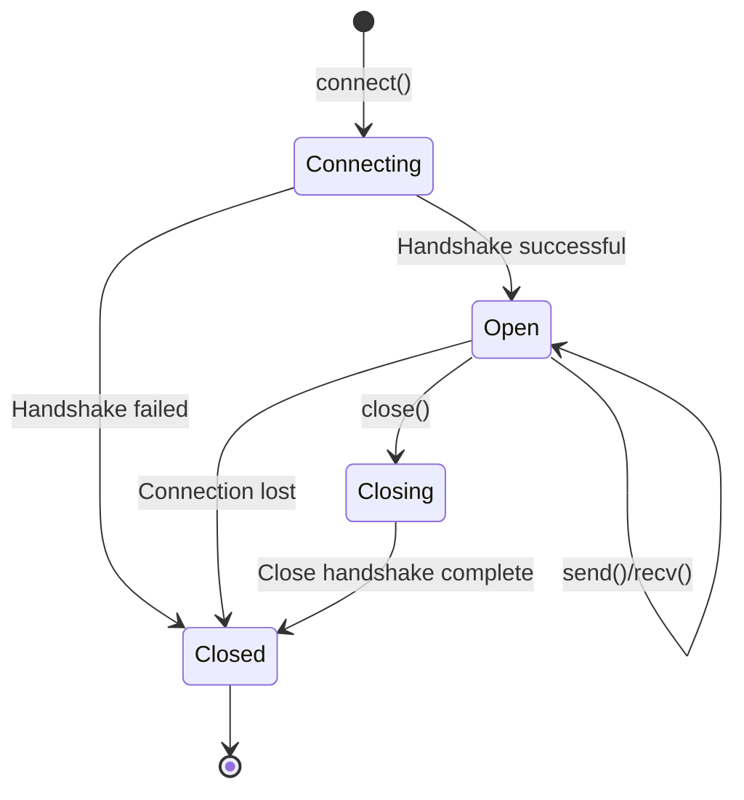
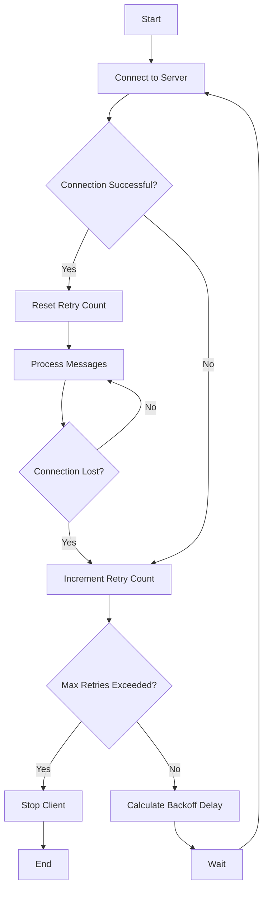

# How to Build WebSocket Clients in Python

Author: [nawazdhandala](https://www.github.com/nawazdhandala)

Tags: Python, WebSocket, Async, Real-time, Networking, websockets

Description: Learn how to build robust WebSocket clients in Python using the websockets library, covering connections, message handling, reconnection logic, and real-world patterns.

---

> WebSocket clients enable your Python applications to maintain persistent, bidirectional connections with servers. Whether you're building chat applications, streaming live data, or monitoring systems, understanding how to create reliable WebSocket clients is essential.

This guide covers the `websockets` library - the most popular async WebSocket implementation for Python. You'll learn how to connect to servers, send and receive messages, handle disconnections gracefully, and implement production-ready patterns.

---

## Installation

The websockets library provides a clean async API built on top of asyncio. Install it with pip:

```bash
pip install websockets
```

For additional features like SSL certificate handling:

```bash
pip install websockets[speedups]
```

---

## Basic WebSocket Client

This minimal example shows how to connect to a WebSocket server, send a message, and receive a response. The async context manager handles connection cleanup automatically.

```python
# basic_client.py
# Simple WebSocket client that sends one message and receives a response
import asyncio
import websockets

async def hello():
    # Connect to WebSocket server using async context manager
    uri = "ws://localhost:8765"
    async with websockets.connect(uri) as websocket:
        # Send a message to the server
        await websocket.send("Hello, Server!")
        print("Sent: Hello, Server!")

        # Wait for and receive the response
        response = await websocket.recv()
        print(f"Received: {response}")

# Run the async function
asyncio.run(hello())
```

---

## WebSocket Connection Lifecycle

Understanding the connection lifecycle helps you handle each state appropriately. The diagram below shows the typical flow from connection to disconnection.



---

## Persistent Connection with Message Loop

Real applications need to maintain long-running connections and continuously process messages. This pattern keeps the connection open and handles incoming messages in a loop.

```python
# persistent_client.py
# WebSocket client that maintains a persistent connection
import asyncio
import websockets
import json

async def listen_forever():
    uri = "wss://api.example.com/ws"

    async with websockets.connect(uri) as websocket:
        print("Connected to server")

        # Continuous message loop - runs until connection closes
        async for message in websocket:
            # Parse JSON messages (common format for WebSocket APIs)
            data = json.loads(message)
            print(f"Received: {data}")

            # Handle different message types
            if data.get("type") == "ping":
                # Respond to server pings to keep connection alive
                await websocket.send(json.dumps({"type": "pong"}))
            elif data.get("type") == "update":
                # Process update messages
                await process_update(data)

async def process_update(data):
    """Handle update messages from the server"""
    print(f"Processing update: {data.get('payload')}")

asyncio.run(listen_forever())
```

---

## Sending and Receiving Messages

WebSocket communication is bidirectional - you can send and receive messages independently. This example shows how to handle both directions concurrently using asyncio tasks.

```python
# bidirectional_client.py
# WebSocket client with separate send and receive loops
import asyncio
import websockets
import json
from datetime import datetime

class WebSocketClient:
    """WebSocket client with bidirectional message handling"""

    def __init__(self, uri):
        self.uri = uri
        self.websocket = None
        self.running = False
        # Queue for outgoing messages
        self.send_queue = asyncio.Queue()

    async def connect(self):
        """Establish WebSocket connection"""
        self.websocket = await websockets.connect(self.uri)
        self.running = True
        print(f"Connected to {self.uri}")

    async def disconnect(self):
        """Close the WebSocket connection gracefully"""
        self.running = False
        if self.websocket:
            await self.websocket.close()
            print("Disconnected")

    async def send_message(self, message: dict):
        """Queue a message for sending"""
        await self.send_queue.put(message)

    async def _sender(self):
        """Task that sends queued messages to the server"""
        while self.running:
            try:
                # Wait for message from queue with timeout
                message = await asyncio.wait_for(
                    self.send_queue.get(),
                    timeout=1.0
                )
                # Serialize and send the message
                await self.websocket.send(json.dumps(message))
                print(f"Sent: {message}")
            except asyncio.TimeoutError:
                # No message in queue, continue loop
                continue
            except websockets.ConnectionClosed:
                print("Connection closed while sending")
                break

    async def _receiver(self):
        """Task that receives and processes messages from the server"""
        while self.running:
            try:
                # Wait for incoming message
                message = await self.websocket.recv()
                data = json.loads(message)
                await self._handle_message(data)
            except websockets.ConnectionClosed:
                print("Connection closed while receiving")
                break

    async def _handle_message(self, data: dict):
        """Process received messages based on type"""
        msg_type = data.get("type", "unknown")

        if msg_type == "welcome":
            print(f"Server welcome: {data.get('message')}")
        elif msg_type == "data":
            print(f"Data received: {data.get('payload')}")
        elif msg_type == "error":
            print(f"Server error: {data.get('error')}")
        else:
            print(f"Unknown message type: {data}")

    async def run(self):
        """Main entry point - connects and runs send/receive tasks"""
        await self.connect()

        # Run sender and receiver concurrently
        sender_task = asyncio.create_task(self._sender())
        receiver_task = asyncio.create_task(self._receiver())

        # Wait for both tasks (they run until connection closes)
        await asyncio.gather(sender_task, receiver_task)


async def main():
    client = WebSocketClient("ws://localhost:8765")

    # Start the client in background
    client_task = asyncio.create_task(client.run())

    # Simulate sending messages from application logic
    await asyncio.sleep(1)
    await client.send_message({"type": "subscribe", "channel": "updates"})

    await asyncio.sleep(5)
    await client.send_message({"type": "unsubscribe", "channel": "updates"})

    await asyncio.sleep(1)
    await client.disconnect()

asyncio.run(main())
```

---

## Handling Connection Errors

Network connections fail. Servers go down. Your client needs to handle these situations gracefully. This example demonstrates proper error handling for various failure modes.

```python
# error_handling.py
# WebSocket client with comprehensive error handling
import asyncio
import websockets
from websockets.exceptions import (
    ConnectionClosed,
    ConnectionClosedError,
    ConnectionClosedOK,
    InvalidStatusCode,
    InvalidHandshake
)

async def connect_with_error_handling():
    uri = "wss://api.example.com/ws"

    try:
        async with websockets.connect(
            uri,
            open_timeout=10,    # Timeout for connection handshake
            close_timeout=10,   # Timeout for close handshake
            ping_interval=20,   # Send ping every 20 seconds
            ping_timeout=20     # Wait 20 seconds for pong response
        ) as websocket:

            async for message in websocket:
                print(f"Received: {message}")

    except InvalidHandshake as e:
        # Server rejected the WebSocket handshake
        print(f"Handshake failed: {e}")

    except InvalidStatusCode as e:
        # Server returned unexpected HTTP status code
        print(f"Invalid status code: {e.status_code}")

    except ConnectionClosedError as e:
        # Connection closed with an error (non-1000 status code)
        print(f"Connection closed with error: code={e.code}, reason={e.reason}")

    except ConnectionClosedOK:
        # Normal closure (status code 1000)
        print("Connection closed normally")

    except ConnectionClosed as e:
        # Generic connection closed (covers both OK and error)
        print(f"Connection closed: code={e.code}, reason={e.reason}")

    except asyncio.TimeoutError:
        # Connection or operation timed out
        print("Connection timed out")

    except OSError as e:
        # Network-level error (DNS failure, connection refused, etc.)
        print(f"Network error: {e}")

asyncio.run(connect_with_error_handling())
```

---

## Automatic Reconnection

Production clients need to automatically reconnect when connections drop. This pattern implements exponential backoff to avoid overwhelming the server during outages.

```python
# reconnecting_client.py
# WebSocket client with automatic reconnection and exponential backoff
import asyncio
import websockets
import json
import random

class ReconnectingWebSocket:
    """WebSocket client that automatically reconnects on disconnection"""

    def __init__(
        self,
        uri: str,
        initial_delay: float = 1.0,
        max_delay: float = 60.0,
        max_retries: int = None  # None means retry forever
    ):
        self.uri = uri
        self.initial_delay = initial_delay
        self.max_delay = max_delay
        self.max_retries = max_retries
        self.websocket = None
        self.running = False
        self._retry_count = 0

    def _calculate_backoff(self) -> float:
        """Calculate delay with exponential backoff and jitter"""
        # Exponential backoff: 1s, 2s, 4s, 8s, ...
        delay = self.initial_delay * (2 ** self._retry_count)
        # Cap at maximum delay
        delay = min(delay, self.max_delay)
        # Add random jitter (0-25%) to prevent thundering herd
        jitter = delay * random.uniform(0, 0.25)
        return delay + jitter

    async def connect(self):
        """Establish connection with retry logic"""
        while True:
            try:
                self.websocket = await websockets.connect(
                    self.uri,
                    ping_interval=30,
                    ping_timeout=10
                )
                # Reset retry count on successful connection
                self._retry_count = 0
                print(f"Connected to {self.uri}")
                return True

            except Exception as e:
                self._retry_count += 1

                # Check if we've exceeded max retries
                if self.max_retries and self._retry_count > self.max_retries:
                    print(f"Max retries ({self.max_retries}) exceeded")
                    return False

                delay = self._calculate_backoff()
                print(f"Connection failed: {e}")
                print(f"Reconnecting in {delay:.1f}s (attempt {self._retry_count})")
                await asyncio.sleep(delay)

    async def run(self, message_handler):
        """Run the client with automatic reconnection"""
        self.running = True

        while self.running:
            # Attempt to connect
            if not await self.connect():
                break

            try:
                # Process messages until disconnection
                async for message in self.websocket:
                    await message_handler(json.loads(message))

            except websockets.ConnectionClosed as e:
                print(f"Connection lost: code={e.code}, reason={e.reason}")
                # Loop will reconnect automatically

            except Exception as e:
                print(f"Error: {e}")
                # Brief delay before reconnection attempt
                await asyncio.sleep(1)

    async def send(self, data: dict):
        """Send a message, with connection check"""
        if self.websocket and self.websocket.open:
            await self.websocket.send(json.dumps(data))
        else:
            print("Cannot send: not connected")

    async def stop(self):
        """Stop the client gracefully"""
        self.running = False
        if self.websocket:
            await self.websocket.close()


async def handle_message(data):
    """Application message handler"""
    print(f"Processing: {data}")


async def main():
    client = ReconnectingWebSocket(
        "ws://localhost:8765",
        initial_delay=1.0,
        max_delay=30.0
    )

    try:
        await client.run(handle_message)
    except KeyboardInterrupt:
        await client.stop()

asyncio.run(main())
```

---

## Reconnection Strategy Flow

The reconnection strategy uses exponential backoff to progressively increase the delay between retry attempts. This prevents overwhelming the server while still attempting to restore connectivity.



---

## Heartbeat and Keep-Alive

Some WebSocket servers require periodic heartbeat messages to keep connections alive. The websockets library handles protocol-level pings automatically, but application-level heartbeats may also be needed.

```python
# heartbeat_client.py
# WebSocket client with application-level heartbeat
import asyncio
import websockets
import json
from datetime import datetime

class HeartbeatClient:
    """WebSocket client with custom heartbeat mechanism"""

    def __init__(self, uri: str, heartbeat_interval: int = 30):
        self.uri = uri
        self.heartbeat_interval = heartbeat_interval
        self.websocket = None
        self.running = False
        self.last_pong = None

    async def _heartbeat_loop(self):
        """Send periodic heartbeat messages to server"""
        while self.running:
            try:
                await asyncio.sleep(self.heartbeat_interval)

                if not self.websocket or not self.websocket.open:
                    continue

                # Send heartbeat with timestamp
                heartbeat = {
                    "type": "ping",
                    "timestamp": datetime.utcnow().isoformat()
                }
                await self.websocket.send(json.dumps(heartbeat))
                print(f"Sent heartbeat at {heartbeat['timestamp']}")

            except websockets.ConnectionClosed:
                print("Connection closed during heartbeat")
                break
            except Exception as e:
                print(f"Heartbeat error: {e}")

    async def _receiver_loop(self):
        """Receive and process messages from server"""
        while self.running:
            try:
                message = await self.websocket.recv()
                data = json.loads(message)

                # Handle heartbeat response
                if data.get("type") == "pong":
                    self.last_pong = datetime.utcnow()
                    latency = self._calculate_latency(data.get("timestamp"))
                    print(f"Received pong, latency: {latency}ms")
                else:
                    # Process other message types
                    await self._handle_message(data)

            except websockets.ConnectionClosed:
                print("Connection closed during receive")
                break

    def _calculate_latency(self, sent_timestamp: str) -> int:
        """Calculate round-trip latency in milliseconds"""
        if not sent_timestamp:
            return 0
        sent = datetime.fromisoformat(sent_timestamp)
        now = datetime.utcnow()
        return int((now - sent).total_seconds() * 1000)

    async def _handle_message(self, data: dict):
        """Process non-heartbeat messages"""
        print(f"Message received: {data}")

    async def run(self):
        """Main entry point"""
        self.running = True

        async with websockets.connect(self.uri) as websocket:
            self.websocket = websocket
            print("Connected")

            # Run heartbeat and receiver concurrently
            heartbeat_task = asyncio.create_task(self._heartbeat_loop())
            receiver_task = asyncio.create_task(self._receiver_loop())

            # Wait for either task to complete (usually means disconnect)
            done, pending = await asyncio.wait(
                [heartbeat_task, receiver_task],
                return_when=asyncio.FIRST_COMPLETED
            )

            # Cancel remaining tasks
            for task in pending:
                task.cancel()

asyncio.run(HeartbeatClient("ws://localhost:8765").run())
```

---

## Authentication

Most WebSocket APIs require authentication. Common patterns include passing tokens in headers, query parameters, or sending an auth message after connection.

```python
# authenticated_client.py
# WebSocket client with various authentication methods
import asyncio
import websockets
import json
import base64

# Method 1: Token in headers (most common)
async def connect_with_header_auth():
    """Connect with Bearer token in Authorization header"""
    token = "your-jwt-token-here"

    extra_headers = {
        "Authorization": f"Bearer {token}"
    }

    async with websockets.connect(
        "wss://api.example.com/ws",
        extra_headers=extra_headers
    ) as websocket:
        print("Connected with header auth")
        async for message in websocket:
            print(f"Received: {message}")


# Method 2: Token in query parameter
async def connect_with_query_auth():
    """Connect with token in URL query parameter"""
    token = "your-api-token"
    uri = f"wss://api.example.com/ws?token={token}"

    async with websockets.connect(uri) as websocket:
        print("Connected with query auth")
        async for message in websocket:
            print(f"Received: {message}")


# Method 3: Authentication message after connection
async def connect_with_message_auth():
    """Connect and send auth message as first message"""
    async with websockets.connect("wss://api.example.com/ws") as websocket:
        # Send authentication message immediately after connect
        auth_message = {
            "type": "auth",
            "api_key": "your-api-key",
            "api_secret": "your-api-secret"
        }
        await websocket.send(json.dumps(auth_message))

        # Wait for auth response
        response = await websocket.recv()
        auth_result = json.loads(response)

        if auth_result.get("type") == "auth_success":
            print("Authentication successful")
            # Now we can use the connection normally
            async for message in websocket:
                print(f"Received: {message}")
        else:
            print(f"Authentication failed: {auth_result.get('error')}")


# Method 4: Basic authentication
async def connect_with_basic_auth():
    """Connect with HTTP Basic authentication"""
    username = "user"
    password = "pass"

    # Encode credentials as base64
    credentials = base64.b64encode(f"{username}:{password}".encode()).decode()

    extra_headers = {
        "Authorization": f"Basic {credentials}"
    }

    async with websockets.connect(
        "wss://api.example.com/ws",
        extra_headers=extra_headers
    ) as websocket:
        print("Connected with basic auth")
        async for message in websocket:
            print(f"Received: {message}")


asyncio.run(connect_with_header_auth())
```

---

## Real-World Example: Live Data Feed Client

This production-ready example demonstrates a client for streaming live data - similar to stock prices, cryptocurrency rates, or IoT sensor data. It combines authentication, subscription management, reconnection, and proper error handling.

```python
# live_data_client.py
# Production-ready WebSocket client for streaming live data
import asyncio
import websockets
import json
from datetime import datetime
from typing import Callable, Dict, List, Optional
from dataclasses import dataclass
import logging

# Configure logging
logging.basicConfig(level=logging.INFO)
logger = logging.getLogger(__name__)

@dataclass
class DataUpdate:
    """Represents a single data update from the feed"""
    symbol: str
    price: float
    volume: float
    timestamp: datetime


class LiveDataClient:
    """Client for streaming live data with subscriptions"""

    def __init__(
        self,
        api_key: str,
        base_url: str = "wss://stream.example.com/ws",
        on_data: Optional[Callable[[DataUpdate], None]] = None
    ):
        self.api_key = api_key
        self.base_url = base_url
        self.on_data = on_data
        self.websocket = None
        self.running = False
        self.subscriptions: List[str] = []
        self._authenticated = False

    async def connect(self):
        """Establish connection and authenticate"""
        try:
            self.websocket = await websockets.connect(
                self.base_url,
                ping_interval=30,
                ping_timeout=10,
                close_timeout=5
            )
            logger.info(f"Connected to {self.base_url}")

            # Authenticate
            await self._authenticate()

            # Resubscribe to channels if reconnecting
            if self.subscriptions:
                await self._resubscribe()

            return True

        except Exception as e:
            logger.error(f"Connection failed: {e}")
            return False

    async def _authenticate(self):
        """Send authentication message and wait for confirmation"""
        auth_msg = {
            "action": "auth",
            "api_key": self.api_key,
            "timestamp": datetime.utcnow().isoformat()
        }
        await self.websocket.send(json.dumps(auth_msg))

        # Wait for auth response
        response = await asyncio.wait_for(
            self.websocket.recv(),
            timeout=10.0
        )
        data = json.loads(response)

        if data.get("status") == "authenticated":
            self._authenticated = True
            logger.info("Authentication successful")
        else:
            raise Exception(f"Authentication failed: {data.get('error')}")

    async def _resubscribe(self):
        """Resubscribe to all channels after reconnection"""
        logger.info(f"Resubscribing to {len(self.subscriptions)} channels")
        for symbol in self.subscriptions:
            await self._send_subscribe(symbol)

    async def _send_subscribe(self, symbol: str):
        """Send subscription request for a symbol"""
        msg = {
            "action": "subscribe",
            "symbol": symbol
        }
        await self.websocket.send(json.dumps(msg))

    async def subscribe(self, symbols: List[str]):
        """Subscribe to data updates for symbols"""
        for symbol in symbols:
            if symbol not in self.subscriptions:
                self.subscriptions.append(symbol)
                if self.websocket and self._authenticated:
                    await self._send_subscribe(symbol)
                    logger.info(f"Subscribed to {symbol}")

    async def unsubscribe(self, symbol: str):
        """Unsubscribe from a symbol"""
        if symbol in self.subscriptions:
            self.subscriptions.remove(symbol)
            if self.websocket and self._authenticated:
                msg = {
                    "action": "unsubscribe",
                    "symbol": symbol
                }
                await self.websocket.send(json.dumps(msg))
                logger.info(f"Unsubscribed from {symbol}")

    async def _handle_message(self, data: dict):
        """Process incoming messages"""
        msg_type = data.get("type")

        if msg_type == "data":
            # Parse data update
            update = DataUpdate(
                symbol=data["symbol"],
                price=float(data["price"]),
                volume=float(data.get("volume", 0)),
                timestamp=datetime.fromisoformat(data["timestamp"])
            )

            # Call user callback if provided
            if self.on_data:
                self.on_data(update)
            else:
                logger.info(f"Data: {update.symbol} = {update.price}")

        elif msg_type == "error":
            logger.error(f"Server error: {data.get('message')}")

        elif msg_type == "subscribed":
            logger.info(f"Confirmed subscription: {data.get('symbol')}")

        elif msg_type == "heartbeat":
            # Server heartbeat - no action needed
            pass

    async def run(self):
        """Main event loop with automatic reconnection"""
        self.running = True
        retry_delay = 1.0

        while self.running:
            try:
                if await self.connect():
                    retry_delay = 1.0  # Reset on successful connect

                    # Message processing loop
                    async for message in self.websocket:
                        data = json.loads(message)
                        await self._handle_message(data)

            except websockets.ConnectionClosed as e:
                logger.warning(f"Connection closed: {e.code} - {e.reason}")
                self._authenticated = False

            except Exception as e:
                logger.error(f"Error: {e}")
                self._authenticated = False

            if self.running:
                logger.info(f"Reconnecting in {retry_delay}s...")
                await asyncio.sleep(retry_delay)
                retry_delay = min(retry_delay * 2, 60.0)  # Exponential backoff

    async def stop(self):
        """Stop the client gracefully"""
        self.running = False
        if self.websocket:
            await self.websocket.close()
        logger.info("Client stopped")


# Usage example
async def main():
    def on_price_update(update: DataUpdate):
        print(f"{update.symbol}: ${update.price:.2f} (vol: {update.volume})")

    client = LiveDataClient(
        api_key="your-api-key",
        base_url="wss://stream.example.com/ws",
        on_data=on_price_update
    )

    # Subscribe to symbols
    await client.subscribe(["BTC", "ETH", "AAPL"])

    # Run the client (blocks until stopped)
    try:
        await client.run()
    except KeyboardInterrupt:
        await client.stop()

asyncio.run(main())
```

---

## Real-World Example: Chat Client

This chat client demonstrates room-based messaging with typing indicators, message history, and user presence. These patterns apply to any collaborative real-time application.

```python
# chat_client.py
# WebSocket chat client with rooms, presence, and typing indicators
import asyncio
import websockets
import json
from datetime import datetime
from typing import Callable, Optional, Dict, List
from enum import Enum

class MessageType(Enum):
    CHAT = "chat"
    JOIN = "join"
    LEAVE = "leave"
    TYPING = "typing"
    PRESENCE = "presence"
    HISTORY = "history"


class ChatClient:
    """Full-featured chat client with rooms and presence"""

    def __init__(
        self,
        server_url: str,
        username: str,
        on_message: Optional[Callable] = None,
        on_presence: Optional[Callable] = None
    ):
        self.server_url = server_url
        self.username = username
        self.on_message = on_message
        self.on_presence = on_presence
        self.websocket = None
        self.current_room: Optional[str] = None
        self.online_users: Dict[str, List[str]] = {}  # room -> users
        self._running = False
        self._send_queue = asyncio.Queue()

    async def connect(self):
        """Connect to chat server"""
        self.websocket = await websockets.connect(
            f"{self.server_url}?username={self.username}"
        )
        self._running = True
        print(f"Connected as {self.username}")
        return True

    async def join_room(self, room: str):
        """Join a chat room"""
        await self._send({
            "type": MessageType.JOIN.value,
            "room": room
        })
        self.current_room = room
        print(f"Joined room: {room}")

    async def leave_room(self):
        """Leave current room"""
        if self.current_room:
            await self._send({
                "type": MessageType.LEAVE.value,
                "room": self.current_room
            })
            print(f"Left room: {self.current_room}")
            self.current_room = None

    async def send_message(self, text: str):
        """Send a chat message to current room"""
        if not self.current_room:
            print("Not in a room")
            return

        await self._send({
            "type": MessageType.CHAT.value,
            "room": self.current_room,
            "text": text,
            "timestamp": datetime.utcnow().isoformat()
        })

    async def send_typing_indicator(self, is_typing: bool = True):
        """Send typing indicator to current room"""
        if not self.current_room:
            return

        await self._send({
            "type": MessageType.TYPING.value,
            "room": self.current_room,
            "is_typing": is_typing
        })

    async def get_history(self, limit: int = 50):
        """Request message history for current room"""
        if not self.current_room:
            return

        await self._send({
            "type": MessageType.HISTORY.value,
            "room": self.current_room,
            "limit": limit
        })

    async def _send(self, data: dict):
        """Send message to server"""
        data["from"] = self.username
        await self.websocket.send(json.dumps(data))

    async def _handle_message(self, data: dict):
        """Process incoming messages by type"""
        msg_type = data.get("type")

        if msg_type == MessageType.CHAT.value:
            # Chat message received
            message = {
                "from": data.get("from"),
                "text": data.get("text"),
                "room": data.get("room"),
                "timestamp": data.get("timestamp")
            }
            if self.on_message:
                self.on_message(message)
            else:
                print(f"[{message['room']}] {message['from']}: {message['text']}")

        elif msg_type == MessageType.JOIN.value:
            # User joined the room
            user = data.get("user")
            room = data.get("room")
            print(f"{user} joined {room}")

        elif msg_type == MessageType.LEAVE.value:
            # User left the room
            user = data.get("user")
            room = data.get("room")
            print(f"{user} left {room}")

        elif msg_type == MessageType.TYPING.value:
            # Typing indicator
            user = data.get("from")
            is_typing = data.get("is_typing")
            if is_typing:
                print(f"{user} is typing...")

        elif msg_type == MessageType.PRESENCE.value:
            # Presence update - list of online users
            room = data.get("room")
            users = data.get("users", [])
            self.online_users[room] = users
            if self.on_presence:
                self.on_presence(room, users)
            else:
                print(f"Online in {room}: {', '.join(users)}")

        elif msg_type == MessageType.HISTORY.value:
            # Message history response
            messages = data.get("messages", [])
            print(f"History ({len(messages)} messages):")
            for msg in messages:
                print(f"  [{msg['timestamp']}] {msg['from']}: {msg['text']}")

    async def _receiver(self):
        """Background task to receive messages"""
        while self._running:
            try:
                message = await self.websocket.recv()
                data = json.loads(message)
                await self._handle_message(data)
            except websockets.ConnectionClosed:
                print("Disconnected from server")
                break

    async def run(self):
        """Main event loop"""
        await self.connect()

        # Run receiver in background
        receiver_task = asyncio.create_task(self._receiver())

        try:
            await receiver_task
        except asyncio.CancelledError:
            pass

    async def disconnect(self):
        """Disconnect from server"""
        self._running = False
        if self.current_room:
            await self.leave_room()
        if self.websocket:
            await self.websocket.close()


# Interactive chat example
async def chat_demo():
    client = ChatClient(
        server_url="ws://localhost:8765",
        username="alice"
    )

    await client.connect()
    await client.join_room("general")
    await client.get_history(limit=20)

    # Start receiver in background
    receiver = asyncio.create_task(client._receiver())

    # Simulate sending messages
    await asyncio.sleep(1)
    await client.send_message("Hello everyone!")

    await asyncio.sleep(2)
    await client.send_typing_indicator(True)
    await asyncio.sleep(1)
    await client.send_typing_indicator(False)
    await client.send_message("How is everyone doing?")

    # Keep running for a while
    await asyncio.sleep(30)
    await client.disconnect()
    receiver.cancel()

asyncio.run(chat_demo())
```

---

## SSL/TLS Configuration

Secure WebSocket connections (wss://) are essential for production. This example shows how to configure SSL verification, custom certificates, and client authentication.

```python
# ssl_client.py
# WebSocket client with SSL/TLS configuration
import asyncio
import websockets
import ssl
import certifi

# Basic secure connection (uses system CA certificates)
async def connect_secure_basic():
    """Connect using default SSL settings - verifies server certificate"""
    async with websockets.connect("wss://secure.example.com/ws") as ws:
        await ws.send("Hello secure world!")
        response = await ws.recv()
        print(f"Received: {response}")


# Custom SSL context with certifi CA bundle
async def connect_with_certifi():
    """Connect using certifi CA bundle for certificate verification"""
    ssl_context = ssl.create_default_context(cafile=certifi.where())

    async with websockets.connect(
        "wss://secure.example.com/ws",
        ssl=ssl_context
    ) as ws:
        await ws.send("Hello!")
        response = await ws.recv()
        print(f"Received: {response}")


# Disable SSL verification (NOT recommended for production)
async def connect_insecure():
    """Connect without verifying server certificate - ONLY for testing"""
    ssl_context = ssl.SSLContext(ssl.PROTOCOL_TLS_CLIENT)
    ssl_context.check_hostname = False
    ssl_context.verify_mode = ssl.CERT_NONE

    async with websockets.connect(
        "wss://localhost:8765",
        ssl=ssl_context
    ) as ws:
        await ws.send("Hello!")
        response = await ws.recv()
        print(f"Received: {response}")


# Client certificate authentication
async def connect_with_client_cert():
    """Connect using mutual TLS (mTLS) with client certificate"""
    ssl_context = ssl.create_default_context(ssl.Purpose.SERVER_AUTH)

    # Load CA certificate to verify server
    ssl_context.load_verify_locations("ca-cert.pem")

    # Load client certificate and private key
    ssl_context.load_cert_chain(
        certfile="client-cert.pem",
        keyfile="client-key.pem"
    )

    async with websockets.connect(
        "wss://mtls.example.com/ws",
        ssl=ssl_context
    ) as ws:
        await ws.send("Hello with mTLS!")
        response = await ws.recv()
        print(f"Received: {response}")


# Custom CA certificate (self-signed or private CA)
async def connect_with_custom_ca():
    """Connect using a custom CA certificate"""
    ssl_context = ssl.create_default_context()

    # Load custom CA certificate
    ssl_context.load_verify_locations("custom-ca.pem")

    async with websockets.connect(
        "wss://internal.company.com/ws",
        ssl=ssl_context
    ) as ws:
        await ws.send("Hello internal server!")
        response = await ws.recv()
        print(f"Received: {response}")

asyncio.run(connect_secure_basic())
```

---

## Testing WebSocket Clients

Testing WebSocket clients requires mocking the server side. Here's how to create testable clients and write unit tests.

```python
# test_websocket_client.py
# Testing patterns for WebSocket clients
import asyncio
import pytest
import json
from unittest.mock import AsyncMock, MagicMock, patch

# The client class we want to test
class SimpleClient:
    def __init__(self, uri):
        self.uri = uri
        self.websocket = None
        self.received_messages = []

    async def connect(self):
        import websockets
        self.websocket = await websockets.connect(self.uri)

    async def send(self, message):
        await self.websocket.send(json.dumps(message))

    async def receive(self):
        data = await self.websocket.recv()
        message = json.loads(data)
        self.received_messages.append(message)
        return message


# Mock WebSocket for testing
class MockWebSocket:
    """Mock WebSocket connection for testing"""

    def __init__(self):
        self.sent_messages = []
        self.receive_queue = asyncio.Queue()
        self.closed = False

    async def send(self, message):
        """Record sent messages"""
        self.sent_messages.append(message)

    async def recv(self):
        """Return next message from queue"""
        return await self.receive_queue.get()

    async def close(self):
        """Mark connection as closed"""
        self.closed = True

    def add_response(self, message):
        """Add a message to be received by the client"""
        if isinstance(message, dict):
            message = json.dumps(message)
        self.receive_queue.put_nowait(message)


# Tests using pytest-asyncio
@pytest.mark.asyncio
async def test_client_sends_message():
    """Test that client correctly sends messages"""
    mock_ws = MockWebSocket()

    with patch('websockets.connect', return_value=mock_ws):
        client = SimpleClient("ws://test.local")
        await client.connect()

        await client.send({"type": "hello", "data": "world"})

        # Verify the message was sent
        assert len(mock_ws.sent_messages) == 1
        sent = json.loads(mock_ws.sent_messages[0])
        assert sent["type"] == "hello"
        assert sent["data"] == "world"


@pytest.mark.asyncio
async def test_client_receives_message():
    """Test that client correctly receives and parses messages"""
    mock_ws = MockWebSocket()
    mock_ws.add_response({"type": "response", "status": "ok"})

    with patch('websockets.connect', return_value=mock_ws):
        client = SimpleClient("ws://test.local")
        await client.connect()

        message = await client.receive()

        assert message["type"] == "response"
        assert message["status"] == "ok"
        assert len(client.received_messages) == 1


@pytest.mark.asyncio
async def test_client_handles_multiple_messages():
    """Test message sequence handling"""
    mock_ws = MockWebSocket()
    mock_ws.add_response({"seq": 1})
    mock_ws.add_response({"seq": 2})
    mock_ws.add_response({"seq": 3})

    with patch('websockets.connect', return_value=mock_ws):
        client = SimpleClient("ws://test.local")
        await client.connect()

        for expected_seq in [1, 2, 3]:
            msg = await client.receive()
            assert msg["seq"] == expected_seq


# Integration test with real server (use pytest-asyncio)
@pytest.mark.asyncio
@pytest.mark.integration
async def test_real_connection():
    """Integration test with actual WebSocket server"""
    import websockets

    # Start a simple echo server for testing
    async def echo_handler(websocket):
        async for message in websocket:
            await websocket.send(f"echo: {message}")

    async with websockets.serve(echo_handler, "localhost", 8765):
        # Test the client
        async with websockets.connect("ws://localhost:8765") as ws:
            await ws.send("test message")
            response = await ws.recv()
            assert response == "echo: test message"
```

---

## Best Practices Summary

1. **Always use async context managers** - They handle connection cleanup automatically
2. **Implement reconnection logic** - Network failures are inevitable
3. **Use exponential backoff** - Prevent overwhelming servers during outages
4. **Handle all exception types** - Different errors need different responses
5. **Send periodic heartbeats** - Keep connections alive through proxies
6. **Use structured messages** - JSON with type fields enables routing
7. **Authenticate before subscribing** - Verify identity before accessing resources
8. **Test with mocks** - Mock the WebSocket for unit tests

---

## Conclusion

Building robust WebSocket clients in Python requires handling the full connection lifecycle - from initial connection through authentication, message processing, error handling, and reconnection. The patterns shown here provide a foundation for production-ready real-time applications.

Key takeaways:

- **websockets library** provides a clean async API
- **Bidirectional communication** enables real-time features
- **Reconnection with backoff** ensures reliability
- **Structured messages** simplify routing and handling
- **Proper error handling** prevents silent failures

---

*Need to monitor your WebSocket connections? [OneUptime](https://oneuptime.com) provides real-time monitoring with alerting for connection health, latency, and message throughput.*
