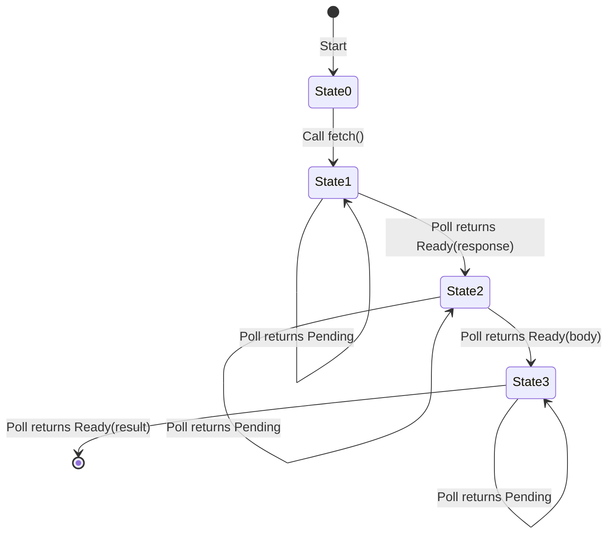
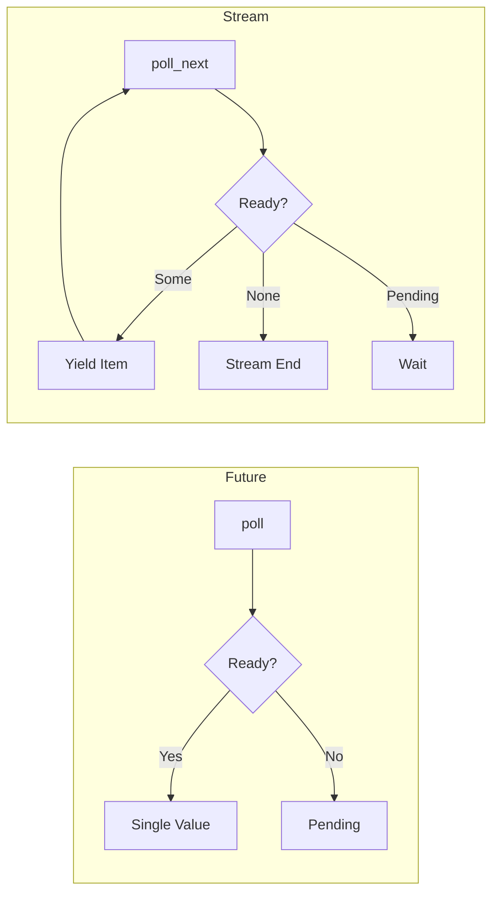
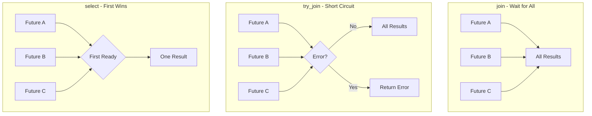
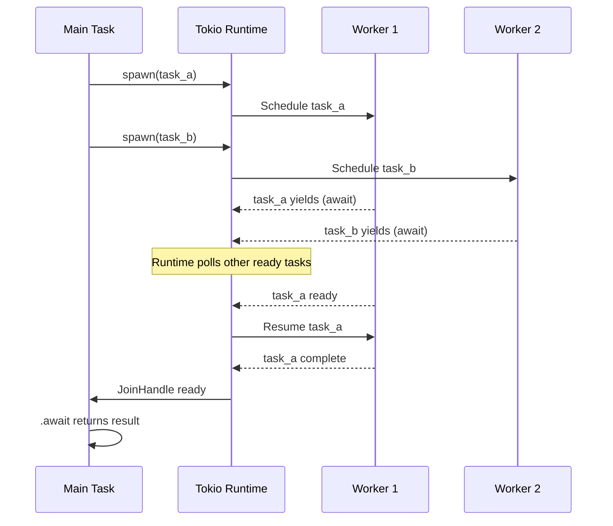

# How to Use Rust Futures and Streams

Author: [nawazdhandala](https://www.github.com/nawazdhandala)

Tags: Rust, Async, Futures, Streams, Tokio, Concurrency, Performance

Description: A hands-on guide to mastering Rust's async programming model with Futures, Streams, and the Tokio runtime for building high-performance concurrent applications.

---

Async programming in Rust is powerful but can feel intimidating at first. The ownership model combined with asynchronous execution creates a learning curve that trips up even experienced developers. But once you understand how Futures and Streams work under the hood, you unlock the ability to write highly concurrent, memory-safe code that rivals the performance of hand-tuned C.

This guide walks through the core concepts, shows you what happens behind the scenes with async/await, and provides practical patterns you can use in production.

## The Future Trait - Foundation of Async Rust

At its core, a Future represents a value that might not be available yet. Unlike JavaScript Promises that start executing immediately, Rust Futures are lazy - they do nothing until polled.

Here is the simplified Future trait definition.

```rust
// The Future trait is the foundation of all async code in Rust
// It represents an asynchronous computation that may not have completed yet
pub trait Future {
    // The type of value produced when the future completes
    type Output;

    // Poll checks if the future has completed
    // Returns Poll::Ready(value) when done, Poll::Pending when still waiting
    // The Context contains a Waker to notify when progress can be made
    fn poll(self: Pin<&mut Self>, cx: &mut Context<'_>) -> Poll<Self::Output>;
}

// Poll is a simple enum representing the state of a future
pub enum Poll<T> {
    Ready(T),    // Computation finished, here's the result
    Pending,     // Not done yet, will wake you when ready
}
```

The key insight is that `poll` returns immediately. If the value is not ready, it returns `Pending` and the runtime moves on to other work. When the underlying operation completes (network data arrives, timer fires, etc.), the `Waker` inside the `Context` gets called, signaling the runtime to poll this future again.

## How async/await Works Under the Hood

When you write `async fn` or `async {}`, the compiler transforms your code into a state machine that implements the `Future` trait. Each `.await` point becomes a state transition.

Consider this simple async function.

```rust
// This async function looks straightforward
async fn fetch_and_process(url: &str) -> Result<String, Error> {
    // First await point - state 0 -> state 1
    let response = fetch(url).await?;

    // Second await point - state 1 -> state 2
    let body = response.text().await?;

    // Third await point - state 2 -> state 3 (complete)
    let processed = process(body).await?;

    Ok(processed)
}
```

The compiler generates something conceptually like this state machine.

```rust
// Compiler-generated state machine (simplified for illustration)
// Each await point becomes a variant holding the data needed for that state
enum FetchAndProcessState {
    // Initial state - haven't started yet
    State0 { url: String },

    // Waiting on fetch() - store the future we're polling
    State1 { fetch_future: FetchFuture },

    // Waiting on response.text() - store response and the text future
    State2 { response: Response, text_future: TextFuture },

    // Waiting on process() - store the process future
    State3 { process_future: ProcessFuture },
}

impl Future for FetchAndProcessFuture {
    type Output = Result<String, Error>;

    fn poll(self: Pin<&mut Self>, cx: &mut Context<'_>) -> Poll<Self::Output> {
        // State machine transitions based on current state
        loop {
            match self.state {
                State0 { url } => {
                    // Start the fetch, transition to State1
                    let fetch_future = fetch(url);
                    self.state = State1 { fetch_future };
                }
                State1 { fetch_future } => {
                    // Poll the fetch future
                    match Pin::new(fetch_future).poll(cx) {
                        Poll::Ready(Ok(response)) => {
                            // Got response, start text extraction
                            let text_future = response.text();
                            self.state = State2 { response, text_future };
                        }
                        Poll::Ready(Err(e)) => return Poll::Ready(Err(e)),
                        Poll::Pending => return Poll::Pending,
                    }
                }
                // ... similar for State2 and State3
            }
        }
    }
}
```

This visualization shows the state machine flow.



Understanding this transformation helps explain why async Rust has certain constraints - like why you cannot hold a reference across an await point in certain situations, or why some types are not `Send` across threads.

## Creating Custom Futures

Sometimes you need to implement Future manually. A common case is wrapping a callback-based API or creating specialized synchronization primitives.

Here is a simple delay future that completes after a specified duration.

```rust
use std::future::Future;
use std::pin::Pin;
use std::task::{Context, Poll};
use std::time::{Duration, Instant};

// A future that completes after a specified delay
// This is a simplified version - real implementations use the runtime's timer
struct Delay {
    // When this future should complete
    deadline: Instant,
}

impl Delay {
    fn new(duration: Duration) -> Self {
        Delay {
            deadline: Instant::now() + duration,
        }
    }
}

impl Future for Delay {
    type Output = ();

    fn poll(self: Pin<&mut Self>, cx: &mut Context<'_>) -> Poll<Self::Output> {
        if Instant::now() >= self.deadline {
            // Time has passed, we're done
            Poll::Ready(())
        } else {
            // Not ready yet - schedule a wake-up
            // In a real implementation, you'd register with the runtime's timer
            // For now, we just tell it to check again soon
            cx.waker().wake_by_ref();
            Poll::Pending
        }
    }
}

// Usage
async fn example() {
    println!("Starting delay...");
    Delay::new(Duration::from_secs(1)).await;
    println!("Delay complete!");
}
```

A more practical example is a future that waits for a one-shot channel message.

```rust
use std::sync::{Arc, Mutex};
use std::task::Waker;

// Shared state between sender and receiver
struct Inner<T> {
    value: Option<T>,
    waker: Option<Waker>,
    closed: bool,
}

// The receiving end - implements Future
pub struct Receiver<T> {
    inner: Arc<Mutex<Inner<T>>>,
}

// The sending end
pub struct Sender<T> {
    inner: Arc<Mutex<Inner<T>>>,
}

impl<T> Future for Receiver<T> {
    type Output = Option<T>;

    fn poll(self: Pin<&mut Self>, cx: &mut Context<'_>) -> Poll<Self::Output> {
        let mut inner = self.inner.lock().unwrap();

        // Check if a value has been sent
        if let Some(value) = inner.value.take() {
            return Poll::Ready(Some(value));
        }

        // Check if sender was dropped without sending
        if inner.closed {
            return Poll::Ready(None);
        }

        // Store the waker so sender can wake us when ready
        inner.waker = Some(cx.waker().clone());
        Poll::Pending
    }
}

impl<T> Sender<T> {
    pub fn send(self, value: T) {
        let mut inner = self.inner.lock().unwrap();
        inner.value = Some(value);

        // Wake the receiver if it's waiting
        if let Some(waker) = inner.waker.take() {
            waker.wake();
        }
    }
}
```

## The Stream Trait - Async Iterators

While a Future produces a single value, a Stream produces multiple values over time. Think of it as the async version of Iterator.

```rust
// Stream is like Iterator but async
// It yields items one at a time, with each item potentially requiring async work
pub trait Stream {
    // The type of items yielded by the stream
    type Item;

    // Poll for the next item
    // Returns Poll::Ready(Some(item)) when an item is available
    // Returns Poll::Ready(None) when the stream is exhausted
    // Returns Poll::Pending when waiting for the next item
    fn poll_next(self: Pin<&mut Self>, cx: &mut Context<'_>) -> Poll<Option<Self::Item>>;
}
```

Here is how Futures and Streams compare.



## Working with Streams in Practice

The `futures` crate provides the `StreamExt` trait with useful combinators. The `tokio-stream` crate offers Tokio-specific stream utilities.

Creating and consuming streams.

```rust
use futures::stream::{self, StreamExt};
use tokio_stream::wrappers::ReceiverStream;

async fn stream_examples() {
    // Create a stream from an iterator
    let number_stream = stream::iter(vec![1, 2, 3, 4, 5]);

    // Collect all items into a vector
    let numbers: Vec<i32> = number_stream.collect().await;
    println!("Collected: {:?}", numbers);

    // Create a stream that yields values with delays
    let interval_stream = tokio_stream::wrappers::IntervalStream::new(
        tokio::time::interval(Duration::from_millis(100))
    );

    // Take first 5 ticks and process them
    interval_stream
        .take(5)
        .enumerate()
        .for_each(|(i, _)| async move {
            println!("Tick {}", i);
        })
        .await;
}
```

Transforming streams with map, filter, and other combinators.

```rust
use futures::stream::{self, StreamExt};

async fn transform_stream() {
    let numbers = stream::iter(1..=10);

    // Chain multiple transformations
    // Each combinator returns a new stream wrapping the previous one
    let result: Vec<i32> = numbers
        // Keep only even numbers
        .filter(|n| futures::future::ready(n % 2 == 0))
        // Square each number
        .map(|n| n * n)
        // Skip the first result
        .skip(1)
        // Take at most 3 items
        .take(3)
        .collect()
        .await;

    // Result: [16, 36, 64] (squares of 4, 6, 8)
    println!("Transformed: {:?}", result);
}
```

Processing streams concurrently with buffered execution.

```rust
use futures::stream::{self, StreamExt};
use std::time::Duration;

// Simulate an async operation that takes time
async fn fetch_data(id: u32) -> String {
    tokio::time::sleep(Duration::from_millis(100)).await;
    format!("Data for {}", id)
}

async fn concurrent_stream_processing() {
    let ids = stream::iter(1..=10);

    // Process up to 4 items concurrently
    // buffer_unordered allows items to complete in any order (faster)
    // buffered would preserve order but might be slower
    let results: Vec<String> = ids
        .map(|id| fetch_data(id))
        .buffer_unordered(4)  // Concurrency limit of 4
        .collect()
        .await;

    // All 10 items processed, but only 4 at a time
    println!("Results: {:?}", results);
}
```

## Creating Custom Streams

Implementing a custom stream for a paginated API.

```rust
use futures::stream::Stream;
use std::pin::Pin;
use std::task::{Context, Poll};

// A stream that fetches pages from an API until exhausted
struct PaginatedStream {
    client: ApiClient,
    next_page: Option<String>,
    current_items: Vec<Item>,
    fetch_future: Option<Pin<Box<dyn Future<Output = ApiResponse> + Send>>>,
}

impl PaginatedStream {
    fn new(client: ApiClient, initial_url: String) -> Self {
        PaginatedStream {
            client,
            next_page: Some(initial_url),
            current_items: Vec::new(),
            fetch_future: None,
        }
    }
}

impl Stream for PaginatedStream {
    type Item = Result<Item, Error>;

    fn poll_next(mut self: Pin<&mut Self>, cx: &mut Context<'_>) -> Poll<Option<Self::Item>> {
        loop {
            // If we have buffered items, return the next one
            if let Some(item) = self.current_items.pop() {
                return Poll::Ready(Some(Ok(item)));
            }

            // If we're currently fetching a page, poll that future
            if let Some(ref mut future) = self.fetch_future {
                match future.as_mut().poll(cx) {
                    Poll::Ready(response) => {
                        self.fetch_future = None;
                        self.current_items = response.items;
                        self.next_page = response.next_page_url;
                        // Loop back to check current_items
                        continue;
                    }
                    Poll::Pending => return Poll::Pending,
                }
            }

            // If there's a next page to fetch, start fetching
            if let Some(url) = self.next_page.take() {
                let client = self.client.clone();
                self.fetch_future = Some(Box::pin(async move {
                    client.fetch_page(&url).await
                }));
                // Loop back to poll the new future
                continue;
            }

            // No more pages and no more items - stream is done
            return Poll::Ready(None);
        }
    }
}

// Usage
async fn fetch_all_items(client: ApiClient) -> Vec<Item> {
    let stream = PaginatedStream::new(client, "/api/items?page=1".into());
    stream.try_collect().await.unwrap()
}
```

Using the async-stream crate for simpler stream creation.

```rust
use async_stream::stream;
use futures::stream::Stream;

// The stream! macro provides a generator-like syntax for creating streams
// Much more ergonomic than implementing Stream manually
fn countdown(from: u32) -> impl Stream<Item = u32> {
    stream! {
        for i in (0..=from).rev() {
            // Yield values using the yield keyword
            yield i;
            // Can use await for async operations between yields
            tokio::time::sleep(Duration::from_millis(100)).await;
        }
    }
}

async fn use_countdown() {
    let mut stream = std::pin::pin!(countdown(5));

    while let Some(n) = stream.next().await {
        println!("{}...", n);
    }
    println!("Liftoff!");
}
```

## Combining Futures

Rust provides several ways to combine multiple futures. Choosing the right combinator depends on whether you need all results, just the first, or some subset.

### join - Wait for all futures

```rust
use tokio::join;

async fn fetch_user(id: u64) -> User { /* ... */ }
async fn fetch_posts(user_id: u64) -> Vec<Post> { /* ... */ }
async fn fetch_notifications(user_id: u64) -> Vec<Notification> { /* ... */ }

async fn load_dashboard(user_id: u64) -> Dashboard {
    // join! runs all futures concurrently and waits for ALL to complete
    // Much faster than sequential awaits when operations are independent
    let (user, posts, notifications) = join!(
        fetch_user(user_id),
        fetch_posts(user_id),
        fetch_notifications(user_id)
    );

    Dashboard { user, posts, notifications }
}
```

### try_join - Short circuit on first error

```rust
use tokio::try_join;

async fn load_dashboard_with_errors(user_id: u64) -> Result<Dashboard, Error> {
    // try_join! returns immediately if ANY future returns an error
    // Other futures are cancelled (dropped) when this happens
    let (user, posts, notifications) = try_join!(
        fetch_user(user_id),
        fetch_posts(user_id),
        fetch_notifications(user_id)
    )?;

    Ok(Dashboard { user, posts, notifications })
}
```

### select - Race futures, take first result

```rust
use tokio::select;
use tokio::time::{sleep, Duration};

async fn fetch_with_timeout<T>(
    future: impl Future<Output = T>,
    timeout: Duration,
) -> Option<T> {
    // select! polls multiple futures and returns when the FIRST completes
    // Other branches are cancelled
    select! {
        result = future => Some(result),
        _ = sleep(timeout) => {
            println!("Operation timed out");
            None
        }
    }
}

// More complex select with multiple branches
async fn handle_events(
    mut rx: tokio::sync::mpsc::Receiver<Event>,
    mut shutdown: tokio::sync::broadcast::Receiver<()>,
) {
    loop {
        select! {
            // biased makes select check branches in order (deterministic)
            // Without biased, selection is random when multiple are ready
            biased;

            // Check shutdown signal first
            _ = shutdown.recv() => {
                println!("Shutdown signal received");
                break;
            }

            // Then check for incoming events
            Some(event) = rx.recv() => {
                process_event(event).await;
            }

            // If channel closed, exit
            else => {
                println!("Channel closed");
                break;
            }
        }
    }
}
```

Here is a visual comparison of these patterns.



## The Tokio Runtime

Futures need a runtime to execute. Tokio is the most popular async runtime for Rust, providing a multi-threaded scheduler, timers, I/O drivers, and synchronization primitives.

### Basic runtime setup

```rust
// The simplest way - use the macro to set up the runtime
#[tokio::main]
async fn main() {
    println!("Running on Tokio!");
    do_async_work().await;
}

// Equivalent manual setup - useful when you need more control
fn main() {
    let runtime = tokio::runtime::Runtime::new().unwrap();

    runtime.block_on(async {
        println!("Running on Tokio!");
        do_async_work().await;
    });
}
```

### Configuring the runtime

```rust
use tokio::runtime::Builder;

fn main() {
    // Multi-threaded runtime with custom configuration
    let runtime = Builder::new_multi_thread()
        // Number of worker threads (default is number of CPU cores)
        .worker_threads(4)
        // Stack size for each worker thread
        .thread_stack_size(3 * 1024 * 1024)
        // Name prefix for worker threads (useful for debugging)
        .thread_name("my-app-worker")
        // Enable all Tokio features (time, I/O)
        .enable_all()
        .build()
        .unwrap();

    runtime.block_on(main_async());
}

// For CPU-bound applications or when you want explicit control
fn single_threaded_runtime() {
    // Current-thread runtime - everything runs on one thread
    // Lower overhead, but no parallelism
    let runtime = Builder::new_current_thread()
        .enable_all()
        .build()
        .unwrap();

    runtime.block_on(async {
        // All tasks run on this thread
    });
}
```

### Spawning tasks

```rust
use tokio::task;

async fn demonstrate_spawning() {
    // spawn creates a new task that runs concurrently
    // Returns a JoinHandle to await the result
    let handle = task::spawn(async {
        // This runs on the runtime's thread pool
        expensive_computation().await
    });

    // Do other work while the task runs
    do_other_work().await;

    // Wait for the spawned task and get its result
    let result = handle.await.unwrap();

    // spawn_blocking is for CPU-intensive or blocking operations
    // Runs on a separate thread pool to avoid blocking async workers
    let blocking_result = task::spawn_blocking(|| {
        // This runs on a dedicated blocking thread
        // Safe to do CPU-heavy work or call blocking APIs here
        heavy_sync_computation()
    }).await.unwrap();
}
```

### Task lifecycle visualization



## Practical Async Patterns

### Pattern 1: Graceful shutdown with cancellation

```rust
use tokio::sync::broadcast;
use tokio::signal;

async fn run_server() {
    // Create a broadcast channel for shutdown signaling
    // All receivers get notified when sender broadcasts
    let (shutdown_tx, _) = broadcast::channel::<()>(1);

    // Spawn worker tasks, each with its own shutdown receiver
    for i in 0..4 {
        let mut shutdown_rx = shutdown_tx.subscribe();

        tokio::spawn(async move {
            loop {
                tokio::select! {
                    // Normal work
                    _ = do_work(i) => {}

                    // Shutdown signal received
                    _ = shutdown_rx.recv() => {
                        println!("Worker {} shutting down gracefully", i);
                        cleanup(i).await;
                        break;
                    }
                }
            }
        });
    }

    // Wait for Ctrl+C
    signal::ctrl_c().await.unwrap();
    println!("Shutdown signal received, notifying workers...");

    // Broadcast shutdown to all workers
    let _ = shutdown_tx.send(());

    // Give workers time to clean up
    tokio::time::sleep(Duration::from_secs(5)).await;
}
```

### Pattern 2: Rate limiting with semaphores

```rust
use std::sync::Arc;
use tokio::sync::Semaphore;

struct RateLimitedClient {
    client: reqwest::Client,
    // Semaphore limits concurrent requests
    semaphore: Arc<Semaphore>,
}

impl RateLimitedClient {
    fn new(max_concurrent: usize) -> Self {
        RateLimitedClient {
            client: reqwest::Client::new(),
            semaphore: Arc::new(Semaphore::new(max_concurrent)),
        }
    }

    async fn fetch(&self, url: &str) -> Result<String, Error> {
        // Acquire permit - blocks if at limit
        // Permit is automatically released when dropped
        let _permit = self.semaphore.acquire().await.unwrap();

        // Now we have permission to make a request
        let response = self.client.get(url).send().await?;
        let body = response.text().await?;

        Ok(body)
        // _permit dropped here, releasing the slot
    }
}

// Usage - even with 100 concurrent calls, only max_concurrent run at once
async fn fetch_many_urls(client: &RateLimitedClient, urls: Vec<String>) {
    let futures: Vec<_> = urls
        .into_iter()
        .map(|url| client.fetch(&url))
        .collect();

    // All 100 futures start, but semaphore limits actual concurrency
    let results = futures::future::join_all(futures).await;
}
```

### Pattern 3: Retry with exponential backoff

```rust
use std::time::Duration;
use tokio::time::sleep;

async fn retry_with_backoff<T, E, F, Fut>(
    mut operation: F,
    max_retries: u32,
    initial_delay: Duration,
) -> Result<T, E>
where
    F: FnMut() -> Fut,
    Fut: Future<Output = Result<T, E>>,
    E: std::fmt::Debug,
{
    let mut delay = initial_delay;
    let mut attempts = 0;

    loop {
        match operation().await {
            Ok(value) => return Ok(value),
            Err(e) => {
                attempts += 1;

                if attempts >= max_retries {
                    println!("Max retries ({}) exceeded", max_retries);
                    return Err(e);
                }

                println!(
                    "Attempt {} failed: {:?}. Retrying in {:?}...",
                    attempts, e, delay
                );

                sleep(delay).await;

                // Exponential backoff with cap
                delay = std::cmp::min(delay * 2, Duration::from_secs(60));
            }
        }
    }
}

// Usage
async fn fetch_with_retry(url: &str) -> Result<String, reqwest::Error> {
    retry_with_backoff(
        || async { reqwest::get(url).await?.text().await },
        5,                              // max retries
        Duration::from_millis(100),     // initial delay
    ).await
}
```

### Pattern 4: Fan-out/fan-in with bounded concurrency

```rust
use futures::stream::{self, StreamExt};

async fn process_batch<T, R, F, Fut>(
    items: Vec<T>,
    concurrency: usize,
    processor: F,
) -> Vec<R>
where
    F: Fn(T) -> Fut,
    Fut: Future<Output = R>,
{
    // Convert items to a stream
    stream::iter(items)
        // Map each item to a future
        .map(|item| processor(item))
        // Process up to `concurrency` items at a time
        // buffer_unordered allows results in any order (faster)
        .buffer_unordered(concurrency)
        // Collect all results
        .collect()
        .await
}

// Usage
async fn process_users(user_ids: Vec<u64>) -> Vec<UserData> {
    process_batch(
        user_ids,
        10,  // Process 10 users concurrently
        |id| async move {
            fetch_user_data(id).await
        },
    ).await
}
```

### Pattern 5: Timeout wrapper

```rust
use tokio::time::{timeout, Duration};

// Generic timeout wrapper for any async operation
async fn with_timeout<T>(
    duration: Duration,
    future: impl Future<Output = T>,
) -> Result<T, &'static str> {
    timeout(duration, future)
        .await
        .map_err(|_| "Operation timed out")
}

// Usage with custom error handling
async fn fetch_with_timeout(url: &str) -> Result<String, ApiError> {
    let duration = Duration::from_secs(30);

    match timeout(duration, fetch(url)).await {
        Ok(Ok(response)) => Ok(response),
        Ok(Err(e)) => Err(ApiError::Request(e)),
        Err(_) => Err(ApiError::Timeout),
    }
}
```

## Common Pitfalls and How to Avoid Them

### Pitfall 1: Blocking the async runtime

```rust
// BAD: This blocks the entire worker thread
async fn bad_blocking() {
    // std::thread::sleep blocks the thread, not just this task
    std::thread::sleep(Duration::from_secs(1));

    // Heavy computation blocks other tasks from running
    let result = (0..1_000_000).sum::<u64>();
}

// GOOD: Use async-aware alternatives
async fn good_async() {
    // tokio::time::sleep yields control back to the runtime
    tokio::time::sleep(Duration::from_secs(1)).await;

    // Move CPU-heavy work to the blocking thread pool
    let result = tokio::task::spawn_blocking(|| {
        (0..1_000_000).sum::<u64>()
    }).await.unwrap();
}
```

### Pitfall 2: Holding locks across await points

```rust
use tokio::sync::Mutex;

// BAD: Lock held across await - can cause deadlocks
async fn bad_lock(data: &Mutex<Vec<i32>>) {
    let mut guard = data.lock().await;

    // If fetch_more_data tries to acquire the same lock, deadlock!
    let more = fetch_more_data().await;  // Lock still held here

    guard.extend(more);
}

// GOOD: Minimize lock scope
async fn good_lock(data: &Mutex<Vec<i32>>) {
    // Fetch data first, before acquiring lock
    let more = fetch_more_data().await;

    // Lock only for the actual mutation
    let mut guard = data.lock().await;
    guard.extend(more);
    // Lock released immediately when guard goes out of scope
}

// ALTERNATIVE: Use interior mutability patterns
async fn alternative_approach(data: &Mutex<Vec<i32>>) {
    let more = fetch_more_data().await;

    // Explicit scope to release lock quickly
    {
        data.lock().await.extend(more);
    }

    // Lock is definitely released here
    do_more_async_work().await;
}
```

### Pitfall 3: Creating futures without polling them

```rust
// BAD: Future created but never awaited - does nothing!
async fn bad_fire_and_forget() {
    let _ = send_email();  // This future is immediately dropped
    // Email never sent!
}

// GOOD: Actually await the future
async fn good_explicit() {
    send_email().await;  // Wait for completion
}

// GOOD: Spawn if you truly want fire-and-forget
async fn good_spawn() {
    // Task runs independently, we don't wait for it
    tokio::spawn(send_email());
}

// GOOD: Spawn and handle errors
async fn good_spawn_with_handling() {
    tokio::spawn(async {
        if let Err(e) = send_email().await {
            eprintln!("Failed to send email: {}", e);
        }
    });
}
```

## Summary

Rust's async model takes some getting used to, but the payoff is substantial. By understanding how Futures and Streams work under the hood, you can write code that handles thousands of concurrent connections with minimal memory overhead and without the foot-guns of shared mutable state.

Key takeaways:

| Concept | What to Remember |
|---------|------------------|
| Futures | Lazy, poll-based, single value |
| Streams | Async iterators, multiple values |
| async/await | Compiler generates state machines |
| join! | Wait for all, run concurrently |
| select! | Race futures, first wins |
| spawn | Fire off independent tasks |
| spawn_blocking | Escape hatch for sync/CPU work |

The patterns shown here - graceful shutdown, rate limiting, retry logic, bounded concurrency - appear in virtually every production async Rust application. Master them and you will be well equipped to build robust, high-performance systems.

Start simple with async/await and Tokio, then gradually introduce Streams and custom Futures as your needs grow. The ecosystem continues to mature, and what feels complex today becomes second nature with practice.
